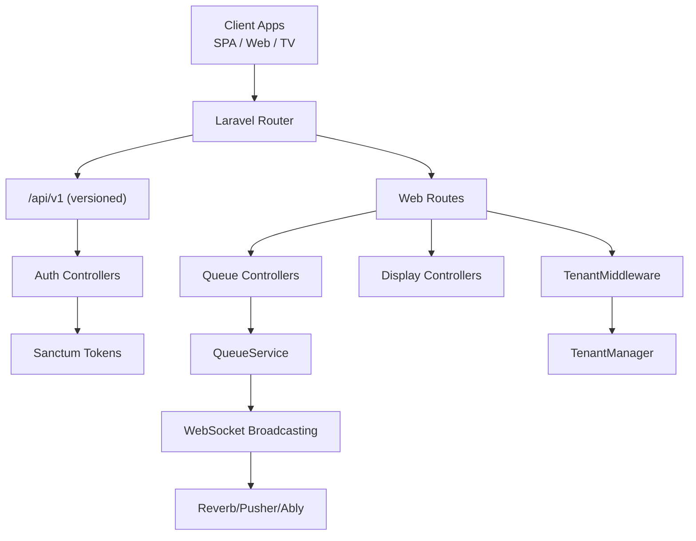
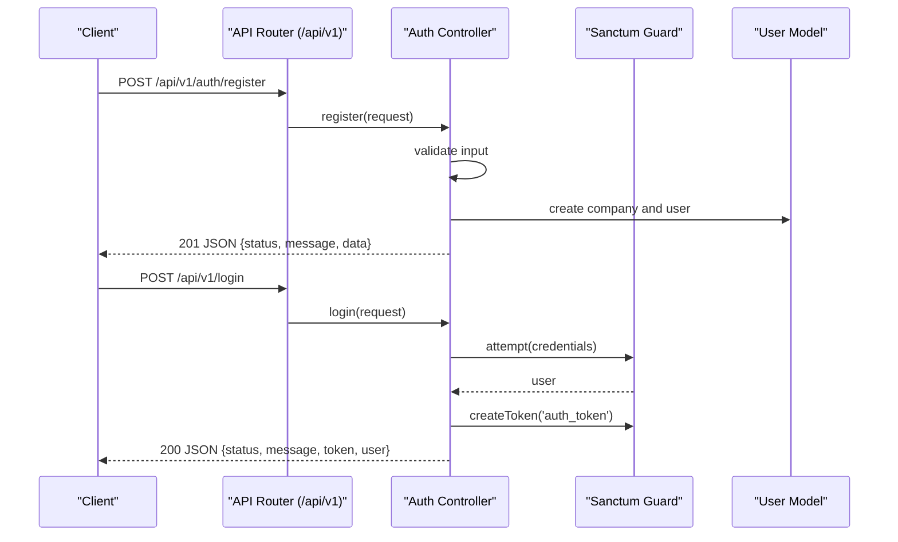
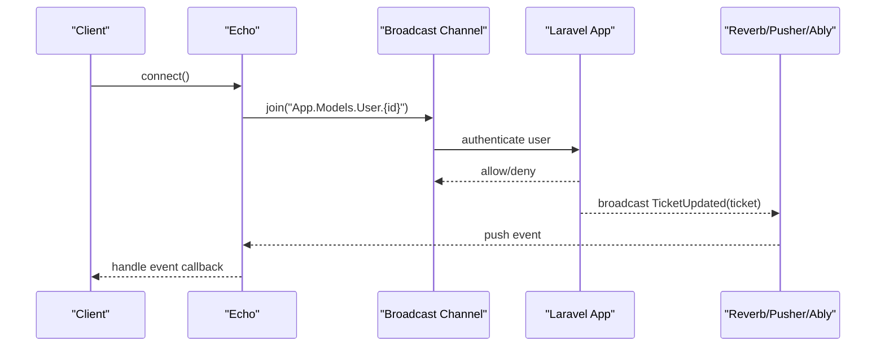
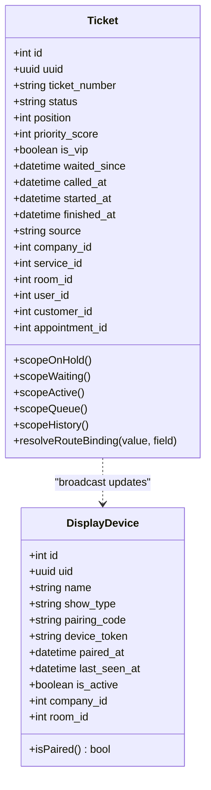
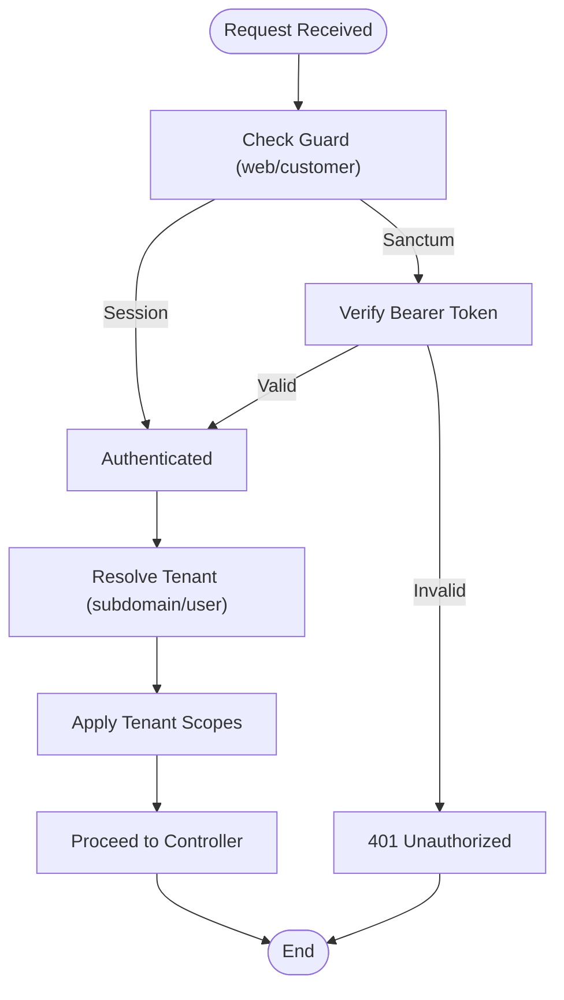
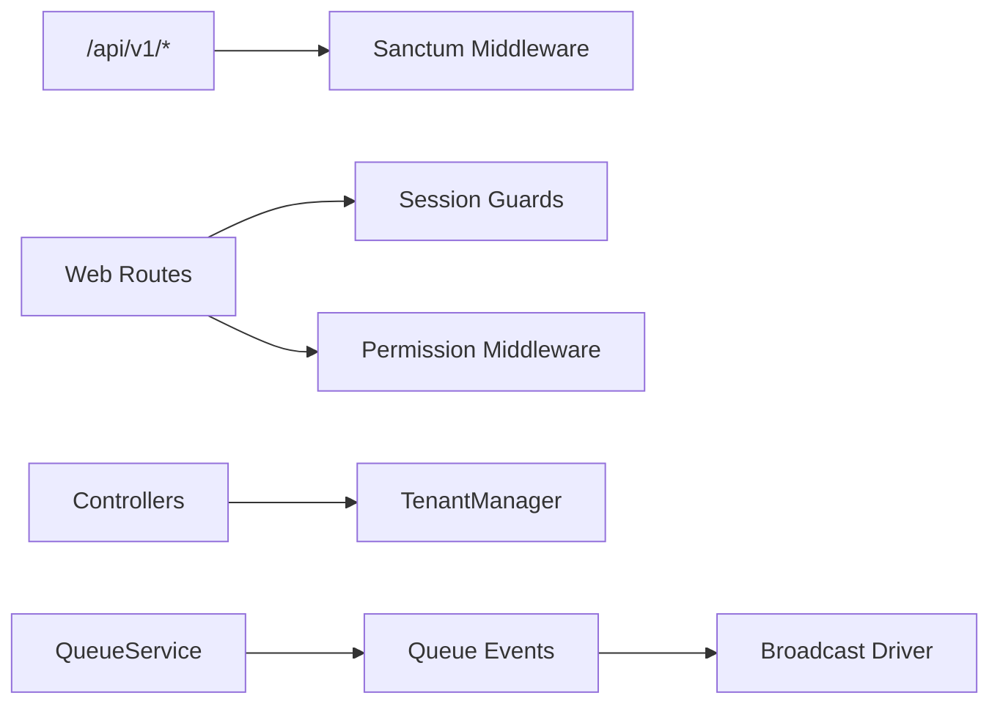

# API Reference

<cite>
**Referenced Files in This Document**
- [routes/api.php](file://routes/api.php)
- [routes/web.php](file://routes/web.php)
- [routes/channels.php](file://routes/channels.php)
- [config/auth.php](file://config/auth.php)
- [config/sanctum.php](file://config/sanctum.php)
- [config/broadcasting.php](file://config/broadcasting.php)
- [config/reverb.php](file://config/reverb.php)
- [app/Http/Controllers/Controller.php](file://app/Http/Controllers/Controller.php)
- [app/Http/Middleware/TenantMiddleware.php](file://app/Http/Middleware/TenantMiddleware.php)
- [app/Services/TenantManager.php](file://app/Services/TenantManager.php)
- [app/Modules/Auth/Controllers/RegisterController.php](file://app/Modules/Auth/Controllers/RegisterController.php)
- [app/Modules/Auth/Controllers/LoginController.php](file://app/Modules/Auth/Controllers/LoginController.php)
- [app/Modules/Displays/Controllers/DisplayDeviceController.php](file://app/Modules/Displays/Controllers/DisplayDeviceController.php)
- [app/Modules/Displays/Models/DisplayDevice.php](file://app/Modules/Displays/Models/DisplayDevice.php)
- [app/Modules/Queue/Controllers/DisplayController.php](file://app/Modules/Queue/Controllers/DisplayController.php)
- [app/Modules/Queue/Controllers/TicketController.php](file://app/Modules/Queue/Controllers/TicketController.php)
- [app/Modules/Queue/Services/QueueService.php](file://app/Modules/Queue/Services/QueueService.php)
- [app/Modules/Queue/Models/Ticket.php](file://app/Modules/Queue/Models/Ticket.php)
</cite>

## Table of Contents
1. [Introduction](#introduction)
2. [Project Structure](#project-structure)
3. [Core Components](#core-components)
4. [Architecture Overview](#architecture-overview)
5. [Detailed Component Analysis](#detailed-component-analysis)
6. [Dependency Analysis](#dependency-analysis)
7. [Performance Considerations](#performance-considerations)
8. [Troubleshooting Guide](#troubleshooting-guide)
9. [Conclusion](#conclusion)
10. [Appendices](#appendices)

## Introduction
This document provides comprehensive API documentation for Noubtigo’s RESTful endpoints and WebSocket interfaces. It covers:
- HTTP endpoints for both web and API usage, including URL patterns, HTTP methods, request/response schemas, and authentication requirements
- Real-time queue updates via WebSocket channels
- Authentication mechanisms (session-based, API tokens via Sanctum, and tenant isolation)
- Rate limiting and API versioning strategy
- Client integration examples, common usage patterns, and error handling strategies
- CORS configuration and browser compatibility considerations

## Project Structure
Noubtigo organizes routes into two primary groups:
- API routes under a versioned prefix (/api/v1)
- Web routes for traditional web interactions and public screens

Key routing and middleware touchpoints:
- Versioned API routes grouped under /api/v1
- Web routes for dashboards, queue displays, customer portal, and administrative sections
- Tenant identification via subdomain or authenticated user context
- Broadcasting configured via Reverb/Pusher/Ably with channel definitions

**Diagram sources**
- [routes/api.php:11-23](file://routes/api.php#L11-L23)
- [routes/web.php:10-293](file://routes/web.php#L10-L293)
- [app/Http/Middleware/TenantMiddleware.php:22-50](file://app/Http/Middleware/TenantMiddleware.php#L22-L50)
- [app/Services/TenantManager.php:17-44](file://app/Services/TenantManager.php#L17-L44)
- [config/broadcasting.php:33-78](file://config/broadcasting.php#L33-L78)

**Section sources**
- [routes/api.php:11-23](file://routes/api.php#L11-L23)
- [routes/web.php:10-293](file://routes/web.php#L10-L293)
- [app/Http/Middleware/TenantMiddleware.php:22-50](file://app/Http/Middleware/TenantMiddleware.php#L22-L50)
- [app/Services/TenantManager.php:17-44](file://app/Services/TenantManager.php#L17-L44)
- [config/broadcasting.php:33-78](file://config/broadcasting.php#L33-L78)

## Core Components
- Authentication
  - Session-based authentication for web routes (guards: web, customer)
  - API token authentication via Laravel Sanctum for /api/v1 routes
- Authorization
  - Middleware-based permissions for protected routes (e.g., queue.*, rbac.*, analytics)
- Tenant Isolation
  - Tenant identified by subdomain or authenticated user; enforced via TenantMiddleware and TenantManager
- Broadcasting
  - WebSocket channels for real-time updates using Reverb/Pusher/Ably
- Queue Operations
  - Ticket lifecycle management via QueueService and TicketController

**Section sources**
- [config/auth.php:40-48](file://config/auth.php#L40-L48)
- [config/sanctum.php:18-23](file://config/sanctum.php#L18-L23)
- [app/Http/Middleware/TenantMiddleware.php:22-50](file://app/Http/Middleware/TenantMiddleware.php#L22-L50)
- [app/Services/TenantManager.php:17-44](file://app/Services/TenantManager.php#L17-L44)
- [config/broadcasting.php:33-78](file://config/broadcasting.php#L33-L78)

## Architecture Overview
The system separates concerns across routing, controllers, services, and broadcasting:
- API requests are versioned and authenticated via Sanctum
- Web requests use session-based auth and are protected by middleware
- Tenant context is resolved centrally and applied to queries and broadcasts
- Real-time updates are published to channels and consumed by clients

**Diagram sources**
- [routes/api.php:11-23](file://routes/api.php#L11-L23)
- [app/Modules/Auth/Controllers/RegisterController.php:33-84](file://app/Modules/Auth/Controllers/RegisterController.php#L33-L84)
- [app/Modules/Auth/Controllers/LoginController.php:23-92](file://app/Modules/Auth/Controllers/LoginController.php#L23-L92)
- [config/sanctum.php:37](file://config/sanctum.php#L37)

**Section sources**
- [routes/api.php:11-23](file://routes/api.php#L11-L23)
- [app/Modules/Auth/Controllers/RegisterController.php:33-84](file://app/Modules/Auth/Controllers/RegisterController.php#L33-L84)
- [app/Modules/Auth/Controllers/LoginController.php:23-92](file://app/Modules/Auth/Controllers/LoginController.php#L23-L92)
- [config/sanctum.php:37](file://config/sanctum.php#L37)

## Detailed Component Analysis

### API v1 Authentication Endpoints
- Public Registration
  - Method: POST
  - URL: /api/v1/auth/register
  - Authentication: None
  - Request JSON Schema:
    - Required: company_name, first_name, last_name, email, password, password_confirmation
    - Optional: phone, timezone, plan
  - Response JSON Schema:
    - Success: { status: "success", message: string, data: object }
    - Validation Error: { status: "error", errors: object }
    - Server Error: { status: "error", message: string, error: string }
  - Notes:
    - Validates uniqueness of email and optional plan slug existence
    - Returns 201 on success; 422 on validation failure; 500 on server error

- Login (API Token)
  - Method: POST
  - URL: /api/v1/login
  - Authentication: None
  - Request JSON Schema:
    - Required: login (email or username), password
  - Response JSON Schema:
    - Success: { status: "success", message: string, token: string, user: object }
    - Validation Error: { status: "error", errors: object }
    - Unauthorized: { status: "error", message: string }
  - Notes:
    - Creates a personal access token named "auth_token"
    - Uses session guard for web fallback; returns token for API clients

- Logout
  - Method: POST
  - URL: /api/v1/logout
  - Authentication: Sanctum-protected
  - Response JSON Schema:
    - Success: { message: string }

- Get Current User
  - Method: GET
  - URL: /api/v1/user
  - Authentication: Sanctum-required
  - Response JSON Schema:
    - Success: { id, email, name, company: { id, name, slug }, ... }

**Section sources**
- [routes/api.php:11-23](file://routes/api.php#L11-L23)
- [app/Modules/Auth/Controllers/RegisterController.php:33-84](file://app/Modules/Auth/Controllers/RegisterController.php#L33-L84)
- [app/Modules/Auth/Controllers/LoginController.php:23-92](file://app/Modules/Auth/Controllers/LoginController.php#L23-L92)

### Web Routes and Public Screens
- Public Queue Display
  - Method: GET
  - URL: /queue/display/{room:slug?}
  - Response: HTML page or JSON (when expectsJson)
  - JSON Schema (JSON response):
    - { active: array of tickets, waiting: array of tickets }

- Display Device Setup and Authorization
  - Setup (TV):
    - Method: GET
    - URL: /display/setup/{uid?}
  - Device Authorization:
    - Method: POST
    - URL: /display/authorize
    - Request JSON Schema:
      - Required: pairing_code (6-digit)
    - Response JSON Schema:
      - Success: { success: true, token: string, redirect: string }
      - Error: { error: string }
  - Authorized Display View:
    - Method: GET
    - URL: /display/device/{token}
    - Response: HTML page or JSON (when expectsJson)
    - JSON Schema (JSON response):
      - { active: array of tickets, waiting: array of tickets }

- Customer Portal
  - Login/Register (public):
    - Methods: GET/POST to /customer/login, /customer/register
  - Authenticated Routes:
    - GET /customer/dashboard
    - POST /customer/logout
    - POST /customer/favorites/{company}
    - DELETE /customer/favorites/{company}
    - POST /customer/sync-ticket
    - POST /customer/add-by-code
    - GET /customer/track-company/{company}
    - GET /customer/track-ticket/{ticket}
    - POST /customer/profile

- Queue Management (Protected)
  - GET /queue (dashboard)
  - POST /queue/store
  - POST /queue/call
  - PATCH /queue/{ticket}/status
  - PATCH /queue/{ticket}/room
  - POST /queue/{ticket}/hold
  - POST /queue/{ticket}/resume
  - POST /queue/{ticket}/cancel-hold
  - POST /queue/{ticket}/cancel
  - POST /queue/reorder (advanced mode)

- Displays Management (Protected)
  - GET /displays/
  - POST /displays/
  - PATCH /displays/{device}
  - DELETE /displays/{device}

- Services and Rooms CRUD (Protected)
  - GET /services/, POST /services/, PUT /services/{service}, DELETE /services/{service}
  - GET /rooms/, POST /rooms/, PUT /rooms/{room}, DELETE /rooms/{room}

- Customers CRUD (Protected)
  - GET /customers/ajax-search
  - GET /customers/, POST /customers/, PUT /customers/{customer}, GET /customers/{customer}, DELETE /customers/{customer}, PATCH /customers/{customer}/vip

- Appointments and Slots (Protected)
  - GET /appointments/, GET /appointments/events, GET /appointments/slots-available
  - POST /appointments/, PUT /appointments/{appointment}, PATCH /appointments/{appointment}/checkin, PATCH /appointments/{appointment}/cancel, DELETE /appointments/{appointment}
  - GET /appointment-slots/, POST /appointment-slots/, PUT /appointment-slots/{slot}, DELETE /appointment-slots/{slot}

- Analytics (Protected)
  - GET /analytics/, GET /analytics/staff, GET /analytics/services, GET /analytics/wait-times, GET /analytics/export

- WhatsApp Chat (Protected)
  - GET /chat/, GET /chat/{phone}, GET /chat/{phone}/messages, POST /chat/send

- Admin and Billing (Protected)
  - Admin Payments: GET /admin/payments/, POST /admin/payments/{payment}/approve, POST /admin/payments/{payment}/reject, POST /admin/payments/{payment}/refund, GET /admin/payments/{payment}/receipt
  - Admin Subscriptions: GET /admin/subscriptions/, POST /admin/subscriptions/{subscription}/activate, POST /admin/subscriptions/{subscription}/suspend
  - Admin Invoices: GET /admin/invoices/, GET /admin/invoices/{invoice}
  - Billing: GET /billing/, POST /billing/subscribe, POST /billing/receipt, GET /billing/invoices/{invoice}

**Section sources**
- [routes/web.php:24-33](file://routes/web.php#L24-L33)
- [routes/web.php:36-55](file://routes/web.php#L36-L55)
- [routes/web.php:118-136](file://routes/web.php#L118-L136)
- [routes/web.php:151-159](file://routes/web.php#L151-L159)
- [routes/web.php:161-179](file://routes/web.php#L161-L179)
- [routes/web.php:171-179](file://routes/web.php#L171-L179)
- [routes/web.php:181-194](file://routes/web.php#L181-L194)
- [routes/web.php:196-218](file://routes/web.php#L196-L218)
- [routes/web.php:225-232](file://routes/web.php#L225-L232)
- [routes/web.php:234-242](file://routes/web.php#L234-L242)
- [routes/web.php:260-283](file://routes/web.php#L260-L283)
- [routes/web.php:285-291](file://routes/web.php#L285-L291)

### WebSocket Interfaces
- Channels
  - Private user channel: App.Models.User.{id} (authenticated user matches id)
- Broadcasting
  - Implemented via configured broadcaster (Reverb/Pusher/Ably)
  - Real-time queue updates are emitted on ticket events (e.g., TicketUpdated)
- Client Integration
  - Use Echo with configured broadcaster to subscribe to channels
  - Subscribe to user-specific channel for secure updates
  - Configure allowed origins and rate limits per application settings

**Diagram sources**
- [routes/channels.php:5-7](file://routes/channels.php#L5-L7)
- [config/broadcasting.php:33-78](file://config/broadcasting.php#L33-L78)
- [config/reverb.php:74-99](file://config/reverb.php#L74-L99)

**Section sources**
- [routes/channels.php:5-7](file://routes/channels.php#L5-L7)
- [config/broadcasting.php:33-78](file://config/broadcasting.php#L33-L78)
- [config/reverb.php:74-99](file://config/reverb.php#L74-L99)

### Queue Endpoints and Data Models
- Ticket Lifecycle
  - Create: POST /queue/store
    - Request JSON Schema:
      - Required: service_id, room_id, customer_id
      - Optional: is_vip
    - Response JSON Schema:
      - Success: { success: true, ticket: object, message: string }
      - Error: { success: false, message: string }
  - Call Next: POST /queue/call
    - Optional Body: ticket_id, room_id
    - Response JSON Schema:
      - Success: { success: true, ticket: object }
      - Not Found: { success: false, message: string }
  - Update Status: PATCH /queue/{ticket}/status
    - Path Variable: ticket (supports numeric ID or UUID)
    - Request JSON Schema:
      - Required: status (one of waiting, called, serving, done, cancelled, no_show)
    - Response JSON Schema:
      - Success: { success: true, ticket: object }
  - Change Room: PATCH /queue/{ticket}/room
    - Path Variable: ticket (supports numeric ID or UUID)
    - Request JSON Schema:
      - Required: room_id
    - Response JSON Schema:
      - Success: { success: true, ticket: object }
  - Hold/Resume/Cancel Hold: POST /queue/{ticket}/hold, POST /queue/{ticket}/resume, POST /queue/{ticket}/cancel-hold
    - Request JSON Schema:
      - Hold: reason (string), note (optional)
    - Response JSON Schema:
      - Success: { success: true, ticket: object }
      - Error: { success: false, message: string }
  - Cancel Ticket: POST /queue/{ticket}/cancel
    - Request JSON Schema:
      - Required: reason (one of predefined values), note (optional)
    - Response JSON Schema:
      - Success: { success: true, ticket: object }
  - Reorder (Advanced Mode): POST /queue/reorder
    - Request JSON Schema:
      - Required: order (array of ticket IDs)
    - Response JSON Schema:
      - Success: { success: true }

- Display Devices
  - Device Authorization:
    - POST /display/authorize
      - Request JSON Schema:
        - Required: pairing_code (6-digit)
      - Response JSON Schema:
        - Success: { success: true, token: string, redirect: string }
        - Error: { error: string }
  - Authorized Display:
    - GET /display/device/{token}
      - Response JSON Schema:
        - Success: { active: array, waiting: array }

- Data Models
  - Ticket
    - Fillable attributes include company_id, service_id, room_id, user_id, customer_id, appointment_id, ticket_number, status, source, priority_score, is_vip, position, timestamps, uuid, and cancellation/hold/resume metadata
    - Scopes: onHold, waiting, active, queue, history
    - Route Binding: accepts numeric ID or UUID
  - DisplayDevice
    - Fillable attributes include company_id, room_id, name, show_type, uid, pairing_code, device_token, paired_at, is_active, last_seen_at
    - Constants: SHOW_BOTH, SHOW_WALK_IN, SHOW_APPOINTMENT

**Diagram sources**
- [app/Modules/Queue/Models/Ticket.php:16-105](file://app/Modules/Queue/Models/Ticket.php#L16-L105)
- [app/Modules/Queue/Models/Ticket.php:188-256](file://app/Modules/Queue/Models/Ticket.php#L188-L256)
- [app/Modules/Displays/Models/DisplayDevice.php:19-53](file://app/Modules/Displays/Models/DisplayDevice.php#L19-L53)

**Section sources**
- [app/Modules/Queue/Controllers/TicketController.php:65-96](file://app/Modules/Queue/Controllers/TicketController.php#L65-L96)
- [app/Modules/Queue/Controllers/TicketController.php:115-130](file://app/Modules/Queue/Controllers/TicketController.php#L115-L130)
- [app/Modules/Queue/Controllers/TicketController.php:135-152](file://app/Modules/Queue/Controllers/TicketController.php#L135-L152)
- [app/Modules/Queue/Controllers/TicketController.php:157-171](file://app/Modules/Queue/Controllers/TicketController.php#L157-L171)
- [app/Modules/Queue/Controllers/TicketController.php:176-200](file://app/Modules/Queue/Controllers/TicketController.php#L176-L200)
- [app/Modules/Queue/Controllers/TicketController.php:205-219](file://app/Modules/Queue/Controllers/TicketController.php#L205-L219)
- [app/Modules/Queue/Controllers/TicketController.php:224-238](file://app/Modules/Queue/Controllers/TicketController.php#L224-L238)
- [app/Modules/Queue/Controllers/TicketController.php:243-261](file://app/Modules/Queue/Controllers/TicketController.php#L243-L261)
- [app/Modules/Displays/Controllers/DisplayDeviceController.php:106-134](file://app/Modules/Displays/Controllers/DisplayDeviceController.php#L106-L134)
- [app/Modules/Displays/Controllers/DisplayDeviceController.php:139-176](file://app/Modules/Displays/Controllers/DisplayDeviceController.php#L139-L176)
- [app/Modules/Queue/Models/Ticket.php:16-105](file://app/Modules/Queue/Models/Ticket.php#L16-L105)
- [app/Modules/Displays/Models/DisplayDevice.php:19-53](file://app/Modules/Displays/Models/DisplayDevice.php#L19-L53)

### Authentication Mechanisms
- Guards and Providers
  - Guards: web (session), customer (session)
  - Providers: users (Eloquent), customers (Eloquent)
- Sanctum
  - Stateful domains configurable
  - Token expiration configurable
  - Middleware for session authentication and CSRF validation
- Token Usage
  - Clients should send Authorization: Bearer <token> for /api/v1 routes
- Tenant Isolation
  - Tenant resolved from subdomain or authenticated user
  - All queries scoped to current tenant

**Diagram sources**
- [config/auth.php:40-48](file://config/auth.php#L40-L48)
- [config/sanctum.php:18-23](file://config/sanctum.php#L18-L23)
- [app/Http/Middleware/TenantMiddleware.php:22-50](file://app/Http/Middleware/TenantMiddleware.php#L22-L50)

**Section sources**
- [config/auth.php:40-48](file://config/auth.php#L40-L48)
- [config/sanctum.php:18-23](file://config/sanctum.php#L18-L23)
- [app/Http/Middleware/TenantMiddleware.php:22-50](file://app/Http/Middleware/TenantMiddleware.php#L22-L50)

### Rate Limiting and API Versioning
- API Versioning
  - All API routes are prefixed with /api/v1
- Rate Limiting
  - Reverb application-level rate limiting is configurable (enabled, max_attempts, decay_seconds, terminate_on_limit)
  - No generic HTTP rate limiter is defined in the provided files; implement per-route or global middleware as needed

**Section sources**
- [routes/api.php:11-23](file://routes/api.php#L11-L23)
- [config/reverb.php:91-96](file://config/reverb.php#L91-L96)

### CORS Configuration and Browser Compatibility
- Allowed Origins
  - Reverb application allows origins configured under apps[].allowed_origins (default: ["*"])
- Browser Compatibility
  - Sanctum supports stateful domains for SPA access; ensure frontend domain is included in SANCTUM_STATEFUL_DOMAINS
  - Broadcasting drivers (Reverb/Pusher/Ably) require compatible WebSocket clients

**Section sources**
- [config/reverb.php:85](file://config/reverb.php#L85)
- [config/sanctum.php:18-23](file://config/sanctum.php#L18-L23)

## Dependency Analysis
- Routing Dependencies
  - API routes depend on Sanctum middleware for authentication
  - Web routes depend on session guards and permission middleware
- Tenant Dependencies
  - Controllers rely on TenantManager to enforce tenant scoping
- Broadcasting Dependencies
  - QueueService emits events that are broadcast via configured broadcaster

**Diagram sources**
- [routes/api.php:16](file://routes/api.php#L16)
- [routes/web.php:58-71](file://routes/web.php#L58-L71)
- [app/Services/TenantManager.php:17-44](file://app/Services/TenantManager.php#L17-L44)
- [app/Modules/Queue/Services/QueueService.php:53](file://app/Modules/Queue/Services/QueueService.php#L53)

**Section sources**
- [routes/api.php:16](file://routes/api.php#L16)
- [routes/web.php:58-71](file://routes/web.php#L58-L71)
- [app/Services/TenantManager.php:17-44](file://app/Services/TenantManager.php#L17-L44)
- [app/Modules/Queue/Services/QueueService.php:53](file://app/Modules/Queue/Services/QueueService.php#L53)

## Performance Considerations
- Prefer JSON responses for API clients to reduce payload overhead
- Use pagination for large collections (not shown in current routes)
- Leverage broadcasting for real-time updates instead of polling
- Keep tenant scoping efficient by avoiding unnecessary joins

## Troubleshooting Guide
- Authentication Failures
  - 401 Unauthorized on /api/v1 routes indicates invalid or missing token
  - Ensure Authorization header is set and token is not expired
- Validation Errors
  - 422 Unprocessable Entity indicates request validation failure
  - Review request JSON schema for required fields and constraints
- Tenant Isolation
  - 403 Forbidden may indicate ticket does not belong to current tenant
  - Verify tenant context resolution and company_id matching
- Broadcasting Issues
  - Ensure broadcaster credentials and allowed origins are configured
  - Confirm channel authentication resolves to authenticated user

**Section sources**
- [app/Modules/Queue/Controllers/TicketController.php:142-145](file://app/Modules/Queue/Controllers/TicketController.php#L142-L145)
- [app/Modules/Displays/Controllers/DisplayDeviceController.php:118-120](file://app/Modules/Displays/Controllers/DisplayDeviceController.php#L118-L120)
- [config/reverb.php:85](file://config/reverb.php#L85)

## Conclusion
Noubtigo provides a clear separation between web and API surfaces, robust tenant isolation, and real-time capabilities through broadcasting. Clients should use Sanctum tokens for API access, adhere to request schemas, and leverage broadcasting for live updates. Administrators can manage rate limits and origins via Reverb configuration.

## Appendices
- Common Usage Patterns
  - Register a company and owner via /api/v1/auth/register
  - Authenticate and obtain a token via /api/v1/login
  - Manage queue tickets via /queue endpoints with appropriate permissions
  - Connect to WebSocket channels for real-time updates
- Error Response Format
  - Validation errors: { status: "error", errors: object }
  - Authentication errors: { status: "error", message: string }
  - Server errors: { status: "error", message: string, error: string }