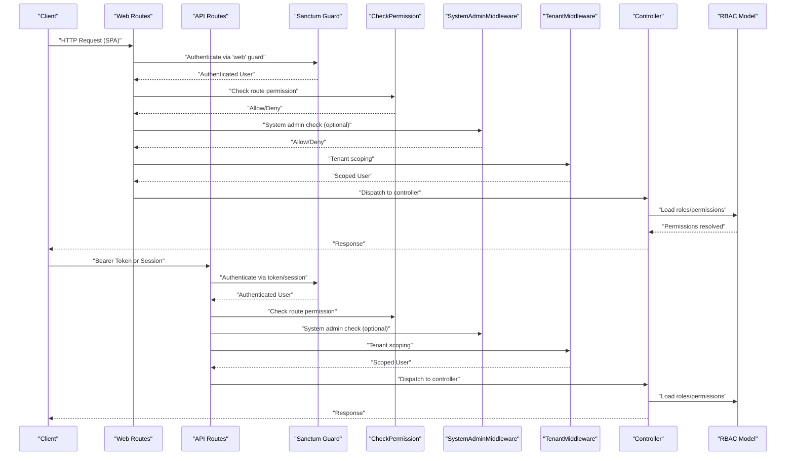
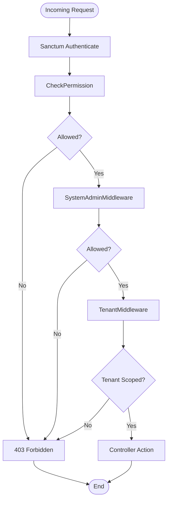
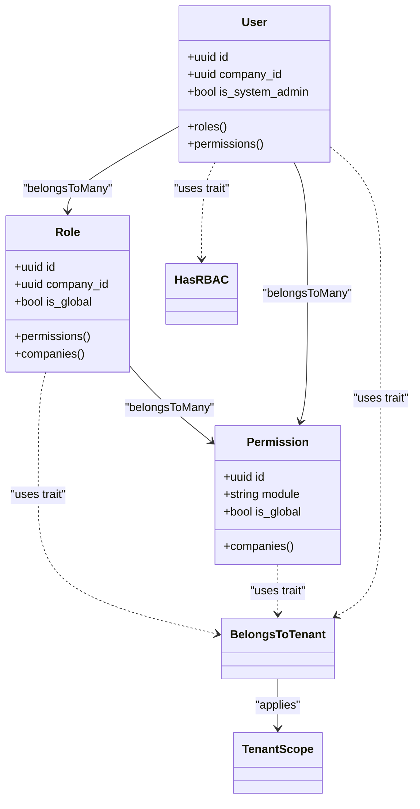
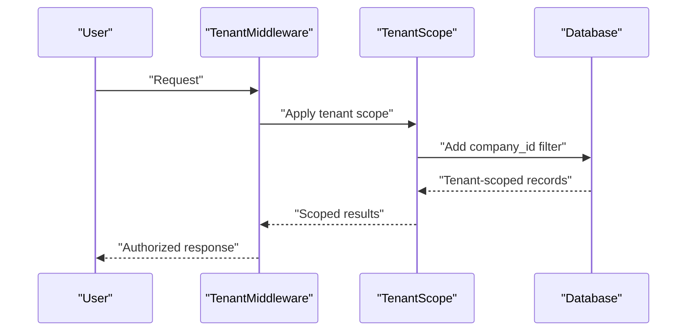
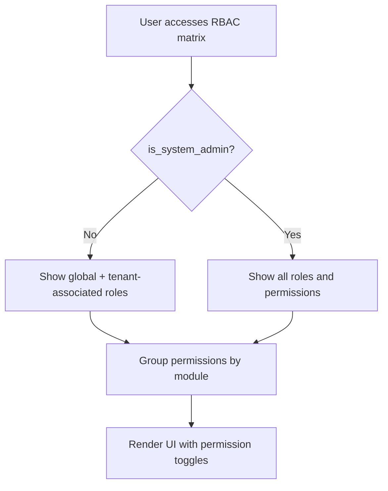
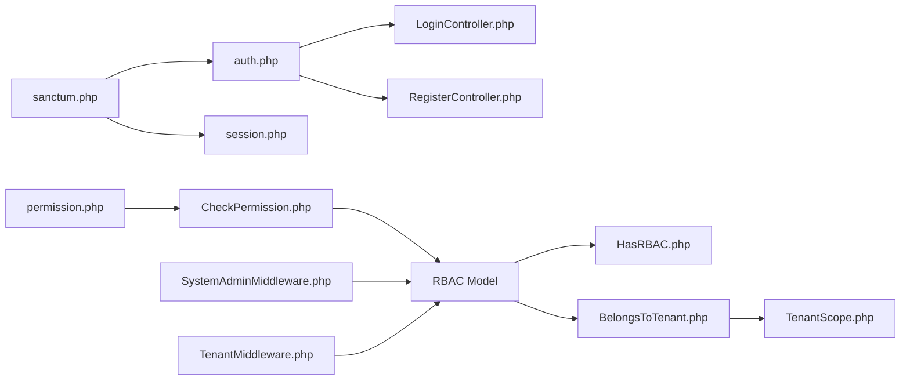

# Authentication & Authorization

<cite>
**Referenced Files in This Document**
- [sanctum.php](file://config/sanctum.php)
- [auth.php](file://config/auth.php)
- [session.php](file://config/session.php)
- [permission.php](file://config/permission.php)
- [CheckPermission.php](file://app/Http/Middleware/CheckPermission.php)
- [SystemAdminMiddleware.php](file://app/Http/Middleware/SystemAdminMiddleware.php)
- [TenantMiddleware.php](file://app/Http/Middleware/TenantMiddleware.php)
- [EnsurePasswordIsChanged.php](file://app/Http/Middleware/EnsurePasswordIsChanged.php)
- [EnsureQueueMode.php](file://app/Http/Middleware/EnsureQueueMode.php)
- [EnsureQueueMode.php](file://app/Http/Middleware/EnsureQueueMode.php)
- [SetLocale.php](file://app/Http/Middleware/SetLocale.php)
- [CheckSubscriptionValid.php](file://app/Http/Middleware/CheckSubscriptionValid.php)
- [HasRBAC.php](file://app/Modules/Core/Traits/HasRBAC.php)
- [BelongsToTenant.php](file://app/Modules/Core/Traits/BelongsToTenant.php)
- [TenantScope.php](file://app/Modules/Core/Scopes/TenantScope.php)
- [User.php](file://app/Models/User.php)
- [Role.php](file://app/Models/Role.php)
- [Permission.php](file://app/Models/Permission.php)
- [Company.php](file://app/Modules/Companies/Models/Company.php)
- [LoginController.php](file://app/Modules/Auth/Controllers/LoginController.php)
- [RegisterController.php](file://app/Modules/Auth/Controllers/RegisterController.php)
- [web.php](file://routes/web.php)
- [api.php](file://routes/api.php)
- [MasterController.php](file://app/Modules/RBAC/Controllers/MasterController.php)
- [RolesController.php](file://app/Modules/RBAC/Controllers/RolesController.php)
- [UsersController.php](file://app/Modules/RBAC/Controllers/UsersController.php)
- [2026_04_06_115250_create_permission_tables.php](file://database/migrations/2026_04_06_115250_create_permission_tables.php)
- [2026_04_06_135154_create_rbac_tables.php](file://database/migrations/2026_04_06_135154_create_rbac_tables.php)
- [2026_04_10_173000_transform_roles_to_multi_tenant.php](file://database/migrations/2026_04_10_173000_transform_roles_to_multi_tenant.php)
- [2026_04_06_112423_create_personal_access_tokens_table.php](file://database/migrations/2026_04_06_112423_create_personal_access_tokens_table.php)
</cite>

## Table of Contents
1. [Introduction](#introduction)
2. [Project Structure](#project-structure)
3. [Core Components](#core-components)
4. [Architecture Overview](#architecture-overview)
5. [Detailed Component Analysis](#detailed-component-analysis)
6. [Dependency Analysis](#dependency-analysis)
7. [Performance Considerations](#performance-considerations)
8. [Troubleshooting Guide](#troubleshooting-guide)
9. [Conclusion](#conclusion)
10. [Appendices](#appendices)

## Introduction
This document explains Noubtigo’s authentication and authorization model. It covers:
- Sanctum-based session and token authentication
- Multi-tenant isolation and scoping
- Role-Based Access Control (RBAC) with permission inheritance
- Middleware layers enforcing permissions, system admin checks, and tenant scoping
- API token generation and refresh patterns
- Practical examples of authenticated requests and tenant-aware access
- Security best practices and troubleshooting

## Project Structure
Key areas involved in authentication and authorization:
- Configuration: Sanctum, session, auth, permissions
- Middleware: permission checks, system admin enforcement, tenant scoping, locale, subscription, queue mode, password change
- RBAC model: User, Role, Permission, traits and scopes for multi-tenancy
- Controllers: Auth login/register and RBAC management
- Routes: Web and API route groups with permission middleware
- Migrations: RBAC and token tables

```mermaid
graph TB
subgraph "Config"
C1["config/sanctum.php"]
C2["config/auth.php"]
C3["config/session.php"]
C4["config/permission.php"]
end
subgraph "Middleware"
M1["CheckPermission.php"]
M2["SystemAdminMiddleware.php"]
M3["TenantMiddleware.php"]
M4["EnsurePasswordIsChanged.php"]
M5["EnsureQueueMode.php"]
M6["SetLocale.php"]
M7["CheckSubscriptionValid.php"]
end
subgraph "RBAC Model"
U["User.php"]
R["Role.php"]
P["Permission.php"]
T1["HasRBAC.php"]
T2["BelongsToTenant.php"]
S1["TenantScope.php"]
end
subgraph "Controllers"
L["LoginController.php"]
RG["RegisterController.php"]
RM["MasterController.php"]
RR["RolesController.php"]
RU["UsersController.php"]
end
subgraph "Routes"
RW["routes/web.php"]
RA["routes/api.php"]
end
subgraph "Migrations"
MIG1["2026_04_06_115250_create_permission_tables.php"]
MIG2["2026_04_06_135154_create_rbac_tables.php"]
MIG3["2026_04_10_173000_transform_roles_to_multi_tenant.php"]
MIG4["2026_04_06_112423_create_personal_access_tokens_table.php"]
end
C1 --> M1
C1 --> M2
C1 --> M3
C2 --> L
C2 --> RG
C3 --> L
C4 --> M1
U --> T1
U --> T2
R --> T2
P --> T2
T2 --> S1
RW --> M1
RW --> M2
RW --> M3
RA --> M1
RA --> M2
RA --> M3
MIG1 --> P
MIG2 --> R
MIG2 --> U
MIG3 --> R
MIG4 --> U
```

**Diagram sources**
- [sanctum.php:1-84](file://config/sanctum.php#L1-L84)
- [auth.php](file://config/auth.php)
- [session.php](file://config/session.php)
- [permission.php](file://config/permission.php)
- [CheckPermission.php](file://app/Http/Middleware/CheckPermission.php)
- [SystemAdminMiddleware.php](file://app/Http/Middleware/SystemAdminMiddleware.php)
- [TenantMiddleware.php](file://app/Http/Middleware/TenantMiddleware.php)
- [EnsurePasswordIsChanged.php](file://app/Http/Middleware/EnsurePasswordIsChanged.php)
- [EnsureQueueMode.php](file://app/Http/Middleware/EnsureQueueMode.php)
- [SetLocale.php](file://app/Http/Middleware/SetLocale.php)
- [CheckSubscriptionValid.php](file://app/Http/Middleware/CheckSubscriptionValid.php)
- [HasRBAC.php](file://app/Modules/Core/Traits/HasRBAC.php)
- [BelongsToTenant.php](file://app/Modules/Core/Traits/BelongsToTenant.php)
- [TenantScope.php](file://app/Modules/Core/Scopes/TenantScope.php)
- [User.php](file://app/Models/User.php)
- [Role.php](file://app/Models/Role.php)
- [Permission.php](file://app/Models/Permission.php)
- [LoginController.php](file://app/Modules/Auth/Controllers/LoginController.php)
- [RegisterController.php](file://app/Modules/Auth/Controllers/RegisterController.php)
- [web.php:100-110](file://routes/web.php#L100-L110)
- [api.php](file://routes/api.php)
- [2026_04_06_115250_create_permission_tables.php](file://database/migrations/2026_04_06_115250_create_permission_tables.php)
- [2026_04_06_135154_create_rbac_tables.php](file://database/migrations/2026_04_06_135154_create_rbac_tables.php)
- [2026_04_10_173000_transform_roles_to_multi_tenant.php](file://database/migrations/2026_04_10_173000_transform_roles_to_multi_tenant.php)
- [2026_04_06_112423_create_personal_access_tokens_table.php](file://database/migrations/2026_04_06_112423_create_personal_access_tokens_table.php)

**Section sources**
- [sanctum.php:1-84](file://config/sanctum.php#L1-L84)
- [auth.php](file://config/auth.php)
- [session.php](file://config/session.php)
- [permission.php](file://config/permission.php)
- [web.php:100-110](file://routes/web.php#L100-L110)
- [api.php](file://routes/api.php)

## Core Components
- Sanctum configuration defines stateful domains, guard, expiration, token prefix, and middleware stack for session-based SPA auth.
- Middleware layers enforce:
  - Permission checks per route/action
  - System admin validation
  - Tenant scoping for multi-tenancy
  - Locale, subscription validity, queue mode, and password change policies
- RBAC model with User, Role, Permission and traits/scopes for multi-tenant behavior.
- Auth controllers for login/register flows.
- Routes define protected groups using permission middleware.

**Section sources**
- [sanctum.php:18-82](file://config/sanctum.php#L18-L82)
- [CheckPermission.php](file://app/Http/Middleware/CheckPermission.php)
- [SystemAdminMiddleware.php](file://app/Http/Middleware/SystemAdminMiddleware.php)
- [TenantMiddleware.php](file://app/Http/Middleware/TenantMiddleware.php)
- [SetLocale.php](file://app/Http/Middleware/SetLocale.php)
- [CheckSubscriptionValid.php](file://app/Http/Middleware/CheckSubscriptionValid.php)
- [EnsureQueueMode.php](file://app/Http/Middleware/EnsureQueueMode.php)
- [EnsurePasswordIsChanged.php](file://app/Http/Middleware/EnsurePasswordIsChanged.php)
- [HasRBAC.php](file://app/Modules/Core/Traits/HasRBAC.php)
- [BelongsToTenant.php](file://app/Modules/Core/Traits/BelongsToTenant.php)
- [TenantScope.php](file://app/Modules/Core/Scopes/TenantScope.php)
- [User.php](file://app/Models/User.php)
- [Role.php](file://app/Models/Role.php)
- [Permission.php](file://app/Models/Permission.php)
- [LoginController.php](file://app/Modules/Auth/Controllers/LoginController.php)
- [RegisterController.php](file://app/Modules/Auth/Controllers/RegisterController.php)
- [web.php:100-110](file://routes/web.php#L100-L110)

## Architecture Overview
The authentication and authorization pipeline integrates Sanctum for session/token auth, middleware for policy enforcement, and RBAC for fine-grained permissions with multi-tenant scoping.

**Diagram sources**
- [sanctum.php:37-37](file://config/sanctum.php#L37-L37)
- [CheckPermission.php](file://app/Http/Middleware/CheckPermission.php)
- [SystemAdminMiddleware.php](file://app/Http/Middleware/SystemAdminMiddleware.php)
- [TenantMiddleware.php](file://app/Http/Middleware/TenantMiddleware.php)
- [web.php:100-110](file://routes/web.php#L100-L110)
- [api.php](file://routes/api.php)

## Detailed Component Analysis

### Sanctum Token and Session Authentication
- Stateful domains and guards: Sanctum uses the configured guard and stateful domains to support SPA session cookies. It also supports bearer tokens for API clients.
- Expiration and token prefix: Tokens can be long-lived or scoped by expiration; a token prefix can be configured for secret scanning compatibility.
- Middleware stack: Sanctum middleware integrates CSRF validation, cookie encryption, and optional session authentication.

Practical implications:
- SPA apps should target configured stateful domains to receive session cookies.
- API clients should use bearer tokens; ensure token prefix and expiration align with client needs.

**Section sources**
- [sanctum.php:18-82](file://config/sanctum.php#L18-L82)
- [auth.php](file://config/auth.php)

### Middleware Layers
- Permission checking: Route-level middleware validates that the authenticated user holds the required permission for the requested action.
- System admin validation: Certain routes/actions restrict access to system admins.
- Tenant scoping: Middleware ensures requests operate within the user’s tenant context.
- Additional middleware: Locale setting, subscription validity, queue mode enforcement, and mandatory password change policies.

**Diagram sources**
- [CheckPermission.php](file://app/Http/Middleware/CheckPermission.php)
- [SystemAdminMiddleware.php](file://app/Http/Middleware/SystemAdminMiddleware.php)
- [TenantMiddleware.php](file://app/Http/Middleware/TenantMiddleware.php)

**Section sources**
- [CheckPermission.php](file://app/Http/Middleware/CheckPermission.php)
- [SystemAdminMiddleware.php](file://app/Http/Middleware/SystemAdminMiddleware.php)
- [TenantMiddleware.php](file://app/Http/Middleware/TenantMiddleware.php)
- [SetLocale.php](file://app/Http/Middleware/SetLocale.php)
- [CheckSubscriptionValid.php](file://app/Http/Middleware/CheckSubscriptionValid.php)
- [EnsureQueueMode.php](file://app/Http/Middleware/EnsureQueueMode.php)
- [EnsurePasswordIsChanged.php](file://app/Http/Middleware/EnsurePasswordIsChanged.php)

### Role-Based Access Control (RBAC)
- Entities: User, Role, Permission
- Traits and scopes:
  - HasRBAC: Provides RBAC capabilities on User
  - BelongsToTenant: Associates entities with a tenant/company
  - TenantScope: Applies tenant scoping globally to queries
- Multi-tenant roles: Roles can be global or associated with specific companies; permissions can be global or tenant-specific.

**Diagram sources**
- [HasRBAC.php](file://app/Modules/Core/Traits/HasRBAC.php)
- [BelongsToTenant.php](file://app/Modules/Core/Traits/BelongsToTenant.php)
- [TenantScope.php](file://app/Modules/Core/Scopes/TenantScope.php)
- [User.php](file://app/Models/User.php)
- [Role.php](file://app/Models/Role.php)
- [Permission.php](file://app/Models/Permission.php)

**Section sources**
- [HasRBAC.php](file://app/Modules/Core/Traits/HasRBAC.php)
- [BelongsToTenant.php](file://app/Modules/Core/Traits/BelongsToTenant.php)
- [TenantScope.php](file://app/Modules/Core/Scopes/TenantScope.php)
- [User.php](file://app/Models/User.php)
- [Role.php](file://app/Models/Role.php)
- [Permission.php](file://app/Models/Permission.php)

### Multi-Tenant Authorization Patterns
- Tenant scoping via middleware and TenantScope ensures that:
  - Users operate within their company context
  - Roles and permissions are enforced per tenant unless marked global
- System admins bypass tenant scoping for master-level operations.

**Diagram sources**
- [TenantMiddleware.php](file://app/Http/Middleware/TenantMiddleware.php)
- [TenantScope.php](file://app/Modules/Core/Scopes/TenantScope.php)
- [BelongsToTenant.php](file://app/Modules/Core/Traits/BelongsToTenant.php)

**Section sources**
- [TenantMiddleware.php](file://app/Http/Middleware/TenantMiddleware.php)
- [TenantScope.php](file://app/Modules/Core/Scopes/TenantScope.php)
- [BelongsToTenant.php](file://app/Modules/Core/Traits/BelongsToTenant.php)

### Permission Inheritance and Route Protection
- RBAC controllers demonstrate:
  - Matrix view showing global and tenant-specific roles/permissions
  - System admin visibility across tenants
  - Tenant users seeing global roles plus tenant-associated roles/permissions
- Web routes apply permission middleware to protect user management actions.

**Diagram sources**
- [RolesController.php:15-44](file://app/Modules/RBAC/Controllers/RolesController.php#L15-L44)
- [MasterController.php:297-317](file://app/Modules/RBAC/Controllers/MasterController.php#L297-L317)
- [web.php:100-110](file://routes/web.php#L100-L110)

**Section sources**
- [RolesController.php:15-44](file://app/Modules/RBAC/Controllers/RolesController.php#L15-L44)
- [MasterController.php:297-317](file://app/Modules/RBAC/Controllers/MasterController.php#L297-L317)
- [web.php:100-110](file://routes/web.php#L100-L110)

### API Token Generation and Refresh
- Personal Access Tokens: Migrated to a dedicated table for managing tokens per user.
- Sanctum configuration supports token lifetimes and prefixes.
- Refresh mechanism: Not implemented by default; clients should regenerate tokens as needed.

Best practices:
- Enforce short-lived tokens for mobile clients
- Use token prefix for secret scanning
- Store tokens securely and rotate regularly

**Section sources**
- [2026_04_06_112423_create_personal_access_tokens_table.php](file://database/migrations/2026_04_06_112423_create_personal_access_tokens_table.php)
- [sanctum.php:50-65](file://config/sanctum.php#L50-L65)

### Authentication Controllers
- LoginController and RegisterController integrate with the configured auth guard and Sanctum to issue sessions/tokens upon successful authentication.

**Section sources**
- [LoginController.php](file://app/Modules/Auth/Controllers/LoginController.php)
- [RegisterController.php](file://app/Modules/Auth/Controllers/RegisterController.php)
- [auth.php](file://config/auth.php)

### Examples of Authenticated Requests and Tenant-Specific Access
- SPA session request:
  - Target a stateful domain configured in Sanctum
  - Use the 'web' guard for session-based auth
- API token request:
  - Send Authorization header with Bearer token
  - Ensure token belongs to the correct user and is not expired
- Permission validation:
  - Route protected by permission middleware checks the user’s effective permissions (direct + role-based)
- Tenant-specific data access:
  - Middleware and TenantScope ensure queries are scoped to the user’s company

Note: Replace placeholders with actual endpoint names and headers as defined in routes and middleware.

**Section sources**
- [sanctum.php:18-37](file://config/sanctum.php#L18-L37)
- [web.php:100-110](file://routes/web.php#L100-L110)
- [api.php](file://routes/api.php)
- [CheckPermission.php](file://app/Http/Middleware/CheckPermission.php)
- [TenantMiddleware.php](file://app/Http/Middleware/TenantMiddleware.php)

## Dependency Analysis
- Configuration dependencies:
  - Sanctum depends on auth guard and session configuration
  - Permission middleware depends on the permission configuration and RBAC model
- Middleware dependencies:
  - Permission relies on User’s RBAC traits and scopes
  - TenantMiddleware depends on current tenant context
- Model dependencies:
  - User depends on HasRBAC and BelongsToTenant
  - Role and Permission depend on BelongsToTenant and TenantScope

**Diagram sources**
- [sanctum.php:18-82](file://config/sanctum.php#L18-L82)
- [auth.php](file://config/auth.php)
- [session.php](file://config/session.php)
- [permission.php](file://config/permission.php)
- [CheckPermission.php](file://app/Http/Middleware/CheckPermission.php)
- [SystemAdminMiddleware.php](file://app/Http/Middleware/SystemAdminMiddleware.php)
- [TenantMiddleware.php](file://app/Http/Middleware/TenantMiddleware.php)
- [HasRBAC.php](file://app/Modules/Core/Traits/HasRBAC.php)
- [BelongsToTenant.php](file://app/Modules/Core/Traits/BelongsToTenant.php)
- [TenantScope.php](file://app/Modules/Core/Scopes/TenantScope.php)
- [LoginController.php](file://app/Modules/Auth/Controllers/LoginController.php)
- [RegisterController.php](file://app/Modules/Auth/Controllers/RegisterController.php)

**Section sources**
- [sanctum.php:18-82](file://config/sanctum.php#L18-L82)
- [auth.php](file://config/auth.php)
- [session.php](file://config/session.php)
- [permission.php](file://config/permission.php)
- [CheckPermission.php](file://app/Http/Middleware/CheckPermission.php)
- [SystemAdminMiddleware.php](file://app/Http/Middleware/SystemAdminMiddleware.php)
- [TenantMiddleware.php](file://app/Http/Middleware/TenantMiddleware.php)
- [HasRBAC.php](file://app/Modules/Core/Traits/HasRBAC.php)
- [BelongsToTenant.php](file://app/Modules/Core/Traits/BelongsToTenant.php)
- [TenantScope.php](file://app/Modules/Core/Scopes/TenantScope.php)
- [LoginController.php](file://app/Modules/Auth/Controllers/LoginController.php)
- [RegisterController.php](file://app/Modules/Auth/Controllers/RegisterController.php)

## Performance Considerations
- Prefer token-based auth for APIs to avoid session overhead.
- Use tenant scoping early in middleware to minimize downstream queries.
- Cache permission sets per-user where feasible to reduce repeated joins.
- Keep permission matrices grouped by module to optimize UI rendering.

## Troubleshooting Guide
Common issues and resolutions:
- 403 Forbidden on protected routes:
  - Verify the user has the required permission or belongs to a role with that permission.
  - Confirm the route group applies the permission middleware.
- Tenant data leakage:
  - Ensure TenantMiddleware is applied and TenantScope is active for models.
  - Confirm the user’s company_id matches the requested resource.
- Session not persisting:
  - Check Sanctum stateful domains match the SPA origin.
  - Verify cookies are sent with SameSite/Lax/Strict settings appropriate for your deployment.
- Token invalid/expired:
  - Regenerate personal access tokens if necessary.
  - Adjust token expiration settings if required by your clients.

**Section sources**
- [CheckPermission.php](file://app/Http/Middleware/CheckPermission.php)
- [TenantMiddleware.php](file://app/Http/Middleware/TenantMiddleware.php)
- [sanctum.php:18-82](file://config/sanctum.php#L18-L82)
- [2026_04_06_112423_create_personal_access_tokens_table.php](file://database/migrations/2026_04_06_112423_create_personal_access_tokens_table.php)

## Conclusion
Noubtigo’s security model combines Sanctum for session and token-based authentication, robust middleware for permission and tenant enforcement, and a multi-tenant RBAC system. By leveraging traits, scopes, and middleware consistently, the platform achieves secure, scalable authorization across tenants and modules.

## Appendices
- RBAC and token migrations outline the foundational schema for permissions, roles, and tokens.
- Ensure environment variables for Sanctum stateful domains and token prefix are configured appropriately for your deployment.

**Section sources**
- [2026_04_06_115250_create_permission_tables.php](file://database/migrations/2026_04_06_115250_create_permission_tables.php)
- [2026_04_06_135154_create_rbac_tables.php](file://database/migrations/2026_04_06_135154_create_rbac_tables.php)
- [2026_04_10_173000_transform_roles_to_multi_tenant.php](file://database/migrations/2026_04_10_173000_transform_roles_to_multi_tenant.php)
- [2026_04_06_112423_create_personal_access_tokens_table.php](file://database/migrations/2026_04_06_112423_create_personal_access_tokens_table.php)