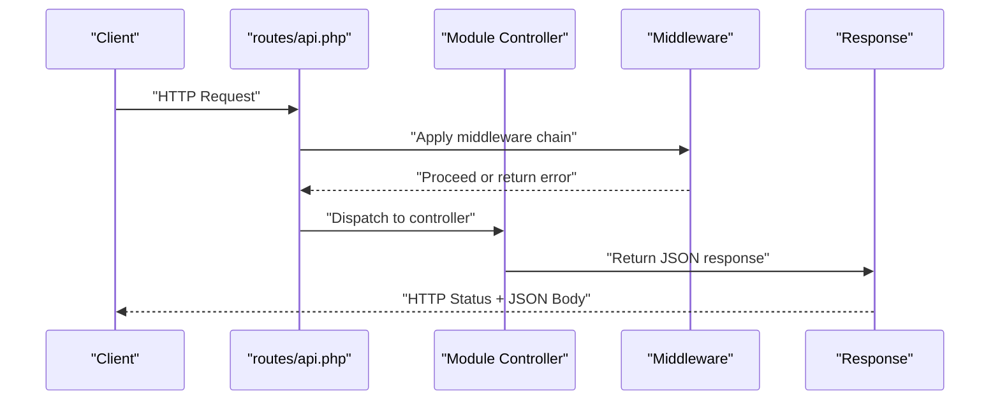
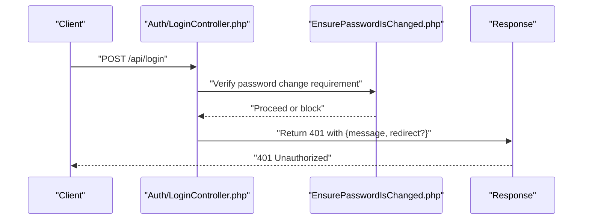
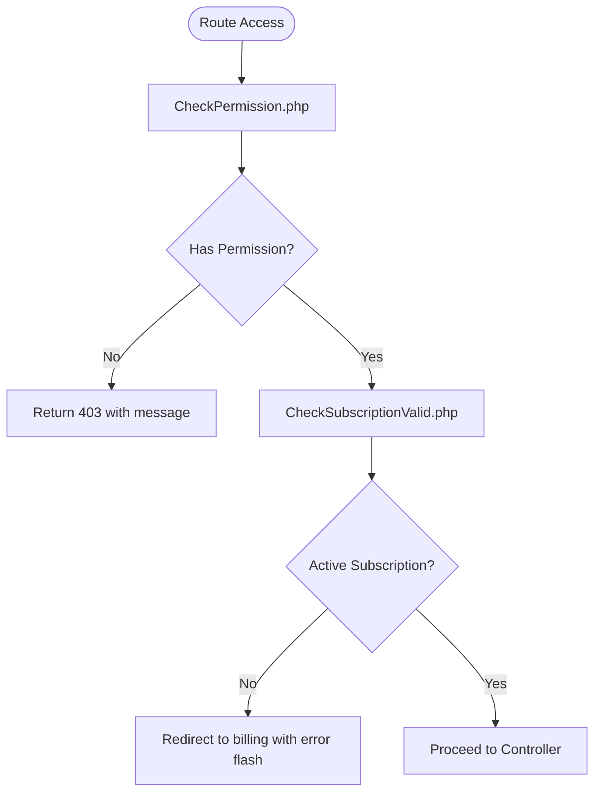
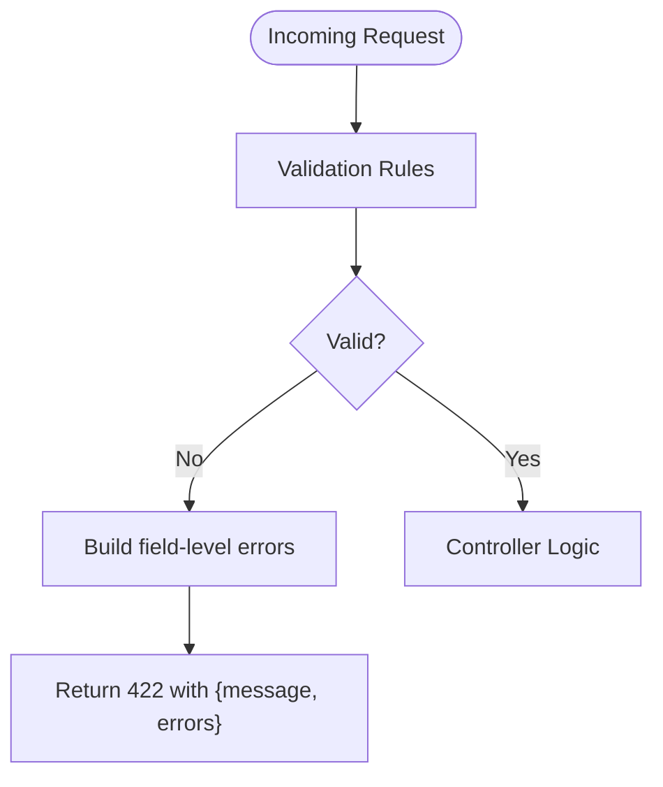
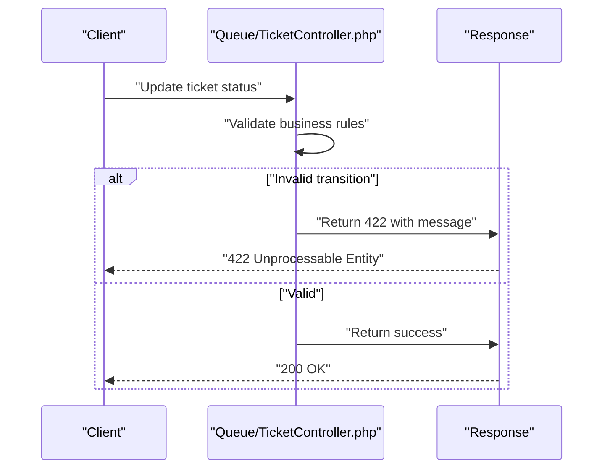
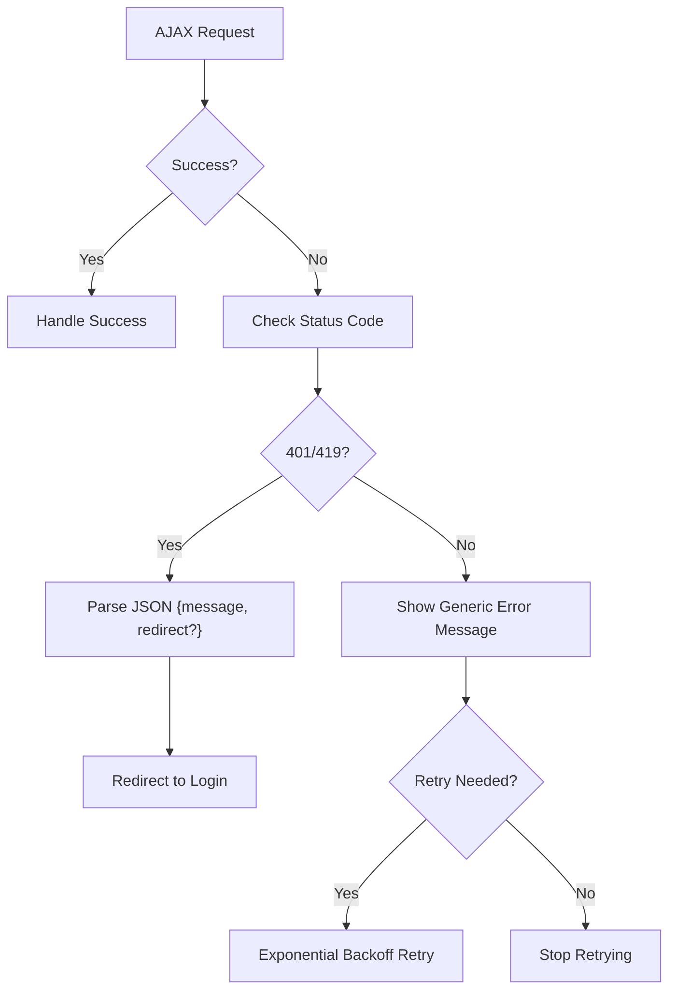
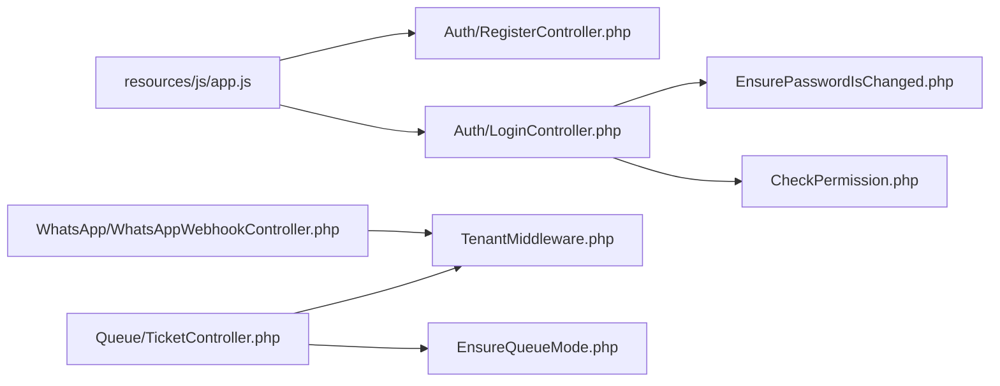

# Error Handling & Response Codes

<cite>
**Referenced Files in This Document**
- [Controller.php](file://app/Http/Controllers/Controller.php)
- [LoginController.php](file://app/Modules/Auth/Controllers/LoginController.php)
- [RegisterController.php](file://app/Modules/Auth/Controllers/RegisterController.php)
- [CheckPermission.php](file://app/Http/Middleware/CheckPermission.php)
- [CheckSubscriptionValid.php](file://app/Http/Middleware/CheckSubscriptionValid.php)
- [EnsurePasswordIsChanged.php](file://app/Http/Middleware/EnsurePasswordIsChanged.php)
- [EnsureQueueMode.php](file://app/Http/Middleware/EnsureQueueMode.php)
- [TenantMiddleware.php](file://app/Http/Middleware/TenantMiddleware.php)
- [SystemAdminMiddleware.php](file://app/Http/Middleware/SystemAdminMiddleware.php)
- [SetLocale.php](file://app/Http/Middleware/SetLocale.php)
- [validation.php](file://lang/en/validation.php)
- [app.js](file://resources/js/app.js)
- [TicketController.php](file://app/Modules/Queue/Controllers/TicketController.php)
- [ActivityLogController.php](file://app/Modules/Queue/Controllers/ActivityLogController.php)
- [TicketHistoryController.php](file://app/Modules/Queue/Controllers/TicketHistoryController.php)
- [SimpleQueueController.php](file://app/Modules/Queue/Controllers/SimpleQueueController.php)
- [DisplayController.php](file://app/Modules/Queue/Controllers/DisplayController.php)
- [TrackerController.php](file://app/Modules/Queue/Controllers/TrackerController.php)
- [WhatsAppWebhookController.php](file://app/Modules/WhatsApp/Controllers/WhatsAppWebhookController.php)
- [api.php](file://routes/api.php)
- [logging.php](file://config/logging.php)
- [offline.blade.php](file://resources/views/errors/offline.blade.php)
</cite>

## Table of Contents
1. [Introduction](#introduction)
2. [Project Structure](#project-structure)
3. [Core Components](#core-components)
4. [Architecture Overview](#architecture-overview)
5. [Detailed Component Analysis](#detailed-component-analysis)
6. [Dependency Analysis](#dependency-analysis)
7. [Performance Considerations](#performance-considerations)
8. [Troubleshooting Guide](#troubleshooting-guide)
9. [Conclusion](#con conclusion)
10. [Appendices](#appendices)

## Introduction
This document defines Noubtigo’s API error handling and response standards. It consolidates HTTP status code usage, standardized error payload schemas, validation error formats, authentication failure responses, and business logic error patterns. It also documents logging, error tracking, client-side handling, retry strategies, and monitoring recommendations to ensure robust API health and performance.

## Project Structure
Noubtigo follows a Laravel modular structure with explicit HTTP controllers per module, middleware for cross-cutting concerns, localization-based validation messages, and client-side JavaScript for AJAX error handling. API routes are defined centrally and consumed by both server-rendered views and external clients.

```mermaid
graph TB
subgraph "HTTP Layer"
R["routes/api.php"]
CBase["app/Http/Controllers/Controller.php"]
MPerm["CheckPermission.php"]
MSub["CheckSubscriptionValid.php"]
MPass["EnsurePasswordIsChanged.php"]
MQueue["EnsureQueueMode.php"]
MTenant["TenantMiddleware.php"]
MAdmin["SystemAdminMiddleware.php"]
MLocale["SetLocale.php"]
end
subgraph "Auth Module"
LCtrl["Auth/LoginController.php"]
RCtrl["Auth/RegisterController.php"]
end
subgraph "Queue Module"
TCtrl["Queue/TicketController.php"]
ALCtrl["Queue/ActivityLogController.php"]
THCtrl["Queue/TicketHistoryController.php"]
SQCtrl["Queue/SimpleQueueController.php"]
DCtrl["Queue/DisplayController.php"]
TrCtrl["Queue/TrackerController.php"]
end
subgraph "WhatsApp Module"
WCtrl["WhatsApp/WhatsAppWebhookController.php"]
end
subgraph "Client"
JS["resources/js/app.js"]
end
R --> CBase
R --> LCtrl
R --> RCtrl
R --> TCtrl
R --> ALCtrl
R --> THCtrl
R --> SQCtrl
R --> DCtrl
R --> TrCtrl
R --> WCtrl
CBase --> MPerm
CBase --> MSub
CBase --> MPass
CBase --> MQueue
CBase --> MTenant
CBase --> MAdmin
CBase --> MLocale
JS --> LCtrl
JS --> RCtrl
```

**Diagram sources**
- [api.php](file://routes/api.php)
- [Controller.php](file://app/Http/Controllers/Controller.php)
- [CheckPermission.php](file://app/Http/Middleware/CheckPermission.php)
- [CheckSubscriptionValid.php](file://app/Http/Middleware/CheckSubscriptionValid.php)
- [EnsurePasswordIsChanged.php](file://app/Http/Middleware/EnsurePasswordIsChanged.php)
- [EnsureQueueMode.php](file://app/Http/Middleware/EnsureQueueMode.php)
- [TenantMiddleware.php](file://app/Http/Middleware/TenantMiddleware.php)
- [SystemAdminMiddleware.php](file://app/Http/Middleware/SystemAdminMiddleware.php)
- [SetLocale.php](file://app/Http/Middleware/SetLocale.php)
- [LoginController.php](file://app/Modules/Auth/Controllers/LoginController.php)
- [RegisterController.php](file://app/Modules/Auth/Controllers/RegisterController.php)
- [TicketController.php](file://app/Modules/Queue/Controllers/TicketController.php)
- [ActivityLogController.php](file://app/Modules/Queue/Controllers/ActivityLogController.php)
- [TicketHistoryController.php](file://app/Modules/Queue/Controllers/TicketHistoryController.php)
- [SimpleQueueController.php](file://app/Modules/Queue/Controllers/SimpleQueueController.php)
- [DisplayController.php](file://app/Modules/Queue/Controllers/DisplayController.php)
- [TrackerController.php](file://app/Modules/Queue/Controllers/TrackerController.php)
- [WhatsAppWebhookController.php](file://app/Modules/WhatsApp/Controllers/WhatsAppWebhookController.php)
- [app.js](file://resources/js/app.js)

**Section sources**
- [api.php](file://routes/api.php)
- [Controller.php](file://app/Http/Controllers/Controller.php)

## Core Components
- Standardized JSON error responses with consistent fields across modules.
- HTTP status codes aligned with REST semantics and application-specific policies.
- Validation errors localized via Laravel’s validation language files.
- Middleware-driven authorization and subscription checks returning structured errors.
- Client-side AJAX error handling with redirects and graceful degradation.

Key patterns observed:
- Authentication failures return 401 Unauthorized with a JSON body containing a message and optional redirect field.
- Authorization failures return 403 Forbidden with a message indicating missing permissions.
- Validation failures return 422 Unprocessable Entity with a structured payload including field-level errors.
- Business logic errors return 422 or 4xx with a message and optional details.
- Subscription-related restrictions return 402 Payment Required or redirect with flash messages.
- Client-side AJAX handles 401/419 by parsing JSON bodies and redirecting to login.

**Section sources**
- [LoginController.php](file://app/Modules/Auth/Controllers/LoginController.php)
- [CheckPermission.php](file://app/Http/Middleware/CheckPermission.php)
- [validation.php](file://lang/en/validation.php)
- [app.js](file://resources/js/app.js)

## Architecture Overview
The API architecture applies middleware for cross-cutting concerns, delegates business actions to module controllers, and standardizes error responses. Client-side scripts intercept AJAX errors to provide seamless user experience.

**Diagram sources**
- [api.php](file://routes/api.php)
- [Controller.php](file://app/Http/Controllers/Controller.php)
- [CheckPermission.php](file://app/Http/Middleware/CheckPermission.php)

## Detailed Component Analysis

### Authentication Error Responses
- 401 Unauthorized: Returned when credentials are invalid or missing. The response includes a message and optionally a redirect URL for login.
- 419 CSRF Token Failure: Handled client-side by redirecting to login.
- 403 Forbidden: Returned when the user lacks permission for the requested action.

**Diagram sources**
- [LoginController.php](file://app/Modules/Auth/Controllers/LoginController.php)
- [EnsurePasswordIsChanged.php](file://app/Http/Middleware/EnsurePasswordIsChanged.php)

**Section sources**
- [LoginController.php](file://app/Modules/Auth/Controllers/LoginController.php)
- [EnsurePasswordIsChanged.php](file://app/Http/Middleware/EnsurePasswordIsChanged.php)
- [app.js](file://resources/js/app.js)

### Authorization and Subscription Errors
- 403 Forbidden: From permission middleware when a route requires specific permissions.
- Subscription checks: Returns redirect with flash error messages for pending/suspended/cancelled/expired subscriptions.

**Diagram sources**
- [CheckPermission.php](file://app/Http/Middleware/CheckPermission.php)
- [CheckSubscriptionValid.php](file://app/Http/Middleware/CheckSubscriptionValid.php)

**Section sources**
- [CheckPermission.php](file://app/Http/Middleware/CheckPermission.php)
- [CheckSubscriptionValid.php](file://app/Http/Middleware/CheckSubscriptionValid.php)

### Validation Error Responses
- 422 Unprocessable Entity: Returned when validation fails. The response includes a message and field-level errors.
- Localization: Validation messages are localized via language files.

**Diagram sources**
- [validation.php](file://lang/en/validation.php)

**Section sources**
- [validation.php](file://lang/en/validation.php)

### Business Logic Errors (Queue and WhatsApp)
- 422 Unprocessable Entity: Used for business rule violations (e.g., invalid state transitions).
- 200 OK with informational text: Webhook handlers return 200 with short messages for non-error conditions.

**Diagram sources**
- [TicketController.php](file://app/Modules/Queue/Controllers/TicketController.php)

**Section sources**
- [TicketController.php](file://app/Modules/Queue/Controllers/TicketController.php)
- [WhatsAppWebhookController.php](file://app/Modules/WhatsApp/Controllers/WhatsAppWebhookController.php)

### Client-Side Error Handling and Retry Strategies
- Global AJAX error handler:
  - 401/419: Parse JSON body for message and redirect; prevent default browser alerts.
  - DataTables AJAX errors disabled globally to avoid noisy console logs.
- Recommendations:
  - Retry exponential backoff for transient 5xx/408/429.
  - Defer non-critical requests until authenticated.
  - Show user-friendly messages and offer retry actions.

**Diagram sources**
- [app.js](file://resources/js/app.js)

**Section sources**
- [app.js](file://resources/js/app.js)

## Dependency Analysis
- Controllers depend on middleware for authorization, tenant scoping, locale setting, and queue mode enforcement.
- Authentication controllers centralize login/logout flows and return consistent error payloads.
- Validation errors propagate through localization files to maintain consistent messaging.
- Client-side script depends on predictable JSON error shapes for reliable handling.

**Diagram sources**
- [LoginController.php](file://app/Modules/Auth/Controllers/LoginController.php)
- [RegisterController.php](file://app/Modules/Auth/Controllers/RegisterController.php)
- [TicketController.php](file://app/Modules/Queue/Controllers/TicketController.php)
- [EnsureQueueMode.php](file://app/Http/Middleware/EnsureQueueMode.php)
- [TenantMiddleware.php](file://app/Http/Middleware/TenantMiddleware.php)
- [WhatsAppWebhookController.php](file://app/Modules/WhatsApp/Controllers/WhatsAppWebhookController.php)
- [app.js](file://resources/js/app.js)

**Section sources**
- [LoginController.php](file://app/Modules/Auth/Controllers/LoginController.php)
- [RegisterController.php](file://app/Modules/Auth/Controllers/RegisterController.php)
- [TicketController.php](file://app/Modules/Queue/Controllers/TicketController.php)
- [EnsureQueueMode.php](file://app/Http/Middleware/EnsureQueueMode.php)
- [TenantMiddleware.php](file://app/Http/Middleware/TenantMiddleware.php)
- [WhatsAppWebhookController.php](file://app/Modules/WhatsApp/Controllers/WhatsAppWebhookController.php)
- [app.js](file://resources/js/app.js)

## Performance Considerations
- Prefer 422 Unprocessable Entity for validation errors to avoid expensive retries.
- Use 408 Request Timeout for slow upstream dependencies and implement client-side backoff.
- Avoid logging sensitive data in error responses; sanitize payloads.
- Monitor error rate by status code and endpoint to detect regressions early.

## Troubleshooting Guide
Common scenarios and resolutions:
- 401 Unauthorized:
  - Verify authentication tokens and session validity.
  - Check CSRF token presence for state-changing requests.
- 403 Forbidden:
  - Confirm user role and permissions for the target resource.
- 422 Unprocessable Entity:
  - Inspect field-level errors and correct input accordingly.
- Subscription-related redirects:
  - Guide users to billing page and explain status (pending/suspended/cancelled/expired).
- Client-side AJAX errors:
  - Ensure JSON parsing logic handles malformed responses gracefully.
  - Disable default DataTables error alerts to reduce noise.

Operational checks:
- Review application logs for stack traces and correlation IDs.
- Confirm middleware order and tenant scoping.
- Validate localization files for consistent error messages.

**Section sources**
- [CheckSubscriptionValid.php](file://app/Http/Middleware/CheckSubscriptionValid.php)
- [validation.php](file://lang/en/validation.php)
- [app.js](file://resources/js/app.js)
- [logging.php](file://config/logging.php)

## Conclusion
Noubtigo’s API employs consistent HTTP status codes and standardized JSON error payloads across modules. Middleware ensures robust authorization and subscription checks, while client-side scripts provide resilient error handling and graceful degradation. Adhering to these patterns improves reliability, debuggability, and user experience.

## Appendices

### Standard Error Response Schema
- Fields:
  - message: Human-readable error description.
  - errors: Optional object containing field-level validation errors.
  - redirect: Optional URL to redirect the client (e.g., login).
  - details: Optional structured details for diagnostics.

- Typical status codes:
  - 400 Bad Request: Malformed request or business rule violation.
  - 401 Unauthorized: Missing/invalid credentials.
  - 403 Forbidden: Insufficient permissions.
  - 404 Not Found: Resource not found.
  - 409 Conflict: State conflict (e.g., duplicate resource).
  - 419 CSRF Token Error: Token mismatch or expired.
  - 422 Unprocessable Entity: Validation or business logic error.
  - 429 Too Many Requests: Rate limiting.
  - 500 Internal Server Error: Unexpected server error.

### Validation Error Payload Example
- Status: 422 Unprocessable Entity
- Body:
  - message: General validation failure message
  - errors: Map of field names to arrays of error strings

### Authentication Failure Payload Example
- Status: 401 Unauthorized
- Body:
  - message: Authentication failure message
  - redirect: Optional login URL

### Business Logic Error Payload Example
- Status: 422 Unprocessable Entity
- Body:
  - message: Business rule violation message
  - details: Optional structured context (e.g., current state, allowed transitions)

### Logging and Monitoring Recommendations
- Centralize logs with correlation IDs for tracing.
- Alert on sustained increases in 4xx/5xx rates.
- Track error distribution by endpoint and status code.
- Integrate with external monitoring for SLA visibility.

**Section sources**
- [logging.php](file://config/logging.php)
- [offline.blade.php](file://resources/views/errors/offline.blade.php)