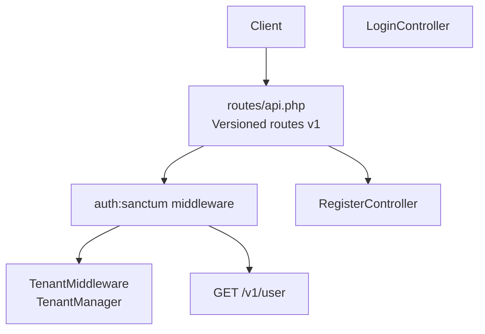
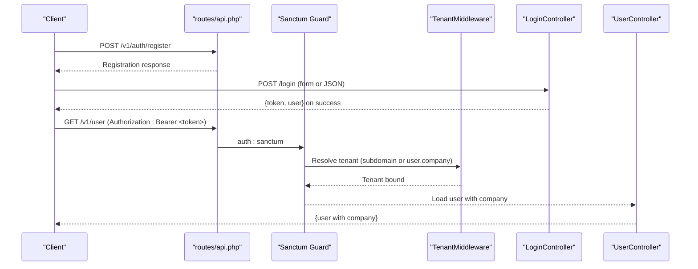
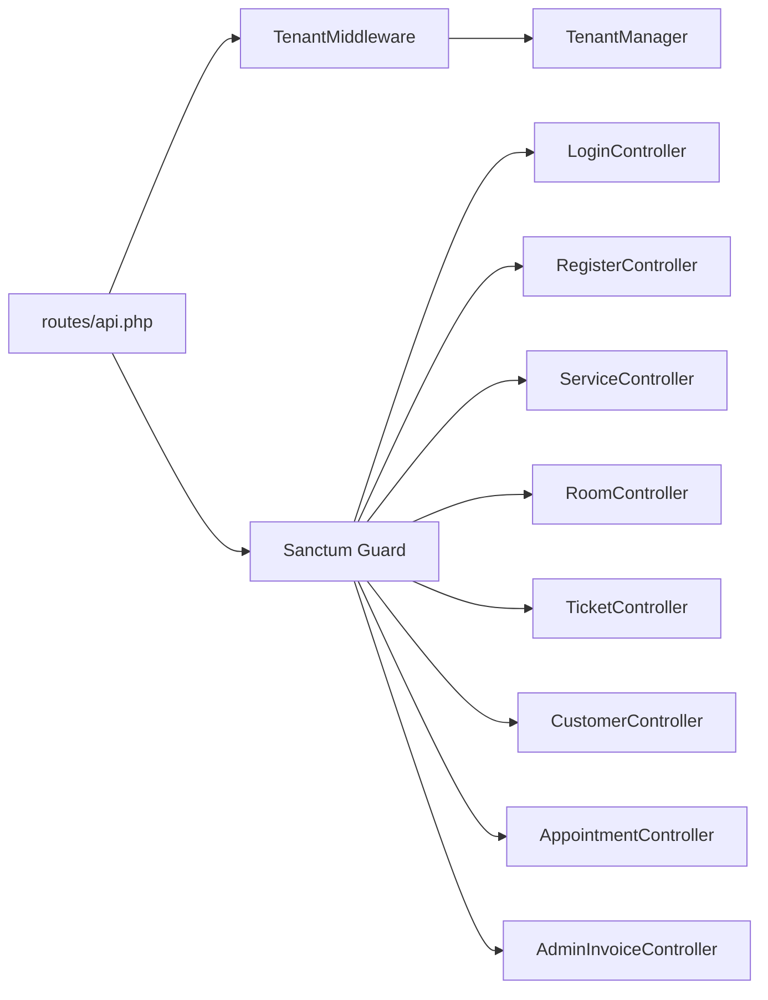

# REST API Endpoints

<cite>
**Referenced Files in This Document**
- [routes/api.php](file://routes/api.php)
- [config/sanctum.php](file://config/sanctum.php)
- [app/Http/Middleware/TenantMiddleware.php](file://app/Http/Middleware/TenantMiddleware.php)
- [app/Services/TenantManager.php](file://app/Services/TenantManager.php)
- [app/Modules/Auth/Controllers/LoginController.php](file://app/Modules/Auth/Controllers/LoginController.php)
- [app/Modules/Auth/Controllers/RegisterController.php](file://app/Modules/Auth/Controllers/RegisterController.php)
- [app/Modules/Services/Controllers/ServiceController.php](file://app/Modules/Services/Controllers/ServiceController.php)
- [app/Modules/Rooms/Controllers/RoomController.php](file://app/Modules/Rooms/Controllers/RoomController.php)
- [app/Modules/Customers/Controllers/CustomerController.php](file://app/Modules/Customers/Controllers/CustomerController.php)
- [app/Modules/Queue/Controllers/TicketController.php](file://app/Modules/Queue/Controllers/TicketController.php)
- [app/Modules/Appointments/Controllers/AppointmentController.php](file://app/Modules/Appointments/Controllers/AppointmentController.php)
- [app/Modules/Payments/Controllers/AdminInvoiceController.php](file://app/Modules/Payments/Controllers/AdminInvoiceController.php)
</cite>

## Table of Contents
1. [Introduction](#introduction)
2. [Project Structure](#project-structure)
3. [Core Components](#core-components)
4. [Architecture Overview](#architecture-overview)
5. [Detailed Component Analysis](#detailed-component-analysis)
6. [Dependency Analysis](#dependency-analysis)
7. [Performance Considerations](#performance-considerations)
8. [Troubleshooting Guide](#troubleshooting-guide)
9. [Conclusion](#conclusion)
10. [Appendices](#appendices)

## Introduction
This document provides comprehensive REST API documentation for Noubtigo’s HTTP endpoints. It covers:
- API versioning strategy (v1)
- Authentication using Laravel Sanctum personal access tokens
- Tenant isolation via subdomain or authenticated user
- Protected resource access patterns
- Modular endpoints for services, rooms, tickets, customers, appointments, and administrative invoices
- Request/response schemas, parameter validation rules, and error handling
- Rate limiting, CORS configuration, and client integration examples

## Project Structure
The API surface is organized under a versioned route group with public authentication endpoints and a protected group guarded by Sanctum. Middleware enforces tenant identification and isolation.

**Diagram sources**
- [routes/api.php:11-23](file://routes/api.php#L11-L23)
- [config/sanctum.php:37](file://config/sanctum.php#L37)
- [app/Http/Middleware/TenantMiddleware.php:22-50](file://app/Http/Middleware/TenantMiddleware.php#L22-L50)

**Section sources**
- [routes/api.php:11-23](file://routes/api.php#L11-L23)

## Core Components
- API Versioning: All routes are prefixed under v1.
- Authentication: Sanctum personal access tokens are used for stateless authentication.
- Tenant Isolation: Tenant identified by subdomain or authenticated user’s company; all queries scoped to the current tenant.

Key behaviors:
- Subdomain-based tenant resolution: Extracts slug from host and sets tenant.
- Fallback to authenticated user’s company when no subdomain is present.
- Application timezone remains UTC; conversions handled by dedicated service.

**Section sources**
- [routes/api.php:11-23](file://routes/api.php#L11-L23)
- [config/sanctum.php:18-23](file://config/sanctum.php#L18-L23)
- [app/Http/Middleware/TenantMiddleware.php:22-50](file://app/Http/Middleware/TenantMiddleware.php#L22-L50)
- [app/Services/TenantManager.php:17-44](file://app/Services/TenantManager.php#L17-L44)

## Architecture Overview
High-level API flow for authentication and protected endpoints:

**Diagram sources**
- [routes/api.php:11-23](file://routes/api.php#L11-L23)
- [config/sanctum.php:37](file://config/sanctum.php#L37)
- [app/Http/Middleware/TenantMiddleware.php:22-50](file://app/Http/Middleware/TenantMiddleware.php#L22-L50)
- [app/Modules/Auth/Controllers/LoginController.php:23-76](file://app/Modules/Auth/Controllers/LoginController.php#L23-L76)
- [app/Modules/Auth/Controllers/RegisterController.php:33-84](file://app/Modules/Auth/Controllers/RegisterController.php#L33-L84)

## Detailed Component Analysis

### Authentication Endpoints
- Base Path: /v1
- Public Auth Routes:
  - POST /auth/register
    - Purpose: Register a new company and owner.
    - Content-Type: application/json
    - Request body fields:
      - company_name: string, required
      - first_name: string, required
      - last_name: string, required
      - email: string, required, unique
      - phone: string, optional
      - password: string, required, min 8, confirmed
      - timezone: string, optional
      - plan: string, optional, exists in plans.slug
    - Responses:
      - 201 Created: {status: "success", message: "...", data: {...}}
      - 422 Unprocessable Entity: {status: "error", errors: {...}}
      - 500 Internal Server Error: {status: "error", message: "...", error: string}

- Protected User Endpoint:
  - GET /user (requires Sanctum token)
    - Authorization: Bearer <token>
    - Response: {id, name, email, company: {...}}

Notes:
- Tokens are issued as personal access tokens upon successful login.
- Login supports both JSON and HTML forms; JSON returns tokenized response.

**Section sources**
- [routes/api.php:11-23](file://routes/api.php#L11-L23)
- [app/Modules/Auth/Controllers/RegisterController.php:33-84](file://app/Modules/Auth/Controllers/RegisterController.php#L33-L84)
- [app/Modules/Auth/Controllers/LoginController.php:23-76](file://app/Modules/Auth/Controllers/LoginController.php#L23-L76)

### Services Module
- Base Path: /v1/services
- Notes: Actual controller routes are not wired in the v1 group yet; however, the controller implements CRUD with tenant scoping.

Endpoints (controller present; wire in routes/api.php):
- GET /index
  - Response: {success: true, services: [...]}
- POST /store
  - Request body: {name*, prefix?, description?, is_active?}
  - Response: {success: true, message: "...", service: {...}}
- PUT /update/{service}
  - Request body: {name*, prefix?, description?, is_active?}
  - Response: {success: true, message: "...", service: {...}}
- DELETE /destroy/{service}
  - Response: {success: true, message: "..."}

Validation and tenant scoping:
- Validates presence of company_id via TenantManager.
- Slug generation and uniqueness enforced per company.

**Section sources**
- [app/Modules/Services/Controllers/ServiceController.php:15-117](file://app/Modules/Services/Controllers/ServiceController.php#L15-L117)

### Rooms Module
- Base Path: /v1/rooms
- Notes: Controller present; wire in routes/api.php.

Endpoints (controller present; wire in routes/api.php):
- GET /index
  - Response: {success: true, rooms: [...]}
- POST /store
  - Request body: {name*, description?, is_active?}
  - Response: {success: true, message: "...", room: {...}}
  - Constraints: Enforced by subscription limits via SubscriptionService.
- PUT /update/{room}
  - Request body: {name*, description?, is_active?}
  - Response: {success: true, message: "...", room: {...}}
- DELETE /destroy/{room}
  - Response: {success: true, message: "..."}

Validation and tenant scoping:
- Validates presence of company_id via TenantManager.
- Slug generation and uniqueness enforced per company.

**Section sources**
- [app/Modules/Rooms/Controllers/RoomController.php:13-105](file://app/Modules/Rooms/Controllers/RoomController.php#L13-L105)

### Tickets Module
- Base Path: /v1/tickets
- Notes: Controller present; wire in routes/api.php.

Endpoints (controller present; wire in routes/api.php):
- GET /index
  - Response: {success: true, tickets: [...]}
- POST /store
  - Request body: {service_id*, room_id*, customer_id*, is_vip?}
  - Response: {success: true, ticket: {...}, message: "..."}
  - Constraints: Prevents duplicate queued customers.
- POST /reorder
  - Request body: {order: [id,...]}
  - Response: {success: true}
- POST /call-next
  - Optional request body: {ticket_id?, room_id?}
  - Response: {success: true, ticket: {...}} or {success: false, message: "..."} (404 if none)
- POST /update-status/{ticket}
  - Request body: {status: in: waiting, called, serving, done, cancelled, no_show}
  - Response: {success: true, ticket: {...}}
- POST /change-room/{ticket}
  - Request body: {room_id*}
  - Response: {success: true, ticket: {...}}
- POST /hold/{ticket}
  - Request body: {reason*, note?}
  - Response: {success: true, ticket: {...}} or {success: false, message: "..."} (422)
- POST /resume/{ticket}
  - Response: {success: true, ticket: {...}} or {success: false, message: "..."} (422)
- POST /cancel-hold/{ticket}
  - Response: {success: true, ticket: {...}} or {success: false, message: "..."} (422)
- POST /cancel/{ticket}
  - Request body: {reason* in predefined list, note?}
  - Response: {success: true, ticket: {...}} or {success: false, message: "..."} (422)

Validation and tenant scoping:
- Ensures ticket belongs to current tenant before updates.

**Section sources**
- [app/Modules/Queue/Controllers/TicketController.php:25-262](file://app/Modules/Queue/Controllers/TicketController.php#L25-L262)

### Customers Module
- Base Path: /v1/customers
- Notes: Controller present; wire in routes/api.php.

Endpoints (controller present; wire in routes/api.php):
- GET /index
  - Query params: search, vip, service, status, visit_date, sort_by, sort_order
  - Response: {success: true, customers: {...}, stats: {...}}
- POST /store
  - Request body: {first_name*, last_name?, identifier?, cin?, file_number?, plate_number?, phone?, email?, is_vip?}
  - Response: {success: true, message: "...", customer: {...}}
  - Constraints: Enforced by subscription limits via SubscriptionService.
- GET /show/{customer}
  - Response: {success: true, customer: {...}, timeline: [...]}
- PUT /update/{customer}
  - Request body: {first_name*, last_name?, identifier?, cin?, file_number?, plate_number?, phone?, email?, is_vip?}
  - Response: {success: true, message: "...", customer: {...}}
- DELETE /destroy/{customer}
  - Response: {success: true, message: "..."}
- POST /toggle-vip/{customer}
  - Request body: {is_vip: boolean}
  - Response: {success: true, message: "..."}
- GET /ajax-search
  - Query params: q, limit
  - Response: {results: [...], pagination: {...}}

Validation and tenant scoping:
- Permissions enforced (e.g., customers.view/create/edit/delete).
- Validates presence of company_id via TenantManager.

**Section sources**
- [app/Modules/Customers/Controllers/CustomerController.php:18-265](file://app/Modules/Customers/Controllers/CustomerController.php#L18-L265)

### Appointments Module
- Base Path: /v1/appointments
- Notes: Controller present; wire in routes/api.php.

Endpoints (controller present; wire in routes/api.php):
- GET /index
  - Response: {success: true, services: [...], rooms: [...], staff: [...], stats: {...}, appointments: {...}}
- GET /events
  - Query params: start (UTC), end (UTC)
  - Response: [calendar events...]
- POST /store
  - Request body: {service_id*, customer_name*, customer_email?, customer_phone?, customer_id?, slot_id?, room_id?, user_id?, appointment_date*, duration_minutes?, notes?}
  - Response: {success: true, appointment: {...}, message: "..."}
  - Constraints: Enforced by subscription limits via SubscriptionService.
- PUT /update/{appointment}
  - Request body: {service_id?, customer_name?, customer_email?, customer_phone?, customer_id?, slot_id?, room_id?, user_id?, appointment_date?, duration_minutes?, notes?, status?}
  - Response: {success: true, appointment: {...}}
- POST /check-in/{appointment}
  - Response: {success: true, appointment: {...}, grace_until: ISO8601}
- POST /cancel/{appointment}
  - Request body: {reason?}
  - Response: {success: true, appointment: {...}}
- DELETE /destroy/{appointment}
  - Response: {success: true}
- GET /slots
  - Query params: service_id*, date*
  - Response: [slots...]

Validation and tenant scoping:
- Ensures appointment belongs to current tenant before updates/deletes.

**Section sources**
- [app/Modules/Appointments/Controllers/AppointmentController.php:20-210](file://app/Modules/Appointments/Controllers/AppointmentController.php#L20-L210)

### Payments Admin Module
- Base Path: /v1/payments/admin/invoices
- Notes: Controller present; wire in routes/api.php.

Endpoints (controller present; wire in routes/api.php):
- GET /index
  - Query params: status
  - Response: {invoices: {...}}
- GET /show/{invoice}
  - Response: {invoice: {...}}

**Section sources**
- [app/Modules/Payments/Controllers/AdminInvoiceController.php:14-35](file://app/Modules/Payments/Controllers/AdminInvoiceController.php#L14-L35)

## Dependency Analysis
Tenant resolution and authentication dependencies:

**Diagram sources**
- [routes/api.php:11-23](file://routes/api.php#L11-L23)
- [config/sanctum.php:37](file://config/sanctum.php#L37)
- [app/Http/Middleware/TenantMiddleware.php:22-50](file://app/Http/Middleware/TenantMiddleware.php#L22-L50)
- [app/Services/TenantManager.php:17-44](file://app/Services/TenantManager.php#L17-L44)

**Section sources**
- [routes/api.php:11-23](file://routes/api.php#L11-L23)
- [config/sanctum.php:37](file://config/sanctum.php#L37)
- [app/Http/Middleware/TenantMiddleware.php:22-50](file://app/Http/Middleware/TenantMiddleware.php#L22-L50)
- [app/Services/TenantManager.php:17-44](file://app/Services/TenantManager.php#L17-L44)

## Performance Considerations
- Pagination: Several endpoints paginate results (e.g., customers, appointments).
- Index scans: Filtering and sorting are applied server-side; ensure appropriate indexes on frequently filtered columns (e.g., company_id, status).
- Tenant scoping: All endpoints scope queries to the current tenant; keep company_id indexed for optimal performance.
- Validation: Use strict validation rules to avoid unnecessary processing on invalid inputs.

## Troubleshooting Guide
Common error scenarios and resolutions:
- 401 Unauthorized
  - Cause: Missing or invalid Sanctum token.
  - Resolution: Re-authenticate and obtain a new token.
- 403 Forbidden
  - Cause: Tenant mismatch or insufficient permissions.
  - Resolution: Verify subdomain/company association and user permissions.
- 422 Unprocessable Entity
  - Cause: Validation failures on request payload.
  - Resolution: Review field constraints and required fields.
- 400 Bad Request
  - Cause: Business rule violations (e.g., plan limits).
  - Resolution: Upgrade plan or adjust request to comply with limits.
- 404 Not Found
  - Cause: Resource not found (e.g., no waiting tickets to call).
  - Resolution: Ensure preconditions are met before invoking actions.

**Section sources**
- [app/Modules/Customers/Controllers/CustomerController.php:88-99](file://app/Modules/Customers/Controllers/CustomerController.php#L88-L99)
- [app/Modules/Appointments/Controllers/AppointmentController.php:84-89](file://app/Modules/Appointments/Controllers/AppointmentController.php#L84-L89)
- [app/Modules/Queue/Controllers/TicketController.php:129](file://app/Modules/Queue/Controllers/TicketController.php#L129)
- [app/Modules/Auth/Controllers/LoginController.php:66-75](file://app/Modules/Auth/Controllers/LoginController.php#L66-L75)

## Conclusion
Noubtigo’s API follows a clean v1 structure with Sanctum-based authentication and robust tenant isolation. While the v1 route group currently exposes only registration and a protected user endpoint, the modular controllers are ready for integration. Clients should authenticate, manage tokens, and adhere to validation rules and tenant scoping to ensure reliable operation.

## Appendices

### Authentication Requirements
- Header: Authorization: Bearer <token>
- Token issuance: Use login endpoint to obtain a personal access token.
- Token lifetime: Controlled by Sanctum configuration; expiration can be configured.

**Section sources**
- [config/sanctum.php:50](file://config/sanctum.php#L50)
- [app/Modules/Auth/Controllers/LoginController.php:52-60](file://app/Modules/Auth/Controllers/LoginController.php#L52-L60)

### Tenant Isolation Mechanisms
- Subdomain-based: Extract slug from host and resolve company.
- Fallback: Use authenticated user’s company.
- Scope enforcement: Controllers validate company_id against current tenant.

**Section sources**
- [app/Http/Middleware/TenantMiddleware.php:26-43](file://app/Http/Middleware/TenantMiddleware.php#L26-L43)
- [app/Services/TenantManager.php:25-36](file://app/Services/TenantManager.php#L25-L36)

### Rate Limiting and CORS
- Rate limiting: Not configured in the provided files; implement at the framework level if needed.
- CORS: No dedicated CORS configuration file was found; configure CORS policies according to deployment requirements.

**Section sources**
- [config/sanctum.php:18-23](file://config/sanctum.php#L18-L23)

### Client Integration Examples
- Registration:
  - POST /v1/auth/register with JSON payload containing company and owner details.
  - On success: expect 201 with created data.
- Login and Token Retrieval:
  - POST /login with JSON {login, password, remember?}.
  - On success: expect {token, user}.
- Access Protected Resources:
  - GET /v1/user with Authorization: Bearer <token>.
  - Expect user object with company loaded.

**Section sources**
- [routes/api.php:11-23](file://routes/api.php#L11-L23)
- [app/Modules/Auth/Controllers/RegisterController.php:33-84](file://app/Modules/Auth/Controllers/RegisterController.php#L33-L84)
- [app/Modules/Auth/Controllers/LoginController.php:23-76](file://app/Modules/Auth/Controllers/LoginController.php#L23-L76)