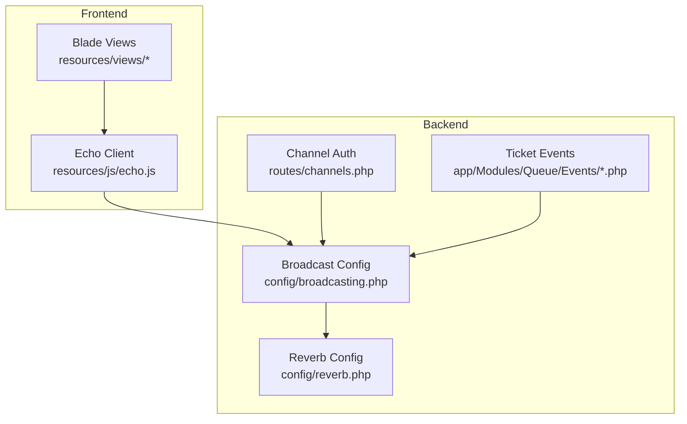
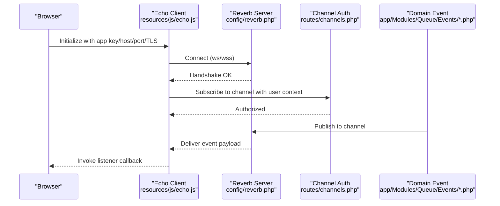
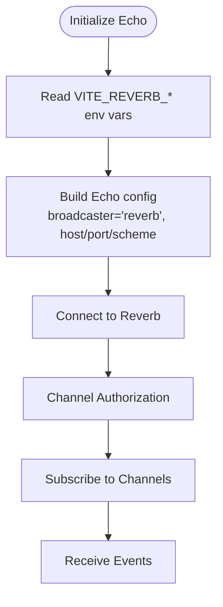
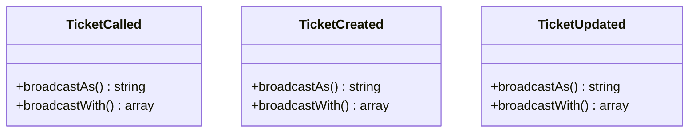
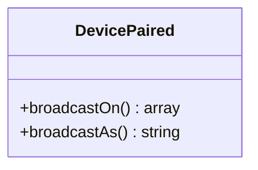
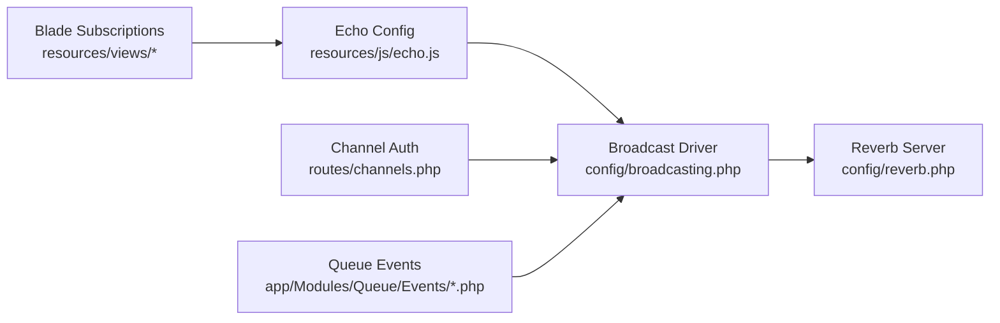

# WebSocket Real-Time API

<cite>
**Referenced Files in This Document**
- [echo.js](file://resources/js/echo.js)
- [broadcasting.php](file://config/broadcasting.php)
- [reverb.php](file://config/reverb.php)
- [channels.php](file://routes/channels.php)
- [TicketCalled.php](file://app/Modules/Queue/Events/TicketCalled.php)
- [TicketUpdated.php](file://app/Modules/Queue/Events/TicketUpdated.php)
- [TicketCreated.php](file://app/Modules/Queue/Events/TicketCreated.php)
- [DevicePaired.php](file://app/Modules/Queue/Events/DevicePaired.php)
- [index.blade.php](file://resources/views/queue/index.blade.php)
- [dashboard.blade.php](file://resources/views/layouts/dashboard.blade.php)
</cite>

## Table of Contents
1. [Introduction](#introduction)
2. [Project Structure](#project-structure)
3. [Core Components](#core-components)
4. [Architecture Overview](#architecture-overview)
5. [Detailed Component Analysis](#detailed-component-analysis)
6. [Dependency Analysis](#dependency-analysis)
7. [Performance Considerations](#performance-considerations)
8. [Troubleshooting Guide](#troubleshooting-guide)
9. [Conclusion](#conclusion)

## Introduction
This document describes the WebSocket real-time API used by Noubtigo’s queue and display systems. It covers connection establishment via Laravel Echo and Reverb, authentication and authorization for channels, event types and payloads, client-side integration with Laravel Echo, and operational guidance for connection lifecycle, reconnection, and error handling. The system supports live updates for tickets, display device pairing, and related queue activities.

## Project Structure
The real-time stack is composed of:
- Frontend client initialization using Laravel Echo configured to Reverb
- Backend broadcasting configuration for Reverb and Pusher
- Route-level channel authorization
- Domain events that broadcast to channels
- Blade templates that subscribe to channels and react to events

**Diagram sources**
- [echo.js:1-14](file://resources/js/echo.js#L1-L14)
- [broadcasting.php:31-82](file://config/broadcasting.php#L31-L82)
- [reverb.php:1-102](file://config/reverb.php#L1-L102)
- [channels.php:1-7](file://routes/channels.php#L1-L7)
- [TicketCalled.php:38-64](file://app/Modules/Queue/Events/TicketCalled.php#L38-L64)
- [TicketUpdated.php:46-67](file://app/Modules/Queue/Events/TicketUpdated.php#L46-L67)
- [TicketCreated.php:46-65](file://app/Modules/Queue/Events/TicketCreated.php#L46-L65)

**Section sources**
- [echo.js:1-14](file://resources/js/echo.js#L1-L14)
- [broadcasting.php:1-82](file://config/broadcasting.php#L1-L82)
- [reverb.php:1-102](file://config/reverb.php#L1-L102)
- [channels.php:1-7](file://routes/channels.php#L1-L7)

## Core Components
- Echo client configuration initializes the Reverb broadcaster with host, port, TLS scheme, and transport selection.
- Broadcasting configuration defines the Reverb driver and Pusher fallback, including TLS and client options.
- Channel authorization restricts access to user-specific private channels.
- Domain events publish structured payloads to channels for tickets and display devices.
- Blade views subscribe to queue channels and render real-time updates.

**Section sources**
- [echo.js:1-14](file://resources/js/echo.js#L1-L14)
- [broadcasting.php:31-82](file://config/broadcasting.php#L31-L82)
- [channels.php:1-7](file://routes/channels.php#L1-L7)
- [TicketCalled.php:38-64](file://app/Modules/Queue/Events/TicketCalled.php#L38-L64)
- [TicketUpdated.php:46-67](file://app/Modules/Queue/Events/TicketUpdated.php#L46-L67)
- [TicketCreated.php:46-65](file://app/Modules/Queue/Events/TicketCreated.php#L46-L65)
- [DevicePaired.php:1-45](file://app/Modules/Queue/Events/DevicePaired.php#L1-L45)

## Architecture Overview
The real-time pipeline connects the browser to the backend via Reverb. The Echo client authenticates and connects to the Reverb server using environment-provided keys and endpoints. Channel subscriptions are authorized per user, and domain events broadcast payloads to subscribed clients.

**Diagram sources**
- [echo.js:1-14](file://resources/js/echo.js#L1-L14)
- [reverb.php:1-102](file://config/reverb.php#L1-L102)
- [channels.php:1-7](file://routes/channels.php#L1-L7)
- [TicketCalled.php:38-64](file://app/Modules/Queue/Events/TicketCalled.php#L38-L64)

## Detailed Component Analysis

### Connection Establishment and Authentication
- Echo client configuration sets the broadcaster to Reverb, reads Vite environment variables for host, port, and scheme, and enables ws/wss transports.
- The backend broadcasting configuration selects the Reverb driver and applies TLS based on scheme.
- Channel authorization ensures only the intended user can subscribe to user-scoped channels.

**Diagram sources**
- [echo.js:1-14](file://resources/js/echo.js#L1-L14)
- [broadcasting.php:31-82](file://config/broadcasting.php#L31-L82)
- [channels.php:1-7](file://routes/channels.php#L1-L7)

**Section sources**
- [echo.js:1-14](file://resources/js/echo.js#L1-L14)
- [broadcasting.php:31-82](file://config/broadcasting.php#L31-L82)
- [channels.php:1-7](file://routes/channels.php#L1-L7)

### Channel Subscription Patterns
- Queue channels use company-scoped naming for advanced queue dashboards.
- Display pairing channels use device identifiers for secure pairing notifications.
- Private channels restrict access to authenticated users.

Example subscription patterns observed in the frontend:
- queue.company.{companyId} for ticket events
- display.pairing.{deviceUid} for device pairing events

These are subscribed to in the queue dashboard and display pairing flows.

**Section sources**
- [index.blade.php:562-578](file://resources/views/queue/index.blade.php#L562-L578)
- [DevicePaired.php:30-36](file://app/Modules/Queue/Events/DevicePaired.php#L30-L36)

### Event Types and Payload Schemas

#### Ticket Events
- ticket.called: Notifies when a ticket is called for service. Includes ticket metadata and room/service info.
- ticket.created: Notifies when a new ticket is issued. Includes ticket metadata and source.
- ticket.updated: Notifies when a ticket’s status or timing changes. Includes timestamps and status.

Payload highlights:
- ticket.id, ticket_number, status, room_id, room_name, customer_name, service_name, is_vip, source, called_at, started_at, finished_at

**Diagram sources**
- [TicketCalled.php:38-64](file://app/Modules/Queue/Events/TicketCalled.php#L38-L64)
- [TicketCreated.php:46-65](file://app/Modules/Queue/Events/TicketCreated.php#L46-L65)
- [TicketUpdated.php:46-67](file://app/Modules/Queue/Events/TicketUpdated.php#L46-L67)

**Section sources**
- [TicketCalled.php:38-64](file://app/Modules/Queue/Events/TicketCalled.php#L38-L64)
- [TicketCreated.php:46-65](file://app/Modules/Queue/Events/TicketCreated.php#L46-L65)
- [TicketUpdated.php:46-67](file://app/Modules/Queue/Events/TicketUpdated.php#L46-L67)

#### Display Device Events
- device.paired: Sent when a display device pairs with the system. Carries device identifier and pairing token.

**Diagram sources**
- [DevicePaired.php:1-45](file://app/Modules/Queue/Events/DevicePaired.php#L1-L45)

**Section sources**
- [DevicePaired.php:1-45](file://app/Modules/Queue/Events/DevicePaired.php#L1-L45)

### Client-Side Integration with Laravel Echo
- Initialize Echo with Reverb settings and environment variables.
- Subscribe to queue.company.{companyId} to receive ticket events.
- React to event callbacks to update UI, play sounds, and refresh queue data.

Observed usage:
- Subscribing to queue channel and listening for ticket.called, ticket.created, ticket.updated.
- Triggering UI updates and alerts upon receiving events.

**Section sources**
- [echo.js:1-14](file://resources/js/echo.js#L1-L14)
- [index.blade.php:562-578](file://resources/views/queue/index.blade.php#L562-L578)

### Connection Lifecycle, Reconnection, and Error Handling
- Transport selection includes ws and wss; TLS is enforced based on scheme.
- Reverb server configuration includes scaling, rate limiting, timeouts, and max message sizes.
- The dashboard indicates real-time connectivity status.

Operational guidance:
- Ensure environment variables for Reverb host, port, and scheme are set consistently across environments.
- Monitor connection health and rely on built-in transport fallbacks.
- Implement client-side retry/backoff strategies around connection drops.

**Section sources**
- [echo.js:1-14](file://resources/js/echo.js#L1-L14)
- [reverb.php:1-102](file://config/reverb.php#L1-L102)
- [dashboard.blade.php:576-593](file://resources/views/layouts/dashboard.blade.php#L576-L593)

### Security Considerations
- Channel authorization restricts subscriptions to authenticated users.
- Reverb application credentials (key, secret, app_id) and TLS enforcement protect traffic.
- Rate limiting and activity timeouts reduce abuse and resource exhaustion.

Recommendations:
- Rotate Reverb app credentials regularly.
- Enforce HTTPS in production and avoid unencrypted ws in transit.
- Scope channel names to tenant/device identifiers to minimize exposure.

**Section sources**
- [channels.php:1-7](file://routes/channels.php#L1-L7)
- [broadcasting.php:31-82](file://config/broadcasting.php#L31-L82)
- [reverb.php:70-102](file://config/reverb.php#L70-L102)

## Dependency Analysis
The real-time system depends on:
- Echo client configuration for transport and credentials
- Broadcasting configuration for driver selection and TLS
- Channel authorization for user-scoped access
- Domain events for payload generation and channel routing

**Diagram sources**
- [echo.js:1-14](file://resources/js/echo.js#L1-L14)
- [broadcasting.php:31-82](file://config/broadcasting.php#L31-L82)
- [reverb.php:1-102](file://config/reverb.php#L1-L102)
- [channels.php:1-7](file://routes/channels.php#L1-L7)
- [TicketCalled.php:38-64](file://app/Modules/Queue/Events/TicketCalled.php#L38-L64)

**Section sources**
- [echo.js:1-14](file://resources/js/echo.js#L1-L14)
- [broadcasting.php:31-82](file://config/broadcasting.php#L31-L82)
- [reverb.php:1-102](file://config/reverb.php#L1-L102)
- [channels.php:1-7](file://routes/channels.php#L1-L7)
- [TicketCalled.php:38-64](file://app/Modules/Queue/Events/TicketCalled.php#L38-L64)

## Performance Considerations
- Tune Reverb server scaling and Redis backplane for high concurrency.
- Apply rate limiting per application to prevent flooding.
- Keep payloads minimal; include only necessary fields for UI updates.
- Use efficient client-side rendering and debounce frequent updates.

[No sources needed since this section provides general guidance]

## Troubleshooting Guide
Common issues and resolutions:
- Connection fails: Verify VITE_REVERB_* environment variables and scheme match deployment.
- Unauthorized subscription: Confirm user context matches channel authorization logic.
- No events received: Check event broadcasting method and channel names in client and server.
- TLS errors: Ensure scheme=https and ports align with wss/wss defaults.

**Section sources**
- [echo.js:1-14](file://resources/js/echo.js#L1-L14)
- [channels.php:1-7](file://routes/channels.php#L1-L7)
- [reverb.php:1-102](file://config/reverb.php#L1-L102)

## Conclusion
Noubtigo’s real-time API leverages Laravel Echo and Reverb to deliver responsive queue and display updates. By configuring Echo with environment variables, authorizing channels per user, and broadcasting structured payloads from domain events, the system achieves scalable, secure, and observable real-time communication. Clients can subscribe to company-scoped queues and device pairing channels, react to ticket lifecycle events, and maintain resilient connections with appropriate reconnection strategies.