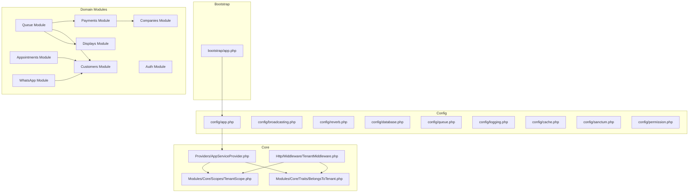
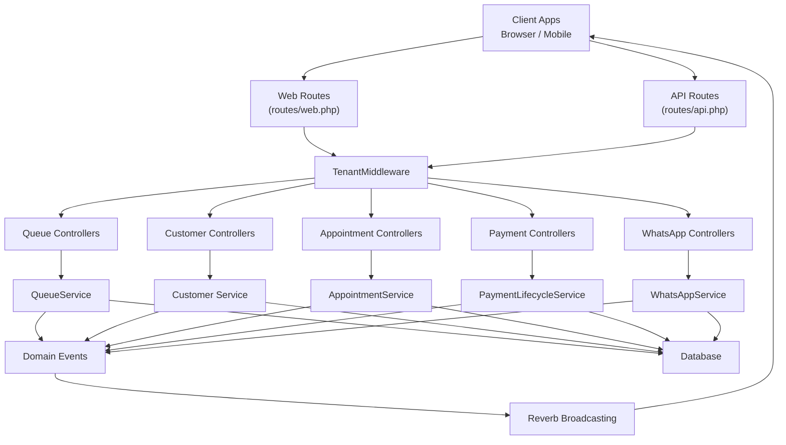
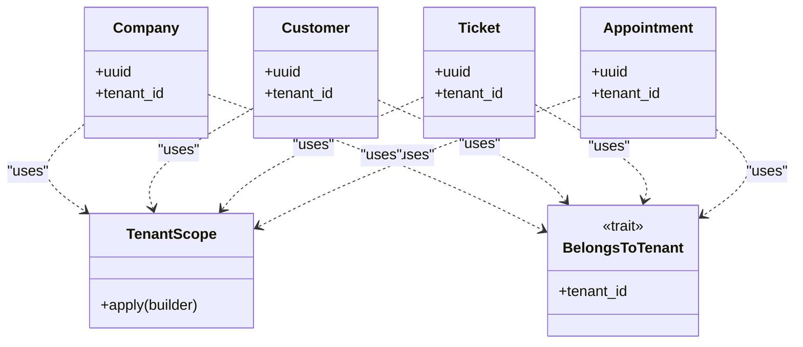
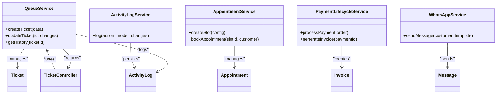
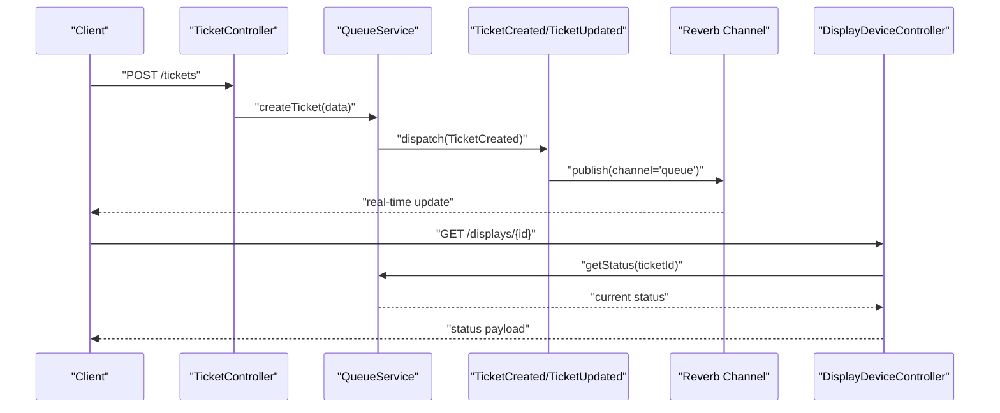
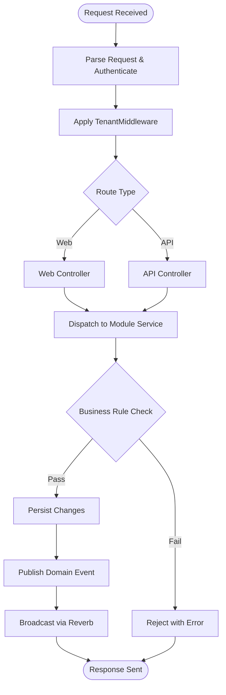
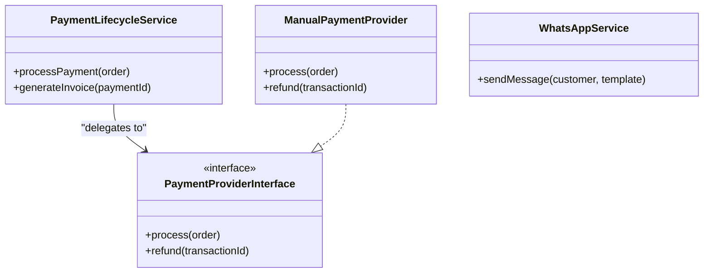
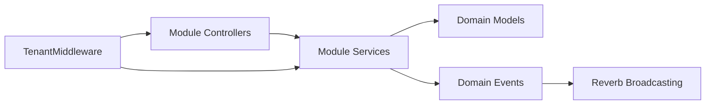

# Architecture Overview

<cite>
**Referenced Files in This Document**
- [AppServiceProvider.php](file://app/Providers/AppServiceProvider.php)
- [TenantManager.php](file://app/Services/TenantManager.php)
- [TenantScope.php](file://app/Modules/Core/Scopes/TenantScope.php)
- [BelongsToTenant.php](file://app/Modules/Core/Traits/BelongsToTenant.php)
- [TenantMiddleware.php](file://app/Http/Middleware/TenantMiddleware.php)
- [app.php](file://bootstrap/app.php)
- [broadcasting.php](file://config/broadcasting.php)
- [reverb.php](file://config/reverb.php)
- [channels.php](file://routes/channels.php)
- [api.php](file://routes/api.php)
- [web.php](file://routes/web.php)
- [Company.php](file://app/Modules/Companies/Models/Company.php)
- [Customer.php](file://app/Modules/Customers/Models/Customer.php)
- [Ticket.php](file://app/Modules/Queue/Models/Ticket.php)
- [Appointment.php](file://app/Modules/Appointments/Models/Appointment.php)
- [PaymentProviderInterface.php](file://app/Modules/Payments/Contracts/PaymentProviderInterface.php)
- [ManualPaymentProvider.php](file://app/Modules/Payments/Providers/ManualPaymentProvider.php)
- [PaymentLifecycleService.php](file://app/Modules/Payments/Services/PaymentLifecycleService.php)
- [WhatsAppService.php](file://app/Modules/WhatsApp/Services/WhatsAppService.php)
- [QueueService.php](file://app/Modules/Queue/Services/QueueService.php)
- [ActivityLogService.php](file://app/Modules/Queue/Services/ActivityLogService.php)
- [AppointmentService.php](file://app/Modules/Appointments/Services/AppointmentService.php)
- [DevicePaired.php](file://app/Modules/Queue/Events/DevicePaired.php)
- [TicketCreated.php](file://app/Modules/Queue/Events/TicketCreated.php)
- [TicketUpdated.php](file://app/Modules/Queue/Events/TicketUpdated.php)
- [AppModulesQueueEventsDevicePaired.php](file://app/Events/AppModulesQueueEventsDevicePaired.php)
- [DisplayDevice.php](file://app/Modules/Displays/Models/DisplayDevice.php)
- [DisplayDeviceController.php](file://app/Modules/Displays/Controllers/DisplayDeviceController.php)
- [TicketController.php](file://app/Modules/Queue/Controllers/TicketController.php)
- [CustomerController.php](file://app/Modules/Customers/Controllers/CustomerController.php)
- [CompanySettingsController.php](file://app/Modules/Companies/Controllers/CompanySettingsController.php)
- [LoginController.php](file://app/Modules/Auth/Controllers/LoginController.php)
- [RegisterService.php](file://app/Modules/Auth/Services/RegisterService.php)
- [analytics.php](file://config/analytics.php)
- [logging.php](file://config/logging.php)
- [cache.php](file://config/cache.php)
- [sanctum.php](file://config/sanctum.php)
- [permission.php](file://config/permission.php)
- [queue.php](file://config/queue.php)
- [database.php](file://config/database.php)
</cite>

## Table of Contents
1. [Introduction](#introduction)
2. [Project Structure](#project-structure)
3. [Core Components](#core-components)
4. [Architecture Overview](#architecture-overview)
5. [Detailed Component Analysis](#detailed-component-analysis)
6. [Dependency Analysis](#dependency-analysis)
7. [Performance Considerations](#performance-considerations)
8. [Troubleshooting Guide](#troubleshooting-guide)
9. [Conclusion](#conclusion)

## Introduction
This document presents the architecture of Noubtigo, a multi-tenant Laravel-based platform implementing a service-oriented design. The system orchestrates queue management, customer relationship handling, appointment scheduling, payment processing, and real-time communication via WebSockets. It emphasizes tenant isolation, event-driven updates, and modular extensibility across business domains.

## Project Structure
Noubtigo follows Laravel conventions with a modular directory layout under app/Modules, grouping features by domain (Queue, Customers, Appointments, Payments, WhatsApp, etc.). Cross-cutting concerns are centralized in app/Modules/Core (traits and scopes), while infrastructure concerns live under config/, routes/, and bootstrap/.

**Diagram sources**
- [app.php:1-50](file://bootstrap/app.php#L1-L50)
- [broadcasting.php:1-50](file://config/broadcasting.php#L1-L50)
- [reverb.php:1-50](file://config/reverb.php#L1-L50)
- [TenantScope.php:1-100](file://app/Modules/Core/Scopes/TenantScope.php#L1-L100)
- [BelongsToTenant.php:1-100](file://app/Modules/Core/Traits/BelongsToTenant.php#L1-L100)
- [TenantMiddleware.php:1-100](file://app/Http/Middleware/TenantMiddleware.php#L1-L100)
- [AppServiceProvider.php:1-100](file://app/Providers/AppServiceProvider.php#L1-L100)

**Section sources**
- [app.php:1-50](file://bootstrap/app.php#L1-L50)
- [config/app.php:1-50](file://config/app.php#L1-L50)

## Core Components
- Multi-tenant isolation: Implemented via TenantScope and BelongsToTenant to constrain queries and model relationships per tenant.
- Service layer: Each module exposes Services that encapsulate business logic and orchestrate domain operations.
- Event-driven updates: Domain events trigger real-time broadcasts via Laravel Reverb/WebSockets.
- Integration contracts: Payment provider interface enables pluggable payment processing.
- Middleware pipeline: TenantMiddleware ensures tenant context is set for every request.

**Section sources**
- [TenantScope.php:1-100](file://app/Modules/Core/Scopes/TenantScope.php#L1-L100)
- [BelongsToTenant.php:1-100](file://app/Modules/Core/Traits/BelongsToTenant.php#L1-L100)
- [TenantMiddleware.php:1-100](file://app/Http/Middleware/TenantMiddleware.php#L1-L100)
- [PaymentProviderInterface.php:1-100](file://app/Modules/Payments/Contracts/PaymentProviderInterface.php#L1-L100)

## Architecture Overview
Noubtigo employs a layered, service-oriented architecture with explicit separation of concerns:
- Presentation: Controllers in each module handle HTTP requests and delegate to Services.
- Application: Services coordinate workflows, enforce business rules, and publish events.
- Infrastructure: Models apply tenant scoping, repositories (via Eloquent) persist data, and external integrations are abstracted behind contracts.
- Real-time: Events propagate to Reverb channels for live UI updates.

**Diagram sources**
- [web.php:1-100](file://routes/web.php#L1-L100)
- [api.php:1-100](file://routes/api.php#L1-L100)
- [TenantMiddleware.php:1-100](file://app/Http/Middleware/TenantMiddleware.php#L1-L100)
- [QueueService.php:1-100](file://app/Modules/Queue/Services/QueueService.php#L1-L100)
- [ActivityLogService.php:1-100](file://app/Modules/Queue/Services/ActivityLogService.php#L1-L100)
- [CustomerController.php:1-100](file://app/Modules/Customers/Controllers/CustomerController.php#L1-L100)
- [AppointmentService.php:1-100](file://app/Modules/Appointments/Services/AppointmentService.php#L1-L100)
- [PaymentLifecycleService.php:1-100](file://app/Modules/Payments/Services/PaymentLifecycleService.php#L1-L100)
- [WhatsAppService.php:1-100](file://app/Modules/WhatsApp/Services/WhatsAppService.php#L1-L100)
- [broadcasting.php:1-100](file://config/broadcasting.php#L1-L100)
- [reverb.php:1-100](file://config/reverb.php#L1-L100)

## Detailed Component Analysis

### Multi-Tenant Pattern and Isolation
Tenant isolation is enforced at two levels:
- Query-level scoping via TenantScope applied to Eloquent models.
- Model-level trait BelongsToTenant to ensure related records belong to the current tenant.

**Diagram sources**
- [TenantScope.php:1-100](file://app/Modules/Core/Scopes/TenantScope.php#L1-L100)
- [BelongsToTenant.php:1-100](file://app/Modules/Core/Traits/BelongsToTenant.php#L1-L100)
- [Company.php:1-100](file://app/Modules/Companies/Models/Company.php#L1-L100)
- [Customer.php:1-100](file://app/Modules/Customers/Models/Customer.php#L1-L100)
- [Ticket.php:1-100](file://app/Modules/Queue/Models/Ticket.php#L1-L100)
- [Appointment.php:1-100](file://app/Modules/Appointments/Models/Appointment.php#L1-L100)

Key mechanisms:
- Tenant identification: Managed by TenantManager and injected into the request lifecycle via TenantMiddleware.
- Scope application: TenantScope automatically applies tenant filters to queries.
- Trait usage: BelongsToTenant adds tenant constraints to model relations.

**Section sources**
- [TenantManager.php:1-100](file://app/Services/TenantManager.php#L1-L100)
- [TenantMiddleware.php:1-100](file://app/Http/Middleware/TenantMiddleware.php#L1-L100)
- [TenantScope.php:1-100](file://app/Modules/Core/Scopes/TenantScope.php#L1-L100)
- [BelongsToTenant.php:1-100](file://app/Modules/Core/Traits/BelongsToTenant.php#L1-L100)

### Service Layer Abstraction and Dependency Injection
Each module exposes a Service class that encapsulates domain logic and coordinates interactions:
- QueueService orchestrates ticket creation, updates, and history.
- ActivityLogService manages audit trails for queue actions.
- AppointmentService handles scheduling and slot management.
- PaymentLifecycleService coordinates payment transactions and invoicing.
- WhatsAppService integrates messaging workflows.

**Diagram sources**
- [QueueService.php:1-100](file://app/Modules/Queue/Services/QueueService.php#L1-L100)
- [ActivityLogService.php:1-100](file://app/Modules/Queue/Services/ActivityLogService.php#L1-L100)
- [AppointmentService.php:1-100](file://app/Modules/Appointments/Services/AppointmentService.php#L1-L100)
- [PaymentLifecycleService.php:1-100](file://app/Modules/Payments/Services/PaymentLifecycleService.php#L1-L100)
- [WhatsAppService.php:1-100](file://app/Modules/WhatsApp/Services/WhatsAppService.php#L1-L100)
- [TicketController.php:1-100](file://app/Modules/Queue/Controllers/TicketController.php#L1-L100)

**Section sources**
- [QueueService.php:1-100](file://app/Modules/Queue/Services/QueueService.php#L1-L100)
- [ActivityLogService.php:1-100](file://app/Modules/Queue/Services/ActivityLogService.php#L1-L100)
- [AppointmentService.php:1-100](file://app/Modules/Appointments/Services/AppointmentService.php#L1-L100)
- [PaymentLifecycleService.php:1-100](file://app/Modules/Payments/Services/PaymentLifecycleService.php#L1-L100)
- [WhatsAppService.php:1-100](file://app/Modules/WhatsApp/Services/WhatsAppService.php#L1-L100)

### Event-Driven Architecture and Real-Time Updates
Domain events are published when state changes occur (e.g., tickets created/updated, devices paired). These events are broadcast via Reverb channels to connected clients.

**Diagram sources**
- [TicketController.php:1-100](file://app/Modules/Queue/Controllers/TicketController.php#L1-L100)
- [QueueService.php:1-100](file://app/Modules/Queue/Services/QueueService.php#L1-L100)
- [TicketCreated.php:1-100](file://app/Modules/Queue/Events/TicketCreated.php#L1-L100)
- [TicketUpdated.php:1-100](file://app/Modules/Queue/Events/TicketUpdated.php#L1-L100)
- [DisplayDeviceController.php:1-100](file://app/Modules/Displays/Controllers/DisplayDeviceController.php#L1-L100)
- [broadcasting.php:1-100](file://config/broadcasting.php#L1-L100)
- [reverb.php:1-100](file://config/reverb.php#L1-L100)

**Section sources**
- [DevicePaired.php:1-100](file://app/Modules/Queue/Events/DevicePaired.php#L1-L100)
- [AppModulesQueueEventsDevicePaired.php:1-100](file://app/Events/AppModulesQueueEventsDevicePaired.php#L1-L100)
- [channels.php:1-100](file://routes/channels.php#L1-L100)

### Data Flows Across Core Modules
- Queue Management: Creation, updates, history, and display integration.
- Customer Management: Registration, portal access, and profile linkage.
- Appointment System: Slot generation and booking coordination.
- Payment Processing: Lifecycle orchestration with provider abstraction.
- WhatsApp Integration: Messaging workflows linked to customer and queue events.

**Diagram sources**
- [web.php:1-100](file://routes/web.php#L1-L100)
- [api.php:1-100](file://routes/api.php#L1-L100)
- [TenantMiddleware.php:1-100](file://app/Http/Middleware/TenantMiddleware.php#L1-L100)
- [QueueService.php:1-100](file://app/Modules/Queue/Services/QueueService.php#L1-L100)
- [broadcasting.php:1-100](file://config/broadcasting.php#L1-L100)
- [reverb.php:1-100](file://config/reverb.php#L1-L100)

### External Integrations
- Payment Providers: Pluggable via PaymentProviderInterface with ManualPaymentProvider as an example.
- WhatsApp: Integrated through WhatsAppService for customer notifications and reminders.

**Diagram sources**
- [PaymentProviderInterface.php:1-100](file://app/Modules/Payments/Contracts/PaymentProviderInterface.php#L1-L100)
- [ManualPaymentProvider.php:1-100](file://app/Modules/Payments/Providers/ManualPaymentProvider.php#L1-L100)
- [PaymentLifecycleService.php:1-100](file://app/Modules/Payments/Services/PaymentLifecycleService.php#L1-L100)
- [WhatsAppService.php:1-100](file://app/Modules/WhatsApp/Services/WhatsAppService.php#L1-L100)

**Section sources**
- [PaymentProviderInterface.php:1-100](file://app/Modules/Payments/Contracts/PaymentProviderInterface.php#L1-L100)
- [ManualPaymentProvider.php:1-100](file://app/Modules/Payments/Providers/ManualPaymentProvider.php#L1-L100)
- [PaymentLifecycleService.php:1-100](file://app/Modules/Payments/Services/PaymentLifecycleService.php#L1-L100)
- [WhatsAppService.php:1-100](file://app/Modules/WhatsApp/Services/WhatsAppService.php#L1-L100)

### Authentication, Authorization, Logging, and Caching
- Authentication: Sanctum configuration supports API tokens and SPA authentication.
- Authorization: Permission and role-based controls integrated via config/permission.php and RBAC traits.
- Logging: Centralized logging configuration for structured logs and error tracking.
- Caching: Redis-based caching enabled for performance-sensitive operations.

**Section sources**
- [sanctum.php:1-100](file://config/sanctum.php#L1-L100)
- [permission.php:1-100](file://config/permission.php#L1-L100)
- [logging.php:1-100](file://config/logging.php#L1-L100)
- [cache.php:1-100](file://config/cache.php#L1-L100)

## Dependency Analysis
The system exhibits low coupling and high cohesion:
- Controllers depend on Services, not on each other.
- Services depend on domain models and events, not on HTTP specifics.
- TenantMiddleware injects tenant context early in the pipeline.
- Broadcasting is decoupled from business logic via events.

**Diagram sources**
- [TenantMiddleware.php:1-100](file://app/Http/Middleware/TenantMiddleware.php#L1-L100)
- [QueueService.php:1-100](file://app/Modules/Queue/Services/QueueService.php#L1-L100)
- [broadcasting.php:1-100](file://config/broadcasting.php#L1-L100)
- [reverb.php:1-100](file://config/reverb.php#L1-L100)

**Section sources**
- [TenantMiddleware.php:1-100](file://app/Http/Middleware/TenantMiddleware.php#L1-L100)
- [QueueService.php:1-100](file://app/Modules/Queue/Services/QueueService.php#L1-L100)

## Performance Considerations
- Prefer tenant-scoped queries to avoid accidental cross-tenant reads.
- Use batch operations for queue updates to minimize database round-trips.
- Cache frequently accessed configurations (e.g., company settings) with appropriate invalidation.
- Offload long-running tasks (e.g., notifications, reporting) to queued jobs.

## Troubleshooting Guide
- Tenant data leakage: Verify TenantMiddleware is registered and TenantScope is applied to models.
- Real-time updates not received: Confirm Reverb server is running and broadcasting.php/reverb.php are configured correctly.
- Payment failures: Inspect PaymentLifecycleService logs and provider-specific error handling.
- Queue anomalies: Review ActivityLogService entries and event dispatch order.

**Section sources**
- [TenantMiddleware.php:1-100](file://app/Http/Middleware/TenantMiddleware.php#L1-L100)
- [broadcasting.php:1-100](file://config/broadcasting.php#L1-L100)
- [reverb.php:1-100](file://config/reverb.php#L1-L100)
- [ActivityLogService.php:1-100](file://app/Modules/Queue/Services/ActivityLogService.php#L1-L100)
- [PaymentLifecycleService.php:1-100](file://app/Modules/Payments/Services/PaymentLifecycleService.php#L1-L100)

## Conclusion
Noubtigo’s architecture balances modularity, tenant isolation, and real-time responsiveness. The service-oriented design, combined with tenant-aware models and a robust event-broadcasting pipeline, enables scalable growth across multiple tenants and domains. Clear separation of concerns and pluggable integrations support future enhancements and maintenance.