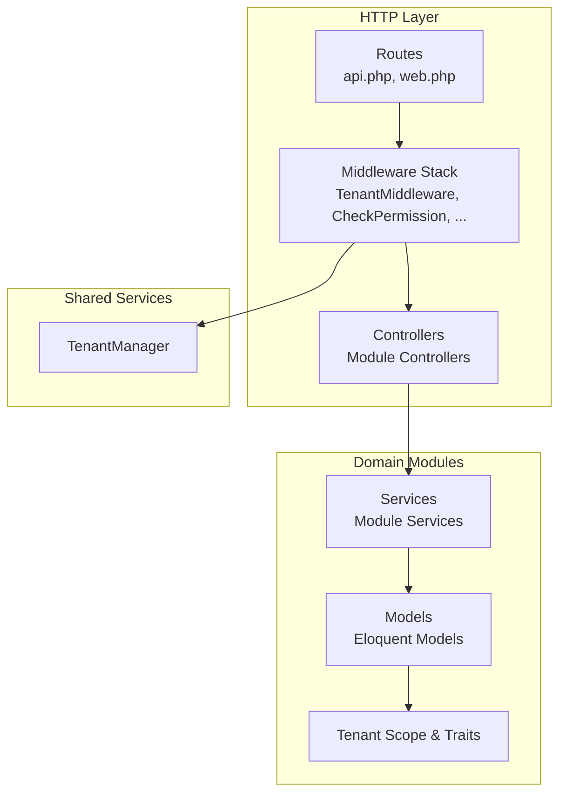
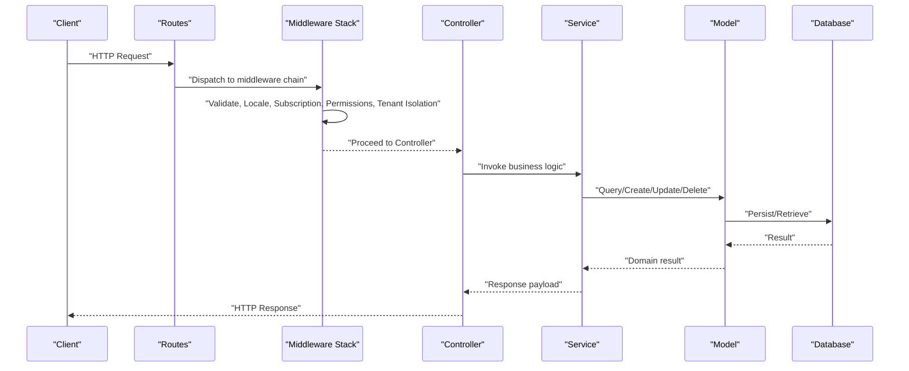
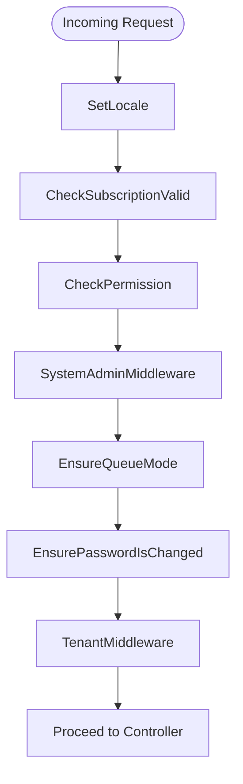
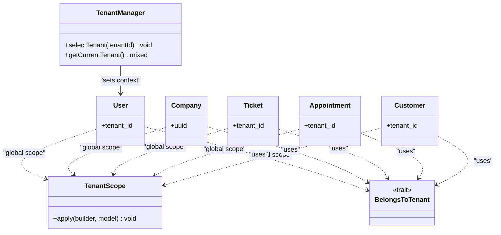
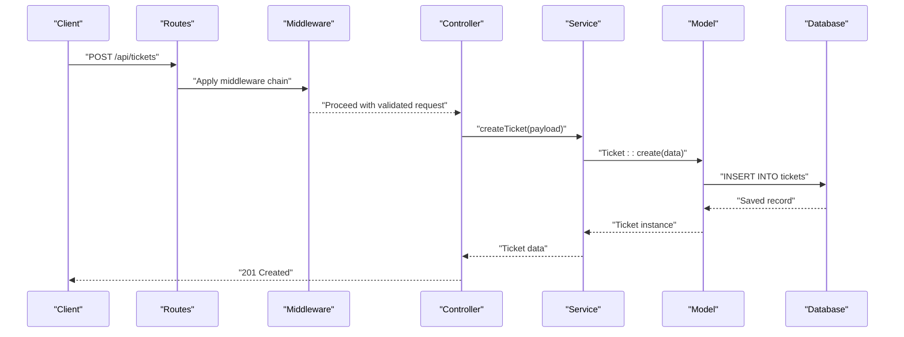
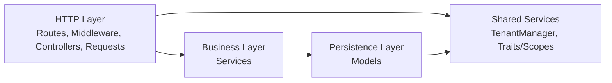
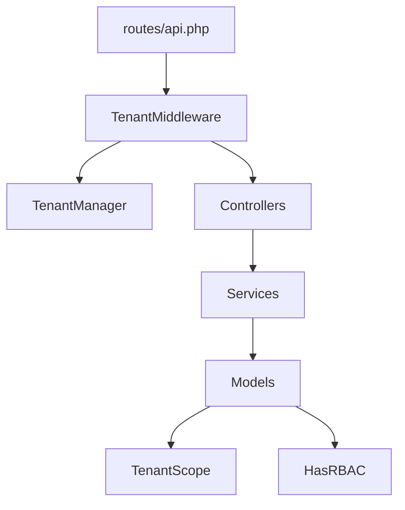

# Data Flow Patterns

<cite>
**Referenced Files in This Document**
- [Controller.php](file://app/Http/Controllers/Controller.php)
- [TenantMiddleware.php](file://app/Http/Middleware/TenantMiddleware.php)
- [CheckPermission.php](file://app/Http/Middleware/CheckPermission.php)
- [CheckSubscriptionValid.php](file://app/Http/Middleware/CheckSubscriptionValid.php)
- [EnsurePasswordIsChanged.php](file://app/Http/Middleware/EnsurePasswordIsChanged.php)
- [EnsureQueueMode.php](file://app/Http/Middleware/EnsureQueueMode.php)
- [SetLocale.php](file://app/Http/Middleware/SetLocale.php)
- [SystemAdminMiddleware.php](file://app/Http/Middleware/SystemAdminMiddleware.php)
- [AuthorizeDisplayRequest.php](file://app/Http/Requests/AuthorizeDisplayRequest.php)
- [TenantManager.php](file://app/Services/TenantManager.php)
- [TenantScope.php](file://app/Modules/Core/Scopes/TenantScope.php)
- [BelongsToTenant.php](file://app/Modules/Core/Traits/BelongsToTenant.php)
- [HasRBAC.php](file://app/Modules/Core/Traits/HasRBAC.php)
- [User.php](file://app/Models/User.php)
- [Company.php](file://app/Modules/Companies/Models/Company.php)
- [Ticket.php](file://app/Modules/Queue/Models/Ticket.php)
- [Appointment.php](file://app/Modules/Appointments/Models/Appointment.php)
- [Customer.php](file://app/Modules/Customers/Models/Customer.php)
- [api.php](file://routes/api.php)
- [web.php](file://routes/web.php)
- [app.php](file://bootstrap/app.php)
- [AppServiceProvider.php](file://app/Providers/AppServiceProvider.php)
</cite>

## Table of Contents
1. [Introduction](#introduction)
2. [Project Structure](#project-structure)
3. [Core Components](#core-components)
4. [Architecture Overview](#architecture-overview)
5. [Detailed Component Analysis](#detailed-component-analysis)
6. [Dependency Analysis](#dependency-analysis)
7. [Performance Considerations](#performance-considerations)
8. [Troubleshooting Guide](#troubleshooting-guide)
9. [Conclusion](#conclusion)

## Introduction
This document explains Noubtigo’s request processing pipeline and data flow patterns. It focuses on the middleware stack for request filtering, tenant isolation, and permission checks; the request-response cycle from HTTP entry point through middleware, controllers, services, and models; and the tenant scoping mechanism integrated into the request pipeline. It also covers data transformation, validation, and error handling across layers, and clarifies separation of concerns between HTTP, business logic, and persistence layers.

## Project Structure
Noubtigo follows a modular Laravel-style structure:
- HTTP layer: controllers, middleware, and requests
- Domain modules: feature-specific controllers, models, services, and traits/scopes
- Shared services: tenant management, feature flags, timezone utilities
- Application bootstrap and routing: configured via bootstrap and routes files

**Section sources**
- [api.php](file://routes/api.php)
- [web.php](file://routes/web.php)
- [app.php](file://bootstrap/app.php)

## Core Components
- Middleware stack orchestrates request filtering, locale setting, subscription checks, permissions, and tenant isolation.
- Controllers coordinate request handling and delegate business logic to services.
- Services encapsulate domain operations and coordinate model interactions.
- Models represent entities and apply tenant scoping and RBAC traits.
- Shared services manage cross-cutting concerns like tenant selection and localization.

Key responsibilities:
- Request validation: performed via form requests and middleware.
- Tenant scoping: applied globally via Eloquent scopes and traits.
- Permission enforcement: centralized in dedicated middleware.
- Data transformation: handled in services and controllers.

**Section sources**
- [TenantMiddleware.php](file://app/Http/Middleware/TenantMiddleware.php)
- [CheckPermission.php](file://app/Http/Middleware/CheckPermission.php)
- [AuthorizeDisplayRequest.php](file://app/Http/Requests/AuthorizeDisplayRequest.php)
- [TenantManager.php](file://app/Services/TenantManager.php)
- [TenantScope.php](file://app/Modules/Core/Scopes/TenantScope.php)
- [BelongsToTenant.php](file://app/Modules/Core/Traits/BelongsToTenant.php)
- [HasRBAC.php](file://app/Modules/Core/Traits/HasRBAC.php)

## Architecture Overview
The request lifecycle begins at the HTTP entry point, traverses the middleware stack, reaches the controller, delegates to services, manipulates models, and returns a response. Tenant scoping and permission checks are enforced early in the pipeline.

**Diagram sources**
- [api.php](file://routes/api.php)
- [web.php](file://routes/web.php)
- [TenantMiddleware.php](file://app/Http/Middleware/TenantMiddleware.php)
- [CheckPermission.php](file://app/Http/Middleware/CheckPermission.php)
- [Controller.php](file://app/Http/Controllers/Controller.php)

## Detailed Component Analysis

### Middleware Stack Implementation
The middleware stack handles:
- Locale selection and request localization
- Subscription validity checks
- Permission verification
- System admin bypass
- Queue mode enforcement
- Password change requirement
- Tenant isolation

**Diagram sources**
- [SetLocale.php](file://app/Http/Middleware/SetLocale.php)
- [CheckSubscriptionValid.php](file://app/Http/Middleware/CheckSubscriptionValid.php)
- [CheckPermission.php](file://app/Http/Middleware/CheckPermission.php)
- [SystemAdminMiddleware.php](file://app/Http/Middleware/SystemAdminMiddleware.php)
- [EnsureQueueMode.php](file://app/Http/Middleware/EnsureQueueMode.php)
- [EnsurePasswordIsChanged.php](file://app/Http/Middleware/EnsurePasswordIsChanged.php)
- [TenantMiddleware.php](file://app/Http/Middleware/TenantMiddleware.php)

Validation and transformation:
- Form requests validate incoming data and authorize actions.
- Middleware performs cross-cutting checks and short-circuits invalid requests.

**Section sources**
- [AuthorizeDisplayRequest.php](file://app/Http/Requests/AuthorizeDisplayRequest.php)
- [CheckPermission.php](file://app/Http/Middleware/CheckPermission.php)
- [CheckSubscriptionValid.php](file://app/Http/Middleware/CheckSubscriptionValid.php)
- [EnsurePasswordIsChanged.php](file://app/Http/Middleware/EnsurePasswordIsChanged.php)
- [EnsureQueueMode.php](file://app/Http/Middleware/EnsureQueueMode.php)
- [SetLocale.php](file://app/Http/Middleware/SetLocale.php)
- [SystemAdminMiddleware.php](file://app/Http/Middleware/SystemAdminMiddleware.php)
- [TenantMiddleware.php](file://app/Http/Middleware/TenantMiddleware.php)

### Tenant Isolation Mechanism
Tenant scoping ensures data isolation across multi-tenant entities:
- TenantManager selects the current tenant context.
- Eloquent models apply a global scope that filters queries by tenant.
- Models use a belongs-to-tenant trait to enforce ownership and visibility.

**Diagram sources**
- [TenantManager.php](file://app/Services/TenantManager.php)
- [TenantScope.php](file://app/Modules/Core/Scopes/TenantScope.php)
- [BelongsToTenant.php](file://app/Modules/Core/Traits/BelongsToTenant.php)
- [User.php](file://app/Models/User.php)
- [Company.php](file://app/Modules/Companies/Models/Company.php)
- [Ticket.php](file://app/Modules/Queue/Models/Ticket.php)
- [Appointment.php](file://app/Modules/Appointments/Models/Appointment.php)
- [Customer.php](file://app/Modules/Customers/Models/Customer.php)

### Request-Response Cycle: From HTTP Entry to Persistence
The typical flow:
- Routes dispatch to middleware chain
- Middleware validates and sets context
- Controller receives validated request and calls service
- Service orchestrates model operations with tenant-aware queries
- Model operations persist or retrieve data scoped to tenant
- Response is returned to client

**Diagram sources**
- [api.php](file://routes/api.php)
- [TenantMiddleware.php](file://app/Http/Middleware/TenantMiddleware.php)
- [Controller.php](file://app/Http/Controllers/Controller.php)
- [Ticket.php](file://app/Modules/Queue/Models/Ticket.php)

### Data Transformation, Validation, and Error Handling
- Validation: form requests and middleware validate inputs and guardrails.
- Transformation: controllers and services transform raw inputs into domain-ready structures.
- Error handling: middleware and controllers return appropriate HTTP responses; services raise domain exceptions; models persist or fail gracefully.

Common patterns:
- Early-exit on invalid inputs via middleware/form requests.
- Centralized permission checks to prevent unauthorized access.
- Tenant-aware queries to avoid cross-tenant leakage.

**Section sources**
- [AuthorizeDisplayRequest.php](file://app/Http/Requests/AuthorizeDisplayRequest.php)
- [CheckPermission.php](file://app/Http/Middleware/CheckPermission.php)
- [TenantMiddleware.php](file://app/Http/Middleware/TenantMiddleware.php)
- [Controller.php](file://app/Http/Controllers/Controller.php)

### Separation of Concerns Across Layers
- HTTP layer: routes, middleware, controllers, and form requests handle transport, validation, and orchestration.
- Business logic: services encapsulate domain workflows and coordinate models.
- Persistence: models define schema, relationships, and tenant-scoped queries.
- Cross-cutting: shared services (e.g., TenantManager) and traits/scopes enforce policies consistently.

**Diagram sources**
- [api.php](file://routes/api.php)
- [TenantMiddleware.php](file://app/Http/Middleware/TenantMiddleware.php)
- [Controller.php](file://app/Http/Controllers/Controller.php)
- [TenantManager.php](file://app/Services/TenantManager.php)
- [TenantScope.php](file://app/Modules/Core/Scopes/TenantScope.php)
- [BelongsToTenant.php](file://app/Modules/Core/Traits/BelongsToTenant.php)

## Dependency Analysis
The system exhibits low coupling and high cohesion:
- Controllers depend on services, not on models directly.
- Services depend on models and shared services.
- Models depend on tenant scope and RBAC traits.
- Middleware depends on shared services and configuration.

**Diagram sources**
- [api.php](file://routes/api.php)
- [TenantMiddleware.php](file://app/Http/Middleware/TenantMiddleware.php)
- [TenantManager.php](file://app/Services/TenantManager.php)
- [TenantScope.php](file://app/Modules/Core/Scopes/TenantScope.php)
- [HasRBAC.php](file://app/Modules/Core/Traits/HasRBAC.php)

**Section sources**
- [AppServiceProvider.php](file://app/Providers/AppServiceProvider.php)

## Performance Considerations
- Prefer tenant-scoped queries to minimize unnecessary scans.
- Use middleware to filter invalid requests early and reduce downstream work.
- Batch model updates where possible to reduce round-trips.
- Cache frequently accessed configuration per tenant when feasible.

## Troubleshooting Guide
Common issues and remedies:
- Unauthorized access: verify permission middleware and RBAC configuration.
- Wrong tenant data: confirm tenant middleware is applied and TenantManager is set.
- Validation failures: inspect form request rules and middleware guards.
- Subscription-related errors: ensure subscription middleware runs before business logic.

**Section sources**
- [CheckPermission.php](file://app/Http/Middleware/CheckPermission.php)
- [CheckSubscriptionValid.php](file://app/Http/Middleware/CheckSubscriptionValid.php)
- [TenantMiddleware.php](file://app/Http/Middleware/TenantMiddleware.php)
- [HasRBAC.php](file://app/Modules/Core/Traits/HasRBAC.php)

## Conclusion
Noubtigo’s request pipeline emphasizes early validation, tenant isolation, and permission enforcement through a robust middleware stack. Controllers delegate to services, which operate on tenant-scoped models. Shared services and traits/scopes ensure consistent cross-cutting behavior. This layered approach improves maintainability, security, and scalability.