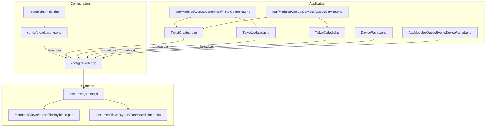
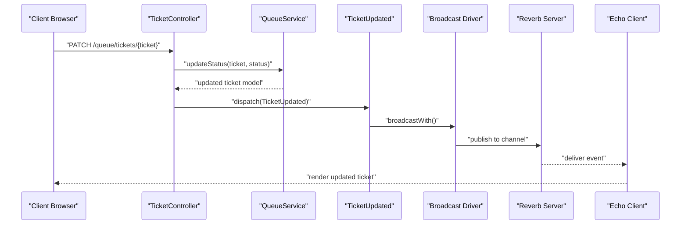
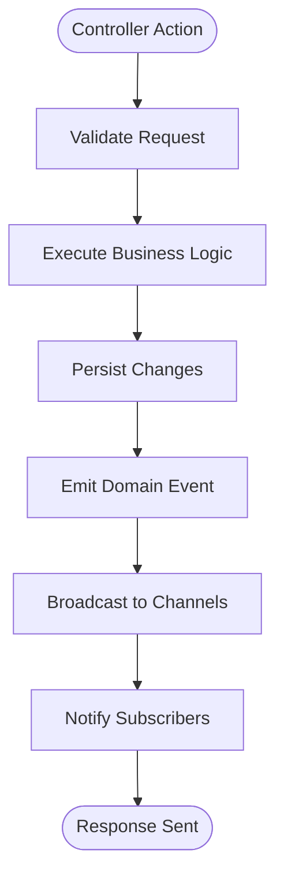
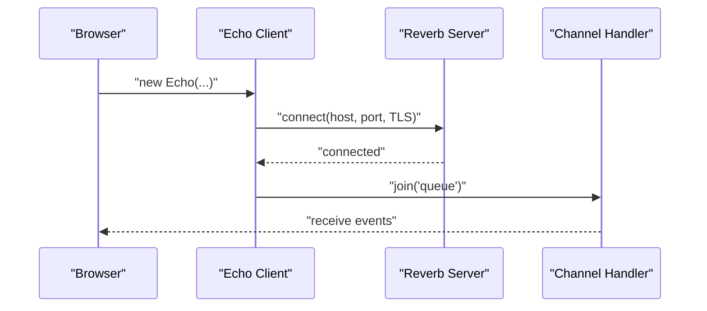
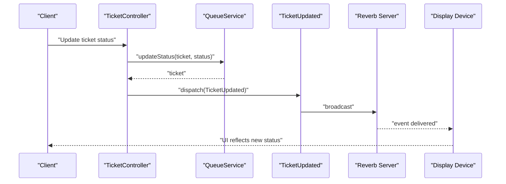
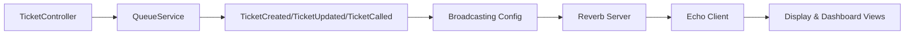

# Event-Driven Architecture

<cite>
**Referenced Files in This Document**
- [broadcasting.php](file://config/broadcasting.php)
- [reverb.php](file://config/reverb.php)
- [channels.php](file://routes/channels.php)
- [echo.js](file://resources/js/echo.js)
- [TicketController.php](file://app/Modules/Queue/Controllers/TicketController.php)
- [QueueService.php](file://app/Modules/Queue/Services/QueueService.php)
- [TicketCalled.php](file://app/Modules/Queue/Events/TicketCalled.php)
- [TicketCreated.php](file://app/Modules/Queue/Events/TicketCreated.php)
- [TicketUpdated.php](file://app/Modules/Queue/Events/TicketUpdated.php)
- [DevicePaired.php](file://app/Modules/Queue/Events/DevicePaired.php)
- [AppModulesQueueEventsDevicePaired.php](file://app/Events/AppModulesQueueEventsDevicePaired.php)
- [Ticket.php](file://app/Modules/Queue/Models/Ticket.php)
- [display.blade.php](file://resources/views/queue/display.blade.php)
- [dashboard.blade.php](file://resources/views/layouts/dashboard.blade.php)
</cite>

## Table of Contents
1. [Introduction](#introduction)
2. [Project Structure](#project-structure)
3. [Core Components](#core-components)
4. [Architecture Overview](#architecture-overview)
5. [Detailed Component Analysis](#detailed-component-analysis)
6. [Dependency Analysis](#dependency-analysis)
7. [Performance Considerations](#performance-considerations)
8. [Troubleshooting Guide](#troubleshooting-guide)
9. [Conclusion](#conclusion)

## Introduction
This document explains Noubtigo's event-driven architecture and real-time communication system. It covers how Laravel events and listeners power queue operations, how events are broadcast via Laravel Reverb to keep display devices updated in real time, and how front-end clients subscribe to live updates. The focus areas include:
- Event classes for ticket lifecycle changes and device pairing
- Broadcasting configuration and channel authorization
- Listener registration and event queuing mechanisms
- End-to-end workflows such as ticket status changes triggering display updates
- Front-end integration using Laravel Echo with Reverb

## Project Structure
The event-driven system spans several layers:
- Configuration: Broadcasting and Reverb settings
- Routes: Channel authorization for private channels
- Application: Event classes and services/controllers that dispatch events
- Front-end: Echo client initialization and Vue/Blade templates subscribing to channels

**Diagram sources**
- [broadcasting.php:1-31](file://config/broadcasting.php#L1-L31)
- [reverb.php:1-102](file://config/reverb.php#L1-L102)
- [channels.php:1-7](file://routes/channels.php#L1-L7)
- [TicketController.php:129-171](file://app/Modules/Queue/Controllers/TicketController.php#L129-L171)
- [QueueService.php:34-226](file://app/Modules/Queue/Services/QueueService.php#L34-L226)
- [TicketCreated.php](file://app/Modules/Queue/Events/TicketCreated.php)
- [TicketUpdated.php](file://app/Modules/Queue/Events/TicketUpdated.php)
- [TicketCalled.php](file://app/Modules/Queue/Events/TicketCalled.php)
- [DevicePaired.php](file://app/Modules/Queue/Events/DevicePaired.php)
- [AppModulesQueueEventsDevicePaired.php](file://app/Events/AppModulesQueueEventsDevicePaired.php)
- [echo.js:1-14](file://resources/js/echo.js#L1-L14)
- [display.blade.php](file://resources/views/queue/display.blade.php)
- [dashboard.blade.php:576-593](file://resources/views/layouts/dashboard.blade.php#L576-L593)

**Section sources**
- [broadcasting.php:1-31](file://config/broadcasting.php#L1-L31)
- [reverb.php:1-102](file://config/reverb.php#L1-L102)
- [channels.php:1-7](file://routes/channels.php#L1-L7)
- [TicketController.php:129-171](file://app/Modules/Queue/Controllers/TicketController.php#L129-L171)
- [QueueService.php:34-226](file://app/Modules/Queue/Services/QueueService.php#L34-L226)
- [echo.js:1-14](file://resources/js/echo.js#L1-L14)
- [display.blade.php](file://resources/views/queue/display.blade.php)
- [dashboard.blade.php:576-593](file://resources/views/layouts/dashboard.blade.php#L576-L593)

## Core Components
- Event classes encapsulate domain changes and define broadcast metadata:
  - TicketCreated: emitted when a new ticket is created
  - TicketUpdated: emitted when a ticket status changes
  - TicketCalled: emitted when a ticket is called to serve
  - DevicePaired: emitted when a display device pairs with the system
  - AppModulesQueueEventsDevicePaired: generic event for device pairing across modules
- Controllers and services trigger events after performing business operations
- Broadcasting configuration selects Reverb as the broadcaster and defines server settings
- Channel authorization restricts access to private channels
- Front-end uses Laravel Echo to connect to Reverb and subscribe to channels

Key implementation references:
- Event emission in controllers/services: [TicketController.php:149](file://app/Modules/Queue/Controllers/TicketController.php#L149), [QueueService.php:53](file://app/Modules/Queue/Services/QueueService.php#L53), [QueueService.php:114](file://app/Modules/Queue/Services/QueueService.php#L114)
- Event broadcast metadata: [TicketCalled.php:41-63](file://app/Modules/Queue/Events/TicketCalled.php#L41-L63)
- Broadcasting configuration: [broadcasting.php:18](file://config/broadcasting.php#L18), [reverb.php:31-55](file://config/reverb.php#L31-L55)
- Channel authorization: [channels.php:5-7](file://routes/channels.php#L5-L7)
- Front-end Echo setup: [echo.js:6-14](file://resources/js/echo.js#L6-L14)

**Section sources**
- [TicketController.php:129-171](file://app/Modules/Queue/Controllers/TicketController.php#L129-L171)
- [QueueService.php:34-226](file://app/Modules/Queue/Services/QueueService.php#L34-L226)
- [TicketCalled.php:41-63](file://app/Modules/Queue/Events/TicketCalled.php#L41-L63)
- [broadcasting.php:18](file://config/broadcasting.php#L18)
- [reverb.php:31-55](file://config/reverb.php#L31-L55)
- [channels.php:5-7](file://routes/channels.php#L5-L7)
- [echo.js:6-14](file://resources/js/echo.js#L6-L14)

## Architecture Overview
The system follows an event-driven pattern:
- Business operations emit domain events
- Events are broadcast via Reverb to subscribed clients
- Clients receive real-time updates and refresh UI accordingly

**Diagram sources**
- [TicketController.php:135-151](file://app/Modules/Queue/Controllers/TicketController.php#L135-L151)
- [QueueService.php:197-226](file://app/Modules/Queue/Services/QueueService.php#L197-L226)
- [TicketUpdated.php](file://app/Modules/Queue/Events/TicketUpdated.php)
- [broadcasting.php:18](file://config/broadcasting.php#L18)
- [reverb.php:31-55](file://config/reverb.php#L31-L55)
- [echo.js:6-14](file://resources/js/echo.js#L6-L14)

## Detailed Component Analysis

### Event Classes and Broadcasting Metadata
- TicketCreated: Emits when a ticket is created; triggers display updates for new tickets
- TicketUpdated: Emits when a ticket status changes; drives live queue board updates
- TicketCalled: Defines broadcast name and payload shape for called tickets
- DevicePaired: Emitted when a display device connects; enables targeted broadcasts
- AppModulesQueueEventsDevicePaired: Generic cross-module pairing event

Broadcasting specifics:
- Broadcast channel naming and payload shaping are defined in event classes
- Reverb server settings configure host, port, TLS, and scaling options
- Private channel authorization ensures only authorized users can listen

References:
- [TicketCalled.php:41-63](file://app/Modules/Queue/Events/TicketCalled.php#L41-L63)
- [reverb.php:31-55](file://config/reverb.php#L31-L55)
- [channels.php:5-7](file://routes/channels.php#L5-L7)

**Section sources**
- [TicketCalled.php:41-63](file://app/Modules/Queue/Events/TicketCalled.php#L41-L63)
- [reverb.php:31-55](file://config/reverb.php#L31-L55)
- [channels.php:5-7](file://routes/channels.php#L5-L7)

### Controller and Service Integration
Controllers orchestrate business operations and emit events:
- Status updates: [TicketController.php:135-151](file://app/Modules/Queue/Controllers/TicketController.php#L135-L151)
- Ticket creation: [QueueService.php:34-56](file://app/Modules/Queue/Services/QueueService.php#L34-L56), [QueueService.php:114](file://app/Modules/Queue/Services/QueueService.php#L114)

Services encapsulate business logic and emit appropriate events:
- Priority scoring and ticket lifecycle: [QueueService.php:122-195](file://app/Modules/Queue/Services/QueueService.php#L122-L195)
- Called ticket emission: [QueueService.php:200-226](file://app/Modules/Queue/Services/QueueService.php#L200-L226)

**Diagram sources**
- [TicketController.php:135-151](file://app/Modules/Queue/Controllers/TicketController.php#L135-L151)
- [QueueService.php:34-56](file://app/Modules/Queue/Services/QueueService.php#L34-L56)
- [QueueService.php:200-226](file://app/Modules/Queue/Services/QueueService.php#L200-L226)

**Section sources**
- [TicketController.php:135-151](file://app/Modules/Queue/Controllers/TicketController.php#L135-L151)
- [QueueService.php:34-56](file://app/Modules/Queue/Services/QueueService.php#L34-L56)
- [QueueService.php:200-226](file://app/Modules/Queue/Services/QueueService.php#L200-L226)

### Real-Time Communication with Laravel Echo and Reverb
Front-end setup:
- Echo client configured to use Reverb as broadcaster with environment variables for host, port, and TLS
- Channels are subscribed to in Blade templates for display devices and dashboards

References:
- [echo.js:6-14](file://resources/js/echo.js#L6-L14)
- [display.blade.php](file://resources/views/queue/display.blade.php)
- [dashboard.blade.php:576-593](file://resources/views/layouts/dashboard.blade.php#L576-L593)

**Diagram sources**
- [echo.js:6-14](file://resources/js/echo.js#L6-L14)
- [reverb.php:31-55](file://config/reverb.php#L31-L55)

**Section sources**
- [echo.js:6-14](file://resources/js/echo.js#L6-L14)
- [display.blade.php](file://resources/views/queue/display.blade.php)
- [dashboard.blade.php:576-593](file://resources/views/layouts/dashboard.blade.php#L576-L593)

### Event-Driven Workflows: Ticket Status Changes
End-to-end flow:
1. Client requests a status update
2. Controller validates and delegates to service
3. Service updates the model and emits TicketUpdated
4. Broadcasting publishes to subscribed channels
5. Display devices and dashboards receive updates

**Diagram sources**
- [TicketController.php:135-151](file://app/Modules/Queue/Controllers/TicketController.php#L135-L151)
- [QueueService.php:197-226](file://app/Modules/Queue/Services/QueueService.php#L197-L226)
- [TicketUpdated.php](file://app/Modules/Queue/Events/TicketUpdated.php)
- [reverb.php:31-55](file://config/reverb.php#L31-L55)

**Section sources**
- [TicketController.php:135-151](file://app/Modules/Queue/Controllers/TicketController.php#L135-L151)
- [QueueService.php:197-226](file://app/Modules/Queue/Services/QueueService.php#L197-L226)
- [TicketUpdated.php](file://app/Modules/Queue/Events/TicketUpdated.php)
- [reverb.php:31-55](file://config/reverb.php#L31-L55)

## Dependency Analysis
- Controllers depend on services for business logic and on events for side effects
- Events depend on broadcasting configuration and Reverb server settings
- Front-end depends on Echo configuration and environment variables
- Channel authorization ties user identity to channel access

**Diagram sources**
- [TicketController.php:135-151](file://app/Modules/Queue/Controllers/TicketController.php#L135-L151)
- [QueueService.php:34-56](file://app/Modules/Queue/Services/QueueService.php#L34-L56)
- [broadcasting.php:18](file://config/broadcasting.php#L18)
- [reverb.php:31-55](file://config/reverb.php#L31-L55)
- [echo.js:6-14](file://resources/js/echo.js#L6-L14)

**Section sources**
- [TicketController.php:135-151](file://app/Modules/Queue/Controllers/TicketController.php#L135-L151)
- [QueueService.php:34-56](file://app/Modules/Queue/Services/QueueService.php#L34-L56)
- [broadcasting.php:18](file://config/broadcasting.php#L18)
- [reverb.php:31-55](file://config/reverb.php#L31-L55)
- [echo.js:6-14](file://resources/js/echo.js#L6-L14)

## Performance Considerations
- Use selective broadcasting: limit channels and payloads to reduce bandwidth
- Batch frequent updates: coalesce multiple small changes into fewer broadcasts
- Optimize Reverb scaling: enable Redis-backed scaling for multi-instance deployments
- Minimize payload size: send only necessary fields in broadcastWith
- Leverage channel presence and authorization to avoid unnecessary traffic

[No sources needed since this section provides general guidance]

## Troubleshooting Guide
Common issues and resolutions:
- Broadcasting not working:
  - Verify default broadcaster selection and Reverb server configuration
  - Confirm environment variables for host, port, and scheme
  - References: [broadcasting.php:18](file://config/broadcasting.php#L18), [reverb.php:31-55](file://config/reverb.php#L31-L55)
- Channel authorization failures:
  - Ensure user ID matches channel pattern and authorization logic
  - Reference: [channels.php:5-7](file://routes/channels.php#L5-L7)
- Front-end connection problems:
  - Check Echo configuration and environment variables
  - Confirm TLS settings match server configuration
  - Reference: [echo.js:6-14](file://resources/js/echo.js#L6-L14)
- Display device updates not appearing:
  - Validate event broadcastAs and broadcastWith methods
  - Confirm client subscription to correct channel
  - References: [TicketCalled.php:41-63](file://app/Modules/Queue/Events/TicketCalled.php#L41-L63), [display.blade.php](file://resources/views/queue/display.blade.php)

**Section sources**
- [broadcasting.php:18](file://config/broadcasting.php#L18)
- [reverb.php:31-55](file://config/reverb.php#L31-L55)
- [channels.php:5-7](file://routes/channels.php#L5-L7)
- [echo.js:6-14](file://resources/js/echo.js#L6-L14)
- [TicketCalled.php:41-63](file://app/Modules/Queue/Events/TicketCalled.php#L41-L63)
- [display.blade.php](file://resources/views/queue/display.blade.php)

## Conclusion
Noubtigo's event-driven architecture leverages Laravel events and listeners to decouple business operations from real-time updates. Events like TicketCreated, TicketUpdated, and TicketCalled are broadcast via Reverb to keep display devices and dashboards synchronized. Channel authorization and Echo-based front-end clients ensure secure, scalable, and responsive user experiences. By following the patterns documented here, teams can extend the system with additional events and listeners while maintaining clean separation of concerns and efficient real-time communication.