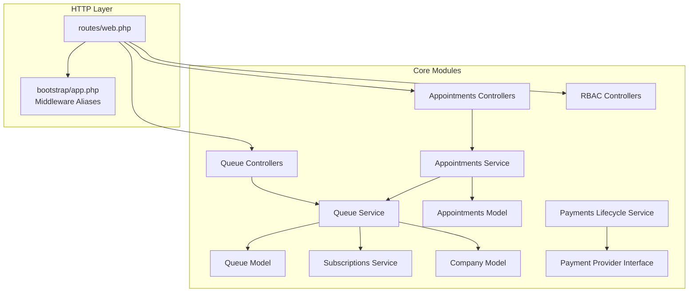
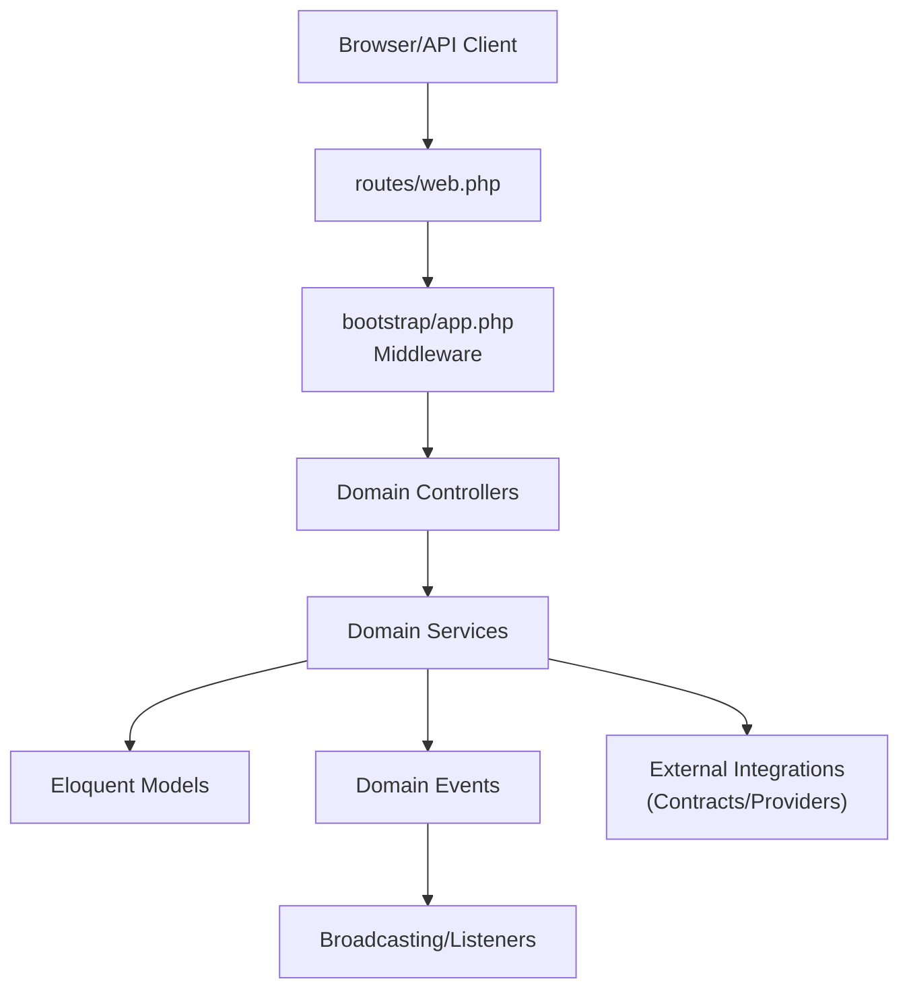
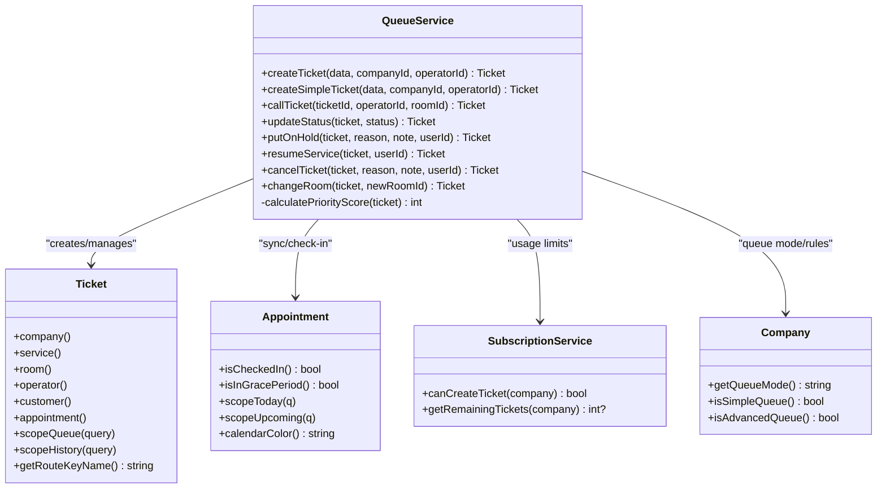
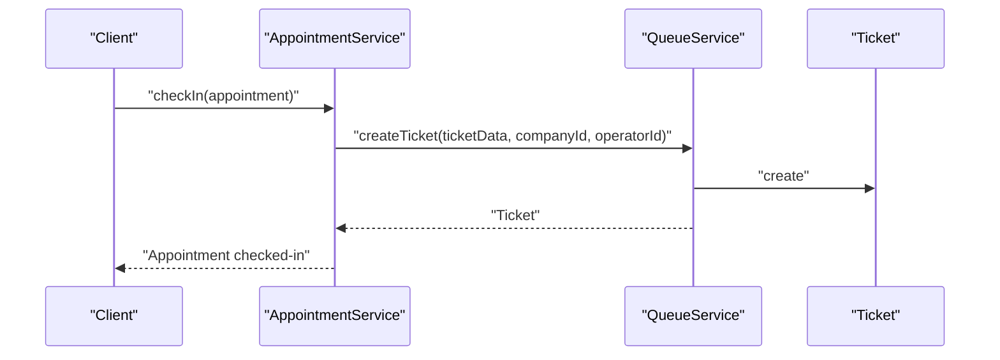
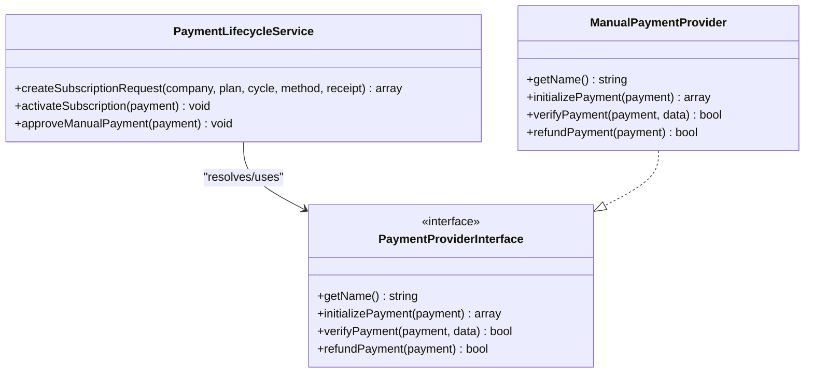
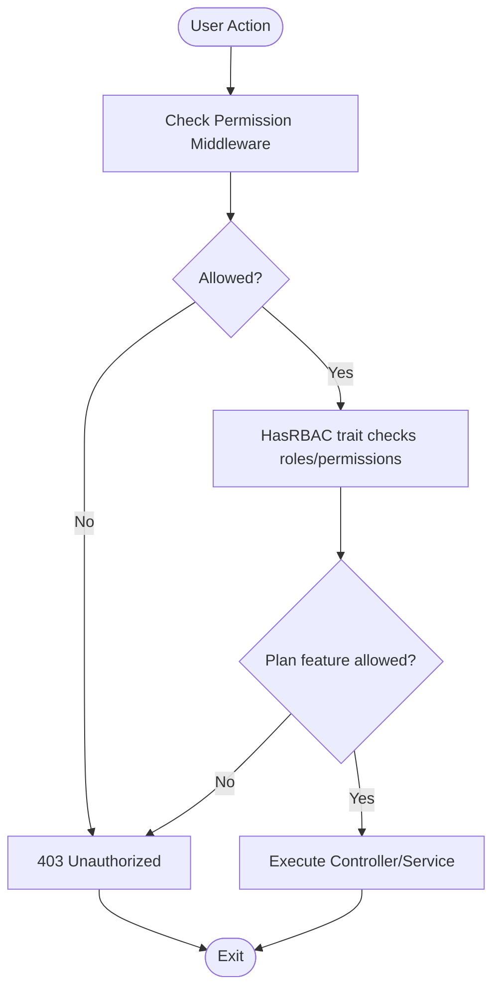
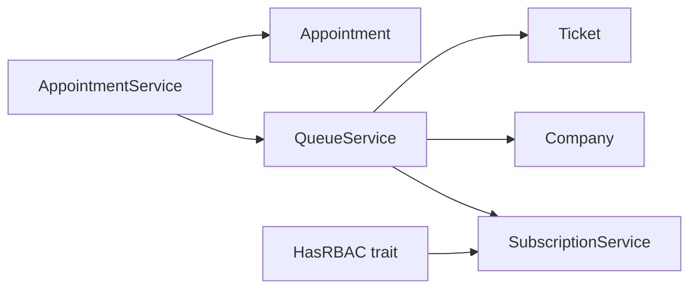

# Modular Architecture

<cite>
**Referenced Files in This Document**
- [web.php](file://routes/web.php)
- [app.php](file://bootstrap/app.php)
- [Ticket.php](file://app/Modules/Queue/Models/Ticket.php)
- [TicketCreated.php](file://app/Modules/Queue/Events/TicketCreated.php)
- [QueueService.php](file://app/Modules/Queue/Services/QueueService.php)
- [Appointment.php](file://app/Modules/Appointments/Models/Appointment.php)
- [AppointmentService.php](file://app/Modules/Appointments/Services/AppointmentService.php)
- [SubscriptionService.php](file://app/Modules/Subscriptions/Services/SubscriptionService.php)
- [Company.php](file://app/Modules/Companies/Models/Company.php)
- [MasterController.php](file://app/Modules/RBAC/Controllers/MasterController.php)
- [PaymentLifecycleService.php](file://app/Modules/Payments/Services/PaymentLifecycleService.php)
- [PaymentProviderInterface.php](file://app/Modules/Payments/Contracts/PaymentProviderInterface.php)
- [ManualPaymentProvider.php](file://app/Modules/Payments/Providers/ManualPaymentProvider.php)
- [HasRBAC.php](file://app/Modules/Core/Traits/HasRBAC.php)
- [SystemAdminMiddleware.php](file://app/Http/Middleware/SystemAdminMiddleware.php)
</cite>

## Table of Contents
1. [Introduction](#introduction)
2. [Project Structure](#project-structure)
3. [Core Components](#core-components)
4. [Architecture Overview](#architecture-overview)
5. [Detailed Component Analysis](#detailed-component-analysis)
6. [Dependency Analysis](#dependency-analysis)
7. [Performance Considerations](#performance-considerations)
8. [Troubleshooting Guide](#troubleshooting-guide)
9. [Conclusion](#conclusion)

## Introduction
This document explains Noubtigo’s modular architecture, inspired by Laravel’s conventions. Each business domain (Queue, Appointments, Payments, RBAC, Subscriptions, etc.) is organized as a self-contained module under app/Modules/<Domain>. Within each module, the typical Laravel structure applies: Controllers, Models, Services, Events, and optional Contracts/Providers. Modules communicate through well-defined service-layer abstractions and shared traits/services, enabling maintainability, testability, and scalability.

## Project Structure
Noubtigo organizes features by domain with a consistent folder hierarchy inside app/Modules/<Domain>:
- Controllers: HTTP entry points for each domain
- Models: Eloquent models with tenant scoping and UUID routing
- Services: Business logic and cross-domain orchestration
- Events: Domain-specific events for pub/sub and broadcasting
- Contracts/Providers: Pluggable integrations (e.g., payment providers)
- Traits: Shared capabilities (e.g., RBAC)

Routing is centralized in routes/web.php, with middleware stacks controlling permissions, queue modes, and subscriptions. The bootstrap pipeline wires middleware aliases and global exceptions.

**Diagram sources**
- [web.php:1-200](file://routes/web.php#L1-L200)
- [app.php:17-39](file://bootstrap/app.php#L17-L39)
- [QueueService.php:1-513](file://app/Modules/Queue/Services/QueueService.php#L1-L513)
- [Ticket.php:1-257](file://app/Modules/Queue/Models/Ticket.php#L1-L257)
- [AppointmentService.php:1-313](file://app/Modules/Appointments/Services/AppointmentService.php#L1-L313)
- [Appointment.php:1-183](file://app/Modules/Appointments/Models/Appointment.php#L1-L183)
- [SubscriptionService.php:1-134](file://app/Modules/Subscriptions/Services/SubscriptionService.php#L1-L134)
- [Company.php:1-280](file://app/Modules/Companies/Models/Company.php#L1-L280)
- [PaymentLifecycleService.php:1-154](file://app/Modules/Payments/Services/PaymentLifecycleService.php#L1-L154)
- [PaymentProviderInterface.php:1-30](file://app/Modules/Payments/Contracts/PaymentProviderInterface.php#L1-L30)

**Section sources**
- [web.php:1-200](file://routes/web.php#L1-L200)
- [app.php:17-39](file://bootstrap/app.php#L17-L39)

## Core Components
- Controllers: Define HTTP endpoints and delegate to Services. Examples include Queue and Appointments controllers.
- Models: Encapsulate persistence and relationships; many use tenant scoping and UUID routing for safety and clarity.
- Services: Orchestrate business logic and coordinate between Models and external concerns (e.g., payment providers).
- Events: Decouple actions from notifications (broadcasting and listeners).
- Contracts/Providers: Define pluggable integrations (e.g., payment providers) adhering to a common interface.
- Middleware: Gate access and enforce policies (e.g., permissions, queue mode, subscriptions).
- Traits: Share cross-cutting capabilities (e.g., RBAC checks).

Benefits:
- Maintainability: Clear separation of concerns per domain
- Testability: Services and Models are easily unit-tested
- Scalability: New domains and features can be added without touching others

**Section sources**
- [web.php:118-169](file://routes/web.php#L118-L169)
- [Ticket.php:66-105](file://app/Modules/Queue/Models/Ticket.php#L66-L105)
- [HasRBAC.php:9-104](file://app/Modules/Core/Traits/HasRBAC.php#L9-L104)

## Architecture Overview
The system follows a layered approach:
- HTTP layer: routes define entry points and apply middleware
- Service layer: orchestrates domain logic and cross-domain coordination
- Persistence layer: models encapsulate data and relationships
- Eventing layer: events publish state changes for real-time updates

**Diagram sources**
- [web.php:1-200](file://routes/web.php#L1-L200)
- [app.php:17-39](file://bootstrap/app.php#L17-L39)
- [QueueService.php:1-513](file://app/Modules/Queue/Services/QueueService.php#L1-L513)
- [TicketCreated.php:1-66](file://app/Modules/Queue/Events/TicketCreated.php#L1-L66)

## Detailed Component Analysis

### Queue Module
The Queue module manages ticket lifecycles, priority rules, and real-time updates. It coordinates with Appointments (auto-check-in) and Subscriptions (usage limits).

**Diagram sources**
- [QueueService.php:11-513](file://app/Modules/Queue/Services/QueueService.php#L11-L513)
- [Ticket.php:12-257](file://app/Modules/Queue/Models/Ticket.php#L12-L257)
- [Appointment.php:10-183](file://app/Modules/Appointments/Models/Appointment.php#L10-L183)
- [SubscriptionService.php:11-134](file://app/Modules/Subscriptions/Services/SubscriptionService.php#L11-L134)
- [Company.php:127-179](file://app/Modules/Companies/Models/Company.php#L127-L179)

Key inter-module interactions:
- QueueService calls SubscriptionService to enforce limits before creating tickets.
- QueueService triggers AppointmentService.checkIn when appointments arrive, auto-creating tickets.
- QueueService broadcasts TicketCreated events for real-time updates.

**Section sources**
- [QueueService.php:23-56](file://app/Modules/Queue/Services/QueueService.php#L23-L56)
- [QueueService.php:254-257](file://app/Modules/Queue/Services/QueueService.php#L254-L257)
- [QueueService.php:51-54](file://app/Modules/Queue/Services/QueueService.php#L51-L54)
- [TicketCreated.php:12-66](file://app/Modules/Queue/Events/TicketCreated.php#L12-L66)

### Appointments Module
The Appointments module handles booking, rescheduling, check-in, and calendar exports. It integrates with Queue via auto-creation of tickets upon check-in.

**Diagram sources**
- [AppointmentService.php:140-161](file://app/Modules/Appointments/Services/AppointmentService.php#L140-L161)
- [QueueService.php:23-56](file://app/Modules/Queue/Services/QueueService.php#L23-L56)

**Section sources**
- [AppointmentService.php:26-66](file://app/Modules/Appointments/Services/AppointmentService.php#L26-L66)
- [AppointmentService.php:140-161](file://app/Modules/Appointments/Services/AppointmentService.php#L140-L161)

### Payments Module
The Payments module defines a provider interface and lifecycle service for subscription/payment flows. Providers implement a common contract.

**Diagram sources**
- [PaymentLifecycleService.php:15-154](file://app/Modules/Payments/Services/PaymentLifecycleService.php#L15-L154)
- [PaymentProviderInterface.php:7-30](file://app/Modules/Payments/Contracts/PaymentProviderInterface.php#L7-L30)
- [ManualPaymentProvider.php:8-38](file://app/Modules/Payments/Providers/ManualPaymentProvider.php#L8-L38)

**Section sources**
- [PaymentLifecycleService.php:27-84](file://app/Modules/Payments/Services/PaymentLifecycleService.php#L27-L84)
- [PaymentProviderInterface.php:7-30](file://app/Modules/Payments/Contracts/PaymentProviderInterface.php#L7-L30)
- [ManualPaymentProvider.php:10-36](file://app/Modules/Payments/Providers/ManualPaymentProvider.php#L10-L36)

### RBAC and Permissions
RBAC is implemented via controllers, traits, and middleware. Users gain permissions through roles, direct assignments, and plan features.

**Diagram sources**
- [HasRBAC.php:36-73](file://app/Modules/Core/Traits/HasRBAC.php#L36-L73)
- [SystemAdminMiddleware.php:16-23](file://app/Http/Middleware/SystemAdminMiddleware.php#L16-L23)

**Section sources**
- [HasRBAC.php:9-104](file://app/Modules/Core/Traits/HasRBAC.php#L9-L104)
- [SystemAdminMiddleware.php:9-25](file://app/Http/Middleware/SystemAdminMiddleware.php#L9-L25)
- [MasterController.php:17-90](file://app/Modules/RBAC/Controllers/MasterController.php#L17-L90)

## Dependency Analysis
Modules depend on shared services and traits:
- QueueService depends on SubscriptionService for limits and Company for queue mode
- AppointmentService depends on QueueService for auto-creating tickets
- Models rely on traits/services for tenant scoping and UUID routing
- Controllers depend on Services for business logic and on middleware for authorization

**Diagram sources**
- [QueueService.php:29-32](file://app/Modules/Queue/Services/QueueService.php#L29-L32)
- [SubscriptionService.php:36-55](file://app/Modules/Subscriptions/Services/SubscriptionService.php#L36-L55)
- [Company.php:141-159](file://app/Modules/Companies/Models/Company.php#L141-L159)
- [AppointmentService.php:151-158](file://app/Modules/Appointments/Services/AppointmentService.php#L151-L158)
- [HasRBAC.php:68-70](file://app/Modules/Core/Traits/HasRBAC.php#L68-L70)

**Section sources**
- [QueueService.php:13-18](file://app/Modules/Queue/Services/QueueService.php#L13-L18)
- [SubscriptionService.php:11-134](file://app/Modules/Subscriptions/Services/SubscriptionService.php#L11-L134)
- [Company.php:127-179](file://app/Modules/Companies/Models/Company.php#L127-L179)
- [AppointmentService.php:140-161](file://app/Modules/Appointments/Services/AppointmentService.php#L140-L161)
- [HasRBAC.php:67-70](file://app/Modules/Core/Traits/HasRBAC.php#L67-L70)

## Performance Considerations
- Prefer service-layer orchestration to minimize controller logic and enable caching where appropriate (e.g., plan permissions caching in SubscriptionService).
- Use model scopes and eager loading to reduce N+1 queries (as seen in Queue and Appointments models).
- Leverage broadcasting selectively; ensure channels are scoped to tenant/company to avoid unnecessary fanout.
- Keep middleware chains lean; gate early with permission and queue-mode middlewares.

## Troubleshooting Guide
Common issues and resolutions:
- Permission Denied: Verify middleware aliases and RBAC trait checks. Confirm roles, direct permissions, and plan features align with expectations.
- Queue Mode Mismatch: Ensure Company settings and plan features permit advanced queue; otherwise, the system falls back to simple mode.
- Session Expiration: The bootstrap exception handler returns structured JSON for AJAX requests; clients should redirect to login on 401/419.
- Event Broadcasting: Confirm event channels and broadcasting configuration; events like TicketCreated must target the correct tenant channel.

**Section sources**
- [app.php:40-61](file://bootstrap/app.php#L40-L61)
- [TicketCreated.php:31-44](file://app/Modules/Queue/Events/TicketCreated.php#L31-L44)
- [Company.php:141-159](file://app/Modules/Companies/Models/Company.php#L141-L159)

## Conclusion
Noubtigo’s modular architecture cleanly separates business domains while enabling controlled inter-module collaboration through services and shared traits. The approach improves maintainability, testability, and scalability, allowing teams to evolve individual modules independently. By adhering to consistent patterns—controllers delegating to services, models encapsulating persistence, and events decoupling updates—the system remains robust and extensible.