# Multi-Tenant Infrastructure

<cite>
**Referenced Files in This Document**
- [TenantManager.php](file://app/Services/TenantManager.php)
- [TenantMiddleware.php](file://app/Http/Middleware/TenantMiddleware.php)
- [TenantScope.php](file://app/Modules/Core/Scopes/TenantScope.php)
- [BelongsToTenant.php](file://app/Modules/Core/Traits/BelongsToTenant.php)
- [Company.php](file://app/Modules/Companies/Models/Company.php)
- [User.php](file://app/Models/User.php)
- [Role.php](file://app/Models/Role.php)
- [Permission.php](file://app/Models/Permission.php)
- [SubscriptionService.php](file://app/Modules/Subscriptions/Services/SubscriptionService.php)
- [CheckSubscriptionValid.php](file://app/Http/Middleware/CheckSubscriptionValid.php)
- [HasRBAC.php](file://app/Modules/Core/Traits/HasRBAC.php)
- [0000_01_01_000000_create_companies_table.php](file://database/migrations/0000_01_01_000000_create_companies_table.php)
- [2026_04_10_173000_transform_roles_to_multi_tenant.php](file://database/migrations/2026_04_10_173000_transform_roles_to_multi_tenant.php)
- [2026_05_21_120001_add_uuid_to_users_table.php](file://database/migrations/2026_05_21_120001_add_uuid_to_users_table.php)
- [2026_05_22_081649_create_subscriptions_table.php](file://database/migrations/2026_05_22_081649_create_subscriptions_table.php)
- [2026_05_22_081718_create_payments_table.php](file://database/migrations/2026_05_22_081718_create_payments_table.php)
- [2026_05_22_081729_create_payment_transactions_table.php](file://database/migrations/2026_05_22_081729_create_payment_transactions_table.php)
- [2026_05_22_081731_create_invoices_table.php](file://database/migrations/2026_05_22_081731_create_invoices_table.php)
- [2026_05_22_081733_create_invoice_items_table.php](file://database/migrations/2026_05_22_081733_create_invoice_items_table.php)
- [2026_05_21_120001_add_uuid_to_customers_table.php](file://database/migrations/2026_05_21_120001_add_uuid_to_customers_table.php)
- [2026_05_21_120004_add_uuid_to_appointments_table.php](file://database/migrations/2026_05_21_120004_add_uuid_to_appointments_table.php)
- [2026_05_21_120005_add_uuid_to_services_table.php](file://database/migrations/2026_05_21_120005_add_uuid_to_services_table.php)
- [2026_05_21_120006_add_uuid_to_rooms_table.php](file://database/migrations/2026_05_21_120006_add_uuid_to_rooms_table.php)
- [2026_05_21_120007_add_uuid_to_tickets_table.php](file://database/migrations/2026_05_21_120007_add_uuid_to_tickets_table.php)
</cite>

## Table of Contents
1. [Introduction](#introduction)
2. [Project Structure](#project-structure)
3. [Core Components](#core-components)
4. [Architecture Overview](#architecture-overview)
5. [Detailed Component Analysis](#detailed-component-analysis)
6. [Dependency Analysis](#dependency-analysis)
7. [Performance Considerations](#performance-considerations)
8. [Troubleshooting Guide](#troubleshooting-guide)
9. [Conclusion](#conclusion)

## Introduction
This document explains Noubtigo's multi-tenant architecture, focusing on tenant isolation via TenantScope global scope and BelongsToTenant trait pattern, tenant-aware models ensuring data separation across multiple companies, the TenantManager service for tenant switching and context management, and the TenantMiddleware implementation for automatic tenant scoping in requests. It also covers tenant database design patterns, UUID-based tenant identification, multi-tenancy best practices, tenant-specific resource management, subscription handling per tenant, and tenant-aware permission systems.

## Project Structure
Noubtigo organizes multi-tenancy support under dedicated modules and services:
- Core multi-tenancy building blocks reside in app/Modules/Core (TenantScope, BelongsToTenant, RBAC traits)
- Tenant management is centralized in app/Services (TenantManager)
- Request-time tenant scoping is handled by app/Http/Middleware (TenantMiddleware)
- Tenant-aware models include Company, User, Role, Permission, and module models
- Database migrations define tenant-aware tables and UUID-based identifiers

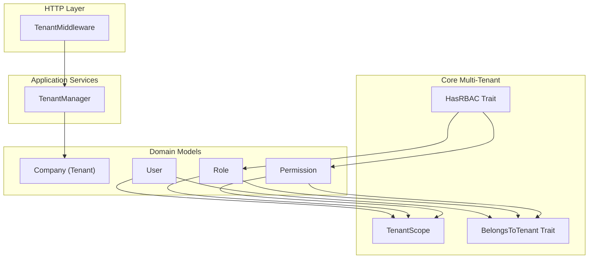

**Diagram sources**
- [TenantMiddleware.php](file://app/Http/Middleware/TenantMiddleware.php)
- [TenantManager.php](file://app/Services/TenantManager.php)
- [TenantScope.php](file://app/Modules/Core/Scopes/TenantScope.php)
- [BelongsToTenant.php](file://app/Modules/Core/Traits/BelongsToTenant.php)
- [HasRBAC.php](file://app/Modules/Core/Traits/HasRBAC.php)
- [Company.php](file://app/Modules/Companies/Models/Company.php)
- [User.php](file://app/Models/User.php)
- [Role.php](file://app/Models/Role.php)
- [Permission.php](file://app/Models/Permission.php)

**Section sources**
- [TenantMiddleware.php](file://app/Http/Middleware/TenantMiddleware.php)
- [TenantManager.php](file://app/Services/TenantManager.php)
- [TenantScope.php](file://app/Modules/Core/Scopes/TenantScope.php)
- [BelongsToTenant.php](file://app/Modules/Core/Traits/BelongsToTenant.php)
- [HasRBAC.php](file://app/Modules/Core/Traits/HasRBAC.php)
- [Company.php](file://app/Modules/Companies/Models/Company.php)
- [User.php](file://app/Models/User.php)
- [Role.php](file://app/Models/Role.php)
- [Permission.php](file://app/Models/Permission.php)

## Core Components
- TenantScope: Global Eloquent scope that automatically applies tenant filtering to queries for tenant-aware models.
- BelongsToTenant: Model trait that ensures models carry and enforce tenant ownership.
- TenantManager: Centralized service for setting/getting current tenant context and switching tenants during runtime.
- TenantMiddleware: HTTP middleware that detects the tenant from the incoming request and activates the appropriate TenantScope globally.

These components work together to ensure that:
- All model queries are scoped to the current tenant by default
- Data remains isolated across companies
- Tenant context is consistently managed across requests and services

**Section sources**
- [TenantScope.php](file://app/Modules/Core/Scopes/TenantScope.php)
- [BelongsToTenant.php](file://app/Modules/Core/Traits/BelongsToTenant.php)
- [TenantManager.php](file://app/Services/TenantManager.php)
- [TenantMiddleware.php](file://app/Http/Middleware/TenantMiddleware.php)

## Architecture Overview
The multi-tenancy architecture follows a request-driven activation pattern:
- TenantMiddleware extracts tenant identity from the request (e.g., subdomain, header, or route parameter)
- TenantManager stores the current tenant context
- TenantScope becomes globally active, applying tenant filters to all applicable queries
- Models decorated with BelongsToTenant ensure tenant ownership and prevent cross-tenant access

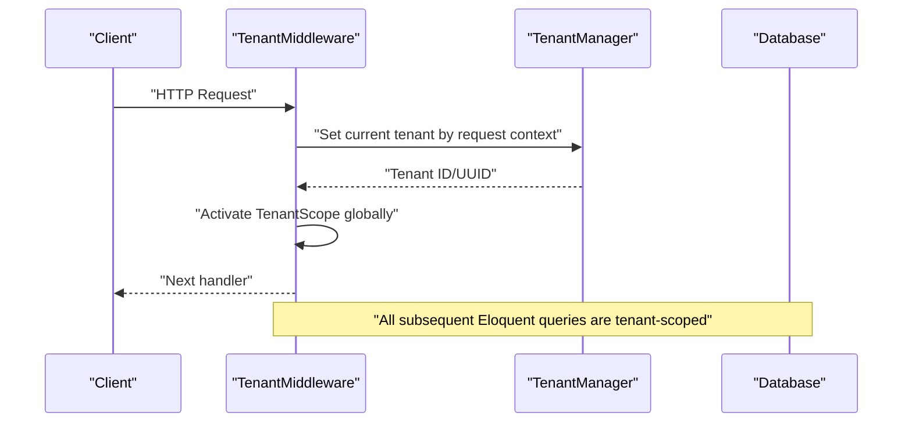

**Diagram sources**
- [TenantMiddleware.php](file://app/Http/Middleware/TenantMiddleware.php)
- [TenantManager.php](file://app/Services/TenantManager.php)
- [TenantScope.php](file://app/Modules/Core/Scopes/TenantScope.php)

## Detailed Component Analysis

### TenantScope: Global Scope for Tenant Isolation
TenantScope is a global Eloquent scope applied to tenant-aware models. It ensures that:
- Queries automatically filter by the currently active tenant
- Cross-tenant data leakage is prevented
- Explicit bypassing requires deliberate override

Implementation highlights:
- Applied globally so all tenant-aware models inherit tenant filtering
- Integrates with TenantManager to fetch the current tenant identifier
- Designed to be lightweight and efficient, leveraging database indexes on tenant foreign keys

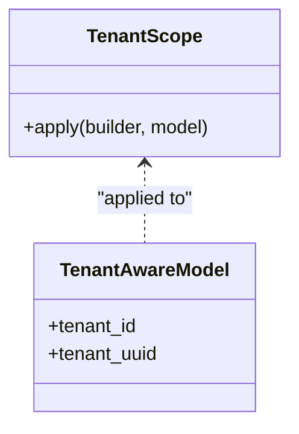

**Diagram sources**
- [TenantScope.php](file://app/Modules/Core/Scopes/TenantScope.php)

**Section sources**
- [TenantScope.php](file://app/Modules/Core/Scopes/TenantScope.php)

### BelongsToTenant: Tenant Ownership Pattern
BelongsToTenant is a model trait that:
- Adds tenant identification fields to models
- Enforces tenant ownership at the model level
- Prevents creation, updates, or deletions that would violate tenant boundaries
- Supports tenant-aware soft deletes and cascading rules

Usage pattern:
- Apply the trait to all domain models that must be tenant-scoped
- Ensure database columns exist for tenant association (e.g., tenant_id or tenant_uuid)

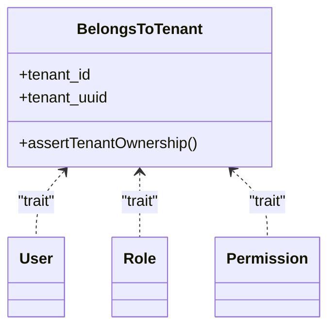

**Diagram sources**
- [BelongsToTenant.php](file://app/Modules/Core/Traits/BelongsToTenant.php)
- [User.php](file://app/Models/User.php)
- [Role.php](file://app/Models/Role.php)
- [Permission.php](file://app/Models/Permission.php)

**Section sources**
- [BelongsToTenant.php](file://app/Modules/Core/Traits/BelongsToTenant.php)
- [User.php](file://app/Models/User.php)
- [Role.php](file://app/Models/Role.php)
- [Permission.php](file://app/Models/Permission.php)

### TenantManager: Tenant Switching and Context Management
TenantManager centralizes tenant context management:
- Set current tenant by ID or UUID
- Retrieve current tenant context
- Provide tenant-aware services and repositories
- Coordinate with TenantMiddleware for request-scoped activation

Operational characteristics:
- Thread-safe context storage
- Validation of tenant existence and active status
- Optional tenant switching for administrative actions

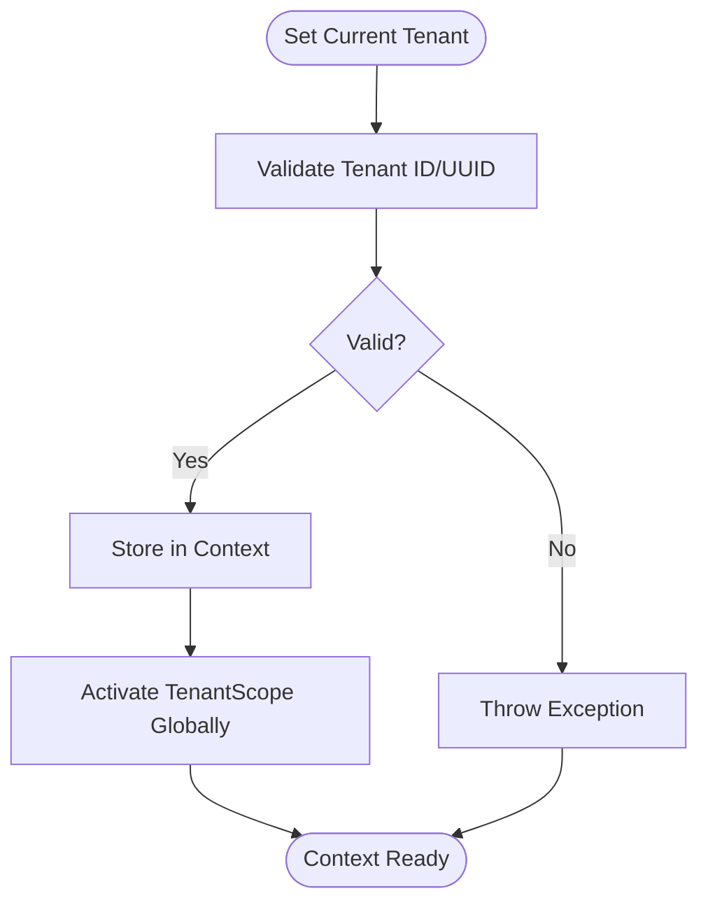

**Diagram sources**
- [TenantManager.php](file://app/Services/TenantManager.php)

**Section sources**
- [TenantManager.php](file://app/Services/TenantManager.php)

### TenantMiddleware: Automatic Tenant Scoping in Requests
TenantMiddleware integrates tenant detection with request lifecycle:
- Extract tenant identity from request context (subdomain, header, route parameter)
- Invoke TenantManager to set current tenant
- Activate TenantScope globally for the remainder of the request
- Allow tenant-aware controllers and services to operate without explicit tenant checks

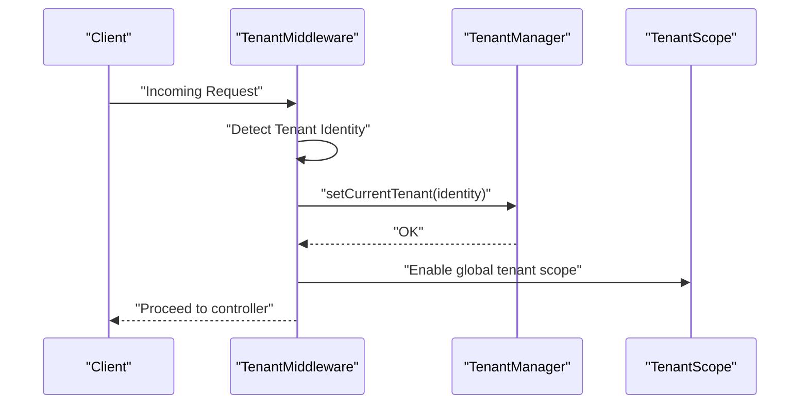

**Diagram sources**
- [TenantMiddleware.php](file://app/Http/Middleware/TenantMiddleware.php)
- [TenantManager.php](file://app/Services/TenantManager.php)
- [TenantScope.php](file://app/Modules/Core/Scopes/TenantScope.php)

**Section sources**
- [TenantMiddleware.php](file://app/Http/Middleware/TenantMiddleware.php)

### Tenant-Aware Models and Data Separation
Tenant-aware models ensure data separation across companies:
- Company model represents the tenant entity
- User, Role, Permission, and module models (e.g., Customer, Appointment, Ticket) use BelongsToTenant and are scoped by TenantScope
- UUID-based identifiers enable secure sharing and external references without exposing internal IDs

Key model relationships:
- Company (tenant) hosts Users, Roles, Permissions, and module entities
- Module models reference Company via tenant ownership fields

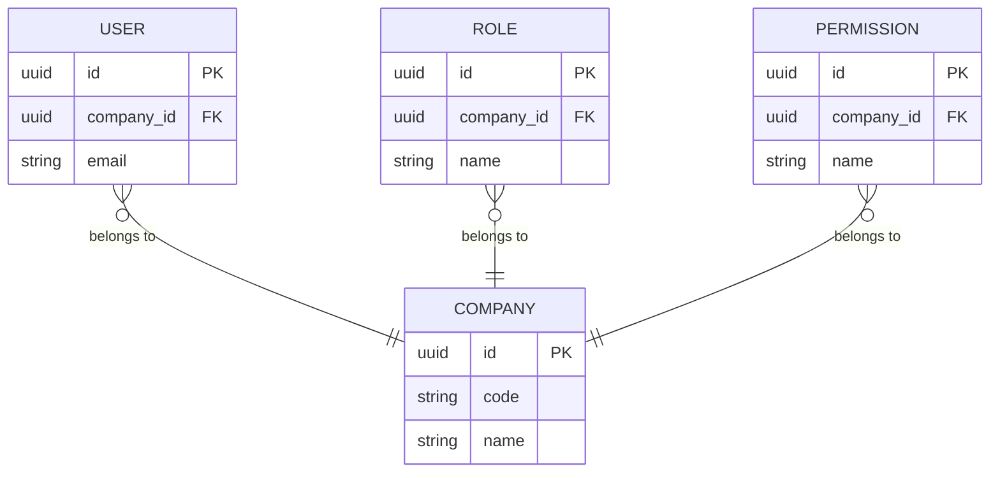

**Diagram sources**
- [Company.php](file://app/Modules/Companies/Models/Company.php)
- [User.php](file://app/Models/User.php)
- [Role.php](file://app/Models/Role.php)
- [Permission.php](file://app/Models/Permission.php)

**Section sources**
- [Company.php](file://app/Modules/Companies/Models/Company.php)
- [User.php](file://app/Models/User.php)
- [Role.php](file://app/Models/Role.php)
- [Permission.php](file://app/Models/Permission.php)

### Tenant Database Design Patterns
Database design supports robust multi-tenancy:
- UUID primary keys for tenant and tenant-aware entities
- Tenant foreign keys on all tenant-aware tables
- Migrations transform existing single-tenant tables to multi-tenant by adding tenant_id or tenant_uuid
- Indexes on tenant foreign keys for efficient tenant-scoped queries

Representative migration patterns:
- Adding UUID columns to core entities
- Transforming roles and permissions to be tenant-aware
- Creating subscription, payment, and invoice tables linked to tenants

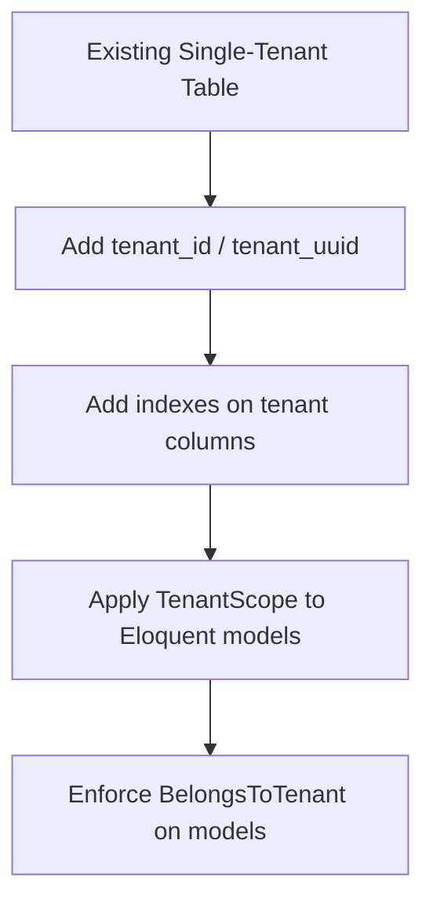

**Diagram sources**
- [0000_01_01_000000_create_companies_table.php](file://database/migrations/0000_01_01_000000_create_companies_table.php)
- [2026_04_10_173000_transform_roles_to_multi_tenant.php](file://database/migrations/2026_04_10_173000_transform_roles_to_multi_tenant.php)
- [2026_05_21_120001_add_uuid_to_users_table.php](file://database/migrations/2026_05_21_120001_add_uuid_to_users_table.php)
- [2026_05_22_081649_create_subscriptions_table.php](file://database/migrations/2026_05_22_081649_create_subscriptions_table.php)
- [2026_05_22_081718_create_payments_table.php](file://database/migrations/2026_05_22_081718_create_payments_table.php)
- [2026_05_22_081729_create_payment_transactions_table.php](file://database/migrations/2026_05_22_081729_create_payment_transactions_table.php)
- [2026_05_22_081731_create_invoices_table.php](file://database/migrations/2026_05_22_081731_create_invoices_table.php)
- [2026_05_22_081733_create_invoice_items_table.php](file://database/migrations/2026_05_22_081733_create_invoice_items_table.php)

**Section sources**
- [0000_01_01_000000_create_companies_table.php](file://database/migrations/0000_01_01_000000_create_companies_table.php)
- [2026_04_10_173000_transform_roles_to_multi_tenant.php](file://database/migrations/2026_04_10_173000_transform_roles_to_multi_tenant.php)
- [2026_05_21_120001_add_uuid_to_users_table.php](file://database/migrations/2026_05_21_120001_add_uuid_to_users_table.php)
- [2026_05_22_081649_create_subscriptions_table.php](file://database/migrations/2026_05_22_081649_create_subscriptions_table.php)
- [2026_05_22_081718_create_payments_table.php](file://database/migrations/2026_05_22_081718_create_payments_table.php)
- [2026_05_22_081729_create_payment_transactions_table.php](file://database/migrations/2026_05_22_081729_create_payment_transactions_table.php)
- [2026_05_22_081731_create_invoices_table.php](file://database/migrations/2026_05_22_081731_create_invoices_table.php)
- [2026_05_22_081733_create_invoice_items_table.php](file://database/migrations/2026_05_22_081733_create_invoice_items_table.php)

### UUID-Based Tenant Identification
UUIDs are used across tenant and tenant-aware entities:
- UUID primary keys eliminate ID enumeration risks
- Support external references and secure sharing
- Enable seamless joins and tenant scoping without exposing internal IDs

Relevant migrations:
- Add UUID to Company, User, Customer, Appointment, Service, Room, Ticket
- Maintain referential integrity with tenant foreign keys

**Section sources**
- [2026_05_21_120001_add_uuid_to_users_table.php](file://database/migrations/2026_05_21_120001_add_uuid_to_users_table.php)
- [2026_05_21_120001_add_uuid_to_customers_table.php](file://database/migrations/2026_05_21_120001_add_uuid_to_customers_table.php)
- [2026_05_21_120004_add_uuid_to_appointments_table.php](file://database/migrations/2026_05_21_120004_add_uuid_to_appointments_table.php)
- [2026_05_21_120005_add_uuid_to_services_table.php](file://database/migrations/2026_05_21_120005_add_uuid_to_services_table.php)
- [2026_05_21_120006_add_uuid_to_rooms_table.php](file://database/migrations/2026_05_21_120006_add_uuid_to_rooms_table.php)
- [2026_05_21_120007_add_uuid_to_tickets_table.php](file://database/migrations/2026_05_21_120007_add_uuid_to_tickets_table.php)

### Tenant-Specific Resource Management
Tenant-specific resources are managed through:
- Tenant-aware models with BelongsToTenant trait
- TenantScope enforcing automatic tenant filtering
- UUID-based identifiers for secure resource access
- Module-specific controllers operating within tenant context

Best practices:
- Always query through tenant-aware models
- Avoid raw SQL that bypasses TenantScope
- Use UUIDs in URLs and APIs for tenant resources
- Implement proper authorization checks alongside tenant scoping

**Section sources**
- [BelongsToTenant.php](file://app/Modules/Core/Traits/BelongsToTenant.php)
- [TenantScope.php](file://app/Modules/Core/Scopes/TenantScope.php)
- [User.php](file://app/Models/User.php)

### Subscription Handling Per Tenant
Subscriptions are tenant-aware and managed via:
- SubscriptionService coordinating tenant-specific plans and billing cycles
- Subscription, Payment, Invoice, and PaymentTransaction tables linked to tenants
- CheckSubscriptionValid middleware ensuring active subscriptions per tenant

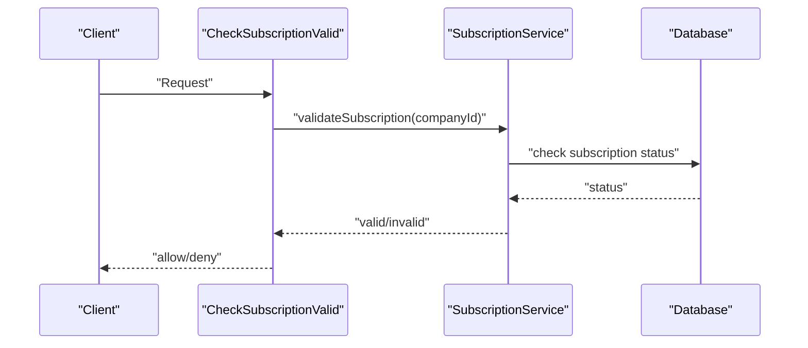

**Diagram sources**
- [CheckSubscriptionValid.php](file://app/Http/Middleware/CheckSubscriptionValid.php)
- [SubscriptionService.php](file://app/Modules/Subscriptions/Services/SubscriptionService.php)
- [2026_05_22_081649_create_subscriptions_table.php](file://database/migrations/2026_05_22_081649_create_subscriptions_table.php)
- [2026_05_22_081718_create_payments_table.php](file://database/migrations/2026_05_22_081718_create_payments_table.php)
- [2026_05_22_081729_create_payment_transactions_table.php](file://database/migrations/2026_05_22_081729_create_payment_transactions_table.php)
- [2026_05_22_081731_create_invoices_table.php](file://database/migrations/2026_05_22_081731_create_invoices_table.php)
- [2026_05_22_081733_create_invoice_items_table.php](file://database/migrations/2026_05_22_081733_create_invoice_items_table.php)

**Section sources**
- [CheckSubscriptionValid.php](file://app/Http/Middleware/CheckSubscriptionValid.php)
- [SubscriptionService.php](file://app/Modules/Subscriptions/Services/SubscriptionService.php)
- [2026_05_22_081649_create_subscriptions_table.php](file://database/migrations/2026_05_22_081649_create_subscriptions_table.php)
- [2026_05_22_081718_create_payments_table.php](file://database/migrations/2026_05_22_081718_create_payments_table.php)
- [2026_05_22_081729_create_payment_transactions_table.php](file://database/migrations/2026_05_22_081729_create_payment_transactions_table.php)
- [2026_05_22_081731_create_invoices_table.php](file://database/migrations/2026_05_22_081731_create_invoices_table.php)
- [2026_05_22_081733_create_invoice_items_table.php](file://database/migrations/2026_05_22_081733_create_invoice_items_table.php)

### Tenant-Aware Permission Systems
Permissions and roles are tenant-aware:
- Roles and Permissions transformed to include tenant associations
- HasRBAC trait supporting role-based access control per tenant
- CheckPermission middleware verifying user permissions within the tenant context

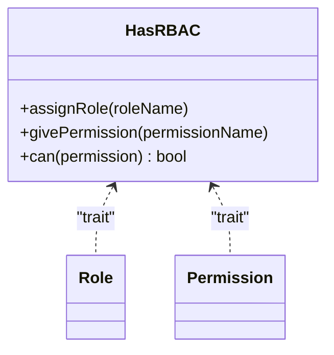

**Diagram sources**
- [HasRBAC.php](file://app/Modules/Core/Traits/HasRBAC.php)
- [Role.php](file://app/Models/Role.php)
- [Permission.php](file://app/Models/Permission.php)

**Section sources**
- [HasRBAC.php](file://app/Modules/Core/Traits/HasRBAC.php)
- [Role.php](file://app/Models/Role.php)
- [Permission.php](file://app/Models/Permission.php)
- [2026_04_10_173000_transform_roles_to_multi_tenant.php](file://database/migrations/2026_04_10_173000_transform_roles_to_multi_tenant.php)

## Dependency Analysis
The multi-tenancy stack exhibits low coupling and high cohesion:
- TenantMiddleware depends on TenantManager for context
- TenantManager coordinates with TenantScope activation
- TenantScope and BelongsToTenant are orthogonal concerns applied to models
- RBAC traits integrate with roles and permissions while respecting tenant boundaries

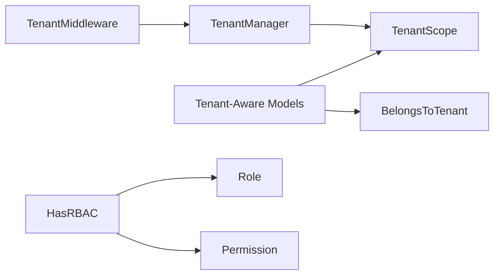

**Diagram sources**
- [TenantMiddleware.php](file://app/Http/Middleware/TenantMiddleware.php)
- [TenantManager.php](file://app/Services/TenantManager.php)
- [TenantScope.php](file://app/Modules/Core/Scopes/TenantScope.php)
- [BelongsToTenant.php](file://app/Modules/Core/Traits/BelongsToTenant.php)
- [HasRBAC.php](file://app/Modules/Core/Traits/HasRBAC.php)
- [Role.php](file://app/Models/Role.php)
- [Permission.php](file://app/Models/Permission.php)

**Section sources**
- [TenantMiddleware.php](file://app/Http/Middleware/TenantMiddleware.php)
- [TenantManager.php](file://app/Services/TenantManager.php)
- [TenantScope.php](file://app/Modules/Core/Scopes/TenantScope.php)
- [BelongsToTenant.php](file://app/Modules/Core/Traits/BelongsToTenant.php)
- [HasRBAC.php](file://app/Modules/Core/Traits/HasRBAC.php)
- [Role.php](file://app/Models/Role.php)
- [Permission.php](file://app/Models/Permission.php)

## Performance Considerations
- Index tenant foreign keys to accelerate tenant-scoped queries
- Use UUIDs judiciously; ensure proper indexing strategies
- Minimize unnecessary tenant switches; batch operations within a single tenant context
- Leverage TenantScope globally to avoid repeated tenant checks in controllers/services
- Monitor slow queries and add composite indexes where appropriate

## Troubleshooting Guide
Common issues and resolutions:
- Queries return empty results unexpectedly: Verify TenantMiddleware is executed and TenantManager sets the current tenant
- Cross-tenant data exposure: Ensure all tenant-aware models use BelongsToTenant and TenantScope
- Subscription validation failures: Confirm CheckSubscriptionValid middleware runs before protected endpoints
- Permission denials: Validate HasRBAC assignments and tenant-specific role/permission mappings

**Section sources**
- [TenantMiddleware.php](file://app/Http/Middleware/TenantMiddleware.php)
- [TenantManager.php](file://app/Services/TenantManager.php)
- [BelongsToTenant.php](file://app/Modules/Core/Traits/BelongsToTenant.php)
- [TenantScope.php](file://app/Modules/Core/Scopes/TenantScope.php)
- [CheckSubscriptionValid.php](file://app/Http/Middleware/CheckSubscriptionValid.php)
- [HasRBAC.php](file://app/Modules/Core/Traits/HasRBAC.php)

## Conclusion
Noubtigo's multi-tenant architecture leverages a clean separation of concerns:
- TenantMiddleware and TenantManager manage tenant context per request
- TenantScope and BelongsToTenant ensure automatic and explicit tenant isolation
- UUID-based identifiers and tenant-aware migrations provide robust data separation
- RBAC and subscription middleware enforce tenant-specific permissions and validity
This design enables scalable, secure multi-tenancy with minimal developer overhead and strong guarantees against data leakage.