# Service Layer Pattern

<cite>
**Referenced Files in This Document**
- [AppointmentService.php](file://app\Modules\Appointments\Services\AppointmentService.php)
- [PaymentLifecycleService.php](file://app\Modules\Payments\Services\PaymentLifecycleService.php)
- [QueueService.php](file://app\Modules\Queue\Services\QueueService.php)
- [RegisterService.php](file://app\Modules\Auth\Services\RegisterService.php)
- [WhatsAppService.php](file://app\Modules\WhatsApp\Services\WhatsAppService.php)
- [AnalyticsService.php](file://app\Modules\Reports\Services\AnalyticsService.php)
- [SubscriptionService.php](file://app\Modules\Subscriptions\Services\SubscriptionService.php)
- [PaymentManager.php](file://app\Modules\Payments\Managers\PaymentManager.php)
- [TenantManager.php](file://app\Services\TenantManager.php)
</cite>

## Table of Contents
1. [Introduction](#introduction)
2. [Project Structure](#project-structure)
3. [Core Components](#core-components)
4. [Architecture Overview](#architecture-overview)
5. [Detailed Component Analysis](#detailed-component-analysis)
6. [Dependency Analysis](#dependency-analysis)
7. [Performance Considerations](#performance-considerations)
8. [Troubleshooting Guide](#troubleshooting-guide)
9. [Conclusion](#conclusion)

## Introduction
This document explains Noubtigo’s service layer architecture pattern. Services encapsulate business logic, coordinate between models, controllers, and external integrations, and enforce clear separation of concerns. They centralize complex operations such as payment lifecycle orchestration, appointment booking and rescheduling, and queue management with priority rules. The pattern emphasizes dependency injection, transactional integrity, and composability across modules.

## Project Structure
Services live under dedicated module namespaces and often depend on shared services and managers. Typical relationships:
- Controllers call services to process requests.
- Services use models for persistence and other services for cross-cutting concerns.
- Managers resolve providers for external systems.
- Shared services (e.g., tenant scoping, timezones) are injected via the container.

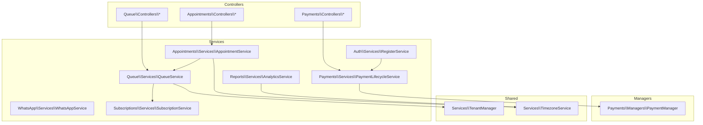

**Diagram sources**
- [AppointmentService.php:12-313](file://app\Modules\Appointments\Services\AppointmentService.php#L12-L313)
- [QueueService.php:11-513](file://app\Modules\Queue\Services\QueueService.php#L11-L513)
- [PaymentLifecycleService.php:15-154](file://app\Modules\Payments\Services\PaymentLifecycleService.php#L15-L154)
- [RegisterService.php:11-69](file://app\Modules\Auth\Services\RegisterService.php#L11-L69)
- [WhatsAppService.php:11-111](file://app\Modules\WhatsApp\Services\WhatsAppService.php#L11-L111)
- [AnalyticsService.php:13-563](file://app\Modules\Reports\Services\AnalyticsService.php#L13-L563)
- [SubscriptionService.php:11-134](file://app\Modules\Subscriptions\Services\SubscriptionService.php#L11-L134)
- [PaymentManager.php:9-35](file://app\Modules\Payments\Managers\PaymentManager.php#L9-L35)
- [TenantManager.php:7-46](file://app\Services\TenantManager.php#L7-L46)

**Section sources**
- [AppointmentService.php:12-313](file://app\Modules\Appointments\Services\AppointmentService.php#L12-L313)
- [QueueService.php:11-513](file://app\Modules\Queue\Services\QueueService.php#L11-L513)
- [PaymentLifecycleService.php:15-154](file://app\Modules\Payments\Services\PaymentLifecycleService.php#L15-L154)
- [RegisterService.php:11-69](file://app\Modules\Auth\Services\RegisterService.php#L11-L69)
- [WhatsAppService.php:11-111](file://app\Modules\WhatsApp\Services\WhatsAppService.php#L11-L111)
- [AnalyticsService.php:13-563](file://app\Modules\Reports\Services\AnalyticsService.php#L13-L563)
- [SubscriptionService.php:11-134](file://app\Modules\Subscriptions\Services\SubscriptionService.php#L11-L134)
- [PaymentManager.php:9-35](file://app\Modules\Payments\Managers\PaymentManager.php#L9-L35)
- [TenantManager.php:7-46](file://app\Services\TenantManager.php#L7-L46)

## Core Components
- AppointmentService: Handles booking, rescheduling, check-in, cancellation, completion, and calendar exports with timezone-aware conversions and slot availability generation.
- QueueService: Creates and manages tickets, calculates priority, supports simple and advanced modes, and synchronizes statuses with linked appointments.
- PaymentLifecycleService: Orchestrates subscription creation, payment initialization, invoice generation, and activation with transactions.
- RegisterService: Registers a company and owner, assigns roles, generates tokens, and optionally initiates a subscription request.
- WhatsAppService: Sends outbound messages with 24-hour protection windows and persists logs.
- AnalyticsService: Computes KPIs, heatmaps, trends, and insights using timezone-aware queries.
- SubscriptionService: Enforces plan limits for tickets, staff, rooms, and customers; checks permissions.
- PaymentManager: Resolves payment providers for manual/bank methods.
- TenantManager: Provides tenant scoping for multi-tenant contexts.

**Section sources**
- [AppointmentService.php:12-313](file://app\Modules\Appointments\Services\AppointmentService.php#L12-L313)
- [QueueService.php:11-513](file://app\Modules\Queue\Services\QueueService.php#L11-L513)
- [PaymentLifecycleService.php:15-154](file://app\Modules\Payments\Services\PaymentLifecycleService.php#L15-L154)
- [RegisterService.php:11-69](file://app\Modules\Auth\Services\RegisterService.php#L11-L69)
- [WhatsAppService.php:11-111](file://app\Modules\WhatsApp\Services\WhatsAppService.php#L11-L111)
- [AnalyticsService.php:13-563](file://app\Modules\Reports\Services\AnalyticsService.php#L13-L563)
- [SubscriptionService.php:11-134](file://app\Modules\Subscriptions\Services\SubscriptionService.php#L11-L134)
- [PaymentManager.php:9-35](file://app\Modules\Payments\Managers\PaymentManager.php#L9-L35)
- [TenantManager.php:7-46](file://app\Services\TenantManager.php#L7-L46)

## Architecture Overview
The service layer follows a layered pattern:
- Controllers receive requests and delegate to services.
- Services encapsulate domain logic, validate inputs, and manage transactions.
- Services compose other services and managers to integrate with models and external systems.
- Shared services (TenantManager, TimezoneService) provide cross-cutting capabilities.

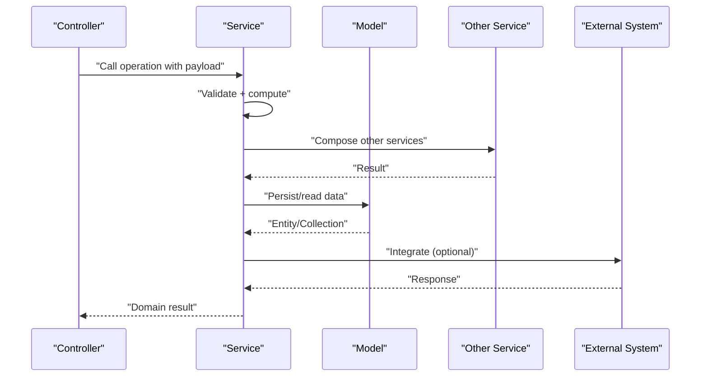

[No sources needed since this diagram shows conceptual workflow, not actual code structure]

## Detailed Component Analysis

### AppointmentService
Responsibilities:
- Booking with capacity checks, overbooking detection, and grace periods.
- Rescheduling with critical change detection and status resets.
- Check-in with grace period calculation and automatic ticket creation.
- Status transitions: cancel, complete, no-show.
- Availability generation across slots and calendar export with timezone conversion.

Key patterns:
- Constructor injection of TimezoneService via the container.
- Composition with QueueService for auto-ticket creation on check-in.
- Validation exceptions for slot conflicts.
- UTC/local conversions for consistent calendar rendering.

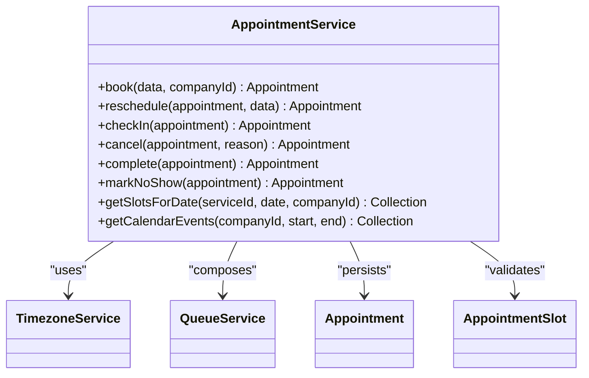

**Diagram sources**
- [AppointmentService.php:12-313](file://app\Modules\Appointments\Services\AppointmentService.php#L12-L313)

**Section sources**
- [AppointmentService.php:12-313](file://app\Modules\Appointments\Services\AppointmentService.php#L12-L313)

### QueueService
Responsibilities:
- Ticket creation with priority scoring and limit enforcement.
- Simple vs advanced queue modes with FIFO and priority rules.
- Calling next ticket, updating statuses, and syncing with linked appointments.
- Hold/resume/cancel flows with audit logging and events.
- Room changes and position management.

Key patterns:
- Constructor injection of ActivityLogService.
- Uses SubscriptionService to enforce plan limits.
- Uses TenantManager for tenant scoping.
- Emits domain events for UI updates and alerts.
- Priority score mapping ensures deterministic ordering.

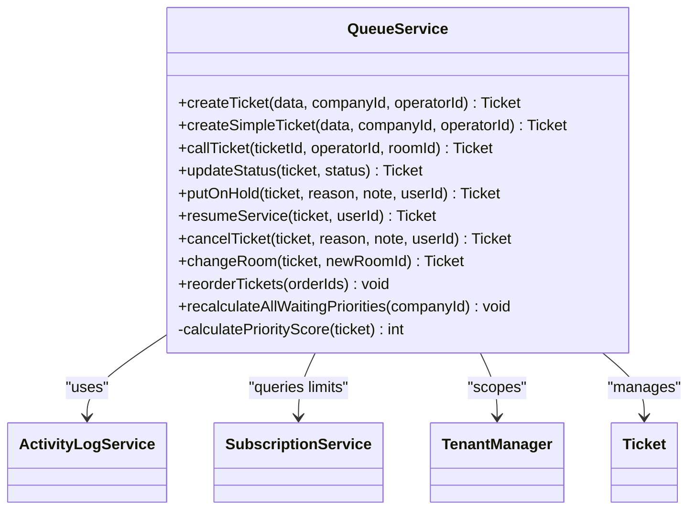

**Diagram sources**
- [QueueService.php:11-513](file://app\Modules\Queue\Services\QueueService.php#L11-L513)

**Section sources**
- [QueueService.php:11-513](file://app\Modules\Queue\Services\QueueService.php#L11-L513)

### PaymentLifecycleService
Responsibilities:
- Create subscription request with pending state, payment, and open invoice.
- Activate subscription upon successful payment with date stacking logic.
- Approve manual payments with provider resolution.

Key patterns:
- Transactional boundary around creation and activation.
- PaymentManager resolution for provider-specific initialization.
- Invoice itemization and provider data propagation.

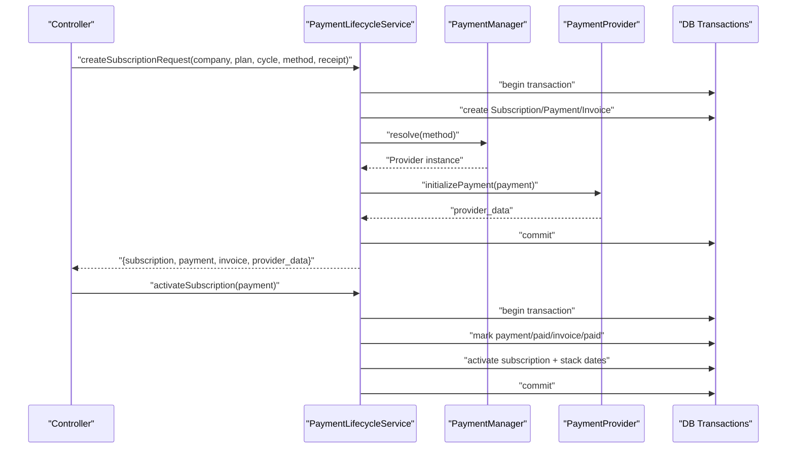

**Diagram sources**
- [PaymentLifecycleService.php:15-154](file://app\Modules\Payments\Services\PaymentLifecycleService.php#L15-L154)
- [PaymentManager.php:9-35](file://app\Modules\Payments\Managers\PaymentManager.php#L9-L35)

**Section sources**
- [PaymentLifecycleService.php:15-154](file://app\Modules\Payments\Services\PaymentLifecycleService.php#L15-L154)
- [PaymentManager.php:9-35](file://app\Modules\Payments\Managers\PaymentManager.php#L9-L35)

### RegisterService
Responsibilities:
- Register a company and owner within a single transaction.
- Assign roles and issue tokens.
- Optionally initiate a subscription request via PaymentLifecycleService.

Key patterns:
- Transactional registration flow.
- Composes PaymentLifecycleService for optional subscription creation.

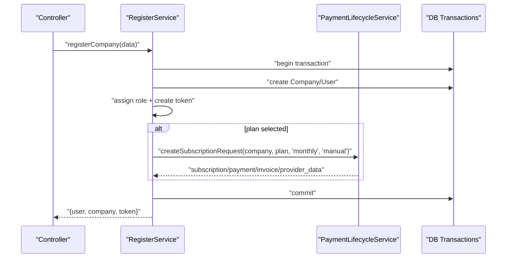

**Diagram sources**
- [RegisterService.php:11-69](file://app\Modules\Auth\Services\RegisterService.php#L11-L69)
- [PaymentLifecycleService.php:15-154](file://app\Modules\Payments\Services\PaymentLifecycleService.php#L15-L154)

**Section sources**
- [RegisterService.php:11-69](file://app\Modules\Auth\Services\RegisterService.php#L11-L69)

### WhatsAppService
Responsibilities:
- Normalize phone numbers and enforce a 24-hour reply window.
- Send outbound messages via external API and persist logs.

Key patterns:
- Configuration-driven external integration.
- Defensive checks and logging for resilience.

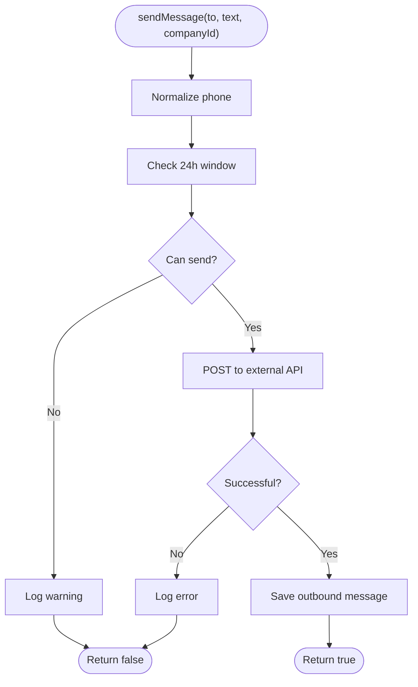

**Diagram sources**
- [WhatsAppService.php:11-111](file://app\Modules\WhatsApp\Services\WhatsAppService.php#L11-L111)

**Section sources**
- [WhatsAppService.php:11-111](file://app\Modules\WhatsApp\Services\WhatsAppService.php#L11-L111)

### AnalyticsService
Responsibilities:
- Compute KPIs, peak hours heatmap, trends, service distribution, bottlenecks, staff and room performance, wait time accuracy, and smart insights.
- Uses TimezoneService to normalize timestamps for accurate reporting.

Key patterns:
- Centralized base query builder with filters.
- Aggregation queries with timezone offsets.
- Insight engine that synthesizes findings into actionable messages.

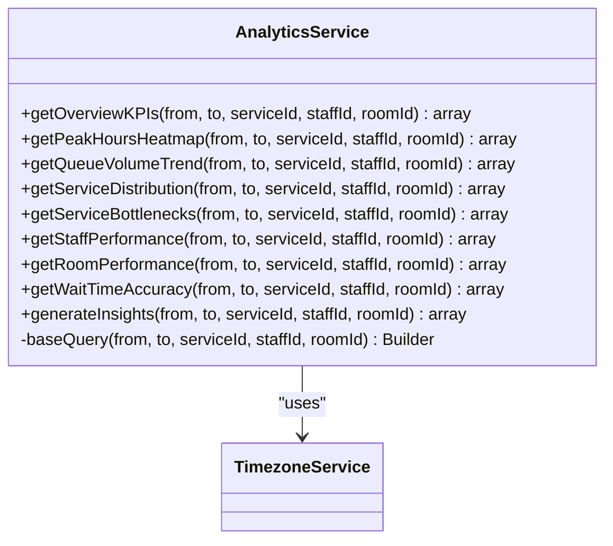

**Diagram sources**
- [AnalyticsService.php:13-563](file://app\Modules\Reports\Services\AnalyticsService.php#L13-L563)

**Section sources**
- [AnalyticsService.php:13-563](file://app\Modules\Reports\Services\AnalyticsService.php#L13-L563)

### SubscriptionService
Responsibilities:
- Enforce plan limits for tickets, staff, rooms, and customers.
- Compute remaining tickets for the current month.
- Check permissions granted by a plan.

Key patterns:
- Cached permission lookup per plan to reduce repeated queries.
- Count-based limit enforcement across entities.

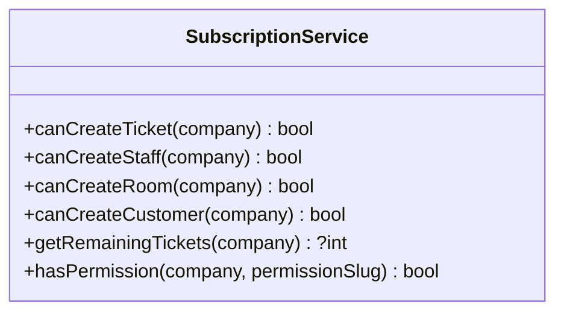

**Diagram sources**
- [SubscriptionService.php:11-134](file://app\Modules\Subscriptions\Services\SubscriptionService.php#L11-L134)

**Section sources**
- [SubscriptionService.php:11-134](file://app\Modules\Subscriptions\Services\SubscriptionService.php#L11-L134)

### PaymentManager
Responsibilities:
- Resolve payment provider instances by string identifiers.
- Supports manual/bank providers and leaves room for extensibility.

Key patterns:
- Factory-like resolution with explicit exceptions for unsupported providers.

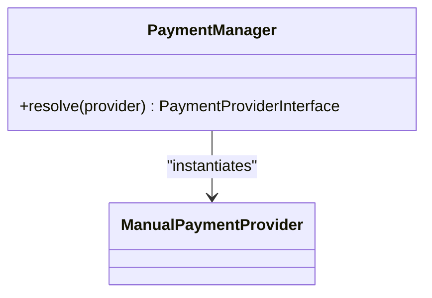

**Diagram sources**
- [PaymentManager.php:9-35](file://app\Modules\Payments\Managers\PaymentManager.php#L9-L35)

**Section sources**
- [PaymentManager.php:9-35](file://app\Modules\Payments\Managers\PaymentManager.php#L9-L35)

### TenantManager
Responsibilities:
- Provide tenant scoping for multi-tenant operations.
- Store and retrieve current tenant/company.

Key patterns:
- Simple setter/getter with optional presence checks.

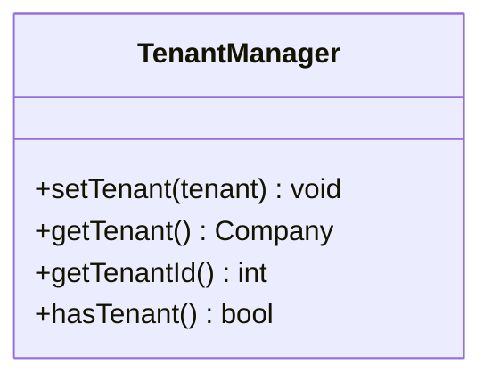

**Diagram sources**
- [TenantManager.php:7-46](file://app\Services\TenantManager.php#L7-L46)

**Section sources**
- [TenantManager.php:7-46](file://app\Services\TenantManager.php#L7-L46)

## Dependency Analysis
- Controllers depend on services, not models directly.
- Services depend on models, other services, and managers.
- Managers decouple services from provider specifics.
- Shared services (TenantManager, TimezoneService) are injected via the container.

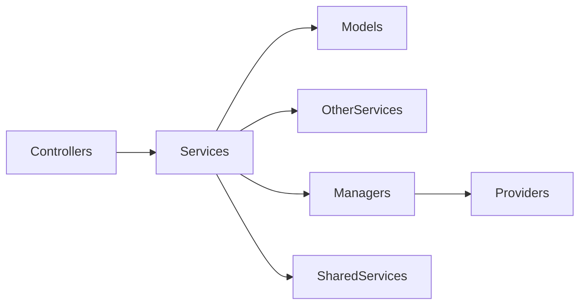

**Diagram sources**
- [AppointmentService.php:12-313](file://app\Modules\Appointments\Services\AppointmentService.php#L12-L313)
- [QueueService.php:11-513](file://app\Modules\Queue\Services\QueueService.php#L11-L513)
- [PaymentLifecycleService.php:15-154](file://app\Modules\Payments\Services\PaymentLifecycleService.php#L15-L154)
- [RegisterService.php:11-69](file://app\Modules\Auth\Services\RegisterService.php#L11-L69)
- [WhatsAppService.php:11-111](file://app\Modules\WhatsApp\Services\WhatsAppService.php#L11-L111)
- [AnalyticsService.php:13-563](file://app\Modules\Reports\Services\AnalyticsService.php#L13-L563)
- [SubscriptionService.php:11-134](file://app\Modules\Subscriptions\Services\SubscriptionService.php#L11-L134)
- [PaymentManager.php:9-35](file://app\Modules\Payments\Managers\PaymentManager.php#L9-L35)
- [TenantManager.php:7-46](file://app\Services\TenantManager.php#L7-L46)

**Section sources**
- [AppointmentService.php:12-313](file://app\Modules\Appointments\Services\AppointmentService.php#L12-L313)
- [QueueService.php:11-513](file://app\Modules\Queue\Services\QueueService.php#L11-L513)
- [PaymentLifecycleService.php:15-154](file://app\Modules\Payments\Services\PaymentLifecycleService.php#L15-L154)
- [RegisterService.php:11-69](file://app\Modules\Auth\Services\RegisterService.php#L11-L69)
- [WhatsAppService.php:11-111](file://app\Modules\WhatsApp\Services\WhatsAppService.php#L11-L111)
- [AnalyticsService.php:13-563](file://app\Modules\Reports\Services\AnalyticsService.php#L13-L563)
- [SubscriptionService.php:11-134](file://app\Modules\Subscriptions\Services\SubscriptionService.php#L11-L134)
- [PaymentManager.php:9-35](file://app\Modules\Payments\Managers\PaymentManager.php#L9-L35)
- [TenantManager.php:7-46](file://app\Services\TenantManager.php#L7-L46)

## Performance Considerations
- Prefer batch operations and minimal queries in services (e.g., QueueService reordering and recalculation).
- Use eager loading for related data (e.g., AppointmentService loads service/room/staff).
- Leverage timezone conversion once per request and reuse normalized values.
- Keep transaction boundaries tight to reduce lock contention (PaymentLifecycleService).
- Cache plan permissions in SubscriptionService to avoid repeated joins.

[No sources needed since this section provides general guidance]

## Troubleshooting Guide
Common issues and resolutions:
- Validation failures during booking/rescheduling:
  - Ensure slot availability and overbooking thresholds are respected.
  - Review timezone conversions for date comparisons.
- Payment activation errors:
  - Verify provider resolution and initialization outcomes.
  - Confirm transaction commits for creation and activation steps.
- Queue anomalies:
  - Check priority score calculations and recalculation triggers.
  - Validate tenant scoping and room filters.
- WhatsApp delivery failures:
  - Inspect 24-hour window logic and external API responses.
  - Review persisted logs for error details.

**Section sources**
- [AppointmentService.php:12-313](file://app\Modules\Appointments\Services\AppointmentService.php#L12-L313)
- [PaymentLifecycleService.php:15-154](file://app\Modules\Payments\Services\PaymentLifecycleService.php#L15-L154)
- [QueueService.php:11-513](file://app\Modules\Queue\Services\QueueService.php#L11-L513)
- [WhatsAppService.php:11-111](file://app\Modules\WhatsApp\Services\WhatsAppService.php#L11-L111)

## Conclusion
Noubtigo’s service layer cleanly separates business logic from controllers and models, enabling testability, maintainability, and composability. Services orchestrate complex workflows—appointments, queues, payments—while integrating with shared services and external systems. Transactions, dependency injection, and event emission ensure robustness and scalability.