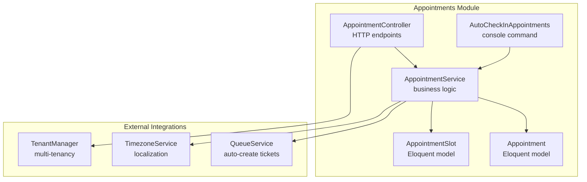
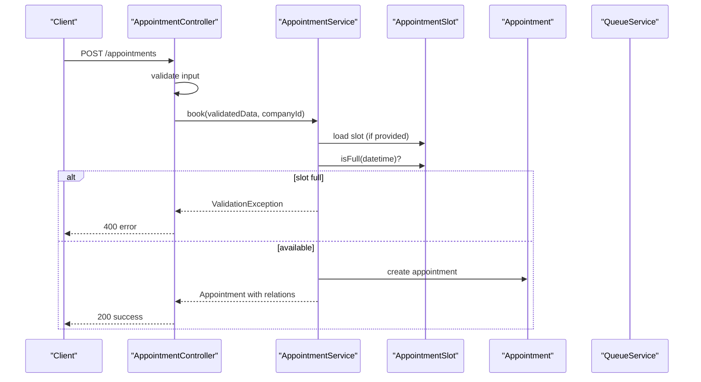
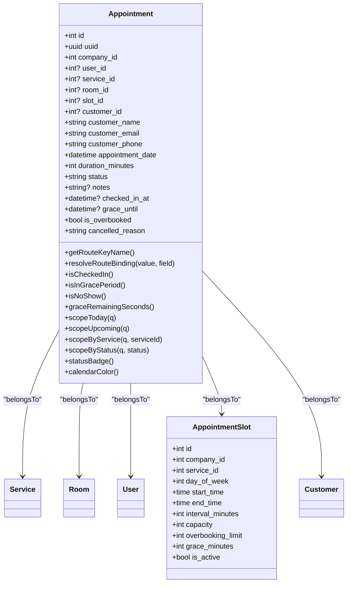
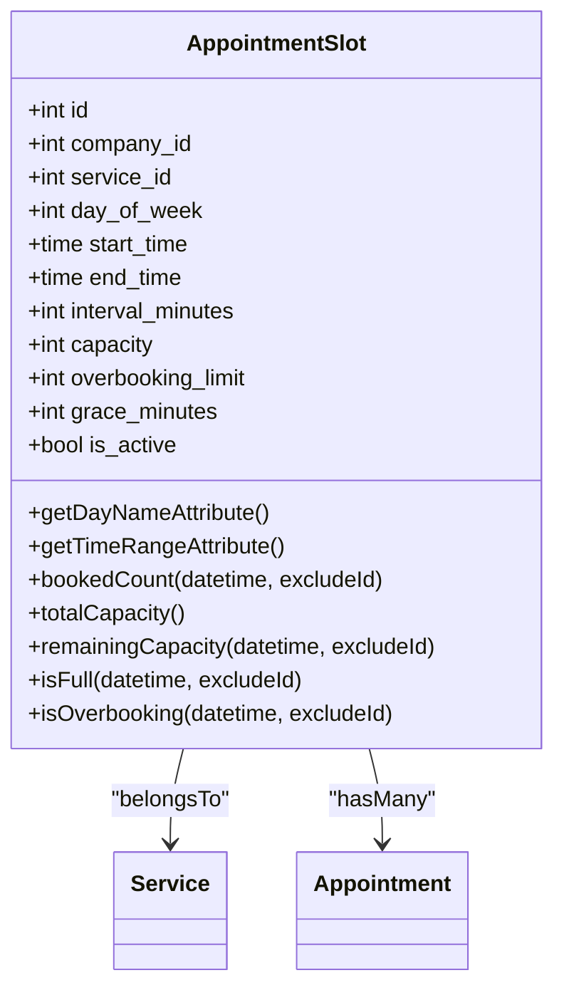
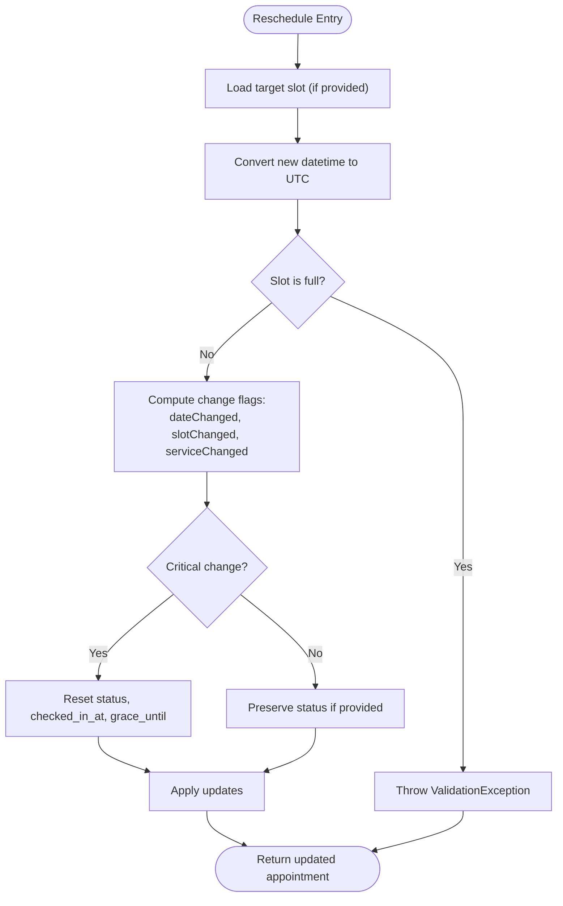
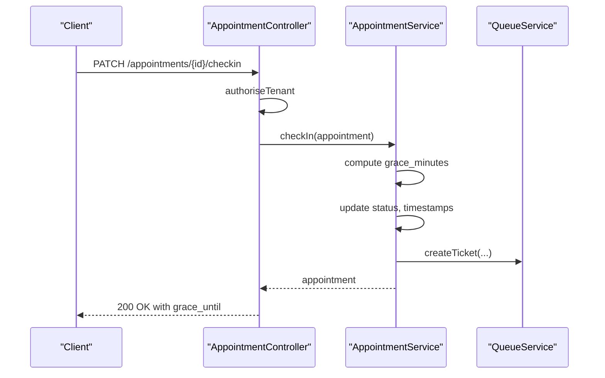
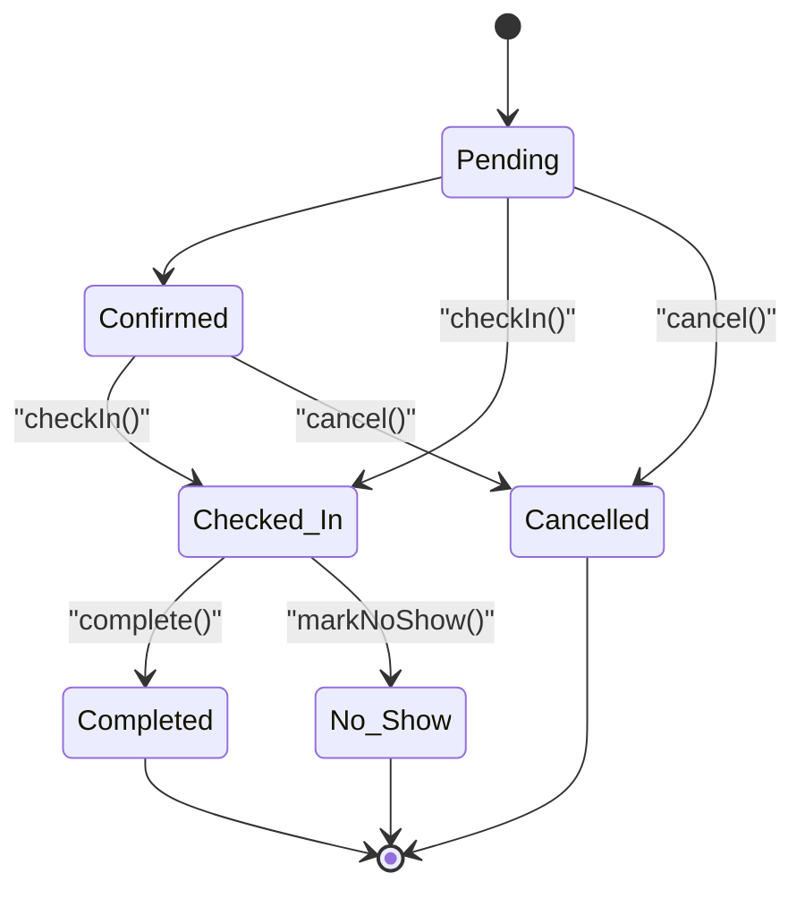
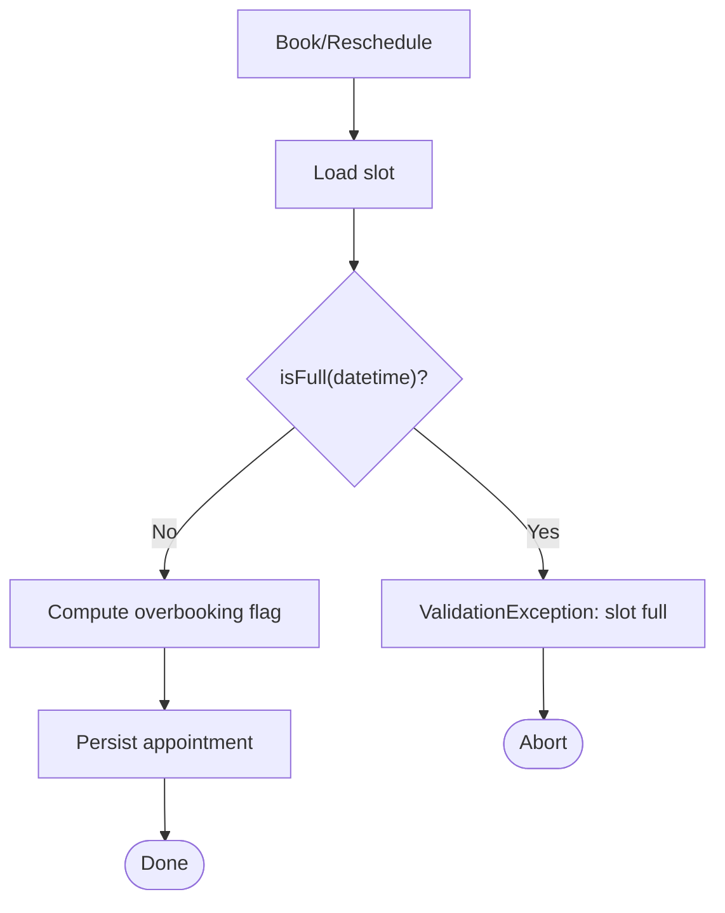
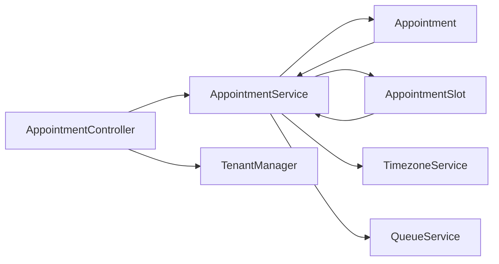

# Appointment Management

<cite>
**Referenced Files in This Document**
- [Appointment.php](file://app/Modules/Appointments/Models/Appointment.php)
- [AppointmentSlot.php](file://app/Modules/Appointments/Models/AppointmentSlot.php)
- [AppointmentService.php](file://app/Modules/Appointments/Services/AppointmentService.php)
- [AppointmentController.php](file://app/Modules/Appointments/Controllers/AppointmentController.php)
- [AppointmentSlotController.php](file://app/Modules/Appointments/Controllers/AppointmentSlotController.php)
- [AutoCheckInAppointments.php](file://app/Console/Commands/AutoCheckInAppointments.php)
- [web.php](file://routes/web.php)
- [2026_04_06_200001_create_appointment_slots_table.php](file://database/migrations/2026_04_06_200001_create_appointment_slots_table.php)
- [2026_04_06_200002_add_advanced_columns_to_appointments_table.php](file://database/migrations/2026_04_06_200002_add_advanced_columns_to_appointments_table.php)
</cite>

## Table of Contents
1. [Introduction](#introduction)
2. [Project Structure](#project-structure)
3. [Core Components](#core-components)
4. [Architecture Overview](#architecture-overview)
5. [Detailed Component Analysis](#detailed-component-analysis)
6. [Dependency Analysis](#dependency-analysis)
7. [Performance Considerations](#performance-considerations)
8. [Troubleshooting Guide](#troubleshooting-guide)
9. [Conclusion](#conclusion)
10. [Appendices](#appendices)

## Introduction
This document describes the Appointment Management functionality in the system. It covers the complete appointment lifecycle: booking, rescheduling, check-in, completion, cancellation, and no-show handling. It documents the Appointment model and its relationships, the AppointmentService methods and business rules, capacity management and overbooking logic, grace period handling, and integration with the customer management system. It also provides API endpoint documentation for appointment CRUD operations and administrative controls.

## Project Structure
The Appointment Management feature is organized into three main modules:
- Models: Appointment and AppointmentSlot define the data structures and relationships.
- Services: AppointmentService encapsulates all business logic for appointment operations.
- Controllers: AppointmentController and AppointmentSlotController expose HTTP endpoints for web and administrative operations.

**Diagram sources**
- [AppointmentController.php:14-211](file://app/Modules/Appointments/Controllers/AppointmentController.php#L14-L211)
- [AppointmentService.php:12-313](file://app/Modules/Appointments/Services/AppointmentService.php#L12-L313)
- [Appointment.php:10-183](file://app/Modules/Appointments/Models/Appointment.php#L10-L183)
- [AppointmentSlot.php:9-111](file://app/Modules/Appointments/Models/AppointmentSlot.php#L9-L111)
- [AutoCheckInAppointments.php:10-43](file://app/Console/Commands/AutoCheckInAppointments.php#L10-L43)

**Section sources**
- [web.php:196-218](file://routes/web.php#L196-L218)
- [AppointmentController.php:14-211](file://app/Modules/Appointments/Controllers/AppointmentController.php#L14-L211)
- [AppointmentService.php:12-313](file://app/Modules/Appointments/Services/AppointmentService.php#L12-L313)
- [Appointment.php:10-183](file://app/Modules/Appointments/Models/Appointment.php#L10-L183)
- [AppointmentSlot.php:9-111](file://app/Modules/Appointments/Models/AppointmentSlot.php#L9-L111)
- [AutoCheckInAppointments.php:10-43](file://app/Console/Commands/AutoCheckInAppointments.php#L10-L43)

## Core Components
- Appointment model: Represents a scheduled booking with customer, service, room, staff, and slot associations. It supports soft deletes, tenant scoping, UUID routing, and helper methods for status checks and calendar rendering.
- AppointmentSlot model: Defines recurring time slots with capacity, overbooking limits, and grace minutes. Provides capacity calculation helpers.
- AppointmentService: Central business logic provider for booking, rescheduling, check-in, completion, cancellation, and no-show handling. Includes slot availability generation and calendar export.
- Controllers: Expose endpoints for CRUD, calendar feed, slot availability, and administrative controls.

Key capabilities:
- Parameter validation and tenant scoping in controllers.
- Capacity checks against slots during booking and rescheduling.
- Overbooking detection and flagging.
- Grace period management and auto-check-in automation.
- Integration with QueueService to create tickets upon check-in.

**Section sources**
- [Appointment.php:10-183](file://app/Modules/Appointments/Models/Appointment.php#L10-L183)
- [AppointmentSlot.php:9-111](file://app/Modules/Appointments/Models/AppointmentSlot.php#L9-L111)
- [AppointmentService.php:12-313](file://app/Modules/Appointments/Services/AppointmentService.php#L12-L313)
- [AppointmentController.php:14-211](file://app/Modules/Appointments/Controllers/AppointmentController.php#L14-L211)

## Architecture Overview
The system follows a layered architecture:
- Presentation: Controllers handle HTTP requests and responses.
- Application: AppointmentService orchestrates business rules and integrates with external services.
- Domain: Eloquent models encapsulate persistence and relationships.
- Infrastructure: TimezoneService, TenantManager, and QueueService provide cross-cutting concerns.

**Diagram sources**
- [AppointmentController.php:65-98](file://app/Modules/Appointments/Controllers/AppointmentController.php#L65-L98)
- [AppointmentService.php:26-66](file://app/Modules/Appointments/Services/AppointmentService.php#L26-L66)
- [AppointmentSlot.php:100-108](file://app/Modules/Appointments/Models/AppointmentSlot.php#L100-L108)

**Section sources**
- [web.php:196-208](file://routes/web.php#L196-L208)
- [AppointmentController.php:65-98](file://app/Modules/Appointments/Controllers/AppointmentController.php#L65-L98)
- [AppointmentService.php:26-66](file://app/Modules/Appointments/Services/AppointmentService.php#L26-L66)

## Detailed Component Analysis

### Appointment Model
The Appointment model defines:
- Fillable attributes including customer contact fields, scheduling metadata, status, and operational timestamps.
- UUID generation on creation and route model binding via UUID or ID.
- Relationships to Service, Room, Staff (User), Slot, and Customer.
- Helper methods for checking in, grace period, no-show, and remaining grace seconds.
- Query scopes for today, upcoming, by service, and by status.
- Status badge and calendar color helpers for UI rendering.

**Diagram sources**
- [Appointment.php:14-77](file://app/Modules/Appointments/Models/Appointment.php#L14-L77)
- [AppointmentSlot.php:13-59](file://app/Modules/Appointments/Models/AppointmentSlot.php#L13-L59)

**Section sources**
- [Appointment.php:10-183](file://app/Modules/Appointments/Models/Appointment.php#L10-L183)

### AppointmentSlot Model
The AppointmentSlot model defines:
- Fillable attributes for template-based recurring slots.
- Casts for integer and boolean fields.
- Attribute accessors for day name and formatted time range.
- Relationships to Service and Appointments.
- Capacity helpers: booked count, total capacity, remaining capacity, full/overbooking checks.

**Diagram sources**
- [AppointmentSlot.php:13-108](file://app/Modules/Appointments/Models/AppointmentSlot.php#L13-L108)

**Section sources**
- [AppointmentSlot.php:9-111](file://app/Modules/Appointments/Models/AppointmentSlot.php#L9-L111)
- [2026_04_06_200001_create_appointment_slots_table.php:11-25](file://database/migrations/2026_04_06_200001_create_appointment_slots_table.php#L11-L25)

### AppointmentService Methods and Business Rules
- Booking:
  - Validates slot availability and overbooking eligibility.
  - Creates appointment with pending status and optional overbooking flag.
  - Loads relations for immediate response.
- Rescheduling:
  - Detects critical changes (date, slot, service).
  - Enforces capacity checks for target slot.
  - Resets status and check-in fields on critical changes; otherwise preserves status if provided.
- Check-in:
  - Sets status to checked_in, records check-in timestamp, and sets grace period based on slot’s grace_minutes.
  - Automatically creates a queue ticket.
- Completion:
  - Marks appointment as completed.
- Cancellation:
  - Marks appointment as cancelled with a reason.
- No-show:
  - Marks appointment as no_show.
- Slot availability:
  - Generates available slots for a given service and date, including capacity, remaining, and overbooking indicators.
- Calendar events:
  - Returns FullCalendar-compatible events with localized time conversion.

**Diagram sources**
- [AppointmentService.php:73-133](file://app/Modules/Appointments/Services/AppointmentService.php#L73-L133)

**Section sources**
- [AppointmentService.php:26-189](file://app/Modules/Appointments/Services/AppointmentService.php#L26-L189)

### Controllers: Appointment and Slot Administration
- AppointmentController:
  - index: Renders calendar view with stats and upcoming list.
  - events: Returns calendar events for a date range.
  - store: Validates and books an appointment; enforces subscription limits.
  - update: Optimizes simple metadata/status updates; otherwise delegates to reschedule logic.
  - checkIn: Performs check-in with grace period and ticket creation.
  - cancel: Cancels appointment with reason.
  - destroy: Deletes appointment.
  - slots: Returns available slots for a service and date.
  - authoriseTenant: Ensures tenant isolation.
- AppointmentSlotController:
  - index: Lists slot templates.
  - store: Creates slot templates across multiple days.
  - update: Updates slot template.
  - destroy: Removes slot template.
  - authoriseTenant: Ensures tenant isolation.

**Diagram sources**
- [AppointmentController.php:140-158](file://app/Modules/Appointments/Controllers/AppointmentController.php#L140-L158)
- [AppointmentService.php:140-161](file://app/Modules/Appointments/Services/AppointmentService.php#L140-L161)

**Section sources**
- [AppointmentController.php:14-211](file://app/Modules/Appointments/Controllers/AppointmentController.php#L14-L211)
- [AppointmentSlotController.php:11-122](file://app/Modules/Appointments/Controllers/AppointmentSlotController.php#L11-L122)

### API Endpoints
All endpoints are under the web routes group for the Appointments module.

- GET /appointments
  - Description: Render calendar view with stats and upcoming appointments.
  - Permissions: appointments.view
- GET /appointments/events
  - Description: FullCalendar JSON feed for a date range.
  - Query params: start (UTC), end (UTC)
  - Permissions: appointments.view
- POST /appointments
  - Description: Create a new appointment.
  - Permissions: appointments.create
  - Validation: service_id, customer_name, customer_email, customer_phone, customer_id, slot_id, room_id, user_id, appointment_date, duration_minutes, notes
- PUT /appointments/{appointment}
  - Description: Update appointment (metadata/status) or reschedule (critical changes).
  - Permissions: appointments.edit
  - Validation: service_id, customer_name, customer_email, customer_phone, customer_id, slot_id, room_id, user_id, appointment_date, duration_minutes, notes, status
- PATCH /appointments/{appointment}/checkin
  - Description: Check in appointment and set grace period; auto-create queue ticket.
  - Permissions: appointments.edit
- PATCH /appointments/{appointment}/cancel
  - Description: Cancel appointment with reason.
  - Permissions: appointments.edit
- DELETE /appointments/{appointment}
  - Description: Delete appointment.
  - Permissions: appointments.delete
- GET /appointments/slots-available
  - Description: List available slots for a service and date.
  - Permissions: appointments.view
  - Validation: service_id, date

Administrative slot templates:
- GET /appointment-slots
  - Description: List slot templates.
  - Permissions: appointments.edit
- POST /appointment-slots
  - Description: Create slot templates across multiple days.
  - Permissions: appointments.edit
- PUT /appointment-slots/{slot}
  - Description: Update slot template.
  - Permissions: appointments.edit
- DELETE /appointment-slots/{slot}
  - Description: Delete slot template.
  - Permissions: appointments.edit

Notes:
- All endpoints enforce tenant isolation via authorisation checks.
- The store endpoint validates subscription limits before booking.

**Section sources**
- [web.php:196-218](file://routes/web.php#L196-L218)
- [AppointmentController.php:65-199](file://app/Modules/Appointments/Controllers/AppointmentController.php#L65-L199)
- [AppointmentSlotController.php:21-122](file://app/Modules/Appointments/Controllers/AppointmentSlotController.php#L21-L122)

### Appointment Lifecycle and Status Transitions
- Booking: status starts as pending; optional slot association and overbooking flag.
- Rescheduling: may reset status and timestamps on critical changes; otherwise preserve status if provided.
- Check-in: status becomes checked_in; grace period begins.
- Completion: status becomes completed.
- Cancellation: status becomes cancelled with reason.
- No-show: status becomes no_show.

**Diagram sources**
- [AppointmentService.php:165-189](file://app/Modules/Appointments/Services/AppointmentService.php#L165-L189)
- [2026_04_06_200002_add_advanced_columns_to_appointments_table.php:35-42](file://database/migrations/2026_04_06_200002_add_advanced_columns_to_appointments_table.php#L35-L42)

**Section sources**
- [AppointmentService.php:165-189](file://app/Modules/Appointments/Services/AppointmentService.php#L165-L189)
- [2026_04_06_200002_add_advanced_columns_to_appointments_table.php:35-42](file://database/migrations/2026_04_06_200002_add_advanced_columns_to_appointments_table.php#L35-L42)

### Capacity Management, Overbooking, and Grace Periods
- Capacity management:
  - Slot capacity and overbooking limits are enforced during booking and rescheduling.
  - Overbooking occurs when booked count reaches capacity; the flag is set accordingly.
- Grace periods:
  - Check-in sets a grace period derived from slot’s grace_minutes.
  - Utility helpers indicate whether in grace and remaining seconds.
- Automation:
  - Console command automatically checks in pending/confirmed appointments whose time has arrived.

**Diagram sources**
- [AppointmentService.php:34-46](file://app/Modules/Appointments/Services/AppointmentService.php#L34-L46)
- [AppointmentSlot.php:100-108](file://app/Modules/Appointments/Models/AppointmentSlot.php#L100-L108)

**Section sources**
- [AppointmentService.php:34-46](file://app/Modules/Appointments/Services/AppointmentService.php#L34-L46)
- [AppointmentSlot.php:84-108](file://app/Modules/Appointments/Models/AppointmentSlot.php#L84-L108)
- [AutoCheckInAppointments.php:15-38](file://app/Console/Commands/AutoCheckInAppointments.php#L15-L38)

### Conflict Resolution Strategies
- Critical change detection:
  - Rescheduling detects changes to date, slot, or service and triggers stricter validation and resets status/check-in fields.
- Slot availability:
  - The service generates available slots for a given date/service, surfacing capacity and overbooking status to prevent conflicts.

**Section sources**
- [AppointmentService.php:95-133](file://app/Modules/Appointments/Services/AppointmentService.php#L95-L133)
- [AppointmentService.php:196-253](file://app/Modules/Appointments/Services/AppointmentService.php#L196-L253)

### Integration with Customer Management
- Appointment stores customer identity either via customer_id or explicit contact fields.
- The model relates to the Customer entity, enabling customer-centric operations and reporting.

**Section sources**
- [Appointment.php:74-77](file://app/Modules/Appointments/Models/Appointment.php#L74-L77)

## Dependency Analysis
- Controllers depend on AppointmentService for business logic.
- AppointmentService depends on:
  - Appointment and AppointmentSlot models for persistence and calculations.
  - TimezoneService for UTC/local conversions.
  - QueueService for automatic ticket creation on check-in.
  - TenantManager for tenant scoping.
- Models encapsulate relationships and helpers; migrations define schema and enums.

**Diagram sources**
- [AppointmentController.php:16-16](file://app/Modules/Appointments/Controllers/AppointmentController.php#L16-L16)
- [AppointmentService.php:14-19](file://app/Modules/Appointments/Services/AppointmentService.php#L14-L19)
- [Appointment.php:54-77](file://app/Modules/Appointments/Models/Appointment.php#L54-L77)
- [AppointmentSlot.php:56-64](file://app/Modules/Appointments/Models/AppointmentSlot.php#L56-L64)

**Section sources**
- [AppointmentController.php:16-16](file://app/Modules/Appointments/Controllers/AppointmentController.php#L16-L16)
- [AppointmentService.php:14-19](file://app/Modules/Appointments/Services/AppointmentService.php#L14-L19)

## Performance Considerations
- Prefer optimized updates: The controller avoids invoking rescheduling logic for simple metadata/status changes, reducing overhead.
- Use scopes for efficient queries: Today/upcoming scopes leverage timezone-aware conversions and ordering.
- Batch slot generation: Slot templates are created across multiple days in a single operation.

[No sources needed since this section provides general guidance]

## Troubleshooting Guide
Common issues and resolutions:
- ValidationException on booking/rescheduling:
  - Cause: Target slot is fully booked.
  - Resolution: Choose another slot or date; verify remaining capacity.
- Auto-check-in failures:
  - Cause: Exceptions during check-in process.
  - Resolution: Review logs; ensure slot grace_minutes and queue integration are configured.
- Tenant isolation errors:
  - Cause: Attempting to access appointments outside current tenant.
  - Resolution: Verify tenant context and permissions.

**Section sources**
- [AppointmentService.php:38-42](file://app/Modules/Appointments/Services/AppointmentService.php#L38-L42)
- [AutoCheckInAppointments.php:33-35](file://app/Console/Commands/AutoCheckInAppointments.php#L33-L35)
- [AppointmentController.php:203-209](file://app/Modules/Appointments/Controllers/AppointmentController.php#L203-L209)

## Conclusion
The Appointment Management feature provides a robust, tenant-scoped solution for scheduling and managing appointments. It enforces capacity and overbooking rules, supports flexible rescheduling with conflict detection, automates check-in and ticket creation, and exposes comprehensive APIs for administration and integration.

[No sources needed since this section summarizes without analyzing specific files]

## Appendices

### Data Model Definitions
- Appointments table (relevant columns):
  - id, uuid, company_id, user_id, service_id, room_id, slot_id, customer_id, customer_name, customer_email, customer_phone, appointment_date, duration_minutes, status, notes, checked_in_at, grace_until, is_overbooked, cancelled_reason
- Appointment Slots table (relevant columns):
  - id, company_id, service_id, day_of_week, start_time, end_time, interval_minutes, capacity, overbooking_limit, grace_minutes, is_active

**Section sources**
- [2026_04_06_200002_add_advanced_columns_to_appointments_table.php:35-51](file://database/migrations/2026_04_06_200002_add_advanced_columns_to_appointments_table.php#L35-L51)
- [2026_04_06_200001_create_appointment_slots_table.php:11-25](file://database/migrations/2026_04_06_200001_create_appointment_slots_table.php#L11-L25)