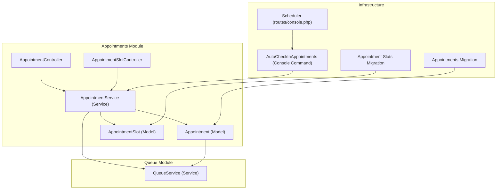
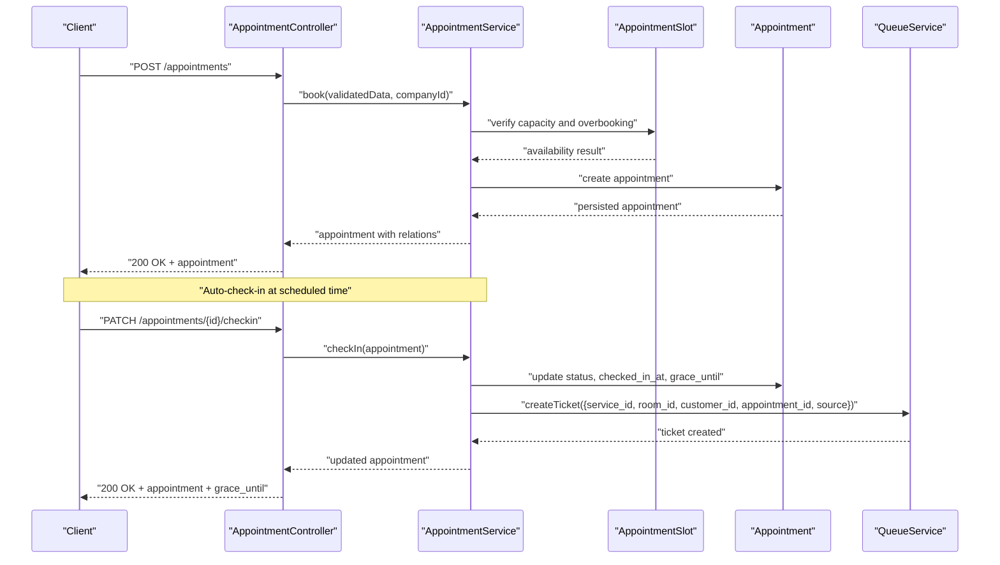
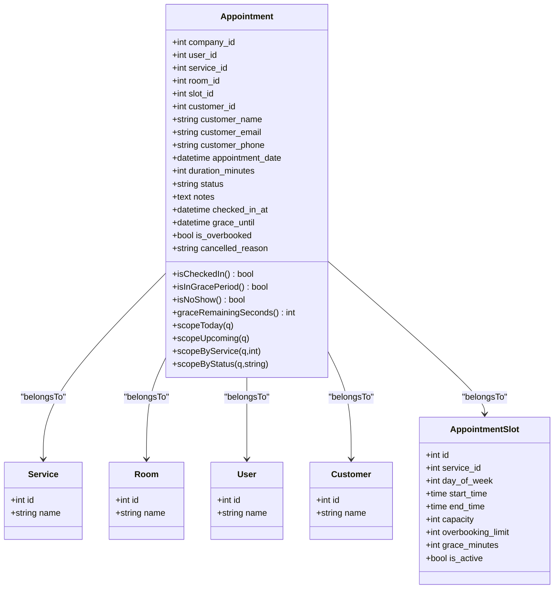
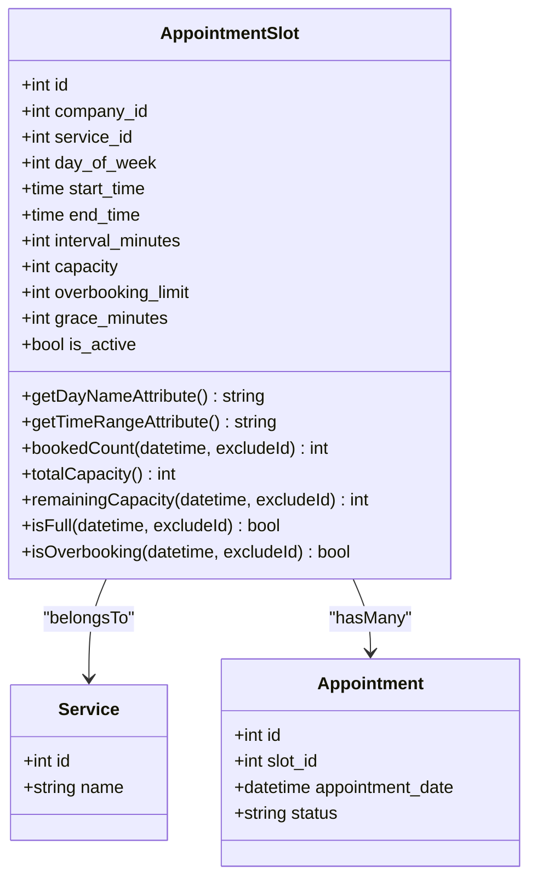
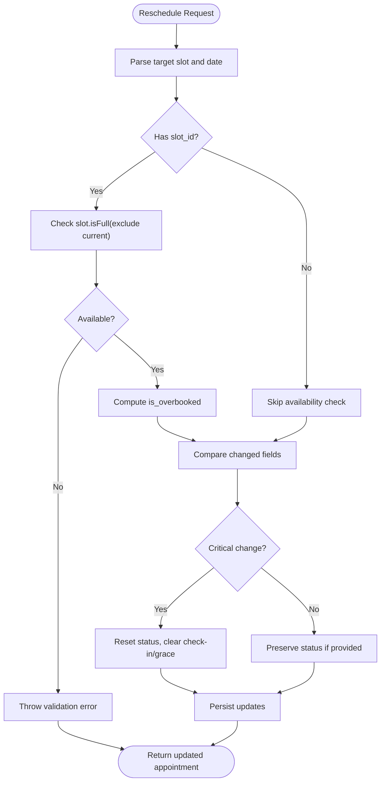
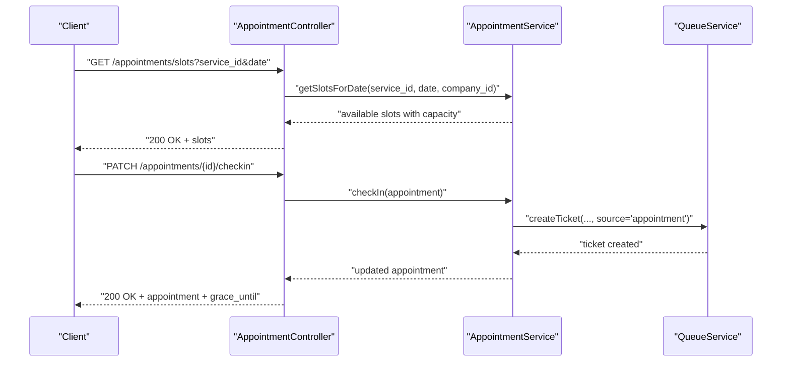
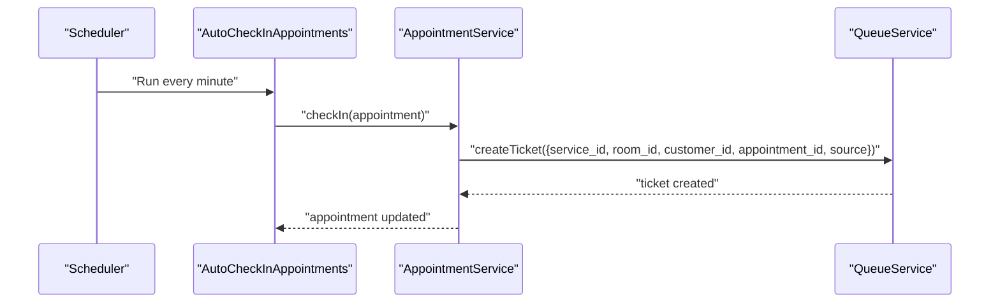
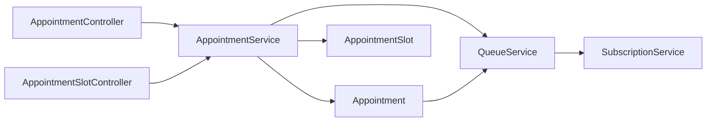

# Appointment System

<cite>
**Referenced Files in This Document**
- [Appointment.php](file://app/Modules/Appointments/Models/Appointment.php)
- [AppointmentSlot.php](file://app/Modules/Appointments/Models/AppointmentSlot.php)
- [AppointmentService.php](file://app/Modules/Appointments/Services/AppointmentService.php)
- [AppointmentController.php](file://app/Modules/Appointments/Controllers/AppointmentController.php)
- [AppointmentSlotController.php](file://app/Modules/Appointments/Controllers/AppointmentSlotController.php)
- [QueueService.php](file://app/Modules/Queue/Services/QueueService.php)
- [AutoCheckInAppointments.php](file://app/Console/Commands/AutoCheckInAppointments.php)
- [2024_01_03_000001_create_appointments_table.php](file://database/migrations/2024_01_03_000001_create_appointments_table.php)
- [2026_04_06_200001_create_appointment_slots_table.php](file://database/migrations/2026_04_06_200001_create_appointment_slots_table.php)
- [console.php](file://routes/console.php)
</cite>

## Table of Contents
1. [Introduction](#introduction)
2. [Project Structure](#project-structure)
3. [Core Components](#core-components)
4. [Architecture Overview](#architecture-overview)
5. [Detailed Component Analysis](#detailed-component-analysis)
6. [Dependency Analysis](#dependency-analysis)
7. [Performance Considerations](#performance-considerations)
8. [Troubleshooting Guide](#troubleshooting-guide)
9. [Conclusion](#conclusion)
10. [Appendices](#appendices)

## Introduction
This document explains the Appointment System module, covering the scheduling workflow, slot management, and auto-check-in functionality. It documents the Appointment and AppointmentSlot models and their relationships, the AppointmentService implementation for availability checks, booking, rescheduling, and auto-check-in, and the integration with the queue system for automatic ticket creation upon appointment completion. It also outlines API endpoints for appointment management, slot availability queries, and administrative controls, along with examples of workflows, conflict resolution strategies, and integration patterns with external calendar systems.

## Project Structure
The Appointment System is organized by domain into Models, Services, and Controllers under the Appointments module. Supporting components include the Queue integration and a console command for auto-check-in.

**Diagram sources**
- [AppointmentController.php:14-211](file://app/Modules/Appointments/Controllers/AppointmentController.php#L14-L211)
- [AppointmentSlotController.php:11-122](file://app/Modules/Appointments/Controllers/AppointmentSlotController.php#L11-L122)
- [Appointment.php:10-183](file://app/Modules/Appointments/Models/Appointment.php#L10-L183)
- [AppointmentSlot.php:9-111](file://app/Modules/Appointments/Models/AppointmentSlot.php#L9-L111)
- [AppointmentService.php:12-313](file://app/Modules/Appointments/Services/AppointmentService.php#L12-L313)
- [QueueService.php:11-513](file://app/Modules/Queue/Services/QueueService.php#L11-L513)
- [AutoCheckInAppointments.php:10-42](file://app/Console/Commands/AutoCheckInAppointments.php#L10-L42)
- [2024_01_03_000001_create_appointments_table.php:14-33](file://database/migrations/2024_01_03_000001_create_appointments_table.php#L14-L33)
- [2026_04_06_200001_create_appointment_slots_table.php:11-25](file://database/migrations/2026_04_06_200001_create_appointment_slots_table.php#L11-L25)
- [console.php:11-12](file://routes/console.php#L11-L12)

**Section sources**
- [AppointmentController.php:14-211](file://app/Modules/Appointments/Controllers/AppointmentController.php#L14-L211)
- [AppointmentSlotController.php:11-122](file://app/Modules/Appointments/Controllers/AppointmentSlotController.php#L11-L122)
- [Appointment.php:10-183](file://app/Modules/Appointments/Models/Appointment.php#L10-L183)
- [AppointmentSlot.php:9-111](file://app/Modules/Appointments/Models/AppointmentSlot.php#L9-L111)
- [AppointmentService.php:12-313](file://app/Modules/Appointments/Services/AppointmentService.php#L12-L313)
- [QueueService.php:11-513](file://app/Modules/Queue/Services/QueueService.php#L11-L513)
- [AutoCheckInAppointments.php:10-42](file://app/Console/Commands/AutoCheckInAppointments.php#L10-L42)
- [2024_01_03_000001_create_appointments_table.php:14-33](file://database/migrations/2024_01_03_000001_create_appointments_table.php#L14-L33)
- [2026_04_06_200001_create_appointment_slots_table.php:11-25](file://database/migrations/2026_04_06_200001_create_appointment_slots_table.php#L11-L25)
- [console.php:11-12](file://routes/console.php#L11-L12)

## Core Components
- Appointment model: Stores appointment metadata, relationships to service, room, staff, customer, and slot, plus status and time fields. Includes scopes for “today” and “upcoming,” and helpers for check-in and grace period.
- AppointmentSlot model: Defines recurring slot templates with capacity, overbooking limits, interval, and grace minutes, and computes availability for specific datetimes.
- AppointmentService: Orchestrates booking, rescheduling, check-in, cancellation, completion, and no-show transitions; generates slot availability lists; and integrates with the queue system.
- Controllers: Expose endpoints for listing, creating, updating, deleting, checking in, retrieving slots, and calendar events; enforce tenant scoping and validation.
- QueueService: Creates queue tickets from appointments and synchronizes statuses between appointments and tickets.
- AutoCheckInAppointments: Console command invoked periodically to auto-check-in overdue pending/confirmed appointments.

**Section sources**
- [Appointment.php:10-183](file://app/Modules/Appointments/Models/Appointment.php#L10-L183)
- [AppointmentSlot.php:9-111](file://app/Modules/Appointments/Models/AppointmentSlot.php#L9-L111)
- [AppointmentService.php:12-313](file://app/Modules/Appointments/Services/AppointmentService.php#L12-L313)
- [AppointmentController.php:14-211](file://app/Modules/Appointments/Controllers/AppointmentController.php#L14-L211)
- [AppointmentSlotController.php:11-122](file://app/Modules/Appointments/Controllers/AppointmentSlotController.php#L11-L122)
- [QueueService.php:11-513](file://app/Modules/Queue/Services/QueueService.php#L11-L513)
- [AutoCheckInAppointments.php:10-42](file://app/Console/Commands/AutoCheckInAppointments.php#L10-L42)

## Architecture Overview
The system separates concerns across models, services, and controllers. The AppointmentService encapsulates business logic, while controllers handle HTTP requests and validation. The QueueService manages ticket creation and status synchronization. A scheduler triggers a console command to auto-check-in appointments when their time arrives.

**Diagram sources**
- [AppointmentController.php:65-98](file://app/Modules/Appointments/Controllers/AppointmentController.php#L65-L98)
- [AppointmentService.php:26-66](file://app/Modules/Appointments/Services/AppointmentService.php#L26-L66)
- [AppointmentSlot.php:71-108](file://app/Modules/Appointments/Models/AppointmentSlot.php#L71-L108)
- [Appointment.php:14-87](file://app/Modules/Appointments/Models/Appointment.php#L14-L87)
- [QueueService.php:23-56](file://app/Modules/Queue/Services/QueueService.php#L23-L56)
- [AutoCheckInAppointments.php:15-38](file://app/Console/Commands/AutoCheckInAppointments.php#L15-L38)

## Detailed Component Analysis

### Appointment Model
- Fields: company_id, user_id (staff), service_id, room_id, slot_id, customer linkage, appointment_date, duration_minutes, status, notes, timestamps, soft deletes.
- Relationships: belongsTo Service, Room, User (staff), Customer; belongsTo AppointmentSlot.
- Helpers: isCheckedIn, isInGracePeriod, isNoShow, graceRemainingSeconds.
- Scopes: today (converted to tenant’s local day boundaries), upcoming, byService, byStatus.
- Route binding: supports UUID for secure routing.

**Diagram sources**
- [Appointment.php:14-77](file://app/Modules/Appointments/Models/Appointment.php#L14-L77)
- [Service.php](file://app/Modules/Services/Models/Service.php)
- [Room.php](file://app/Modules/Rooms/Models/Room.php)
- [User.php](file://app/Models/User.php)
- [Customer.php](file://app/Modules/Customers/Models/Customer.php)
- [AppointmentSlot.php:13-24](file://app/Modules/Appointments/Models/AppointmentSlot.php#L13-L24)

**Section sources**
- [Appointment.php:10-183](file://app/Modules/Appointments/Models/Appointment.php#L10-L183)

### AppointmentSlot Model
- Fields: company_id, service_id, day_of_week, start_time, end_time, interval_minutes, capacity, overbooking_limit, grace_minutes, is_active.
- Computed attributes: day name, time range in local time.
- Relationships: belongsTo Service, hasMany Appointment.
- Capacity helpers: bookedCount, totalCapacity, remainingCapacity, isFull, isOverbooking.

**Diagram sources**
- [AppointmentSlot.php:9-111](file://app/Modules/Appointments/Models/AppointmentSlot.php#L9-L111)
- [Service.php](file://app/Modules/Services/Models/Service.php)
- [Appointment.php:10-183](file://app/Modules/Appointments/Models/Appointment.php#L10-L183)

**Section sources**
- [AppointmentSlot.php:9-111](file://app/Modules/Appointments/Models/AppointmentSlot.php#L9-L111)

### AppointmentService Implementation
- Booking: Validates slot availability and overbooking, persists appointment with defaults and overbooking flag.
- Rescheduling: Detects critical changes (date/slot/service) and resets status/check-in/grace accordingly; otherwise updates non-critical fields.
- Check-in: Sets status to checked_in, records checked_in_at and grace_until, and creates a queue ticket.
- Cancellation/Completion/No-show: Updates status appropriately.
- Availability: Generates slot blocks for a given date by iterating slot templates and computing remaining capacity.
- Calendar events: Returns FullCalendar-compatible events with local time conversions.

**Diagram sources**
- [AppointmentService.php:73-133](file://app/Modules/Appointments/Services/AppointmentService.php#L73-L133)

**Section sources**
- [AppointmentService.php:12-313](file://app/Modules/Appointments/Services/AppointmentService.php#L12-L313)

### Controllers and API Endpoints
- AppointmentController:
  - GET /appointments (index): renders page with stats and upcoming list.
  - GET /appointments/events (events): returns calendar events for a date range.
  - POST /appointments (store): validates and books an appointment.
  - PATCH /appointments/{id} (update): edits or reschedules depending on fields.
  - PATCH /appointments/{id}/checkin (checkIn): performs check-in and returns grace_until.
  - DELETE /appointments/{id} (destroy): deletes appointment.
  - GET /appointments/slots (slots): returns available slots for a service+date.
  - Tenant scoping enforced via authoriseTenant.
- AppointmentSlotController:
  - GET /appointment-slots/index: lists slots and services.
  - POST /appointment-slots (store): creates slots for selected days of week.
  - PATCH /appointment-slots/{id} (update): updates slot timing/capacity.
  - DELETE /appointment-slots/{id} (destroy): removes slot.
  - Tenant scoping enforced via authoriseTenant.

**Diagram sources**
- [AppointmentController.php:184-199](file://app/Modules/Appointments/Controllers/AppointmentController.php#L184-L199)
- [AppointmentService.php:140-161](file://app/Modules/Appointments/Services/AppointmentService.php#L140-L161)
- [QueueService.php:23-56](file://app/Modules/Queue/Services/QueueService.php#L23-L56)

**Section sources**
- [AppointmentController.php:14-211](file://app/Modules/Appointments/Controllers/AppointmentController.php#L14-L211)
- [AppointmentSlotController.php:11-122](file://app/Modules/Appointments/Controllers/AppointmentSlotController.php#L11-L122)

### Auto-Check-In and Queue Integration
- Auto-check-in: A scheduled command finds overdue pending/confirmed appointments and invokes check-in, which sets status, timestamps, and grace period, and creates a queue ticket.
- Queue integration: QueueService.createTicket is called with appointment-linked data; later, QueueService.updateStatus and callTicket synchronize appointment and ticket states bidirectionally.

**Diagram sources**
- [console.php:11-12](file://routes/console.php#L11-L12)
- [AutoCheckInAppointments.php:15-38](file://app/Console/Commands/AutoCheckInAppointments.php#L15-L38)
- [AppointmentService.php:140-161](file://app/Modules/Appointments/Services/AppointmentService.php#L140-L161)
- [QueueService.php:23-56](file://app/Modules/Queue/Services/QueueService.php#L23-L56)

**Section sources**
- [AutoCheckInAppointments.php:10-42](file://app/Console/Commands/AutoCheckInAppointments.php#L10-L42)
- [QueueService.php:11-513](file://app/Modules/Queue/Services/QueueService.php#L11-L513)

## Dependency Analysis
- Controllers depend on AppointmentService for business logic.
- AppointmentService depends on Appointment, AppointmentSlot, TimezoneService, and QueueService.
- Models define relationships and computed helpers; migrations define schema and indexes.
- QueueService depends on SubscriptionService for limits and interacts with Tickets.

**Diagram sources**
- [AppointmentController.php:16-16](file://app/Modules/Appointments/Controllers/AppointmentController.php#L16-L16)
- [AppointmentSlotController.php:15-17](file://app/Modules/Appointments/Controllers/AppointmentSlotController.php#L15-L17)
- [AppointmentService.php:14-18](file://app/Modules/Appointments/Services/AppointmentService.php#L14-L18)
- [QueueService.php:28-32](file://app/Modules/Queue/Services/QueueService.php#L28-L32)

**Section sources**
- [AppointmentService.php:12-313](file://app/Modules/Appointments/Services/AppointmentService.php#L12-L313)
- [QueueService.php:11-513](file://app/Modules/Queue/Services/QueueService.php#L11-L513)

## Performance Considerations
- Indexes: appointment_slots table includes a composite index on company_id, service_id, and day_of_week to optimize slot retrieval.
- Timezone conversions: UTC is stored; local conversions are performed for UI and calendar feeds to minimize DB overhead.
- Availability computation: Slot availability is computed per exact datetime during slot generation; precompute and cache where appropriate for high-volume scenarios.
- Queue synchronization: Status updates cascade between appointments and tickets; batch operations can reduce redundant writes.

**Section sources**
- [2026_04_06_200001_create_appointment_slots_table.php:24-25](file://database/migrations/2026_04_06_200001_create_appointment_slots_table.php#L24-L25)

## Troubleshooting Guide
- Capacity errors: When booking/rescheduling, a validation error is thrown if the slot is full. Verify slot capacity and overbooking limits.
- Overbooking detection: is_overbooked is set when bookings exceed capacity but are within overbooking_limit.
- Grace period: After check-in, a grace window is set; use isCheckedIn and isInGracePeriod helpers to manage late arrivals.
- Tenant scoping: Controllers enforce tenant isolation; ensure requests target the correct company context.
- Auto-check-in failures: Inspect console logs for exceptions during the scheduled run; confirm appointment status and timing conditions.

**Section sources**
- [AppointmentService.php:38-46](file://app/Modules/Appointments/Services/AppointmentService.php#L38-L46)
- [Appointment.php:100-119](file://app/Modules/Appointments/Models/Appointment.php#L100-L119)
- [AutoCheckInAppointments.php:28-35](file://app/Console/Commands/AutoCheckInAppointments.php#L28-L35)

## Conclusion
The Appointment System provides robust scheduling with precise slot management, capacity-aware booking, and seamless auto-check-in integrated with the queue system. Its modular design keeps business logic in the service layer, while controllers focus on request handling and validation. The combination of manual actions, scheduled automation, and queue synchronization ensures efficient operations and a smooth customer experience.

## Appendices

### API Endpoints Summary
- GET /appointments: List upcoming appointments and stats.
- GET /appointments/events: Calendar events for a date range.
- POST /appointments: Create an appointment.
- PATCH /appointments/{id}: Edit or reschedule.
- PATCH /appointments/{id}/checkin: Check in and create queue ticket.
- DELETE /appointments/{id}: Delete appointment.
- GET /appointments/slots: Available slots for a service+date.
- GET /appointment-slots: List slots and services.
- POST /appointment-slots: Create slots for multiple days.
- PATCH /appointment-slots/{id}: Update slot timing/capacity.
- DELETE /appointment-slots/{id}: Delete slot.

**Section sources**
- [AppointmentController.php:18-211](file://app/Modules/Appointments/Controllers/AppointmentController.php#L18-L211)
- [AppointmentSlotController.php:19-122](file://app/Modules/Appointments/Controllers/AppointmentSlotController.php#L19-L122)

### Database Schema Notes
- Appointments table: stores appointment metadata, foreign keys to company, user (staff), service, room, and timestamps.
- Appointment slots table: defines recurring slot templates with capacity, overbooking, and grace minutes; includes a composite index for efficient lookups.

**Section sources**
- [2024_01_03_000001_create_appointments_table.php:14-33](file://database/migrations/2024_01_03_000001_create_appointments_table.php#L14-L33)
- [2026_04_06_200001_create_appointment_slots_table.php:11-25](file://database/migrations/2026_04_06_200001_create_appointment_slots_table.php#L11-L25)