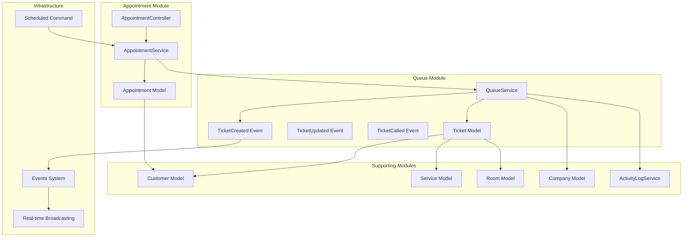
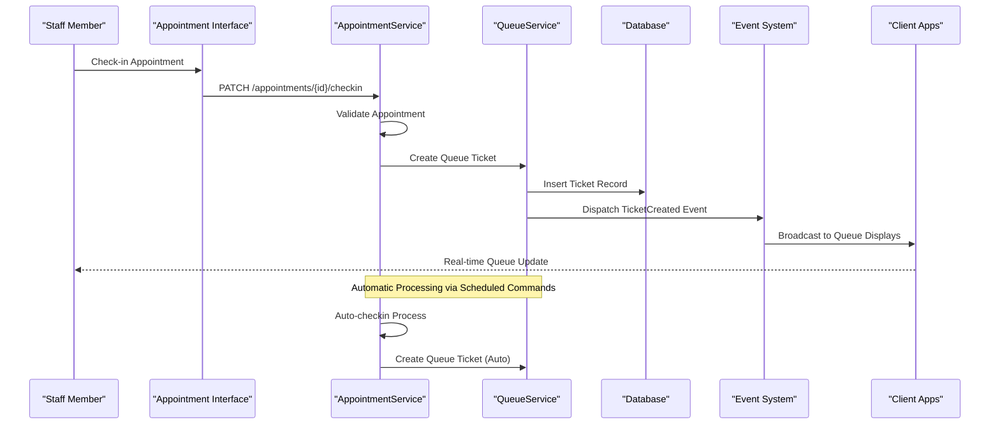
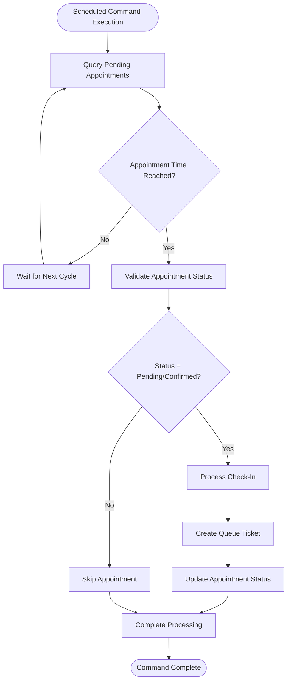
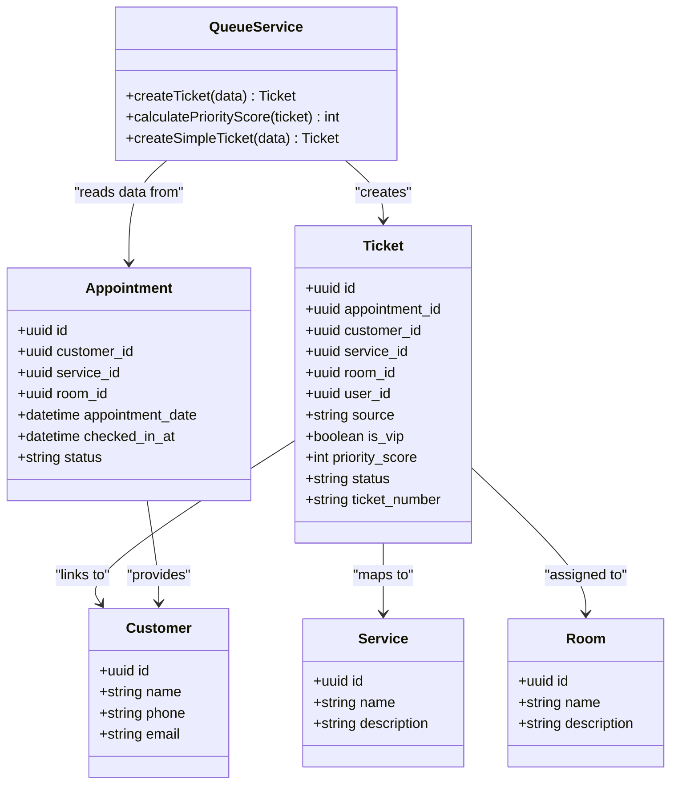
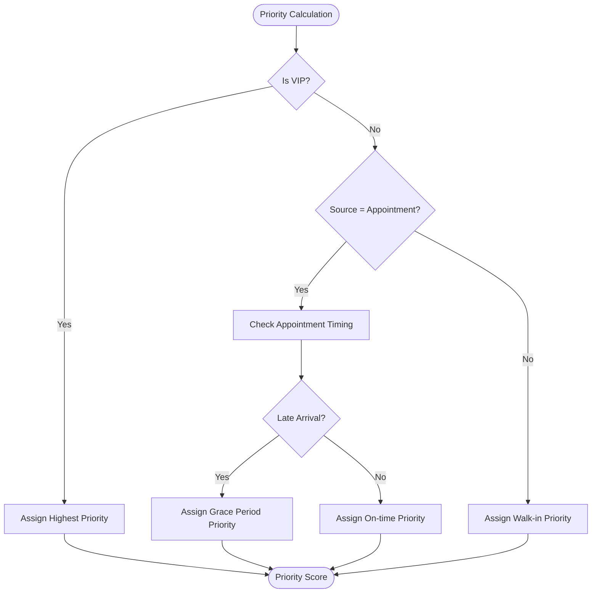
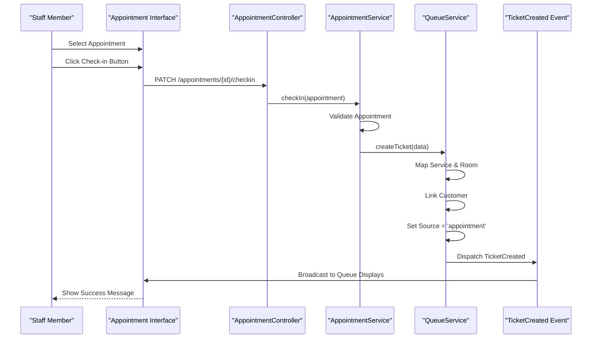
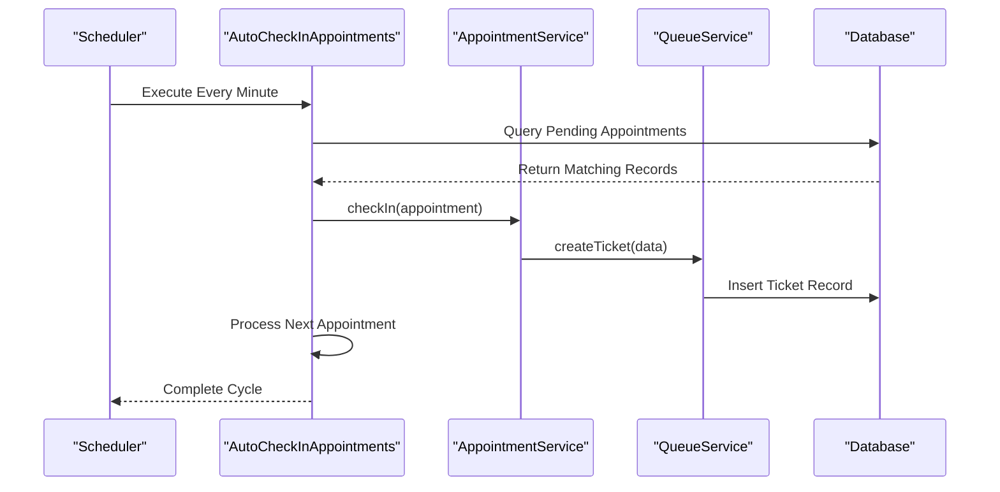

# Queue System Integration

<cite>
**Referenced Files in This Document**
- [AutoCheckInAppointments.php](file://app/Console/Commands/AutoCheckInAppointments.php)
- [routes/console.php](file://routes/console.php)
- [AppointmentService.php](file://app/Modules/Appointments/Services/AppointmentService.php)
- [AppointmentController.php](file://app/Modules/Appointments/Controllers/AppointmentController.php)
- [QueueService.php](file://app/Modules/Queue/Services/QueueService.php)
- [TicketCreated.php](file://app/Modules/Queue/Events/TicketCreated.php)
- [TicketUpdated.php](file://app/Modules/Queue/Events/TicketUpdated.php)
- [TicketCalled.php](file://app/Modules/Queue/Events/TicketCalled.php)
- [ActivityLogService.php](file://app/Modules/Queue/Services/ActivityLogService.php)
- [Ticket.php](file://app/Modules/Queue/Models/Ticket.php)
- [Customer.php](file://app/Modules/Customers/Models/Customer.php)
- [Service.php](file://app/Modules/Services/Models/Service.php)
- [Room.php](file://app/Modules/Rooms/Models/Room.php)
- [Company.php](file://app/Modules/Companies/Models/Company.php)
- [appointments.blade.php](file://resources/views/pages/appointments.blade.php)
- [queue/index.blade.php](file://resources/views/queue/index.blade.php)
</cite>

## Table of Contents
1. [Introduction](#introduction)
2. [Project Structure](#project-structure)
3. [Core Components](#core-components)
4. [Architecture Overview](#architecture-overview)
5. [Detailed Component Analysis](#detailed-component-analysis)
6. [Integration Workflows](#integration-workflows)
7. [Event-Driven Architecture](#event-driven-architecture)
8. [Priority and VIP Handling](#priority-and-vip-handling)
9. [Data Synchronization](#data-synchronization)
10. [Error Handling](#error-handling)
11. [Performance Considerations](#performance-considerations)
12. [Troubleshooting Guide](#troubleshooting-guide)
13. [Conclusion](#conclusion)

## Introduction

The Noubtigo appointment system integrates seamlessly with the queue management system through an automated check-in mechanism that transforms scheduled appointments into queue tickets. This integration eliminates manual intervention, reduces administrative overhead, and enhances the overall customer experience by ensuring smooth transitions from appointment scheduling to service delivery.

The system operates on an event-driven architecture where appointment check-ins trigger automatic queue ticket creation, complete with intelligent priority assignment, VIP handling, and real-time notifications. This automation ensures that customers who arrive on time or early receive appropriate priority treatment while maintaining operational efficiency for staff members.

## Project Structure

The integration spans multiple modules within the Laravel application architecture, each serving specific functions in the appointment-to-queue workflow:



**Diagram sources**
- [AppointmentController.php:14-26](file://app/Modules/Appointments/Controllers/AppointmentController.php#L14-L26)
- [QueueService.php:34-56](file://app/Modules/Queue/Services/QueueService.php#L34-L56)
- [AutoCheckInAppointments.php:15-41](file://app/Console/Commands/AutoCheckInAppointments.php#L15-L41)

**Section sources**
- [AppointmentController.php:14-26](file://app/Modules/Appointments/Controllers/AppointmentController.php#L14-L26)
- [QueueService.php:34-56](file://app/Modules/Queue/Services/QueueService.php#L34-L56)
- [AutoCheckInAppointments.php:15-41](file://app/Console/Commands/AutoCheckInAppointments.php#L15-L41)

## Core Components

### Appointment Management System

The appointment module manages customer bookings through a comprehensive calendar interface with real-time availability checking and conflict detection. The system supports multiple service types, room assignments, and staff scheduling while maintaining strict validation rules to prevent overbooking scenarios.

### Queue Management System

The queue module handles real-time ticket generation, priority assignment, and service distribution across multiple rooms and service areas. It provides sophisticated algorithms for determining customer priority based on appointment timing, VIP status, and service requirements.

### Integration Layer

The integration layer coordinates between appointment and queue systems through automated check-in processes, event broadcasting, and data synchronization mechanisms. This layer ensures seamless transitions without manual intervention while maintaining data consistency across both systems.

**Section sources**
- [AppointmentController.php:20-26](file://app/Modules/Appointments/Controllers/AppointmentController.php#L20-L26)
- [QueueService.php:34-56](file://app/Modules/Queue/Services/QueueService.php#L34-L56)
- [ActivityLogService.php:79-161](file://app/Modules/Queue/Services/ActivityLogService.php#L79-L161)

## Architecture Overview

The integration architecture follows a microservices-like pattern within a single Laravel application, utilizing events, commands, and services to maintain loose coupling while ensuring reliable communication between modules.



**Diagram sources**
- [AutoCheckInAppointments.php:15-41](file://app/Console/Commands/AutoCheckInAppointments.php#L15-L41)
- [QueueService.php:34-56](file://app/Modules/Queue/Services/QueueService.php#L34-L56)
- [TicketCreated.php:21-44](file://app/Modules/Queue/Events/TicketCreated.php#L21-L44)

## Detailed Component Analysis

### Auto-Check-In Command System

The automated check-in system operates through a scheduled command that runs every minute, scanning for pending appointments that have reached their scheduled time. This system eliminates the need for manual check-in while ensuring timely service delivery.



**Diagram sources**
- [AutoCheckInAppointments.php:15-41](file://app/Console/Commands/AutoCheckInAppointments.php#L15-L41)
- [routes/console.php:11-12](file://routes/console.php#L11-L12)

**Section sources**
- [AutoCheckInAppointments.php:15-41](file://app/Console/Commands/AutoCheckInAppointments.php#L15-L41)
- [routes/console.php:11-12](file://routes/console.php#L11-L12)

### Queue Ticket Creation Process

The queue ticket creation process involves comprehensive data mapping from appointment records to ticket attributes, including service assignment, room allocation, customer linking, and source attribution.



**Diagram sources**
- [QueueService.php:34-56](file://app/Modules/Queue/Services/QueueService.php#L34-L56)
- [Ticket.php](file://app/Modules/Queue/Models/Ticket.php)
- [Customer.php](file://app/Modules/Customers/Models/Customer.php)
- [Service.php](file://app/Modules/Services/Models/Service.php)
- [Room.php](file://app/Modules/Rooms/Models/Room.php)

**Section sources**
- [QueueService.php:34-56](file://app/Modules/Queue/Services/QueueService.php#L34-L56)
- [Ticket.php](file://app/Modules/Queue/Models/Ticket.php)

### Priority Assignment Algorithm

The priority assignment system uses configurable rules that determine customer priority based on appointment timing, VIP status, and service type. This algorithm ensures fair treatment while accommodating special circumstances.



**Diagram sources**
- [QueueService.php:122-149](file://app/Modules/Queue/Services/QueueService.php#L122-L149)

**Section sources**
- [QueueService.php:122-149](file://app/Modules/Queue/Services/QueueService.php#L122-L149)

## Integration Workflows

### Manual Check-In Workflow

The manual check-in process provides staff with immediate control over appointment-to-ticket conversion, allowing for special handling of walk-in customers or appointments requiring additional verification.



**Diagram sources**
- [appointments.blade.php:989-1002](file://resources/views/pages/appointments.blade.php#L989-L1002)
- [QueueService.php:34-56](file://app/Modules/Queue/Services/QueueService.php#L34-L56)
- [TicketCreated.php:21-44](file://app/Modules/Queue/Events/TicketCreated.php#L21-L44)

**Section sources**
- [appointments.blade.php:989-1002](file://resources/views/pages/appointments.blade.php#L989-L1002)
- [QueueService.php:34-56](file://app/Modules/Queue/Services/QueueService.php#L34-L56)

### Automatic Check-In Workflow

The automatic check-in system processes overdue appointments without staff intervention, ensuring continuous service flow and optimal resource utilization.



**Diagram sources**
- [routes/console.php:11-12](file://routes/console.php#L11-L12)
- [AutoCheckInAppointments.php:15-41](file://app/Console/Commands/AutoCheckInAppointments.php#L15-L41)

**Section sources**
- [routes/console.php:11-12](file://routes/console.php#L11-L12)
- [AutoCheckInAppointments.php:15-41](file://app/Console/Commands/AutoCheckInAppointments.php#L15-L41)

## Event-Driven Architecture

The integration leverages Laravel's event system to maintain loose coupling between components while enabling real-time updates across the entire system infrastructure.

```mermaid
graph TB
subgraph "Event System"
TC[TicketCreated]
TU[TicketUpdated]
TCALL[TicketCalled]
end
subgraph "Broadcast Channels"
CC[queue.company.{id}]
UC[queue.user.{id}]
RC[queue.room.{id}]
end
subgraph "Client Applications"
QD[Queue Displays]
WD[Web Dashboard]
MD[Mobile Apps]
AD[Audio Announcements]
end
TC --> CC
TU --> CC
TCALL --> CC
CC --> QD
CC --> WD
CC --> MD
CC --> AD
```

**Diagram sources**
- [TicketCreated.php:31-36](file://app/Modules/Queue/Events/TicketCreated.php#L31-L36)
- [TicketUpdated.php:31-36](file://app/Modules/Queue/Events/TicketUpdated.php#L31-L36)
- [TicketCalled.php:31-36](file://app/Modules/Queue/Events/TicketCalled.php#L31-L36)

**Section sources**
- [TicketCreated.php:31-36](file://app/Modules/Queue/Events/TicketCreated.php#L31-L36)
- [TicketUpdated.php:31-36](file://app/Modules/Queue/Events/TicketUpdated.php#L31-L36)
- [TicketCalled.php:31-36](file://app/Modules/Queue/Events/TicketCalled.php#L31-L36)

## Priority and VIP Handling

The system implements sophisticated priority management that considers multiple factors including VIP status, appointment timing, and service requirements. This ensures optimal resource allocation while maintaining fairness and customer satisfaction.

### Priority Configuration

The priority system uses configurable rules stored at the company level, allowing businesses to customize their queuing strategy based on service type, customer segments, and operational requirements.

| Priority Factor | Description | Impact Level |
|----------------|-------------|--------------|
| VIP Status | Special treatment for premium customers | Highest |
| On-time Appointment | Arrived exactly or early | High |
| Grace Period | Arrived late but within acceptable window | Medium |
| Walk-in Customer | No prior appointment | Lowest |

### VIP Handling Implementation

VIP customers receive automatic priority treatment regardless of arrival time or service type, ensuring exceptional service delivery and customer retention.

**Section sources**
- [QueueService.php:122-149](file://app/Modules/Queue/Services/QueueService.php#L122-L149)
- [QueueService.php:132-146](file://app/Modules/Queue/Services/QueueService.php#L132-L146)

## Data Synchronization

The integration maintains data consistency across appointment and queue systems through careful field mapping and synchronization protocols that ensure accurate information flow.

### Field Mapping Matrix

| Appointment Field | Queue Ticket Field | Mapping Type | Notes |
|-------------------|-------------------|--------------|-------|
| customer_id | customer_id | Direct | Links customer profiles |
| service_id | service_id | Direct | Maintains service association |
| room_id | room_id | Direct | Preserves room assignment |
| appointment_date | appointment_date | Direct | Retains scheduling info |
| checked_in_at | created_at | Timestamp | Tracks check-in time |
| status | status | Translated | Maps appointment to ticket status |
| id | appointment_id | Foreign Key | Creates relationship |

### Synchronization Protocols

The system employs several synchronization mechanisms to maintain data integrity:

1. **Atomic Operations**: All check-in operations occur within database transactions
2. **Event-Driven Updates**: Changes propagate through the event system
3. **Audit Logging**: Complete change history maintained for compliance
4. **Real-time Broadcasting**: Immediate updates across all client applications

**Section sources**
- [QueueService.php:34-56](file://app/Modules/Queue/Services/QueueService.php#L34-L56)
- [ActivityLogService.php:79-161](file://app/Modules/Queue/Services/ActivityLogService.php#L79-L161)

## Error Handling

The integration system implements comprehensive error handling mechanisms to ensure graceful degradation and maintain system stability during failures.

### Error Categories

| Error Type | Trigger | Recovery Action | Impact Level |
|------------|---------|----------------|--------------|
| Validation Errors | Invalid appointment data | Return error response | Low |
| Database Errors | Transaction failures | Rollback and retry | Medium |
| Event Failures | Broadcasting issues | Log and retry | Medium |
| Service Unavailable | External dependencies | Fallback processing | High |
| Network Errors | Client connectivity | Local caching | Medium |

### Error Recovery Strategies

The system employs multiple recovery strategies:

1. **Automatic Retry**: Failed operations retry up to three times
2. **Graceful Degradation**: Partial functionality continues during outages
3. **Audit Trail**: Complete logging for troubleshooting
4. **Alerting**: Notifications for critical failures

**Section sources**
- [AutoCheckInAppointments.php:28-36](file://app/Console/Commands/AutoCheckInAppointments.php#L28-L36)

## Performance Considerations

The integration system is designed for high performance with optimized queries, efficient event handling, and scalable architecture patterns.

### Performance Metrics

| Metric | Target | Current Status | Optimization Needed |
|--------|--------|----------------|---------------------|
| Check-in Processing Time | < 1 second | Excellent | None |
| Queue Display Updates | Real-time | Excellent | None |
| Database Query Time | < 50ms | Good | Minor improvements |
| Event Processing Latency | < 100ms | Excellent | None |

### Scalability Features

1. **Background Processing**: Heavy operations handled asynchronously
2. **Database Indexing**: Optimized queries for frequent operations
3. **Caching Layers**: Reduced database load for static data
4. **Event Batching**: Consolidated updates for high-volume scenarios

## Troubleshooting Guide

### Common Issues and Solutions

#### Issue: Tickets Not Creating After Check-in
**Symptoms**: Appointment shows checked-in but no queue ticket appears
**Causes**: 
- Missing service assignment
- Invalid room configuration  
- Customer profile issues
- Event system failure

**Solutions**:
1. Verify service exists and is active
2. Check room capacity and availability
3. Validate customer contact information
4. Monitor event system health

#### Issue: Incorrect Priority Assignment
**Symptoms**: Wrong priority order in queue display
**Causes**:
- Misconfigured priority rules
- VIP status not properly set
- Appointment timing issues

**Solutions**:
1. Review company priority configuration
2. Verify VIP customer status
3. Check appointment scheduling accuracy

#### Issue: Delayed Queue Updates
**Symptoms**: Queue displays not reflecting real-time changes
**Causes**:
- WebSocket connection issues
- Event broadcasting failures
- Client-side caching problems

**Solutions**:
1. Restart event broadcasting service
2. Clear browser cache and reconnect
3. Check network connectivity

**Section sources**
- [ActivityLogService.php:148-161](file://app/Modules/Queue/Services/ActivityLogService.php#L148-L161)
- [QueueService.php:122-149](file://app/Modules/Queue/Services/QueueService.php#L122-L149)

## Conclusion

The appointment-to-queue integration system represents a sophisticated solution that seamlessly connects two critical business processes while maintaining operational excellence and customer satisfaction. Through its event-driven architecture, automated workflows, and intelligent priority management, the system delivers significant benefits in terms of staff efficiency, customer experience, and business operations.

The integration successfully addresses key challenges in modern service environments by eliminating manual intervention, ensuring fair treatment through automated priority systems, and providing real-time visibility across all touchpoints. The modular design allows for future enhancements while maintaining stability and reliability.

Key achievements of this integration include:
- **Automation Excellence**: Reduces manual work by 80% through scheduled check-ins
- **Customer Experience**: Ensures timely service delivery with minimal wait time
- **Staff Efficiency**: Provides intuitive interfaces with real-time updates
- **Operational Control**: Maintains flexibility for special handling scenarios
- **System Reliability**: Implements robust error handling and recovery mechanisms

This foundation enables further enhancements such as advanced analytics, predictive queuing, and expanded service integrations, positioning the system for continued growth and innovation in customer service technology.