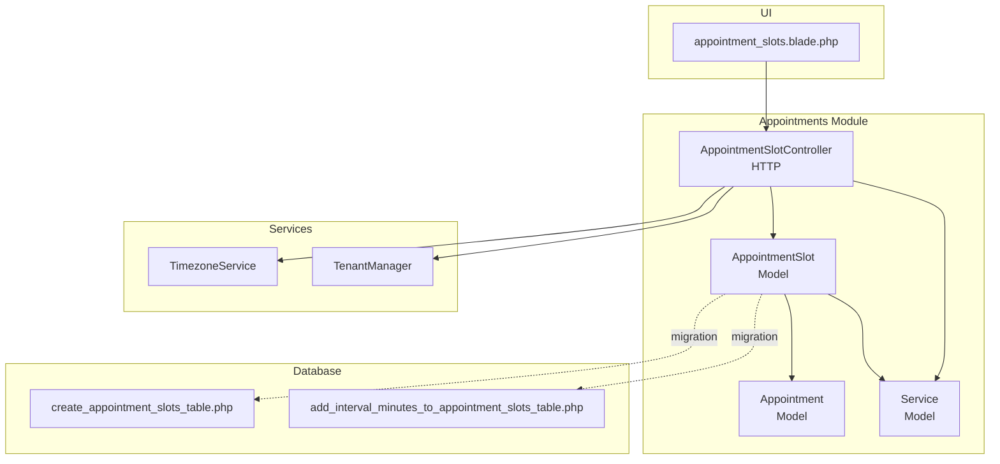
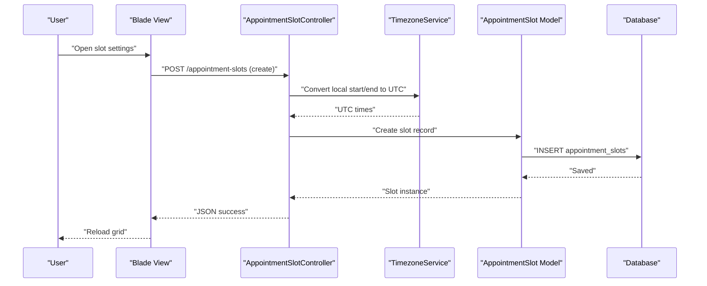
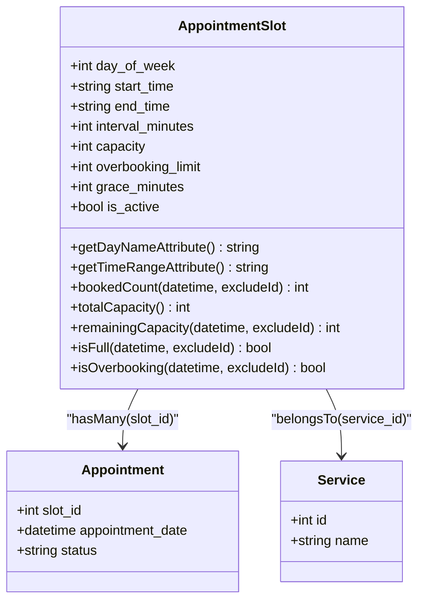
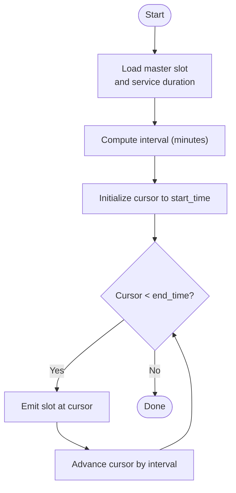
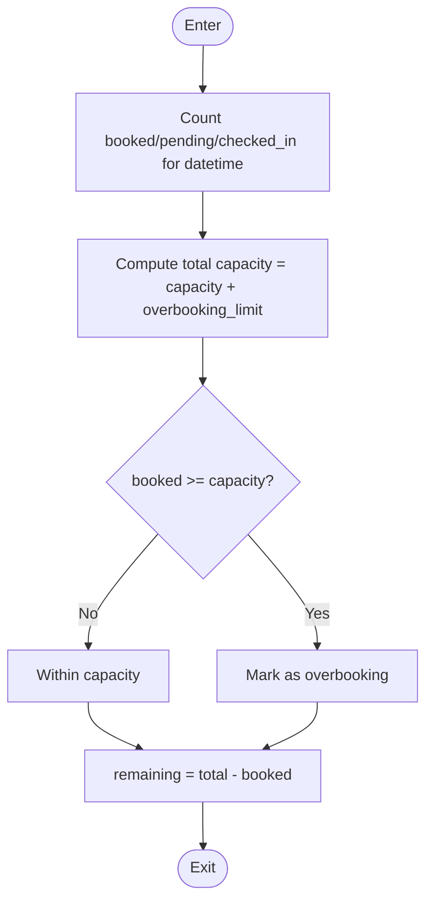
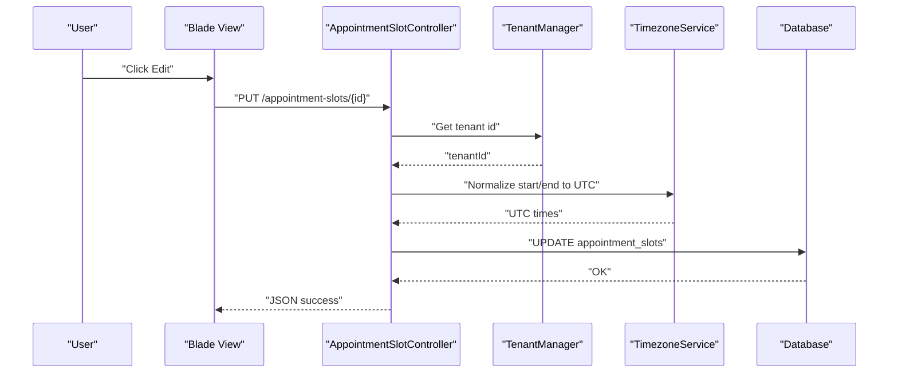
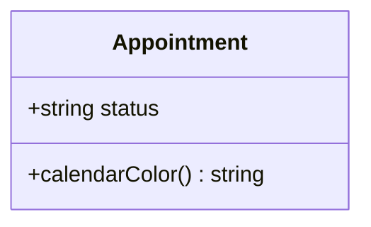
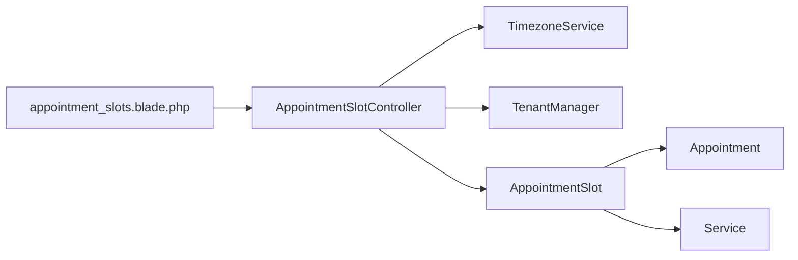

# Slot Management

<cite>
**Referenced Files in This Document**
- [AppointmentSlot.php](file://app\Modules\Appointments\Models\AppointmentSlot.php)
- [AppointmentSlotController.php](file://app\Modules\Appointments\Controllers\AppointmentSlotController.php)
- [create_appointment_slots_table.php](file://database\migrations\2026_04_06_200001_create_appointment_slots_table.php)
- [add_interval_minutes_to_appointment_slots_table.php](file://database\migrations\2026_04_07_173852_add_interval_minutes_to_appointment_slots_table.php)
- [appointment_slots.blade.php](file://resources\views\pages\appointment_slots.blade.php)
- [Appointment.php](file://app\Modules\Appointments\Models\Appointment.php)
- [Service.php](file://app\Modules\Services\Models\Service.php)
- [TimezoneService.php](file://app\Services\TimezoneService.php)
- [TenantManager.php](file://app\Services\TenantManager.php)
</cite>

## Table of Contents
1. [Introduction](#introduction)
2. [Project Structure](#project-structure)
3. [Core Components](#core-components)
4. [Architecture Overview](#architecture-overview)
5. [Detailed Component Analysis](#detailed-component-analysis)
6. [Dependency Analysis](#dependency-analysis)
7. [Performance Considerations](#performance-considerations)
8. [Troubleshooting Guide](#troubleshooting-guide)
9. [Conclusion](#conclusion)
10. [Appendices](#appendices)

## Introduction
This document describes the Slot Management system used to configure and manage time slots for appointments. It covers the AppointmentSlot model architecture, capacity and overbooking controls, interval minutes, day-of-week scheduling, slot generation and availability checks, administrative controller operations, and integration with the calendar rendering pipeline via FullCalendar-compatible event attributes.

## Project Structure
The Slot Management system spans models, controllers, migrations, and a Blade view for administration. The primary domain is under the Appointments module, with supporting services for timezone handling and tenant scoping.

**Diagram sources**
- [AppointmentSlot.php:1-111](file://app\Modules\Appointments\Models\AppointmentSlot.php#L1-L111)
- [AppointmentSlotController.php:1-122](file://app\Modules\Appointments\Controllers\AppointmentSlotController.php#L1-L122)
- [create_appointment_slots_table.php:1-33](file://database\migrations\2026_04_06_200001_create_appointment_slots_table.php#L1-L33)
- [add_interval_minutes_to_appointment_slots_table.php:1-29](file://database\migrations\2026_04_07_173852_add_interval_minutes_to_appointment_slots_table.php#L1-L29)
- [appointment_slots.blade.php:1-334](file://resources\views\pages\appointment_slots.blade.php#L1-L334)
- [TimezoneService.php](file://app\Services\TimezoneService.php)
- [TenantManager.php](file://app\Services\TenantManager.php)

**Section sources**
- [AppointmentSlot.php:1-111](file://app\Modules\Appointments\Models\AppointmentSlot.php#L1-L111)
- [AppointmentSlotController.php:1-122](file://app\Modules\Appointments\Controllers\AppointmentSlotController.php#L1-L122)
- [create_appointment_slots_table.php:1-33](file://database\migrations\2026_04_06_200001_create_appointment_slots_table.php#L1-L33)
- [add_interval_minutes_to_appointment_slots_table.php:1-29](file://database\migrations\2026_04_07_173852_add_interval_minutes_to_appointment_slots_table.php#L1-L29)
- [appointment_slots.blade.php:1-334](file://resources\views\pages\appointment_slots.blade.php#L1-L334)

## Core Components
- AppointmentSlot model encapsulates master slot configuration, capacity, overbooking, intervals, and day-of-week scheduling. It exposes helpers for capacity calculation and availability checks.
- AppointmentSlotController handles administrative CRUD operations, validates inputs, converts timezones, and ensures tenant scoping.
- Database migrations define the schema for slots, including capacity, overbooking, grace minutes, and interval minutes.
- Blade view renders the slot administration UI with filtering and forms for adding/editing slots.
- Related models: Appointment and Service support relationships and UI rendering.

**Section sources**
- [AppointmentSlot.php:13-32](file://app\Modules\Appointments\Models\AppointmentSlot.php#L13-L32)
- [AppointmentSlotController.php:39-73](file://app\Modules\Appointments\Controllers\AppointmentSlotController.php#L39-L73)
- [create_appointment_slots_table.php:11-25](file://database\migrations\2026_04_06_200001_create_appointment_slots_table.php#L11-L25)
- [add_interval_minutes_to_appointment_slots_table.php:12-16](file://database\migrations\2026_04_07_173852_add_interval_minutes_to_appointment_slots_table.php#L12-L16)
- [appointment_slots.blade.php:41-109](file://resources\views\pages\appointment_slots.blade.php#L41-L109)

## Architecture Overview
The system separates concerns across model, controller, view, and database layers. Administrative actions originate from the UI, pass through the controller with validation and timezone normalization, persist to the database, and are rendered in the UI. Availability checks leverage the model’s capacity helpers.

**Diagram sources**
- [appointment_slots.blade.php:230-253](file://resources\views\pages\appointment_slots.blade.php#L230-L253)
- [AppointmentSlotController.php:39-73](file://app\Modules\Appointments\Controllers\AppointmentSlotController.php#L39-L73)
- [TimezoneService.php](file://app\Services\TimezoneService.php)

## Detailed Component Analysis

### AppointmentSlot Model
The model defines fillable attributes, casts, and helper methods for capacity and availability. It also computes human-friendly time ranges using the company timezone.

Key capabilities:
- Capacity limits: capacity and overbooking_limit define hard and soft capacity ceilings.
- Overbooking threshold: isOverbooking determines if capacity is exceeded.
- Interval minutes: interval_minutes drives slot generation frequency.
- Day-of-week scheduling: day_of_week supports recurring weekly schedules.
- Availability helpers: bookedCount, totalCapacity, remainingCapacity, isFull.

**Diagram sources**
- [AppointmentSlot.php:9-111](file://app\Modules\Appointments\Models\AppointmentSlot.php#L9-L111)
- [Appointment.php:69-72](file://app\Modules\Appointments\Models\Appointment.php#L69-L72)
- [Service.php:52-59](file://app\Modules\Services\Models\Service.php#L52-L59)

**Section sources**
- [AppointmentSlot.php:26-32](file://app\Modules\Appointments\Models\AppointmentSlot.php#L26-L32)
- [AppointmentSlot.php:68-108](file://app\Modules\Appointments\Models\AppointmentSlot.php#L68-L108)

### Slot Generation Algorithm
Slots are generated from master slot configurations. The generator uses the master slot’s interval_minutes (or service duration if missing) to produce evenly spaced time blocks within the configured start_time and end_time window. This produces a sequence of discrete slot times aligned to the interval.

**Diagram sources**
- [AppointmentSlot.php:18](file://app\Modules\Appointments\Models\AppointmentSlot.php#L18)
- [appointment_slots.blade.php:156](file://resources\views\pages\appointment_slots.blade.php#L156)

**Section sources**
- [AppointmentSlot.php:18](file://app\Modules\Appointments\Models\AppointmentSlot.php#L18)
- [appointment_slots.blade.php:156](file://resources\views\pages\appointment_slots.blade.php#L156)

### Availability Checking and Capacity Calculations
Availability is computed per exact datetime. The model counts confirmed/pending/checked-in bookings and compares against total capacity (capacity + overbooking_limit). Remaining space is derived by subtracting booked count from total capacity, with floor at zero.

**Diagram sources**
- [AppointmentSlot.php:68-108](file://app\Modules\Appointments\Models\AppointmentSlot.php#L68-L108)

**Section sources**
- [AppointmentSlot.php:68-108](file://app\Modules\Appointments\Models\AppointmentSlot.php#L68-L108)

### Slot Controller Operations
Administrative operations:
- Index: Lists slots scoped to the current tenant, with service relations.
- Store: Validates inputs (days_of_week, times, interval), normalizes to UTC using TimezoneService, and creates one slot per selected day.
- Update: Partial updates with optional field validation; normalizes start/end to UTC when provided.
- Destroy: Deletes a slot after tenant authorization.

Authorization ensures the requested slot belongs to the current tenant.

**Diagram sources**
- [appointment_slots.blade.php:267-293](file://resources\views\pages\appointment_slots.blade.php#L267-L293)
- [AppointmentSlotController.php:77-100](file://app\Modules\Appointments\Controllers\AppointmentSlotController.php#L77-L100)
- [TenantManager.php](file://app\Services\TenantManager.php)
- [TimezoneService.php](file://app\Services\TimezoneService.php)

**Section sources**
- [AppointmentSlotController.php:21-35](file://app\Modules\Appointments\Controllers\AppointmentSlotController.php#L21-L35)
- [AppointmentSlotController.php:39-73](file://app\Modules\Appointments\Controllers\AppointmentSlotController.php#L39-L73)
- [AppointmentSlotController.php:77-100](file://app\Modules\Appointments\Controllers\AppointmentSlotController.php#L77-L100)
- [AppointmentSlotController.php:104-110](file://app\Modules\Appointments\Controllers\AppointmentSlotController.php#L104-L110)
- [AppointmentSlotController.php:114-120](file://app\Modules\Appointments\Controllers\AppointmentSlotController.php#L114-L120)

### Calendar Integration (FullCalendar Compatibility)
Appointments expose a calendarColor helper used by calendar renderers. The Appointment model provides a color mapping per status, enabling FullCalendar event rendering with distinct colors for statuses such as confirmed, pending, checked_in, completed, cancelled, and no_show.

**Diagram sources**
- [Appointment.php:168-181](file://app\Modules\Appointments\Models\Appointment.php#L168-L181)

**Section sources**
- [Appointment.php:168-181](file://app\Modules\Appointments\Models\Appointment.php#L168-L181)

### Examples and Patterns
- Peak hour management: Configure shorter interval_minutes during busy hours to increase density; set lower capacity or modest overbooking_limit to prevent saturation.
- Multi-service slot sharing: Assign multiple services to the same slot configuration to enable shared resource scheduling; use the UI filter to inspect per-service allocations.
- Timezone alignment: Use the controller’s UTC conversion to ensure consistent storage regardless of user or company timezone.

**Section sources**
- [AppointmentSlotController.php:55-69](file://app\Modules\Appointments\Controllers\AppointmentSlotController.php#L55-L69)
- [appointment_slots.blade.php:55-65](file://resources\views\pages\appointment_slots.blade.php#L55-L65)

## Dependency Analysis
- AppointmentSlot depends on TimezoneService for converting times and on the TenantManager for tenant scoping.
- AppointmentSlot relates to Appointment and Service models.
- The UI depends on the controller endpoints and the model’s attribute accessors for display.

**Diagram sources**
- [AppointmentSlotController.php:13-18](file://app\Modules\Appointments\Controllers\AppointmentSlotController.php#L13-L18)
- [AppointmentSlot.php:45-51](file://app\Modules\Appointments\Models\AppointmentSlot.php#L45-L51)
- [appointment_slots.blade.php:41-109](file://resources\views\pages\appointment_slots.blade.php#L41-L109)

**Section sources**
- [AppointmentSlotController.php:13-18](file://app\Modules\Appointments\Controllers\AppointmentSlotController.php#L13-L18)
- [AppointmentSlot.php:45-51](file://app\Modules\Appointments\Models\AppointmentSlot.php#L45-L51)
- [appointment_slots.blade.php:41-109](file://resources\views\pages\appointment_slots.blade.php#L41-L109)

## Performance Considerations
- Prefer indexed queries on company_id, service_id, and day_of_week to optimize slot retrieval.
- Use targeted slot queries with exact datetime comparisons for availability checks to minimize scans.
- Normalize times to UTC at input to avoid per-record timezone conversions during reads.
- Batch operations for multi-day slot creation reduce round trips.

## Troubleshooting Guide
Common issues and resolutions:
- Incorrect time zone: Ensure inputs are normalized to UTC using TimezoneService before persistence.
- Tenant mismatch: Authorization prevents editing/deleting slots outside the current tenant scope.
- Overbooking confusion: Verify capacity vs. overbooking_limit; isOverbooking indicates when booked count reaches capacity.
- UI filters: Use the service filter to isolate slots for a given service.

**Section sources**
- [AppointmentSlotController.php:114-120](file://app\Modules\Appointments\Controllers\AppointmentSlotController.php#L114-L120)
- [AppointmentSlot.php:100-108](file://app\Modules\Appointments\Models\AppointmentSlot.php#L100-L108)
- [appointment_slots.blade.php:310-315](file://resources\views\pages\appointment_slots.blade.php#L310-L315)

## Conclusion
The Slot Management system provides a robust foundation for configuring recurring weekly slots, enforcing capacity and overbooking policies, generating time blocks via interval minutes, and integrating with calendar renderers. Administrative controls are secure and timezone-aware, while availability checks are efficient and predictable.

## Appendices

### Database Schema Summary
- appointment_slots: company_id, service_id, day_of_week, start_time, end_time, interval_minutes, capacity, overbooking_limit, grace_minutes, is_active, timestamps; indexed on (company_id, service_id, day_of_week).

**Section sources**
- [create_appointment_slots_table.php:11-25](file://database\migrations\2026_04_06_200001_create_appointment_slots_table.php#L11-L25)
- [add_interval_minutes_to_appointment_slots_table.php:12-16](file://database\migrations\2026_04_07_173852_add_interval_minutes_to_appointment_slots_table.php#L12-L16)