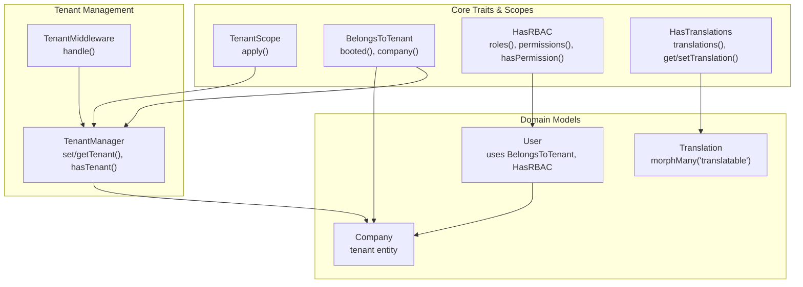
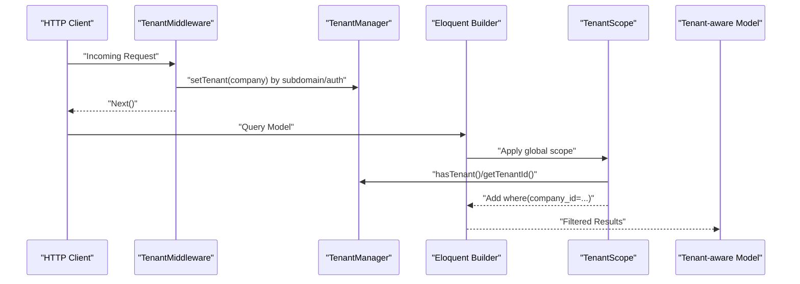
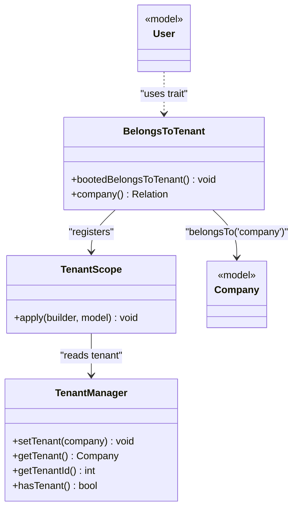
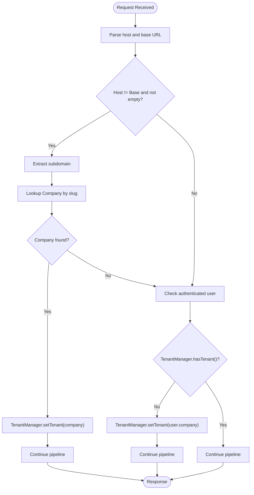
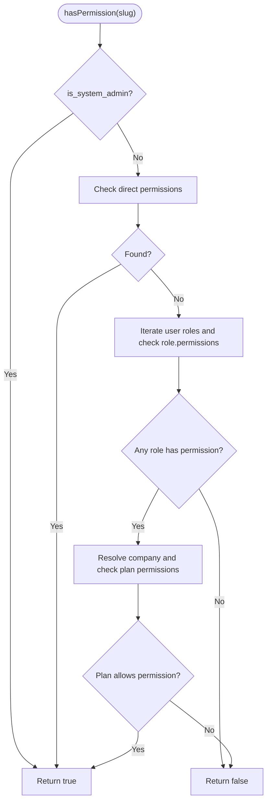
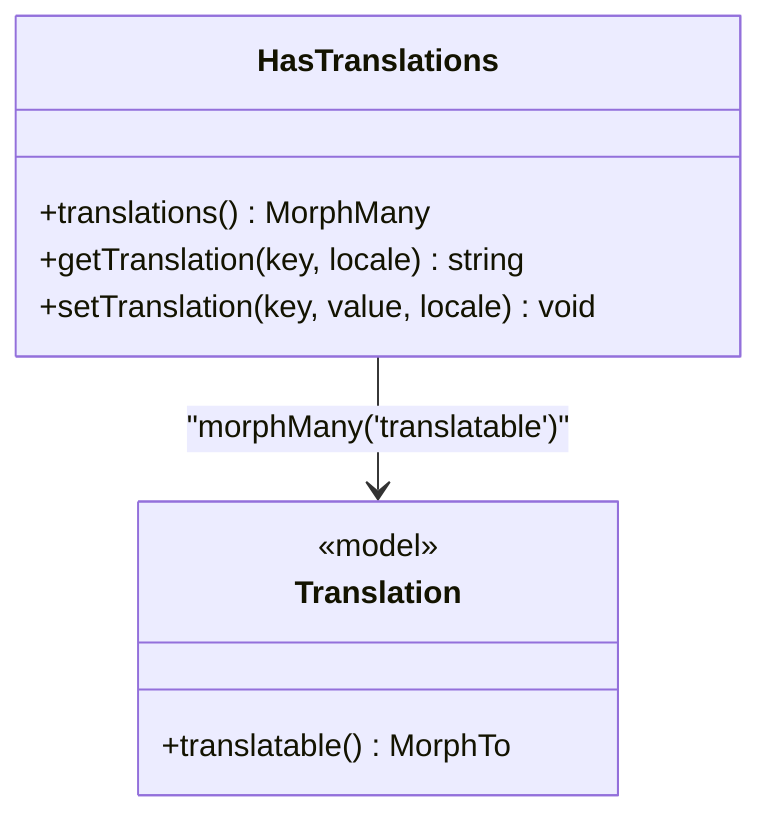
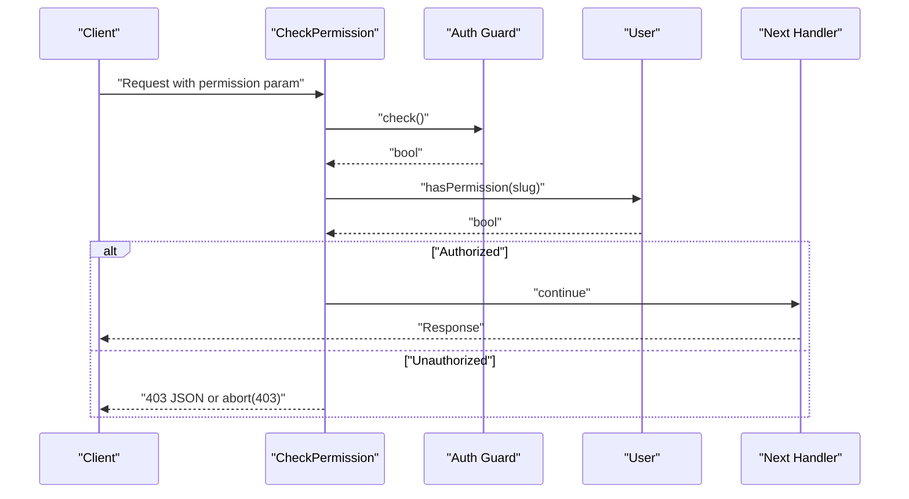
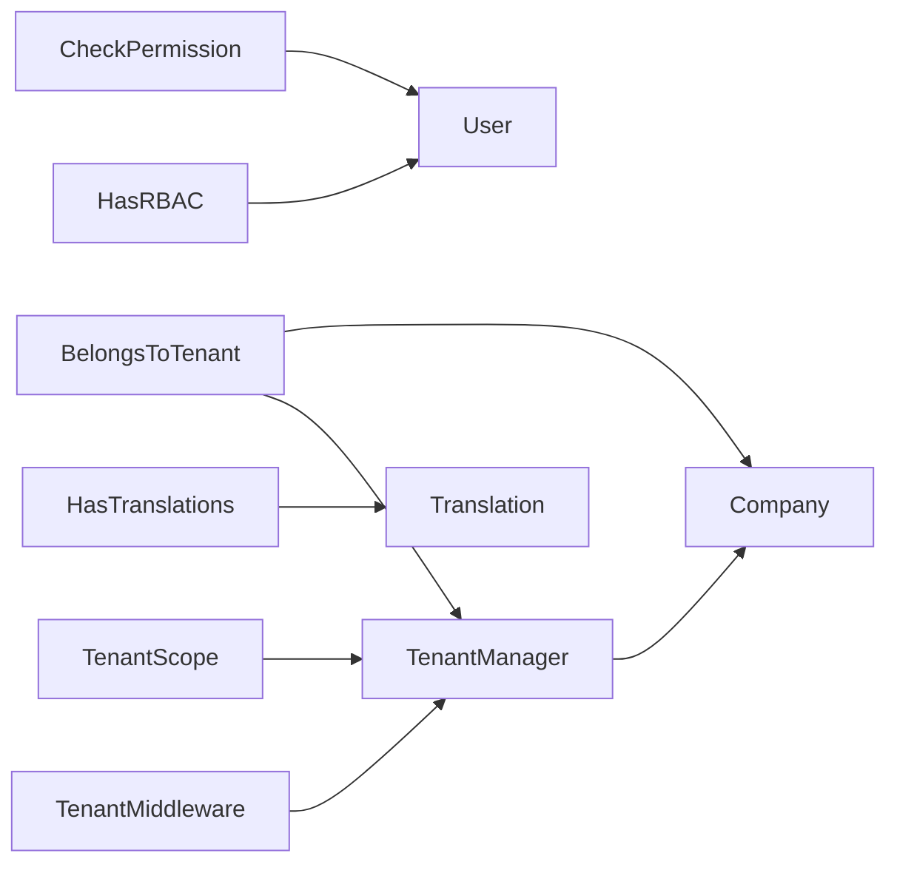

# Core Infrastructure

<cite>
**Referenced Files in This Document**
- [TenantScope.php](file://app/Modules/Core/Scopes/TenantScope.php)
- [BelongsToTenant.php](file://app/Modules/Core/Traits/BelongsToTenant.php)
- [HasRBAC.php](file://app/Modules/Core/Traits/HasRBAC.php)
- [HasTranslations.php](file://app/Modules/Core/Traits/HasTranslations.php)
- [TenantManager.php](file://app/Services/TenantManager.php)
- [TenantMiddleware.php](file://app/Http/Middleware/TenantMiddleware.php)
- [CheckPermission.php](file://app/Http/Middleware/CheckPermission.php)
- [User.php](file://app/Models/User.php)
- [Translation.php](file://app/Models/Translation.php)
- [Company.php](file://app/Modules/Companies/Models/Company.php)
</cite>

## Table of Contents
1. [Introduction](#introduction)
2. [Project Structure](#project-structure)
3. [Core Components](#core-components)
4. [Architecture Overview](#architecture-overview)
5. [Detailed Component Analysis](#detailed-component-analysis)
6. [Dependency Analysis](#dependency-analysis)
7. [Performance Considerations](#performance-considerations)
8. [Troubleshooting Guide](#troubleshooting-guide)
9. [Conclusion](#conclusion)
10. [Appendices](#appendices)

## Introduction
This document explains the Core Infrastructure module that underpins multi-tenancy, permissions, localization, and shared patterns across all application modules. It focuses on:
- Multi-tenant database filtering and tenant isolation via TenantScope and BelongsToTenant
- Tenant-aware model relationships and automatic tenant assignment
- Role-Based Access Control (RBAC) integration for users
- Multi-language support through HasTranslations and Translation model
- Tenant context management via TenantManager and middleware integration
- Common patterns for service layer abstraction, event handling, and middleware integration

## Project Structure
The Core Infrastructure spans three primary areas:
- Traits and Scopes under Core for cross-cutting concerns
- TenantManager service for runtime tenant context
- Middleware for tenant identification and permission enforcement

**Diagram sources**
- [TenantScope.php:18-32](file://app/Modules/Core/Scopes/TenantScope.php#L18-L32)
- [BelongsToTenant.php:15-33](file://app/Modules/Core/Traits/BelongsToTenant.php#L15-L33)
- [HasRBAC.php:15-73](file://app/Modules/Core/Traits/HasRBAC.php#L15-L73)
- [HasTranslations.php:14-43](file://app/Modules/Core/Traits/HasTranslations.php#L14-L43)
- [TenantManager.php:17-44](file://app/Services/TenantManager.php#L17-L44)
- [TenantMiddleware.php:22-49](file://app/Http/Middleware/TenantMiddleware.php#L22-L49)
- [User.php:18](file://app/Models/User.php#L18)
- [Translation.php:21](file://app/Models/Translation.php#L21)
- [Company.php:102-280](file://app/Modules/Companies/Models/Company.php#L102-L280)

**Section sources**
- [TenantScope.php:1-34](file://app/Modules/Core/Scopes/TenantScope.php#L1-L34)
- [BelongsToTenant.php:1-35](file://app/Modules/Core/Traits/BelongsToTenant.php#L1-L35)
- [HasRBAC.php:1-104](file://app/Modules/Core/Traits/HasRBAC.php#L1-L104)
- [HasTranslations.php:1-45](file://app/Modules/Core/Traits/HasTranslations.php#L1-L45)
- [TenantManager.php:1-46](file://app/Services/TenantManager.php#L1-L46)
- [TenantMiddleware.php:1-52](file://app/Http/Middleware/TenantMiddleware.php#L1-L52)
- [User.php:1-190](file://app/Models/User.php#L1-L190)
- [Translation.php:1-26](file://app/Models/Translation.php#L1-L26)
- [Company.php:1-280](file://app/Modules/Companies/Models/Company.php#L1-L280)

## Core Components
- TenantScope: Applies tenant filtering to Eloquent queries and bypasses filtering for system administrators.
- BelongsToTenant: Registers TenantScope globally, auto-assigns company_id on creation, and defines company relationship.
- HasRBAC: Defines role and permission relationships, checks permissions with plan-level gating, and supports role assignment/removal.
- HasTranslations: Provides translation retrieval and persistence via a polymorphic relation to Translation.
- TenantManager: Stores and exposes the current tenant context (Company) and tenant ID.
- TenantMiddleware: Identifies tenant by subdomain or authenticated user and sets TenantManager accordingly.
- CheckPermission: Enforces permission-based authorization at the HTTP layer.
- User: Consumes BelongsToTenant and HasRBAC to enforce tenant isolation and RBAC checks.
- Translation: Polymorphic model backing HasTranslations.
- Company: Tenant entity with plan and feature gating, and relations to users/services/rooms.

**Section sources**
- [TenantScope.php:18-32](file://app/Modules/Core/Scopes/TenantScope.php#L18-L32)
- [BelongsToTenant.php:15-33](file://app/Modules/Core/Traits/BelongsToTenant.php#L15-L33)
- [HasRBAC.php:15-102](file://app/Modules/Core/Traits/HasRBAC.php#L15-L102)
- [HasTranslations.php:14-43](file://app/Modules/Core/Traits/HasTranslations.php#L14-L43)
- [TenantManager.php:17-44](file://app/Services/TenantManager.php#L17-L44)
- [TenantMiddleware.php:22-49](file://app/Http/Middleware/TenantMiddleware.php#L22-L49)
- [CheckPermission.php:16-26](file://app/Http/Middleware/CheckPermission.php#L16-L26)
- [User.php:18](file://app/Models/User.php#L18)
- [Translation.php:21](file://app/Models/Translation.php#L21)
- [Company.php:102-280](file://app/Modules/Companies/Models/Company.php#L102-L280)

## Architecture Overview
The Core Infrastructure establishes tenant-awareness and access control across the application:
- Middleware identifies the tenant and injects it into TenantManager.
- Eloquent models automatically apply tenant filters via TenantScope.
- Users gain RBAC capabilities and tenant-aware role/permission resolution.
- Translatable models leverage Translation for multi-language content.
- Company acts as the tenant entity with plan-based feature gating.

**Diagram sources**
- [TenantMiddleware.php:22-49](file://app/Http/Middleware/TenantMiddleware.php#L22-L49)
- [TenantManager.php:17-44](file://app/Services/TenantManager.php#L17-L44)
- [TenantScope.php:18-32](file://app/Modules/Core/Scopes/TenantScope.php#L18-L32)

## Detailed Component Analysis

### TenantScope and BelongsToTenant
TenantScope ensures all queries for tenant-aware models are filtered by the current tenant. BelongsToTenant registers the scope globally, auto-assigns company_id during creation, and exposes a company relationship.

**Diagram sources**
- [TenantScope.php:18-32](file://app/Modules/Core/Scopes/TenantScope.php#L18-L32)
- [BelongsToTenant.php:15-33](file://app/Modules/Core/Traits/BelongsToTenant.php#L15-L33)
- [TenantManager.php:17-44](file://app/Services/TenantManager.php#L17-L44)
- [User.php:18](file://app/Models/User.php#L18)
- [Company.php:102-280](file://app/Modules/Companies/Models/Company.php#L102-L280)

Key behaviors:
- TenantScope applies a where clause on company_id when a tenant exists and the current user is not a system administrator.
- BelongsToTenant auto-sets company_id on model creation and defines the company relationship.
- System administrators bypass tenant filtering at the query level.

**Section sources**
- [TenantScope.php:18-32](file://app/Modules/Core/Scopes/TenantScope.php#L18-L32)
- [BelongsToTenant.php:15-33](file://app/Modules/Core/Traits/BelongsToTenant.php#L15-L33)

### TenantManager and TenantMiddleware
TenantMiddleware identifies the tenant from the request host or authenticated user and stores it in TenantManager. TenantManager exposes tenant context to the rest of the application.

**Diagram sources**
- [TenantMiddleware.php:22-49](file://app/Http/Middleware/TenantMiddleware.php#L22-L49)
- [TenantManager.php:17-44](file://app/Services/TenantManager.php#L17-L44)

**Section sources**
- [TenantMiddleware.php:22-49](file://app/Http/Middleware/TenantMiddleware.php#L22-L49)
- [TenantManager.php:17-44](file://app/Services/TenantManager.php#L17-L44)

### HasRBAC for Permission Integration
HasRBAC defines:
- roles relationship filtered by global roles or company-specific roles
- permissions relationship for direct assignments
- hasRole and hasPermission helpers with plan-level gating
- assignRole and removeRole operations

**Diagram sources**
- [HasRBAC.php:37-73](file://app/Modules/Core/Traits/HasRBAC.php#L37-L73)

**Section sources**
- [HasRBAC.php:15-102](file://app/Modules/Core/Traits/HasRBAC.php#L15-L102)
- [User.php:18](file://app/Models/User.php#L18)

### HasTranslations for Multi-Language Support
HasTranslations provides:
- A morphMany relationship to Translation
- getTranslation(key, locale?) to fetch localized values
- setTranslation(key, value, locale) to persist translations

**Diagram sources**
- [HasTranslations.php:14-43](file://app/Modules/Core/Traits/HasTranslations.php#L14-L43)
- [Translation.php:21](file://app/Models/Translation.php#L21)

**Section sources**
- [HasTranslations.php:14-43](file://app/Modules/Core/Traits/HasTranslations.php#L14-L43)
- [Translation.php:21](file://app/Models/Translation.php#L21)

### Permission Middleware Integration
CheckPermission middleware enforces authorization by checking the current user’s permission against the route’s required permission. It returns JSON for AJAX requests and throws HTTP 403 otherwise.

**Diagram sources**
- [CheckPermission.php:16-26](file://app/Http/Middleware/CheckPermission.php#L16-L26)

**Section sources**
- [CheckPermission.php:16-26](file://app/Http/Middleware/CheckPermission.php#L16-L26)

## Dependency Analysis
The Core Infrastructure exhibits low coupling and high cohesion:
- TenantScope depends on TenantManager and the authenticated user’s system admin flag.
- BelongsToTenant depends on TenantManager and Company model.
- HasRBAC depends on Role, Permission, and SubscriptionService via the company context.
- HasTranslations depends on Translation.
- TenantMiddleware depends on TenantManager and Company.
- User composes BelongsToTenant and HasRBAC.

**Diagram sources**
- [TenantMiddleware.php:22-49](file://app/Http/Middleware/TenantMiddleware.php#L22-L49)
- [TenantManager.php:17-44](file://app/Services/TenantManager.php#L17-L44)
- [TenantScope.php:18-32](file://app/Modules/Core/Scopes/TenantScope.php#L18-L32)
- [BelongsToTenant.php:15-33](file://app/Modules/Core/Traits/BelongsToTenant.php#L15-L33)
- [HasRBAC.php:15-102](file://app/Modules/Core/Traits/HasRBAC.php#L15-L102)
- [HasTranslations.php:14-43](file://app/Modules/Core/Traits/HasTranslations.php#L14-L43)
- [CheckPermission.php:16-26](file://app/Http/Middleware/CheckPermission.php#L16-L26)
- [User.php:18](file://app/Models/User.php#L18)
- [Translation.php:21](file://app/Models/Translation.php#L21)
- [Company.php:102-280](file://app/Modules/Companies/Models/Company.php#L102-L280)

**Section sources**
- [TenantMiddleware.php:22-49](file://app/Http/Middleware/TenantMiddleware.php#L22-L49)
- [TenantManager.php:17-44](file://app/Services/TenantManager.php#L17-L44)
- [TenantScope.php:18-32](file://app/Modules/Core/Scopes/TenantScope.php#L18-L32)
- [BelongsToTenant.php:15-33](file://app/Modules/Core/Traits/BelongsToTenant.php#L15-L33)
- [HasRBAC.php:15-102](file://app/Modules/Core/Traits/HasRBAC.php#L15-L102)
- [HasTranslations.php:14-43](file://app/Modules/Core/Traits/HasTranslations.php#L14-L43)
- [CheckPermission.php:16-26](file://app/Http/Middleware/CheckPermission.php#L16-L26)
- [User.php:18](file://app/Models/User.php#L18)
- [Translation.php:21](file://app/Models/Translation.php#L21)
- [Company.php:102-280](file://app/Modules/Companies/Models/Company.php#L102-L280)

## Performance Considerations
- TenantScope adds a single where condition on company_id; ensure company_id is indexed on tenant-aware tables.
- BelongsToTenant creates triggers on model creation; keep the creation payload minimal to avoid heavy hooks.
- HasRBAC loops through roles to check permissions; cache role/permission slugs per request lifecycle when feasible.
- HasTranslations performs a lookup per key; batch reads or cache frequently accessed keys.
- TenantMiddleware performs two database lookups (subdomain and user); consider caching company slugs and user-company associations.

[No sources needed since this section provides general guidance]

## Troubleshooting Guide
Common issues and resolutions:
- Queries return empty results unexpectedly
  - Verify TenantMiddleware identified the tenant and TenantManager hasTenant() is true.
  - Confirm the authenticated user is not a system administrator (which bypasses filtering).
  - Check that the model uses BelongsToTenant and thus TenantScope is applied.
- Permission denied errors
  - Ensure the user has the required permission or role.
  - Confirm the company’s plan allows the requested permission.
- Translation not found
  - Verify the Translation record exists for the given translatable_type/id/locale/key.
  - Ensure the model uses HasTranslations and the key matches stored records.

**Section sources**
- [TenantMiddleware.php:22-49](file://app/Http/Middleware/TenantMiddleware.php#L22-L49)
- [TenantManager.php:41](file://app/Services/TenantManager.php#L41)
- [HasRBAC.php:67-72](file://app/Modules/Core/Traits/HasRBAC.php#L67-L72)
- [HasTranslations.php:22-32](file://app/Modules/Core/Traits/HasTranslations.php#L22-L32)

## Conclusion
The Core Infrastructure provides robust, reusable patterns for multi-tenancy, permissions, and localization. By composing BelongsToTenant, HasRBAC, and HasTranslations into models, and by centralizing tenant context in TenantManager with middleware-driven identification, the application achieves strong isolation, scalable access control, and flexible internationalization. These patterns enable consistent behavior across modules and simplify extension for new features.

[No sources needed since this section summarizes without analyzing specific files]

## Appendices

### Extending the Core Infrastructure
- Creating a custom tenant-aware model
  - Add the BelongsToTenant trait to the model.
  - Ensure the table has a company_id column and is indexed.
  - Use TenantScope automatically; no manual registration required.
  - Reference: [BelongsToTenant.php:15-33](file://app/Modules/Core/Traits/BelongsToTenant.php#L15-L33), [TenantScope.php:18-32](file://app/Modules/Core/Scopes/TenantScope.php#L18-L32)

- Implementing a custom permission guard
  - Use CheckPermission middleware with the required permission slug.
  - Ensure the user model uses HasRBAC and resolves plan permissions.
  - Reference: [CheckPermission.php:16-26](file://app/Http/Middleware/CheckPermission.php#L16-L26), [HasRBAC.php:37-73](file://app/Modules/Core/Traits/HasRBAC.php#L37-L73)

- Adding multi-language support to a model
  - Use HasTranslations trait and ensure Translation entries exist.
  - Retrieve values via getTranslation and update via setTranslation.
  - Reference: [HasTranslations.php:14-43](file://app/Modules/Core/Traits/HasTranslations.php#L14-L43), [Translation.php:21](file://app/Models/Translation.php#L21)

- Managing tenant context programmatically
  - Resolve TenantManager from the container and set/get tenant/company.
  - Reference: [TenantManager.php:17-44](file://app/Services/TenantManager.php#L17-L44)

**Section sources**
- [BelongsToTenant.php:15-33](file://app/Modules/Core/Traits/BelongsToTenant.php#L15-L33)
- [TenantScope.php:18-32](file://app/Modules/Core/Scopes/TenantScope.php#L18-L32)
- [CheckPermission.php:16-26](file://app/Http/Middleware/CheckPermission.php#L16-L26)
- [HasRBAC.php:37-73](file://app/Modules/Core/Traits/HasRBAC.php#L37-L73)
- [HasTranslations.php:14-43](file://app/Modules/Core/Traits/HasTranslations.php#L14-L43)
- [Translation.php:21](file://app/Models/Translation.php#L21)
- [TenantManager.php:17-44](file://app/Services/TenantManager.php#L17-L44)