# Core Modules

<cite>
**Referenced Files in This Document**
- [AppServiceProvider.php](file://app/Providers/AppServiceProvider.php)
- [app.php](file://bootstrap/app.php)
- [providers.php](file://bootstrap/providers.php)
- [app.php](file://config/app.php)
- [HasRBAC.php](file://app/Modules/Core/Traits/HasRBAC.php)
- [BelongsToTenant.php](file://app/Modules/Core/Traits/BelongsToTenant.php)
- [TenantScope.php](file://app/Modules/Core/Scopes/TenantScope.php)
- [Controller.php](file://app/Http/Controllers/Controller.php)
- [CheckPermission.php](file://app/Http/Middleware/CheckPermission.php)
- [SystemAdminMiddleware.php](file://app/Http/Middleware/SystemAdminMiddleware.php)
- [TenantMiddleware.php](file://app/Http/Middleware/TenantMiddleware.php)
- [AppointmentController.php](file://app/Modules/Appointments/Controllers/AppointmentController.php)
- [AppointmentSlotController.php](file://app/Modules/Appointments/Controllers/AppointmentSlotController.php)
- [CustomerController.php](file://app/Modules/Customers/Controllers/CustomerController.php)
- [CustomerPortalController.php](file://app/Modules/Customers/Controllers/CustomerPortalController.php)
- [DisplayDeviceController.php](file://app/Modules/Displays/Controllers/DisplayDeviceController.php)
- [SimpleQueueController.php](file://app/Modules/Queue/Controllers/SimpleQueueController.php)
- [ActivityLogController.php](file://app/Modules/Queue/Controllers/ActivityLogController.php)
- [TicketController.php](file://app/Modules/Queue/Controllers/TicketController.php)
- [TicketHistoryController.php](file://app/Modules/Queue/Controllers/TicketHistoryController.php)
- [TrackerController.php](file://app/Modules/Queue/Controllers/TrackerController.php)
- [AdminInvoiceController.php](file://app/Modules/Payments/Controllers/AdminInvoiceController.php)
- [AdminPaymentController.php](file://app/Modules/Payments/Controllers/AdminPaymentController.php)
- [AdminSubscriptionController.php](file://app/Modules/Payments/Controllers/AdminSubscriptionController.php)
- [CompanyBillingController.php](file://app/Modules/Payments/Controllers/CompanyBillingController.php)
- [MasterController.php](file://app/Modules/RBAC/Controllers/MasterController.php)
- [RolesController.php](file://app/Modules/RBAC/Controllers/RolesController.php)
- [UsersController.php](file://app/Modules/RBAC/Controllers/UsersController.php)
- [RoomController.php](file://app/Modules/Rooms/Controllers/RoomController.php)
- [ServiceController.php](file://app/Modules/Services/Controllers/ServiceController.php)
- [ChatController.php](file://app/Modules/WhatsApp/Controllers/ChatController.php)
- [WhatsAppWebhookController.php](file://app/Modules/WhatsApp/Controllers/WhatsAppWebhookController.php)
- [AnalyticsController.php](file://app/Modules/Reports/Controllers/AnalyticsController.php)
- [ReportController.php](file://app/Modules/Reports/Controllers/ReportController.php)
- [LoginController.php](file://app/Modules/Auth/Controllers/LoginController.php)
- [RegisterController.php](file://app/Modules/Auth/Controllers/RegisterController.php)
- [web.php](file://routes/web.php)
- [api.php](file://routes/api.php)
- [DevicePaired.php](file://app/Events/AppModulesQueueEventsDevicePaired.php)
- [AppModulesQueueEventsDevicePaired.php](file://app/Events/AppModulesQueueEventsDevicePaired.php)
- [PaymentProviderInterface.php](file://app/Modules/Payments/Contracts/PaymentProviderInterface.php)
- [ManualPaymentProvider.php](file://app/Modules/Payments/Providers/ManualPaymentProvider.php)
- [PaymentManager.php](file://app/Modules/Payments/Managers/PaymentManager.php)
- [PaymentLifecycleService.php](file://app/Modules/Payments/Services/PaymentLifecycleService.php)
- [QueueService.php](file://app/Modules/Queue/Services/QueueService.php)
- [ActivityLogService.php](file://app/Modules/Queue/Services/ActivityLogService.php)
- [AppointmentService.php](file://app/Modules/Appointments/Services/AppointmentService.php)
- [RegisterService.php](file://app/Modules/Auth/Services/RegisterService.php)
- [SubscriptionService.php](file://app/Modules/Subscriptions/Services/SubscriptionService.php)
- [AnalyticsService.php](file://app/Modules/Reports/Services/AnalyticsService.php)
- [WhatsAppService.php](file://app/Modules/WhatsApp/Services/WhatsAppService.php)
- [Invoice.php](file://app/Modules/Payments/Models/Invoice.php)
- [Payment.php](file://app/Modules/Payments/Models/Payment.php)
- [Subscription.php](file://app/Modules/Payments/Models/Subscription.php)
- [Ticket.php](file://app/Modules/Queue/Models/Ticket.php)
</cite>

## Table of Contents
1. [Introduction](#introduction)
2. [Project Structure](#project-structure)
3. [Core Components](#core-components)
4. [Architecture Overview](#architecture-overview)
5. [Detailed Component Analysis](#detailed-component-analysis)
6. [Dependency Analysis](#dependency-analysis)
7. [Performance Considerations](#performance-considerations)
8. [Troubleshooting Guide](#troubleshooting-guide)
9. [Conclusion](#conclusion)
10. [Appendices](#appendices)

## Introduction
This document explains Noubtigo’s modular architecture and the core module system that powers the platform. It focuses on how modules are structured and organized, the common patterns used across modules (controllers, models, services, middleware), inter-module dependencies and communication, and how each module contributes to the overall system. It also covers module registration, service container bindings, event handling, extensibility, and practical examples of module-specific features integrated with the core system.

## Project Structure
Noubtigo organizes functionality into feature-focused modules under app/Modules. Each module typically contains:
- Controllers: HTTP entry points for the module
- Models: Eloquent models representing domain entities
- Services: Business logic and orchestration
- Events: Domain events emitted by modules
- Contracts/Providers/Managers: Pluggable integrations (payments)
- Views and assets: Frontend integration points

Supporting infrastructure includes:
- Core traits and scopes for cross-cutting concerns (RBAC, tenant scoping)
- Base controller and middleware for consistent behavior
- Application service provider for bootstrapping and bindings
- Route files for web and API exposure

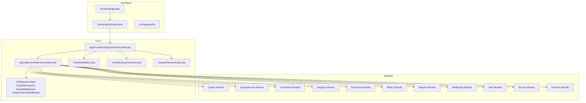

**Diagram sources**
- [app.php:1-50](file://bootstrap/app.php#L1-L50)
- [providers.php:1-50](file://bootstrap/providers.php#L1-L50)
- [app.php:1-50](file://config/app.php#L1-L50)
- [AppServiceProvider.php:1-120](file://app/Providers/AppServiceProvider.php#L1-L120)
- [Controller.php:1-120](file://app/Http/Controllers/Controller.php#L1-L120)
- [CheckPermission.php:1-120](file://app/Http/Middleware/CheckPermission.php#L1-L120)
- [TenantMiddleware.php:1-120](file://app/Http/Middleware/TenantMiddleware.php#L1-L120)
- [SystemAdminMiddleware.php:1-120](file://app/Http/Middleware/SystemAdminMiddleware.php#L1-L120)
- [HasRBAC.php:1-120](file://app/Modules/Core/Traits/HasRBAC.php#L1-L120)
- [BelongsToTenant.php:1-120](file://app/Modules/Core/Traits/BelongsToTenant.php#L1-L120)
- [TenantScope.php:1-120](file://app/Modules/Core/Scopes/TenantScope.php#L1-L120)

**Section sources**
- [app.php:1-50](file://bootstrap/app.php#L1-L50)
- [providers.php:1-50](file://bootstrap/providers.php#L1-L50)
- [app.php:1-50](file://config/app.php#L1-L50)

## Core Components
This section outlines the foundational building blocks that unify module behavior.

- Base Controller: Provides shared HTTP behavior and conventions for all module controllers.
- Middleware: Enforces permissions, tenant isolation, subscription checks, and locale settings.
- Core Traits and Scopes: Enable RBAC, multi-tenancy, and translation support across models.
- Application Service Provider: Registers bindings, bootstraps modules, and wires core services.

Key responsibilities:
- Consistent request lifecycle across modules via base controller and middleware stack
- Cross-cutting concerns enforced at the model and controller level
- Centralized registration and initialization via the service provider

**Section sources**
- [Controller.php:1-120](file://app/Http/Controllers/Controller.php#L1-L120)
- [CheckPermission.php:1-120](file://app/Http/Middleware/CheckPermission.php#L1-L120)
- [TenantMiddleware.php:1-120](file://app/Http/Middleware/TenantMiddleware.php#L1-L120)
- [SystemAdminMiddleware.php:1-120](file://app/Http/Middleware/SystemAdminMiddleware.php#L1-L120)
- [HasRBAC.php:1-120](file://app/Modules/Core/Traits/HasRBAC.php#L1-L120)
- [BelongsToTenant.php:1-120](file://app/Modules/Core/Traits/BelongsToTenant.php#L1-L120)
- [TenantScope.php:1-120](file://app/Modules/Core/Scopes/TenantScope.php#L1-L120)
- [AppServiceProvider.php:1-120](file://app/Providers/AppServiceProvider.php#L1-L120)

## Architecture Overview
The system follows a layered, modular architecture:
- Presentation Layer: Controllers expose endpoints and render views
- Domain Layer: Services encapsulate business logic
- Persistence Layer: Models and Eloquent ORM handle data
- Infrastructure Layer: Middleware, traits, scopes, and providers support cross-cutting concerns

Inter-module communication occurs via:
- Shared traits and scopes for RBAC and tenant isolation
- Events emitted by modules (e.g., queue device pairing)
- API routes and controllers exposing module capabilities
- Contracts and managers enabling pluggable integrations (payments)

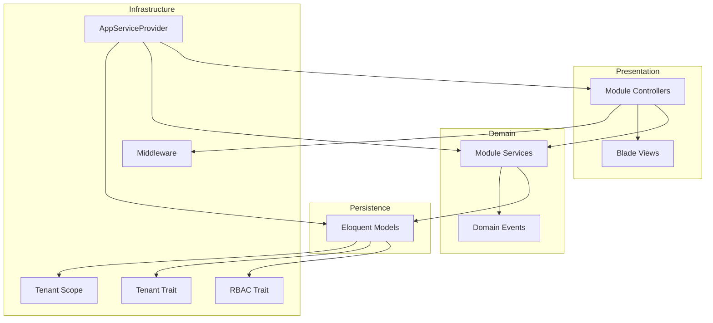

**Diagram sources**
- [Controller.php:1-120](file://app/Http/Controllers/Controller.php#L1-L120)
- [HasRBAC.php:1-120](file://app/Modules/Core/Traits/HasRBAC.php#L1-L120)
- [BelongsToTenant.php:1-120](file://app/Modules/Core/Traits/BelongsToTenant.php#L1-L120)
- [TenantScope.php:1-120](file://app/Modules/Core/Scopes/TenantScope.php#L1-L120)
- [AppServiceProvider.php:1-120](file://app/Providers/AppServiceProvider.php#L1-L120)

## Detailed Component Analysis

### Queue Module
Purpose: Manage ticket-based queuing, display devices, activity logs, and real-time tracking.

Structure:
- Controllers: SimpleQueueController, ActivityLogController, TicketController, TicketHistoryController, TrackerController
- Models: Ticket, ActivityLog
- Services: QueueService, ActivityLogService
- Events: DevicePaired, TicketCreated, TicketUpdated, TicketCalled
- Routes: Exposed via web and API route files

Key patterns:
- Controllers inherit from the base controller and apply middleware for permissions and tenant isolation
- Services encapsulate business logic for queue operations and activity logging
- Events decouple components (e.g., device pairing triggers downstream actions)

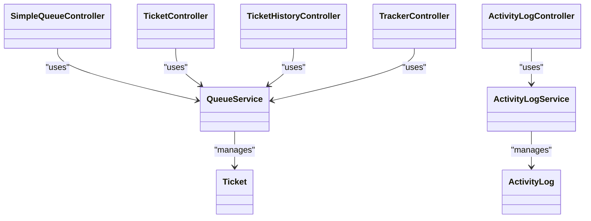

**Diagram sources**
- [SimpleQueueController.php:1-120](file://app/Modules/Queue/Controllers/SimpleQueueController.php#L1-L120)
- [ActivityLogController.php:1-120](file://app/Modules/Queue/Controllers/ActivityLogController.php#L1-L120)
- [TicketController.php:1-120](file://app/Modules/Queue/Controllers/TicketController.php#L1-L120)
- [TicketHistoryController.php:1-120](file://app/Modules/Queue/Controllers/TicketHistoryController.php#L1-L120)
- [TrackerController.php:1-120](file://app/Modules/Queue/Controllers/TrackerController.php#L1-L120)
- [QueueService.php:1-120](file://app/Modules/Queue/Services/QueueService.php#L1-L120)
- [ActivityLogService.php:1-120](file://app/Modules/Queue/Services/ActivityLogService.php#L1-L120)
- [Ticket.php:1-120](file://app/Modules/Queue/Models/Ticket.php#L1-L120)
- [ActivityLog.php:1-120](file://app/Modules/Queue/Models/ActivityLog.php#L1-L120)

**Section sources**
- [SimpleQueueController.php:1-120](file://app/Modules/Queue/Controllers/SimpleQueueController.php#L1-L120)
- [ActivityLogController.php:1-120](file://app/Modules/Queue/Controllers/ActivityLogController.php#L1-L120)
- [TicketController.php:1-120](file://app/Modules/Queue/Controllers/TicketController.php#L1-L120)
- [TicketHistoryController.php:1-120](file://app/Modules/Queue/Controllers/TicketHistoryController.php#L1-L120)
- [TrackerController.php:1-120](file://app/Modules/Queue/Controllers/TrackerController.php#L1-L120)
- [QueueService.php:1-120](file://app/Modules/Queue/Services/QueueService.php#L1-L120)
- [ActivityLogService.php:1-120](file://app/Modules/Queue/Services/ActivityLogService.php#L1-L120)
- [Ticket.php:1-120](file://app/Modules/Queue/Models/Ticket.php#L1-L120)
- [ActivityLog.php:1-120](file://app/Modules/Queue/Models/ActivityLog.php#L1-L120)
- [DevicePaired.php:1-120](file://app/Modules/Queue/Events/DevicePaired.php#L1-L120)
- [AppModulesQueueEventsDevicePaired.php:1-120](file://app/Events/AppModulesQueueEventsDevicePaired.php#L1-L120)

### Appointments Module
Purpose: Schedule and manage appointments and appointment slots.

Structure:
- Controllers: AppointmentController, AppointmentSlotController
- Models: Appointment, AppointmentSlot
- Services: AppointmentService
- Routes: Web/API endpoints for CRUD and scheduling operations

Patterns:
- Controllers delegate to AppointmentService for scheduling logic
- Models represent temporal scheduling entities with advanced columns and intervals

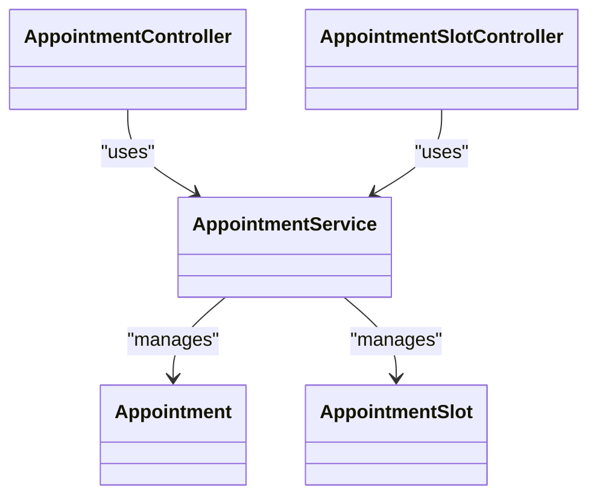

**Diagram sources**
- [AppointmentController.php:1-120](file://app/Modules/Appointments/Controllers/AppointmentController.php#L1-L120)
- [AppointmentSlotController.php:1-120](file://app/Modules/Appointments/Controllers/AppointmentSlotController.php#L1-L120)
- [AppointmentService.php:1-120](file://app/Modules/Appointments/Services/AppointmentService.php#L1-L120)
- [Appointment.php:1-120](file://app/Modules/Appointments/Models/Appointment.php#L1-L120)
- [AppointmentSlot.php:1-120](file://app/Modules/Appointments/Models/AppointmentSlot.php#L1-L120)

**Section sources**
- [AppointmentController.php:1-120](file://app/Modules/Appointments/Controllers/AppointmentController.php#L1-L120)
- [AppointmentSlotController.php:1-120](file://app/Modules/Appointments/Controllers/AppointmentSlotController.php#L1-L120)
- [AppointmentService.php:1-120](file://app/Modules/Appointments/Services/AppointmentService.php#L1-L120)
- [Appointment.php:1-120](file://app/Modules/Appointments/Models/Appointment.php#L1-L120)
- [AppointmentSlot.php:1-120](file://app/Modules/Appointments/Models/AppointmentSlot.php#L1-L120)

### Customers Module
Purpose: Manage customer records and portal user accounts.

Structure:
- Controllers: CustomerController, CustomerPortalController
- Models: Customer, PortalUser
- Routes: Endpoints for customer management and portal access

Patterns:
- Controllers coordinate customer CRUD and portal-related operations
- Models encapsulate customer and portal user data

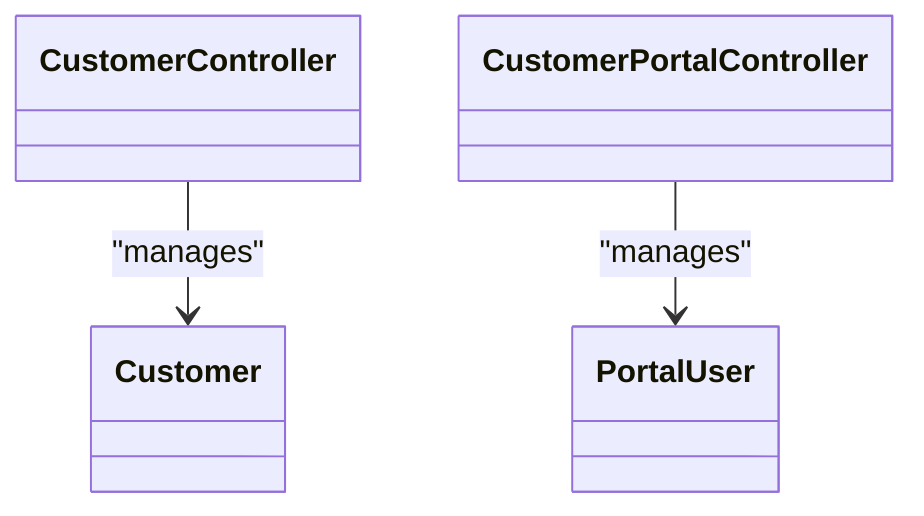

**Diagram sources**
- [CustomerController.php:1-120](file://app/Modules/Customers/Controllers/CustomerController.php#L1-L120)
- [CustomerPortalController.php:1-120](file://app/Modules/Customers/Controllers/CustomerPortalController.php#L1-L120)
- [Customer.php:1-120](file://app/Modules/Customers/Models/Customer.php#L1-L120)
- [PortalUser.php:1-120](file://app/Modules/Customers/Models/PortalUser.php#L1-L120)

**Section sources**
- [CustomerController.php:1-120](file://app/Modules/Customers/Controllers/CustomerController.php#L1-L120)
- [CustomerPortalController.php:1-120](file://app/Modules/Customers/Controllers/CustomerPortalController.php#L1-L120)
- [Customer.php:1-120](file://app/Modules/Customers/Models/Customer.php#L1-L120)
- [PortalUser.php:1-120](file://app/Modules/Customers/Models/PortalUser.php#L1-L120)

### Displays Module
Purpose: Manage display devices used for queue and appointment information.

Structure:
- Controllers: DisplayDeviceController
- Models: DisplayDevice
- Routes: Endpoints for device management and pairing

Patterns:
- Controller handles device lifecycle and pairing events
- Model persists device metadata and pairing status

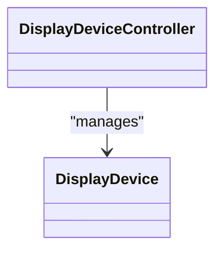

**Diagram sources**
- [DisplayDeviceController.php:1-120](file://app/Modules/Displays/Controllers/DisplayDeviceController.php#L1-L120)
- [DisplayDevice.php:1-120](file://app/Modules/Displays/Models/DisplayDevice.php#L1-L120)

**Section sources**
- [DisplayDeviceController.php:1-120](file://app/Modules/Displays/Controllers/DisplayDeviceController.php#L1-L120)
- [DisplayDevice.php:1-120](file://app/Modules/Displays/Models/DisplayDevice.php#L1-L120)

### Payments Module
Purpose: Handle invoicing, payments, subscriptions, and payment providers.

Structure:
- Controllers: AdminInvoiceController, AdminPaymentController, AdminSubscriptionController, CompanyBillingController
- Models: Invoice, Payment, Subscription, PaymentTransaction, InvoiceItem
- Contracts: PaymentProviderInterface
- Providers: ManualPaymentProvider
- Managers: PaymentManager
- Services: PaymentLifecycleService
- Routes: Admin and company-facing endpoints

Patterns:
- Pluggable payment providers via PaymentProviderInterface
- PaymentManager orchestrates provider selection and lifecycle
- PaymentLifecycleService coordinates creation, updates, and reconciliation

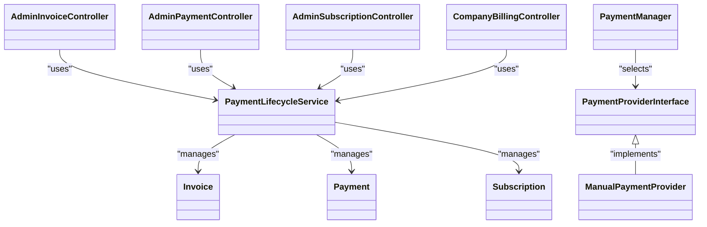

**Diagram sources**
- [AdminInvoiceController.php:1-120](file://app/Modules/Payments/Controllers/AdminInvoiceController.php#L1-L120)
- [AdminPaymentController.php:1-120](file://app/Modules/Payments/Controllers/AdminPaymentController.php#L1-L120)
- [AdminSubscriptionController.php:1-120](file://app/Modules/Payments/Controllers/AdminSubscriptionController.php#L1-L120)
- [CompanyBillingController.php:1-120](file://app/Modules/Payments/Controllers/CompanyBillingController.php#L1-L120)
- [PaymentProviderInterface.php:1-120](file://app/Modules/Payments/Contracts/PaymentProviderInterface.php#L1-L120)
- [ManualPaymentProvider.php:1-120](file://app/Modules/Payments/Providers/ManualPaymentProvider.php#L1-L120)
- [PaymentManager.php:1-120](file://app/Modules/Payments/Managers/PaymentManager.php#L1-L120)
- [PaymentLifecycleService.php:1-120](file://app/Modules/Payments/Services/PaymentLifecycleService.php#L1-L120)
- [Invoice.php:1-120](file://app/Modules/Payments/Models/Invoice.php#L1-L120)
- [Payment.php:1-120](file://app/Modules/Payments/Models/Payment.php#L1-L120)
- [Subscription.php:1-120](file://app/Modules/Payments/Models/Subscription.php#L1-L120)

**Section sources**
- [AdminInvoiceController.php:1-120](file://app/Modules/Payments/Controllers/AdminInvoiceController.php#L1-L120)
- [AdminPaymentController.php:1-120](file://app/Modules/Payments/Controllers/AdminPaymentController.php#L1-L120)
- [AdminSubscriptionController.php:1-120](file://app/Modules/Payments/Controllers/AdminSubscriptionController.php#L1-L120)
- [CompanyBillingController.php:1-120](file://app/Modules/Payments/Controllers/CompanyBillingController.php#L1-L120)
- [PaymentProviderInterface.php:1-120](file://app/Modules/Payments/Contracts/PaymentProviderInterface.php#L1-L120)
- [ManualPaymentProvider.php:1-120](file://app/Modules/Payments/Providers/ManualPaymentProvider.php#L1-L120)
- [PaymentManager.php:1-120](file://app/Modules/Payments/Managers/PaymentManager.php#L1-L120)
- [PaymentLifecycleService.php:1-120](file://app/Modules/Payments/Services/PaymentLifecycleService.php#L1-L120)
- [Invoice.php:1-120](file://app/Modules/Payments/Models/Invoice.php#L1-L120)
- [Payment.php:1-120](file://app/Modules/Payments/Models/Payment.php#L1-L120)
- [Subscription.php:1-120](file://app/Modules/Payments/Models/Subscription.php#L1-L120)

### RBAC Module
Purpose: Manage roles, permissions, and access control across tenants.

Structure:
- Controllers: MasterController, RolesController, UsersController
- Models: Role, Permission
- Routes: Endpoints for RBAC administration

Patterns:
- Controllers coordinate role and permission CRUD
- Core HasRBAC trait enables RBAC on user models

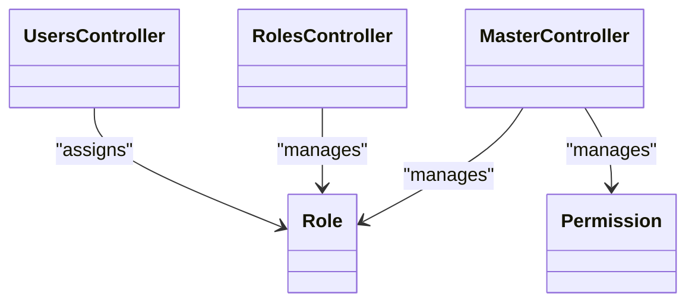

**Diagram sources**
- [MasterController.php:1-120](file://app/Modules/RBAC/Controllers/MasterController.php#L1-L120)
- [RolesController.php:1-120](file://app/Modules/RBAC/Controllers/RolesController.php#L1-L120)
- [UsersController.php:1-120](file://app/Modules/RBAC/Controllers/UsersController.php#L1-L120)
- [Role.php:1-120](file://app/Modules/RBAC/Models/Role.php#L1-L120)
- [Permission.php:1-120](file://app/Modules/RBAC/Models/Permission.php#L1-L120)

**Section sources**
- [MasterController.php:1-120](file://app/Modules/RBAC/Controllers/MasterController.php#L1-L120)
- [RolesController.php:1-120](file://app/Modules/RBAC/Controllers/RolesController.php#L1-L120)
- [UsersController.php:1-120](file://app/Modules/RBAC/Controllers/UsersController.php#L1-L120)
- [Role.php:1-120](file://app/Modules/RBAC/Models/Role.php#L1-L120)
- [Permission.php:1-120](file://app/Modules/RBAC/Models/Permission.php#L1-L120)
- [HasRBAC.php:1-120](file://app/Modules/Core/Traits/HasRBAC.php#L1-L120)

### Reports Module
Purpose: Provide analytics and reporting capabilities.

Structure:
- Controllers: AnalyticsController, ReportController
- Services: AnalyticsService
- Routes: Endpoints for reports and analytics

Patterns:
- Controllers delegate analytics computation to AnalyticsService
- Service encapsulates report generation logic

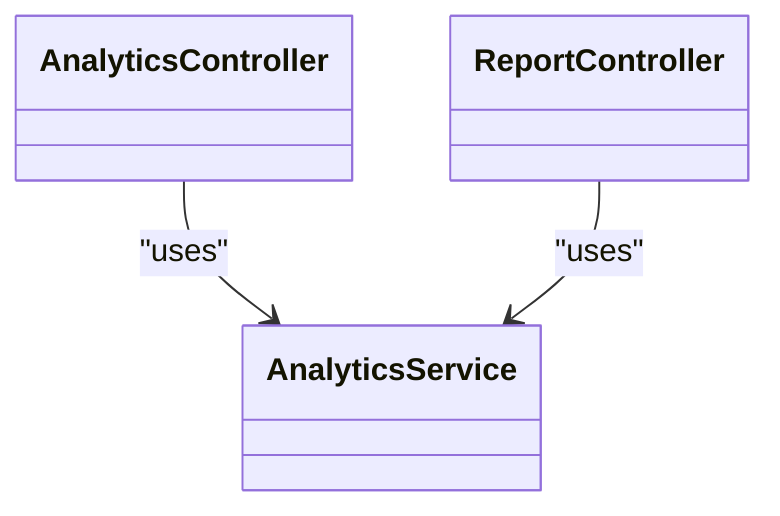

**Diagram sources**
- [AnalyticsController.php:1-120](file://app/Modules/Reports/Controllers/AnalyticsController.php#L1-L120)
- [ReportController.php:1-120](file://app/Modules/Reports/Controllers/ReportController.php#L1-L120)
- [AnalyticsService.php:1-120](file://app/Modules/Reports/Services/AnalyticsService.php#L1-L120)

**Section sources**
- [AnalyticsController.php:1-120](file://app/Modules/Reports/Controllers/AnalyticsController.php#L1-L120)
- [ReportController.php:1-120](file://app/Modules/Reports/Controllers/ReportController.php#L1-L120)
- [AnalyticsService.php:1-120](file://app/Modules/Reports/Services/AnalyticsService.php#L1-L120)

### WhatsApp Module
Purpose: Integrate messaging via webhook and chat.

Structure:
- Controllers: ChatController, WhatsAppWebhookController
- Models: Message
- Services: WhatsAppService
- Routes: Endpoints for chat and webhook handling

Patterns:
- Controllers handle inbound/outbound messaging
- Service encapsulates provider interactions

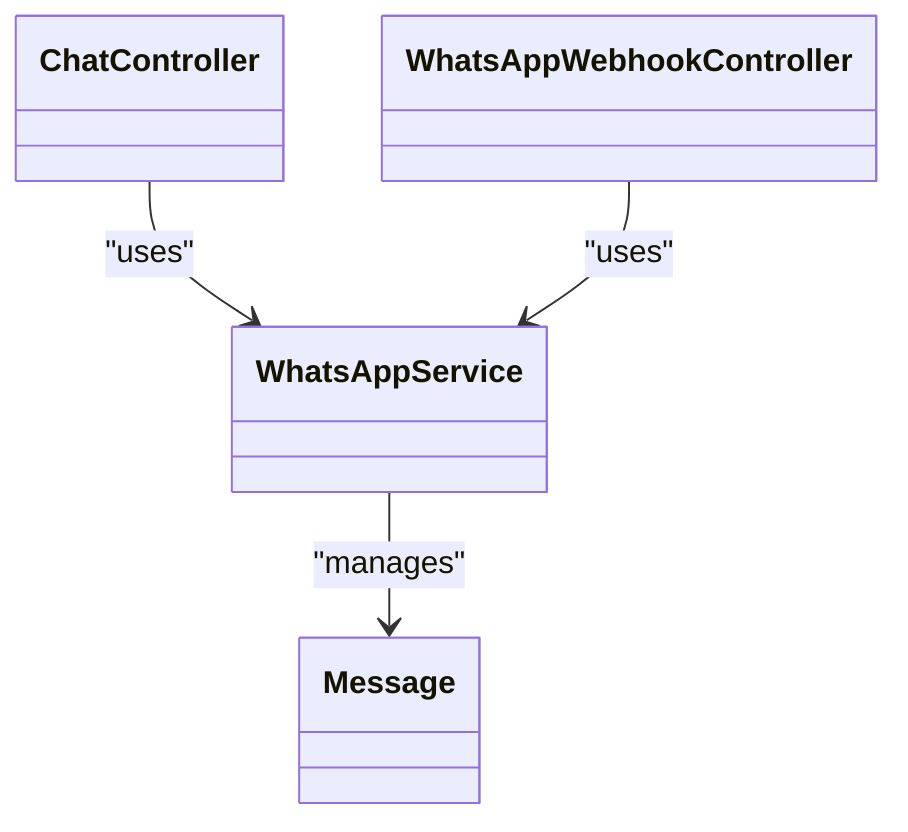

**Diagram sources**
- [ChatController.php:1-120](file://app/Modules/WhatsApp/Controllers/ChatController.php#L1-L120)
- [WhatsAppWebhookController.php:1-120](file://app/Modules/WhatsApp/Controllers/WhatsAppWebhookController.php#L1-L120)
- [WhatsAppService.php:1-120](file://app/Modules/WhatsApp/Services/WhatsAppService.php#L1-L120)
- [Message.php:1-120](file://app/Modules/WhatsApp/Models/Message.php#L1-L120)

**Section sources**
- [ChatController.php:1-120](file://app/Modules/WhatsApp/Controllers/ChatController.php#L1-L120)
- [WhatsAppWebhookController.php:1-120](file://app/Modules/WhatsApp/Controllers/WhatsAppWebhookController.php#L1-L120)
- [WhatsAppService.php:1-120](file://app/Modules/WhatsApp/Services/WhatsAppService.php#L1-L120)
- [Message.php:1-120](file://app/Modules/WhatsApp/Models/Message.php#L1-L120)

### Auth Module
Purpose: Authentication and registration.

Structure:
- Controllers: LoginController, RegisterController
- Services: RegisterService
- Routes: Endpoints for login and registration

Patterns:
- Controllers handle credentials and registration requests
- Service encapsulates registration logic

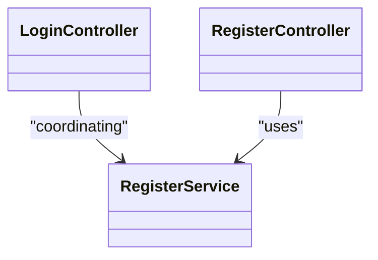

**Diagram sources**
- [LoginController.php:1-120](file://app/Modules/Auth/Controllers/LoginController.php#L1-L120)
- [RegisterController.php:1-120](file://app/Modules/Auth/Controllers/RegisterController.php#L1-L120)
- [RegisterService.php:1-120](file://app/Modules/Auth/Services/RegisterService.php#L1-L120)

**Section sources**
- [LoginController.php:1-120](file://app/Modules/Auth/Controllers/LoginController.php#L1-L120)
- [RegisterController.php:1-120](file://app/Modules/Auth/Controllers/RegisterController.php#L1-L120)
- [RegisterService.php:1-120](file://app/Modules/Auth/Services/RegisterService.php#L1-L120)

### Rooms and Services Modules
Purpose: Manage rooms and services used in appointments and queues.

Structure:
- Controllers: RoomController, ServiceController
- Models: Room, Service
- Routes: Endpoints for room and service management

Patterns:
- Controllers coordinate CRUD operations
- Models represent spatial and service entities

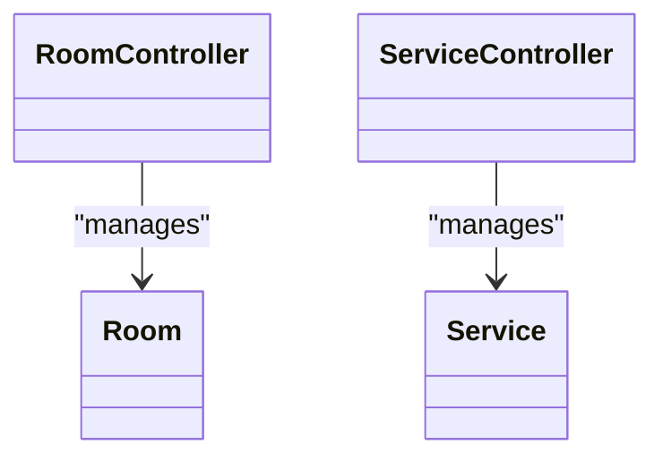

**Diagram sources**
- [RoomController.php:1-120](file://app/Modules/Rooms/Controllers/RoomController.php#L1-L120)
- [ServiceController.php:1-120](file://app/Modules/Services/Controllers/ServiceController.php#L1-L120)
- [Room.php:1-120](file://app/Modules/Rooms/Models/Room.php#L1-L120)
- [Service.php:1-120](file://app/Modules/Services/Models/Service.php#L1-L120)

**Section sources**
- [RoomController.php:1-120](file://app/Modules/Rooms/Controllers/RoomController.php#L1-L120)
- [ServiceController.php:1-120](file://app/Modules/Services/Controllers/ServiceController.php#L1-L120)
- [Room.php:1-120](file://app/Modules/Rooms/Models/Room.php#L1-L120)
- [Service.php:1-120](file://app/Modules/Services/Models/Service.php#L1-L120)

### Subscriptions Module
Purpose: Manage subscription plans and renewals.

Structure:
- Models: Plan
- Services: SubscriptionService
- Routes: Endpoints for subscription management

Patterns:
- Service manages plan assignments and renewal cycles

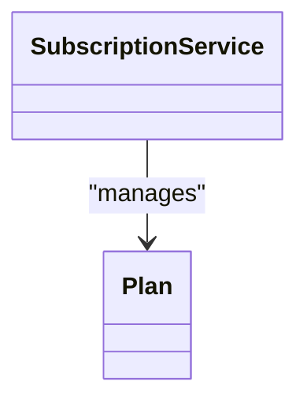

**Diagram sources**
- [Plan.php:1-120](file://app/Modules/Subscriptions/Models/Plan.php#L1-L120)
- [SubscriptionService.php:1-120](file://app/Modules/Subscriptions/Services/SubscriptionService.php#L1-L120)

**Section sources**
- [Plan.php:1-120](file://app/Modules/Subscriptions/Models/Plan.php#L1-L120)
- [SubscriptionService.php:1-120](file://app/Modules/Subscriptions/Services/SubscriptionService.php#L1-L120)

## Dependency Analysis
Inter-module dependencies and communication patterns:

- Shared traits and scopes: All models benefit from HasRBAC and BelongsToTenant, ensuring consistent permissions and tenant isolation
- Middleware enforcement: Controllers across modules rely on CheckPermission, TenantMiddleware, and SystemAdminMiddleware for access control and tenant routing
- Event-driven decoupling: Queue emits DevicePaired and other ticket events; other modules can listen and react
- API exposure: Controllers expose endpoints via web.php and api.php, enabling cross-module integration
- Pluggable integrations: Payments module uses PaymentProviderInterface and PaymentManager to support multiple providers

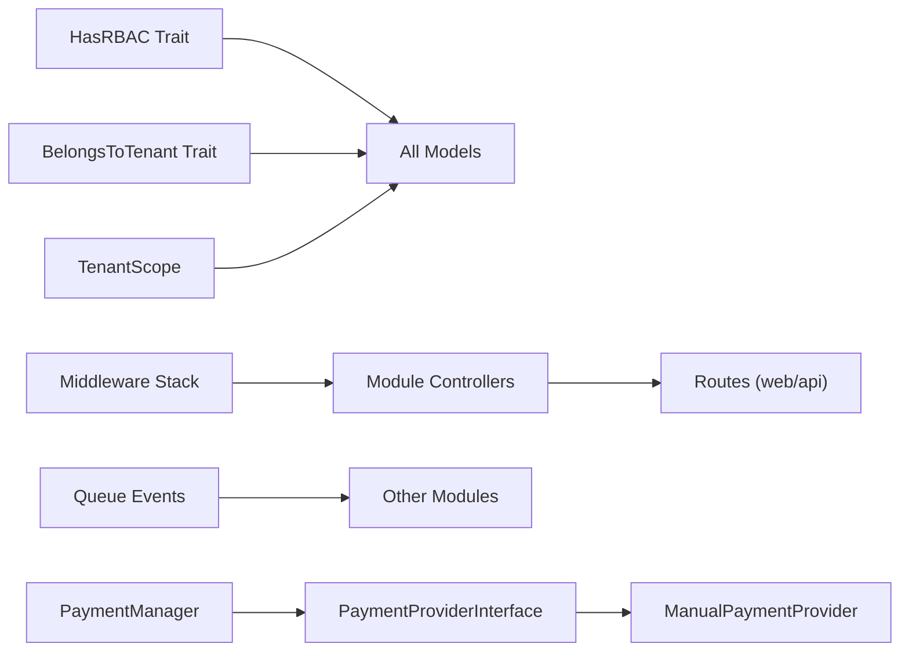

**Diagram sources**
- [HasRBAC.php:1-120](file://app/Modules/Core/Traits/HasRBAC.php#L1-L120)
- [BelongsToTenant.php:1-120](file://app/Modules/Core/Traits/BelongsToTenant.php#L1-L120)
- [TenantScope.php:1-120](file://app/Modules/Core/Scopes/TenantScope.php#L1-L120)
- [CheckPermission.php:1-120](file://app/Http/Middleware/CheckPermission.php#L1-L120)
- [TenantMiddleware.php:1-120](file://app/Http/Middleware/TenantMiddleware.php#L1-L120)
- [SystemAdminMiddleware.php:1-120](file://app/Http/Middleware/SystemAdminMiddleware.php#L1-L120)
- [DevicePaired.php:1-120](file://app/Modules/Queue/Events/DevicePaired.php#L1-L120)
- [PaymentManager.php:1-120](file://app/Modules/Payments/Managers/PaymentManager.php#L1-L120)
- [PaymentProviderInterface.php:1-120](file://app/Modules/Payments/Contracts/PaymentProviderInterface.php#L1-L120)
- [ManualPaymentProvider.php:1-120](file://app/Modules/Payments/Providers/ManualPaymentProvider.php#L1-L120)
- [web.php:1-200](file://routes/web.php#L1-L200)
- [api.php:1-200](file://routes/api.php#L1-L200)

**Section sources**
- [HasRBAC.php:1-120](file://app/Modules/Core/Traits/HasRBAC.php#L1-L120)
- [BelongsToTenant.php:1-120](file://app/Modules/Core/Traits/BelongsToTenant.php#L1-L120)
- [TenantScope.php:1-120](file://app/Modules/Core/Scopes/TenantScope.php#L1-L120)
- [CheckPermission.php:1-120](file://app/Http/Middleware/CheckPermission.php#L1-L120)
- [TenantMiddleware.php:1-120](file://app/Http/Middleware/TenantMiddleware.php#L1-L120)
- [SystemAdminMiddleware.php:1-120](file://app/Http/Middleware/SystemAdminMiddleware.php#L1-L120)
- [DevicePaired.php:1-120](file://app/Modules/Queue/Events/DevicePaired.php#L1-L120)
- [PaymentManager.php:1-120](file://app/Modules/Payments/Managers/PaymentManager.php#L1-L120)
- [PaymentProviderInterface.php:1-120](file://app/Modules/Payments/Contracts/PaymentProviderInterface.php#L1-L120)
- [ManualPaymentProvider.php:1-120](file://app/Modules/Payments/Providers/ManualPaymentProvider.php#L1-L120)
- [web.php:1-200](file://routes/web.php#L1-L200)
- [api.php:1-200](file://routes/api.php#L1-L200)

## Performance Considerations
- Prefer service-layer orchestration to keep controllers thin and testable
- Use tenant scoping to avoid cross-tenant queries and improve data locality
- Leverage middleware early to short-circuit unauthorized or invalid requests
- Batch operations in services where appropriate to reduce database round-trips
- Cache frequently accessed configuration and lookup data (e.g., plans, permissions)

## Troubleshooting Guide
Common areas to inspect:
- Middleware failures: Verify CheckPermission, TenantMiddleware, and SystemAdminMiddleware are applied consistently
- Tenant scoping issues: Ensure TenantScope and BelongsToTenant are applied to relevant models
- RBAC problems: Confirm HasRBAC usage and permission assignments
- Payment provider issues: Validate PaymentManager provider selection and PaymentProviderInterface implementations
- Queue events: Confirm event listeners are registered and functioning for DevicePaired and related events

**Section sources**
- [CheckPermission.php:1-120](file://app/Http/Middleware/CheckPermission.php#L1-L120)
- [TenantMiddleware.php:1-120](file://app/Http/Middleware/TenantMiddleware.php#L1-L120)
- [SystemAdminMiddleware.php:1-120](file://app/Http/Middleware/SystemAdminMiddleware.php#L1-L120)
- [BelongsToTenant.php:1-120](file://app/Modules/Core/Traits/BelongsToTenant.php#L1-L120)
- [TenantScope.php:1-120](file://app/Modules/Core/Scopes/TenantScope.php#L1-L120)
- [HasRBAC.php:1-120](file://app/Modules/Core/Traits/HasRBAC.php#L1-L120)
- [PaymentManager.php:1-120](file://app/Modules/Payments/Managers/PaymentManager.php#L1-L120)
- [PaymentProviderInterface.php:1-120](file://app/Modules/Payments/Contracts/PaymentProviderInterface.php#L1-L120)
- [DevicePaired.php:1-120](file://app/Modules/Queue/Events/DevicePaired.php#L1-L120)

## Conclusion
Noubtigo’s modular architecture cleanly separates concerns across feature modules while enforcing shared patterns through base controllers, middleware, and core traits/scopes. Inter-module communication leverages events, contracts, and routes, enabling extensibility and maintainability. The service layer centralizes business logic, and the provider pattern supports pluggable integrations. Together, these patterns deliver a scalable, tenant-aware, and permission-aware system.

## Appendices

### Module Registration and Service Container Bindings
- Bootstrap wiring: bootstrap/app.php initializes the application and loads providers
- Provider registration: bootstrap/providers.php registers application providers
- Application service provider: app/Providers/AppServiceProvider.php binds core services and performs module bootstrapping

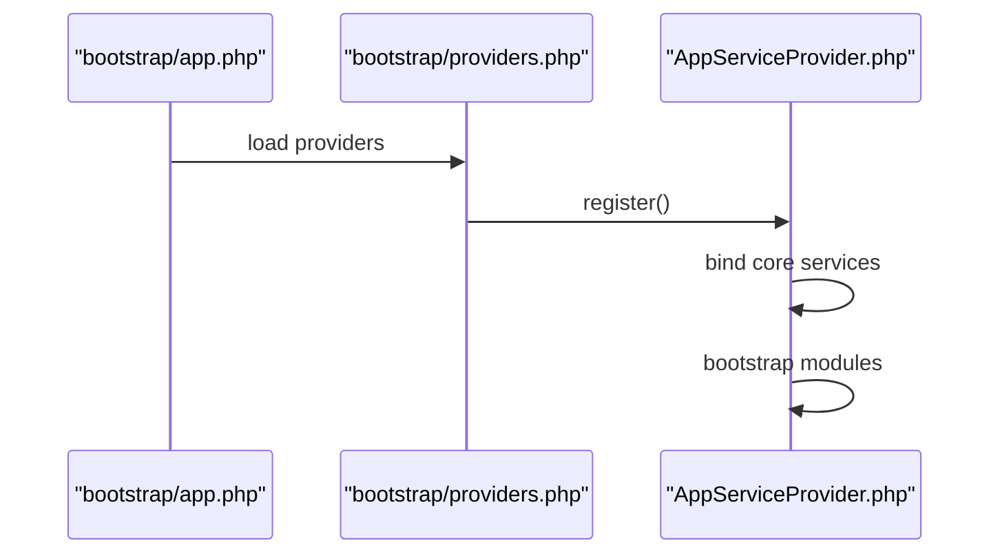

**Diagram sources**
- [app.php:1-50](file://bootstrap/app.php#L1-L50)
- [providers.php:1-50](file://bootstrap/providers.php#L1-L50)
- [AppServiceProvider.php:1-120](file://app/Providers/AppServiceProvider.php#L1-L120)

**Section sources**
- [app.php:1-50](file://bootstrap/app.php#L1-L50)
- [providers.php:1-50](file://bootstrap/providers.php#L1-L50)
- [AppServiceProvider.php:1-120](file://app/Providers/AppServiceProvider.php#L1-L120)

### Extensibility: Adding a New Module
Steps to add a new module:
1. Create a new folder under app/Modules/<ModuleName> with subfolders: Controllers, Models, Services
2. Add base controller inheritance and middleware usage
3. Define models with tenant scoping and RBAC traits where applicable
4. Implement services for business logic
5. Register routes in web.php and/or api.php
6. If needed, add contracts, providers, or managers for pluggable integrations
7. Ensure proper bindings in the application service provider if the module requires container resolution

Example references:
- Controller inheritance and middleware usage: [Controller.php:1-120](file://app/Http/Controllers/Controller.php#L1-L120), [CheckPermission.php:1-120](file://app/Http/Middleware/CheckPermission.php#L1-L120)
- Tenant scoping and RBAC traits: [BelongsToTenant.php:1-120](file://app/Modules/Core/Traits/BelongsToTenant.php#L1-L120), [HasRBAC.php:1-120](file://app/Modules/Core/Traits/HasRBAC.php#L1-L120)
- Tenant scope application: [TenantScope.php:1-120](file://app/Modules/Core/Scopes/TenantScope.php#L1-L120)
- Route registration: [web.php:1-200](file://routes/web.php#L1-L200), [api.php:1-200](file://routes/api.php#L1-L200)

**Section sources**
- [Controller.php:1-120](file://app/Http/Controllers/Controller.php#L1-L120)
- [CheckPermission.php:1-120](file://app/Http/Middleware/CheckPermission.php#L1-L120)
- [BelongsToTenant.php:1-120](file://app/Modules/Core/Traits/BelongsToTenant.php#L1-L120)
- [HasRBAC.php:1-120](file://app/Modules/Core/Traits/HasRBAC.php#L1-L120)
- [TenantScope.php:1-120](file://app/Modules/Core/Scopes/TenantScope.php#L1-L120)
- [web.php:1-200](file://routes/web.php#L1-L200)
- [api.php:1-200](file://routes/api.php#L1-L200)