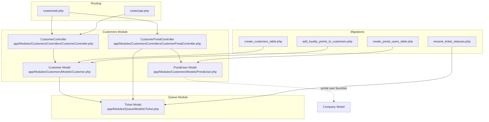
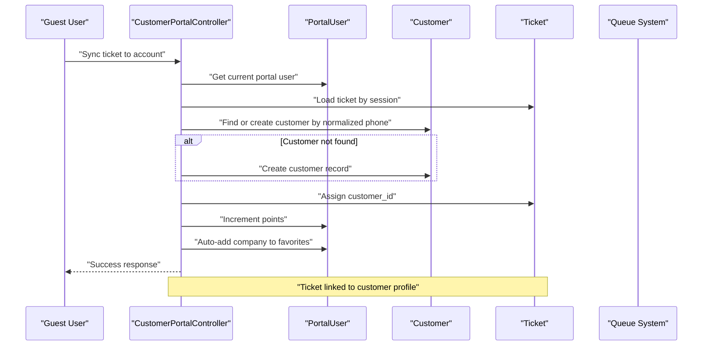
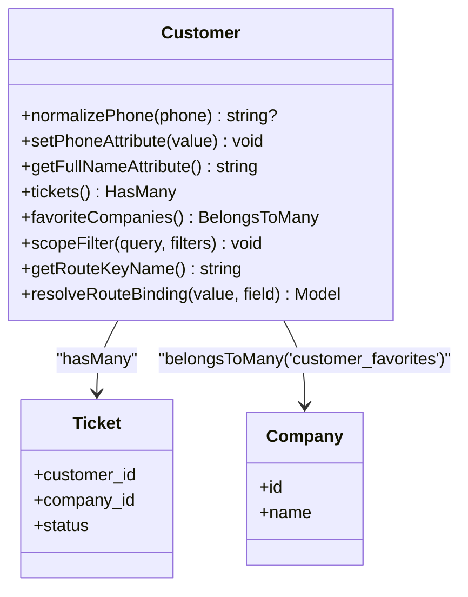
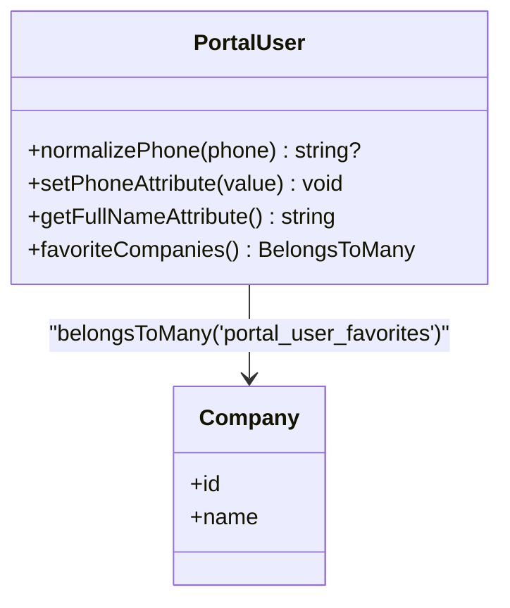
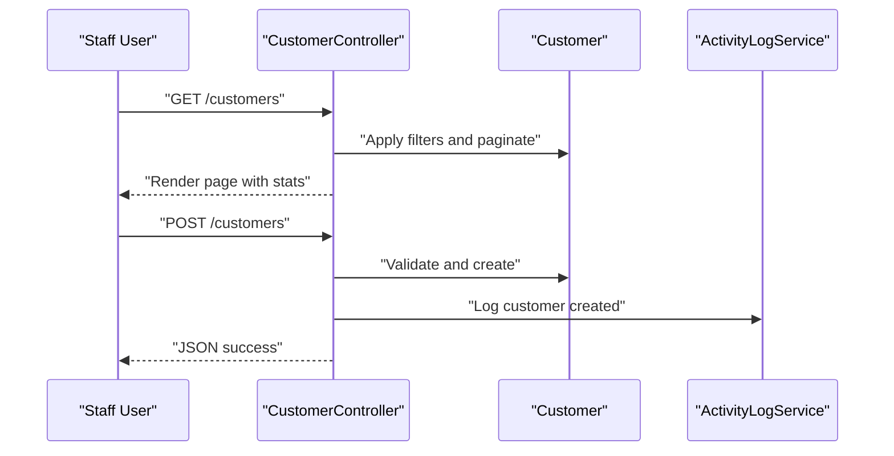
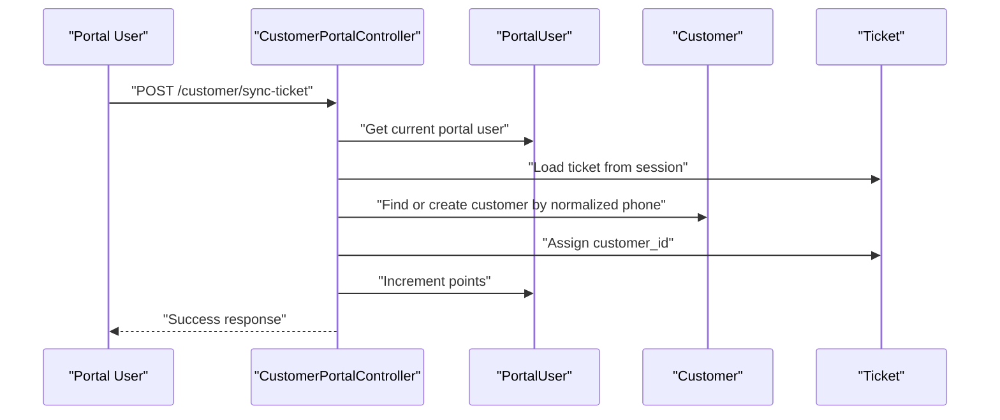
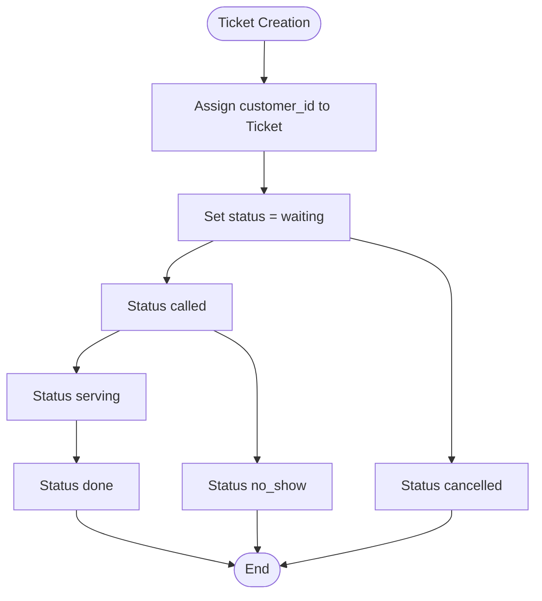
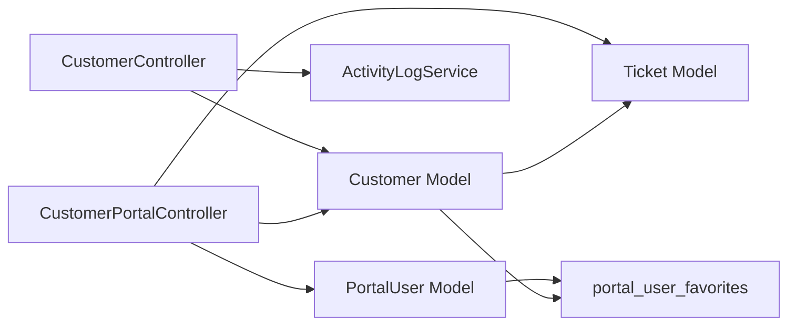

# Customer Management

<cite>
**Referenced Files in This Document**
- [Customer.php](file://app/Modules/Customers/Models/Customer.php)
- [PortalUser.php](file://app/Modules/Customers/Models/PortalUser.php)
- [CustomerController.php](file://app/Modules/Customers/Controllers/CustomerController.php)
- [CustomerPortalController.php](file://app/Modules/Customers/Controllers/CustomerPortalController.php)
- [create_customers_table.php](file://database/migrations/2026_04_06_163000_create_customers_table.php)
- [add_loyalty_points_to_customers.php](file://database/migrations/2026_05_08_113632_add_loyalty_points_to_customers.php)
- [create_portal_users_table.php](file://database/migrations/2026_05_08_144412_create_portal_users_table.php)
- [rename_ticket_statuses.php](file://database/migrations/2026_04_16_150000_rename_ticket_statuses.php)
- [web.php](file://routes/web.php)
- [api.php](file://routes/api.php)
</cite>

## Table of Contents
1. [Introduction](#introduction)
2. [Project Structure](#project-structure)
3. [Core Components](#core-components)
4. [Architecture Overview](#architecture-overview)
5. [Detailed Component Analysis](#detailed-component-analysis)
6. [Dependency Analysis](#dependency-analysis)
7. [Performance Considerations](#performance-considerations)
8. [Troubleshooting Guide](#troubleshooting-guide)
9. [Conclusion](#conclusion)
10. [Appendices](#appendices)

## Introduction
This document provides comprehensive documentation for the Customer Management module. It explains customer profile management, the customer portal, and the loyalty point system. It documents the Customer and PortalUser models, their attributes and relationships, and how they integrate with the queue system for ticket creation and history tracking. It also lists the API and web endpoints for customer management and portal operations, and provides examples of typical customer workflows, portal customization options, and integration considerations with CRM systems.

## Project Structure
The Customer Management module is organized into models and controllers under the Customers module, with supporting database migrations and route definitions.

**Diagram sources**
- [Customer.php:103-106](file://app/Modules/Customers/Models/Customer.php#L103-L106)
- [PortalUser.php:64-67](file://app/Modules/Customers/Models/PortalUser.php#L64-L67)
- [CustomerController.php:18-84](file://app/Modules/Customers/Controllers/CustomerController.php#L18-L84)
- [CustomerPortalController.php:20-51](file://app/Modules/Customers/Controllers/CustomerPortalController.php#L20-L51)
- [create_customers_table.php:14-25](file://database/migrations/2026_04_06_163000_create_customers_table.php#L14-L25)
- [add_loyalty_points_to_customers.php:11-13](file://database/migrations/2026_05_08_113632_add_loyalty_points_to_customers.php#L11-L13)
- [create_portal_users_table.php:14-35](file://database/migrations/2026_05_08_144412_create_portal_users_table.php#L14-L35)
- [rename_ticket_statuses.php:16-32](file://database/migrations/2026_04_16_150000_rename_ticket_statuses.php#L16-L32)
- [web.php:35-55](file://routes/web.php#L35-L55)
- [api.php:11-23](file://routes/api.php#L11-L23)

**Section sources**
- [Customer.php:12-171](file://app/Modules/Customers/Models/Customer.php#L12-L171)
- [PortalUser.php:10-69](file://app/Modules/Customers/Models/PortalUser.php#L10-L69)
- [CustomerController.php:9-266](file://app/Modules/Customers/Controllers/CustomerController.php#L9-L266)
- [CustomerPortalController.php:15-309](file://app/Modules/Customers/Controllers/CustomerPortalController.php#L15-L309)
- [web.php:35-55](file://routes/web.php#L35-L55)
- [api.php:11-23](file://routes/api.php#L11-L23)

## Core Components
- Customer model: Manages customer profiles, personal information, contact details, VIP flag, and loyalty points. Provides phone normalization, UUID route binding, filtering, and relationships to tickets and favorite companies.
- PortalUser model: Supports customer portal authentication and access controls, with profile management, phone normalization, and favorites linkage to companies.
- CustomerController: Handles CRUD operations for customers, filtering, sorting, statistics, and audit logging via ActivityLogService.
- CustomerPortalController: Implements portal login/register, dashboard, favorites, ticket synchronization, tracking, and profile updates.

**Section sources**
- [Customer.php:12-171](file://app/Modules/Customers/Models/Customer.php#L12-L171)
- [PortalUser.php:10-69](file://app/Modules/Customers/Models/PortalUser.php#L10-L69)
- [CustomerController.php:9-266](file://app/Modules/Customers/Controllers/CustomerController.php#L9-L266)
- [CustomerPortalController.php:15-309](file://app/Modules/Customers/Controllers/CustomerPortalController.php#L15-L309)

## Architecture Overview
The module integrates with the queue system to create tickets and track customer history. Portal users can link guest tickets to their profiles, earn loyalty points, and manage favorites. The routing groups separate public portal endpoints from staff-only customer management endpoints.

**Diagram sources**
- [CustomerPortalController.php:160-202](file://app/Modules/Customers/Controllers/CustomerPortalController.php#L160-L202)
- [Customer.php:103-106](file://app/Modules/Customers/Models/Customer.php#L103-L106)
- [PortalUser.php:64-67](file://app/Modules/Customers/Models/PortalUser.php#L64-L67)

**Section sources**
- [CustomerPortalController.php:160-202](file://app/Modules/Customers/Controllers/CustomerPortalController.php#L160-L202)
- [Customer.php:103-106](file://app/Modules/Customers/Models/Customer.php#L103-L106)
- [PortalUser.php:64-67](file://app/Modules/Customers/Models/PortalUser.php#L64-L67)

## Detailed Component Analysis

### Customer Model
The Customer model encapsulates customer profiles with personal and contact information, and integrates with the queue system and favorites.

Key capabilities:
- Phone normalization for consistent storage and matching
- UUID route model binding for secure URLs
- Filtering by search terms, VIP flag, service, and status
- Relationship to tickets and favorite companies
- Hidden sensitive attributes and appended computed fields

**Diagram sources**
- [Customer.php:19-170](file://app/Modules/Customers/Models/Customer.php#L19-L170)
- [create_customers_table.php:14-25](file://database/migrations/2026_04_06_163000_create_customers_table.php#L14-L25)
- [add_loyalty_points_to_customers.php:11-13](file://database/migrations/2026_05_08_113632_add_loyalty_points_to_customers.php#L11-L13)

**Section sources**
- [Customer.php:12-171](file://app/Modules/Customers/Models/Customer.php#L12-L171)
- [create_customers_table.php:14-25](file://database/migrations/2026_04_06_163000_create_customers_table.php#L14-L25)
- [add_loyalty_points_to_customers.php:11-13](file://database/migrations/2026_05_08_113632_add_loyalty_points_to_customers.php#L11-L13)

### PortalUser Model
The PortalUser model supports customer portal authentication and access controls, with profile management and favorites.

Key capabilities:
- Phone normalization reuse from Customer
- Full name attribute
- Favorites relationship to companies
- Hidden sensitive attributes

**Diagram sources**
- [PortalUser.php:40-67](file://app/Modules/Customers/Models/PortalUser.php#L40-L67)
- [create_portal_users_table.php:29-35](file://database/migrations/2026_05_08_144412_create_portal_users_table.php#L29-L35)

**Section sources**
- [PortalUser.php:10-69](file://app/Modules/Customers/Models/PortalUser.php#L10-L69)
- [create_portal_users_table.php:14-35](file://database/migrations/2026_05_08_144412_create_portal_users_table.php#L14-L35)

### CustomerController
The controller manages customer CRUD operations, filtering, sorting, and statistics, while enforcing permissions and logging changes.

Key capabilities:
- Index with filtering, sorting, and stats aggregation
- Store with subscription checks and validation
- Show with timeline retrieval
- Update with change logging
- Destroy with audit logging
- Toggle VIP status
- AJAX search for customer selection

**Diagram sources**
- [CustomerController.php:18-84](file://app/Modules/Customers/Controllers/CustomerController.php#L18-L84)
- [CustomerController.php:86-125](file://app/Modules/Customers/Controllers/CustomerController.php#L86-L125)

**Section sources**
- [CustomerController.php:9-266](file://app/Modules/Customers/Controllers/CustomerController.php#L9-L266)

### CustomerPortalController
The portal controller handles customer portal operations including authentication, dashboard, favorites, ticket synchronization, tracking, and profile updates.

Key capabilities:
- Dashboard with active tickets, favorites, and recent history
- Login and registration with guard 'customer'
- Toggle/remove favorites
- Sync guest ticket to customer profile and award points
- Track company or specific ticket
- Update profile

**Diagram sources**
- [CustomerPortalController.php:160-202](file://app/Modules/Customers/Controllers/CustomerPortalController.php#L160-L202)

**Section sources**
- [CustomerPortalController.php:15-309](file://app/Modules/Customers/Controllers/CustomerPortalController.php#L15-L309)

### Queue Integration and Ticket History
The queue system creates and tracks tickets associated with customers. Status transitions are managed and persisted, enabling history tracking.

**Diagram sources**
- [rename_ticket_statuses.php:16-32](file://database/migrations/2026_04_16_150000_rename_ticket_statuses.php#L16-L32)

**Section sources**
- [rename_ticket_statuses.php:16-32](file://database/migrations/2026_04_16_150000_rename_ticket_statuses.php#L16-L32)

## Dependency Analysis
The module depends on:
- Eloquent relationships for tickets and favorites
- Tenant scoping and soft deletes
- Activity logging for audit trails
- Route guards for portal authentication
- Queue module for ticket lifecycle

**Diagram sources**
- [CustomerController.php:13-16](file://app/Modules/Customers/Controllers/CustomerController.php#L13-L16)
- [CustomerPortalController.php:22-48](file://app/Modules/Customers/Controllers/CustomerPortalController.php#L22-L48)
- [Customer.php:103-114](file://app/Modules/Customers/Models/Customer.php#L103-L114)
- [PortalUser.php:64-67](file://app/Modules/Customers/Models/PortalUser.php#L64-L67)

**Section sources**
- [CustomerController.php:13-16](file://app/Modules/Customers/Controllers/CustomerController.php#L13-L16)
- [CustomerPortalController.php:22-48](file://app/Modules/Customers/Controllers/CustomerPortalController.php#L22-L48)
- [Customer.php:103-114](file://app/Modules/Customers/Models/Customer.php#L103-L114)
- [PortalUser.php:64-67](file://app/Modules/Customers/Models/PortalUser.php#L64-L67)

## Performance Considerations
- Use filtered queries with indexes on frequently searched columns (name parts, phone, email) to optimize customer search and filtering.
- Apply pagination for large datasets in index actions to avoid heavy loads.
- Leverage withCount and joins judiciously to prevent N+1 queries in listings.
- Normalize phone numbers once during input to reduce duplication and improve lookup performance.
- Cache dashboard stats where appropriate and refresh periodically.

## Troubleshooting Guide
Common issues and resolutions:
- Authentication failures in portal: Verify credentials and remember token handling; ensure the customer guard is used for portal routes.
- Ticket linking errors: Confirm the portal user's phone matches the customer profile after normalization; ensure session contains a valid tracking ticket ID.
- Favorites not persisting: Check the portal_user_favorites pivot table and unique constraint for user-company pairs.
- VIP toggling blocked: Ensure the user has the required permission before attempting to update VIP status.
- Audit logs missing: Confirm ActivityLogService is invoked on create/update/delete operations.

**Section sources**
- [CustomerPortalController.php:64-82](file://app/Modules/Customers/Controllers/CustomerPortalController.php#L64-L82)
- [CustomerPortalController.php:160-202](file://app/Modules/Customers/Controllers/CustomerPortalController.php#L160-L202)
- [CustomerController.php:207-227](file://app/Modules/Customers/Controllers/CustomerController.php#L207-L227)

## Conclusion
The Customer Management module provides robust customer profile management, a secure and feature-rich portal for self-service operations, and a loyalty point system integrated with ticketing. Its design emphasizes tenant scoping, auditability, and seamless queue integration, enabling efficient customer journey tracking and personalized experiences.

## Appendices

### API and Web Endpoints
- Web routes (portal)
  - GET /customer/login → CustomerPortalController@showLoginForm
  - POST /customer/login → CustomerPortalController@login
  - GET /customer/register → CustomerPortalController@showRegistrationForm
  - POST /customer/register → CustomerPortalController@register
  - GET /customer/dashboard → CustomerPortalController@index
  - POST /customer/logout → CustomerPortalController@logout
  - POST /customer/favorites/{company} → CustomerPortalController@toggleFavorite
  - DELETE /customer/favorites/{company} → CustomerPortalController@removeFavorite
  - POST /customer/sync-ticket → CustomerPortalController@syncTicket
  - POST /customer/add-by-code → CustomerPortalController@addCompanyByCode
  - GET /customer/track-company/{company} → CustomerPortalController@trackCompany
  - GET /customer/track-ticket/{ticket} → CustomerPortalController@trackTicket
  - POST /customer/profile → CustomerPortalController@updateProfile

- Web routes (staff)
  - GET /customers → CustomerController@index
  - POST /customers → CustomerController@store
  - GET /customers/ajax-search → CustomerController@ajaxSearch
  - GET /customers/{customer} → CustomerController@show
  - PUT /customers/{customer} → CustomerController@update
  - DELETE /customers/{customer} → CustomerController@destroy
  - PATCH /customers/{customer}/vip → CustomerController@toggleVip

- API routes
  - POST /api/v1/auth/register → RegisterController@register
  - GET /api/v1/user → authenticated user with company

**Section sources**
- [web.php:35-55](file://routes/web.php#L35-L55)
- [web.php:181-194](file://routes/web.php#L181-L194)
- [api.php:11-23](file://routes/api.php#L11-L23)

### Database Schema Notes
- customers table: includes company_id, names, phone, email, timestamps, soft deletes, and an index on company_id and names.
- portal_users table: includes unique email and phone, password, avatar, points, locale, remember token, timestamps, and soft deletes; plus portal_user_favorites pivot table.
- tickets table: status enum includes waiting, called, serving, done, cancelled, no_show; previous values were renamed in a migration.

**Section sources**
- [create_customers_table.php:14-25](file://database/migrations/2026_04_06_163000_create_customers_table.php#L14-L25)
- [create_portal_users_table.php:14-35](file://database/migrations/2026_05_08_144412_create_portal_users_table.php#L14-L35)
- [rename_ticket_statuses.php:16-32](file://database/migrations/2026_04_16_150000_rename_ticket_statuses.php#L16-L32)

### Customer Workflows
- Profile creation and linking
  - Staff creates a customer profile with personal info.
  - Portal user registers/logging in and syncs a guest ticket to their account.
  - System normalizes phone numbers and links the ticket to the customer profile.
  - Portal user earns loyalty points and company is auto-added to favorites.

- Dashboard and tracking
  - Portal user accesses dashboard to view active tickets, favorites, and recent history.
  - They can track a company or a specific ticket and manage favorites.

- Account management
  - Portal user updates profile details (name, email, phone).
  - Favorites can be toggled or removed.

**Section sources**
- [CustomerController.php:86-125](file://app/Modules/Customers/Controllers/CustomerController.php#L86-L125)
- [CustomerPortalController.php:160-202](file://app/Modules/Customers/Controllers/CustomerPortalController.php#L160-L202)
- [CustomerPortalController.php:20-51](file://app/Modules/Customers/Controllers/CustomerPortalController.php#L20-L51)
- [CustomerPortalController.php:282-296](file://app/Modules/Customers/Controllers/CustomerPortalController.php#L282-L296)

### Portal Customization Options
- Favorites management: Add/remove favorite companies; auto-link company by code.
- Localization: Locale stored per customer and portal user.
- Avatar support: Optional avatar field for both customer and portal user.
- Phone normalization: Consistent storage and matching across profiles.

**Section sources**
- [CustomerPortalController.php:149-155](file://app/Modules/Customers/Controllers/CustomerPortalController.php#L149-L155)
- [CustomerPortalController.php:207-228](file://app/Modules/Customers/Controllers/CustomerPortalController.php#L207-L228)
- [PortalUser.php:22-24](file://app/Modules/Customers/Models/PortalUser.php#L22-L24)
- [Customer.php:58-63](file://app/Modules/Customers/Models/Customer.php#L58-L63)

### CRM Integration Considerations
- Customer identifiers: Use identifier, CIN, file_number, plate_number to align with external CRM records.
- Phone normalization: Centralized normalization ensures consistent matching across systems.
- Audit trail: Activity logs capture changes for compliance and reconciliation.
- Favorites pivot: Company associations can be exported or mirrored to CRM as needed.

**Section sources**
- [Customer.php:47-64](file://app/Modules/Customers/Models/Customer.php#L47-L64)
- [CustomerController.php:118-119](file://app/Modules/Customers/Controllers/CustomerController.php#L118-L119)
- [CustomerPortalController.php:190-196](file://app/Modules/Customers/Controllers/CustomerPortalController.php#L190-L196)