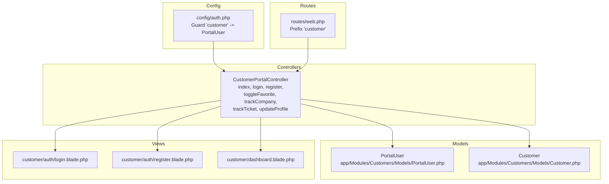
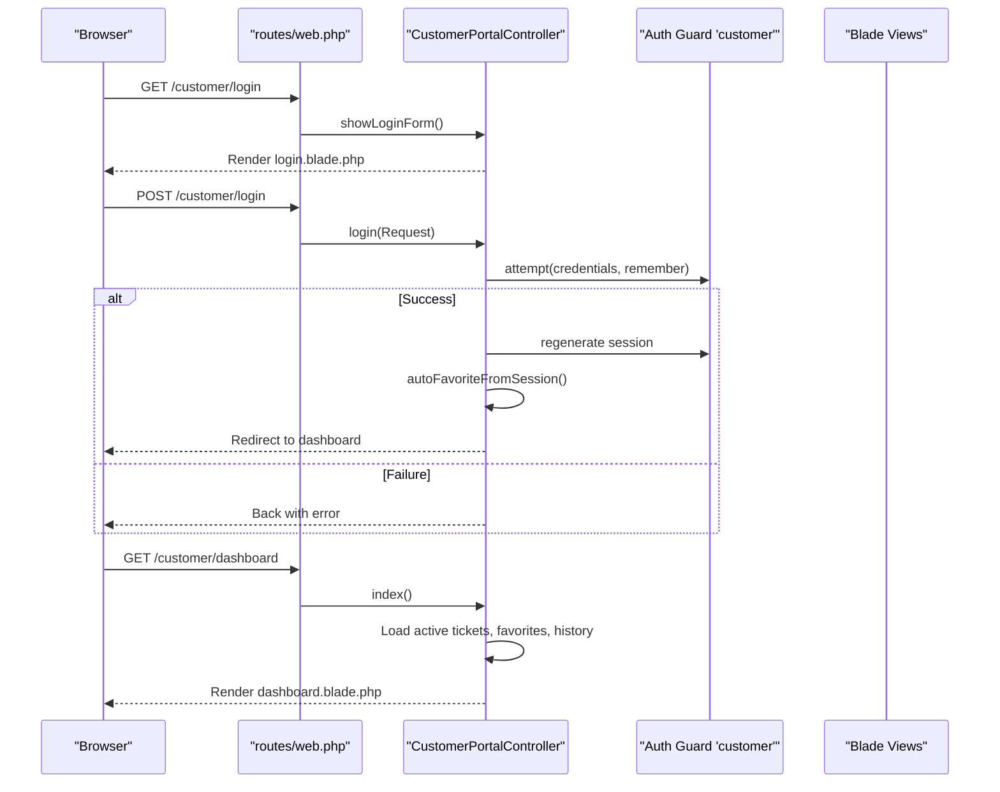
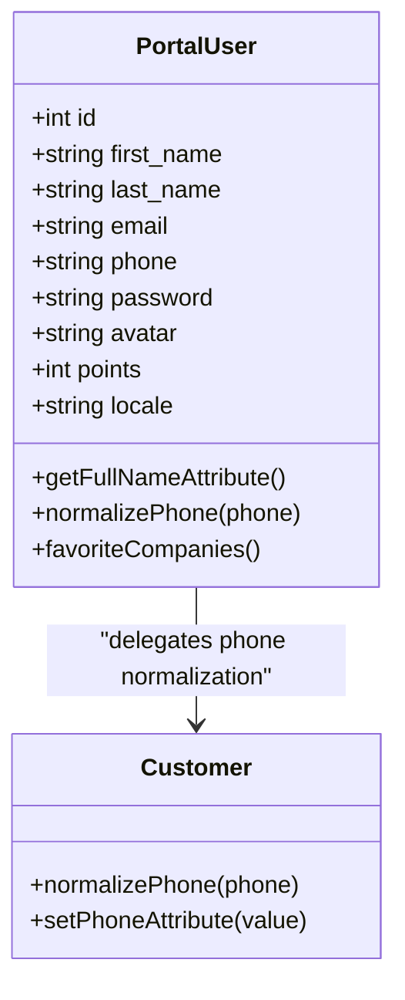
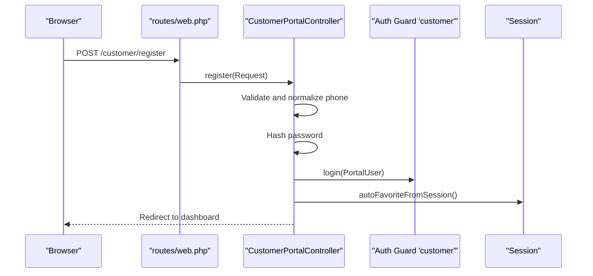
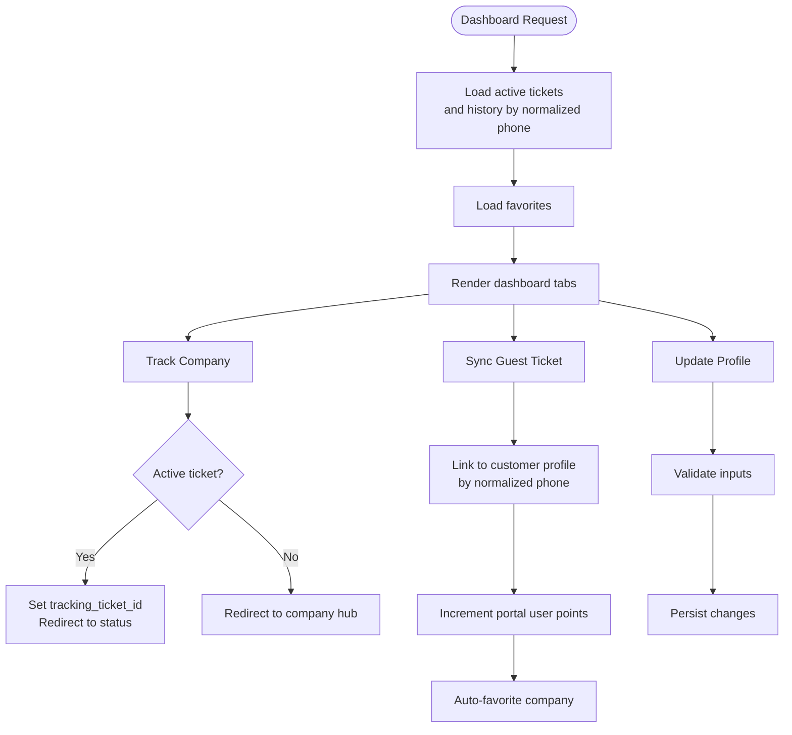
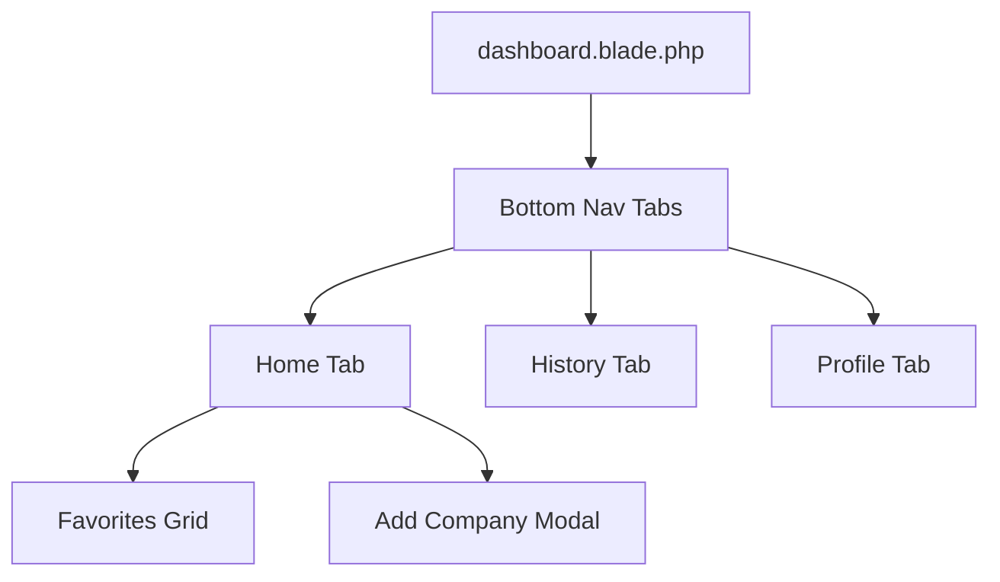
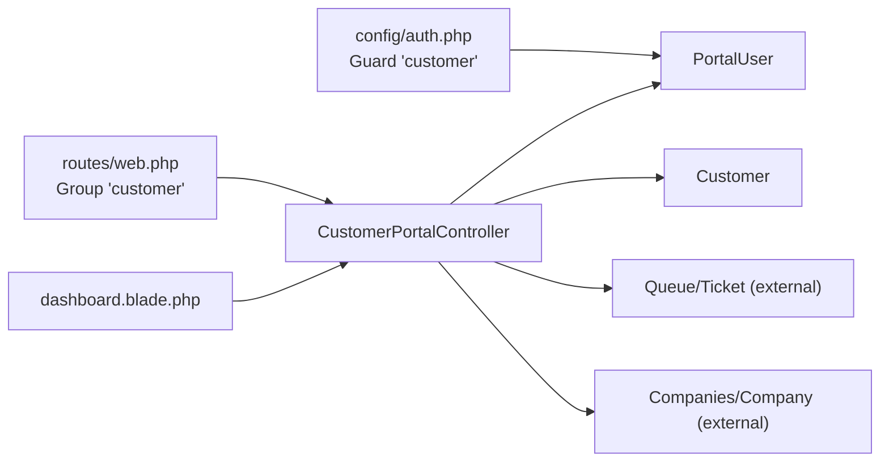

# Customer Portal

<cite>
**Referenced Files in This Document**
- [PortalUser.php](file://app/Modules/Customers/Models/PortalUser.php)
- [CustomerPortalController.php](file://app/Modules/Customers/Controllers/CustomerPortalController.php)
- [Customer.php](file://app/Modules/Customers/Models/Customer.php)
- [web.php](file://routes/web.php)
- [auth.php](file://config/auth.php)
- [login.blade.php](file://resources/views/customer/auth/login.blade.php)
- [register.blade.php](file://resources/views/customer/auth/register.blade.php)
- [dashboard.blade.php](file://resources/views/customer/dashboard.blade.php)
- [2026_05_08_144412_create_portal_users_table.php](file://database/migrations/2026_05_08_144412_create_portal_users_table.php)
- [AppointmentController.php](file://app/Modules/Appointments/Controllers/AppointmentController.php)
- [Appointment.php](file://app/Modules/Appointments/Models/Appointment.php)
- [login.blade.php (admin)](file://resources/views/auth/login.blade.php)
</cite>

## Table of Contents
1. [Introduction](#introduction)
2. [Project Structure](#project-structure)
3. [Core Components](#core-components)
4. [Architecture Overview](#architecture-overview)
5. [Detailed Component Analysis](#detailed-component-analysis)
6. [Dependency Analysis](#dependency-analysis)
7. [Performance Considerations](#performance-considerations)
8. [Troubleshooting Guide](#troubleshooting-guide)
9. [Conclusion](#conclusion)
10. [Appendices](#appendices)

## Introduction
The Customer Portal enables external customers to authenticate, manage their profile, track queue tickets, and add favorite companies. It integrates with the existing queue tracking system and supports self-service operations such as linking a guest ticket to a registered account and managing favorites. The portal uses a dedicated guard and model separate from internal administrative authentication.

## Project Structure
Key components involved in the Customer Portal:
- Authentication guard and provider configuration
- Portal user model and controller
- Blade templates for login, registration, and dashboard
- Routing for customer portal endpoints
- Integration with queue tracking and favorites
- Optional integration with the appointment system

**Diagram sources**
- [auth.php:40-78](file://config/auth.php#L40-L78)
- [web.php:35-55](file://routes/web.php#L35-L55)
- [PortalUser.php:10-69](file://app/Modules/Customers/Models/PortalUser.php#L10-L69)
- [Customer.php:12-171](file://app/Modules/Customers/Models/Customer.php#L12-L171)
- [CustomerPortalController.php:15-309](file://app/Modules/Customers/Controllers/CustomerPortalController.php#L15-L309)
- [login.blade.php:1-143](file://resources/views/customer/auth/login.blade.php#L1-L143)
- [register.blade.php:1-219](file://resources/views/customer/auth/register.blade.php#L1-L219)
- [dashboard.blade.php:1-549](file://resources/views/customer/dashboard.blade.php#L1-L549)

**Section sources**
- [auth.php:40-78](file://config/auth.php#L40-L78)
- [web.php:35-55](file://routes/web.php#L35-L55)

## Core Components
- PortalUser model
  - Dedicated Eloquent model for portal users with fillable attributes, hidden fields, and casts.
  - Provides normalized phone handling via shared logic with the Customer model.
  - Defines a many-to-many relationship to companies via favorites pivot table.
- CustomerPortalController
  - Handles login, registration, dashboard rendering, profile updates, favorites toggling/removal, and ticket tracking.
  - Implements session-based auto-favorite logic and secure ticket linking.
- Views
  - Login and registration forms for portal users.
  - Dashboard with tabs for home, history, and profile, including favorites grid and add-by-code modal.

**Section sources**
- [PortalUser.php:10-69](file://app/Modules/Customers/Models/PortalUser.php#L10-L69)
- [CustomerPortalController.php:15-309](file://app/Modules/Customers/Controllers/CustomerPortalController.php#L15-L309)
- [login.blade.php:1-143](file://resources/views/customer/auth/login.blade.php#L1-L143)
- [register.blade.php:1-219](file://resources/views/customer/auth/register.blade.php#L1-L219)
- [dashboard.blade.php:1-549](file://resources/views/customer/dashboard.blade.php#L1-L549)

## Architecture Overview
The portal leverages Laravel’s multi-guard authentication with a dedicated “customer” guard backed by the PortalUser model. Routes under the “customer” prefix enforce guest or auth middleware depending on intent. The controller orchestrates data retrieval, validation, and view rendering.

**Diagram sources**
- [web.php:35-55](file://routes/web.php#L35-L55)
- [CustomerPortalController.php:64-82](file://app/Modules/Customers/Controllers/CustomerPortalController.php#L64-L82)
- [login.blade.php:1-143](file://resources/views/customer/auth/login.blade.php#L1-L143)
- [dashboard.blade.php:1-549](file://resources/views/customer/dashboard.blade.php#L1-L549)

## Detailed Component Analysis

### PortalUser Model
- Purpose: Represents a customer portal user with authentication capabilities.
- Attributes and behavior:
  - Fillable fields include personal info, contact details, password, avatar, points, and locale.
  - Hidden fields exclude sensitive tokens.
  - Phone normalization delegated to the Customer model for consistency.
  - Full name accessor concatenates first and last names.
  - Favorite companies relationship via pivot table.

**Diagram sources**
- [PortalUser.php:10-69](file://app/Modules/Customers/Models/PortalUser.php#L10-L69)
- [Customer.php:18-45](file://app/Modules/Customers/Models/Customer.php#L18-L45)

**Section sources**
- [PortalUser.php:10-69](file://app/Modules/Customers/Models/PortalUser.php#L10-L69)
- [2026_05_08_144412_create_portal_users_table.php:14-35](file://database/migrations/2026_05_08_144412_create_portal_users_table.php#L14-L35)

### Authentication and Session Management
- Guard and Provider
  - The “customer” guard uses the PortalUser model provider.
- Login flow
  - Validates credentials, attempts authentication, regenerates session, and optionally auto-adds a company to favorites from session.
- Registration flow
  - Validates inputs, normalizes phone, hashes password, creates a PortalUser, logs them in, and auto-favorites a company if present in session.
- Logout
  - Clears current session and CSRF token, redirects to landing page.

**Diagram sources**
- [web.php:35-55](file://routes/web.php#L35-L55)
- [CustomerPortalController.php:95-119](file://app/Modules/Customers/Controllers/CustomerPortalController.php#L95-L119)
- [auth.php:40-78](file://config/auth.php#L40-L78)

**Section sources**
- [auth.php:40-78](file://config/auth.php#L40-L78)
- [CustomerPortalController.php:95-119](file://app/Modules/Customers/Controllers/CustomerPortalController.php#L95-L119)

### Dashboard Functionality and Self-Service Operations
- Dashboard rendering
  - Loads active tickets, favorites, and recent history for the authenticated portal user.
  - Uses phone normalization to match multiple customer profiles across companies.
- Favorites management
  - Toggle favorite, remove favorite, and add favorite by company code.
- Ticket tracking
  - Directly track a company from favorites or a specific ticket after verifying ownership.
  - Auto-link a guest ticket to the logged-in customer’s profile and award points.
- Profile management
  - Update name, email, and phone with uniqueness validation per portal user record.

**Diagram sources**
- [CustomerPortalController.php:20-51](file://app/Modules/Customers/Controllers/CustomerPortalController.php#L20-L51)
- [CustomerPortalController.php:234-255](file://app/Modules/Customers/Controllers/CustomerPortalController.php#L234-L255)
- [CustomerPortalController.php:160-202](file://app/Modules/Customers/Controllers/CustomerPortalController.php#L160-L202)
- [CustomerPortalController.php:282-296](file://app/Modules/Customers/Controllers/CustomerPortalController.php#L282-L296)

**Section sources**
- [CustomerPortalController.php:20-51](file://app/Modules/Customers/Controllers/CustomerPortalController.php#L20-L51)
- [CustomerPortalController.php:149-155](file://app/Modules/Customers/Controllers/CustomerPortalController.php#L149-L155)
- [CustomerPortalController.php:207-228](file://app/Modules/Customers/Controllers/CustomerPortalController.php#L207-L228)
- [CustomerPortalController.php:234-255](file://app/Modules/Customers/Controllers/CustomerPortalController.php#L234-L255)
- [CustomerPortalController.php:160-202](file://app/Modules/Customers/Controllers/CustomerPortalController.php#L160-L202)
- [CustomerPortalController.php:282-296](file://app/Modules/Customers/Controllers/CustomerPortalController.php#L282-L296)

### Portal UI Components, Navigation, and UX Patterns
- Dashboard layout
  - Top header with greeting and avatar.
  - Bottom navigation bar with three tabs: Home, History, Profile.
  - Home tab shows active tickets and favorites grid with remove actions.
  - History tab lists recent visits with status badges.
  - Profile tab allows updating name, email, and phone; includes logout.
- Forms and validation
  - Phone inputs use international tel library with client-side validation and hidden normalized value.
  - Error messages and success notifications are shown inline.
- Favorites management
  - Grid of favorite companies with logo thumbnails and remove button.
  - Modal to add a company by its unique code.

**Diagram sources**
- [dashboard.blade.php:275-456](file://resources/views/customer/dashboard.blade.php#L275-L456)

**Section sources**
- [dashboard.blade.php:275-456](file://resources/views/customer/dashboard.blade.php#L275-L456)

### Appointment Booking Integration
- Current integration scope
  - The portal dashboard does not directly expose appointment booking screens.
  - The admin appointment system exists separately and is not integrated into the customer portal UI.
- Potential extension points
  - The portal could link to the appointment calendar UI or embed booking widgets if desired.
  - No explicit routes or controller actions exist in the portal for appointments.

**Section sources**
- [AppointmentController.php:14-211](file://app/Modules/Appointments/Controllers/AppointmentController.php#L14-L211)
- [Appointment.php:10-183](file://app/Modules/Appointments/Models/Appointment.php#L10-L183)
- [web.php:196-218](file://routes/web.php#L196-L218)

## Dependency Analysis
- Authentication
  - The “customer” guard uses the PortalUser model provider.
- Controllers and Models
  - CustomerPortalController depends on PortalUser, Customer, Company, and Ticket models.
- Routing
  - Customer portal routes are grouped under “customer” with guest and auth middleware applied.
- UI and UX
  - Dashboard uses Bootstrap and custom styles; international phone input is handled via JavaScript.

**Diagram sources**
- [auth.php:40-78](file://config/auth.php#L40-L78)
- [web.php:35-55](file://routes/web.php#L35-L55)
- [CustomerPortalController.php:15-309](file://app/Modules/Customers/Controllers/CustomerPortalController.php#L15-L309)

**Section sources**
- [auth.php:40-78](file://config/auth.php#L40-L78)
- [web.php:35-55](file://routes/web.php#L35-L55)

## Performance Considerations
- Query scopes and tenant isolation
  - The controller bypasses tenant/global scopes for ticket queries to ensure cross-company visibility for the logged-in customer. This is intentional but should be monitored for performance on large datasets.
- Phone normalization
  - Normalization occurs consistently via shared logic to avoid duplicates and improve lookup reliability.
- Session usage
  - Auto-favorite and ticket tracking rely on session keys; ensure session driver performance aligns with expected traffic.

[No sources needed since this section provides general guidance]

## Troubleshooting Guide
- Login failures
  - Ensure credentials match a PortalUser record; invalid credentials trigger a failure message on the login page.
- Registration issues
  - Unique constraints apply to email and phone; validation errors surface on the registration page.
- Ticket tracking errors
  - Direct ticket tracking requires the ticket belong to one of the customer’s profiles derived from the normalized phone; otherwise a 403 is returned.
- Session-related issues
  - If auto-favorite or sync-ticket does not work, verify the presence of expected session keys.

**Section sources**
- [CustomerPortalController.php:64-82](file://app/Modules/Customers/Controllers/CustomerPortalController.php#L64-L82)
- [CustomerPortalController.php:95-119](file://app/Modules/Customers/Controllers/CustomerPortalController.php#L95-L119)
- [CustomerPortalController.php:270-277](file://app/Modules/Customers/Controllers/CustomerPortalController.php#L270-L277)

## Conclusion
The Customer Portal provides a focused, secure experience for customers to authenticate, manage their profile, track queue tickets, and curate favorite companies. Its design leverages Laravel’s guard system, normalized phone handling, and session-driven convenience features. While the portal currently focuses on queue tracking and profile management, future enhancements could integrate appointment booking capabilities.

## Appendices

### Authentication and Authorization Summary
- Guards and Providers
  - “customer” guard configured to use PortalUser model.
- Middleware
  - Routes under “customer” use guest:customer for login/register and auth:customer for protected actions.
- UI Links
  - Admin login page includes a link to the customer portal login.

**Section sources**
- [auth.php:40-78](file://config/auth.php#L40-L78)
- [web.php:35-55](file://routes/web.php#L35-L55)
- [login.blade.php (admin):540-548](file://resources/views/auth/login.blade.php#L540-L548)