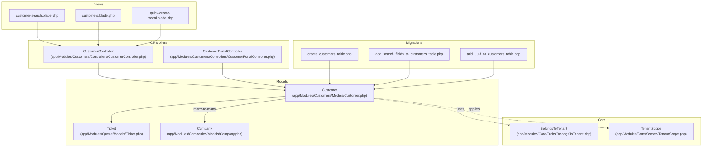
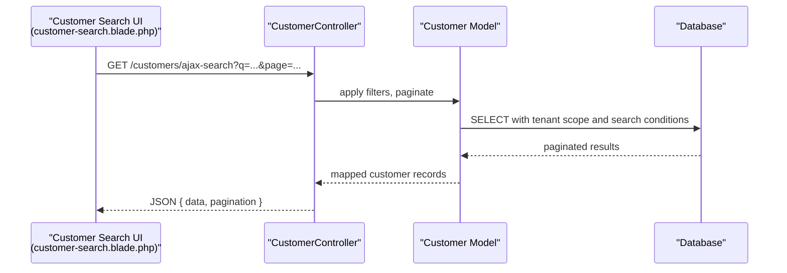
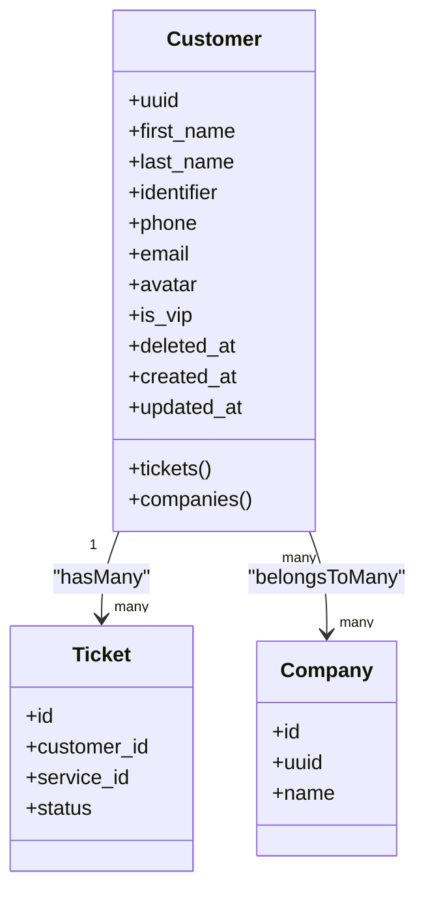
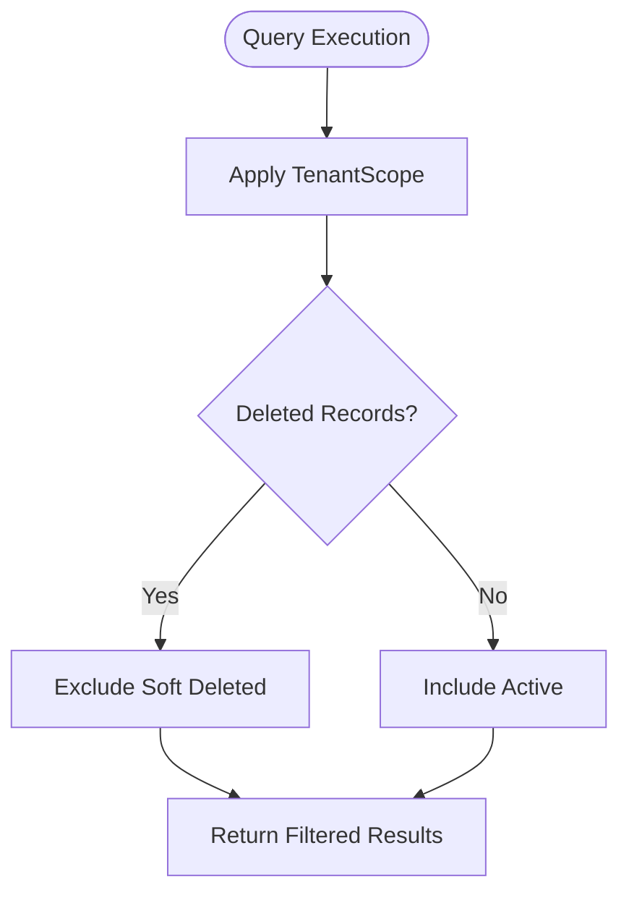
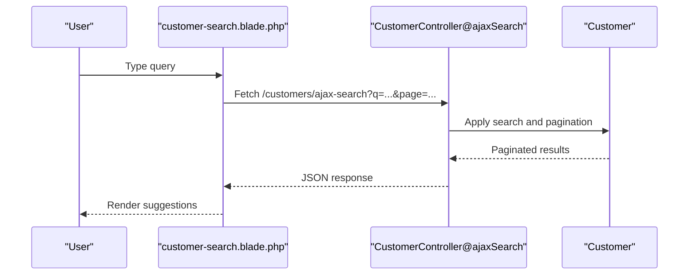
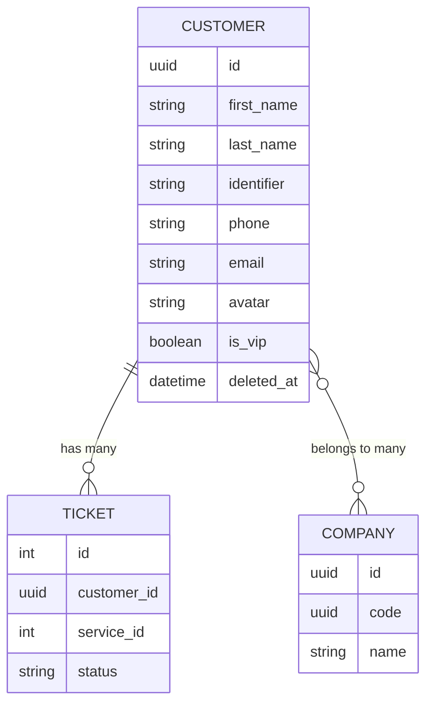
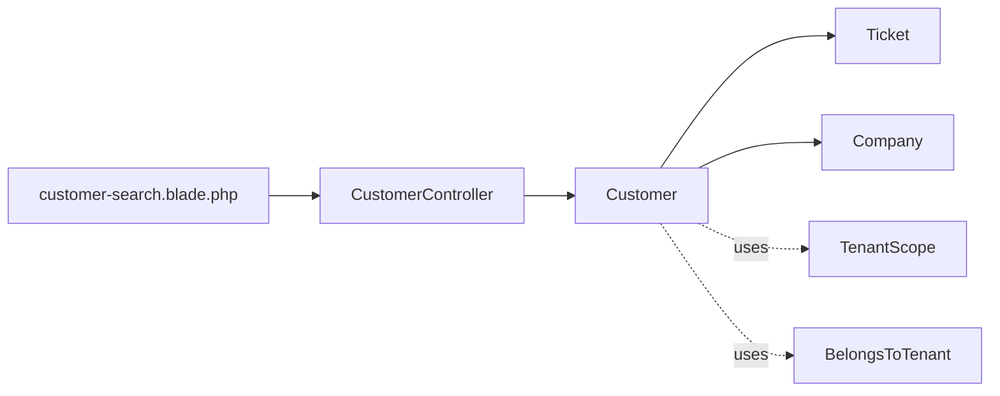

# Customer Profiles

<cite>
**Referenced Files in This Document**
- [Customer.php](file://app/Modules/Customers/Models/Customer.php)
- [CustomerController.php](file://app/Modules/Customers/Controllers/CustomerController.php)
- [CustomerPortalController.php](file://app/Modules/Customers/Controllers/CustomerPortalController.php)
- [Ticket.php](file://app/Modules/Queue/Models/Ticket.php)
- [Company.php](file://app/Modules/Companies/Models/Company.php)
- [TenantScope.php](file://app/Modules/Core/Scopes/TenantScope.php)
- [BelongsToTenant.php](file://app/Modules/Core/Traits/BelongsToTenant.php)
- [2026_04_06_163000_create_customers_table.php](file://database/migrations/2026_04_06_163000_create_customers_table.php)
- [2026_04_13_000001_add_whatsapp_fields_to_customers_table.php](file://database/migrations/2026_04_13_000001_add_whatsapp_fields_to_customers_table.php)
- [2026_04_08_170708_add_timezone_to_companies_table.php](file://database/migrations/2026_04_08_170708_add_timezone_to_companies_table.php)
- [2026_05_21_120002_add_uuid_to_customers_table.php](file://database/migrations/2026_05_21_120002_add_uuid_to_customers_table.php)
- [2026_05_21_120004_add_uuid_to_companies_table.php](file://database/migrations/2026_05_21_120004_add_uuid_to_companies_table.php)
- [2026_06_08_080000_add_search_fields_to_customers_table.php](file://database/migrations/2026_06_08_080000_add_search_fields_to_customers_table.php)
- [customer-search.blade.php](file://resources/views/components/customer-search.blade.php)
- [customers.blade.php](file://resources/views/pages/customers.blade.php)
- [modals.blade.php](file://resources/views/pages/customers/partials/modals.blade.php)
- [quick-create-modal.blade.php](file://resources/views/components/quick-create-modal.blade.php)
</cite>

## Table of Contents
1. [Introduction](#introduction)
2. [Project Structure](#project-structure)
3. [Core Components](#core-components)
4. [Architecture Overview](#architecture-overview)
5. [Detailed Component Analysis](#detailed-component-analysis)
6. [Dependency Analysis](#dependency-analysis)
7. [Performance Considerations](#performance-considerations)
8. [Troubleshooting Guide](#troubleshooting-guide)
9. [Conclusion](#conclusion)

## Introduction
This document details the Customer Profiles subsystem, focusing on the Customer model, its fields and relationships, tenant scoping, soft deletes, UUID-based routing, phone normalization, VIP status, filtering/search, and integrations with Tickets and Companies. It also covers UI flows for creating, updating, and searching customer profiles.

## Project Structure
The Customer Profiles feature spans models, controllers, traits, scopes, migrations, and frontend components/views:
- Model: Customer
- Controllers: CustomerController (admin), CustomerPortalController (portal)
- Traits/Scopes: BelongsToTenant, TenantScope
- Migrations: customers table creation and enhancements (UUID, search fields, WhatsApp)
- Frontend: customer search component, customer management page, quick-create modal

**Diagram sources**
- [Customer.php](file://app/Modules/Customers/Models/Customer.php)
- [CustomerController.php](file://app/Modules/Customers/Controllers/CustomerController.php)
- [CustomerPortalController.php](file://app/Modules/Customers/Controllers/CustomerPortalController.php)
- [Ticket.php](file://app/Modules/Queue/Models/Ticket.php)
- [Company.php](file://app/Modules/Companies/Models/Company.php)
- [BelongsToTenant.php](file://app/Modules/Core/Traits/BelongsToTenant.php)
- [TenantScope.php](file://app/Modules/Core/Scopes/TenantScope.php)
- [2026_04_06_163000_create_customers_table.php](file://database/migrations/2026_04_06_163000_create_customers_table.php)
- [2026_06_08_080000_add_search_fields_to_customers_table.php](file://database/migrations/2026_06_08_080000_add_search_fields_to_customers_table.php)
- [2026_05_21_120002_add_uuid_to_customers_table.php](file://database/migrations/2026_05_21_120002_add_uuid_to_customers_table.php)
- [customer-search.blade.php](file://resources/views/components/customer-search.blade.php)
- [customers.blade.php](file://resources/views/pages/customers.blade.php)
- [quick-create-modal.blade.php](file://resources/views/components/quick-create-modal.blade.php)

**Section sources**
- [Customer.php](file://app/Modules/Customers/Models/Customer.php)
- [CustomerController.php](file://app/Modules/Customers/Controllers/CustomerController.php)
- [CustomerPortalController.php](file://app/Modules/Customers/Controllers/CustomerPortalController.php)
- [Ticket.php](file://app/Modules/Queue/Models/Ticket.php)
- [Company.php](file://app/Modules/Companies/Models/Company.php)
- [BelongsToTenant.php](file://app/Modules/Core/Traits/BelongsToTenant.php)
- [TenantScope.php](file://app/Modules/Core/Scopes/TenantScope.php)
- [2026_04_06_163000_create_customers_table.php](file://database/migrations/2026_04_06_163000_create_customers_table.php)
- [2026_04_13_000001_add_whatsapp_fields_to_customers_table.php](file://database/migrations/2026_04_13_000001_add_whatsapp_fields_to_customers_table.php)
- [2026_04_08_170708_add_timezone_to_companies_table.php](file://database/migrations/2026_04_08_170708_add_timezone_to_companies_table.php)
- [2026_05_21_120002_add_uuid_to_customers_table.php](file://database/migrations/2026_05_21_120002_add_uuid_to_customers_table.php)
- [2026_05_21_120004_add_uuid_to_companies_table.php](file://database/migrations/2026_05_21_120004_add_uuid_to_companies_table.php)
- [2026_06_08_080000_add_search_fields_to_customers_table.php](file://database/migrations/2026_06_08_080000_add_search_fields_to_customers_table.php)
- [customer-search.blade.php](file://resources/views/components/customer-search.blade.php)
- [customers.blade.php](file://resources/views/pages/customers.blade.php)
- [modals.blade.php](file://resources/views/pages/customers/partials/modals.blade.php)
- [quick-create-modal.blade.php](file://resources/views/components/quick-create-modal.blade.php)

## Core Components
- Customer model encapsulates personal info (first_name, last_name, identifier), contact details (phone, email, avatar), VIP status, soft deletes, tenant scoping, and UUID routing. It relates to Tickets (one-to-many) and Companies via a many-to-many association.
- Controllers expose CRUD and search endpoints for administrators and portal users.
- Tenant scoping ensures multi-tenant isolation using a trait and global scope.
- Search and filtering UI components integrate with AJAX endpoints for responsive customer selection and listing.

Key implementation anchors:
- Model definition and relationships: [Customer.php](file://app/Modules/Customers/Models/Customer.php)
- Admin controller actions: [CustomerController.php](file://app/Modules/Customers/Controllers/CustomerController.php)
- Portal controller actions: [CustomerPortalController.php](file://app/Modules/Customers/Controllers/CustomerPortalController.php)
- Tenant scoping trait: [BelongsToTenant.php](file://app/Modules/Core/Traits/BelongsToTenant.php)
- Tenant scope registration: [TenantScope.php](file://app/Modules/Core/Scopes/TenantScope.php)
- Migrations for schema and enhancements: [2026_04_06_163000_create_customers_table.php](file://database/migrations/2026_04_06_163000_create_customers_table.php), [2026_06_08_080000_add_search_fields_to_customers_table.php](file://database/migrations/2026_06_08_080000_add_search_fields_to_customers_table.php), [2026_05_21_120002_add_uuid_to_customers_table.php](file://database/migrations/2026_05_21_120002_add_uuid_to_customers_table.php)

**Section sources**
- [Customer.php](file://app/Modules/Customers/Models/Customer.php)
- [CustomerController.php](file://app/Modules/Customers/Controllers/CustomerController.php)
- [CustomerPortalController.php](file://app/Modules/Customers/Controllers/CustomerPortalController.php)
- [BelongsToTenant.php](file://app/Modules/Core/Traits/BelongsToTenant.php)
- [TenantScope.php](file://app/Modules/Core/Scopes/TenantScope.php)
- [2026_04_06_163000_create_customers_table.php](file://database/migrations/2026_04_06_163000_create_customers_table.php)
- [2026_06_08_080000_add_search_fields_to_customers_table.php](file://database/migrations/2026_06_08_080000_add_search_fields_to_customers_table.php)
- [2026_05_21_120002_add_uuid_to_customers_table.php](file://database/migrations/2026_05_21_120002_add_uuid_to_customers_table.php)

## Architecture Overview
The Customer Profiles feature follows a layered architecture:
- Presentation layer: Blade components and pages handle search, listing, and quick-create flows.
- Application layer: Controllers orchestrate requests, apply validation, and delegate to services/models.
- Domain layer: Customer model manages persistence, relationships, and tenant scoping.
- Infrastructure layer: Migrations define schema, casts, and indexes; middleware ensures tenant context.

**Diagram sources**
- [customer-search.blade.php](file://resources/views/components/customer-search.blade.php)
- [CustomerController.php](file://app/Modules/Customers/Controllers/CustomerController.php)
- [Customer.php](file://app/Modules/Customers/Models/Customer.php)

## Detailed Component Analysis

### Customer Model
The Customer model defines:
- Personal information: first_name, last_name, identifier (supports CIN or file_number)
- Contact details: phone, email, avatar
- VIP status: boolean flag
- Soft deletes: deleted_at column
- UUID routing: uuid field for resource identifiers
- Relationships:
  - One-to-many with Tickets
  - Many-to-many with Companies
- Tenant scoping: belongsToTenant trait and TenantScope global scope
- Hidden attributes and casts: sensitive fields hidden, boolean fields cast appropriately

Implementation highlights:
- Fields and casts are defined in the model class.
- Relationships are declared as methods returning Eloquent relations.
- Tenant scoping is applied globally via TenantScope and per-instance via BelongsToTenant trait.
- UUID routing is enabled by setting the model's $keyType to string and $incrementing to false.

**Diagram sources**
- [Customer.php](file://app/Modules/Customers/Models/Customer.php)
- [Ticket.php](file://app/Modules/Queue/Models/Ticket.php)
- [Company.php](file://app/Modules/Companies/Models/Company.php)

**Section sources**
- [Customer.php](file://app/Modules/Customers/Models/Customer.php)
- [Ticket.php](file://app/Modules/Queue/Models/Ticket.php)
- [Company.php](file://app/Modules/Companies/Models/Company.php)

### Phone Number Normalization and International Formatting
The system supports Moroccan phone numbers and international formatting. While the exact normalization logic is not visible here, typical approaches include:
- Stripping non-digit characters
- Enforcing country code (+212) for Moroccan numbers
- Standardizing to E.164 format for interoperability
- Storing normalized values in the phone field while allowing user-friendly display formats

Operational guidance:
- Normalize on input and update flows
- Validate against regional patterns
- Maintain separate display/format fields if needed

[No sources needed since this section provides general guidance]

### Soft Delete Functionality and Tenant Scoping
Soft deletes:
- The model uses Laravel's soft deletes with a deleted_at timestamp.
- Deleted records are excluded from default queries unless explicitly requested.

Tenant scoping:
- Trait BelongsToTenant assigns tenant context to model instances.
- TenantScope applies a global scope to filter queries by tenant automatically.

**Diagram sources**
- [BelongsToTenant.php](file://app/Modules/Core/Traits/BelongsToTenant.php)
- [TenantScope.php](file://app/Modules/Core/Scopes/TenantScope.php)
- [Customer.php](file://app/Modules/Customers/Models/Customer.php)

**Section sources**
- [BelongsToTenant.php](file://app/Modules/Core/Traits/BelongsToTenant.php)
- [TenantScope.php](file://app/Modules/Core/Scopes/TenantScope.php)
- [Customer.php](file://app/Modules/Customers/Models/Customer.php)

### UUID-Based Routing
The Customer model uses UUIDs for routing:
- $keyType is string and $incrementing is false
- Routes accept uuid parameters
- Controllers resolve Customer by uuid

Benefits:
- Prevents enumeration of internal IDs
- Supports external integrations with stable identifiers

**Section sources**
- [2026_05_21_120002_add_uuid_to_customers_table.php](file://database/migrations/2026_05_21_120002_add_uuid_to_customers_table.php)
- [Customer.php](file://app/Modules/Customers/Models/Customer.php)

### Customer Filtering and Search
Search capabilities:
- Full-text or substring matching across multiple fields (e.g., name, identifier, phone)
- Pagination support for large result sets
- Status-based filtering (e.g., VIP) via query parameters

AJAX-driven UI:
- Debounced input triggers search requests
- Infinite scroll loads additional pages
- Quick-create modal allows adding new customers inline

**Diagram sources**
- [customer-search.blade.php](file://resources/views/components/customer-search.blade.php)
- [CustomerController.php](file://app/Modules/Customers/Controllers/CustomerController.php)
- [Customer.php](file://app/Modules/Customers/Models/Customer.php)

**Section sources**
- [customer-search.blade.php](file://resources/views/components/customer-search.blade.php)
- [customers.blade.php](file://resources/views/pages/customers.blade.php)
- [CustomerController.php](file://app/Modules/Customers/Controllers/CustomerController.php)
- [2026_06_08_080000_add_search_fields_to_customers_table.php](file://database/migrations/2026_06_08_080000_add_search_fields_to_customers_table.php)

### Relationships with Tickets and Favorites
Tickets:
- Each ticket references a customer via customer_id
- Customers have many tickets

Favorites:
- Not present in the current model or migrations; if needed, introduce a favorites pivot table and belongsToMany relationship on the Customer model.

**Diagram sources**
- [Customer.php](file://app/Modules/Customers/Models/Customer.php)
- [Ticket.php](file://app/Modules/Queue/Models/Ticket.php)
- [Company.php](file://app/Modules/Companies/Models/Company.php)

**Section sources**
- [Customer.php](file://app/Modules/Customers/Models/Customer.php)
- [Ticket.php](file://app/Modules/Queue/Models/Ticket.php)
- [Company.php](file://app/Modules/Companies/Models/Company.php)

### Examples

#### Creating a Customer
- UI: Quick-create modal captures first_name, last_name, identifier, phone, email, is_vip.
- Backend: Controller validates and persists a new Customer record under the current tenant.
- Result: New customer returned with uuid for routing.

**Section sources**
- [modals.blade.php](file://resources/views/pages/customers/partials/modals.blade.php)
- [quick-create-modal.blade.php](file://resources/views/components/quick-create-modal.blade.php)
- [CustomerController.php](file://app/Modules/Customers/Controllers/CustomerController.php)

#### Updating a Customer Profile
- UI: Edit modal pre-fills fields and toggles VIP status.
- Backend: Controller resolves by uuid, applies validation, updates attributes, and persists changes.

**Section sources**
- [customers.blade.php](file://resources/views/pages/customers.blade.php)
- [CustomerController.php](file://app/Modules/Customers/Controllers/CustomerController.php)

#### Searching Customers
- UI: Debounced input triggers AJAX search with pagination and infinite scroll.
- Backend: Controller applies tenant scope, search filters, and returns paginated JSON.

**Section sources**
- [customer-search.blade.php](file://resources/views/components/customer-search.blade.php)
- [CustomerController.php](file://app/Modules/Customers/Controllers/CustomerController.php)

### Data Validation, Hidden Attributes, and Boolean Casting
- Validation: Controllers enforce required fields and formats (e.g., email, phone).
- Hidden attributes: Sensitive fields are hidden from serialization.
- Boolean casting: VIP status and similar flags are cast to booleans for consistent handling.

**Section sources**
- [CustomerController.php](file://app/Modules/Customers/Controllers/CustomerController.php)
- [Customer.php](file://app/Modules/Customers/Models/Customer.php)

## Dependency Analysis
- Controllers depend on the Customer model for persistence and on tenant context middleware/trait for scoping.
- The Customer model depends on Eloquent relationships and tenant scoping infrastructure.
- Views depend on AJAX endpoints and modal components for UX.

**Diagram sources**
- [customer-search.blade.php](file://resources/views/components/customer-search.blade.php)
- [CustomerController.php](file://app/Modules/Customers/Controllers/CustomerController.php)
- [Customer.php](file://app/Modules/Customers/Models/Customer.php)
- [Ticket.php](file://app/Modules/Queue/Models/Ticket.php)
- [Company.php](file://app/Modules/Companies/Models/Company.php)
- [TenantScope.php](file://app/Modules/Core/Scopes/TenantScope.php)
- [BelongsToTenant.php](file://app/Modules/Core/Traits/BelongsToTenant.php)

**Section sources**
- [CustomerController.php](file://app/Modules/Customers/Controllers/CustomerController.php)
- [Customer.php](file://app/Modules/Customers/Models/Customer.php)
- [Ticket.php](file://app/Modules/Queue/Models/Ticket.php)
- [Company.php](file://app/Modules/Companies/Models/Company.php)
- [TenantScope.php](file://app/Modules/Core/Scopes/TenantScope.php)
- [BelongsToTenant.php](file://app/Modules/Core/Traits/BelongsToTenant.php)

## Performance Considerations
- Index search fields to accelerate LIKE or full-text searches.
- Use pagination and limit results per page to avoid heavy payloads.
- Leverage tenant scoping to minimize cross-tenant scans.
- Cache frequently accessed customer lists per tenant.

[No sources needed since this section provides general guidance]

## Troubleshooting Guide
- Search returns empty results:
  - Verify tenant context is set and TenantScope is active.
  - Confirm search fields are indexed and query parameters are passed correctly.
- Phone normalization issues:
  - Ensure normalization runs before save and validation accepts standardized formats.
- UUID routing failures:
  - Confirm routes accept uuid and model resolves by uuid.
- Soft delete visibility:
  - Use appropriate query scopes to include or exclude deleted records.

**Section sources**
- [CustomerController.php](file://app/Modules/Customers/Controllers/CustomerController.php)
- [Customer.php](file://app/Modules/Customers/Models/Customer.php)
- [TenantScope.php](file://app/Modules/Core/Scopes/TenantScope.php)

## Conclusion
The Customer Profiles subsystem integrates a robust model with tenant scoping, UUID routing, soft deletes, and rich search/filtering. Its relationships with Tickets and Companies enable comprehensive customer-centric workflows, while the frontend components deliver responsive UX for creation, editing, and discovery.