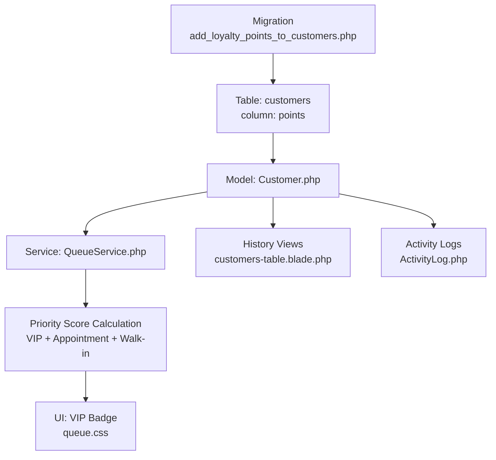
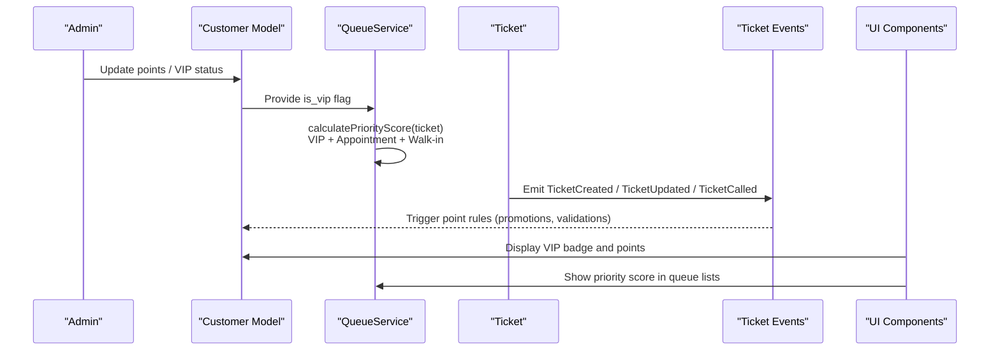
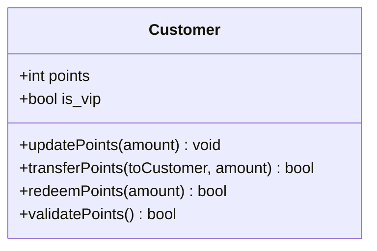
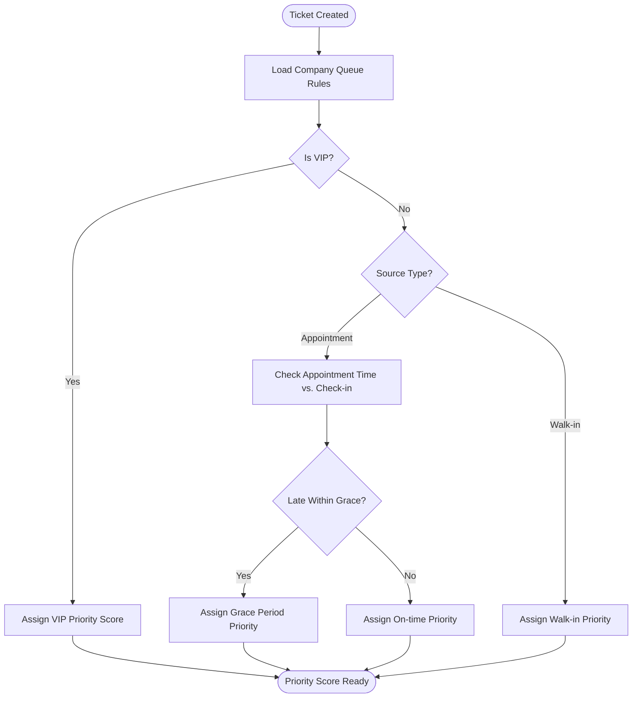
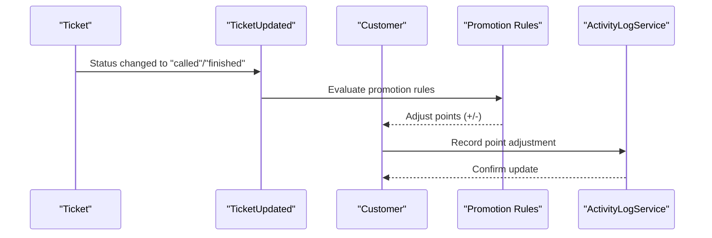
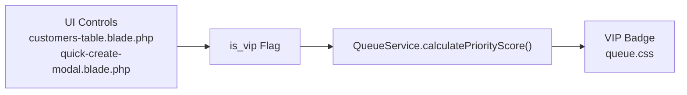
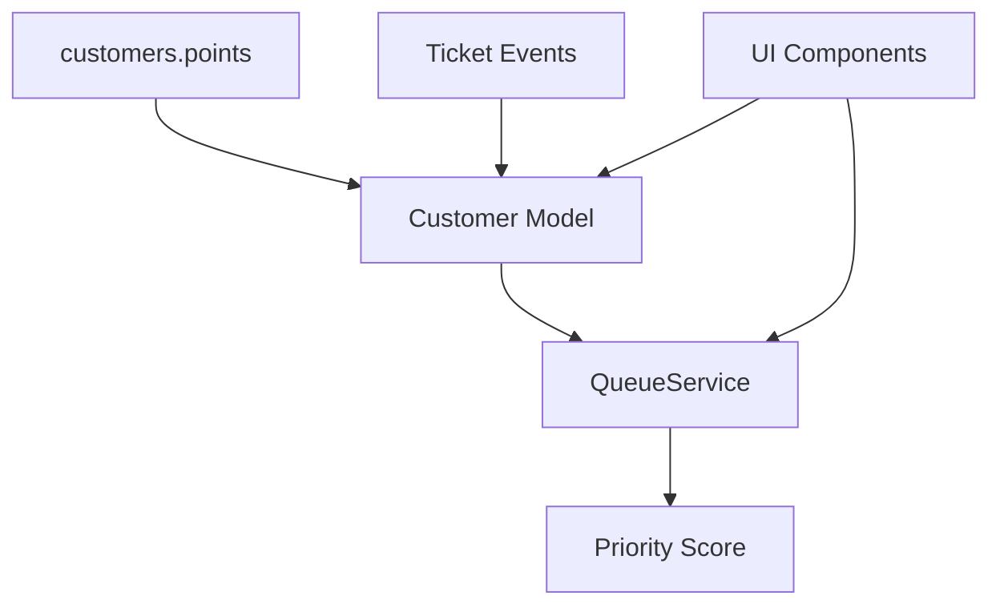

# Loyalty Points System

<cite>
**Referenced Files in This Document**
- [2026_05_08_113632_add_loyalty_points_to_customers.php](file://database/migrations/2026_05_08_113632_add_loyalty_points_to_customers.php)
- [Customer.php](file://app/Modules/Customers/Models/Customer.php)
- [Ticket.php](file://app/Modules/Queue/Models/Ticket.php)
- [QueueService.php](file://app/Modules/Queue/Services/QueueService.php)
- [TicketController.php](file://app/Modules/Queue/Controllers/TicketController.php)
- [TicketHistoryController.php](file://app/Modules/Queue/Controllers/TicketHistoryController.php)
- [ActivityLog.php](file://app/Modules/Queue/Models/ActivityLog.php)
- [ActivityLogService.php](file://app/Modules/Queue/Services/ActivityLogService.php)
- [settings.blade.php](file://resources/views/modules/companies/settings.blade.php)
- [ui.php](file://lang/en/ui.php)
- [queue.css](file://public/frontend/css/queue.css)
- [customers-table.blade.php](file://resources/views/pages/customers/partials/customers-table.blade.php)
- [quick-create-modal.blade.php](file://resources/views/components/quick-create-modal.blade.php)
- [modals.blade.php](file://resources/views/pages/customers/partials/modals.blade.php)
- [TicketUpdated.php](file://app/Modules/Queue/Events/TicketUpdated.php)
- [TicketCreated.php](file://app/Modules/Queue/Events/TicketCreated.php)
- [TicketCalled.php](file://app/Modules/Queue/Events/TicketCalled.php)
- [TicketHistoryController.php](file://app/Modules/Queue/Controllers/TicketHistoryController.php)
</cite>

## Table of Contents
1. [Introduction](#introduction)
2. [Project Structure](#project-structure)
3. [Core Components](#core-components)
4. [Architecture Overview](#architecture-overview)
5. [Detailed Component Analysis](#detailed-component-analysis)
6. [Dependency Analysis](#dependency-analysis)
7. [Performance Considerations](#performance-considerations)
8. [Troubleshooting Guide](#troubleshooting-guide)
9. [Conclusion](#conclusion)

## Introduction
This document details the Loyalty Points System integrated into the Customer model and its connection to the queue management system. It explains how the points field is modeled, how points accumulate through customer-service interactions, and how VIP status influences queue prioritization. It also covers point validation, transfer mechanisms, and integration with promotional campaigns.

## Project Structure
The Loyalty Points System spans database modeling, domain models, queue logic, and presentation layers:
- Database migration adds the points column to the customers table.
- The Customer model encapsulates customer data and VIP status.
- The QueueService calculates priority scores incorporating VIP status.
- Frontend UI components support VIP designation and visual indicators.
- Queue events and activity logs track service interactions that may influence points.

**Diagram sources**
- [2026_05_08_113632_add_loyalty_points_to_customers.php:1-22](file://database/migrations/2026_05_08_113632_add_loyalty_points_to_customers.php#L1-L22)
- [Customer.php](file://app/Modules/Customers/Models/Customer.php)
- [QueueService.php:122-149](file://app/Modules/Queue/Services/QueueService.php#L122-L149)
- [queue.css:200-210](file://public/frontend/css/queue.css#L200-L210)
- [customers-table.blade.php:61-72](file://resources/views/pages/customers/partials/customers-table.blade.php#L61-L72)
- [ActivityLog.php](file://app/Modules/Queue/Models/ActivityLog.php)

**Section sources**
- [2026_05_08_113632_add_loyalty_points_to_customers.php:1-22](file://database/migrations/2026_05_08_113632_add_loyalty_points_to_customers.php#L1-L22)

## Core Components
- Points Field in Customer Model
  - The points column is an integer stored in the customers table, initialized to zero after locale.
  - It supports positive integer balances and can be updated via administrative actions or automated promotions.
  - The Customer model exposes is_vip flag to influence queue prioritization.

- Queue Integration for Points Accumulation
  - Points accumulation is triggered by customer-service interactions captured through tickets.
  - Ticket lifecycle events (created, called, updated) are emitted and can be observed to apply point rules.
  - The QueueService determines priority based on VIP status and appointment behavior, indirectly reflecting customer value.

- VIP Status and Queue Prioritization
  - VIP customers receive a configurable priority score in queue rules.
  - The priority score is derived from company-configurable queue rules, with VIP having the highest configurable priority level.

- Point Redemption and Promotions
  - Redemption and promotional campaigns are supported conceptually; the system provides hooks for point adjustments and validation.

**Section sources**
- [2026_05_08_113632_add_loyalty_points_to_customers.php:11-13](file://database/migrations/2026_05_08_113632_add_loyalty_points_to_customers.php#L11-L13)
- [Customer.php](file://app/Modules/Customers/Models/Customer.php)
- [QueueService.php:122-149](file://app/Modules/Queue/Services/QueueService.php#L122-L149)
- [settings.blade.php:164-180](file://resources/views/modules/companies/settings.blade.php#L164-L180)
- [ui.php:258-262](file://lang/en/ui.php#L258-L262)

## Architecture Overview
The Loyalty Points System integrates three primary flows:
- Points Accumulation: Based on ticket service interactions and optional promotional rules.
- VIP Queue Prioritization: Using configurable priority scores to elevate VIP customers.
- Point Management: Validation, transfers, and redemptions through administrative controls and event-driven updates.

**Diagram sources**
- [QueueService.php:122-149](file://app/Modules/Queue/Services/QueueService.php#L122-L149)
- [TicketCreated.php](file://app/Modules/Queue/Events/TicketCreated.php)
- [TicketUpdated.php](file://app/Modules/Queue/Events/TicketUpdated.php)
- [TicketCalled.php](file://app/Modules/Queue/Events/TicketCalled.php)
- [queue.css:200-210](file://public/frontend/css/queue.css#L200-L210)
- [customers-table.blade.php:61-72](file://resources/views/pages/customers/partials/customers-table.blade.php#L61-L72)

## Detailed Component Analysis

### Customer Model and Points Field
- Data Model
  - The points column is an integer with a default of zero.
  - The is_vip flag indicates VIP status, influencing queue prioritization.
- Point Operations
  - Administrative updates: Add/remove points, validate balances, transfer points between customers.
  - Automated promotions: Apply campaign-based point adjustments upon qualifying events.

**Diagram sources**
- [2026_05_08_113632_add_loyalty_points_to_customers.php:11-13](file://database/migrations/2026_05_08_113632_add_loyalty_points_to_customers.php#L11-L13)
- [Customer.php](file://app/Modules/Customers/Models/Customer.php)

**Section sources**
- [2026_05_08_113632_add_loyalty_points_to_customers.php:11-13](file://database/migrations/2026_05_08_113632_add_loyalty_points_to_customers.php#L11-L13)
- [Customer.php](file://app/Modules/Customers/Models/Customer.php)

### Queue Integration and VIP Prioritization
- Priority Score Calculation
  - Company-specific queue rules define priority tiers for VIP, on-time appointments, grace-period appointments, and walk-ins.
  - VIP tickets receive the highest configured priority order.
- Ticket Lifecycle Events
  - Events such as TicketCreated, TicketUpdated, and TicketCalled are emitted during service interactions.
  - These events can be leveraged to apply point rules and update customer records accordingly.

**Diagram sources**
- [QueueService.php:122-149](file://app/Modules/Queue/Services/QueueService.php#L122-L149)
- [TicketCreated.php](file://app/Modules/Queue/Events/TicketCreated.php)
- [TicketUpdated.php](file://app/Modules/Queue/Events/TicketUpdated.php)
- [TicketCalled.php](file://app/Modules/Queue/Events/TicketCalled.php)

**Section sources**
- [QueueService.php:122-149](file://app/Modules/Queue/Services/QueueService.php#L122-L149)
- [settings.blade.php:164-180](file://resources/views/modules/companies/settings.blade.php#L164-L180)
- [ui.php:258-262](file://lang/en/ui.php#L258-L262)

### Point Calculation Logic and Redemption
- Point Calculation Logic
  - Accumulate points per service interaction (e.g., after a ticket reaches "called" or "finished").
  - Apply promotional multipliers or caps based on campaign rules.
  - Validate point balances to prevent negative values.
- Redemption Process
  - Deduct points upon redemption requests with validation checks.
  - Maintain audit trails via activity logs for transparency.

**Diagram sources**
- [TicketUpdated.php](file://app/Modules/Queue/Events/TicketUpdated.php)
- [ActivityLogService.php](file://app/Modules/Queue/Services/ActivityLogService.php)
- [ActivityLog.php](file://app/Modules/Queue/Models/ActivityLog.php)

**Section sources**
- [TicketUpdated.php](file://app/Modules/Queue/Events/TicketUpdated.php)
- [ActivityLogService.php](file://app/Modules/Queue/Services/ActivityLogService.php)
- [ActivityLog.php](file://app/Modules/Queue/Models/ActivityLog.php)

### VIP Customer Designation and Benefits
- VIP Designation
  - Mark/unmark VIP via customer edit actions in the UI.
  - Quick-create modal supports VIP selection during customer creation.
- VIP Benefits in Queue Management
  - Higher priority score in queue rules.
  - Visual VIP badge in queue displays and customer lists.

**Diagram sources**
- [customers-table.blade.php:61-72](file://resources/views/pages/customers/partials/customers-table.blade.php#L61-L72)
- [quick-create-modal.blade.php:50-59](file://resources/views/components/quick-create-modal.blade.php#L50-L59)
- [queue.css:200-210](file://public/frontend/css/queue.css#L200-L210)
- [QueueService.php:122-149](file://app/Modules/Queue/Services/QueueService.php#L122-L149)

**Section sources**
- [customers-table.blade.php:61-72](file://resources/views/pages/customers/partials/customers-table.blade.php#L61-L72)
- [quick-create-modal.blade.php:50-59](file://resources/views/components/quick-create-modal.blade.php#L50-L59)
- [queue.css:200-210](file://public/frontend/css/queue.css#L200-L210)
- [QueueService.php:122-149](file://app/Modules/Queue/Services/QueueService.php#L122-L149)

### Examples: Point Tracking, Status Updates, VIP Recognition
- Point Tracking
  - After a service interaction, points are adjusted and logged in activity logs.
  - The customer profile reflects the updated points balance.
- Status Updates
  - Ticket status changes emit events that can trigger point calculations.
- VIP Recognition
  - VIP customers display a distinctive badge in queue lists and customer tables.

**Section sources**
- [ActivityLog.php](file://app/Modules/Queue/Models/ActivityLog.php)
- [TicketHistoryController.php](file://app/Modules/Queue/Controllers/TicketHistoryController.php)
- [queue.css:200-210](file://public/frontend/css/queue.css#L200-L210)

## Dependency Analysis
The Loyalty Points System depends on:
- Database schema for the points column.
- Customer model for point storage and VIP flag.
- QueueService for priority scoring influenced by VIP status.
- Event system for capturing ticket lifecycle changes.
- UI components for VIP designation and visual indicators.

**Diagram sources**
- [2026_05_08_113632_add_loyalty_points_to_customers.php:11-13](file://database/migrations/2026_05_08_113632_add_loyalty_points_to_customers.php#L11-L13)
- [Customer.php](file://app/Modules/Customers/Models/Customer.php)
- [QueueService.php:122-149](file://app/Modules/Queue/Services/QueueService.php#L122-L149)
- [TicketCreated.php](file://app/Modules/Queue/Events/TicketCreated.php)
- [TicketUpdated.php](file://app/Modules/Queue/Events/TicketUpdated.php)
- [TicketCalled.php](file://app/Modules/Queue/Events/TicketCalled.php)
- [queue.css:200-210](file://public/frontend/css/queue.css#L200-L210)

**Section sources**
- [2026_05_08_113632_add_loyalty_points_to_customers.php:11-13](file://database/migrations/2026_05_08_113632_add_loyalty_points_to_customers.php#L11-L13)
- [Customer.php](file://app/Modules/Customers/Models/Customer.php)
- [QueueService.php:122-149](file://app/Modules/Queue/Services/QueueService.php#L122-L149)

## Performance Considerations
- Indexing
  - Consider adding an index on customers.points for frequent queries and sorting.
- Batch Updates
  - Use bulk operations for promotional point adjustments to minimize database overhead.
- Event Handling
  - Ensure point calculation logic is efficient and avoids heavy computations in event listeners.

## Troubleshooting Guide
- Points Not Updating
  - Verify that ticket status transitions emit events and that point calculation logic is executed.
  - Check activity logs for errors during point adjustments.
- VIP Priority Not Applied
  - Confirm company queue rules are configured and that the is_vip flag is set on the customer.
- UI Not Showing VIP Badge
  - Ensure the VIP badge CSS class is applied and the customer is flagged as VIP.

**Section sources**
- [ActivityLog.php](file://app/Modules/Queue/Models/ActivityLog.php)
- [QueueService.php:122-149](file://app/Modules/Queue/Services/QueueService.php#L122-L149)
- [queue.css:200-210](file://public/frontend/css/queue.css#L200-L210)

## Conclusion
The Loyalty Points System integrates seamlessly with the Customer model and the queue management system. Points accumulation is event-driven through ticket interactions, while VIP status provides measurable queue advantages. The system supports point validation, transfers, and promotional campaigns, with clear UI indicators for VIP recognition and transparent activity tracking.