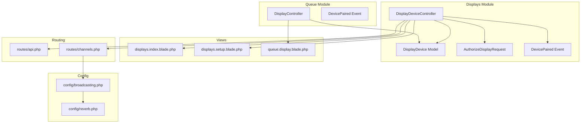
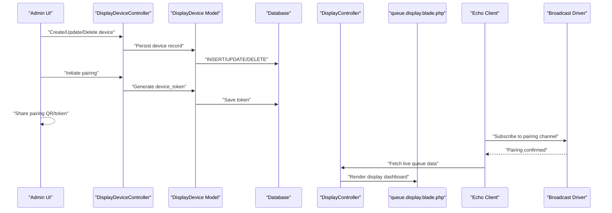
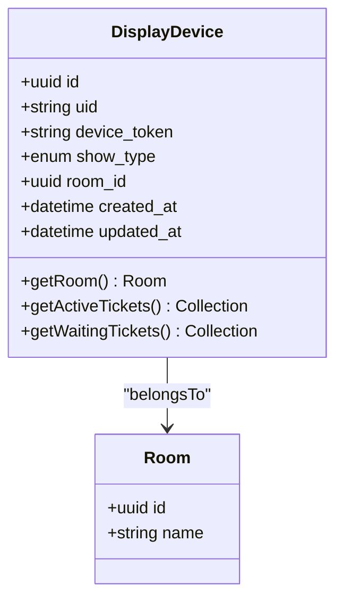
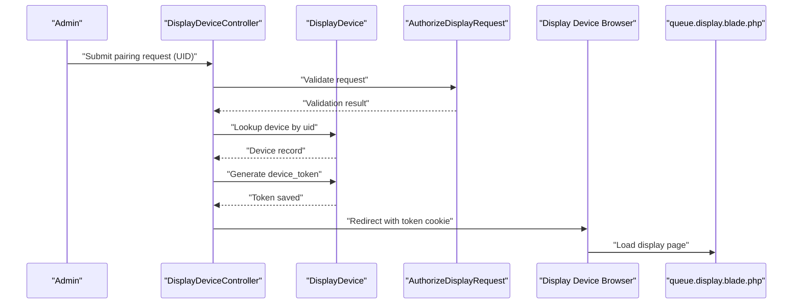
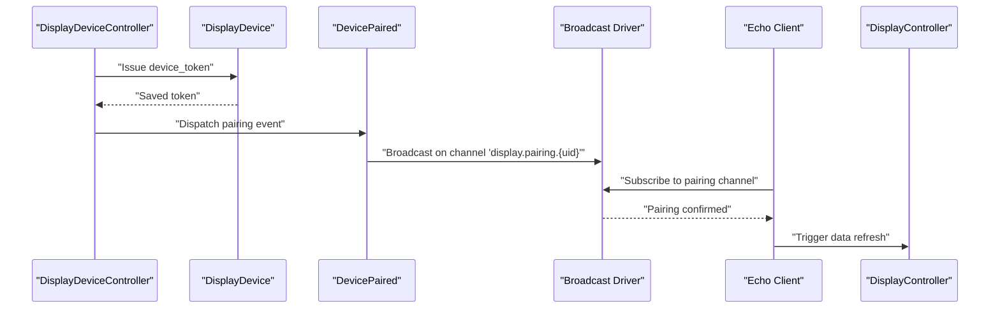
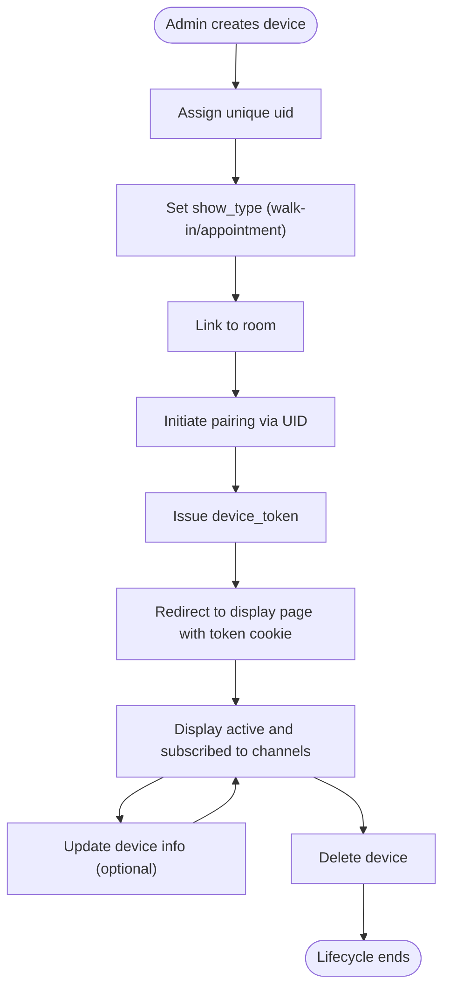
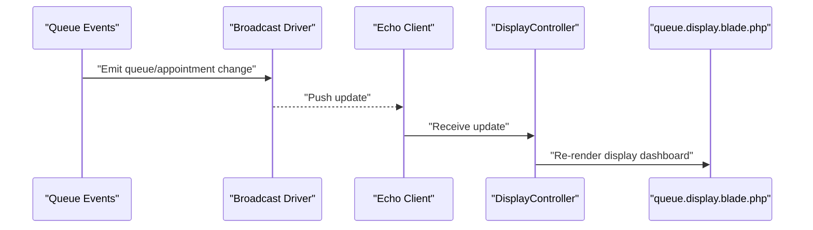
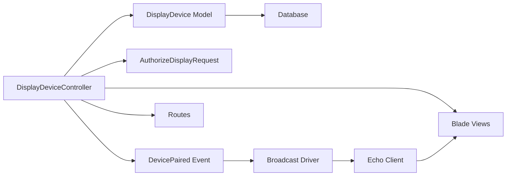

# Display Integration

<cite>
**Referenced Files in This Document**
- [DisplayDevice.php](file://app/Modules/Displays/Models/DisplayDevice.php)
- [DisplayDeviceController.php](file://app/Modules/Displays/Controllers/DisplayDeviceController.php)
- [AuthorizeDisplayRequest.php](file://app/Http/Requests/AuthorizeDisplayRequest.php)
- [DevicePaired.php](file://app/Modules/Queue/Events/DevicePaired.php)
- [DisplayController.php](file://app/Modules/Queue/Controllers/DisplayController.php)
- [2026_04_08_125059_create_display_devices_table.php](file://database/migrations/2026_04_08_125059_create_display_devices_table.php)
- [2026_04_10_133352_add_show_type_to_display_devices_table.php](file://database/migrations/2026_04_10_133352_add_show_type_to_display_devices_table.php)
- [api.php](file://routes/api.php)
- [channels.php](file://routes/channels.php)
- [echo.js](file://public/frontend/js/echo.js)
- [queue.display.blade.php](file://resources/views/queue/display.blade.php)
- [displays.index.blade.php](file://resources/views/displays/index.blade.php)
- [displays.setup.blade.php](file://resources/views/displays/setup.blade.php)
- [broadcasting.php](file://config/broadcasting.php)
- [reverb.php](file://config/reverb.php)
</cite>

## Table of Contents
1. [Introduction](#introduction)
2. [Project Structure](#project-structure)
3. [Core Components](#core-components)
4. [Architecture Overview](#architecture-overview)
5. [Detailed Component Analysis](#detailed-component-analysis)
6. [Dependency Analysis](#dependency-analysis)
7. [Performance Considerations](#performance-considerations)
8. [Troubleshooting Guide](#troubleshooting-guide)
9. [Conclusion](#conclusion)
10. [Appendices](#appendices)

## Introduction
This document describes the Display Integration module responsible for managing real-time display devices, pairing mechanisms, and broadcast systems. It covers the DisplayDevice model with authentication tokens and pairing codes, WebSocket integration for live queue updates, pairing workflows, device lifecycle management, and integration with queue events and appointment changes. It also documents API endpoints for device management and display configuration, along with practical setup procedures, troubleshooting steps, and performance optimization tips for multiple devices.

## Project Structure
The Display Integration spans several Laravel components:
- Models: DisplayDevice defines the persisted device entity and its attributes.
- Controllers: DisplayDeviceController handles administrative device management and public pairing/entry flows.
- Requests: AuthorizeDisplayRequest validates incoming display requests.
- Events: DevicePaired event triggers pairing-related broadcasts.
- Views: Blade templates render display dashboards and setup pages.
- Routes: API and channel routes enable device pairing and real-time broadcasting.
- Config: Broadcasting and Reverb configurations power WebSocket connectivity.

**Diagram sources**
- [DisplayDevice.php](file://app/Modules/Displays/Models/DisplayDevice.php)
- [DisplayDeviceController.php](file://app/Modules/Displays/Controllers/DisplayDeviceController.php)
- [AuthorizeDisplayRequest.php](file://app/Http/Requests/AuthorizeDisplayRequest.php)
- [DevicePaired.php](file://app/Modules/Queue/Events/DevicePaired.php)
- [DisplayController.php](file://app/Modules/Queue/Controllers/DisplayController.php)
- [displays.index.blade.php](file://resources/views/displays/index.blade.php)
- [displays.setup.blade.php](file://resources/views/displays/setup.blade.php)
- [queue.display.blade.php](file://resources/views/queue/display.blade.php)
- [api.php](file://routes/api.php)
- [channels.php](file://routes/channels.php)
- [broadcasting.php](file://config/broadcasting.php)
- [reverb.php](file://config/reverb.php)

**Section sources**
- [DisplayDevice.php](file://app/Modules/Displays/Models/DisplayDevice.php)
- [DisplayDeviceController.php](file://app/Modules/Displays/Controllers/DisplayDeviceController.php)
- [AuthorizeDisplayRequest.php](file://app/Http/Requests/AuthorizeDisplayRequest.php)
- [DevicePaired.php](file://app/Modules/Queue/Events/DevicePaired.php)
- [DisplayController.php](file://app/Modules/Queue/Controllers/DisplayController.php)
- [displays.index.blade.php](file://resources/views/displays/index.blade.php)
- [displays.setup.blade.php](file://resources/views/displays/setup.blade.php)
- [queue.display.blade.php](file://resources/views/queue/display.blade.php)
- [api.php](file://routes/api.php)
- [channels.php](file://routes/channels.php)
- [broadcasting.php](file://config/broadcasting.php)
- [reverb.php](file://config/reverb.php)

## Core Components
- DisplayDevice model: Stores device identity, pairing token, room association, and display mode (walk-in or appointment).
- DisplayDeviceController: Manages device CRUD, pairing initiation, and public display entry via device token or UID.
- AuthorizeDisplayRequest: Validates display-side requests for pairing and entry.
- DevicePaired event: Broadcasts pairing completion on a per-device channel for real-time updates.
- DisplayController: Renders the public display page and integrates with queue data.
- Views: Administrative index and setup pages, plus the public display dashboard.
- Routing: API endpoints for pairing and channel authentication for broadcasting.

Key responsibilities:
- Device registration and management (admin).
- Pairing initiation and token issuance.
- Public display entry via secure token or UID.
- Real-time updates via WebSocket channels.
- Integration with queue events for live ticket updates.

**Section sources**
- [DisplayDevice.php](file://app/Modules/Displays/Models/DisplayDevice.php)
- [DisplayDeviceController.php](file://app/Modules/Displays/Controllers/DisplayDeviceController.php)
- [AuthorizeDisplayRequest.php](file://app/Http/Requests/AuthorizeDisplayRequest.php)
- [DevicePaired.php](file://app/Modules/Queue/Events/DevicePaired.php)
- [DisplayController.php](file://app/Modules/Queue/Controllers/DisplayController.php)

## Architecture Overview
The Display Integration architecture combines server-side device management with client-side real-time updates using Laravel Echo and a WebSocket broadcasting driver.

**Diagram sources**
- [DisplayDeviceController.php](file://app/Modules/Displays/Controllers/DisplayDeviceController.php)
- [DisplayDevice.php](file://app/Modules/Displays/Models/DisplayDevice.php)
- [DisplayController.php](file://app/Modules/Queue/Controllers/DisplayController.php)
- [queue.display.blade.php](file://resources/views/queue/display.blade.php)
- [broadcasting.php](file://config/broadcasting.php)
- [reverb.php](file://config/reverb.php)

## Detailed Component Analysis

### DisplayDevice Model
The DisplayDevice model encapsulates device identity, pairing, and display behavior.

Key attributes and behaviors:
- Unique identifiers: uid and device_token for pairing and entry.
- Display mode: show_type distinguishes walk-in vs appointment-focused displays.
- Room association: links devices to physical or logical display locations.
- Helper relations: provides active and waiting tickets for rendering.

**Diagram sources**
- [DisplayDevice.php](file://app/Modules/Displays/Models/DisplayDevice.php)
- [2026_04_08_125059_create_display_devices_table.php](file://database/migrations/2026_04_08_125059_create_display_devices_table.php)
- [2026_04_10_133352_add_show_type_to_display_devices_table.php](file://database/migrations/2026_04_10_133352_add_show_type_to_display_devices_table.php)

**Section sources**
- [DisplayDevice.php](file://app/Modules/Displays/Models/DisplayDevice.php)
- [2026_04_08_125059_create_display_devices_table.php](file://database/migrations/2026_04_08_125059_create_display_devices_table.php)
- [2026_04_10_133352_add_show_type_to_display_devices_table.php](file://database/migrations/2026_04_10_133352_add_show_type_to_display_devices_table.php)

### Pairing Mechanism and Authentication
The pairing flow uses a device UID to securely issue a device_token and redirect to a public display page. Authorization is enforced via a dedicated request class.

Security and validation:
- AuthorizeDisplayRequest ensures proper input and context.
- Redirect uses a long-lived cookie to persist the device_token for subsequent requests.

**Diagram sources**
- [DisplayDeviceController.php](file://app/Modules/Displays/Controllers/DisplayDeviceController.php)
- [AuthorizeDisplayRequest.php](file://app/Http/Requests/AuthorizeDisplayRequest.php)
- [queue.display.blade.php](file://resources/views/queue/display.blade.php)

**Section sources**
- [DisplayDeviceController.php](file://app/Modules/Displays/Controllers/DisplayDeviceController.php)
- [AuthorizeDisplayRequest.php](file://app/Http/Requests/AuthorizeDisplayRequest.php)

### WebSocket Integration and Real-Time Updates
Real-time updates are delivered via Laravel Echo and a configured broadcasting driver. The pairing event publishes on a per-device channel.

Channel naming and subscription:
- Channels are named per device using the device UID.
- Echo client subscribes to the pairing channel to receive pairing confirmations.

**Diagram sources**
- [DevicePaired.php](file://app/Modules/Queue/Events/DevicePaired.php)
- [DisplayDeviceController.php](file://app/Modules/Displays/Controllers/DisplayDeviceController.php)
- [broadcasting.php](file://config/broadcasting.php)
- [reverb.php](file://config/reverb.php)
- [echo.js](file://public/frontend/js/echo.js)

**Section sources**
- [DevicePaired.php](file://app/Modules/Queue/Events/DevicePaired.php)
- [broadcasting.php](file://config/broadcasting.php)
- [reverb.php](file://config/reverb.php)
- [echo.js](file://public/frontend/js/echo.js)

### Display Lifecycle Management
Lifecycle stages include creation, pairing, activation, and removal.

Operational notes:
- Devices can be listed and managed from the admin interface.
- Deletion removes the device record and associated pairing state.

**Diagram sources**
- [DisplayDeviceController.php](file://app/Modules/Displays/Controllers/DisplayDeviceController.php)
- [displays.index.blade.php](file://resources/views/displays/index.blade.php)

**Section sources**
- [DisplayDeviceController.php](file://app/Modules/Displays/Controllers/DisplayDeviceController.php)
- [displays.index.blade.php](file://resources/views/displays/index.blade.php)

### Integration with Queue Events and Appointment Changes
Display updates reflect live queue and appointment changes. The public display controller renders the dashboard and integrates with queue data.

Behavior:
- Live updates propagate to subscribed clients.
- The display page aggregates active and waiting tickets for presentation.

**Diagram sources**
- [DisplayController.php](file://app/Modules/Queue/Controllers/DisplayController.php)
- [queue.display.blade.php](file://resources/views/queue/display.blade.php)
- [broadcasting.php](file://config/broadcasting.php)
- [reverb.php](file://config/reverb.php)

**Section sources**
- [DisplayController.php](file://app/Modules/Queue/Controllers/DisplayController.php)
- [queue.display.blade.php](file://resources/views/queue/display.blade.php)

### API Endpoints and Configuration
Endpoints and routing:
- Pairing and entry endpoints are handled by DisplayDeviceController methods for device management and public access.
- Channel authentication routes enable Echo to subscribe to private channels.
- Broadcasting and Reverb configurations define transport and credentials.

Typical endpoint categories:
- Device management: list, create, update, delete devices.
- Pairing: initiate pairing by UID, validate pairing, and redirect to display.
- Display entry: access display page via device_token.

Routing references:
- API routes for device management and pairing.
- Channel routes for broadcasting subscriptions.

**Section sources**
- [DisplayDeviceController.php](file://app/Modules/Displays/Controllers/DisplayDeviceController.php)
- [api.php](file://routes/api.php)
- [channels.php](file://routes/channels.php)
- [broadcasting.php](file://config/broadcasting.php)
- [reverb.php](file://config/reverb.php)

## Dependency Analysis
The Display Integration module exhibits clear separation of concerns with low coupling between components.

Observations:
- Controllers depend on models and requests but remain thin.
- Events decouple broadcasting from controllers.
- Views are presentation-only and depend on controller-provided data.
- Routing and configuration define transport and access policies.

**Diagram sources**
- [DisplayDeviceController.php](file://app/Modules/Displays/Controllers/DisplayDeviceController.php)
- [DisplayDevice.php](file://app/Modules/Displays/Models/DisplayDevice.php)
- [AuthorizeDisplayRequest.php](file://app/Http/Requests/AuthorizeDisplayRequest.php)
- [DevicePaired.php](file://app/Modules/Queue/Events/DevicePaired.php)
- [broadcasting.php](file://config/broadcasting.php)
- [reverb.php](file://config/reverb.php)

**Section sources**
- [DisplayDeviceController.php](file://app/Modules/Displays/Controllers/DisplayDeviceController.php)
- [DisplayDevice.php](file://app/Modules/Displays/Models/DisplayDevice.php)
- [AuthorizeDisplayRequest.php](file://app/Http/Requests/AuthorizeDisplayRequest.php)
- [DevicePaired.php](file://app/Modules/Queue/Events/DevicePaired.php)
- [broadcasting.php](file://config/broadcasting.php)
- [reverb.php](file://config/reverb.php)

## Performance Considerations
- Minimize payload size: broadcast only essential fields for queue updates.
- Use efficient queries: eager-load related data (e.g., room) to avoid N+1 queries.
- Scale broadcasting: configure Reverb for horizontal scaling and load balancing.
- Optimize polling intervals: reduce unnecessary refresh cycles in the client.
- Cache static assets: leverage browser caching for Echo and display assets.
- Monitor channel usage: limit subscribers per device to reduce bandwidth.

## Troubleshooting Guide
Common issues and resolutions:
- Pairing fails silently:
  - Verify device UID exists and device_token is generated.
  - Check cookie presence and expiration for the device_token.
- WebSocket connection errors:
  - Confirm broadcasting driver and Reverb configuration.
  - Validate channel authentication routes and credentials.
- Display not updating:
  - Ensure Echo client subscribes to the correct pairing channel.
  - Confirm queue events are emitted and reaching the broadcast driver.
- Multiple devices synchronization:
  - Use unique UIDs per device and per-channel subscriptions.
  - Monitor broadcast throughput and adjust Reverb settings.

**Section sources**
- [DisplayDeviceController.php](file://app/Modules/Displays/Controllers/DisplayDeviceController.php)
- [DevicePaired.php](file://app/Modules/Queue/Events/DevicePaired.php)
- [broadcasting.php](file://config/broadcasting.php)
- [reverb.php](file://config/reverb.php)
- [echo.js](file://public/frontend/js/echo.js)

## Conclusion
The Display Integration module provides a robust foundation for managing display devices, pairing, and real-time updates. Its design separates concerns effectively, leverages Laravel’s broadcasting capabilities, and integrates seamlessly with queue and appointment workflows. By following the setup procedures, troubleshooting guidelines, and performance recommendations herein, administrators can deploy reliable, scalable display solutions across multiple devices.

## Appendices

### Setup Procedures
- Provision a device:
  - Create a device record with a unique uid and desired show_type.
  - Optionally link to a room for location-aware displays.
- Initiate pairing:
  - Use the admin interface to submit the device UID.
  - Receive and share the pairing token with the display device.
- Configure broadcasting:
  - Set up the broadcasting driver and Reverb according to environment.
  - Ensure channel authentication routes are accessible.
- Launch display:
  - Access the public display page using the issued device_token.
  - Confirm Echo subscription to the pairing channel.

**Section sources**
- [DisplayDeviceController.php](file://app/Modules/Displays/Controllers/DisplayDeviceController.php)
- [displays.setup.blade.php](file://resources/views/displays/setup.blade.php)
- [broadcasting.php](file://config/broadcasting.php)
- [reverb.php](file://config/reverb.php)