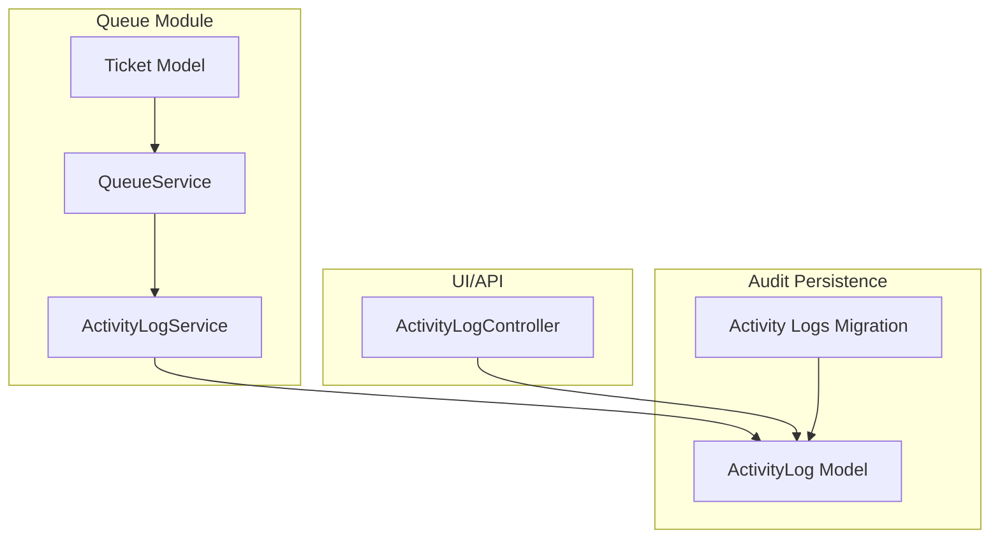
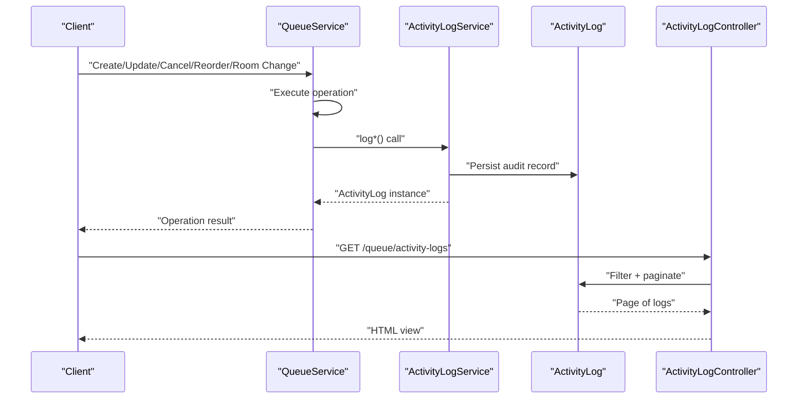
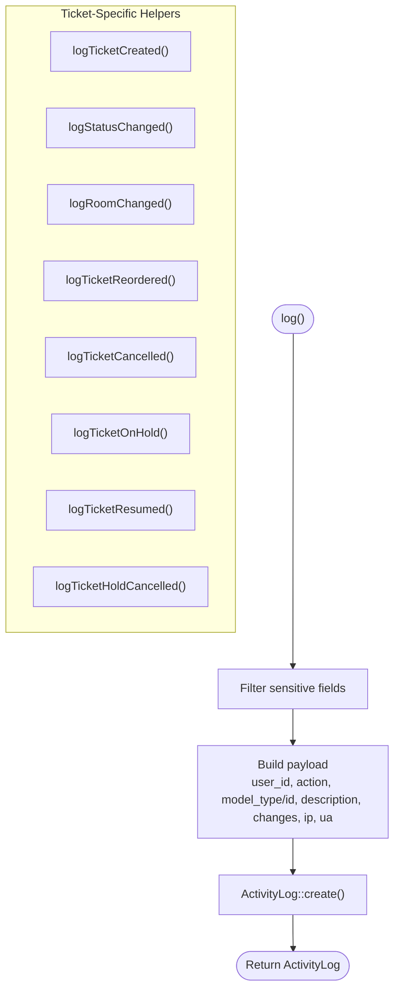
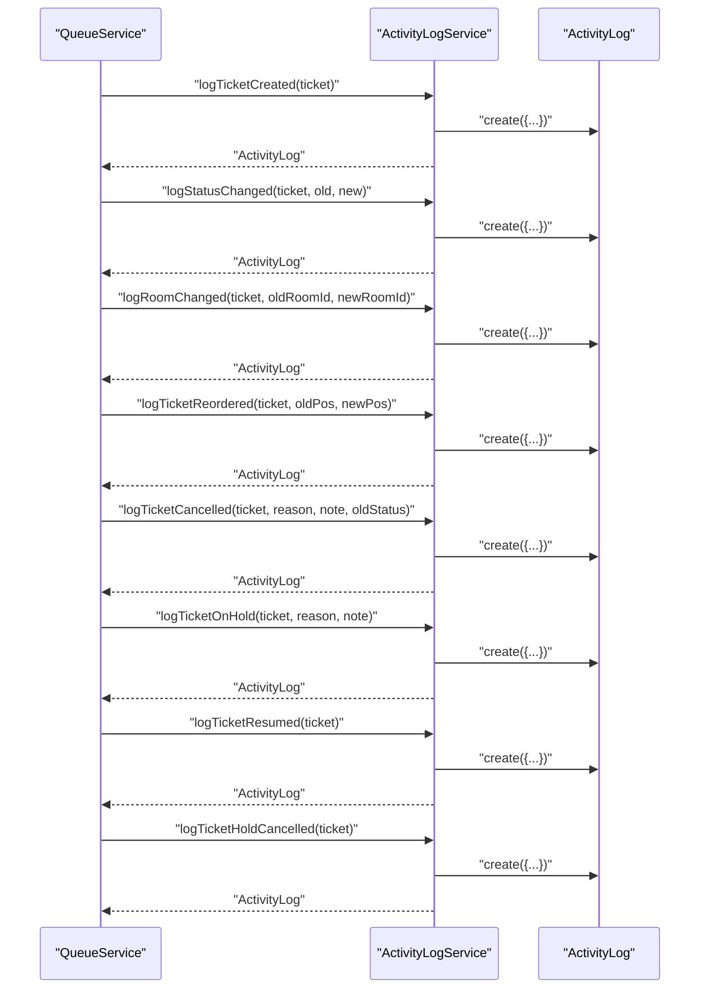
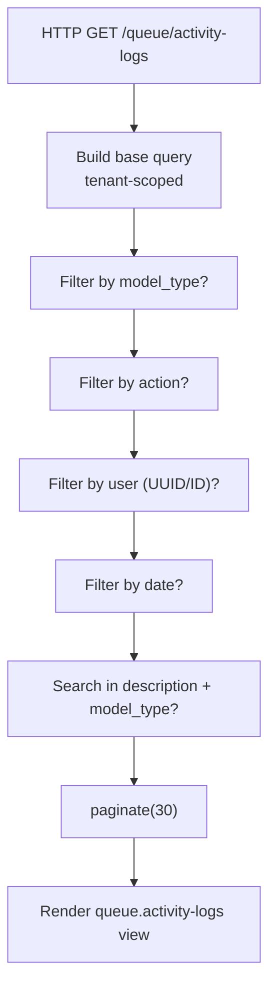
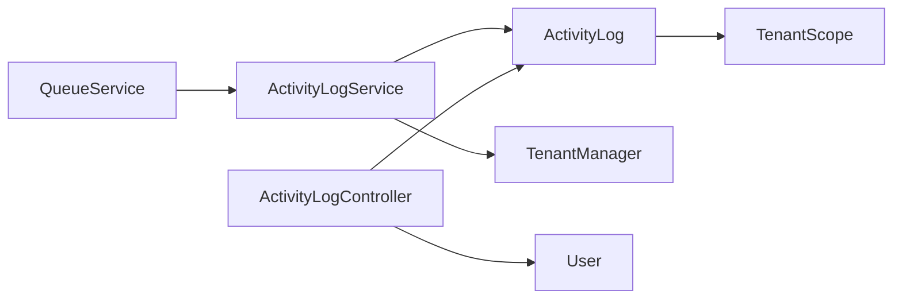
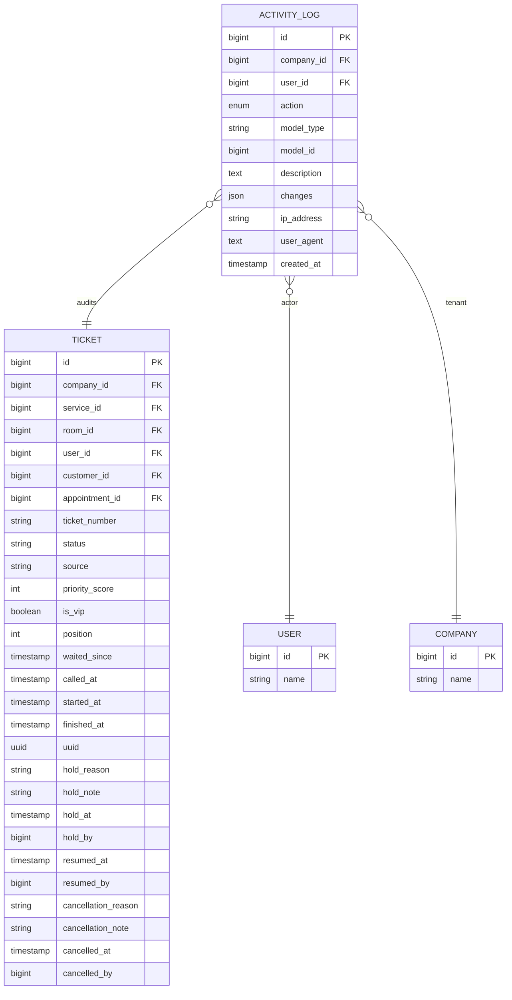

# Activity Logging & Audit Trail

<cite>
**Referenced Files in This Document**
- [ActivityLog.php](file://app/Modules/Queue/Models/ActivityLog.php)
- [ActivityLogService.php](file://app/Modules/Queue/Services/ActivityLogService.php)
- [ActivityLogController.php](file://app/Modules/Queue/Controllers/ActivityLogController.php)
- [QueueService.php](file://app/Modules/Queue/Services/QueueService.php)
- [Ticket.php](file://app/Modules/Queue/Models/Ticket.php)
- [2026_04_16_150001_create_activity_logs_table.php](file://database/migrations/2026_04_16_150001_create_activity_logs_table.php)
</cite>

## Table of Contents
1. [Introduction](#introduction)
2. [Project Structure](#project-structure)
3. [Core Components](#core-components)
4. [Architecture Overview](#architecture-overview)
5. [Detailed Component Analysis](#detailed-component-analysis)
6. [Dependency Analysis](#dependency-analysis)
7. [Performance Considerations](#performance-considerations)
8. [Troubleshooting Guide](#troubleshooting-guide)
9. [Conclusion](#conclusion)
10. [Appendices](#appendices)

## Introduction
This document explains the activity logging and audit trail system for queue operations. It covers how all queue lifecycle events are captured, including ticket creation, status transitions, reordering, hold operations, cancellations, and room changes. It documents the ActivityLogService implementation, its integration with QueueService, the ActivityLog model structure and relationships, and the API endpoints for retrieving historical data and generating reports. It also includes examples of audit trails for common scenarios, compliance considerations, and performance implications of extensive logging.

## Project Structure
The audit trail system spans three main areas:
- ActivityLog model and migration define the persisted audit records
- ActivityLogService encapsulates logging logic and sensitive data filtering
- QueueService orchestrates queue operations and triggers appropriate audit logs
- ActivityLogController exposes a web interface for viewing and filtering logs



**Diagram sources**
- [QueueService.php:11-513](file://app/Modules/Queue/Services/QueueService.php#L11-L513)
- [ActivityLogService.php:9-275](file://app/Modules/Queue/Services/ActivityLogService.php#L9-L275)
- [ActivityLog.php:8-126](file://app/Modules/Queue/Models/ActivityLog.php#L8-L126)
- [2026_04_16_150001_create_activity_logs_table.php:7-48](file://database/migrations/2026_04_16_150001_create_activity_logs_table.php#L7-L48)
- [ActivityLogController.php:9-58](file://app/Modules/Queue/Controllers/ActivityLogController.php#L9-L58)

**Section sources**
- [ActivityLog.php:8-126](file://app/Modules/Queue/Models/ActivityLog.php#L8-L126)
- [ActivityLogService.php:9-275](file://app/Modules/Queue/Services/ActivityLogService.php#L9-L275)
- [QueueService.php:11-513](file://app/Modules/Queue/Services/QueueService.php#L11-L513)
- [ActivityLogController.php:9-58](file://app/Modules/Queue/Controllers/ActivityLogController.php#L9-L58)
- [2026_04_16_150001_create_activity_logs_table.php:7-48](file://database/migrations/2026_04_16_150001_create_activity_logs_table.php#L7-L48)

## Core Components
- ActivityLog model
  - Immutable records with no updates/deletes
  - Captures actor (user_id), subject (model_type/model_id), action, description, changes, and client metadata (ip_address, user_agent)
  - Includes tenant scoping and helper to resolve subject instances
- ActivityLogService
  - Centralized logging facade with sensitive field filtering
  - Specialized methods for ticket lifecycle events
  - Utility methods for user/customer events
- QueueService
  - Orchestrates queue operations and invokes ActivityLogService for each significant change
  - Ensures audit trail is recorded alongside business logic
- ActivityLogController
  - Provides a paginated, filterable view of global activity logs for admins

**Section sources**
- [ActivityLog.php:8-126](file://app/Modules/Queue/Models/ActivityLog.php#L8-L126)
- [ActivityLogService.php:9-275](file://app/Modules/Queue/Services/ActivityLogService.php#L9-L275)
- [QueueService.php:11-513](file://app/Modules/Queue/Services/QueueService.php#L11-L513)
- [ActivityLogController.php:9-58](file://app/Modules/Queue/Controllers/ActivityLogController.php#L9-L58)

## Architecture Overview
The system follows a clean separation of concerns:
- Business logic resides in QueueService
- Logging is delegated to ActivityLogService
- Persistence is handled by ActivityLog model
- Retrieval and reporting are exposed via ActivityLogController



**Diagram sources**
- [QueueService.php:23-56](file://app/Modules/Queue/Services/QueueService.php#L23-L56)
- [QueueService.php:177-195](file://app/Modules/Queue/Services/QueueService.php#L177-L195)
- [QueueService.php:315-365](file://app/Modules/Queue/Services/QueueService.php#L315-L365)
- [QueueService.php:457-488](file://app/Modules/Queue/Services/QueueService.php#L457-L488)
- [QueueService.php:493-511](file://app/Modules/Queue/Services/QueueService.php#L493-L511)
- [ActivityLogService.php:57-77](file://app/Modules/Queue/Services/ActivityLogService.php#L57-L77)
- [ActivityLogService.php:82-98](file://app/Modules/Queue/Services/ActivityLogService.php#L82-L98)
- [ActivityLogService.php:127-143](file://app/Modules/Queue/Services/ActivityLogService.php#L127-L143)
- [ActivityLogService.php:148-178](file://app/Modules/Queue/Services/ActivityLogService.php#L148-L178)
- [ActivityLogService.php:103-122](file://app/Modules/Queue/Services/ActivityLogService.php#L103-L122)
- [ActivityLogService.php:199-221](file://app/Modules/Queue/Services/ActivityLogService.php#L199-L221)
- [ActivityLogService.php:226-239](file://app/Modules/Queue/Services/ActivityLogService.php#L226-L239)
- [ActivityLogService.php:244-257](file://app/Modules/Queue/Services/ActivityLogService.php#L244-L257)
- [ActivityLogController.php:14-56](file://app/Modules/Queue/Controllers/ActivityLogController.php#L14-L56)

## Detailed Component Analysis

### ActivityLog Model
- Purpose: Persist immutable audit records for all auditable actions
- Key attributes:
  - company_id, user_id
  - action (enum-like), model_type, model_id, model_label
  - description, changes (JSON), ip_address, user_agent
  - created_at (immutable)
- Behavior:
  - Tenant-scoped globally
  - Auto-fills company_id from tenant context
  - Immutable: save/delete overridden to prevent modifications/deletions
  - Subject resolution helper supports multiple model types and soft-deleted records
  - Query scopes for model and action filtering

```mermaid
classDiagram
class ActivityLog {
+const UPDATED_AT = null
+table "activity_logs"
+fillable ["company_id","user_id","action","model_type","model_id","model_label","description","changes","ip_address","user_agent"]
+casts {"changes" : "array","created_at" : "datetime"}
+save(options) bool
+delete() bool
+company()
+user()
+getSubjectAttribute()
+scopeForModel(query,modelType,modelId)
+scopeOfAction(query,action)
}
class Ticket {
+id
+ticket_number
+status
+room()
+customer()
+operator()
+activityLogs()
}
class User {
+id
+name
}
class Company {
+id
+name
}
ActivityLog --> Company : "belongsTo"
ActivityLog --> User : "belongsTo"
ActivityLog --> Ticket : "subject (via getSubjectAttribute)"
```

**Diagram sources**
- [ActivityLog.php:8-126](file://app/Modules/Queue/Models/ActivityLog.php#L8-L126)
- [Ticket.php:179-185](file://app/Modules/Queue/Models/Ticket.php#L179-L185)

**Section sources**
- [ActivityLog.php:8-126](file://app/Modules/Queue/Models/ActivityLog.php#L8-L126)
- [2026_04_16_150001_create_activity_logs_table.php:14-37](file://database/migrations/2026_04_16_150001_create_activity_logs_table.php#L14-L37)

### ActivityLogService
- Responsibilities:
  - Normalize and sanitize audit data
  - Emit domain-specific logs for tickets and other entities
  - Capture actor, IP, and user agent automatically
- Sensitive data policy:
  - Filters out predefined sensitive fields from changes arrays
- Event coverage:
  - Ticket created
  - Status changed
  - Room changed
  - Position reordered
  - Cancellation (with reason and note)
  - Hold operations (place on hold, resume, hold cancelled)
  - User and customer events



**Diagram sources**
- [ActivityLogService.php:28-52](file://app/Modules/Queue/Services/ActivityLogService.php#L28-L52)
- [ActivityLogService.php:57-77](file://app/Modules/Queue/Services/ActivityLogService.php#L57-L77)
- [ActivityLogService.php:82-98](file://app/Modules/Queue/Services/ActivityLogService.php#L82-L98)
- [ActivityLogService.php:103-122](file://app/Modules/Queue/Services/ActivityLogService.php#L103-L122)
- [ActivityLogService.php:127-143](file://app/Modules/Queue/Services/ActivityLogService.php#L127-L143)
- [ActivityLogService.php:148-178](file://app/Modules/Queue/Services/ActivityLogService.php#L148-L178)
- [ActivityLogService.php:199-221](file://app/Modules/Queue/Services/ActivityLogService.php#L199-L221)
- [ActivityLogService.php:226-239](file://app/Modules/Queue/Services/ActivityLogService.php#L226-L239)
- [ActivityLogService.php:244-257](file://app/Modules/Queue/Services/ActivityLogService.php#L244-L257)

**Section sources**
- [ActivityLogService.php:9-275](file://app/Modules/Queue/Services/ActivityLogService.php#L9-L275)

### QueueService Integration
- QueueService delegates all meaningful state changes to ActivityLogService
- Examples:
  - createTicket, createSimpleTicket → logTicketCreated
  - reorderTickets → logTicketReordered
  - updateStatus → logStatusChanged
  - cancelTicket → logTicketCancelled
  - changeRoom → logRoomChanged
  - putOnHold → logTicketOnHold
  - resumeService → logTicketResumed
  - cancelHold → logTicketHoldCancelled



**Diagram sources**
- [QueueService.php:23-56](file://app/Modules/Queue/Services/QueueService.php#L23-L56)
- [QueueService.php:177-195](file://app/Modules/Queue/Services/QueueService.php#L177-L195)
- [QueueService.php:315-365](file://app/Modules/Queue/Services/QueueService.php#L315-L365)
- [QueueService.php:457-488](file://app/Modules/Queue/Services/QueueService.php#L457-L488)
- [QueueService.php:493-511](file://app/Modules/Queue/Services/QueueService.php#L493-L511)
- [ActivityLogService.php:57-77](file://app/Modules/Queue/Services/ActivityLogService.php#L57-L77)
- [ActivityLogService.php:82-98](file://app/Modules/Queue/Services/ActivityLogService.php#L82-L98)
- [ActivityLogService.php:103-122](file://app/Modules/Queue/Services/ActivityLogService.php#L103-L122)
- [ActivityLogService.php:127-143](file://app/Modules/Queue/Services/ActivityLogService.php#L127-L143)
- [ActivityLogService.php:148-178](file://app/Modules/Queue/Services/ActivityLogService.php#L148-L178)
- [ActivityLogService.php:199-221](file://app/Modules/Queue/Services/ActivityLogService.php#L199-L221)
- [ActivityLogService.php:226-239](file://app/Modules/Queue/Services/ActivityLogService.php#L226-L239)
- [ActivityLogService.php:244-257](file://app/Modules/Queue/Services/ActivityLogService.php#L244-L257)

**Section sources**
- [QueueService.php:11-513](file://app/Modules/Queue/Services/QueueService.php#L11-L513)
- [ActivityLogService.php:9-275](file://app/Modules/Queue/Services/ActivityLogService.php#L9-L275)

### ActivityLogController (Historical Data Access)
- Provides a paginated, filterable view of activity logs
- Filters:
  - model_type
  - action
  - user (accepts UUID or ID)
  - date
  - free-text search across description and model_type
- Sorting: newest first by created_at
- Pagination: 30 items per page



**Diagram sources**
- [ActivityLogController.php:14-56](file://app/Modules/Queue/Controllers/ActivityLogController.php#L14-L56)

**Section sources**
- [ActivityLogController.php:9-58](file://app/Modules/Queue/Controllers/ActivityLogController.php#L9-L58)

### Audit Event Types and Data Capture
- Ticket created
  - Action: created
  - Description: includes ticket number and initial status
  - Changes: after snapshot of key fields (ticket_number, status, service, room, customer, source, is_vip)
  - Subject: Ticket
- Status changed
  - Action: status_changed
  - Description: human-readable transition
  - Changes: before/after status snapshots
  - Subject: Ticket
- Room changed
  - Action: room_changed
  - Description: old → new room names
  - Changes: before/after room_id and room_name
  - Subject: Ticket
- Reordered
  - Action: reordered
  - Description: position change
  - Changes: before/after position
  - Subject: Ticket
- Cancellation
  - Action: status_changed
  - Description: includes reason and optional note
  - Changes: before/after status plus cancellation_reason and cancellation_note
  - Subject: Ticket
- On hold
  - Action: status_changed
  - Description: reason and optional note
  - Changes: before/after status plus hold_reason and hold_note
  - Subject: Ticket
- Resumed
  - Action: status_changed
  - Description: resume notification
  - Changes: before/after status
  - Subject: Ticket
- Hold cancelled
  - Action: status_changed
  - Description: hold cancellation notice
  - Changes: before/after status
  - Subject: Ticket
- User/Customer events
  - Action: created/updated/deleted/status_changed (as applicable)
  - Description: human-readable summary
  - Changes: sanitized before/after snapshots
  - Subject: User or Customer

**Section sources**
- [ActivityLogService.php:57-77](file://app/Modules/Queue/Services/ActivityLogService.php#L57-L77)
- [ActivityLogService.php:82-98](file://app/Modules/Queue/Services/ActivityLogService.php#L82-L98)
- [ActivityLogService.php:103-122](file://app/Modules/Queue/Services/ActivityLogService.php#L103-L122)
- [ActivityLogService.php:127-143](file://app/Modules/Queue/Services/ActivityLogService.php#L127-L143)
- [ActivityLogService.php:148-178](file://app/Modules/Queue/Services/ActivityLogService.php#L148-L178)
- [ActivityLogService.php:199-221](file://app/Modules/Queue/Services/ActivityLogService.php#L199-L221)
- [ActivityLogService.php:226-239](file://app/Modules/Queue/Services/ActivityLogService.php#L226-L239)
- [ActivityLogService.php:244-257](file://app/Modules/Queue/Services/ActivityLogService.php#L244-L257)
- [ActivityLogService.php:183-194](file://app/Modules/Queue/Services/ActivityLogService.php#L183-L194)

### Audit Trail Examples
- Ticket created
  - Description: "Ticket T-001 created (status: waiting)"
  - Changes.after: ticket_number, status, service, room, customer, source, is_vip
- Status changed: waiting → called
  - Description: "Status changed: waiting → called"
  - Changes: before.status = waiting, after.status = called
- Room changed: Room A → Room B
  - Description: "Room changed: Room A → Room B"
  - Changes: before.room_id/name, after.room_id/name
- Reordered: position #3 → #1
  - Description: "Position in queue changed: #3 → #1"
  - Changes: before.position = 3, after.position = 1
- Cancellation: customer left
  - Description: "Ticket T-001 cancelled. Reason: customer_left (left early)"
  - Changes: before.status = called, after.status = cancelled, cancellation_reason, cancellation_note
- On hold: technical issue
  - Description: "Ticket T-001 placed on hold. Reason: technical_issue"
  - Changes: before.status = serving, after.status = on_hold, hold_reason, hold_note
- Resumed
  - Description: "Ticket T-001 resumed"
  - Changes: before.status = on_hold, after.status = serving
- Hold cancelled
  - Description: "Ticket T-001 hold cancelled"
  - Changes: before.status = on_hold, after.status = hold_cancelled

**Section sources**
- [ActivityLogService.php:57-77](file://app/Modules/Queue/Services/ActivityLogService.php#L57-L77)
- [ActivityLogService.php:82-98](file://app/Modules/Queue/Services/ActivityLogService.php#L82-L98)
- [ActivityLogService.php:103-122](file://app/Modules/Queue/Services/ActivityLogService.php#L103-L122)
- [ActivityLogService.php:127-143](file://app/Modules/Queue/Services/ActivityLogService.php#L127-L143)
- [ActivityLogService.php:148-178](file://app/Modules/Queue/Services/ActivityLogService.php#L148-L178)
- [ActivityLogService.php:199-221](file://app/Modules/Queue/Services/ActivityLogService.php#L199-L221)
- [ActivityLogService.php:226-239](file://app/Modules/Queue/Services/ActivityLogService.php#L226-L239)
- [ActivityLogService.php:244-257](file://app/Modules/Queue/Services/ActivityLogService.php#L244-L257)

## Dependency Analysis
- QueueService depends on ActivityLogService for auditing
- ActivityLogService depends on:
  - Eloquent Auth for user_id
  - Illuminate Request for ip_address and user_agent
  - TenantManager for company_id auto-fill
- ActivityLog model depends on:
  - TenantScope for multi-tenancy
  - SoftDeletes-aware subject resolution
- ActivityLogController depends on:
  - ActivityLog model for queries
  - User model for user filtering (by UUID or ID)



**Diagram sources**
- [QueueService.php:13-18](file://app/Modules/Queue/Services/QueueService.php#L13-L18)
- [ActivityLogService.php:4-8](file://app/Modules/Queue/Services/ActivityLogService.php#L4-L8)
- [ActivityLog.php:39-51](file://app/Modules/Queue/Models/ActivityLog.php#L39-L51)
- [ActivityLogController.php:16-38](file://app/Modules/Queue/Controllers/ActivityLogController.php#L16-L38)

**Section sources**
- [QueueService.php:11-513](file://app/Modules/Queue/Services/QueueService.php#L11-L513)
- [ActivityLogService.php:9-275](file://app/Modules/Queue/Services/ActivityLogService.php#L9-L275)
- [ActivityLog.php:8-126](file://app/Modules/Queue/Models/ActivityLog.php#L8-L126)
- [ActivityLogController.php:9-58](file://app/Modules/Queue/Controllers/ActivityLogController.php#L9-L58)

## Performance Considerations
- Immutable logs reduce write contention and simplify archival
- JSON changes field enables flexible auditing without schema churn
- Indexes on company_id, (model_type, model_id), created_at improve query performance
- Sensitive data filtering reduces risk and storage footprint
- Consider:
  - Partitioning or retention policies for long-term storage
  - Asynchronous logging for high-throughput environments
  - Denormalized summaries for frequent report queries
  - Caching recent audit timelines for dashboards

[No sources needed since this section provides general guidance]

## Troubleshooting Guide
- No logs appear
  - Verify tenant context is set; ActivityLogService auto-fills company_id from TenantManager
  - Ensure QueueService methods are invoked (audit is triggered inside QueueService)
- Incorrect user association
  - Confirm authentication is active; ActivityLogService reads Auth::id()
- Missing IP or user agent
  - Ensure requests originate from a web context; ActivityLogService captures Request::ip() and Request::userAgent()
- Subject not resolving
  - Confirm model_type matches actual class namespace; ActivityLog::getSubjectAttribute resolves via model_type
- Filtering yields empty results
  - Check filters: model_type, action, user (UUID/ID), date, and search terms
- Compliance and privacy
  - Review sensitive fields filtered by ActivityLogService
  - Consider additional masking or encryption for highly sensitive data

**Section sources**
- [ActivityLogService.php:41-51](file://app/Modules/Queue/Services/ActivityLogService.php#L41-L51)
- [ActivityLog.php:85-105](file://app/Modules/Queue/Models/ActivityLog.php#L85-L105)
- [ActivityLogController.php:22-51](file://app/Modules/Queue/Controllers/ActivityLogController.php#L22-L51)

## Conclusion
The audit trail system provides comprehensive, immutable logging for all queue operations. By centralizing logging in ActivityLogService and invoking it from QueueService, the system ensures consistent, privacy-aware, and searchable records. The ActivityLogController offers practical filtering and pagination for administrative oversight. With proper indexing and retention strategies, the system scales to support compliance and operational needs.

[No sources needed since this section summarizes without analyzing specific files]

## Appendices

### Data Model and Relationships


**Diagram sources**
- [2026_04_16_150001_create_activity_logs_table.php:16-37](file://database/migrations/2026_04_16_150001_create_activity_logs_table.php#L16-L37)
- [Ticket.php:16-57](file://app/Modules/Queue/Models/Ticket.php#L16-L57)
- [ActivityLog.php:75-83](file://app/Modules/Queue/Models/ActivityLog.php#L75-L83)

### API Endpoints for Activity Logs
- GET /queue/activity-logs
  - Query parameters:
    - model_type (string)
    - action (string)
    - user (string; accepts UUID or ID)
    - date (string; Y-m-d)
    - search (string; free-text)
  - Response: HTML view with paginated logs and applied filters

**Section sources**
- [ActivityLogController.php:14-56](file://app/Modules/Queue/Controllers/ActivityLogController.php#L14-L56)