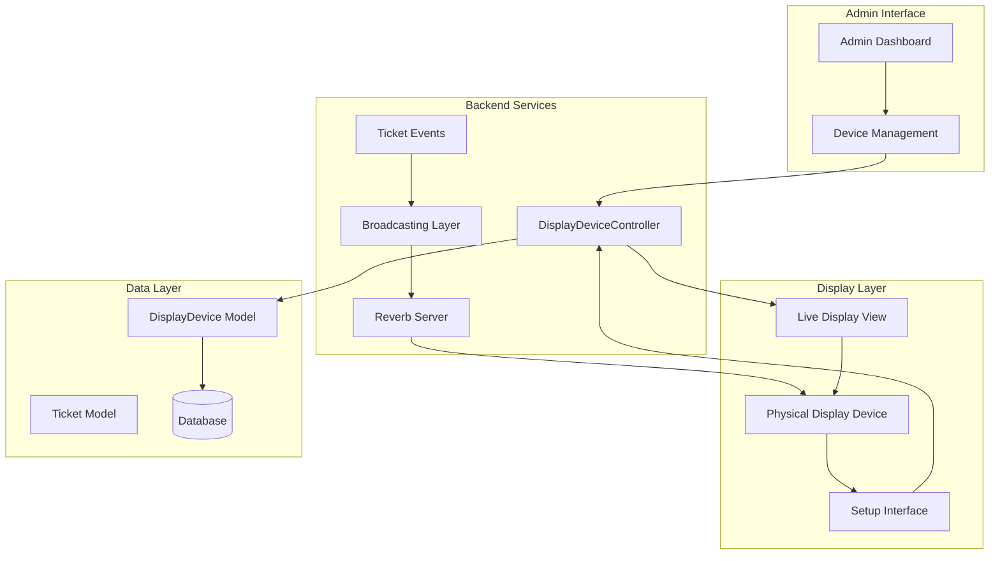
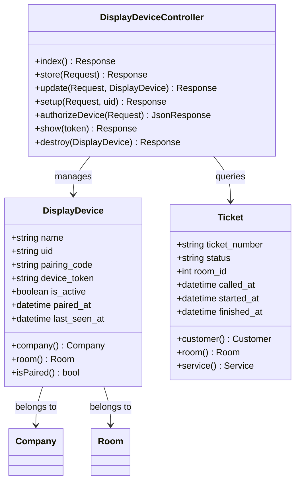
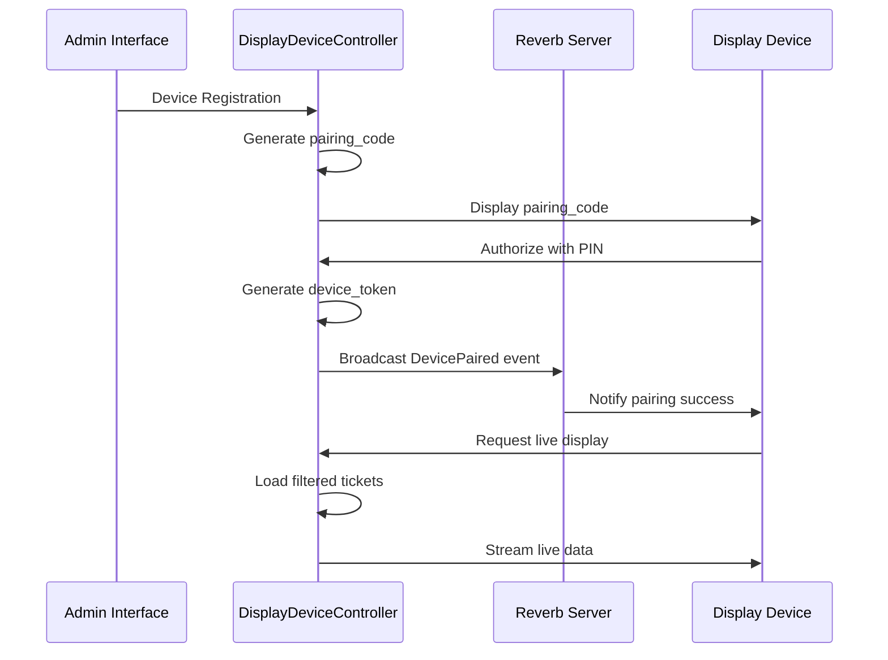
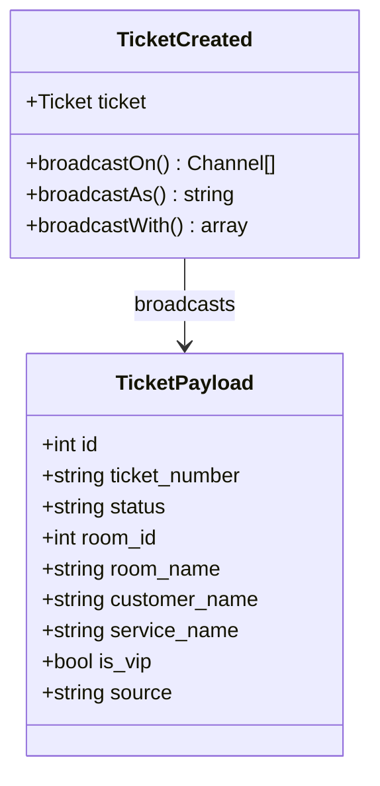
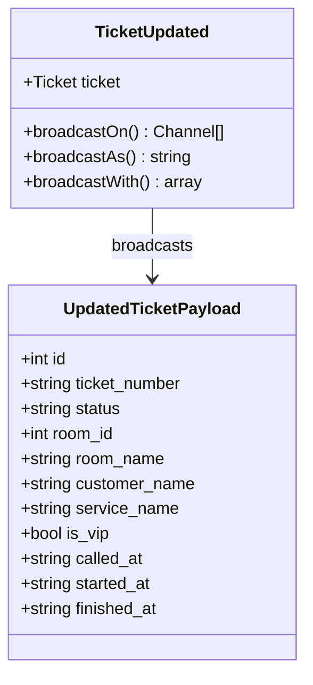
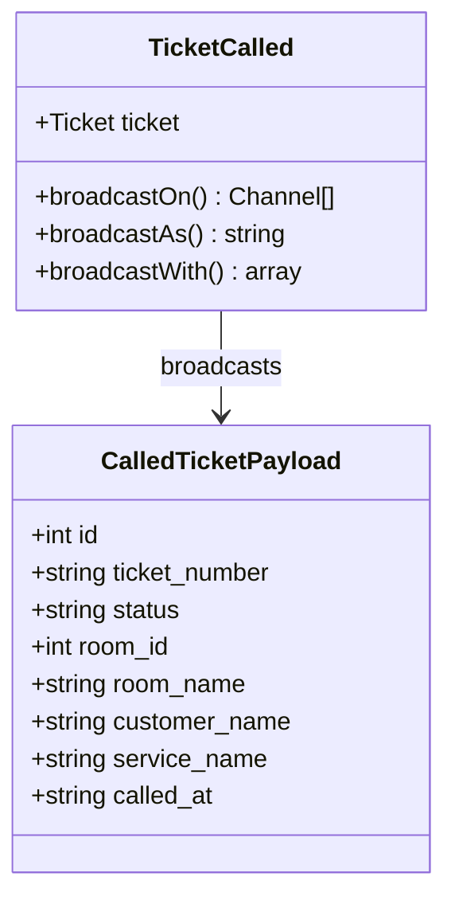
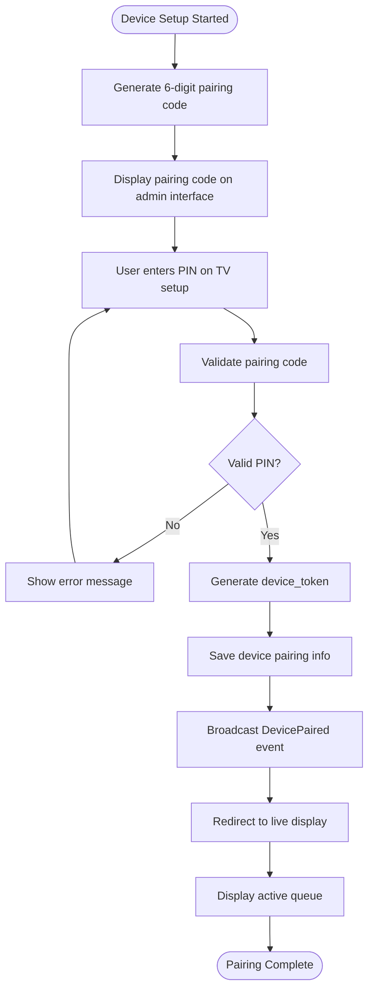
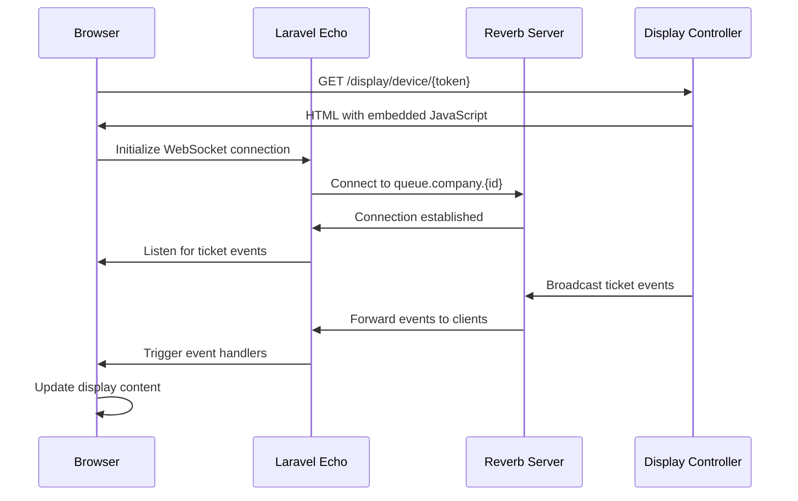
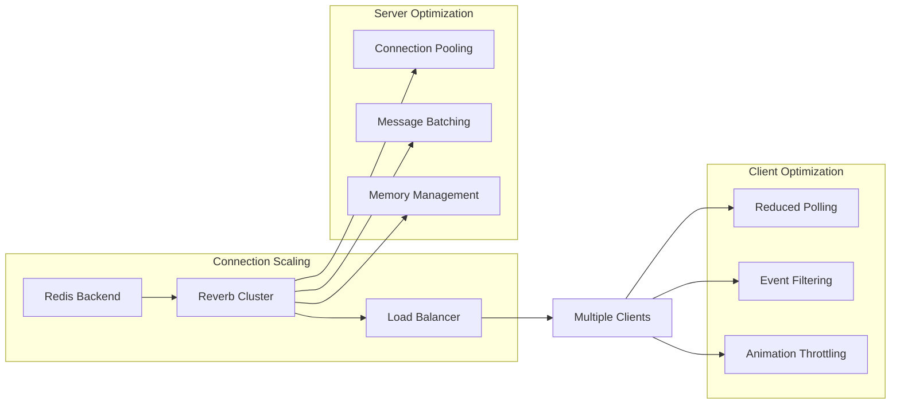

# Display Integration & Real-time Updates

<cite>
**Referenced Files in This Document**
- [DisplayDeviceController.php](file://app/Modules/Displays/Controllers/DisplayDeviceController.php)
- [DisplayDevice.php](file://app/Modules/Displays/Models/DisplayDevice.php)
- [TicketCreated.php](file://app/Modules/Queue/Events/TicketCreated.php)
- [TicketUpdated.php](file://app/Modules/Queue/Events/TicketUpdated.php)
- [TicketCalled.php](file://app/Modules/Queue/Events/TicketCalled.php)
- [DevicePaired.php](file://app/Modules/Queue/Events/DevicePaired.php)
- [web.php](file://routes/web.php)
- [reverb.php](file://config/reverb.php)
- [broadcasting.php](file://config/broadcasting.php)
- [display.blade.php](file://resources/views/queue/display.blade.php)
- [setup.blade.php](file://resources/views/displays/setup.blade.php)
- [index.blade.php](file://resources/views/displays/index.blade.php)
- [create_display_devices_table.php](file://database/migrations/2026_04_08_125059_create_display_devices_table.php)
- [add_show_type_to_display_devices_table.php](file://database/migrations/2026_04_10_133352_add_show_type_to_display_devices_table.php)
</cite>

## Table of Contents
1. [Introduction](#introduction)
2. [System Architecture](#system-architecture)
3. [Display Device Management](#display-device-management)
4. [WebSocket Communication with Laravel Reverb](#websocket-communication-with-laravel-reverb)
5. [Real-time Event System](#real-time-event-system)
6. [Display Device Pairing Process](#display-device-pairing-process)
7. [Client-side Integration](#client-side-integration)
8. [Performance Optimization](#performance-optimization)
9. [Troubleshooting Guide](#troubleshooting-guide)
10. [Best Practices](#best-practices)

## Introduction

This document provides comprehensive documentation for the display device integration and real-time queue updates system. The platform utilizes Laravel Reverb for WebSocket-based real-time communication, enabling live queue status updates on physical display devices. The system supports multiple display configurations, secure device pairing, and dynamic content filtering based on service types.

The integration consists of three main components:
- **Display Device Management**: Registration, configuration, and lifecycle management
- **WebSocket Communication**: Real-time event broadcasting using Laravel Reverb
- **Client-side Integration**: Display device interfaces and event listeners

## System Architecture

The display integration system follows a modular architecture with clear separation of concerns:

**Diagram sources**
- [DisplayDeviceController.php:13-192](file://app/Modules/Displays/Controllers/DisplayDeviceController.php#L13-L192)
- [DisplayDevice.php:11-79](file://app/Modules/Displays/Models/DisplayDevice.php#L11-L79)
- [reverb.php:29-57](file://config/reverb.php#L29-L57)

## Display Device Management

### Device Registration and Configuration

The system manages display devices through a dedicated controller that handles CRUD operations and device lifecycle management.

**Diagram sources**
- [DisplayDeviceController.php:13-192](file://app/Modules/Displays/Controllers/DisplayDeviceController.php#L13-L192)
- [DisplayDevice.php:11-79](file://app/Modules/Displays/Models/DisplayDevice.php#L11-L79)

### Device Configuration Options

The system supports flexible display configurations through the `show_type` field:

| Show Type | Description | Content Filter |
|-----------|-------------|----------------|
| `both` | Display both walk-in and appointment tickets | No filtering |
| `walk_in` | Display only walk-in customers | Filters out appointment tickets |
| `appointment` | Display only appointment customers | Filters out walk-in tickets |

**Section sources**
- [DisplayDevice.php:15-17](file://app/Modules/Displays/Models/DisplayDevice.php#L15-L17)
- [DisplayDeviceController.php:156-163](file://app/Modules/Displays/Controllers/DisplayDeviceController.php#L156-L163)

## WebSocket Communication with Laravel Reverb

### Reverb Configuration

The system uses Laravel Reverb as the WebSocket server for real-time communication. The configuration supports both local development and production deployment scenarios.

**Diagram sources**
- [DisplayDeviceController.php:106-134](file://app/Modules/Displays/Controllers/DisplayDeviceController.php#L106-L134)
- [DevicePaired.php:12-45](file://app/Modules/Queue/Events/DevicePaired.php#L12-L45)

### Broadcasting Configuration

The broadcasting system is configured through the `broadcasting.php` and `reverb.php` configuration files, supporting multiple Reverb server instances and scaling capabilities.

**Section sources**
- [reverb.php:29-57](file://config/reverb.php#L29-L57)
- [broadcasting.php:1-31](file://config/broadcasting.php#L1-L31)

## Real-time Event System

### Event Types and Payloads

The system broadcasts three primary events for real-time queue updates:

#### TicketCreated Event

**Diagram sources**
- [TicketCreated.php:12-66](file://app/Modules/Queue/Events/TicketCreated.php#L12-L66)

#### TicketUpdated Event

**Diagram sources**
- [TicketUpdated.php:12-68](file://app/Modules/Queue/Events/TicketUpdated.php#L12-L68)

#### TicketCalled Event

**Diagram sources**
- [TicketCalled.php:12-65](file://app/Modules/Queue/Events/TicketCalled.php#L12-L65)

### Event Broadcasting Channels

All queue-related events are broadcast on channels named using the pattern `queue.company.{companyId}`, ensuring proper tenant isolation and efficient message routing.

**Section sources**
- [TicketCreated.php:31-36](file://app/Modules/Queue/Events/TicketCreated.php#L31-L36)
- [TicketUpdated.php:31-36](file://app/Modules/Queue/Events/TicketUpdated.php#L31-L36)
- [TicketCalled.php:31-36](file://app/Modules/Queue/Events/TicketCalled.php#L31-L36)

## Display Device Pairing Process

### Pairing Workflow

The device pairing process ensures secure and authenticated access to the display system:

**Diagram sources**
- [DisplayDeviceController.php:106-134](file://app/Modules/Displays/Controllers/DisplayDeviceController.php#L106-L134)
- [DevicePaired.php:12-45](file://app/Modules/Queue/Events/DevicePaired.php#L12-L45)

### Authentication Mechanisms

The system implements a two-tier authentication approach:

1. **Initial Pairing**: 6-digit numeric PIN verification
2. **Ongoing Access**: Secure device_token cookie-based authentication

**Section sources**
- [DisplayDeviceController.php:106-134](file://app/Modules/Displays/Controllers/DisplayDeviceController.php#L106-L134)
- [setup.blade.php:211-246](file://resources/views/displays/setup.blade.php#L211-L246)

## Client-side Integration

### Display Device Interface

The client-side implementation provides a responsive interface optimized for large-screen displays:

**Diagram sources**
- [display.blade.php:425-444](file://resources/views/queue/display.blade.php#L425-L444)
- [DisplayDeviceController.php:139-176](file://app/Modules/Displays/Controllers/DisplayDeviceController.php#L139-L176)

### Real-time Event Handling

The client-side JavaScript handles real-time updates with intelligent filtering and animation:

**Section sources**
- [display.blade.php:425-499](file://resources/views/queue/display.blade.php#L425-L499)
- [display.blade.php:446-499](file://resources/views/queue/display.blade.php#L446-L499)

## Performance Optimization

### Scaling Considerations

The system is designed for high-frequency updates and concurrent device connections:

**Diagram sources**
- [reverb.php:40-52](file://config/reverb.php#L40-L52)

### Optimization Strategies

1. **Event Filtering**: Devices only receive relevant events based on room assignment
2. **Content Filtering**: Show_type configuration reduces unnecessary data transfer
3. **Connection Management**: Efficient WebSocket connection pooling
4. **Memory Management**: Automatic cleanup of inactive connections

**Section sources**
- [DisplayDeviceController.php:156-163](file://app/Modules/Displays/Controllers/DisplayDeviceController.php#L156-L163)
- [reverb.php:40-52](file://config/reverb.php#L40-L52)

## Troubleshooting Guide

### Common Issues and Solutions

#### Connection Problems
- **Issue**: WebSocket connection fails to establish
- **Solution**: Verify Reverb server is running and accessible
- **Check**: Network connectivity and firewall settings

#### Authentication Failures
- **Issue**: Device cannot authenticate after pairing
- **Solution**: Clear browser cookies and re-authenticate
- **Check**: device_token validity and expiration

#### Display Not Updating
- **Issue**: Screen shows stale data
- **Solution**: Refresh page or check network connectivity
- **Check**: Event listener initialization and channel subscription

#### Performance Issues
- **Issue**: Slow updates or lag in display
- **Solution**: Optimize network connection and reduce concurrent devices
- **Check**: Server resource utilization and connection limits

**Section sources**
- [DisplayDeviceController.php:139-176](file://app/Modules/Displays/Controllers/DisplayDeviceController.php#L139-L176)
- [display.blade.php:446-499](file://resources/views/queue/display.blade.php#L446-L499)

## Best Practices

### Implementation Guidelines

1. **Device Management**
   - Regularly review and clean up inactive devices
   - Monitor device_token rotation and security
   - Implement proper error handling for pairing failures

2. **Event Broadcasting**
   - Use appropriate event filtering to minimize bandwidth
   - Implement proper error handling for broadcast failures
   - Monitor event delivery metrics and latency

3. **Client-side Optimization**
   - Implement graceful degradation for offline scenarios
   - Use efficient DOM manipulation and animation libraries
   - Optimize image loading and media assets

4. **Security Considerations**
   - Regularly rotate device tokens
   - Implement rate limiting for pairing attempts
   - Monitor suspicious authentication patterns

5. **Monitoring and Maintenance**
   - Set up alerts for Reverb server health
   - Monitor WebSocket connection statistics
   - Track device usage patterns and performance metrics

### Configuration Recommendations

- **Reverb Scaling**: Enable Redis backend for production deployments
- **Connection Limits**: Configure appropriate max_connections per app
- **Rate Limiting**: Enable rate limiting to prevent abuse
- **Logging**: Implement comprehensive logging for debugging and auditing

**Section sources**
- [reverb.php:70-102](file://config/reverb.php#L70-L102)
- [DisplayDeviceController.php:139-176](file://app/Modules/Displays/Controllers/DisplayDeviceController.php#L139-L176)