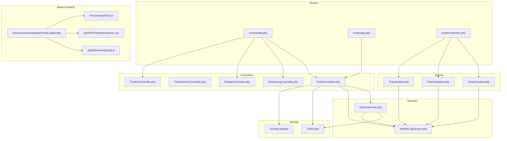
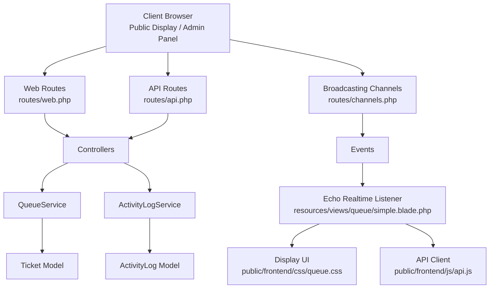
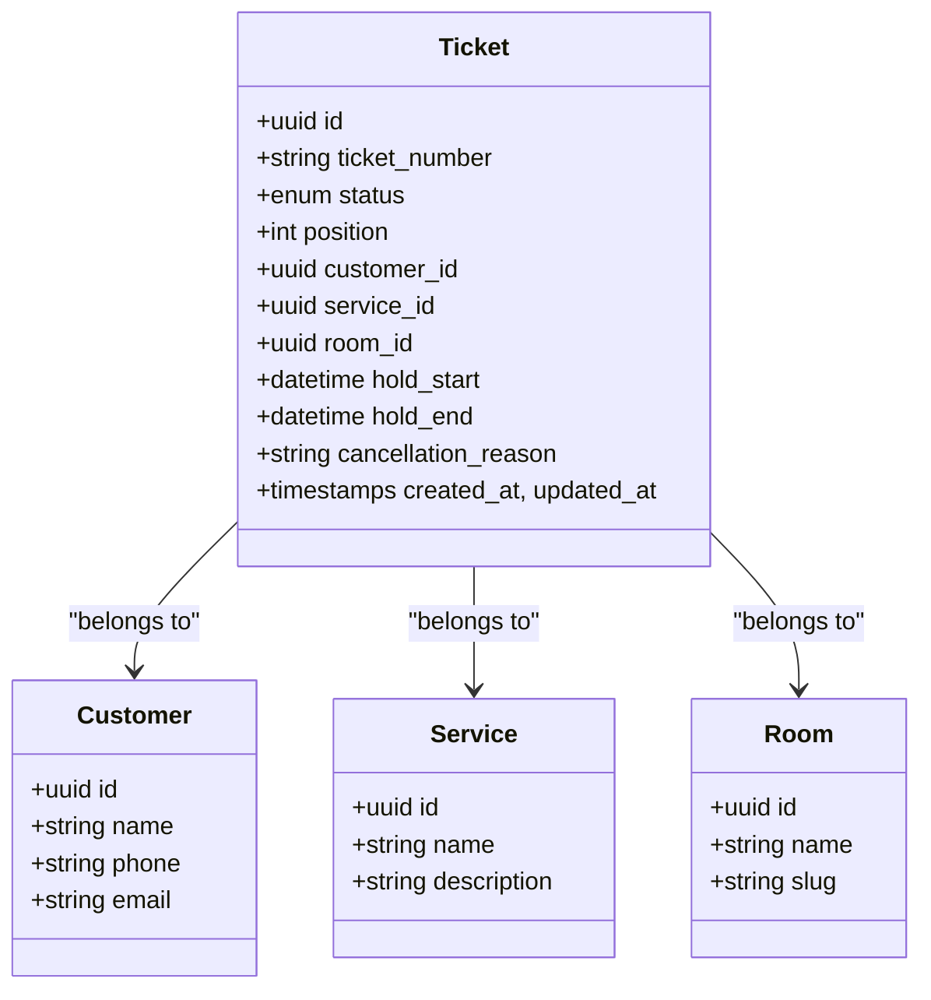
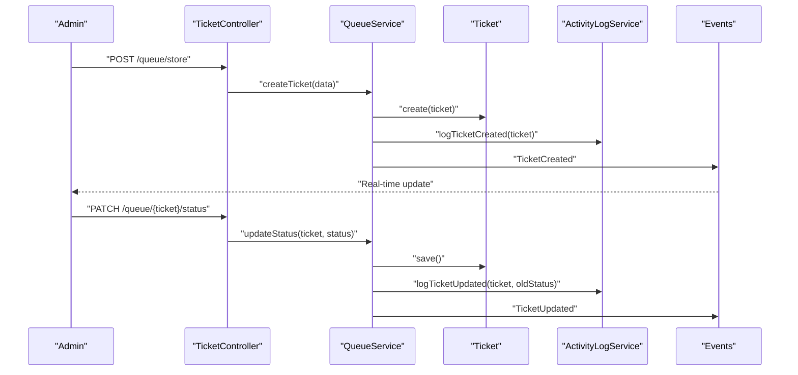
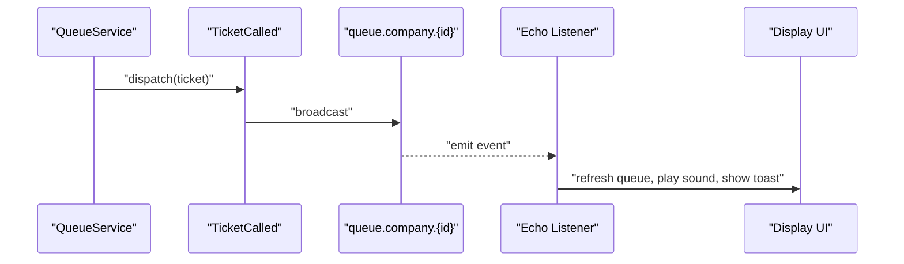
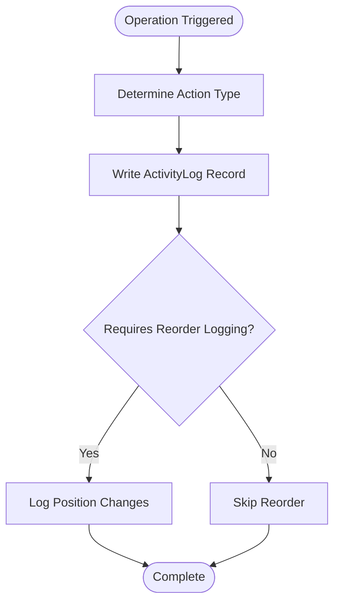
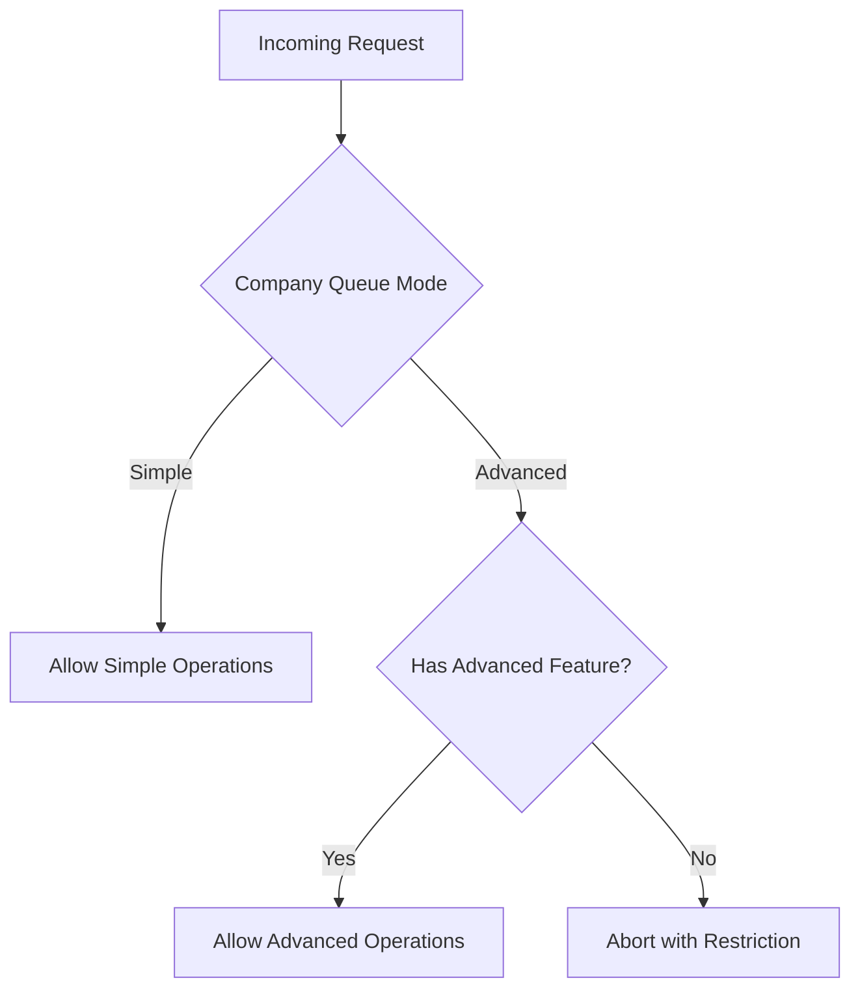
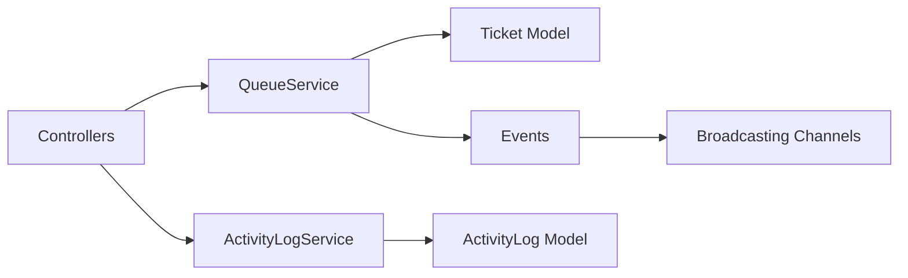

# Queue Management System

<cite>
**Referenced Files in This Document**
- [web.php](file://routes/web.php)
- [api.php](file://routes/api.php)
- [channels.php](file://routes/channels.php)
- [QueueService.php](file://app/Modules/Queue/Serivces/QueueService.php)
- [ActivityLogService.php](file://app/Modules/Queue/Services/ActivityLogService.php)
- [Ticket.php](file://app/Modules/Queue/Models/Ticket.php)
- [ActivityLog.php](file://app/Modules/Queue/Models/ActivityLog.php)
- [TicketController.php](file://app/Modules/Queue/Controllers/TicketController.php)
- [ActivityLogController.php](file://app/Modules/Queue/Controllers/ActivityLogController.php)
- [TicketHistoryController.php](file://app/Modules/Queue/Controllers/TicketHistoryController.php)
- [DisplayController.php](file://app/Modules/Queue/Controllers/DisplayController.php)
- [TrackerController.php](file://app/Modules/Queue/Controllers/TrackerController.php)
- [TicketCreated.php](file://app/Modules/Queue/Events/TicketCreated.php)
- [TicketUpdated.php](file://app/Modules/Queue/Events/TicketUpdated.php)
- [TicketCalled.php](file://app/Modules/Queue/Events/TicketCalled.php)
- [EnsureQueueMode.php](file://app/Http/Middleware/EnsureQueueMode.php)
- [simple.blade.php](file://resources/views/queue/simple.blade.php)
- [queue.css](file://public/frontend/css/queue.css)
- [api.js](file://public/frontend/js/api.js)
- [echo.js](file://resources/js/echo.js)
- [TicketCancellationTest.php](file://tests/Feature/TicketCancellationTest.php)
</cite>

## Table of Contents
1. [Introduction](#introduction)
2. [Project Structure](#project-structure)
3. [Core Components](#core-components)
4. [Architecture Overview](#architecture-overview)
5. [Detailed Component Analysis](#detailed-component-analysis)
6. [Dependency Analysis](#dependency-analysis)
7. [Performance Considerations](#performance-considerations)
8. [Troubleshooting Guide](#troubleshooting-guide)
9. [Conclusion](#conclusion)
10. [Appendices](#appendices)

## Introduction
The Queue Management System provides a scalable solution for managing customer tickets in service environments. It supports two operational modes—simple and advanced—enabling organizations to configure queue behavior according to their needs. The system integrates real-time updates via WebSockets, maintains a comprehensive activity log for auditability, and offers administrative controls for queue operations.

Key capabilities include:
- Ticket lifecycle management with status transitions
- Queue operations such as creation, calling, holding, resuming, and cancellation
- Real-time display integration for public screens
- Administrative dashboards and reporting
- Drag-and-drop reordering in advanced mode
- Activity logging for compliance and troubleshooting

## Project Structure
The Queue module is organized into controllers, models, services, events, middleware, and views. Routes define both web and API endpoints for queue management and real-time integrations.

**Diagram sources**
- [web.php:24-149](file://routes/web.php#L24-L149)
- [api.php](file://routes/api.php)
- [channels.php](file://routes/channels.php)
- [TicketController.php](file://app/Modules/Queue/Controllers/TicketController.php)
- [TicketHistoryController.php](file://app/Modules/Queue/Controllers/TicketHistoryController.php)
- [ActivityLogController.php](file://app/Modules/Queue/Controllers/ActivityLogController.php)
- [DisplayController.php](file://app/Modules/Queue/Controllers/DisplayController.php)
- [TrackerController.php](file://app/Modules/Queue/Controllers/TrackerController.php)
- [QueueService.php](file://app/Modules/Queue/Services/QueueService.php)
- [ActivityLogService.php](file://app/Modules/Queue/Services/ActivityLogService.php)
- [Ticket.php](file://app/Modules/Queue/Models/Ticket.php)
- [ActivityLog.php](file://app/Modules/Queue/Models/ActivityLog.php)
- [TicketCreated.php](file://app/Modules/Queue/Events/TicketCreated.php)
- [TicketUpdated.php](file://app/Modules/Queue/Events/TicketUpdated.php)
- [TicketCalled.php](file://app/Modules/Queue/Events/TicketCalled.php)
- [simple.blade.php:378-393](file://resources/views/queue/simple.blade.php#L378-L393)
- [queue.css](file://public/frontend/css/queue.css)
- [api.js](file://public/frontend/js/api.js)
- [echo.js](file://resources/js/echo.js)

**Section sources**
- [web.php:24-149](file://routes/web.php#L24-L149)
- [api.php](file://routes/api.php)
- [channels.php](file://routes/channels.php)

## Core Components
- Ticket model: Represents individual customer requests with status, position, service association, and customer linkage. Supports hold/cancel states and UUIDs for external integrations.
- QueueService: Orchestrates queue operations including ticket creation, status updates, calling, hold/resume/cancel actions, and reordering in advanced mode.
- ActivityLogService: Centralized logging for all queue operations, enabling audits and troubleshooting.
- Controllers: Expose queue management endpoints and real-time display/tracker interfaces.
- Events: Publish real-time updates for ticket creation, updates, and calls.
- Middleware: Enforces queue mode restrictions for advanced-only features.
- Views & Assets: Provide real-time listeners and UI for public displays and tracking.

**Section sources**
- [Ticket.php](file://app/Modules/Queue/Models/Ticket.php)
- [QueueService.php](file://app/Modules/Queue/Services/QueueService.php)
- [ActivityLogService.php](file://app/Modules/Queue/Services/ActivityLogService.php)
- [TicketController.php](file://app/Modules/Queue/Controllers/TicketController.php)
- [ActivityLogController.php](file://app/Modules/Queue/Controllers/ActivityLogController.php)
- [DisplayController.php](file://app/Modules/Queue/Controllers/DisplayController.php)
- [TrackerController.php](file://app/Modules/Queue/Controllers/TrackerController.php)
- [TicketCreated.php](file://app/Modules/Queue/Events/TicketCreated.php)
- [TicketUpdated.php](file://app/Modules/Queue/Events/TicketUpdated.php)
- [TicketCalled.php](file://app/Modules/Queue/Events/TicketCalled.php)
- [EnsureQueueMode.php](file://app/Http/Middleware/EnsureQueueMode.php)
- [simple.blade.php:378-393](file://resources/views/queue/simple.blade.php#L378-L393)

## Architecture Overview
The system follows a layered architecture:
- Presentation: Web and API routes, controllers, and Blade templates.
- Application: QueueService orchestrating business logic and ActivityLogService for auditing.
- Domain: Ticket model encapsulating state and relationships.
- Infrastructure: Broadcasting channels for real-time updates and middleware for access control.

**Diagram sources**
- [web.php:24-149](file://routes/web.php#L24-L149)
- [api.php](file://routes/api.php)
- [channels.php](file://routes/channels.php)
- [QueueService.php](file://app/Modules/Queue/Services/QueueService.php)
- [ActivityLogService.php](file://app/Modules/Queue/Services/ActivityLogService.php)
- [Ticket.php](file://app/Modules/Queue/Models/Ticket.php)
- [ActivityLog.php](file://app/Modules/Queue/Models/ActivityLog.php)
- [TicketCreated.php](file://app/Modules/Queue/Events/TicketCreated.php)
- [TicketUpdated.php](file://app/Modules/Queue/Events/TicketUpdated.php)
- [TicketCalled.php](file://app/Modules/Queue/Events/TicketCalled.php)
- [simple.blade.php:378-393](file://resources/views/queue/simple.blade.php#L378-L393)
- [queue.css](file://public/frontend/css/queue.css)
- [api.js](file://public/frontend/js/api.js)

## Detailed Component Analysis

### Ticket Model and Lifecycle
The Ticket model defines the core entity for queue management:
- Status transitions: waiting → called → serving → done; plus hold variants and cancellations.
- Relationships: belongs to a customer and optionally to a service and room.
- Business rules: position ordering, UUID support for external systems, and hold/cancel metadata.

**Diagram sources**
- [Ticket.php](file://app/Modules/Queue/Models/Ticket.php)

**Section sources**
- [Ticket.php](file://app/Modules/Queue/Models/Ticket.php)

### QueueService Implementation
QueueService handles all queue operations:
- Ticket creation: assigns position, sets initial status, and triggers creation event.
- Status updates: validates transitions and logs changes.
- Calling tickets: auto-completes currently serving/called tickets in the same room, then selects the next ticket based on mode.
- Hold/Resume/Cancel: manages hold windows and cancellation reasons with appropriate state transitions.
- Reordering: drag-and-drop reordering in advanced mode with position adjustments and logging.

**Diagram sources**
- [TicketController.php](file://app/Modules/Queue/Controllers/TicketController.php)
- [QueueService.php](file://app/Modules/Queue/Services/QueueService.php)
- [ActivityLogService.php](file://app/Modules/Queue/Services/ActivityLogService.php)
- [TicketCreated.php](file://app/Modules/Queue/Events/TicketCreated.php)
- [TicketUpdated.php](file://app/Modules/Queue/Events/TicketUpdated.php)

**Section sources**
- [QueueService.php](file://app/Modules/Queue/Services/QueueService.php)
- [TicketController.php](file://app/Modules/Queue/Controllers/TicketController.php)
- [ActivityLogService.php](file://app/Modules/Queue/Services/ActivityLogService.php)

### Real-Time Display Integration
Real-time updates are broadcast via Laravel Echo and consumed by public displays and admin panels:
- Broadcasting channels: queue.company.{id} for tenant isolation.
- Event listeners: ticket.created, ticket.updated, ticket.called.
- Frontend integration: Echo channel subscription and toast notifications.

**Diagram sources**
- [TicketCalled.php](file://app/Modules/Queue/Events/TicketCalled.php)
- [simple.blade.php:378-393](file://resources/views/queue/simple.blade.php#L378-L393)
- [echo.js](file://resources/js/echo.js)

**Section sources**
- [simple.blade.php:378-393](file://resources/views/queue/simple.blade.php#L378-L393)
- [TicketCalled.php](file://app/Modules/Queue/Events/TicketCalled.php)

### API Endpoints for Queue Management
The system exposes REST-like endpoints under the queue namespace:
- GET /queue: List tickets with filtering and permissions.
- POST /queue/store: Create a new ticket.
- POST /queue/call: Call the next ticket or a specific ticket.
- PATCH /queue/{ticket}/status: Update ticket status.
- PATCH /queue/{ticket}/room: Change ticket’s room assignment.
- POST /queue/{ticket}/hold: Place a ticket on hold.
- POST /queue/{ticket}/resume: Resume a held ticket.
- POST /queue/{ticket}/cancel-hold: Cancel hold.
- POST /queue/{ticket}/cancel: Cancel a ticket with a reason.
- POST /queue/reorder: Reorder tickets (advanced mode).

Administrative endpoints:
- GET /tickets: View ticket history and details.
- GET /activity-logs: Access activity logs (admin-only).

**Section sources**
- [web.php:119-136](file://routes/web.php#L119-L136)
- [TicketController.php](file://app/Modules/Queue/Controllers/TicketController.php)

### Activity Log System
ActivityLogService records all queue operations for auditability:
- Captures user actions, timestamps, and model changes.
- Stores action type, target model, and optional reordering details.
- Provides centralized retrieval via ActivityLogController.

**Diagram sources**
- [ActivityLogService.php](file://app/Modules/Queue/Services/ActivityLogService.php)
- [ActivityLog.php](file://app/Modules/Queue/Models/ActivityLog.php)
- [ActivityLogController.php](file://app/Modules/Queue/Controllers/ActivityLogController.php)

**Section sources**
- [ActivityLogService.php](file://app/Modules/Queue/Services/ActivityLogService.php)
- [ActivityLog.php](file://app/Modules/Queue/Models/ActivityLog.php)
- [ActivityLogController.php](file://app/Modules/Queue/Controllers/ActivityLogController.php)

### Queue Modes and Administrative Controls
- Queue modes: simple (FIFO) and advanced (drag-and-drop, reordering).
- Middleware: EnsureQueueMode restricts access to advanced-only features based on company settings.
- Company settings: Configure queue mode and rules (VIP, on-time, grace, walk-in).

**Diagram sources**
- [EnsureQueueMode.php](file://app/Http/Middleware/EnsureQueueMode.php)
- [web.php:132-134](file://routes/web.php#L132-L134)

**Section sources**
- [EnsureQueueMode.php](file://app/Http/Middleware/EnsureQueueMode.php)
- [web.php:119-136](file://routes/web.php#L119-L136)

## Dependency Analysis
The Queue module exhibits clear separation of concerns:
- Controllers depend on QueueService and ActivityLogService.
- QueueService depends on the Ticket model and ActivityLogService.
- Events integrate with broadcasting channels for real-time updates.
- Middleware enforces queue mode policies.

**Diagram sources**
- [TicketController.php](file://app/Modules/Queue/Controllers/TicketController.php)
- [QueueService.php](file://app/Modules/Queue/Services/QueueService.php)
- [ActivityLogService.php](file://app/Modules/Queue/Services/ActivityLogService.php)
- [Ticket.php](file://app/Modules/Queue/Models/Ticket.php)
- [ActivityLog.php](file://app/Modules/Queue/Models/ActivityLog.php)
- [TicketCreated.php](file://app/Modules/Queue/Events/TicketCreated.php)
- [TicketUpdated.php](file://app/Modules/Queue/Events/TicketUpdated.php)
- [TicketCalled.php](file://app/Modules/Queue/Events/TicketCalled.php)
- [channels.php](file://routes/channels.php)

**Section sources**
- [TicketController.php](file://app/Modules/Queue/Controllers/TicketController.php)
- [QueueService.php](file://app/Modules/Queue/Services/QueueService.php)
- [ActivityLogService.php](file://app/Modules/Queue/Services/ActivityLogService.php)
- [Ticket.php](file://app/Modules/Queue/Models/Ticket.php)
- [ActivityLog.php](file://app/Modules/Queue/Models/ActivityLog.php)
- [TicketCreated.php](file://app/Modules/Queue/Events/TicketCreated.php)
- [TicketUpdated.php](file://app/Modules/Queue/Events/TicketUpdated.php)
- [TicketCalled.php](file://app/Modules/Queue/Events/TicketCalled.php)
- [channels.php](file://routes/channels.php)

## Performance Considerations
- Use position-based ordering for simple mode to minimize database writes.
- Batch operations for reordering in advanced mode to reduce transaction overhead.
- Indexes on status, position, company_id, and room_id for efficient queries.
- Leverage broadcasting channels to avoid polling and reduce server load.
- Cache frequently accessed queue summaries for dashboards and displays.
- Limit payload sizes in real-time events to keep network latency low.

## Troubleshooting Guide
Common issues and resolutions:
- Invalid status transitions: Ensure transitions follow the defined lifecycle (waiting → called → serving → done).
- Duplicate ticket numbers: Verify uniqueness constraints and generation logic.
- Hold window conflicts: Validate hold_start and hold_end boundaries.
- Cancellation errors: Confirm cancellation reason is recorded and state updated.
- Real-time updates not appearing: Check Echo channel subscription and broadcasting configuration.
- Reordering anomalies: Validate position recalculations and log reorder actions.

Validation references:
- Ticket cancellation tests demonstrate expected behavior for cancel operations.

**Section sources**
- [TicketCancellationTest.php](file://tests/Feature/TicketCancellationTest.php)

## Conclusion
The Queue Management System provides a robust, extensible foundation for managing customer queues with real-time visibility and comprehensive auditing. Its dual-mode operation, strong domain modeling, and real-time integration enable efficient service delivery and smooth administration across diverse environments.

## Appendices
- Real-time assets: Echo configuration and CSS/JS for display integration.
- Public display routes: Endpoints for public screens and device pairing.
- Tracker endpoints: Landing page, status page, and hub for customer tracking.

**Section sources**
- [simple.blade.php:378-393](file://resources/views/queue/simple.blade.php#L378-L393)
- [queue.css](file://public/frontend/css/queue.css)
- [api.js](file://public/frontend/js/api.js)
- [echo.js](file://resources/js/echo.js)
- [web.php:24-32](file://routes/web.php#L24-L32)
- [web.php:146-149](file://routes/web.php#L146-L149)