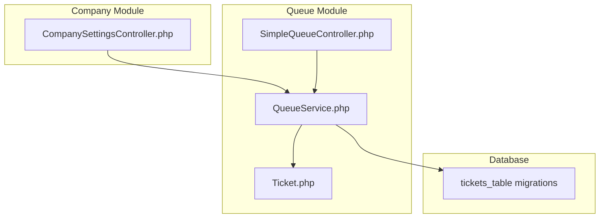
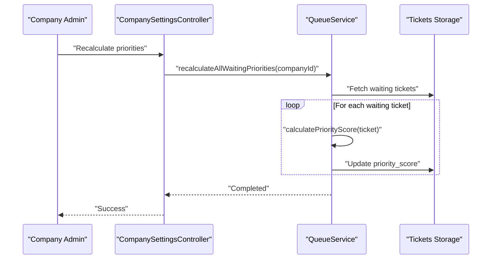
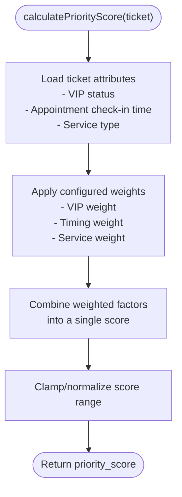
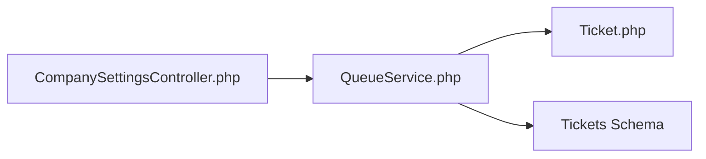

# Queue Positioning & Priority Algorithms

<cite>
**Referenced Files in This Document**
- [QueueService.php](file://app/Modules/Queue/Services/QueueService.php)
- [Ticket.php](file://app/Modules/Queue/Models/Ticket.php)
- [SimpleQueueController.php](file://app/Modules/Queue/Controllers/SimpleQueueController.php)
- [CompanySettingsController.php](file://app/Modules/Companies/Controllers/CompanySettingsController.php)
- [tickets_table.php](file://database/migrations/2026_04_16_150001_create_tickets_table.php)
- [tickets_table.php](file://database/migrations/2026_05_18_104849_make_service_id_nullable_on_tickets_table.php)
- [tickets_table.php](file://database/migrations/2026_06_04_085017_add_hold_fields_to_tickets_table.php)
- [tickets_table.php](file://database/migrations/2026_06_04_091653_add_on_hold_status_to_tickets_status_enum.php)
- [tickets_table.php](file://database/migrations/2026_06_05_070939_add_hold_cancelled_status_to_tickets_status_enum.php)
</cite>

## Table of Contents
1. [Introduction](#introduction)
2. [Project Structure](#project-structure)
3. [Core Components](#core-components)
4. [Architecture Overview](#architecture-overview)
5. [Detailed Component Analysis](#detailed-component-analysis)
6. [Dependency Analysis](#dependency-analysis)
7. [Performance Considerations](#performance-considerations)
8. [Troubleshooting Guide](#troubleshooting-guide)
9. [Conclusion](#conclusion)

## Introduction
This document explains the queue positioning and priority algorithms used to determine ticket priority in the system. It covers how priority scores are calculated based on VIP status, appointment check-in timing, and service type, how companies can configure priority rules, and how the system supports both simple FIFO queue mode and advanced priority-based queue mode. It also documents the process for recalculating priorities when rules change and describes the sorting criteria used in each mode.

## Project Structure
The queue functionality is primarily implemented in the Queue module, with key components:
- QueueService: Core business logic for priority calculations and queue operations
- Ticket model: Data structure representing queue entries with priority attributes
- SimpleQueueController: Handles simple FIFO queue operations
- CompanySettingsController: Provides administrative controls to recalculate priorities across a company

**Diagram sources**
- [QueueService.php](file://app/Modules/Queue/Services/QueueService.php)
- [Ticket.php](file://app/Modules/Queue/Models/Ticket.php)
- [SimpleQueueController.php](file://app/Modules/Queue/Controllers/SimpleQueueController.php)
- [CompanySettingsController.php](file://app/Modules/Companies/Controllers/CompanySettingsController.php)

**Section sources**
- [QueueService.php](file://app/Modules/Queue/Services/QueueService.php)
- [Ticket.php](file://app/Modules/Queue/Models/Ticket.php)
- [SimpleQueueController.php](file://app/Modules/Queue/Controllers/SimpleQueueController.php)
- [CompanySettingsController.php](file://app/Modules/Companies/Controllers/CompanySettingsController.php)

## Core Components
- Priority scoring engine: Computes a numeric priority score per ticket based on configurable rules
- Queue modes:
  - Simple FIFO: Orders by insertion order (position)
  - Advanced priority-based: Orders by priority_score, then by position
- Recalculation mechanism: Updates all waiting tickets' priority_score when rules change
- Ticket model enhancements: Stores priority_score, position, and related attributes

Key implementation references:
- Priority calculation method: [calculatePriorityScore:121-160](file://app/Modules/Queue/Services/QueueService.php#L121-L160)
- Priority recalculation: [recalculateAllWaitingPriorities:164-175](file://app/Modules/Queue/Services/QueueService.php#L164-L175)
- Ticket model attributes: [Ticket.php](file://app/Modules/Queue/Models/Ticket.php)

**Section sources**
- [QueueService.php:121-175](file://app/Modules/Queue/Services/QueueService.php#L121-L175)
- [Ticket.php](file://app/Modules/Queue/Models/Ticket.php)

## Architecture Overview
The priority system integrates with the Ticket model and QueueService. Companies can trigger a bulk recalculation via the CompanySettingsController, which invokes QueueService to update all waiting tickets.

**Diagram sources**
- [CompanySettingsController.php:100-110](file://app/Modules/Companies/Controllers/CompanySettingsController.php#L100-L110)
- [QueueService.php:164-175](file://app/Modules/Queue/Services/QueueService.php#L164-L175)

## Detailed Component Analysis

### Priority Calculation Engine
The calculatePriorityScore method computes a numeric score that reflects a ticket's current priority. The score considers:
- VIP status: Higher weight for VIP customers
- Appointment check-in timing: Earlier check-ins receive higher priority
- Service type: Certain services may receive priority weighting

The method signature and core logic are defined in:
- [calculatePriorityScore:121-160](file://app/Modules/Queue/Services/QueueService.php#L121-L160)

Processing flow:

**Diagram sources**
- [QueueService.php:121-160](file://app/Modules/Queue/Services/QueueService.php#L121-L160)

**Section sources**
- [QueueService.php:121-160](file://app/Modules/Queue/Services/QueueService.php#L121-L160)

### Queue Modes: Simple FIFO vs Advanced Priority-Based
- Simple FIFO queue mode:
  - Sort by position only
  - No priority_score used
  - Suitable for basic first-come-first-served scenarios
- Advanced priority-based queue mode:
  - Sort by priority_score, then by position
  - Requires priority_score to be populated
  - Enables dynamic prioritization based on VIP, timing, and service type

Sorting criteria:
- Simple mode: position ascending
- Advanced mode: priority_score descending, then position ascending

These behaviors are enforced by the queue retrieval logic in:
- [SimpleQueueController.php](file://app/Modules/Queue/Controllers/SimpleQueueController.php)

**Section sources**
- [SimpleQueueController.php](file://app/Modules/Queue/Controllers/SimpleQueueController.php)

### Priority Rule Configuration System
Companies can customize priority rules through the administration interface. When rules change, administrators trigger a bulk recalculation to update all waiting tickets. The controller action that initiates this process is:
- [CompanySettingsController.php:100-110](file://app/Modules/Companies/Controllers/CompanySettingsController.php#L100-L110)

The recalculation process updates each waiting ticket's priority_score using the latest rules.

**Section sources**
- [CompanySettingsController.php:100-110](file://app/Modules/Companies/Controllers/CompanySettingsController.php#L100-L110)
- [QueueService.php:164-175](file://app/Modules/Queue/Services/QueueService.php#L164-L175)

### Recalculating All Waiting Priorities
When priority rules change, the system recalculates scores for all waiting tickets to reflect new conditions. The process:
- Fetches all waiting tickets for a company
- Re-runs calculatePriorityScore for each
- Persists updated priority_score values

Implementation reference:
- [recalculateAllWaitingPriorities:164-175](file://app/Modules/Queue/Services/QueueService.php#L164-L175)

**Section sources**
- [QueueService.php:164-175](file://app/Modules/Queue/Services/QueueService.php#L164-L175)

### Ticket Model and Schema
The Ticket model stores priority-related attributes and status fields. Key schema elements include:
- priority_score: Numeric score used for advanced queue ordering
- position: Used in simple FIFO ordering
- Status enumeration: Includes waiting, called, completed, on_hold variants, and cancelled variants
- Service association: Optional service_id for service-type-based weighting

Schema references:
- [tickets_table creation](file://database/migrations/2026_04_16_150001_create_tickets_table.php)
- [make service_id nullable](file://database/migrations/2026_05_18_104849_make_service_id_nullable_on_tickets_table.php)
- [add hold fields](file://database/migrations/2026_06_04_085017_add_hold_fields_to_tickets_table.php)
- [add hold/cancelled statuses](file://database/migrations/2026_06_04_091653_add_on_hold_status_to_tickets_status_enum.php)
- [add hold_cancelled status](file://database/migrations/2026_06_05_070939_add_hold_cancelled_status_to_tickets_status_enum.php)

**Section sources**
- [Ticket.php](file://app/Modules/Queue/Models/Ticket.php)
- [tickets_table.php](file://database/migrations/2026_04_16_150001_create_tickets_table.php)
- [tickets_table.php](file://database/migrations/2026_05_18_104849_make_service_id_nullable_on_tickets_table.php)
- [tickets_table.php](file://database/migrations/2026_06_04_085017_add_hold_fields_to_tickets_table.php)
- [tickets_table.php](file://database/migrations/2026_06_04_091653_add_on_hold_status_to_tickets_status_enum.php)
- [tickets_table.php](file://database/migrations/2026_06_05_070939_add_hold_cancelled_status_to_tickets_status_enum.php)

### Priority Scenarios and Examples
Below are representative scenarios illustrating how priority scores might be computed under typical configurations. These examples demonstrate conceptual outcomes rather than exact values.

- VIP customer with early appointment check-in and high-priority service:
  - Expected outcome: High priority_score
- Regular customer with late check-in and standard service:
  - Expected outcome: Lower priority_score
- VIP customer with late check-in but high-priority service:
  - Expected outcome: Medium-high priority_score (service weight may offset timing)
- Customer on hold who resumes service:
  - Expected outcome: Retains previous priority_score until recalculated

These scenarios illustrate how VIP status, timing, and service type influence the final score.

[No sources needed since this section provides conceptual examples]

### Position-Based Ordering
In simple FIFO mode, tickets are ordered by position. This ensures a strict first-come-first-served sequence regardless of VIP status or service type.

**Section sources**
- [SimpleQueueController.php](file://app/Modules/Queue/Controllers/SimpleQueueController.php)

### Dual Sorting Criteria
In advanced priority-based mode, tickets are sorted by:
1. priority_score (descending)
2. position (ascending)

This ensures that higher-priority tickets are served first, while maintaining stable ordering among equally prioritized tickets.

**Section sources**
- [QueueService.php:121-160](file://app/Modules/Queue/Services/QueueService.php#L121-L160)

## Dependency Analysis
The priority system depends on:
- Ticket model for storing priority_score and position
- QueueService for computing and updating priority scores
- CompanySettingsController for triggering bulk recalculations
- Database migrations defining the tickets table schema

**Diagram sources**
- [CompanySettingsController.php:100-110](file://app/Modules/Companies/Controllers/CompanySettingsController.php#L100-L110)
- [QueueService.php](file://app/Modules/Queue/Services/QueueService.php)
- [Ticket.php](file://app/Modules/Queue/Models/Ticket.php)

**Section sources**
- [CompanySettingsController.php:100-110](file://app/Modules/Companies/Controllers/CompanySettingsController.php#L100-L110)
- [QueueService.php](file://app/Modules/Queue/Services/QueueService.php)
- [Ticket.php](file://app/Modules/Queue/Models/Ticket.php)

## Performance Considerations
- Bulk recalculation cost: Recalculating priority_score for all waiting tickets scales linearly with queue size. For very large queues, consider batching updates or scheduling during off-peak hours.
- Indexing: Ensure database indexes exist on frequently queried columns (status, company_id, position, priority_score) to optimize retrieval and sorting.
- Caching: Cache computed scores for static segments of the queue to reduce recomputation overhead.
- Concurrency: When recalculating, lock or batch updates to avoid race conditions and excessive contention.

[No sources needed since this section provides general guidance]

## Troubleshooting Guide
Common issues and resolutions:
- Unexpected priority ordering:
  - Verify queue mode selection (simple vs advanced)
  - Confirm priority_score values are being updated after rule changes
- Tickets not reordering after rule updates:
  - Trigger recalculation via the administration interface
  - Check that waiting tickets exist and are eligible for recalculation
- Performance degradation during recalculations:
  - Split updates into smaller batches
  - Schedule recalculations during low-traffic periods

**Section sources**
- [QueueService.php:164-175](file://app/Modules/Queue/Services/QueueService.php#L164-L175)
- [CompanySettingsController.php:100-110](file://app/Modules/Companies/Controllers/CompanySettingsController.php#L100-L110)

## Conclusion
The queue positioning and priority algorithms provide flexible, rule-driven prioritization for tickets. Companies can configure rules and instantly apply them across all waiting tickets through a dedicated recalculation process. Administrators can choose between simple FIFO and advanced priority-based modes, enabling efficient service delivery tailored to their operational needs.