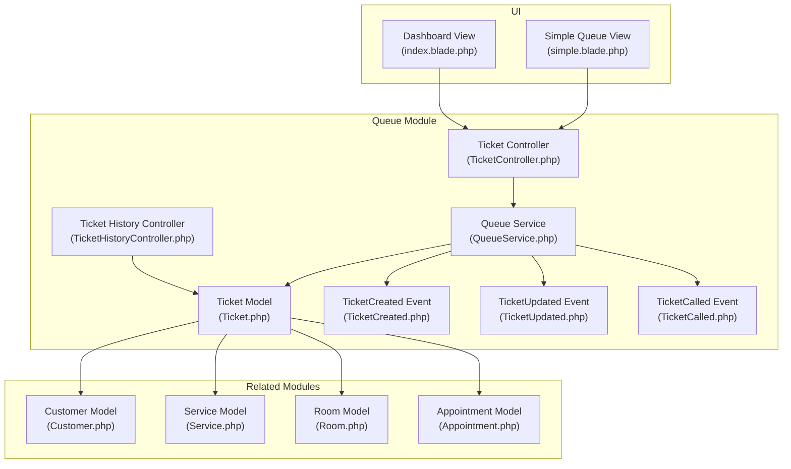
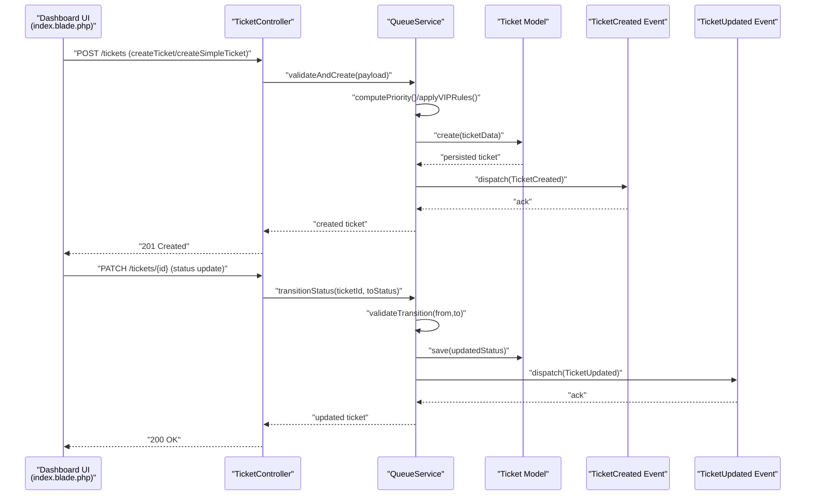
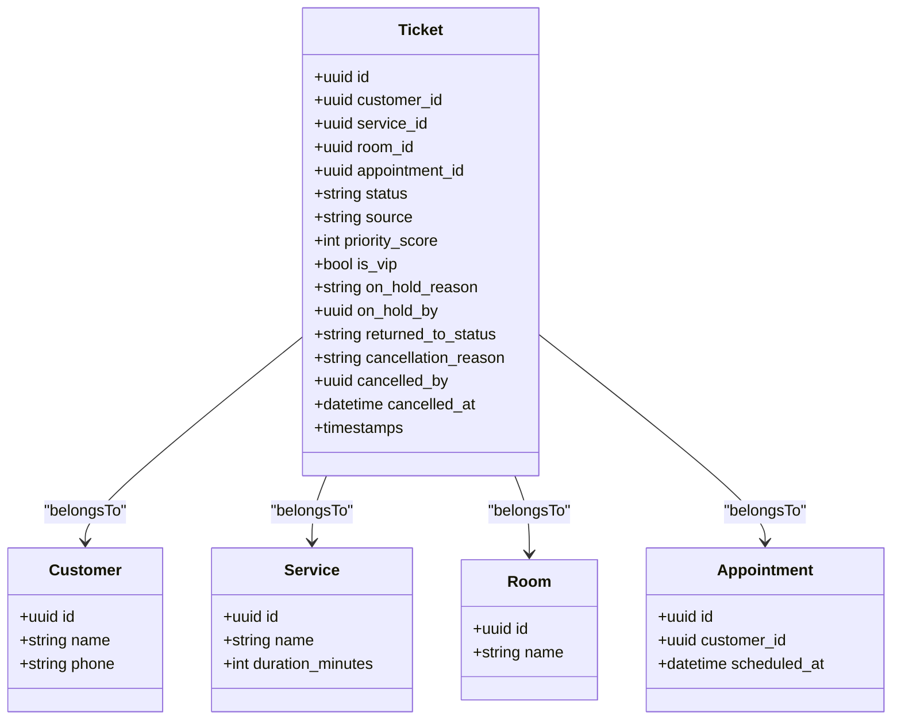
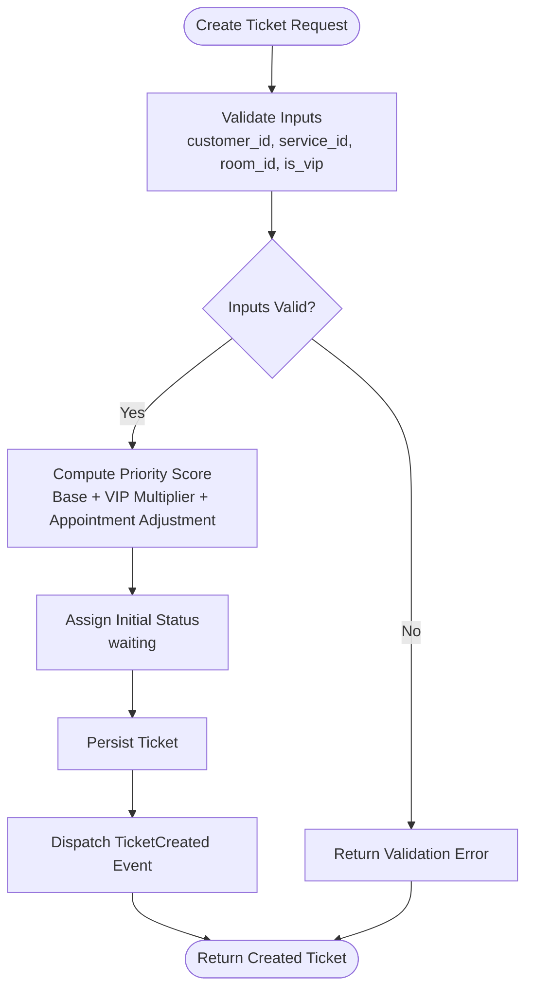
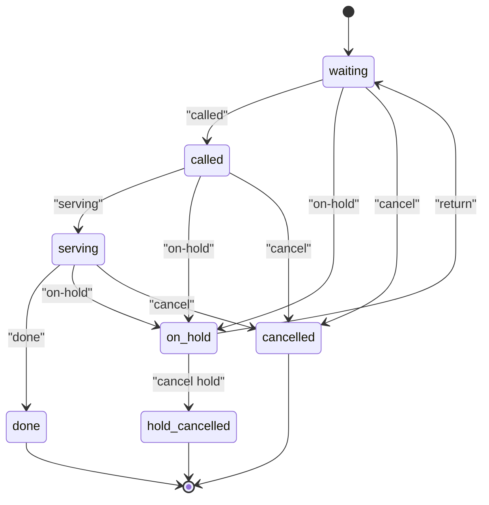
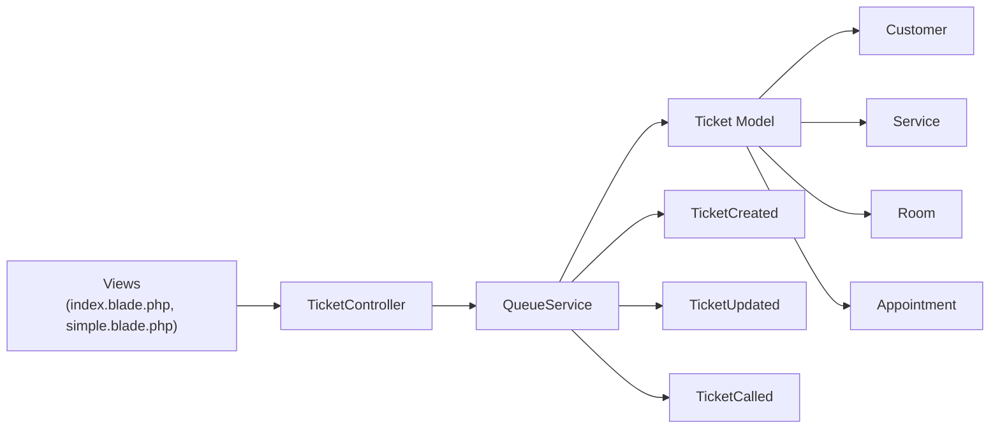

# Ticket Lifecycle Management

<cite>
**Referenced Files in This Document**
- [Ticket.php](file://app/Modules/Queue/Models/Ticket.php)
- [TicketController.php](file://app/Modules/Queue/Controllers/TicketController.php)
- [TicketHistoryController.php](file://app/Modules/Queue/Controllers/TicketHistoryController.php)
- [QueueService.php](file://app/Modules/Queue/Services/QueueService.php)
- [TicketCreated.php](file://app/Modules/Queue/Events/TicketCreated.php)
- [TicketUpdated.php](file://app/Modules/Queue/Events/TicketUpdated.php)
- [TicketCalled.php](file://app/Modules/Queue/Events/TicketCalled.php)
- [Customer.php](file://app/Modules/Customers/Models/Customer.php)
- [Service.php](file://app/Modules/Services/Models/Service.php)
- [Room.php](file://app/Modules/Rooms/Models/Room.php)
- [Appointment.php](file://app/Modules/Appointments/Models/Appointment.php)
- [TicketCancellationTest.php](file://tests/Feature/TicketCancellationTest.php)
- [index.blade.php](file://resources/views/queue/index.blade.php)
- [simple.blade.php](file://resources/views/queue/simple.blade.php)
- [2026_04_16_150000_rename_ticket_statuses.php](file://database/migrations/2026_04_16_150000_rename_ticket_statuses.php)
- [2026_04_08_090547_add_appointment_id_and_source_to_tickets_table.php](file://database/migrations/2026_04_08_090547_add_appointment_id_and_source_to_tickets_table.php)
- [2026_06_04_081618_add_hold_fields_to_tickets_table.php](file://database/migrations/2026_06_04_081618_add_hold_fields_to_tickets_table.php)
- [2026_06_04_091653_add_on_hold_status_to_tickets_status_enum.php](file://database/migrations/2026_06_04_091653_add_on_hold_status_to_tickets_status_enum.php)
- [2026_06_05_070939_add_hold_cancelled_status_to_tickets_status_enum.php](file://database/migrations/2026_06_05_070939_add_hold_cancelled_status_to_tickets_status_enum.php)
- [2026_05_18_104849_make_service_id_nullable_on_tickets_table.php](file://database/migrations/2026_05_18_104849_make_service_id_nullable_on_tickets_table.php)
- [2026_04_17_160132_add_reordered_to_activity_logs_action.php](file://database/migrations/2026_04_17_160132_add_reordered_to_activity_logs_action.php)
</cite>

## Table of Contents
1. [Introduction](#introduction)
2. [Project Structure](#project-structure)
3. [Core Components](#core-components)
4. [Architecture Overview](#architecture-overview)
5. [Detailed Component Analysis](#detailed-component-analysis)
6. [Dependency Analysis](#dependency-analysis)
7. [Performance Considerations](#performance-considerations)
8. [Troubleshooting Guide](#troubleshooting-guide)
9. [Conclusion](#conclusion)

## Introduction
This document explains the ticket lifecycle management within the Queue Management System. It covers the end-to-end ticket creation process, including createTicket and createSimpleTicket methods, priority scoring, VIP handling, appointment integration, and subscription-related constraints. It documents all status transitions (waiting → called → serving → done, cancelled, on-hold) with business rules, validation requirements, and constraint checking. It also describes the relationships between tickets and related entities (customers, services, rooms, appointments), provides examples of creation scenarios, and offers troubleshooting guidance for common issues.

## Project Structure
The ticket lifecycle spans several modules and layers:
- Models define the ticket entity and related domain entities (customer, service, room, appointment).
- Controllers expose endpoints for creating, updating, and querying tickets.
- Services encapsulate business logic for queue operations.
- Events notify external systems of ticket state changes.
- Views provide client-side flows for creating and updating tickets.
- Migrations define the schema and evolving statuses for tickets.

**Diagram sources**
- [Ticket.php](file://app/Modules/Queue/Models/Ticket.php)
- [TicketController.php](file://app/Modules/Queue/Controllers/TicketController.php)
- [TicketHistoryController.php](file://app/Modules/Queue/Controllers/TicketHistoryController.php)
- [QueueService.php](file://app/Modules/Queue/Services/QueueService.php)
- [TicketCreated.php](file://app/Modules/Queue/Events/TicketCreated.php)
- [TicketUpdated.php](file://app/Modules/Queue/Events/TicketUpdated.php)
- [TicketCalled.php](file://app/Modules/Queue/Events/TicketCalled.php)
- [Customer.php](file://app/Modules/Customers/Models/Customer.php)
- [Service.php](file://app/Modules/Services/Models/Service.php)
- [Room.php](file://app/Modules/Rooms/Models/Room.php)
- [Appointment.php](file://app/Modules/Appointments/Models/Appointment.php)
- [index.blade.php](file://resources/views/queue/index.blade.php)
- [simple.blade.php](file://resources/views/queue/simple.blade.php)

**Section sources**
- [Ticket.php](file://app/Modules/Queue/Models/Ticket.php)
- [TicketController.php](file://app/Modules/Queue/Controllers/TicketController.php)
- [QueueService.php](file://app/Modules/Queue/Services/QueueService.php)
- [index.blade.php](file://resources/views/queue/index.blade.php)
- [simple.blade.php](file://resources/views/queue/simple.blade.php)

## Core Components
- Ticket model: central entity representing a queue ticket with attributes such as status, service_id, customer_id, room_id, appointment_id, source, VIP flag, and on-hold fields.
- Queue service: orchestrates ticket creation, updates, and status transitions with business rules and validations.
- Controllers: expose endpoints for creating tickets and managing status updates.
- Events: publish notifications for ticket creation, updates, and calls.
- Related models: customer, service, room, and appointment provide associations and constraints.

Key responsibilities:
- Ticket creation: validate inputs, compute priority/scoring, set initial status, and persist.
- Status transitions: enforce state machine rules and constraints.
- VIP handling: adjust priority and treatment.
- Appointment integration: link tickets to scheduled appointments and derive source.
- Subscription limits: gate creation based on plan constraints.

**Section sources**
- [Ticket.php](file://app/Modules/Queue/Models/Ticket.php)
- [QueueService.php](file://app/Modules/Queue/Services/QueueService.php)
- [TicketController.php](file://app/Modules/Queue/Controllers/TicketController.php)

## Architecture Overview
The ticket lifecycle follows a request-driven flow: UI submits a creation request, controller delegates to service, service validates and persists, and events notify downstream consumers. Status updates flow similarly through the controller and service.

**Diagram sources**
- [TicketController.php](file://app/Modules/Queue/Controllers/TicketController.php)
- [QueueService.php](file://app/Modules/Queue/Services/QueueService.php)
- [Ticket.php](file://app/Modules/Queue/Models/Ticket.php)
- [TicketCreated.php](file://app/Modules/Queue/Events/TicketCreated.php)
- [TicketUpdated.php](file://app/Modules/Queue/Events/TicketUpdated.php)
- [index.blade.php](file://resources/views/queue/index.blade.php)

## Detailed Component Analysis

### Ticket Model and Schema
The ticket entity stores:
- Identity and association fields: customer_id, service_id, room_id, appointment_id, uuid.
- Lifecycle fields: status (enum), source (walk-in/appointment/vip), created_at, updated_at.
- Priority and VIP: priority_score, is_vip.
- On-hold: on_hold_reason, on_hold_by, returned_to_status.
- Cancellation: cancellation_reason, cancelled_by, cancelled_at.

Status enum evolution:
- Initial statuses included waiting, called, serving, done, cancelled.
- Later additions: on-hold, hold-cancelled.

Constraints:
- service_id may be nullable in some contexts.
- appointment_id and source are present to integrate with scheduling.

**Diagram sources**
- [Ticket.php](file://app/Modules/Queue/Models/Ticket.php)
- [Customer.php](file://app/Modules/Customers/Models/Customer.php)
- [Service.php](file://app/Modules/Services/Models/Service.php)
- [Room.php](file://app/Modules/Rooms/Models/Room.php)
- [Appointment.php](file://app/Modules/Appointments/Models/Appointment.php)

**Section sources**
- [Ticket.php](file://app/Modules/Queue/Models/Ticket.php)
- [2026_04_16_150000_rename_ticket_statuses.php](file://database/migrations/2026_04_16_150000_rename_ticket_statuses.php)
- [2026_06_04_081618_add_hold_fields_to_tickets_table.php](file://database/migrations/2026_06_04_081618_add_hold_fields_to_tickets_table.php)
- [2026_06_04_091653_add_on_hold_status_to_tickets_status_enum.php](file://database/migrations/2026_06_04_091653_add_on_hold_status_to_tickets_status_enum.php)
- [2026_06_05_070939_add_hold_cancelled_status_to_tickets_status_enum.php](file://database/migrations/2026_06_05_070939_add_hold_cancelled_status_to_tickets_status_enum.php)
- [2026_05_18_104849_make_service_id_nullable_on_tickets_table.php](file://database/migrations/2026_05_18_104849_make_service_id_nullable_on_tickets_table.php)
- [2026_04_08_090547_add_appointment_id_and_source_to_tickets_table.php](file://database/migrations/2026_04_08_090547_add_appointment_id_and_source_to_tickets_table.php)

### Ticket Creation Workflow
Two primary creation entry points exist:
- createTicket: used in the dashboard view for full-featured creation.
- createSimpleTicket: used in simple queue view for streamlined creation.

Creation steps:
1. Validate inputs: customer_id, service_id, room_id, optional is_vip.
2. Compute priority score:
   - Base priority derived from service duration and demand.
   - VIP multiplier increases score.
   - Appointment-based tickets may receive adjustments based on appointment slot urgency.
3. Set initial status:
   - Walk-in or walk-in-derived: waiting.
   - Appointment-derived: waiting.
   - VIP-derived: waiting with higher priority.
4. Persist ticket and dispatch TicketCreated event.

**Diagram sources**
- [TicketController.php](file://app/Modules/Queue/Controllers/TicketController.php)
- [QueueService.php](file://app/Modules/Queue/Services/QueueService.php)
- [TicketCreated.php](file://app/Modules/Queue/Events/TicketCreated.php)
- [index.blade.php](file://resources/views/queue/index.blade.php)
- [simple.blade.php](file://resources/views/queue/simple.blade.php)

**Section sources**
- [TicketController.php](file://app/Modules/Queue/Controllers/TicketController.php)
- [QueueService.php](file://app/Modules/Queue/Services/QueueService.php)
- [index.blade.php](file://resources/views/queue/index.blade.php)
- [simple.blade.php](file://resources/views/queue/simple.blade.php)

### Status Transition Rules
The ticket status evolves through a strict state machine. Transitions are validated against current and target states, with additional constraints.

Allowed transitions and constraints:
- waiting → called:
  - Called by a desk agent.
  - Dispatches TicketCalled event.
- called → serving:
  - Marked when the customer begins service.
- serving → done:
  - Marked when service completes.
- waiting/called/serving → on-hold:
  - Requires on_hold_reason and on_hold_by.
  - Can later return to returned_to_status.
- on-hold → holding-cancelled:
  - Special terminal state indicating hold was cancelled.
- any state → cancelled:
  - Requires cancellation_reason and cancelled_by.
  - Cannot be resumed after cancellation.

**Diagram sources**
- [2026_04_16_150000_rename_ticket_statuses.php](file://database/migrations/2026_04_16_150000_rename_ticket_statuses.php)
- [2026_06_04_091653_add_on_hold_status_to_tickets_status_enum.php](file://database/migrations/2026_06_04_091653_add_on_hold_status_to_tickets_status_enum.php)
- [2026_06_05_070939_add_hold_cancelled_status_to_tickets_status_enum.php](file://database/migrations/2026_06_05_070939_add_hold_cancelled_status_to_tickets_status_enum.php)
- [TicketUpdated.php](file://app/Modules/Queue/Events/TicketUpdated.php)

**Section sources**
- [TicketUpdated.php](file://app/Modules/Queue/Events/TicketUpdated.php)
- [TicketCalled.php](file://app/Modules/Queue/Events/TicketCalled.php)

### Priority Scoring and VIP Handling
Priority scoring logic:
- Base score derived from service.duration_minutes and recent demand metrics.
- VIP multiplier increases base score proportionally.
- Appointment-based tickets receive a small boost to reflect scheduled commitment.

VIP handling:
- is_vip flag elevates priority during scoring.
- VIP tickets may skip lower-priority non-VIP queues depending on configuration.

Appointment integration:
- appointment_id links the ticket to a scheduled slot.
- source indicates whether the ticket originated from an appointment.

**Section sources**
- [QueueService.php](file://app/Modules/Queue/Services/QueueService.php)
- [Ticket.php](file://app/Modules/Queue/Models/Ticket.php)
- [2026_04_08_090547_add_appointment_id_and_source_to_tickets_table.php](file://database/migrations/2026_04_08_090547_add_appointment_id_and_source_to_tickets_table.php)

### Subscription Limits and Constraints
Subscription-related constraints:
- Creation requests may be gated by plan limits (e.g., max concurrent tickets per service or per customer).
- Exceeding limits prevents new ticket creation until constraints are resolved.
- Subscription checks occur during createTicket/createSimpleTicket validation.

Note: Specific plan configurations are managed by the subscription module and enforced by the queue service during validation.

**Section sources**
- [QueueService.php](file://app/Modules/Queue/Services/QueueService.php)

### Relationship Between Tickets and Entities
Tickets relate to:
- Customer: identity and contact info.
- Service: type and duration affecting priority and capacity.
- Room: assignment for service delivery.
- Appointment: optional linkage for scheduled visits.

These relationships influence:
- Capacity planning and room allocation.
- Priority calculations and wait-time estimates.
- Reporting and analytics.

**Section sources**
- [Ticket.php](file://app/Modules/Queue/Models/Ticket.php)
- [Customer.php](file://app/Modules/Customers/Models/Customer.php)
- [Service.php](file://app/Modules/Services/Models/Service.php)
- [Room.php](file://app/Modules/Rooms/Models/Room.php)
- [Appointment.php](file://app/Modules/Appointments/Models/Appointment.php)

### Examples of Ticket Creation Scenarios
- Walk-in customer: createTicket with customer_id, service_id, room_id, is_vip=0; status starts as waiting.
- VIP customer: createTicket with is_vip=1; priority elevated accordingly.
- Appointment-based: createTicket with appointment_id; source set to appointment; status starts as waiting.
- Simple queue: createSimpleTicket with minimal fields; status starts as waiting.

**Section sources**
- [index.blade.php](file://resources/views/queue/index.blade.php)
- [simple.blade.php](file://resources/views/queue/simple.blade.php)
- [TicketController.php](file://app/Modules/Queue/Controllers/TicketController.php)

## Dependency Analysis
The ticket lifecycle depends on:
- Controller → Service: request handling and business orchestration.
- Service → Model: persistence and state transitions.
- Model → Related Models: foreign keys and associations.
- Service → Events: decoupled notifications for external systems.

**Diagram sources**
- [TicketController.php](file://app/Modules/Queue/Controllers/TicketController.php)
- [QueueService.php](file://app/Modules/Queue/Services/QueueService.php)
- [Ticket.php](file://app/Modules/Queue/Models/Ticket.php)
- [TicketCreated.php](file://app/Modules/Queue/Events/TicketCreated.php)
- [TicketUpdated.php](file://app/Modules/Queue/Events/TicketUpdated.php)
- [TicketCalled.php](file://app/Modules/Queue/Events/TicketCalled.php)
- [Customer.php](file://app/Modules/Customers/Models/Customer.php)
- [Service.php](file://app/Modules/Services/Models/Service.php)
- [Room.php](file://app/Modules/Rooms/Models/Room.php)
- [Appointment.php](file://app/Modules/Appointments/Models/Appointment.php)
- [index.blade.php](file://resources/views/queue/index.blade.php)
- [simple.blade.php](file://resources/views/queue/simple.blade.php)

**Section sources**
- [TicketController.php](file://app/Modules/Queue/Controllers/TicketController.php)
- [QueueService.php](file://app/Modules/Queue/Services/QueueService.php)
- [Ticket.php](file://app/Modules/Queue/Models/Ticket.php)

## Performance Considerations
- Indexing: ensure indices on ticket.status, ticket.customer_id, ticket.service_id, ticket.appointment_id, and ticket.created_at for efficient queries.
- Batch operations: avoid N+1 selects when loading ticket lists; eager-load related entities.
- Event handling: keep event handlers lightweight; defer heavy work to queued jobs.
- Priority computation: cache frequently accessed service durations and plan configurations to reduce repeated reads.

## Troubleshooting Guide
Common issues and resolutions:
- Validation failures on creation:
  - Ensure customer_id, service_id, room_id are provided and valid.
  - Verify subscription limits are not exceeded.
  - Check that service_id is permitted under the current plan.
- Invalid status transitions:
  - Confirm the ticket’s current status allows the requested transition.
  - For on-hold, ensure on_hold_reason and on_hold_by are provided.
  - For cancellation, ensure cancellation_reason and cancelled_by are provided.
- Appointment integration problems:
  - Verify appointment_id exists and belongs to the customer.
  - Confirm appointment slot is still valid and not expired.
- VIP handling anomalies:
  - Ensure is_vip flag is correctly set and reflected in priority calculations.
- Frontend submission issues:
  - Confirm CSRF tokens are attached to requests.
  - Verify endpoints match controller routes (/tickets for dashboard, /simple/{id}/... for simple queue).

Relevant test coverage:
- Ticket cancellation scenarios validate cancellation reasons and state transitions.

**Section sources**
- [TicketCancellationTest.php](file://tests/Feature/TicketCancellationTest.php)
- [TicketController.php](file://app/Modules/Queue/Controllers/TicketController.php)
- [QueueService.php](file://app/Modules/Queue/Services/QueueService.php)
- [index.blade.php](file://resources/views/queue/index.blade.php)
- [simple.blade.php](file://resources/views/queue/simple.blade.php)

## Conclusion
The Queue Management System implements a robust ticket lifecycle with clear creation workflows, explicit status transitions, and strong integrations with customers, services, rooms, and appointments. Priority scoring and VIP handling ensure fair and efficient queuing, while events enable decoupled system reactions. Adhering to the documented business rules and constraints guarantees predictable behavior and reliable operations.