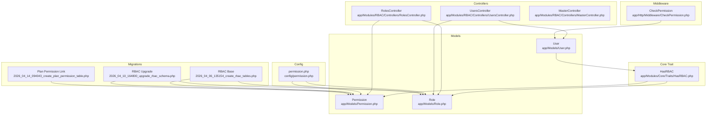
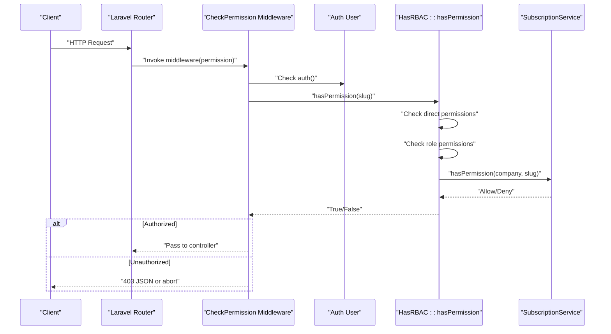
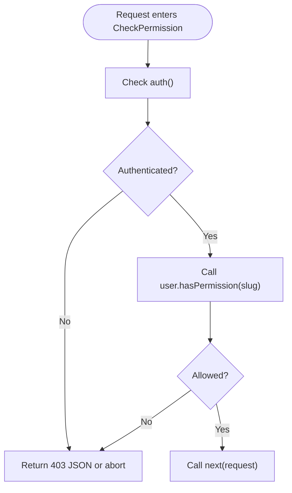
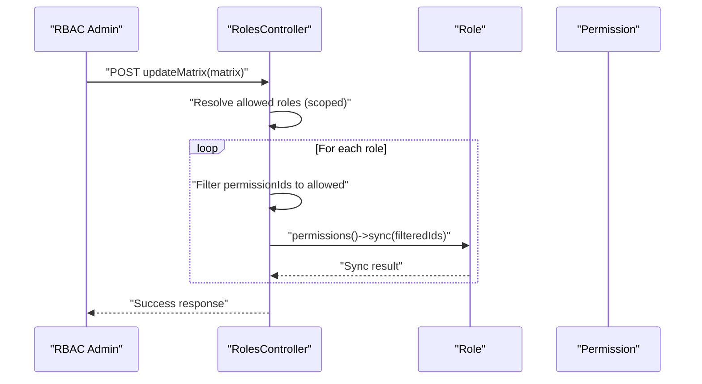
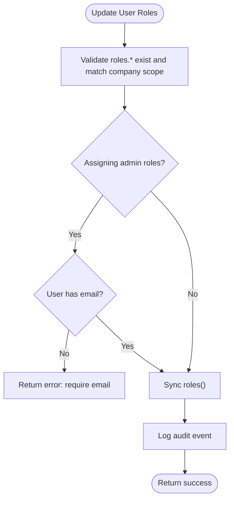
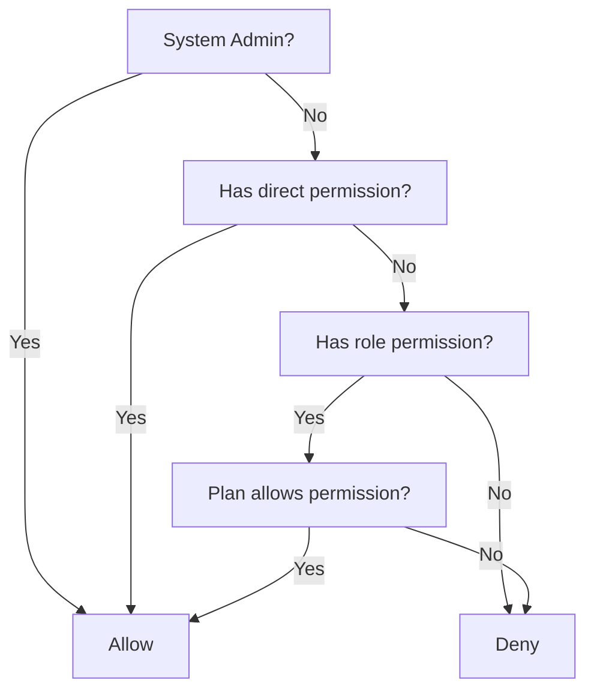
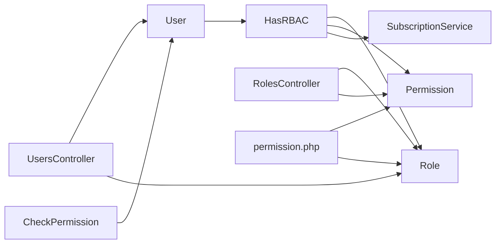

# Permission Handling

<cite>
**Referenced Files in This Document**
- [Permission.php](file://app/Models/Permission.php)
- [Role.php](file://app/Models/Role.php)
- [User.php](file://app/Models/User.php)
- [HasRBAC.php](file://app/Modules/Core/Traits/HasRBAC.php)
- [CheckPermission.php](file://app/Http/Middleware/CheckPermission.php)
- [UsersController.php](file://app/Modules/RBAC/Controllers/UsersController.php)
- [RolesController.php](file://app/Modules/RBAC/Controllers/RolesController.php)
- [MasterController.php](file://app/Modules/RBAC/Controllers/MasterController.php)
- [permission.php](file://config/permission.php)
- [2026_04_06_135154_create_rbac_tables.php](file://database/migrations/2026_04_06_135154_create_rbac_tables.php)
- [2026_04_10_164800_upgrade_rbac_schema.php](file://database/migrations/2026_04_10_164800_upgrade_rbac_schema.php)
- [2026_04_14_094043_create_plan_permission_table.php](file://database/migrations/2026_04_14_094043_create_plan_permission_table.php)
- [web.php](file://routes/web.php)
</cite>

## Table of Contents
1. [Introduction](#introduction)
2. [Project Structure](#project-structure)
3. [Core Components](#core-components)
4. [Architecture Overview](#architecture-overview)
5. [Detailed Component Analysis](#detailed-component-analysis)
6. [Dependency Analysis](#dependency-analysis)
7. [Performance Considerations](#performance-considerations)
8. [Troubleshooting Guide](#troubleshooting-guide)
9. [Conclusion](#conclusion)
10. [Appendices](#appendices)

## Introduction
This document explains the permission handling subsystem within the Role-Based Access Control (RBAC) system. It covers the Permission model, permission creation and categorization, permission assignment, user permission management, middleware enforcement, inheritance patterns, permission groups, dynamic evaluation against company plans, and integration with the Spatie Laravel Permission package. Practical workflows for creating permissions, bulk assignments, and conflict resolution are included, along with examples of permission checking APIs, middleware usage, and permission-based route protection.

## Project Structure
The RBAC implementation spans models, traits, controllers, middleware, configuration, and migrations. Key areas:
- Models define permissions, roles, and users with multi-tenant scoping and global flags.
- A reusable HasRBAC trait encapsulates permission checks and role/permission relations.
- Controllers manage user roles and the permission matrix.
- Middleware enforces runtime authorization per route or controller action.
- Configuration integrates with Spatie’s package while customizing table names and behavior.
- Migrations define the RBAC schema, including global flags and plan-permission linkage.

**Diagram sources**
- [Permission.php:1-22](file://app/Models/Permission.php#L1-L22)
- [Role.php:1-27](file://app/Models/Role.php#L1-L27)
- [User.php:1-190](file://app/Models/User.php#L1-L190)
- [HasRBAC.php:1-104](file://app/Modules/Core/Traits/HasRBAC.php#L1-L104)
- [UsersController.php:1-347](file://app/Modules/RBAC/Controllers/UsersController.php#L1-L347)
- [RolesController.php:1-88](file://app/Modules/RBAC/Controllers/RolesController.php#L1-L88)
- [MasterController.php:38-68](file://app/Modules/RBAC/Controllers/MasterController.php#L38-L68)
- [CheckPermission.php:1-28](file://app/Http/Middleware/CheckPermission.php#L1-L28)
- [permission.php:1-207](file://config/permission.php#L1-L207)
- [2026_04_06_135154_create_rbac_tables.php:1-66](file://database/migrations/2026_04_06_135154_create_rbac_tables.php#L1-L66)
- [2026_04_10_164800_upgrade_rbac_schema.php:1-63](file://database/migrations/2026_04_10_164800_upgrade_rbac_schema.php#L1-L63)
- [2026_04_14_094043_create_plan_permission_table.php:1-31](file://database/migrations/2026_04_14_094043_create_plan_permission_table.php#L1-L31)

**Section sources**
- [Permission.php:1-22](file://app/Models/Permission.php#L1-L22)
- [Role.php:1-27](file://app/Models/Role.php#L1-L27)
- [User.php:1-190](file://app/Models/User.php#L1-L190)
- [HasRBAC.php:1-104](file://app/Modules/Core/Traits/HasRBAC.php#L1-L104)
- [CheckPermission.php:1-28](file://app/Http/Middleware/CheckPermission.php#L1-L28)
- [UsersController.php:1-347](file://app/Modules/RBAC/Controllers/UsersController.php#L1-L347)
- [RolesController.php:1-88](file://app/Modules/RBAC/Controllers/RolesController.php#L1-L88)
- [MasterController.php:38-68](file://app/Modules/RBAC/Controllers/MasterController.php#L38-L68)
- [permission.php:1-207](file://config/permission.php#L1-L207)
- [2026_04_06_135154_create_rbac_tables.php:1-66](file://database/migrations/2026_04_06_135154_create_rbac_tables.php#L1-L66)
- [2026_04_10_164800_upgrade_rbac_schema.php:1-63](file://database/migrations/2026_04_10_164800_upgrade_rbac_schema.php#L1-L63)
- [2026_04_14_094043_create_plan_permission_table.php:1-31](file://database/migrations/2026_04_14_094043_create_plan_permission_table.php#L1-L31)

## Core Components
- Permission model: Defines permission metadata (name, slug, module, description) and relationships to roles and companies. Supports global vs tenant-scoped permissions.
- Role model: Defines roles with optional tenant scoping and relationships to users and permissions.
- User model: Uses HasRBAC trait to inherit role/permission relations and permission-checking logic.
- HasRBAC trait: Implements role and permission relations, role checks, permission checks (direct, via roles, and plan gating), and role assignment/removal.
- CheckPermission middleware: Enforces runtime authorization by invoking the user’s permission check.
- RBAC controllers: Manage user roles and the permission matrix, enforcing tenant scoping and validation.
- Spatie configuration: Customizes model classes, table names, and permission check registration.

Key implementation references:
- [Permission model relations:10-21](file://app/Models/Permission.php#L10-L21)
- [Role model relations:10-26](file://app/Models/Role.php#L10-L26)
- [User model uses HasRBAC](file://app/Models/User.php#L18)
- [HasRBAC permission check logic:46-73](file://app/Modules/Core/Traits/HasRBAC.php#L46-L73)
- [HasRBAC role assignment/removal:78-102](file://app/Modules/Core/Traits/HasRBAC.php#L78-L102)
- [CheckPermission middleware:16-26](file://app/Http/Middleware/CheckPermission.php#L16-L26)
- [RBAC controllers:15-86](file://app/Modules/RBAC/Controllers/RolesController.php#L15-L86), [UserController:26-309](file://app/Modules/RBAC/Controllers/UsersController.php#L26-L309)
- [Spatie config overrides:9-33](file://config/permission.php#L9-L33), [table names:35-76](file://config/permission.php#L35-L76)

**Section sources**
- [Permission.php:1-22](file://app/Models/Permission.php#L1-L22)
- [Role.php:1-27](file://app/Models/Role.php#L1-L27)
- [User.php:1-190](file://app/Models/User.php#L1-L190)
- [HasRBAC.php:1-104](file://app/Modules/Core/Traits/HasRBAC.php#L1-L104)
- [CheckPermission.php:1-28](file://app/Http/Middleware/CheckPermission.php#L1-L28)
- [RolesController.php:1-88](file://app/Modules/RBAC/Controllers/RolesController.php#L1-L88)
- [UsersController.php:1-347](file://app/Modules/RBAC/Controllers/UsersController.php#L1-L347)
- [permission.php:1-207](file://config/permission.php#L1-L207)

## Architecture Overview
The RBAC subsystem combines:
- Multi-tenant scoping: Roles and permissions can be global or scoped to a company.
- Permission inheritance: Users inherit permissions via assigned roles; direct permission assignments augment role-based permissions.
- Plan gating: Dynamic permission evaluation considers the company’s plan to allow or deny features.
- Runtime enforcement: Middleware validates permissions per request.
- Route protection: Routes are wrapped with permission middleware for fine-grained access control.

**Diagram sources**
- [CheckPermission.php:16-26](file://app/Http/Middleware/CheckPermission.php#L16-L26)
- [HasRBAC.php:46-73](file://app/Modules/Core/Traits/HasRBAC.php#L46-L73)
- [SubscriptionService.php:117-132](file://app/Modules/Subscriptions/Services/SubscriptionService.php#L117-L132)

**Section sources**
- [CheckPermission.php:1-28](file://app/Http/Middleware/CheckPermission.php#L1-L28)
- [HasRBAC.php:46-73](file://app/Modules/Core/Traits/HasRBAC.php#L46-L73)
- [SubscriptionService.php:117-132](file://app/Modules/Subscriptions/Services/SubscriptionService.php#L117-L132)

## Detailed Component Analysis

### Permission Model and Categorization
- Fields: name, slug, module, description, is_global, company_id.
- Relationships:
  - Belongs to many roles.
  - Belongs to many companies via permission_company pivot.
- Global vs tenant-scoped:
  - is_global flag distinguishes cross-company permissions.
  - Company-scoped permissions linked via permission_company pivot.

Practical implications:
- Permissions can be grouped by module for UI and filtering.
- Global permissions apply across tenants; tenant-scoped permissions require company context.

**Section sources**
- [Permission.php:10-21](file://app/Models/Permission.php#L10-L21)
- [2026_04_10_164800_upgrade_rbac_schema.php:15-44](file://database/migrations/2026_04_10_164800_upgrade_rbac_schema.php#L15-L44)

### Role Model and Assignment
- Fields: name, slug, is_global, description.
- Relationships:
  - Belongs to many users.
  - Belongs to many permissions.
  - Belongs to many companies via role_company pivot.
- Role assignment:
  - Users are constrained to global roles or roles assigned to their company.

**Section sources**
- [Role.php:10-26](file://app/Models/Role.php#L10-L26)
- [HasRBAC.php:15-24](file://app/Modules/Core/Traits/HasRBAC.php#L15-L24)

### User Model and RBAC Trait
- User model uses HasRBAC trait to:
  - Define role relation scoped to global or company.
  - Define direct permission relation.
  - Provide hasRole and hasPermission helpers.
- Permission evaluation order:
  1) Direct permission assignment.
  2) Role-based permissions.
  3) Plan-based gating via SubscriptionService.

**Section sources**
- [User.php](file://app/Models/User.php#L18)
- [HasRBAC.php:37-73](file://app/Modules/Core/Traits/HasRBAC.php#L37-L73)

### Permission Checking and Middleware Enforcement
- CheckPermission middleware:
  - Validates authenticated user and calls user.hasPermission(slug).
  - Returns JSON 403 for AJAX requests or aborts with 403 otherwise.
- Middleware usage:
  - Applied at route level to protect actions (e.g., rooms routes).

**Diagram sources**
- [CheckPermission.php:16-26](file://app/Http/Middleware/CheckPermission.php#L16-L26)
- [HasRBAC.php:46-73](file://app/Modules/Core/Traits/HasRBAC.php#L46-L73)

**Section sources**
- [CheckPermission.php:1-28](file://app/Http/Middleware/CheckPermission.php#L1-L28)
- [web.php:171-179](file://routes/web.php#L171-L179)

### Permission Matrix and Bulk Assignment
- RolesController.matrix:
  - System admins see all roles and permissions.
  - Tenants see global roles/permissions plus those assigned to their company.
- RolesController.updateMatrix:
  - Updates role-permission mappings.
  - Enforces scoping: non-system admins can only update company roles and can only sync allowed permissions visible to them.
- MasterController permission listing:
  - Provides paginated, searchable, and filterable permissions across modules and scopes.

**Diagram sources**
- [RolesController.php:49-86](file://app/Modules/RBAC/Controllers/RolesController.php#L49-L86)

**Section sources**
- [RolesController.php:15-86](file://app/Modules/RBAC/Controllers/RolesController.php#L15-L86)
- [MasterController.php:38-68](file://app/Modules/RBAC/Controllers/MasterController.php#L38-L68)

### User Permission Management
- UserController manages user roles and statuses:
  - Validates role assignments against company scope.
  - Prevents assigning admin roles without an email.
  - Logs changes via ActivityLogService.
  - Disallows self-deletion and protects primary admin accounts.

**Diagram sources**
- [UsersController.php:272-309](file://app/Modules/RBAC/Controllers/UsersController.php#L272-L309)

**Section sources**
- [UsersController.php:272-309](file://app/Modules/RBAC/Controllers/UsersController.php#L272-L309)

### Permission Inheritance Patterns and Dynamic Evaluation
- Inheritance:
  - Direct permission assignments on users.
  - Role-based permissions inherited via role-user relation.
- Plan gating:
  - SubscriptionService.hasPermission(company, slug) checks if the company’s plan includes the permission.
- Evaluation flow:
  - System admins bypass checks.
  - Direct permission → role permission → plan permission.

**Diagram sources**
- [HasRBAC.php:46-73](file://app/Modules/Core/Traits/HasRBAC.php#L46-L73)
- [SubscriptionService.php:117-132](file://app/Modules/Subscriptions/Services/SubscriptionService.php#L117-L132)

**Section sources**
- [HasRBAC.php:46-73](file://app/Modules/Core/Traits/HasRBAC.php#L46-L73)
- [SubscriptionService.php:117-132](file://app/Modules/Subscriptions/Services/SubscriptionService.php#L117-L132)

### Integration with Spatie Laravel Permission
- Customized configuration:
  - Overridden model classes for Permission and Role.
  - Custom table names for Spatie relations.
  - Permission check method registration enabled.
- Schema alignment:
  - RBAC base migration creates roles, permissions, and role-permission pivots.
  - Upgrade migration adds is_global flags and permission-company pivot.
  - Plan-permission pivot links plans to permissions.

**Section sources**
- [permission.php:9-33](file://config/permission.php#L9-L33)
- [permission.php:35-76](file://config/permission.php#L35-L76)
- [permission.php](file://config/permission.php#L108)
- [2026_04_06_135154_create_rbac_tables.php:21-52](file://database/migrations/2026_04_06_135154_create_rbac_tables.php#L21-L52)
- [2026_04_10_164800_upgrade_rbac_schema.php:15-44](file://database/migrations/2026_04_10_164800_upgrade_rbac_schema.php#L15-L44)
- [2026_04_14_094043_create_plan_permission_table.php:14-20](file://database/migrations/2026_04_14_094043_create_plan_permission_table.php#L14-L20)

### Practical Workflows and Examples

- Permission creation workflow:
  - Create permission with name, slug, module, description.
  - Decide is_global or associate with company via permission_company pivot.
  - Assign to roles in the permission matrix.

- Bulk permission assignments:
  - Use RolesController.updateMatrix to sync role-permission mappings.
  - Non-system admins are scoped to visible permissions only.

- Permission conflict resolution:
  - If a role grants a permission but the plan does not allow it, the plan gates deny access.
  - Ensure plan permissions are aligned with intended feature sets.

- Permission checking APIs:
  - Middleware: [CheckPermission middleware:16-26](file://app/Http/Middleware/CheckPermission.php#L16-L26)
  - Controller usage: [UserController role updates:272-309](file://app/Modules/RBAC/Controllers/UsersController.php#L272-L309)
  - Trait usage: [HasRBAC::hasPermission:46-73](file://app/Modules/Core/Traits/HasRBAC.php#L46-L73)

- Middleware usage and route protection:
  - Apply middleware to routes: [Example routes:171-179](file://routes/web.php#L171-L179)

**Section sources**
- [CheckPermission.php:1-28](file://app/Http/Middleware/CheckPermission.php#L1-L28)
- [UsersController.php:272-309](file://app/Modules/RBAC/Controllers/UsersController.php#L272-L309)
- [HasRBAC.php:46-73](file://app/Modules/Core/Traits/HasRBAC.php#L46-L73)
- [web.php:171-179](file://routes/web.php#L171-L179)

## Dependency Analysis
- User depends on HasRBAC trait for permission logic.
- HasRBAC depends on Role, Permission, and SubscriptionService for evaluation.
- Controllers depend on User, Role, Permission, and ActivityLogService.
- Middleware depends on User and HasRBAC.
- Configuration aligns Spatie models and tables with custom RBAC schema.

**Diagram sources**
- [User.php](file://app/Models/User.php#L18)
- [HasRBAC.php:1-104](file://app/Modules/Core/Traits/HasRBAC.php#L1-L104)
- [RolesController.php:1-88](file://app/Modules/RBAC/Controllers/RolesController.php#L1-L88)
- [UsersController.php:1-347](file://app/Modules/RBAC/Controllers/UsersController.php#L1-L347)
- [CheckPermission.php:1-28](file://app/Http/Middleware/CheckPermission.php#L1-L28)
- [permission.php:1-207](file://config/permission.php#L1-L207)

**Section sources**
- [User.php:1-190](file://app/Models/User.php#L1-L190)
- [HasRBAC.php:1-104](file://app/Modules/Core/Traits/HasRBAC.php#L1-L104)
- [RolesController.php:1-88](file://app/Modules/RBAC/Controllers/RolesController.php#L1-L88)
- [UsersController.php:1-347](file://app/Modules/RBAC/Controllers/UsersController.php#L1-L347)
- [CheckPermission.php:1-28](file://app/Http/Middleware/CheckPermission.php#L1-L28)
- [permission.php:1-207](file://config/permission.php#L1-L207)

## Performance Considerations
- Caching: Spatie permission cache is configured with a 24-hour expiration and default store. This reduces repeated permission lookups during a request lifecycle.
- Plan permission caching: SubscriptionService caches plan permissions per plan within a request to avoid redundant queries.
- Relation loading: Controllers eager-load roles and related entities to minimize N+1 queries.

Recommendations:
- Monitor cache keys and stores for multi-tenant environments.
- Consider warming caches after role/permission changes.
- Keep plan permission slugs indexed for fast lookup.

**Section sources**
- [permission.php:183-205](file://config/permission.php#L183-L205)
- [SubscriptionService.php:124-129](file://app/Modules/Subscriptions/Services/SubscriptionService.php#L124-L129)

## Troubleshooting Guide
Common issues and resolutions:
- Unauthorized access errors:
  - Verify the user is authenticated and has the required permission slug.
  - Confirm middleware is applied to the route and the slug matches the permission definition.
  - Check plan permissions if the feature is gated by the company’s plan.

- Role assignment failures:
  - Ensure the selected role is global or assigned to the user’s company.
  - Admin roles require an email address; update the user’s profile first.

- Permission matrix updates blocked:
  - Non-system admins can only update company roles and can only sync allowed permissions visible to them.

- Middleware behavior differences:
  - AJAX requests receive JSON 403; browser requests abort with 403.

**Section sources**
- [CheckPermission.php:18-23](file://app/Http/Middleware/CheckPermission.php#L18-L23)
- [UsersController.php:275-295](file://app/Modules/RBAC/Controllers/UsersController.php#L275-L295)
- [RolesController.php:54-80](file://app/Modules/RBAC/Controllers/RolesController.php#L54-L80)

## Conclusion
The RBAC permission handling subsystem blends Spatie’s package with custom multi-tenant logic. It supports global and tenant-scoped permissions, role-based inheritance, direct user assignments, and plan-based gating. Middleware enforcement ensures runtime authorization, while controllers provide robust management of roles and permissions. The schema and configuration align closely with the application’s tenant-first design, enabling flexible and secure access control.

## Appendices

### Permission Creation Checklist
- Define name, slug, module, description.
- Choose is_global or associate with company via permission_company pivot.
- Assign to roles in the permission matrix.
- Verify plan permissions if feature gating is required.

### Route Protection Examples
- Wrap routes with permission middleware using the permission slug.
- Example pattern: [Route group with permission middleware:171-179](file://routes/web.php#L171-L179)

**Section sources**
- [web.php:171-179](file://routes/web.php#L171-L179)