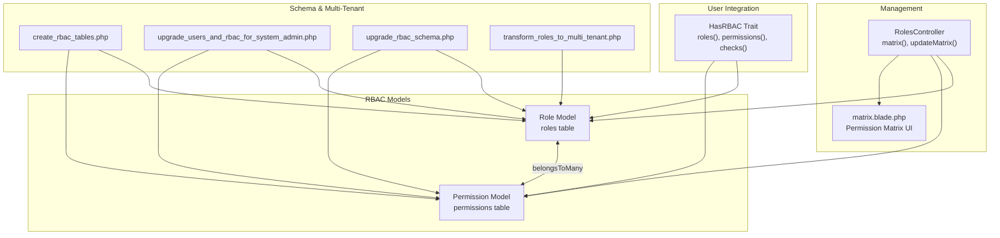
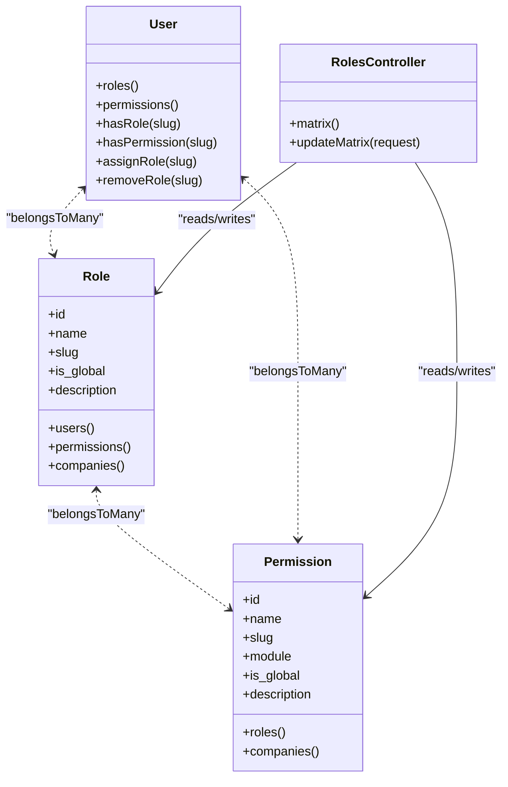
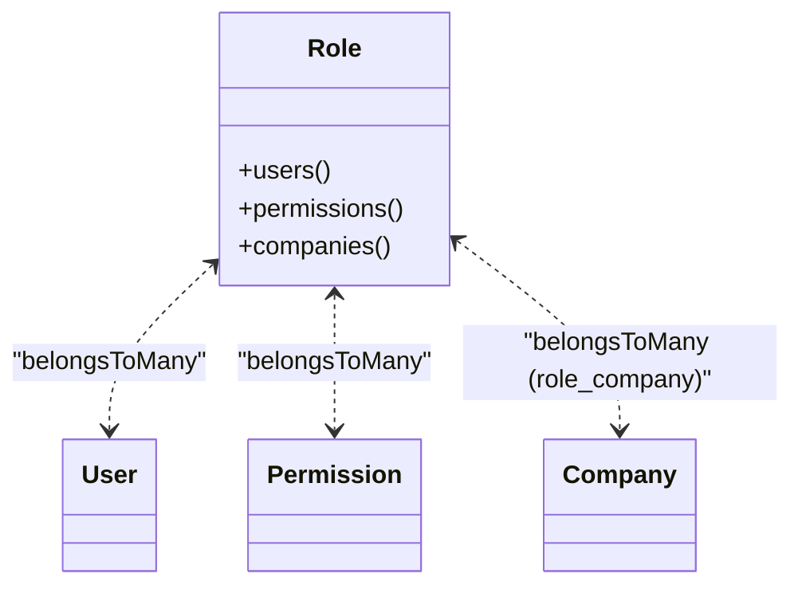
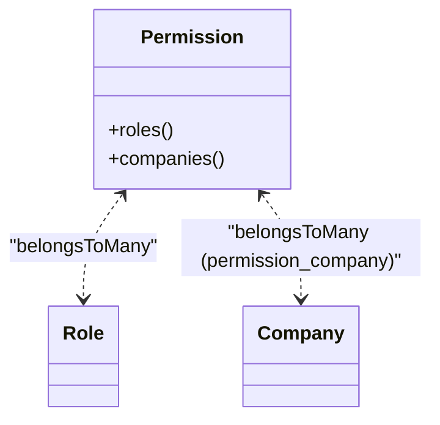
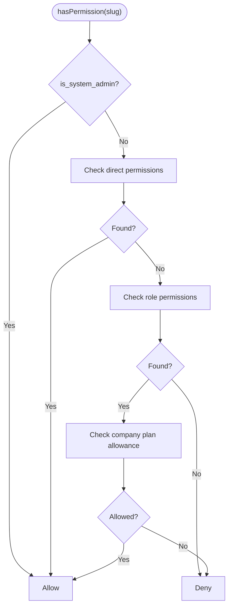
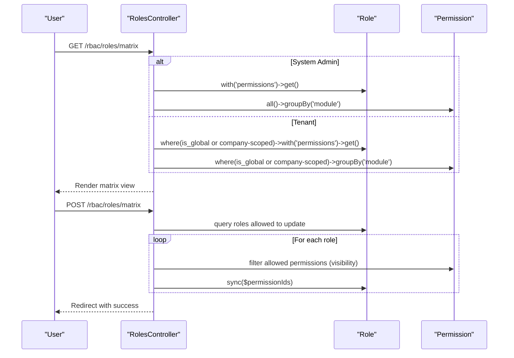
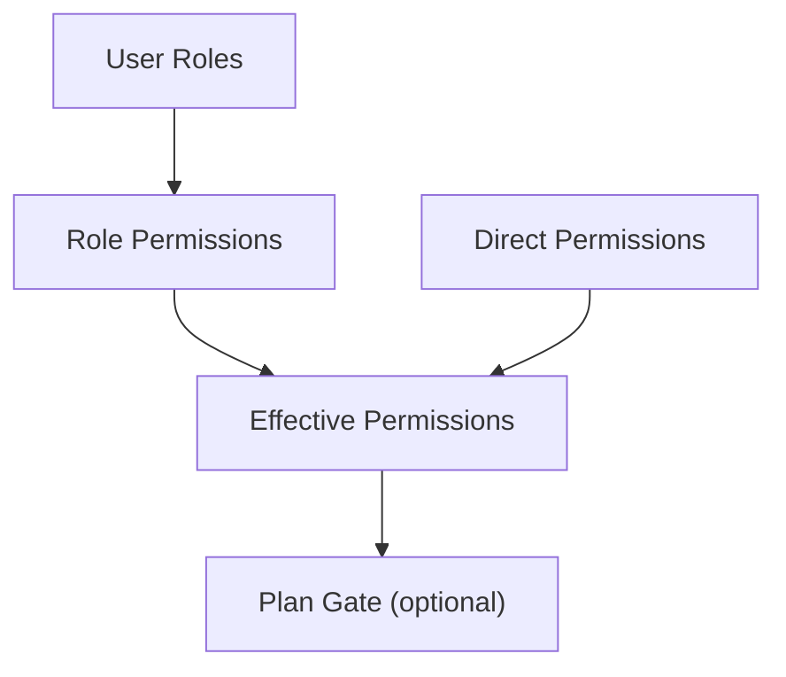
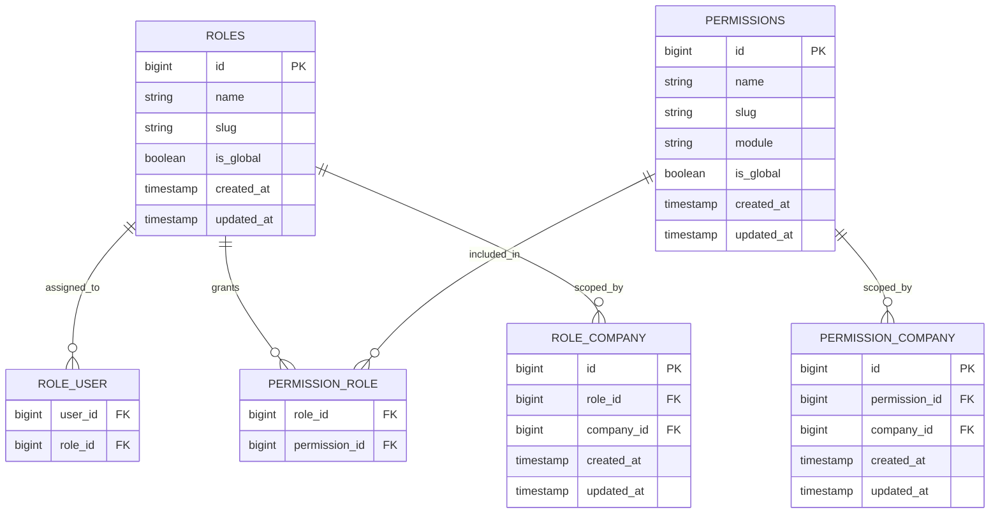
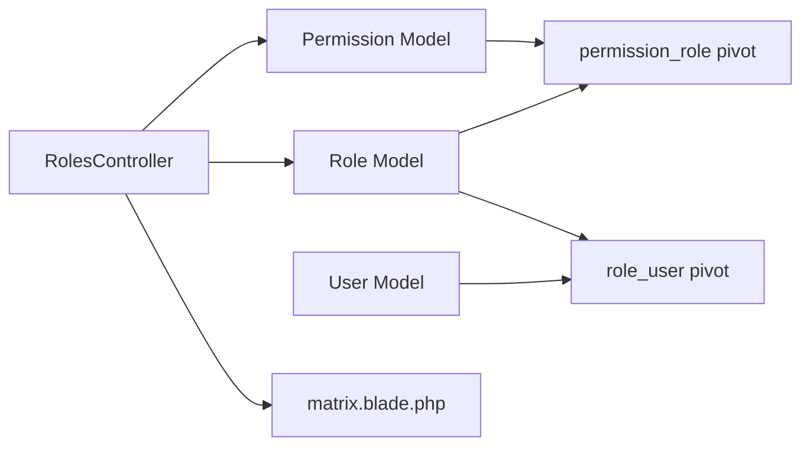

# Role Management

<cite>
**Referenced Files in This Document**
- [Role.php](file://app/Models/Role.php)
- [Permission.php](file://app/Models/Permission.php)
- [HasRBAC.php](file://app/Modules/Core/Traits/HasRBAC.php)
- [RolesController.php](file://app/Modules/RBAC/Controllers/RolesController.php)
- [2026_04_06_135154_create_rbac_tables.php](file://database/migrations/2026_04_06_135154_create_rbac_tables.php)
- [2026_04_06_142058_upgrade_users_and_rbac_for_system_admin.php](file://database/migrations/2026_04_06_142058_upgrade_users_and_rbac_for_system_admin.php)
- [2026_04_10_164800_upgrade_rbac_schema.php](file://database/migrations/2026_04_10_164800_upgrade_rbac_schema.php)
- [2026_04_10_173000_transform_roles_to_multi_tenant.php](file://database/migrations/2026_04_10_173000_transform_roles_to_multi_tenant.php)
- [matrix.blade.php](file://resources/views/modules/rbac/roles/matrix.blade.php)
</cite>

## Table of Contents
1. [Introduction](#introduction)
2. [Project Structure](#project-structure)
3. [Core Components](#core-components)
4. [Architecture Overview](#architecture-overview)
5. [Detailed Component Analysis](#detailed-component-analysis)
6. [Dependency Analysis](#dependency-analysis)
7. [Performance Considerations](#performance-considerations)
8. [Troubleshooting Guide](#troubleshooting-guide)
9. [Conclusion](#conclusion)

## Introduction
This document describes the role management subsystem within the RBAC system. It focuses on the Role model, role creation/modification workflows, role hierarchy and multi-tenancy, and the RolesController functionality for managing role definitions, role assignments, and role-based access patterns. It also covers role inheritance, default role configurations, permission mappings, tenant scoping, and practical examples for role CRUD operations, role assignment APIs, and role-based authorization checks.

## Project Structure
The role management subsystem spans models, traits, controllers, migrations, and views:
- Models define roles, permissions, and their relationships.
- The HasRBAC trait provides role and permission resolution for users.
- RolesController exposes endpoints to render and update the permission matrix.
- Migrations define the RBAC schema, including multi-tenant and global scoping.
- Views present the role matrix UI.

**Diagram sources**
- [Role.php:8-26](file://app/Models/Role.php#L8-L26)
- [Permission.php:8-21](file://app/Models/Permission.php#L8-L21)
- [HasRBAC.php:9-103](file://app/Modules/Core/Traits/HasRBAC.php#L9-L103)
- [RolesController.php:10-87](file://app/Modules/RBAC/Controllers/RolesController.php#L10-L87)
- [2026_04_06_135154_create_rbac_tables.php:21-52](file://database/migrations/2026_04_06_135154_create_rbac_tables.php#L21-L52)
- [2026_04_06_142058_upgrade_users_and_rbac_for_system_admin.php:20-33](file://database/migrations/2026_04_06_142058_upgrade_users_and_rbac_for_system_admin.php#L20-L33)
- [2026_04_10_164800_upgrade_rbac_schema.php:15-30](file://database/migrations/2026_04_10_164800_upgrade_rbac_schema.php#L15-L30)
- [2026_04_10_173000_transform_roles_to_multi_tenant.php:18-26](file://database/migrations/2026_04_10_173000_transform_roles_to_multi_tenant.php#L18-L26)

**Section sources**
- [Role.php:8-26](file://app/Models/Role.php#L8-L26)
- [Permission.php:8-21](file://app/Models/Permission.php#L8-L21)
- [HasRBAC.php:9-103](file://app/Modules/Core/Traits/HasRBAC.php#L9-L103)
- [RolesController.php:10-87](file://app/Modules/RBAC/Controllers/RolesController.php#L10-L87)
- [2026_04_06_135154_create_rbac_tables.php:21-52](file://database/migrations/2026_04_06_135154_create_rbac_tables.php#L21-L52)
- [2026_04_06_142058_upgrade_users_and_rbac_for_system_admin.php:20-33](file://database/migrations/2026_04_06_142058_upgrade_users_and_rbac_for_system_admin.php#L20-L33)
- [2026_04_10_164800_upgrade_rbac_schema.php:15-30](file://database/migrations/2026_04_10_164800_upgrade_rbac_schema.php#L15-L30)
- [2026_04_10_173000_transform_roles_to_multi_tenant.php:18-26](file://database/migrations/2026_04_10_173000_transform_roles_to_multi_tenant.php#L18-L26)

## Core Components
- Role model: Defines role attributes and relationships to users, permissions, and companies.
- Permission model: Defines permission attributes and relationships to roles and companies.
- HasRBAC trait: Provides role and permission resolution for users, including role checks, direct permission checks, inherited permission checks via roles, and plan-based permission gating.
- RolesController: Renders the permission matrix and updates role-to-permission mappings with tenant scoping and system admin privileges.

Key capabilities:
- Role CRUD: Creation and modification are supported by the underlying Eloquent model and RBAC schema.
- Role hierarchy: Implemented via role-to-permission relationships; users inherit permissions through assigned roles.
- Multi-tenancy: Roles and permissions can be scoped per company; global roles/permissions are available system-wide.
- Authorization checks: Role and permission checks combine direct assignments, role inheritance, and subscription plan constraints.

**Section sources**
- [Role.php:8-26](file://app/Models/Role.php#L8-L26)
- [Permission.php:8-21](file://app/Models/Permission.php#L8-L21)
- [HasRBAC.php:9-103](file://app/Modules/Core/Traits/HasRBAC.php#L9-L103)
- [RolesController.php:10-87](file://app/Modules/RBAC/Controllers/RolesController.php#L10-L87)

## Architecture Overview
The RBAC subsystem integrates models, traits, and controller actions to manage roles and permissions with tenant scoping and global visibility.

**Diagram sources**
- [Role.php:8-26](file://app/Models/Role.php#L8-L26)
- [Permission.php:8-21](file://app/Models/Permission.php#L8-L21)
- [HasRBAC.php:9-103](file://app/Modules/Core/Traits/HasRBAC.php#L9-L103)
- [RolesController.php:10-87](file://app/Modules/RBAC/Controllers/RolesController.php#L10-L87)

## Detailed Component Analysis

### Role Model Implementation
- Attributes: name, slug, is_global, description.
- Relationships:
  - users: many-to-many with User.
  - permissions: many-to-many with Permission.
  - companies: many-to-many via role_company pivot.
- Purpose: central entity representing a set of permissions assignable to users.

**Diagram sources**
- [Role.php:12-25](file://app/Models/Role.php#L12-L25)

**Section sources**
- [Role.php:8-26](file://app/Models/Role.php#L8-L26)

### Permission Model Implementation
- Attributes: name, slug, module, is_global, description, company_id.
- Relationships:
  - roles: many-to-many with Role.
  - companies: many-to-many via permission_company pivot.
- Purpose: defines granular capabilities and their scoping.

**Diagram sources**
- [Permission.php:12-20](file://app/Models/Permission.php#L12-L20)

**Section sources**
- [Permission.php:8-21](file://app/Models/Permission.php#L8-L21)

### Role Assignment and Access Checks (HasRBAC Trait)
- roles(): filters roles by global or tenant-scoped roles tied to the user’s company.
- permissions(): direct permission assignments to the user.
- hasRole(slug): checks if the user has a specific role (system admin bypass).
- hasPermission(slug): composite check:
  - Direct permission assignment.
  - Role-based permission inheritance.
  - Plan-based gating via SubscriptionService.
- assignRole(slug): assigns a role scoped to the user’s company or global.
- removeRole(slug): removes a role assignment.

**Diagram sources**
- [HasRBAC.php:37-73](file://app/Modules/Core/Traits/HasRBAC.php#L37-L73)

**Section sources**
- [HasRBAC.php:9-103](file://app/Modules/Core/Traits/HasRBAC.php#L9-L103)

### RolesController Functionality
- matrix():
  - System admins: lists all roles and groups permissions by module.
  - Tenant users: lists global roles plus company-scoped roles; shows global permissions plus company-scoped permissions grouped by module.
- updateMatrix(request):
  - Validates which roles the current user can update (system admin vs company-scoped).
  - For each eligible role, syncs assigned permissions while enforcing visibility constraints (global or company-scoped).
  - Redirects back with success feedback.

**Diagram sources**
- [RolesController.php:15-44](file://app/Modules/RBAC/Controllers/RolesController.php#L15-L44)
- [RolesController.php:49-86](file://app/Modules/RBAC/Controllers/RolesController.php#L49-L86)

**Section sources**
- [RolesController.php:10-87](file://app/Modules/RBAC/Controllers/RolesController.php#L10-L87)

### Role Hierarchy and Permission Mapping
- Hierarchy: Users inherit permissions through assigned roles; permissions are mapped to roles via a many-to-many relationship.
- Inheritance mechanism: hasPermission checks direct permissions first, then role-based permissions, then plan-based allowances.
- Default configurations: Global roles/permissions are available to system admins and visible to tenants; company-scoped items require explicit assignment or association.

**Diagram sources**
- [HasRBAC.php:37-73](file://app/Modules/Core/Traits/HasRBAC.php#L37-L73)

**Section sources**
- [HasRBAC.php:9-103](file://app/Modules/Core/Traits/HasRBAC.php#L9-L103)

### Multi-Tenant Role Isolation
- Schema evolution:
  - Base schema: roles and permissions tables with slugs and timestamps.
  - Tenant-aware upgrades: company_id columns, unique constraints scoped by company, and global flags.
  - Pivot transformations: role-company and permission-company pivots replace direct foreign keys.
- Behavior:
  - Users see global roles/permissions plus those associated with their company.
  - Controllers enforce scoping when listing and updating roles/permissions.
  - Assignments respect tenant boundaries.

**Diagram sources**
- [2026_04_06_135154_create_rbac_tables.php:21-52](file://database/migrations/2026_04_06_135154_create_rbac_tables.php#L21-L52)
- [2026_04_06_142058_upgrade_users_and_rbac_for_system_admin.php:20-33](file://database/migrations/2026_04_06_142058_upgrade_users_and_rbac_for_system_admin.php#L20-L33)
- [2026_04_10_164800_upgrade_rbac_schema.php:25-30](file://database/migrations/2026_04_10_164800_upgrade_rbac_schema.php#L25-L30)
- [2026_04_10_173000_transform_roles_to_multi_tenant.php:18-26](file://database/migrations/2026_04_10_173000_transform_roles_to_multi_tenant.php#L18-L26)

**Section sources**
- [2026_04_06_135154_create_rbac_tables.php:21-52](file://database/migrations/2026_04_06_135154_create_rbac_tables.php#L21-L52)
- [2026_04_06_142058_upgrade_users_and_rbac_for_system_admin.php:20-33](file://database/migrations/2026_04_06_142058_upgrade_users_and_rbac_for_system_admin.php#L20-L33)
- [2026_04_10_164800_upgrade_rbac_schema.php:15-30](file://database/migrations/2026_04_10_164800_upgrade_rbac_schema.php#L15-L30)
- [2026_04_10_173000_transform_roles_to_multi_tenant.php:18-26](file://database/migrations/2026_04_10_173000_transform_roles_to_multi_tenant.php#L18-L26)

### Practical Workflows

#### Role Creation and Modification
- Creation: Use the Role model to create roles with name, slug, is_global flag, and optional description. For tenant-scoped roles, associate via the role_company pivot after creation.
- Modification: Update attributes and permission mappings using the RolesController matrix endpoints.

References:
- [Role.php:10](file://app/Models/Role.php#L10)
- [2026_04_10_173000_transform_roles_to_multi_tenant.php:28-38](file://database/migrations/2026_04_10_173000_transform_roles_to_multi_tenant.php#L28-L38)

#### Role Deletion Procedures
- Delete role records; cascading effects propagate to role_user and permission_role pivots.
- Ensure no dependent data prevents deletion (e.g., active assignments).

References:
- [2026_04_06_135154_create_rbac_tables.php:40-52](file://database/migrations/2026_04_06_135154_create_rbac_tables.php#L40-L52)

#### Role Status Management
- Global vs tenant-scoped: Controlled by is_global flags and company associations.
- Visibility: System admins see all; tenant users see global plus company-scoped items.

References:
- [HasRBAC.php:15-24](file://app/Modules/Core/Traits/HasRBAC.php#L15-L24)
- [RolesController.php:26-41](file://app/Modules/RBAC/Controllers/RolesController.php#L26-L41)

#### Role Assignment APIs
- Assign/remove roles to/from users via the HasRBAC trait methods.
- Assign via slug with tenant scoping enforced.

References:
- [HasRBAC.php:78-102](file://app/Modules/Core/Traits/HasRBAC.php#L78-L102)

#### Role-Based Authorization Checks
- Check role membership: hasRole(slug).
- Check effective permission: hasPermission(slug) including inheritance and plan gating.

References:
- [HasRBAC.php:37-73](file://app/Modules/Core/Traits/HasRBAC.php#L37-L73)

#### Permission Matrix UI
- The matrix view organizes roles and permissions by module for easy editing.

References:
- [matrix.blade.php](file://resources/views/modules/rbac/roles/matrix.blade.php)

## Dependency Analysis
- Role depends on Permission via permission_role pivot.
- User depends on Role via role_user pivot and on Permission via direct assignment.
- RolesController depends on Role and Permission models and renders the matrix view.
- Multi-tenant behavior emerges from schema pivots and controller scoping logic.

**Diagram sources**
- [2026_04_06_135154_create_rbac_tables.php:40-52](file://database/migrations/2026_04_06_135154_create_rbac_tables.php#L40-L52)
- [RolesController.php:15-44](file://app/Modules/RBAC/Controllers/RolesController.php#L15-L44)
- [matrix.blade.php](file://resources/views/modules/rbac/roles/matrix.blade.php)

**Section sources**
- [2026_04_06_135154_create_rbac_tables.php:21-52](file://database/migrations/2026_04_06_135154_create_rbac_tables.php#L21-L52)
- [RolesController.php:10-87](file://app/Modules/RBAC/Controllers/RolesController.php#L10-L87)

## Performance Considerations
- Eager loading: Use with('permissions') when rendering the matrix to minimize N+1 queries.
- Filtering scopes: Apply is_global and company scoping early in queries to reduce dataset size.
- Sync operations: Batch permission updates per role to limit transaction overhead.

## Troubleshooting Guide
- Permission not taking effect:
  - Verify the user has the role and the role has the permission.
  - Confirm the permission is not blocked by plan restrictions.
- Role not visible to tenant:
  - Ensure the role is either global or associated with the user’s company via role_company pivot.
- Matrix update fails:
  - Ensure the user has permission to update the target roles and that only allowed permissions are submitted.

**Section sources**
- [HasRBAC.php:37-73](file://app/Modules/Core/Traits/HasRBAC.php#L37-L73)
- [RolesController.php:49-86](file://app/Modules/RBAC/Controllers/RolesController.php#L49-L86)

## Conclusion
The role management subsystem provides robust role and permission management with strong multi-tenant support. Roles and permissions are modeled with flexible scoping, and users inherit permissions through roles with plan-based gating. The RolesController offers a clear interface for viewing and updating role-to-permission mappings, respecting tenant boundaries and system admin privileges.