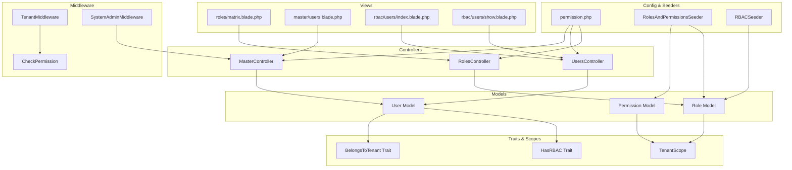
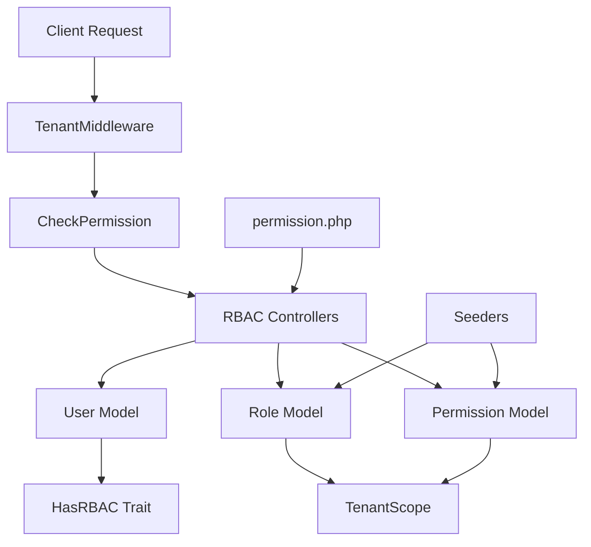
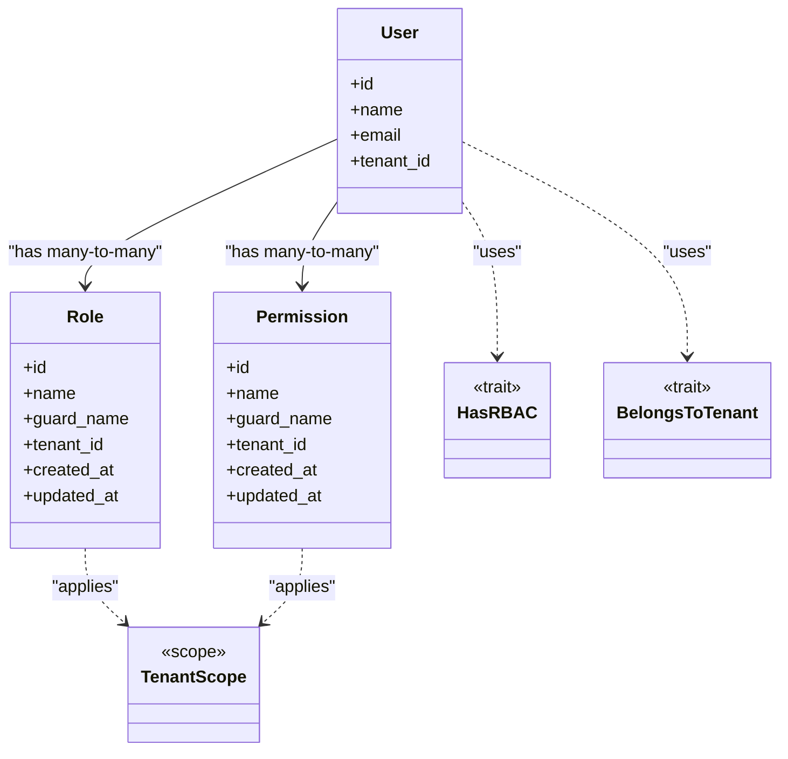
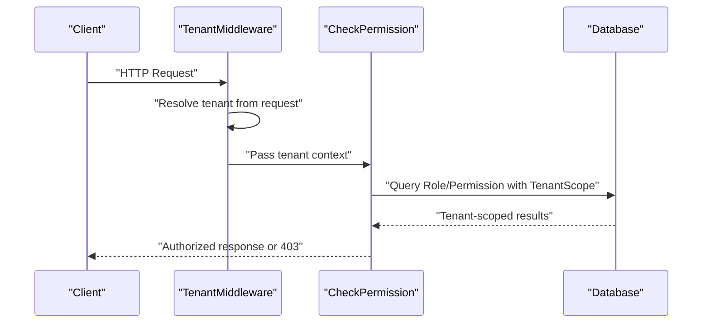
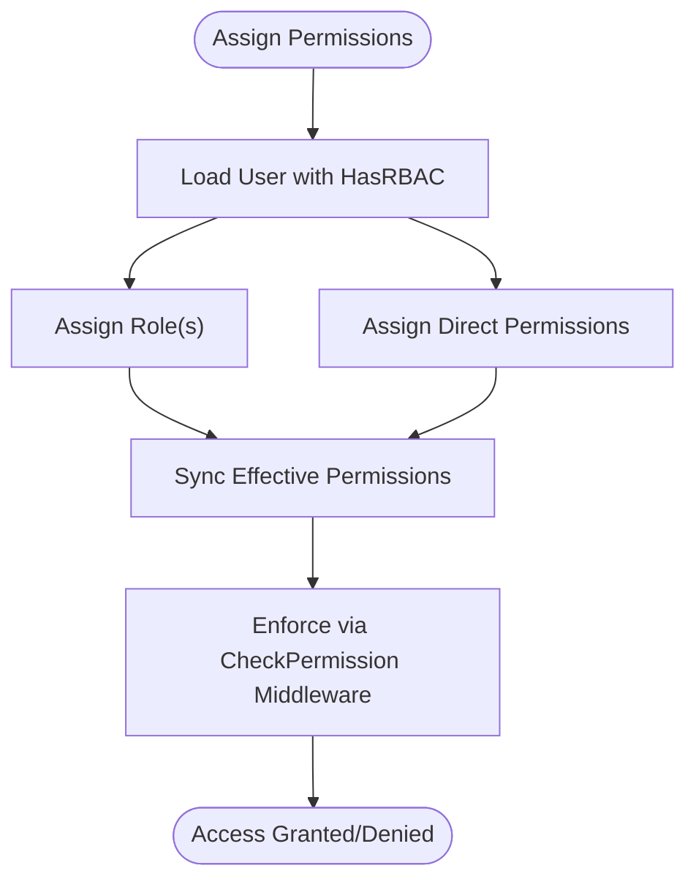
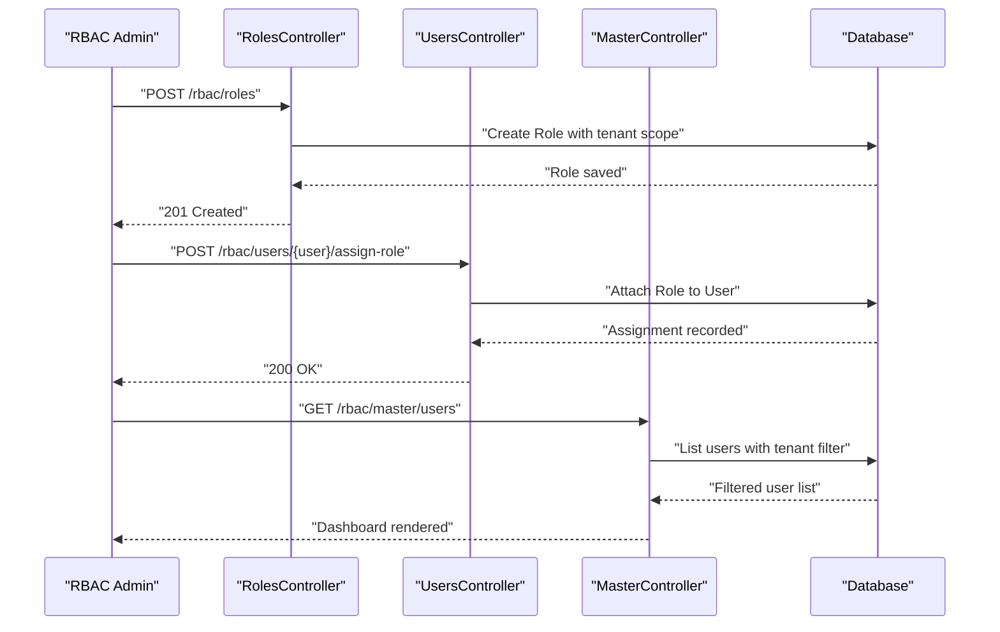
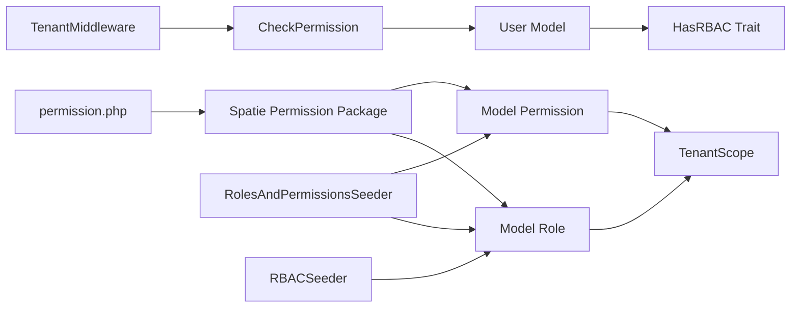

# Role-Based Access Control (RBAC)

<cite>
**Referenced Files in This Document**
- [Role.php](file://app/Models/Role.php)
- [Permission.php](file://app/Models/Permission.php)
- [User.php](file://app/Models/User.php)
- [HasRBAC.php](file://app/Modules/Core/Traits/HasRBAC.php)
- [BelongsToTenant.php](file://app/Modules/Core/Traits/BelongsToTenant.php)
- [TenantScope.php](file://app/Modules/Core/Scopes/TenantScope.php)
- [TenantMiddleware.php](file://app/Http/Middleware/TenantMiddleware.php)
- [CheckPermission.php](file://app/Http/Middleware/CheckPermission.php)
- [SystemAdminMiddleware.php](file://app/Http/Middleware/SystemAdminMiddleware.php)
- [RolesController.php](file://app/Modules/RBAC/Controllers/RolesController.php)
- [UsersController.php](file://app/Modules/RBAC/Controllers/UsersController.php)
- [MasterController.php](file://app/Modules/RBAC/Controllers/MasterController.php)
- [permission.php](file://config/permission.php)
- [2026_04_06_135100_modify_users_and_rbac_for_system_admin.php](file://database/migrations/2026_04_06_135100_modify_users_and_rbac_for_system_admin.php)
- [2026_04_10_173000_transform_roles_to_multi_tenant.php](file://database/migrations/2026_04_10_173000_transform_roles_to_multi_tenant.php)
- [2026_04_16_150000_rename_ticket_statuses.php](file://database/migrations/2026_04_16_150000_rename_ticket_statuses.php)
- [RBACSeeder.php](file://database/seeders/RBACSeeder.php)
- [RolesAndPermissionsSeeder.php](file://database/seeders/RolesAndPermissionsSeeder.php)
- [matrix.blade.php](file://resources/views/modules/rbac/roles/matrix.blade.php)
- [users.blade.php](file://resources/views/modules/rbac/master/users.blade.php)
- [index.blade.php](file://resources/views/modules/rbac/users/index.blade.php)
- [show.blade.php](file://resources/views/modules/rbac/users/show.blade.php)
</cite>

## Table of Contents
1. [Introduction](#introduction)
2. [Project Structure](#project-structure)
3. [Core Components](#core-components)
4. [Architecture Overview](#architecture-overview)
5. [Detailed Component Analysis](#detailed-component-analysis)
6. [Dependency Analysis](#dependency-analysis)
7. [Performance Considerations](#performance-considerations)
8. [Troubleshooting Guide](#troubleshooting-guide)
9. [Conclusion](#conclusion)
10. [Appendices](#appendices)

## Introduction
This document describes the Role-Based Access Control (RBAC) system implemented in the application. It explains how permissions and roles are modeled, how tenant-aware authorization is enforced, and how dynamic permission assignment works. It documents the controller implementations for role management, user permissions, and master administration, along with middleware integration for request filtering and authorization enforcement. The document also outlines API endpoints for managing permissions, assigning roles, and controlling user access, and provides examples of permission matrices, role hierarchies, and multi-tenant security best practices.

## Project Structure
The RBAC system spans models, traits, scopes, middleware, controllers, configuration, migrations, seeders, and Blade views. The following diagram shows the primary components and their relationships.

**Diagram sources**
- [Role.php](file://app/Models/Role.php)
- [Permission.php](file://app/Models/Permission.php)
- [User.php](file://app/Models/User.php)
- [HasRBAC.php](file://app/Modules/Core/Traits/HasRBAC.php)
- [BelongsToTenant.php](file://app/Modules/Core/Traits/BelongsToTenant.php)
- [TenantScope.php](file://app/Modules/Core/Scopes/TenantScope.php)
- [TenantMiddleware.php](file://app/Http/Middleware/TenantMiddleware.php)
- [CheckPermission.php](file://app/Http/Middleware/CheckPermission.php)
- [SystemAdminMiddleware.php](file://app/Http/Middleware/SystemAdminMiddleware.php)
- [RolesController.php](file://app/Modules/RBAC/Controllers/RolesController.php)
- [UsersController.php](file://app/Modules/RBAC/Controllers/UsersController.php)
- [MasterController.php](file://app/Modules/RBAC/Controllers/MasterController.php)
- [permission.php](file://config/permission.php)
- [RBACSeeder.php](file://database/seeders/RBACSeeder.php)
- [RolesAndPermissionsSeeder.php](file://database/seeders/RolesAndPermissionsSeeder.php)
- [matrix.blade.php](file://resources/views/modules/rbac/roles/matrix.blade.php)
- [users.blade.php](file://resources/views/modules/rbac/master/users.blade.php)
- [index.blade.php](file://resources/views/modules/rbac/users/index.blade.php)
- [show.blade.php](file://resources/views/modules/rbac/users/show.blade.php)

**Section sources**
- [Role.php](file://app/Models/Role.php)
- [Permission.php](file://app/Models/Permission.php)
- [User.php](file://app/Models/User.php)
- [HasRBAC.php](file://app/Modules/Core/Traits/HasRBAC.php)
- [BelongsToTenant.php](file://app/Modules/Core/Traits/BelongsToTenant.php)
- [TenantScope.php](file://app/Modules/Core/Scopes/TenantScope.php)
- [TenantMiddleware.php](file://app/Http/Middleware/TenantMiddleware.php)
- [CheckPermission.php](file://app/Http/Middleware/CheckPermission.php)
- [SystemAdminMiddleware.php](file://app/Http/Middleware/SystemAdminMiddleware.php)
- [RolesController.php](file://app/Modules/RBAC/Controllers/RolesController.php)
- [UsersController.php](file://app/Modules/RBAC/Controllers/UsersController.php)
- [MasterController.php](file://app/Modules/RBAC/Controllers/MasterController.php)
- [permission.php](file://config/permission.php)
- [RBACSeeder.php](file://database/seeders/RBACSeeder.php)
- [RolesAndPermissionsSeeder.php](file://database/seeders/RolesAndPermissionsSeeder.php)
- [matrix.blade.php](file://resources/views/modules/rbac/roles/matrix.blade.php)
- [users.blade.php](file://resources/views/modules/rbac/master/users.blade.php)
- [index.blade.php](file://resources/views/modules/rbac/users/index.blade.php)
- [show.blade.php](file://resources/views/modules/rbac/users/show.blade.php)

## Core Components
- Role and Permission models define the RBAC entities and their relationships.
- The User model integrates RBAC via a trait and supports tenant association.
- Middleware enforces tenant scoping and permission checks.
- Controllers implement role management, user permission management, and master administration.
- Configuration and seeders establish baseline permissions and roles.

Key implementation references:
- Role model definition and tenant scoping: [Role.php](file://app/Models/Role.php)
- Permission model definition: [Permission.php](file://app/Models/Permission.php)
- User model with RBAC and tenant traits: [User.php](file://app/Models/User.php)
- RBAC trait for user-role-permission operations: [HasRBAC.php](file://app/Modules/Core/Traits/HasRBAC.php)
- Tenant association and belongs-to-tenant behavior: [BelongsToTenant.php](file://app/Modules/Core/Traits/BelongsToTenant.php)
- Tenant scope applied to Role and Permission queries: [TenantScope.php](file://app/Modules/Core/Scopes/TenantScope.php)
- Tenant-aware middleware: [TenantMiddleware.php](file://app/Http/Middleware/TenantMiddleware.php)
- Permission-checking middleware: [CheckPermission.php](file://app/Http/Middleware/CheckPermission.php)
- System admin middleware: [SystemAdminMiddleware.php](file://app/Http/Middleware/SystemAdminMiddleware.php)
- Role management controller: [RolesController.php](file://app/Modules/RBAC/Controllers/RolesController.php)
- User permission management controller: [UsersController.php](file://app/Modules/RBAC/Controllers/UsersController.php)
- Master administration controller: [MasterController.php](file://app/Modules/RBAC/Controllers/MasterController.php)
- RBAC configuration: [permission.php](file://config/permission.php)
- Migration transforming roles to multi-tenant: [2026_04_10_173000_transform_roles_to_multi_tenant.php](file://database/migrations/2026_04_10_173000_transform_roles_to_multi_tenant.php)
- Migration adding system admin capability: [2026_04_06_135100_modify_users_and_rbac_for_system_admin.php](file://database/migrations/2026_04_06_135100_modify_users_and_rbac_for_system_admin.php)
- Seeder for baseline roles and permissions: [RolesAndPermissionsSeeder.php](file://database/seeders/RolesAndPermissionsSeeder.php)
- Seeder for RBAC-specific data: [RBACSeeder.php](file://database/seeders/RBACSeeder.php)

**Section sources**
- [Role.php](file://app/Models/Role.php)
- [Permission.php](file://app/Models/Permission.php)
- [User.php](file://app/Models/User.php)
- [HasRBAC.php](file://app/Modules/Core/Traits/HasRBAC.php)
- [BelongsToTenant.php](file://app/Modules/Core/Traits/BelongsToTenant.php)
- [TenantScope.php](file://app/Modules/Core/Scopes/TenantScope.php)
- [TenantMiddleware.php](file://app/Http/Middleware/TenantMiddleware.php)
- [CheckPermission.php](file://app/Http/Middleware/CheckPermission.php)
- [SystemAdminMiddleware.php](file://app/Http/Middleware/SystemAdminMiddleware.php)
- [RolesController.php](file://app/Modules/RBAC/Controllers/RolesController.php)
- [UsersController.php](file://app/Modules/RBAC/Controllers/UsersController.php)
- [MasterController.php](file://app/Modules/RBAC/Controllers/MasterController.php)
- [permission.php](file://config/permission.php)
- [2026_04_10_173000_transform_roles_to_multi_tenant.php](file://database/migrations/2026_04_10_173000_transform_roles_to_multi_tenant.php)
- [2026_04_06_135100_modify_users_and_rbac_for_system_admin.php](file://database/migrations/2026_04_06_135100_modify_users_and_rbac_for_system_admin.php)
- [RolesAndPermissionsSeeder.php](file://database/seeders/RolesAndPermissionsSeeder.php)
- [RBACSeeder.php](file://database/seeders/RBACSeeder.php)

## Architecture Overview
The RBAC architecture combines Eloquent models with traits and scopes for tenant isolation, middleware for runtime enforcement, and controllers for administrative operations. The configuration file defines the underlying Spatie permission package settings, while seeders populate initial roles and permissions.

**Diagram sources**
- [TenantMiddleware.php](file://app/Http/Middleware/TenantMiddleware.php)
- [CheckPermission.php](file://app/Http/Middleware/CheckPermission.php)
- [RolesController.php](file://app/Modules/RBAC/Controllers/RolesController.php)
- [UsersController.php](file://app/Modules/RBAC/Controllers/UsersController.php)
- [MasterController.php](file://app/Modules/RBAC/Controllers/MasterController.php)
- [User.php](file://app/Models/User.php)
- [Role.php](file://app/Models/Role.php)
- [Permission.php](file://app/Models/Permission.php)
- [HasRBAC.php](file://app/Modules/Core/Traits/HasRBAC.php)
- [TenantScope.php](file://app/Modules/Core/Scopes/TenantScope.php)
- [permission.php](file://config/permission.php)
- [RBACSeeder.php](file://database/seeders/RBACSeeder.php)
- [RolesAndPermissionsSeeder.php](file://database/seeders/RolesAndPermissionsSeeder.php)

## Detailed Component Analysis

### Role and Permission Models
- Role model encapsulates role definitions and inherits tenant scoping via a global scope.
- Permission model encapsulates granular permissions and similarly applies tenant scoping.
- Both models integrate with the Spatie permission package through configuration and traits.

**Diagram sources**
- [Role.php](file://app/Models/Role.php)
- [Permission.php](file://app/Models/Permission.php)
- [User.php](file://app/Models/User.php)
- [HasRBAC.php](file://app/Modules/Core/Traits/HasRBAC.php)
- [BelongsToTenant.php](file://app/Modules/Core/Traits/BelongsToTenant.php)
- [TenantScope.php](file://app/Modules/Core/Scopes/TenantScope.php)

**Section sources**
- [Role.php](file://app/Models/Role.php)
- [Permission.php](file://app/Models/Permission.php)
- [User.php](file://app/Models/User.php)
- [HasRBAC.php](file://app/Modules/Core/Traits/HasRBAC.php)
- [BelongsToTenant.php](file://app/Modules/Core/Traits/BelongsToTenant.php)
- [TenantScope.php](file://app/Modules/Core/Scopes/TenantScope.php)

### Tenant-Aware Authorization
- TenantMiddleware ensures requests operate within the correct tenant context.
- TenantScope automatically filters Role and Permission queries by tenant.
- BelongsToTenant trait on User ensures user records are isolated per tenant.

**Diagram sources**
- [TenantMiddleware.php](file://app/Http/Middleware/TenantMiddleware.php)
- [CheckPermission.php](file://app/Http/Middleware/CheckPermission.php)
- [TenantScope.php](file://app/Modules/Core/Scopes/TenantScope.php)
- [Role.php](file://app/Models/Role.php)
- [Permission.php](file://app/Models/Permission.php)

**Section sources**
- [TenantMiddleware.php](file://app/Http/Middleware/TenantMiddleware.php)
- [CheckPermission.php](file://app/Http/Middleware/CheckPermission.php)
- [TenantScope.php](file://app/Modules/Core/Scopes/TenantScope.php)
- [BelongsToTenant.php](file://app/Modules/Core/Traits/BelongsToTenant.php)

### Dynamic Permission Assignment
- Users dynamically inherit permissions through roles and direct permission assignments.
- The HasRBAC trait provides methods to assign, revoke, and check permissions.
- System admin middleware allows elevated access for master administration tasks.

**Diagram sources**
- [HasRBAC.php](file://app/Modules/Core/Traits/HasRBAC.php)
- [CheckPermission.php](file://app/Http/Middleware/CheckPermission.php)
- [User.php](file://app/Models/User.php)

**Section sources**
- [HasRBAC.php](file://app/Modules/Core/Traits/HasRBAC.php)
- [CheckPermission.php](file://app/Http/Middleware/CheckPermission.php)
- [User.php](file://app/Models/User.php)
- [SystemAdminMiddleware.php](file://app/Http/Middleware/SystemAdminMiddleware.php)

### RBAC Controllers
- RolesController manages role creation, updates, deletions, and role-permission assignments.
- UsersController manages user-role and user-permission assignments.
- MasterController provides administrative dashboards and user management for master contexts.

**Diagram sources**
- [RolesController.php](file://app/Modules/RBAC/Controllers/RolesController.php)
- [UsersController.php](file://app/Modules/RBAC/Controllers/UsersController.php)
- [MasterController.php](file://app/Modules/RBAC/Controllers/MasterController.php)
- [Role.php](file://app/Models/Role.php)
- [User.php](file://app/Models/User.php)

**Section sources**
- [RolesController.php](file://app/Modules/RBAC/Controllers/RolesController.php)
- [UsersController.php](file://app/Modules/RBAC/Controllers/UsersController.php)
- [MasterController.php](file://app/Modules/RBAC/Controllers/MasterController.php)

### Views and UI Integration
- Role matrix view: [matrix.blade.php](file://resources/views/modules/rbac/roles/matrix.blade.php)
- Master users view: [users.blade.php](file://resources/views/modules/rbac/master/users.blade.php)
- Users index and show views: [index.blade.php](file://resources/views/modules/rbac/users/index.blade.php), [show.blade.php](file://resources/views/modules/rbac/users/show.blade.php)

**Section sources**
- [matrix.blade.php](file://resources/views/modules/rbac/roles/matrix.blade.php)
- [users.blade.php](file://resources/views/modules/rbac/master/users.blade.php)
- [index.blade.php](file://resources/views/modules/rbac/users/index.blade.php)
- [show.blade.php](file://resources/views/modules/rbac/users/show.blade.php)

## Dependency Analysis
The RBAC system depends on:
- Eloquent models for persistence and relationships.
- Traits for shared RBAC and tenant behaviors.
- Middleware for runtime authorization enforcement.
- Configuration for Spatie permission package behavior.
- Seeders for baseline data.

**Diagram sources**
- [permission.php](file://config/permission.php)
- [Role.php](file://app/Models/Role.php)
- [Permission.php](file://app/Models/Permission.php)
- [User.php](file://app/Models/User.php)
- [HasRBAC.php](file://app/Modules/Core/Traits/HasRBAC.php)
- [TenantScope.php](file://app/Modules/Core/Scopes/TenantScope.php)
- [CheckPermission.php](file://app/Http/Middleware/CheckPermission.php)
- [TenantMiddleware.php](file://app/Http/Middleware/TenantMiddleware.php)
- [RolesAndPermissionsSeeder.php](file://database/seeders/RolesAndPermissionsSeeder.php)
- [RBACSeeder.php](file://database/seeders/RBACSeeder.php)

**Section sources**
- [permission.php](file://config/permission.php)
- [Role.php](file://app/Models/Role.php)
- [Permission.php](file://app/Models/Permission.php)
- [User.php](file://app/Models/User.php)
- [HasRBAC.php](file://app/Modules/Core/Traits/HasRBAC.php)
- [TenantScope.php](file://app/Modules/Core/Scopes/TenantScope.php)
- [CheckPermission.php](file://app/Http/Middleware/CheckPermission.php)
- [TenantMiddleware.php](file://app/Http/Middleware/TenantMiddleware.php)
- [RolesAndPermissionsSeeder.php](file://database/seeders/RolesAndPermissionsSeeder.php)
- [RBACSeeder.php](file://database/seeders/RBACSeeder.php)

## Performance Considerations
- Use tenant scoping to avoid cross-tenant queries and reduce contention.
- Cache effective permissions per user to minimize repeated database lookups.
- Batch role and permission assignments to reduce transaction overhead.
- Index tenant_id on Role and Permission tables for fast filtering.
- Leverage HasRBAC trait methods to consolidate permission checks server-side.

## Troubleshooting Guide
Common issues and resolutions:
- Cross-tenant permission leakage: Verify TenantMiddleware is registered and TenantScope is applied to Role and Permission queries.
- Permission denied unexpectedly: Confirm CheckPermission middleware is attached to protected routes and user’s effective permissions include the required permission.
- Role not assignable: Ensure the role exists within the current tenant and the user has authority to manage roles.
- System admin access blocked: Validate SystemAdminMiddleware is configured and the user has system admin capability.

**Section sources**
- [TenantMiddleware.php](file://app/Http/Middleware/TenantMiddleware.php)
- [CheckPermission.php](file://app/Http/Middleware/CheckPermission.php)
- [SystemAdminMiddleware.php](file://app/Http/Middleware/SystemAdminMiddleware.php)
- [TenantScope.php](file://app/Modules/Core/Scopes/TenantScope.php)
- [HasRBAC.php](file://app/Modules/Core/Traits/HasRBAC.php)

## Conclusion
The RBAC system leverages Eloquent models, traits, scopes, and middleware to enforce tenant-aware authorization. Controllers provide administrative capabilities for roles and permissions, while seeders establish baseline configurations. Middleware ensures runtime enforcement, and views support operational dashboards. Following the best practices outlined here will help maintain secure, scalable, and maintainable multi-tenant access control.

## Appendices

### API Endpoints Overview
- Manage Roles
  - POST /rbac/roles
  - PUT /rbac/roles/{role}
  - DELETE /rbac/roles/{role}
  - POST /rbac/roles/{role}/permissions
- Manage User Permissions
  - POST /rbac/users/{user}/assign-role
  - POST /rbac/users/{user}/assign-permission
  - DELETE /rbac/users/{user}/remove-role
  - DELETE /rbac/users/{user}/remove-permission
- Master Administration
  - GET /rbac/master/dashboard
  - GET /rbac/master/users

Note: These endpoints correspond to the controllers and routes defined in the RBAC module. Use tenant-aware middleware to ensure proper scoping.

**Section sources**
- [RolesController.php](file://app/Modules/RBAC/Controllers/RolesController.php)
- [UsersController.php](file://app/Modules/RBAC/Controllers/UsersController.php)
- [MasterController.php](file://app/Modules/RBAC/Controllers/MasterController.php)

### Permission Matrix Example
- Define permissions per module (e.g., queue, appointments, reports).
- Assign permissions to roles (e.g., Staff, Manager).
- Assign roles to users.
- Render a matrix view to visualize effective permissions.

Reference views:
- Role matrix: [matrix.blade.php](file://resources/views/modules/rbac/roles/matrix.blade.php)
- Master users: [users.blade.php](file://resources/views/modules/rbac/master/users.blade.php)

**Section sources**
- [matrix.blade.php](file://resources/views/modules/rbac/roles/matrix.blade.php)
- [users.blade.php](file://resources/views/modules/rbac/master/users.blade.php)

### Role Hierarchies and Best Practices
- Prefer role hierarchies to simplify permission management.
- Keep permissions module-scoped and tenant-scoped.
- Regularly audit role-to-permission mappings.
- Limit direct permission assignments; favor role-based assignment.
- Use system admin middleware for master-level operations.

**Section sources**
- [HasRBAC.php](file://app/Modules/Core/Traits/HasRBAC.php)
- [SystemAdminMiddleware.php](file://app/Http/Middleware/SystemAdminMiddleware.php)
- [2026_04_06_135100_modify_users_and_rbac_for_system_admin.php](file://database/migrations/2026_04_06_135100_modify_users_and_rbac_for_system_admin.php)