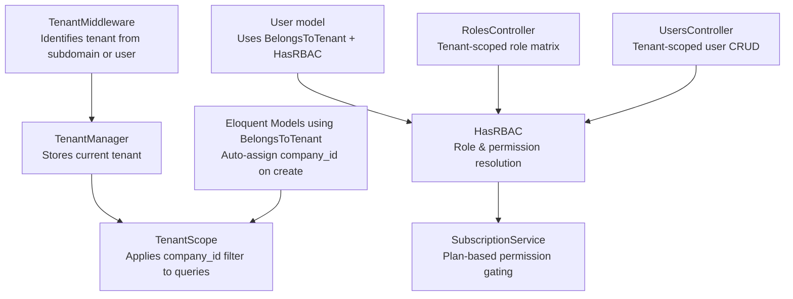
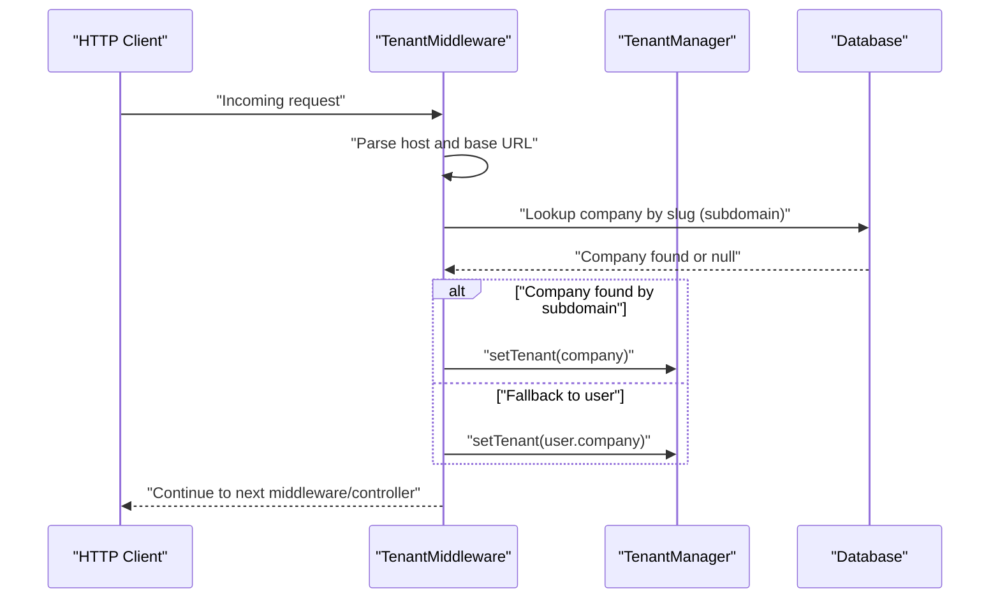
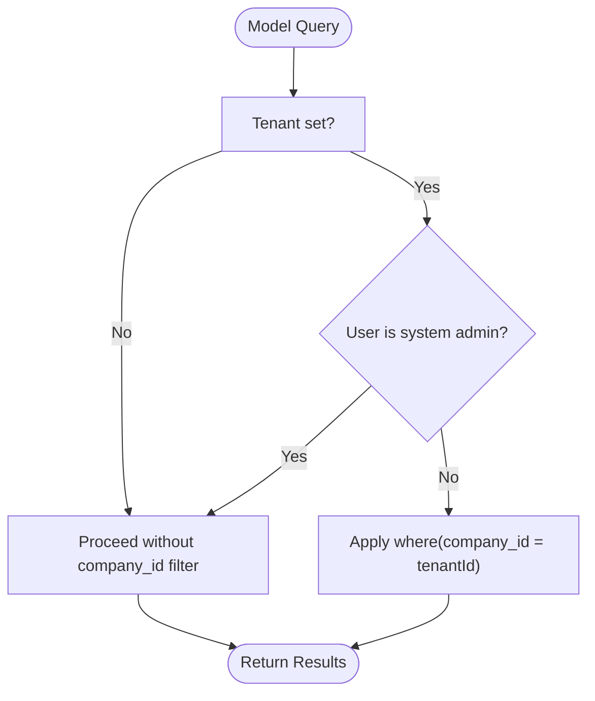
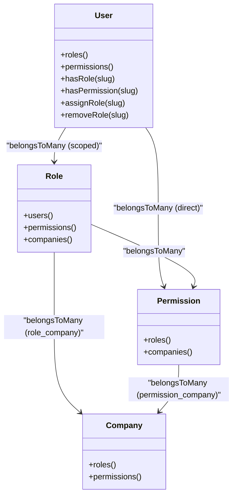
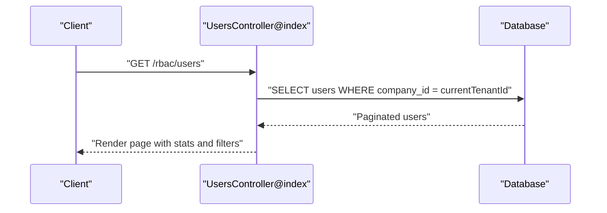
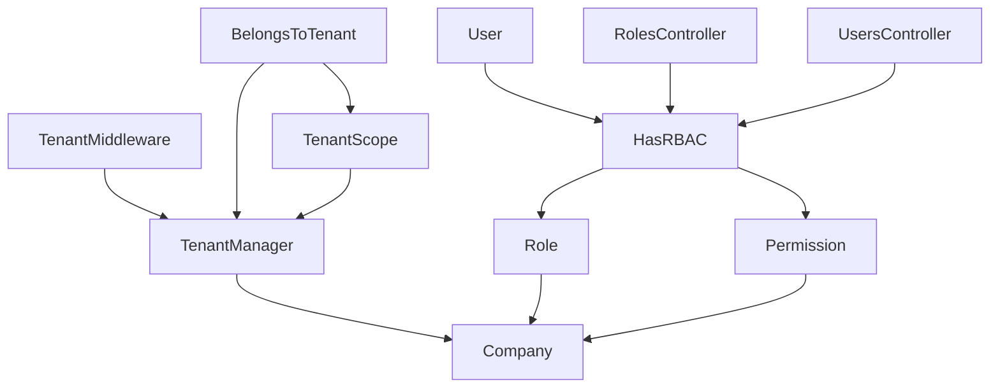

# Tenant Authorization

<cite>
**Referenced Files in This Document**
- [TenantManager.php](file://app/Services/TenantManager.php)
- [TenantMiddleware.php](file://app/Http/Middleware/TenantMiddleware.php)
- [BelongsToTenant.php](file://app/Modules/Core/Traits/BelongsToTenant.php)
- [TenantScope.php](file://app/Modules/Core/Scopes/TenantScope.php)
- [HasRBAC.php](file://app/Modules/Core/Traits/HasRBAC.php)
- [User.php](file://app/Models/User.php)
- [Role.php](file://app/Models/Role.php)
- [Permission.php](file://app/Models/Permission.php)
- [Company.php](file://app/Modules/Companies/Models/Company.php)
- [CheckPermission.php](file://app/Http/Middleware/CheckPermission.php)
- [RolesController.php](file://app/Modules/RBAC/Controllers/RolesController.php)
- [UsersController.php](file://app/Modules/RBAC/Controllers/UsersController.php)
- [2026_04_10_173000_transform_roles_to_multi_tenant.php](file://database/migrations/2026_04_10_173000_transform_roles_to_multi_tenant.php)
- [2026_04_10_164800_upgrade_rbac_schema.php](file://database/migrations/2026_04_10_164800_upgrade_rbac_schema.php)
- [2026_04_06_135154_create_rbac_tables.php](file://database/migrations/2026_04_06_135154_create_rbac_tables.php)
</cite>

## Table of Contents
1. [Introduction](#introduction)
2. [Project Structure](#project-structure)
3. [Core Components](#core-components)
4. [Architecture Overview](#architecture-overview)
5. [Detailed Component Analysis](#detailed-component-analysis)
6. [Dependency Analysis](#dependency-analysis)
7. [Performance Considerations](#performance-considerations)
8. [Troubleshooting Guide](#troubleshooting-guide)
9. [Conclusion](#conclusion)
10. [Appendices](#appendices)

## Introduction
This document explains the tenant authorization subsystem embedded in the RBAC system. It covers how tenant awareness is enforced across models, permissions, and requests; how multi-tenant role inheritance and isolation are implemented; and how tenant switching occurs via subdomain or authenticated user context. It documents the BelongsToTenant trait integration with RBAC, the TenantScope automatic query filtering, and the TenantMiddleware request-level tenant validation. Practical examples illustrate tenant-scoped permission checks, multi-tenant role assignments, and tenant isolation enforcement. Finally, it outlines the integration between tenant management and RBAC for secure multi-tenant authorization.

## Project Structure
The tenant authorization subsystem spans several layers:
- Request pipeline: TenantMiddleware identifies the tenant and stores it in TenantManager.
- Persistence layer: BelongsToTenant trait applies TenantScope globally to models and auto-assigns company_id on creation.
- Authorization layer: HasRBAC trait computes effective permissions scoped to the user’s company and plan.
- RBAC controllers: RolesController and UsersController enforce tenant boundaries when listing, creating, updating, and assigning roles.

**Diagram sources**
- [TenantMiddleware.php:22-50](file://app/Http/Middleware/TenantMiddleware.php#L22-L50)
- [TenantManager.php:17-44](file://app/Services/TenantManager.php#L17-L44)
- [BelongsToTenant.php:15-25](file://app/Modules/Core/Traits/BelongsToTenant.php#L15-L25)
- [TenantScope.php:18-32](file://app/Modules/Core/Scopes/TenantScope.php#L18-L32)
- [HasRBAC.php:15-73](file://app/Modules/Core/Traits/HasRBAC.php#L15-L73)
- [RolesController.php:24-44](file://app/Modules/RBAC/Controllers/RolesController.php#L24-L44)
- [UsersController.php:26-85](file://app/Modules/RBAC/Controllers/UsersController.php#L26-L85)

**Section sources**
- [TenantMiddleware.php:22-50](file://app/Http/Middleware/TenantMiddleware.php#L22-L50)
- [TenantManager.php:17-44](file://app/Services/TenantManager.php#L17-L44)
- [BelongsToTenant.php:15-25](file://app/Modules/Core/Traits/BelongsToTenant.php#L15-L25)
- [TenantScope.php:18-32](file://app/Modules/Core/Scopes/TenantScope.php#L18-L32)
- [HasRBAC.php:15-73](file://app/Modules/Core/Traits/HasRBAC.php#L15-L73)
- [RolesController.php:24-44](file://app/Modules/RBAC/Controllers/RolesController.php#L24-L44)
- [UsersController.php:26-85](file://app/Modules/RBAC/Controllers/UsersController.php#L26-L85)

## Core Components
- TenantManager: Holds the current tenant and exposes helpers to check/set/get tenant and tenant ID.
- TenantMiddleware: Determines tenant from subdomain or authenticated user and sets it in TenantManager.
- BelongsToTenant trait: Boots TenantScope globally and auto-assigns company_id during model creation.
- TenantScope: Applies a global where clause on company_id for tenant-aware queries.
- HasRBAC trait: Computes effective permissions scoped to the user’s company and plan, with role filtering by company or global.
- User model: Uses BelongsToTenant and HasRBAC to enforce tenant-aware authorization.
- Role and Permission models: Support multi-tenant scoping via belongsToMany relations and pivot tables.
- Company model: Represents tenants and provides relations to roles and permissions.
- RBAC controllers: Enforce tenant boundaries for role matrices and user management.

**Section sources**
- [TenantManager.php:17-44](file://app/Services/TenantManager.php#L17-L44)
- [TenantMiddleware.php:22-50](file://app/Http/Middleware/TenantMiddleware.php#L22-L50)
- [BelongsToTenant.php:15-25](file://app/Modules/Core/Traits/BelongsToTenant.php#L15-L25)
- [TenantScope.php:18-32](file://app/Modules/Core/Scopes/TenantScope.php#L18-L32)
- [HasRBAC.php:15-73](file://app/Modules/Core/Traits/HasRBAC.php#L15-L73)
- [User.php:18](file://app/Models/User.php#L18)
- [Role.php:12-25](file://app/Models/Role.php#L12-L25)
- [Permission.php:12-20](file://app/Models/Permission.php#L12-L20)
- [Company.php:184-211](file://app/Modules/Companies/Models/Company.php#L184-L211)
- [RolesController.php:24-44](file://app/Modules/RBAC/Controllers/RolesController.php#L24-L44)
- [UsersController.php:26-85](file://app/Modules/RBAC/Controllers/UsersController.php#L26-L85)

## Architecture Overview
The tenant authorization architecture ensures:
- Request-level tenant identification and propagation.
- Automatic tenant scoping of all tenant-aware models.
- Role and permission resolution constrained to the user’s company and plan.
- Controller-level enforcement of tenant boundaries for RBAC operations.

**Diagram sources**
- [TenantMiddleware.php:22-50](file://app/Http/Middleware/TenantMiddleware.php#L22-L50)
- [TenantManager.php:17-28](file://app/Services/TenantManager.php#L17-L28)

## Detailed Component Analysis

### Tenant Identification and Switching
TenantMiddleware determines the tenant via:
- Subdomain parsing: Extracts the subdomain and resolves a company by slug.
- Authenticated user fallback: Uses the authenticated user’s company if no tenant is set.

TenantManager stores and exposes the current tenant, enabling downstream components to enforce tenant scoping.

Practical example references:
- Subdomain-based tenant switch: [TenantMiddleware.php:26-38](file://app/Http/Middleware/TenantMiddleware.php#L26-L38)
- User-based tenant fallback: [TenantMiddleware.php:40-43](file://app/Http/Middleware/TenantMiddleware.php#L40-L43)
- Tenant storage and retrieval: [TenantManager.php:17-44](file://app/Services/TenantManager.php#L17-L44)

**Section sources**
- [TenantMiddleware.php:22-50](file://app/Http/Middleware/TenantMiddleware.php#L22-L50)
- [TenantManager.php:17-44](file://app/Services/TenantManager.php#L17-L44)

### Tenant-Aware Model Scoping
BelongsToTenant trait:
- Boots TenantScope globally so all queries on tenant-aware models are automatically scoped.
- On model creation, auto-assigns company_id from the current tenant if present.

TenantScope:
- Adds a where clause on company_id when a tenant is set.
- Bypasses scoping for system administrators.

Practical example references:
- Trait boot and global scope registration: [BelongsToTenant.php:15-18](file://app/Modules/Core/Traits/BelongsToTenant.php#L15-L18)
- Auto-assignment of company_id: [BelongsToTenant.php:19-24](file://app/Modules/Core/Traits/BelongsToTenant.php#L19-L24)
- Scope application and system admin bypass: [TenantScope.php:18-32](file://app/Modules/Core/Scopes/TenantScope.php#L18-L32)

**Diagram sources**
- [TenantScope.php:18-32](file://app/Modules/Core/Scopes/TenantScope.php#L18-L32)

**Section sources**
- [BelongsToTenant.php:15-25](file://app/Modules/Core/Traits/BelongsToTenant.php#L15-L25)
- [TenantScope.php:18-32](file://app/Modules/Core/Scopes/TenantScope.php#L18-L32)

### Multi-Tenant Role and Permission Resolution
HasRBAC trait:
- Roles relation filters to global roles or roles explicitly assigned to the user’s company.
- Permissions relation supports direct user permission assignments.
- Permission checks:
  - System admins pass immediately.
  - Direct permission assignment check.
  - Role permission check across the user’s roles.
  - Plan-based gating via SubscriptionService.

Role and Permission models:
- Roles and permissions support multi-tenant scoping via belongsToMany relations.
- Roles can be global or company-specific via is_global flag and role_company pivot.
- Permissions can be global or company-specific via is_global flag and permission_company pivot.

Practical example references:
- Role scoping by company or global: [HasRBAC.php:15-24](file://app/Modules/Core/Traits/HasRBAC.php#L15-L24)
- Permission resolution chain: [HasRBAC.php:37-73](file://app/Modules/Core/Traits/HasRBAC.php#L37-L73)
- Role model relations: [Role.php:12-25](file://app/Models/Role.php#L12-L25)
- Permission model relations: [Permission.php:12-20](file://app/Models/Permission.php#L12-L20)

**Diagram sources**
- [HasRBAC.php:15-103](file://app/Modules/Core/Traits/HasRBAC.php#L15-L103)
- [Role.php:12-25](file://app/Models/Role.php#L12-L25)
- [Permission.php:12-20](file://app/Models/Permission.php#L12-L20)
- [Company.php:184-211](file://app/Modules/Companies/Models/Company.php#L184-L211)

**Section sources**
- [HasRBAC.php:15-103](file://app/Modules/Core/Traits/HasRBAC.php#L15-L103)
- [Role.php:12-25](file://app/Models/Role.php#L12-L25)
- [Permission.php:12-20](file://app/Models/Permission.php#L12-L20)
- [Company.php:184-211](file://app/Modules/Companies/Models/Company.php#L184-L211)

### Tenant Isolation Enforcement in Controllers
RBAC controllers enforce tenant boundaries:
- RolesController:
  - Matrix view: Lists roles and permissions scoped to the current company or global.
  - Matrix updates: Limits updates to company-specific roles and permissions visible to the user.
- UsersController:
  - Index: Filters users by company_id and applies additional filters.
  - Store: Validates roles against the current company and enforces plan limits.
  - Show/update/delete: Enforces cross-tenant boundary checks and admin protection rules.

Practical example references:
- Role matrix scoping: [RolesController.php:24-44](file://app/Modules/RBAC/Controllers/RolesController.php#L24-L44)
- Role matrix update scoping: [RolesController.php:54-83](file://app/Modules/RBAC/Controllers/RolesController.php#L54-L83)
- User listing by company: [UsersController.php:32-34](file://app/Modules/RBAC/Controllers/UsersController.php#L32-L34)
- Role validation against company: [UsersController.php:122-127](file://app/Modules/RBAC/Controllers/UsersController.php#L122-L127)
- Cross-tenant boundary checks: [UsersController.php:161-164](file://app/Modules/RBAC/Controllers/UsersController.php#L161-L164)

**Diagram sources**
- [UsersController.php:26-85](file://app/Modules/RBAC/Controllers/UsersController.php#L26-L85)

**Section sources**
- [RolesController.php:24-83](file://app/Modules/RBAC/Controllers/RolesController.php#L24-L83)
- [UsersController.php:26-85](file://app/Modules/RBAC/Controllers/UsersController.php#L26-L85)

### Request-Level Permission Checks
CheckPermission middleware validates that the authenticated user holds a specific permission before allowing access to protected routes. It returns JSON for AJAX requests and aborts with HTTP 403 otherwise.

Practical example references:
- Permission check and response: [CheckPermission.php:16-26](file://app/Http/Middleware/CheckPermission.php#L16-L26)

**Section sources**
- [CheckPermission.php:16-26](file://app/Http/Middleware/CheckPermission.php#L16-L26)

### Multi-Tenant Role Inheritance and Cross-Tenant Limitations
Multi-tenant role inheritance is achieved through:
- Role-company pivots (role_company) to associate roles with specific companies.
- Global roles and permissions that apply across tenants.
- Plan-based permission gating via SubscriptionService.

Cross-tenant limitations:
- Users cannot assign roles that do not belong to their company unless the role is global.
- Queries are scoped by company_id, preventing accidental cross-tenant access.
- Controllers enforce tenant boundaries for all RBAC operations.

Practical example references:
- Role-company pivot creation and migration: [2026_04_10_173000_transform_roles_to_multi_tenant.php:18-26](file://database/migrations/2026_04_10_173000_transform_roles_to_multi_tenant.php#L18-L26)
- Role-company pivot migration data: [2026_04_10_173000_transform_roles_to_multi_tenant.php:28-38](file://database/migrations/2026_04_10_173000_transform_roles_to_multi_tenant.php#L28-L38)
- Upgrading permissions and roles to multi-tenant: [2026_04_10_164800_upgrade_rbac_schema.php:15-35](file://database/migrations/2026_04_10_164800_upgrade_rbac_schema.php#L15-L35)
- Initial RBAC schema (pre-multi-tenant): [2026_04_06_135154_create_rbac_tables.php:21-52](file://database/migrations/2026_04_06_135154_create_rbac_tables.php#L21-L52)

**Section sources**
- [2026_04_10_173000_transform_roles_to_multi_tenant.php:18-38](file://database/migrations/2026_04_10_173000_transform_roles_to_multi_tenant.php#L18-L38)
- [2026_04_10_164800_upgrade_rbac_schema.php:15-35](file://database/migrations/2026_04_10_164800_upgrade_rbac_schema.php#L15-L35)
- [2026_04_06_135154_create_rbac_tables.php:21-52](file://database/migrations/2026_04_06_135154_create_rbac_tables.php#L21-L52)

## Dependency Analysis
The tenant authorization subsystem exhibits clear separation of concerns:
- TenantMiddleware depends on TenantManager and Company model.
- BelongsToTenant depends on TenantScope and TenantManager.
- TenantScope depends on TenantManager and current authentication state.
- HasRBAC depends on Role, Permission, and SubscriptionService.
- Controllers depend on User, Role, Permission, and SubscriptionService.

**Diagram sources**
- [TenantMiddleware.php:22-50](file://app/Http/Middleware/TenantMiddleware.php#L22-L50)
- [TenantManager.php:17-44](file://app/Services/TenantManager.php#L17-L44)
- [BelongsToTenant.php:15-25](file://app/Modules/Core/Traits/BelongsToTenant.php#L15-L25)
- [TenantScope.php:18-32](file://app/Modules/Core/Scopes/TenantScope.php#L18-L32)
- [HasRBAC.php:15-103](file://app/Modules/Core/Traits/HasRBAC.php#L15-L103)
- [Role.php:12-25](file://app/Models/Role.php#L12-L25)
- [Permission.php:12-20](file://app/Models/Permission.php#L12-L20)
- [Company.php:184-211](file://app/Modules/Companies/Models/Company.php#L184-L211)
- [RolesController.php:24-83](file://app/Modules/RBAC/Controllers/RolesController.php#L24-L83)
- [UsersController.php:26-85](file://app/Modules/RBAC/Controllers/UsersController.php#L26-L85)

**Section sources**
- [TenantMiddleware.php:22-50](file://app/Http/Middleware/TenantMiddleware.php#L22-L50)
- [TenantManager.php:17-44](file://app/Services/TenantManager.php#L17-L44)
- [BelongsToTenant.php:15-25](file://app/Modules/Core/Traits/BelongsToTenant.php#L15-L25)
- [TenantScope.php:18-32](file://app/Modules/Core/Scopes/TenantScope.php#L18-L32)
- [HasRBAC.php:15-103](file://app/Modules/Core/Traits/HasRBAC.php#L15-L103)
- [Role.php:12-25](file://app/Models/Role.php#L12-L25)
- [Permission.php:12-20](file://app/Models/Permission.php#L12-L20)
- [Company.php:184-211](file://app/Modules/Companies/Models/Company.php#L184-L211)
- [RolesController.php:24-83](file://app/Modules/RBAC/Controllers/RolesController.php#L24-L83)
- [UsersController.php:26-85](file://app/Modules/RBAC/Controllers/UsersController.php#L26-L85)

## Performance Considerations
- Global scopes add a where clause to all tenant-aware queries; ensure appropriate indexes exist on company_id for optimal performance.
- Role and permission joins can be expensive; cache frequently accessed role-permission matrices where feasible.
- Middleware executes early in the pipeline; keep tenant identification logic lightweight and rely on indexed slug lookups.
- Pagination and filtered lists reduce payload sizes; continue to leverage controller-level filters and scopes.

## Troubleshooting Guide
Common issues and resolutions:
- Unauthorized access attempts:
  - Verify CheckPermission middleware is applied to protected routes.
  - Confirm user.hasPermission returns true after HasRBAC resolves roles and plan gating.
  - References: [CheckPermission.php:16-26](file://app/Http/Middleware/CheckPermission.php#L16-L26), [HasRBAC.php:37-73](file://app/Modules/Core/Traits/HasRBAC.php#L37-L73)
- Cross-tenant access:
  - Ensure BelongsToTenant is used by tenant-aware models and TenantScope is applied.
  - Confirm TenantMiddleware sets the tenant before controllers execute.
  - References: [BelongsToTenant.php:15-25](file://app/Modules/Core/Traits/BelongsToTenant.php#L15-L25), [TenantScope.php:18-32](file://app/Modules/Core/Scopes/TenantScope.php#L18-L32), [TenantMiddleware.php:22-50](file://app/Http/Middleware/TenantMiddleware.php#L22-L50)
- Role assignment failures:
  - Validate that selected roles belong to the current company or are global.
  - Controllers enforce role-company validity; check validation messages.
  - References: [UsersController.php:122-127](file://app/Modules/RBAC/Controllers/UsersController.php#L122-L127), [HasRBAC.php:78-91](file://app/Modules/Core/Traits/HasRBAC.php#L78-L91)
- Permission matrix inconsistencies:
  - RolesController restricts updates to company-specific roles; ensure only allowed permissions are synced.
  - References: [RolesController.php:54-83](file://app/Modules/RBAC/Controllers/RolesController.php#L54-L83)

**Section sources**
- [CheckPermission.php:16-26](file://app/Http/Middleware/CheckPermission.php#L16-L26)
- [HasRBAC.php:37-73](file://app/Modules/Core/Traits/HasRBAC.php#L37-L73)
- [BelongsToTenant.php:15-25](file://app/Modules/Core/Traits/BelongsToTenant.php#L15-L25)
- [TenantScope.php:18-32](file://app/Modules/Core/Scopes/TenantScope.php#L18-L32)
- [TenantMiddleware.php:22-50](file://app/Http/Middleware/TenantMiddleware.php#L22-L50)
- [UsersController.php:122-127](file://app/Modules/RBAC/Controllers/UsersController.php#L122-L127)
- [HasRBAC.php:78-91](file://app/Modules/Core/Traits/HasRBAC.php#L78-L91)
- [RolesController.php:54-83](file://app/Modules/RBAC/Controllers/RolesController.php#L54-L83)

## Conclusion
The tenant authorization subsystem integrates tenant identification, automatic query scoping, and robust RBAC with multi-tenant role and permission inheritance. TenantMiddleware and TenantManager establish the tenant context; BelongsToTenant and TenantScope enforce tenant isolation at the persistence level; HasRBAC resolves effective permissions scoped to the user’s company and plan; and RBAC controllers enforce tenant boundaries for all administrative operations. Together, these components provide secure, scalable multi-tenant authorization.

## Appendices
- Practical examples (by reference):
  - Tenant-scoped permission checks: [HasRBAC.php:46-73](file://app/Modules/Core/Traits/HasRBAC.php#L46-L73)
  - Multi-tenant role assignments: [HasRBAC.php:78-91](file://app/Modules/Core/Traits/HasRBAC.php#L78-L91), [UsersController.php:146-148](file://app/Modules/RBAC/Controllers/UsersController.php#L146-L148)
  - Tenant-specific authorization workflows: [TenantMiddleware.php:22-50](file://app/Http/Middleware/TenantMiddleware.php#L22-L50), [TenantScope.php:18-32](file://app/Modules/Core/Scopes/TenantScope.php#L18-L32), [RolesController.php:24-44](file://app/Modules/RBAC/Controllers/RolesController.php#L24-L44), [UsersController.php:26-85](file://app/Modules/RBAC/Controllers/UsersController.php#L26-L85)