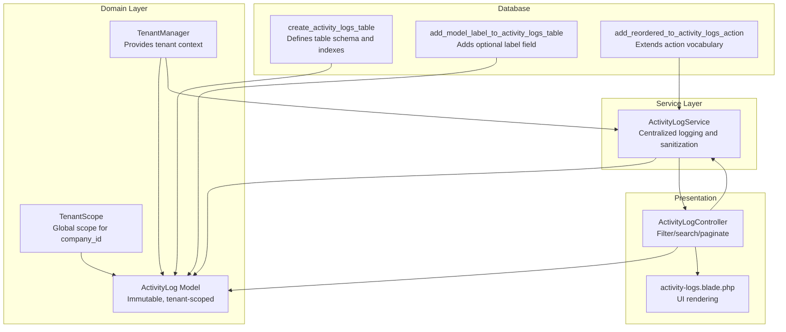
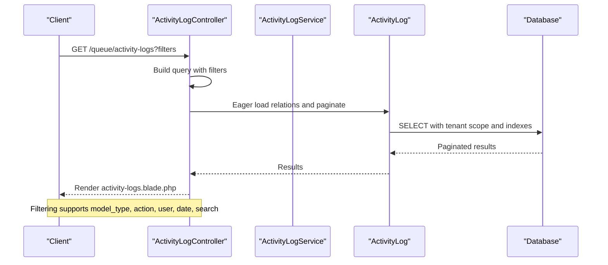
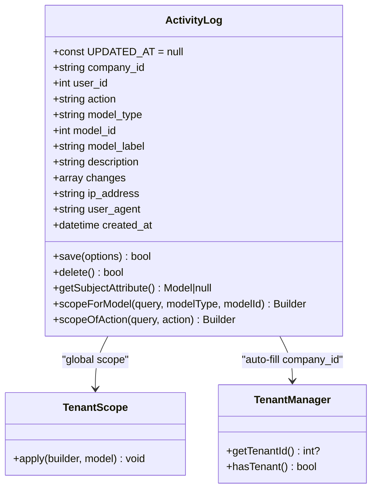
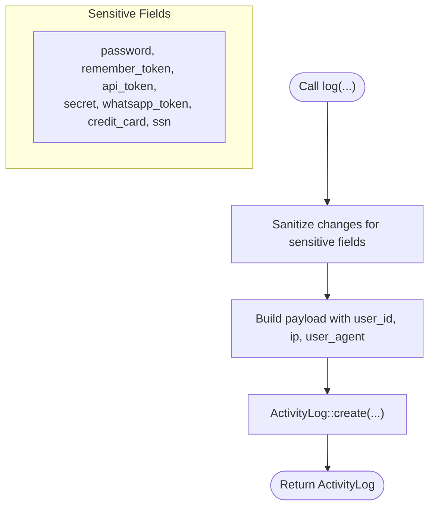
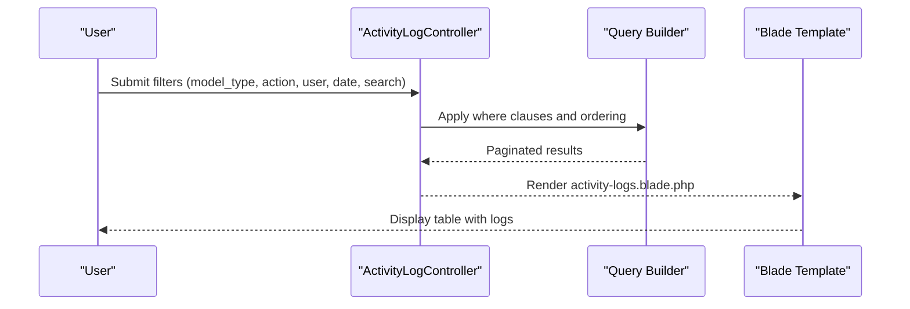
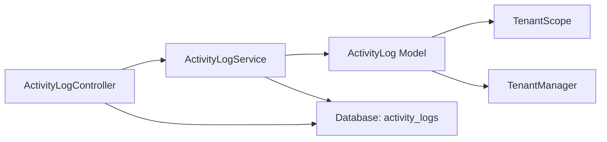

# Audit & Logging Entities

<cite>
**Referenced Files in This Document**
- [2026_04_16_150001_create_activity_logs_table.php](file://database/migrations/2026_04_16_150001_create_activity_logs_table.php)
- [2026_04_16_175057_add_model_label_to_activity_logs_table.php](file://database/migrations/2026_04_16_175057_add_model_label_to_activity_logs_table.php)
- [2026_04_17_160132_add_reordered_to_activity_logs_action.php](file://database/migrations/2026_04_17_160132_add_reordered_to_activity_logs_action.php)
- [ActivityLog.php](file://app/Modules/Queue/Models/ActivityLog.php)
- [ActivityLogService.php](file://app/Modules/Queue/Services/ActivityLogService.php)
- [ActivityLogController.php](file://app/Modules/Queue/Controllers/ActivityLogController.php)
- [TenantScope.php](file://app/Modules/Core/Scopes/TenantScope.php)
- [TenantManager.php](file://app/Services/TenantManager.php)
- [activity-logs.blade.php](file://resources/views/queue/activity-logs.blade.php)
</cite>

## Table of Contents
1. [Introduction](#introduction)
2. [Project Structure](#project-structure)
3. [Core Components](#core-components)
4. [Architecture Overview](#architecture-overview)
5. [Detailed Component Analysis](#detailed-component-analysis)
6. [Dependency Analysis](#dependency-analysis)
7. [Performance Considerations](#performance-considerations)
8. [Troubleshooting Guide](#troubleshooting-guide)
9. [Privacy and Retention Policies](#privacy-and-retention-policies)
10. [Conclusion](#conclusion)

## Introduction
This document provides comprehensive data model documentation for Noubtigo's audit and logging entities. It focuses on the ActivityLog model and the ActivityLogService that automatically tracks user actions, system events, and data modifications across tenant contexts. The documentation covers log entry structure, filtering and searching capabilities for audit trails, relationships with business entities, field definitions, data serialization, privacy considerations, and multi-tenant log retention policies.

## Project Structure
The audit/logging subsystem spans three main areas:
- Database schema: migration files define the activity_logs table and its evolving action semantics.
- Domain model: ActivityLog encapsulates immutable audit records with tenant scoping and convenience helpers.
- Service layer: ActivityLogService centralizes logging logic, sensitive data filtering, and specialized event handlers.
- Presentation: ActivityLogController and Blade view enable filtering, searching, and display of audit trails.

**Diagram sources**
- [2026_04_16_150001_create_activity_logs_table.php:14-37](file://database/migrations/2026_04_16_150001_create_activity_logs_table.php#L14-L37)
- [2026_04_16_175057_add_model_label_to_activity_logs_table.php:14-15](file://database/migrations/2026_04_16_175057_add_model_label_to_activity_logs_table.php#L14-L15)
- [2026_04_17_160132_add_reordered_to_activity_logs_action.php:14-16](file://database/migrations/2026_04_17_160132_add_reordered_to_activity_logs_action.php#L14-L16)
- [ActivityLog.php:8-52](file://app/Modules/Queue/Models/ActivityLog.php#L8-L52)
- [TenantScope.php:18-32](file://app/Modules/Core/Scopes/TenantScope.php#L18-L32)
- [TenantManager.php:33-35](file://app/Services/TenantManager.php#L33-L35)
- [ActivityLogService.php:9-52](file://app/Modules/Queue/Services/ActivityLogService.php#L9-L52)
- [ActivityLogController.php:14-56](file://app/Modules/Queue/Controllers/ActivityLogController.php#L14-L56)
- [activity-logs.blade.php:133-159](file://resources/views/queue/activity-logs.blade.php#L133-L159)

**Section sources**
- [2026_04_16_150001_create_activity_logs_table.php:14-37](file://database/migrations/2026_04_16_150001_create_activity_logs_table.php#L14-L37)
- [ActivityLog.php:8-52](file://app/Modules/Queue/Models/ActivityLog.php#L8-L52)
- [ActivityLogService.php:9-52](file://app/Modules/Queue/Services/ActivityLogService.php#L9-L52)
- [ActivityLogController.php:14-56](file://app/Modules/Queue/Controllers/ActivityLogController.php#L14-L56)
- [activity-logs.blade.php:133-159](file://resources/views/queue/activity-logs.blade.php#L133-L159)

## Core Components
- ActivityLog model: Immutable audit record with tenant scoping, auto-populated company_id, and convenience accessors for subject entity resolution.
- ActivityLogService: Centralized logging utility that sanitizes sensitive data, constructs descriptive entries, and provides domain-specific logging helpers.
- TenantScope and TenantManager: Enforce multi-tenant isolation and provide tenant context for scoping and auto-filling company_id.

Key responsibilities:
- Capture user identity, action type, target entity, timestamps, IP address, user agent, and serialized changes.
- Provide filtering/searching by model type, action, user, date, and free-text search.
- Maintain immutability and enforce privacy by excluding sensitive fields from change logs.

**Section sources**
- [ActivityLog.php:8-52](file://app/Modules/Queue/Models/ActivityLog.php#L8-L52)
- [ActivityLogService.php:9-52](file://app/Modules/Queue/Services/ActivityLogService.php#L9-L52)
- [TenantScope.php:18-32](file://app/Modules/Core/Scopes/TenantScope.php#L18-L32)
- [TenantManager.php:33-35](file://app/Services/TenantManager.php#L33-L35)

## Architecture Overview
The audit trail architecture integrates database schema, domain model, service layer, and presentation layer with strong multi-tenant boundaries.

**Diagram sources**
- [ActivityLogController.php:14-56](file://app/Modules/Queue/Controllers/ActivityLogController.php#L14-L56)
- [ActivityLog.php:108-124](file://app/Modules/Queue/Models/ActivityLog.php#L108-L124)
- [2026_04_16_150001_create_activity_logs_table.php:32-36](file://database/migrations/2026_04_16_150001_create_activity_logs_table.php#L32-L36)

## Detailed Component Analysis

### ActivityLog Model
The ActivityLog model defines the audit record structure and behavior:
- Immutable design: prevents updates/deletes; only created_at is tracked.
- Tenant scoping: applies company_id filter globally except for system admins.
- Auto-fill: sets company_id from TenantManager during creation.
- Subject resolution: resolves the associated business entity by model_type/model_id.
- Convenience scopes: filter by model or action.

**Diagram sources**
- [ActivityLog.php:8-125](file://app/Modules/Queue/Models/ActivityLog.php#L8-L125)
- [TenantScope.php:9-32](file://app/Modules/Core/Scopes/TenantScope.php#L9-L32)
- [TenantManager.php:7-45](file://app/Services/TenantManager.php#L7-L45)

**Section sources**
- [ActivityLog.php:8-125](file://app/Modules/Queue/Models/ActivityLog.php#L8-L125)
- [TenantScope.php:18-32](file://app/Modules/Core/Scopes/TenantScope.php#L18-L32)
- [TenantManager.php:33-35](file://app/Services/TenantManager.php#L33-L35)

### ActivityLogService
The ActivityLogService centralizes logging logic:
- Sanitization: removes sensitive fields from changes arrays.
- Generic logging: accepts model_type, model_id, action, description, changes, and optional model_label.
- Domain-specific helpers: ticket lifecycle events, user/customer events, and specialized statuses.

**Diagram sources**
- [ActivityLogService.php:28-52](file://app/Modules/Queue/Services/ActivityLogService.php#L28-L52)
- [ActivityLogService.php:262-273](file://app/Modules/Queue/Services/ActivityLogService.php#L262-L273)

**Section sources**
- [ActivityLogService.php:9-52](file://app/Modules/Queue/Services/ActivityLogService.php#L9-L52)
- [ActivityLogService.php:262-273](file://app/Modules/Queue/Services/ActivityLogService.php#L262-L273)

### ActivityLogController and UI
The controller provides filtering and searching:
- Filters: model_type, action, user (UUID or ID), date.
- Search: description and model_type via LIKE.
- Pagination: 30 items per page.
- View: renders logs with date, user, action, model, description, and changes.

**Diagram sources**
- [ActivityLogController.php:14-56](file://app/Modules/Queue/Controllers/ActivityLogController.php#L14-L56)
- [activity-logs.blade.php:133-159](file://resources/views/queue/activity-logs.blade.php#L133-L159)

**Section sources**
- [ActivityLogController.php:14-56](file://app/Modules/Queue/Controllers/ActivityLogController.php#L14-L56)
- [activity-logs.blade.php:133-159](file://resources/views/queue/activity-logs.blade.php#L133-L159)

## Dependency Analysis
The following diagram shows how components depend on each other:

**Diagram sources**
- [ActivityLogController.php:14-56](file://app/Modules/Queue/Controllers/ActivityLogController.php#L14-L56)
- [ActivityLogService.php:9-52](file://app/Modules/Queue/Services/ActivityLogService.php#L9-L52)
- [ActivityLog.php:8-52](file://app/Modules/Queue/Models/ActivityLog.php#L8-L52)
- [TenantScope.php:18-32](file://app/Modules/Core/Scopes/TenantScope.php#L18-L32)
- [TenantManager.php:33-35](file://app/Services/TenantManager.php#L33-L35)

**Section sources**
- [ActivityLogController.php:14-56](file://app/Modules/Queue/Controllers/ActivityLogController.php#L14-L56)
- [ActivityLogService.php:9-52](file://app/Modules/Queue/Services/ActivityLogService.php#L9-L52)
- [ActivityLog.php:8-52](file://app/Modules/Queue/Models/ActivityLog.php#L8-L52)
- [TenantScope.php:18-32](file://app/Modules/Core/Scopes/TenantScope.php#L18-L32)
- [TenantManager.php:33-35](file://app/Services/TenantManager.php#L33-L35)

## Performance Considerations
- Database indexes: composite index on (model_type, model_id) and (company_id, created_at) optimize common queries for entity-centric and tenant-centric views.
- Immutable writes: single-direction writes reduce contention and simplify auditing.
- JSON changes: efficient for storing before/after diffs; consider size limits and avoid logging excessively large payloads.
- Pagination: default 30 items per page balances usability and performance.
- Tenant scoping: global scope ensures queries remain constrained to the current tenant.

**Section sources**
- [2026_04_16_150001_create_activity_logs_table.php:32-36](file://database/migrations/2026_04_16_150001_create_activity_logs_table.php#L32-L36)
- [ActivityLog.php:39-52](file://app/Modules/Queue/Models/ActivityLog.php#L39-L52)

## Troubleshooting Guide
Common issues and resolutions:
- Missing company_id: ensure TenantManager is set; the model auto-fills company_id on creation.
- Unauthorized access: TenantScope restricts visibility; system admins bypass scope.
- Empty results: verify filters and pagination; confirm indexes are present.
- Privacy violations: sensitive fields are filtered out automatically; review filterSensitive behavior.

**Section sources**
- [ActivityLog.php:43-51](file://app/Modules/Queue/Models/ActivityLog.php#L43-L51)
- [TenantScope.php:24-28](file://app/Modules/Core/Scopes/TenantScope.php#L24-L28)
- [ActivityLogService.php:262-273](file://app/Modules/Queue/Services/ActivityLogService.php#L262-L273)

## Privacy and Retention Policies
- Privacy safeguards:
  - Sensitive fields are excluded from change logs.
  - IP address and user agent are stored minimally and transiently.
  - Access is restricted by tenant scope.
- Retention policy:
  - No explicit retention period is defined in code; implement a scheduled job to prune old logs based on organizational policy.
  - Consider partitioning or archiving older logs to maintain query performance.

[No sources needed since this section provides general guidance]

## Conclusion
Noubtigo’s audit and logging system provides a robust, tenant-aware mechanism for tracking user actions and data changes. The ActivityLog model, ActivityLogService, and supporting infrastructure ensure immutability, privacy, and scalability while enabling flexible filtering and searching. Adopting clear retention and archival policies will help maintain performance and compliance over time.