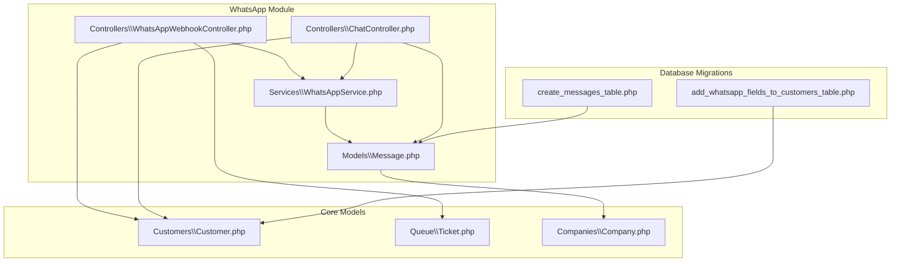
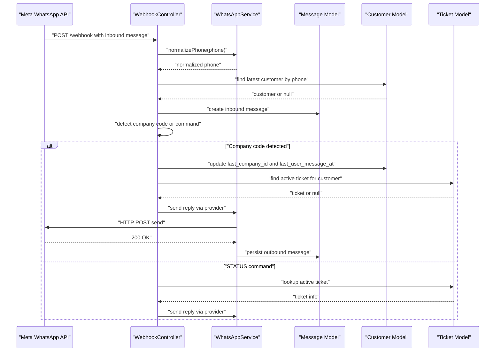
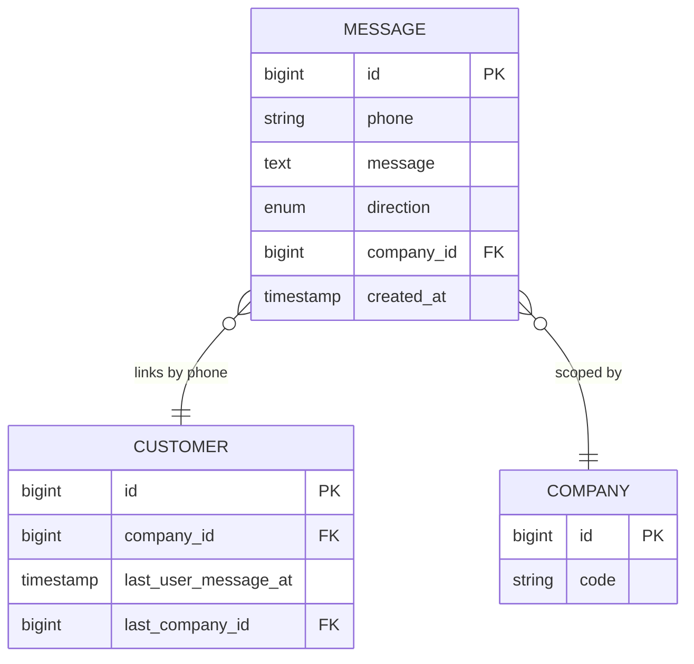
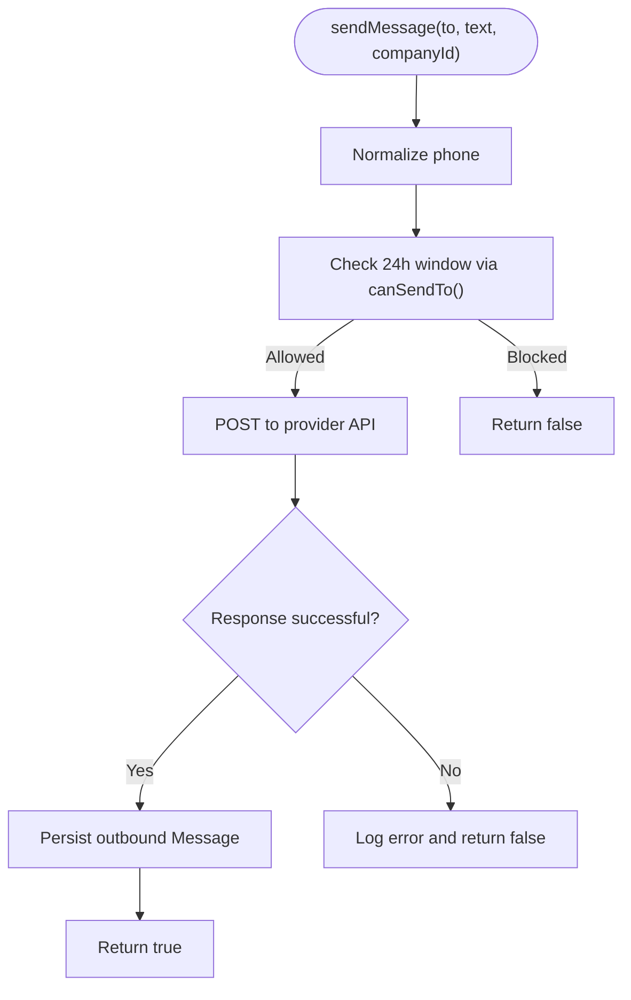
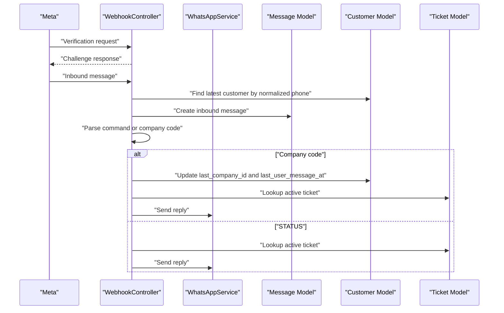
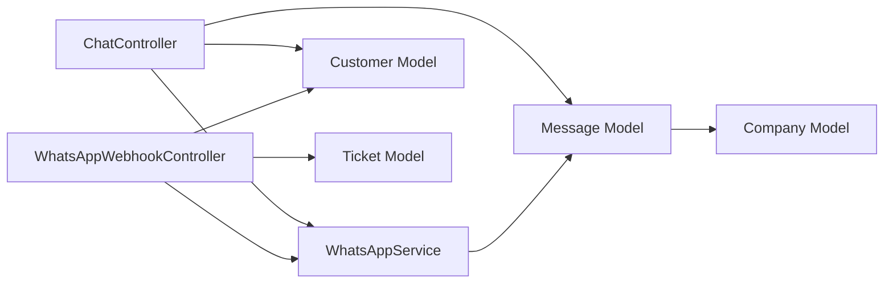

# Communication & Notification Entities

<cite>
**Referenced Files in This Document**
- [Message.php](file://app\Modules\WhatsApp\Models\Message.php)
- [WhatsAppService.php](file://app\Modules\WhatsApp\Services\WhatsAppService.php)
- [ChatController.php](file://app\Modules\WhatsApp\Controllers\ChatController.php)
- [WhatsAppWebhookController.php](file://app\Modules\WhatsApp\Controllers\WhatsAppWebhookController.php)
- [create_messages_table.php](file://database\migrations\2026_04_13_000003_create_messages_table.php)
- [add_whatsapp_fields_to_customers_table.php](file://database\migrations\2026_04_13_000002_add_whatsapp_fields_to_customers_table.php)
- [Customer.php](file://app\Modules\Customers\Models\Customer.php)
- [Ticket.php](file://app\Modules\Queue\Models\Ticket.php)
- [Company.php](file://app\Modules\Companies\Models\Company.php)
- [2026_04_13_000001_create_appointments_table.php](file://database\migrations\2026_04_06_200003_create_appointments_table.php)
- [2026_04_06_154141_add_prefix_to_services_table.php](file://database\migrations\2026_04_06_154141_add_prefix_to_services_table.php)
</cite>

## Table of Contents
1. [Introduction](#introduction)
2. [Project Structure](#project-structure)
3. [Core Components](#core-components)
4. [Architecture Overview](#architecture-overview)
5. [Detailed Component Analysis](#detailed-component-analysis)
6. [Dependency Analysis](#dependency-analysis)
7. [Performance Considerations](#performance-considerations)
8. [Troubleshooting Guide](#troubleshooting-guide)
9. [Conclusion](#conclusion)

## Introduction
This document describes Noubtigo's communication and notification entities with a focus on WhatsApp integration. It documents the Message model, inbound/outbound message handling, webhook processing, customer linking, and automated replies triggered by business events such as ticket status changes and appointment reminders. It also covers message queuing, templates, recipient management, delivery tracking, and integration patterns with external communication providers and local notification systems.

## Project Structure
The communication stack is organized under the WhatsApp module with dedicated models, services, and controllers. Supporting components include the Customer model for recipient management, the Company model for tenant scoping, and the Ticket model for event-driven notifications.

**Diagram sources**
- [WhatsAppWebhookController.php:1-240](file://app\Modules\WhatsApp\Controllers\WhatsAppWebhookController.php#L1-L240)
- [ChatController.php:1-161](file://app\Modules\WhatsApp\Controllers\ChatController.php#L1-L161)
- [WhatsAppService.php:1-111](file://app\Modules\WhatsApp\Services\WhatsAppService.php#L1-L111)
- [Message.php:1-50](file://app\Modules\WhatsApp\Models\Message.php#L1-L50)
- [Customer.php:1-171](file://app\Modules\Customers\Models\Customer.php#L1-L171)
- [Ticket.php](file://app\Modules\Queue\Models\Ticket.php)
- [Company.php](file://app\Modules\Companies\Models\Company.php)
- [create_messages_table.php:1-32](file://database\migrations\2026_04_13_000003_create_messages_table.php#L1-L32)
- [add_whatsapp_fields_to_customers_table.php:1-31](file://database\migrations\2026_04_13_000002_add_whatsapp_fields_to_customers_table.php#L1-L31)

**Section sources**
- [Message.php:1-50](file://app\Modules\WhatsApp\Models\Message.php#L1-L50)
- [WhatsAppService.php:1-111](file://app\Modules\WhatsApp\Services\WhatsAppService.php#L1-L111)
- [ChatController.php:1-161](file://app\Modules\WhatsApp\Controllers\ChatController.php#L1-L161)
- [WhatsAppWebhookController.php:1-240](file://app\Modules\WhatsApp\Controllers\WhatsAppWebhookController.php#L1-L240)
- [create_messages_table.php:1-32](file://database\migrations\2026_04_13_000003_create_messages_table.php#L1-L32)
- [add_whatsapp_fields_to_customers_table.php:1-31](file://database\migrations\2026_04_13_000002_add_whatsapp_fields_to_customers_table.php#L1-L31)

## Core Components
- Message model: Stores inbound/outbound WhatsApp messages with direction, phone number, company scoping, and timestamps.
- WhatsAppService: Integrates with the external provider, handles phone normalization, 24-hour reply protection, and outbound sending.
- ChatController: Provides UI endpoints for viewing conversations, chat history, lazy-loading older messages, and sending outbound messages.
- WhatsAppWebhookController: Handles Meta webhook verification and inbound message processing, including company code detection, status checks, and automated replies.
- Customer model: Centralizes recipient data, phone normalization, and WhatsApp state fields for cross-company linkage.
- Ticket and Company models: Drive business-event-triggered notifications and tenant scoping.

**Section sources**
- [Message.php:1-50](file://app\Modules\WhatsApp\Models\Message.php#L1-L50)
- [WhatsAppService.php:1-111](file://app\Modules\WhatsApp\Services\WhatsAppService.php#L1-L111)
- [ChatController.php:1-161](file://app\Modules\WhatsApp\Controllers\ChatController.php#L1-L161)
- [WhatsAppWebhookController.php:1-240](file://app\Modules\WhatsApp\Controllers\WhatsAppWebhookController.php#L1-L240)
- [Customer.php:1-171](file://app\Modules\Customers\Models\Customer.php#L1-L171)
- [Ticket.php](file://app\Modules\Queue\Models\Ticket.php)
- [Company.php](file://app\Modules\Companies\Models\Company.php)

## Architecture Overview
The system integrates external provider APIs for WhatsApp while maintaining internal state for recipients, conversations, and business events. Inbound messages trigger automated replies based on business logic; outbound messages are queued implicitly through the service layer and persisted locally for audit and UI.

**Diagram sources**
- [WhatsAppWebhookController.php:43-124](file://app\Modules\WhatsApp\Controllers\WhatsAppWebhookController.php#L43-L124)
- [WhatsAppService.php:32-78](file://app\Modules\WhatsApp\Services\WhatsAppService.php#L32-L78)
- [Message.php:1-50](file://app\Modules\WhatsApp\Models\Message.php#L1-L50)
- [Customer.php:1-171](file://app\Modules\Customers\Models\Customer.php#L1-L171)
- [Ticket.php](file://app\Modules\Queue\Models\Ticket.php)

## Detailed Component Analysis

### Message Model
The Message model persists WhatsApp conversations with direction, phone number, company scoping, and timestamps. It supports inbound and outbound directions and is scoped to a tenant/company.

Key fields and behaviors:
- Fields: phone, message, direction, company_id, created_at
- Indexes: phone, direction, created_at for efficient queries
- Tenant scoping: BelongsToTenant trait ensures isolation per company
- Timestamps: created_at is indexed and stored; model does not auto-manage timestamps

**Diagram sources**
- [Message.php:1-50](file://app\Modules\WhatsApp\Models\Message.php#L1-L50)
- [create_messages_table.php:14-21](file://database\migrations\2026_04_13_000003_create_messages_table.php#L14-L21)
- [Customer.php:1-171](file://app\Modules\Customers\Models\Customer.php#L1-L171)
- [add_whatsapp_fields_to_customers_table.php:14-17](file://database\migrations\2026_04_13_000002_add_whatsapp_fields_to_customers_table.php#L14-L17)
- [Company.php](file://app\Modules\Companies\Models\Company.php)

**Section sources**
- [Message.php:1-50](file://app\Modules\WhatsApp\Models\Message.php#L1-L50)
- [create_messages_table.php:14-21](file://database\migrations\2026_04_13_000003_create_messages_table.php#L14-L21)

### WhatsAppService
Responsibilities:
- Provider integration: Sends text messages via the external API using configured credentials.
- Phone normalization: Ensures consistent E.164-like formatting for reliable routing.
- 24-hour reply protection: Enforces Meta's policy by checking the last inbound message time per customer.
- Outbound persistence: Creates outbound Message records upon successful send.

Processing logic:
- Validates 24h window using Customer.last_user_message_at
- Calls external API with JSON payload
- On success, persists outbound message with direction=outbound

**Diagram sources**
- [WhatsAppService.php:32-78](file://app\Modules\WhatsApp\Services\WhatsAppService.php#L32-L78)
- [WhatsAppService.php:99-109](file://app\Modules\WhatsApp\Services\WhatsAppService.php#L99-L109)

**Section sources**
- [WhatsAppService.php:1-111](file://app\Modules\WhatsApp\Services\WhatsAppService.php#L1-L111)

### ChatController
Provides UI endpoints for:
- Listing conversations grouped by phone with last activity
- Viewing chat history for a specific phone
- Lazy-loading older messages with pagination
- Sending outbound messages via the service layer

Behavior highlights:
- Normalizes phone numbers for consistent grouping
- Applies tenant scoping to company_id
- Checks 24h window before allowing sends
- Returns localized timestamps for display

**Section sources**
- [ChatController.php:1-161](file://app\Modules\WhatsApp\Controllers\ChatController.php#L1-L161)

### WhatsAppWebhookController
Handles inbound messages and commands:
- Verification: Responds to Meta's challenge with hub_challenge
- Inbound processing: Normalizes phone, updates customer state, persists inbound message
- Command handling:
  - Company code detection: Links customer to a company and validates permissions
  - STATUS command: Returns current ticket status and queue position
- Automated replies: Uses WhatsAppService to send templated responses

**Diagram sources**
- [WhatsAppWebhookController.php:26-38](file://app\Modules\WhatsApp\Controllers\WhatsAppWebhookController.php#L26-L38)
- [WhatsAppWebhookController.php:43-124](file://app\Modules\WhatsApp\Controllers\WhatsAppWebhookController.php#L43-L124)
- [WhatsAppWebhookController.php:129-166](file://app\Modules\WhatsApp\Controllers\WhatsAppWebhookController.php#L129-L166)
- [WhatsAppWebhookController.php:171-209](file://app\Modules\WhatsApp\Controllers\WhatsAppWebhookController.php#L171-L209)
- [WhatsAppService.php:32-78](file://app\Modules\WhatsApp\Services\WhatsAppService.php#L32-L78)

**Section sources**
- [WhatsAppWebhookController.php:1-240](file://app\Modules\WhatsApp\Controllers\WhatsAppWebhookController.php#L1-L240)

### Customer Model and Recipient Management
Customer holds recipient identity and WhatsApp state:
- Phone normalization: Ensures consistent formatting across the system
- Cross-company linkage: last_company_id and last_user_message_at enable unified status checks
- Relationships: Supports tickets and favorites

Integration implications:
- last_user_message_at drives 24h reply protection
- last_company_id enables STATUS without requiring repeated company code input

**Section sources**
- [Customer.php:1-171](file://app\Modules\Customers\Models\Customer.php#L1-L171)
- [add_whatsapp_fields_to_customers_table.php:14-17](file://database\migrations\2026_04_13_000002_add_whatsapp_fields_to_customers_table.php#L14-L17)

### Business Event Triggers and Templates
Automated replies are driven by business events:
- Ticket status changes: Called/Serving prompts immediate turn notifications
- Appointment reminders: Use similar patterns to send scheduled reminders via the same service layer

Template composition:
- Customer name, ticket number, company, people ahead, and status-specific guidance
- Status-specific messages differentiate between waiting, called, and serving states

Note: Appointment reminder logic is not implemented in the referenced files; however, the same service layer and message persistence pattern can be reused for reminders.

**Section sources**
- [WhatsAppWebhookController.php:214-238](file://app\Modules\WhatsApp\Controllers\WhatsAppWebhookController.php#L214-L238)
- [Ticket.php](file://app\Modules\Queue\Models\Ticket.php)
- [2026_04_13_000001_create_appointments_table.php:1-200](file://database\migrations\2026_04_06_200003_create_appointments_table.php#L1-L200)
- [2026_04_06_154141_add_prefix_to_services_table.php:1-200](file://database\migrations\2026_04_06_154141_add_prefix_to_services_table.php#L1-L200)

### Delivery Tracking and Confirmation
Delivery tracking is implicit:
- Outbound messages are persisted upon successful provider response
- Inbound messages are recorded immediately upon receipt
- Direction field distinguishes inbound vs outbound for UI and reporting

External confirmation:
- Provider responses are logged; failures are handled gracefully without blocking the webhook

**Section sources**
- [WhatsAppService.php:58-77](file://app\Modules\WhatsApp\Services\WhatsAppService.php#L58-L77)
- [Message.php:18-24](file://app\Modules\WhatsApp\Models\Message.php#L18-L24)

### Integration Patterns with External Providers and Local Systems
- External provider integration: WhatsAppService encapsulates HTTP calls to the provider API
- Local persistence: Message model stores conversation history for UI and auditing
- Tenant scoping: Company foreign keys and tenant traits ensure data isolation
- Event-driven notifications: Webhook processing triggers automated replies based on business logic

**Section sources**
- [WhatsAppService.php:17-22](file://app\Modules\WhatsApp\Services\WhatsAppService.php#L17-L22)
- [Message.php:45-48](file://app\Modules\WhatsApp\Models\Message.php#L45-L48)
- [Company.php](file://app\Modules\Companies\Models\Company.php)

## Dependency Analysis
The following diagram shows key dependencies among components:

**Diagram sources**
- [WhatsAppWebhookController.php:1-240](file://app\Modules\WhatsApp\Controllers\WhatsAppWebhookController.php#L1-L240)
- [ChatController.php:1-161](file://app\Modules\WhatsApp\Controllers\ChatController.php#L1-L161)
- [WhatsAppService.php:1-111](file://app\Modules\WhatsApp\Services\WhatsAppService.php#L1-L111)
- [Message.php:1-50](file://app\Modules\WhatsApp\Models\Message.php#L1-L50)
- [Customer.php:1-171](file://app\Modules\Customers\Models\Customer.php#L1-L171)
- [Ticket.php](file://app\Modules\Queue\Models\Ticket.php)
- [Company.php](file://app\Modules\Companies\Models\Company.php)

**Section sources**
- [WhatsAppWebhookController.php:1-240](file://app\Modules\WhatsApp\Controllers\WhatsAppWebhookController.php#L1-L240)
- [ChatController.php:1-161](file://app\Modules\WhatsApp\Controllers\ChatController.php#L1-L161)
- [WhatsAppService.php:1-111](file://app\Modules\WhatsApp\Services\WhatsAppService.php#L1-L111)
- [Message.php:1-50](file://app\Modules\WhatsApp\Models\Message.php#L1-L50)
- [Customer.php:1-171](file://app\Modules\Customers\Models\Customer.php#L1-L171)
- [Ticket.php](file://app\Modules\Queue\Models\Ticket.php)
- [Company.php](file://app\Modules\Companies\Models\Company.php)

## Performance Considerations
- Indexing: Phone, direction, and created_at are indexed in the messages table to optimize queries for conversations and timeline rendering.
- Pagination: ChatController limits initial loads and supports lazy-loading older messages to reduce payload sizes.
- 24h window enforcement: Reduces unnecessary API calls and prevents provider throttling.
- Logging: Extensive logging aids monitoring but should be tuned in production environments.

[No sources needed since this section provides general guidance]

## Troubleshooting Guide
Common issues and resolutions:
- Messages not sending:
  - Verify 24h window: Ensure the customer has an inbound message within the last 24 hours.
  - Check provider credentials: Confirm token and phone ID configuration.
  - Inspect logs: Look for API errors or exceptions during send attempts.
- Inbound messages not recognized:
  - Ensure company code is present in the message body or trailing part of the message.
  - Confirm customer exists for the phone number and is registered at the company.
- Status replies incorrect:
  - Validate that the customer is linked to the intended company via last_company_id.
  - Confirm an active ticket exists in waiting/called/serving status.

**Section sources**
- [WhatsAppService.php:38-41](file://app\Modules\WhatsApp\Services\WhatsAppService.php#L38-L41)
- [WhatsAppWebhookController.php:98-113](file://app\Modules\WhatsApp\Controllers\WhatsAppWebhookController.php#L98-L113)
- [WhatsAppWebhookController.php:171-209](file://app\Modules\WhatsApp\Controllers\WhatsAppWebhookController.php#L171-L209)

## Conclusion
Noubtigo’s WhatsApp integration combines external provider connectivity with robust local state management. The Message model, Customer state fields, and business logic in the webhook controller deliver a cohesive solution for inbound/outbound messaging, automated replies, and tenant-scoped communication. The same patterns can be extended to support appointment reminders and other event-driven notifications.