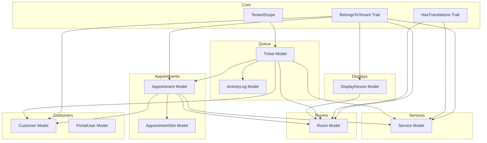
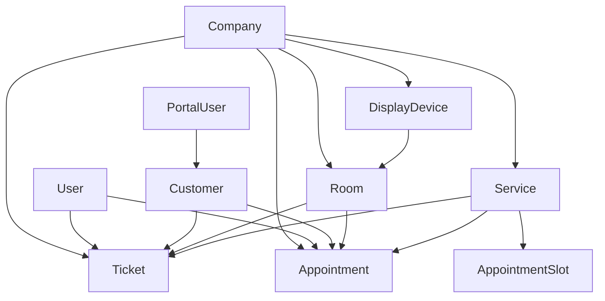
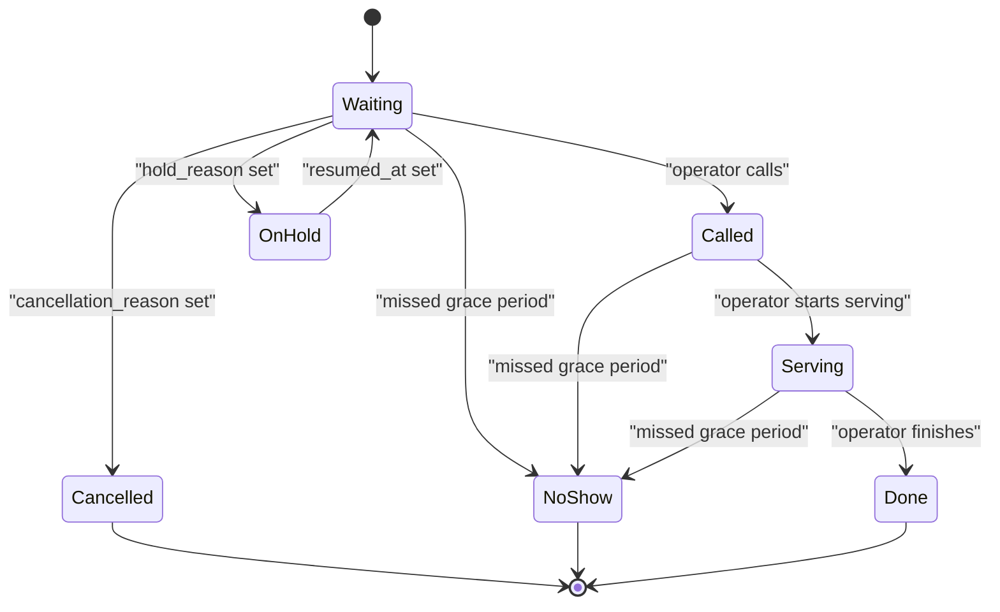
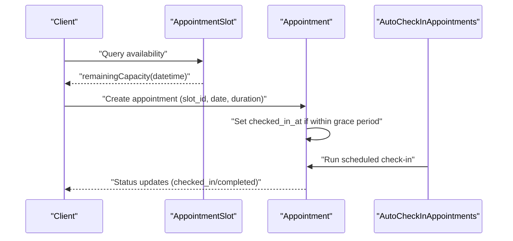
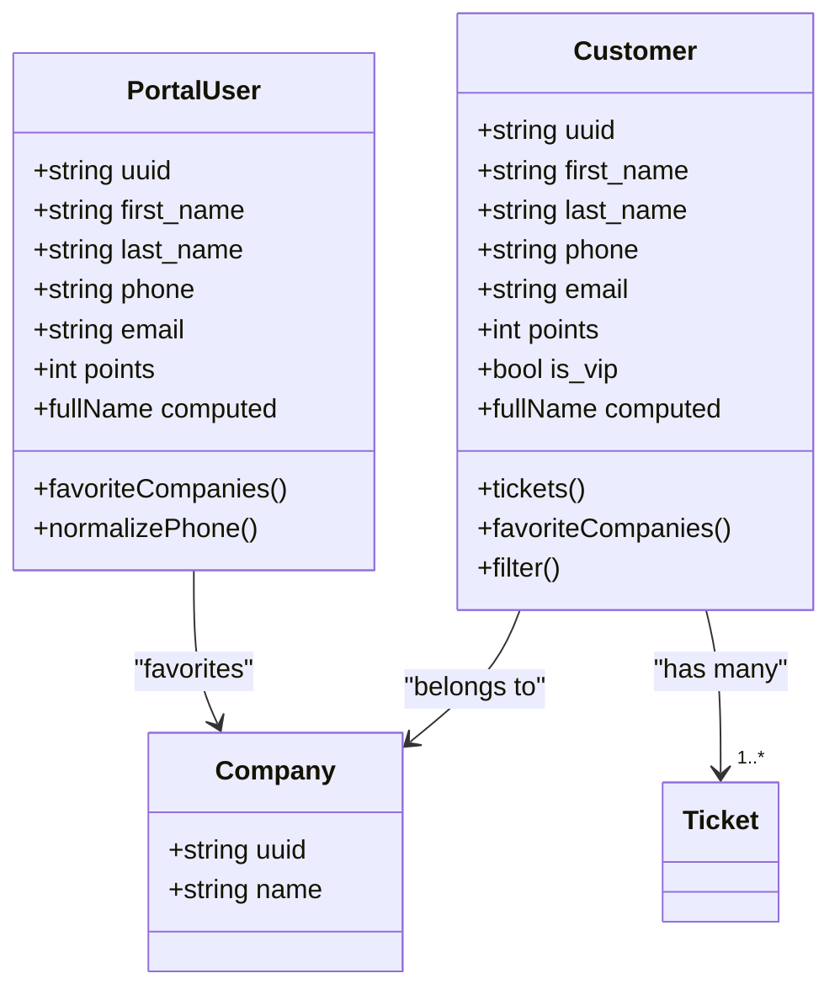
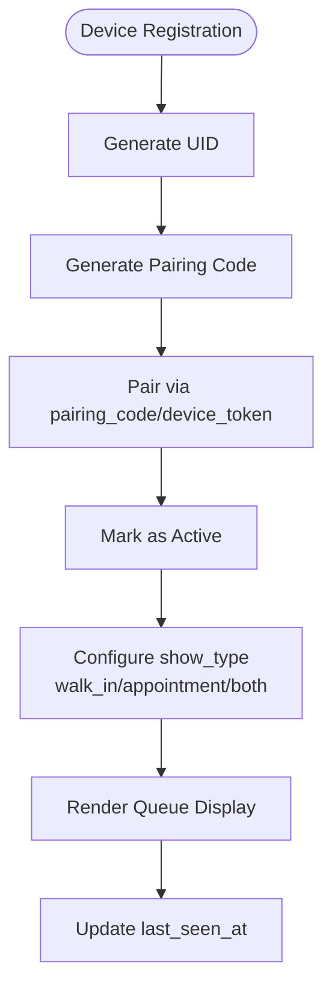
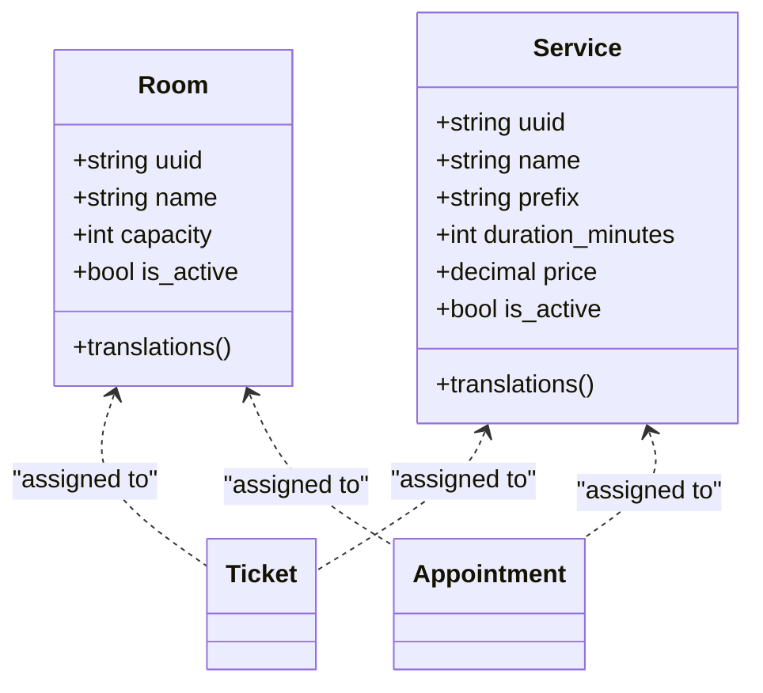
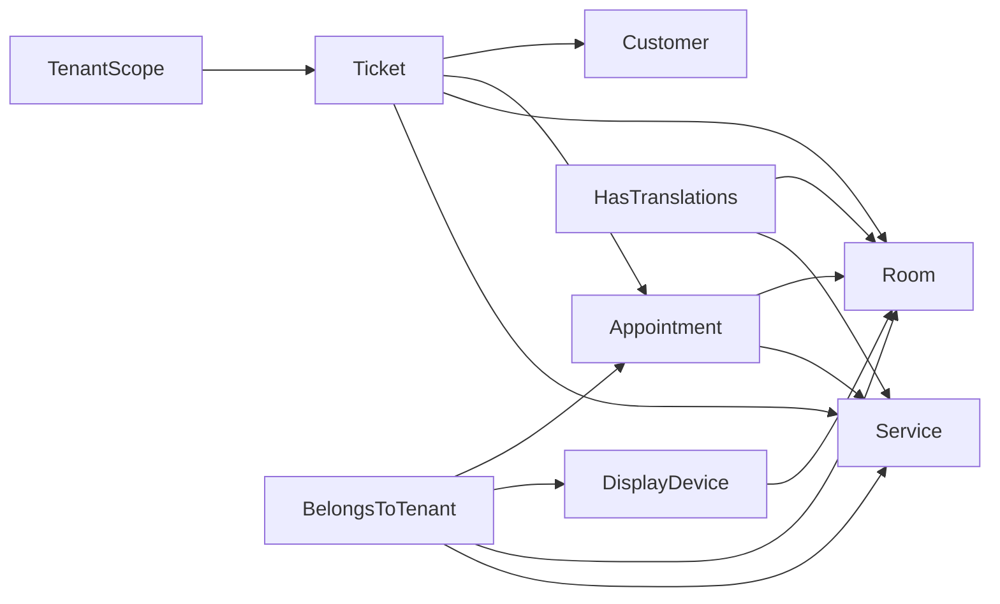

# Core Entities

<cite>
**Referenced Files in This Document**
- [Ticket.php](file://app/Modules/Queue/Models/Ticket.php)
- [Appointment.php](file://app/Modules/Appointments/Models/Appointment.php)
- [AppointmentSlot.php](file://app/Modules/Appointments/Models/AppointmentSlot.php)
- [Customer.php](file://app/Modules/Customers/Models/Customer.php)
- [PortalUser.php](file://app/Modules/Customers/Models/PortalUser.php)
- [DisplayDevice.php](file://app/Modules/Displays/Models/DisplayDevice.php)
- [Room.php](file://app/Modules/Rooms/Models/Room.php)
- [Service.php](file://app/Modules/Services/Models/Service.php)
- [TenantScope.php](file://app/Modules/Core/Scopes/TenantScope.php)
- [BelongsToTenant.php](file://app/Modules/Core/Traits/BelongsToTenant.php)
- [HasTranslations.php](file://app/Modules/Core/Traits/HasTranslations.php)
- [AutoCheckInAppointments.php](file://app/Console/Commands/AutoCheckInAppointments.php)
- [ActivityLog.php](file://app/Modules/Queue/Models/ActivityLog.php)
- [companies_table.php](file://database/migrations/0000_01_01_000000_create_companies_table.php)
- [users_table.php](file://database/migrations/0000_01_01_000001_create_users_table.php)
- [services_table.php](file://database/migrations/2024_01_02_000001_create_services_table.php)
- [rooms_table.php](file://database/migrations/2024_01_02_000002_create_rooms_table.php)
- [tickets_table.php](file://database/migrations/2026_04_16_150001_create_activity_logs_table.php)
- [activity_logs_table.php](file://database/migrations/2026_04_16_150001_create_activity_logs_table.php)
- [customers_table.php](file://database/migrations/2026_04_06_163000_create_customers_table.php)
- [portal_users_table.php](file://database/migrations/2026_05_08_144412_create_portal_users_table.php)
- [display_devices_table.php](file://database/migrations/2026_04_08_125059_create_display_devices_table.php)
- [appointments_table.php](file://database/migrations/2023_01_03_000001_create_appointments_table.php)
- [appointment_slots_table.php](file://database/migrations/2023_01_03_000002_create_appointment_slots_table.php)
- [tickets_table.php](file://database/migrations/2026_04_06_154325_create_tickets_table.php)
- [ticket_statuses.php](file://database/migrations/2026_04_16_150000_rename_ticket_statuses.php)
- [hold_cancelled_status.php](file://database/migrations/2026_06_05_070939_add_hold_cancelled_status_to_tickets_status_enum.php)
- [hold_fields.php](file://database/migrations/2026_06_04_080000_add_hold_fields_to_tickets_table.php)
- [cancellation_fields.php](file://database/migrations/2026_06_09_071909_add_cancellation_fields_to_tickets_table.php)
- [loyalty_points.php](file://database/migrations/2026_05_08_113632_add_loyalty_points_to_customers_table.php)
- [enhance_tracking_portal.php](file://database/migrations/2026_05_08_112914_enhance_tracking_and_portal.php)
</cite>

## Table of Contents
1. [Introduction](#introduction)
2. [Project Structure](#project-structure)
3. [Core Components](#core-components)
4. [Architecture Overview](#architecture-overview)
5. [Detailed Component Analysis](#detailed-component-analysis)
6. [Dependency Analysis](#dependency-analysis)
7. [Performance Considerations](#performance-considerations)
8. [Troubleshooting Guide](#troubleshooting-guide)
9. [Conclusion](#conclusion)

## Introduction
This document provides comprehensive data model documentation for Noubtigo's core business entities. It covers the Ticket model for queue management, Appointment and AppointmentSlot models for scheduling, Customer and PortalUser models for CRM and portal access, DisplayDevice for real-time queue display integration, Room and Service models for service management and room allocation, and explains how these entities interact within the multi-tenant architecture. Each entity includes field definitions, data types, constraints, business rules, and relationship diagrams.

## Project Structure
The core models are organized by domain modules under app/Modules. Each module encapsulates related models, controllers, and services. Multi-tenancy is enforced via tenant traits and global scopes, while translations are supported through dedicated traits. The database schema is defined in migrations under database/migrations.

**Diagram sources**
- [Ticket.php:12-257](file://app/Modules/Queue/Models/Ticket.php#L12-L257)
- [Appointment.php:10-183](file://app/Modules/Appointments/Models/Appointment.php#L10-L183)
- [AppointmentSlot.php:9-111](file://app/Modules/Appointments/Models/AppointmentSlot.php#L9-L111)
- [Customer.php:12-171](file://app/Modules/Customers/Models/Customer.php#L12-L171)
- [PortalUser.php:10-69](file://app/Modules/Customers/Models/PortalUser.php#L10-L69)
- [DisplayDevice.php:11-79](file://app/Modules/Displays/Models/DisplayDevice.php#L11-L79)
- [Room.php:11-58](file://app/Modules/Rooms/Models/Room.php#L11-L58)
- [Service.php:11-61](file://app/Modules/Services/Models/Service.php#L11-L61)
- [TenantScope.php](file://app/Modules/Core/Scopes/TenantScope.php)
- [BelongsToTenant.php](file://app/Modules/Core/Traits/BelongsToTenant.php)
- [HasTranslations.php](file://app/Modules/Core/Traits/HasTranslations.php)

**Section sources**
- [Ticket.php:12-257](file://app/Modules/Queue/Models/Ticket.php#L12-L257)
- [Appointment.php:10-183](file://app/Modules/Appointments/Models/Appointment.php#L10-L183)
- [AppointmentSlot.php:9-111](file://app/Modules/Appointments/Models/AppointmentSlot.php#L9-L111)
- [Customer.php:12-171](file://app/Modules/Customers/Models/Customer.php#L12-L171)
- [PortalUser.php:10-69](file://app/Modules/Customers/Models/PortalUser.php#L10-L69)
- [DisplayDevice.php:11-79](file://app/Modules/Displays/Models/DisplayDevice.php#L11-L79)
- [Room.php:11-58](file://app/Modules/Rooms/Models/Room.php#L11-L58)
- [Service.php:11-61](file://app/Modules/Services/Models/Service.php#L11-L61)

## Core Components
This section documents each core entity with its fields, data types, constraints, and business rules.

### Ticket
- Purpose: Queue management with status transitions, hold/cancel functionality, and customer association.
- Multi-tenancy: Enforced via TenantScope; belongs to Company.
- UUID routing: Route model binding supports UUID or ID.
- Auto-generated fields: uuid, ticket_number, position, waited_since.
- Status lifecycle: waiting → called → serving → done; with on_hold, cancelled, no_show variants.
- Hold/cancel fields: hold_reason, hold_note, hold_at/hold_by, resumed_at/resumed_by; cancellation_reason, cancellation_note, cancelled_at/cancelled_by.
- Relationships:
  - company: belongs to Company
  - service: belongs to Service
  - room: belongs to Room
  - operator: belongs to User
  - customer: belongs to Customer
  - appointment: belongs to Appointment
  - activityLogs: related ActivityLog entries
- Scopes: on_hold, waiting, active, queue, history.

**Section sources**
- [Ticket.php:16-105](file://app/Modules/Queue/Models/Ticket.php#L16-L105)
- [Ticket.php:108-185](file://app/Modules/Queue/Models/Ticket.php#L108-L185)
- [Ticket.php:187-228](file://app/Modules/Queue/Models/Ticket.php#L187-L228)
- [Ticket.php:232-256](file://app/Modules/Queue/Models/Ticket.php#L232-L256)
- [TenantScope.php](file://app/Modules/Core/Scopes/TenantScope.php)
- [BelongsToTenant.php](file://app/Modules/Core/Traits/BelongsToTenant.php)

### Appointment
- Purpose: Scheduling with auto-check-in and grace period logic.
- Multi-tenancy: Belongs to Company via BelongsToTenant trait.
- UUID routing: Route model binding supports UUID or ID.
- Fields: appointment_date (datetime), duration_minutes (integer), checked_in_at (datetime), grace_until (datetime), is_overbooked (boolean), notes, customer_* contact fields.
- Statuses: confirmed, pending, checked_in, completed, cancelled, no_show.
- Helpers: isCheckedIn(), isInGracePeriod(), isNoShow(), graceRemainingSeconds().
- Scopes: today (converted to user's local timezone), upcoming, byService(), byStatus().
- Relationships: service, room, staff (User), slot (AppointmentSlot), customer.

**Section sources**
- [Appointment.php:14-50](file://app/Modules/Appointments/Models/Appointment.php#L14-L50)
- [Appointment.php:52-77](file://app/Modules/Appointments/Models/Appointment.php#L52-L77)
- [Appointment.php:100-119](file://app/Modules/Appointments/Models/Appointment.php#L100-L119)
- [Appointment.php:127-151](file://app/Modules/Appointments/Models/Appointment.php#L127-L151)
- [BelongsToTenant.php](file://app/Modules/Core/Traits/BelongsToTenant.php)

### AppointmentSlot
- Purpose: Availability management per service and day-of-week.
- Fields: day_of_week (integer), start_time, end_time, interval_minutes (integer), capacity (integer), overbooking_limit (integer), grace_minutes (integer), is_active (boolean).
- Helpers: bookedCount(), totalCapacity(), remainingCapacity(), isFull(), isOverbooking().
- Relationships: service, appointments.

**Section sources**
- [AppointmentSlot.php:13-32](file://app/Modules/Appointments/Models/AppointmentSlot.php#L13-L32)
- [AppointmentSlot.php:61-108](file://app/Modules/Appointments/Models/AppointmentSlot.php#L61-L108)

### Customer
- Purpose: CRM with portal access and loyalty points.
- Multi-tenancy: Belongs to Company via BelongsToTenant trait.
- Phone normalization: normalizePhone() and mutator ensure consistent international format.
- Fields: identifier, cin, file_number, plate_number, phone, email, password (hidden), avatar, is_vip (boolean), last_* timestamps, locale, points (integer).
- Attributes: full_name computed attribute.
- Relationships: tickets (hasMany), favoriteCompanies (belongsToMany).
- Scopes: filter() supporting search across multiple attributes, VIP flag, service, and status filters.
- UUID routing: Route model binding supports UUID or ID.

**Section sources**
- [Customer.php:19-45](file://app/Modules/Customers/Models/Customer.php#L19-L45)
- [Customer.php:47-74](file://app/Modules/Customers/Models/Customer.php#L47-L74)
- [Customer.php:83-106](file://app/Modules/Customers/Models/Customer.php#L83-L106)
- [Customer.php:119-150](file://app/Modules/Customers/Models/Customer.php#L119-L150)
- [Customer.php:154-169](file://app/Modules/Customers/Models/Customer.php#L154-L169)
- [BelongsToTenant.php](file://app/Modules/Core/Traits/BelongsToTenant.php)

### PortalUser
- Purpose: Separate portal login identity for customers with favorites and points.
- Fields: first_name, last_name, email, phone, password (hidden), avatar, points (integer), locale.
- Phone normalization: reuses Customer.normalizePhone().
- Relationships: favoriteCompanies (belongsToMany via pivot tables).

**Section sources**
- [PortalUser.php:16-35](file://app/Modules/Customers/Models/PortalUser.php#L16-L35)
- [PortalUser.php:40-51](file://app/Modules/Customers/Models/PortalUser.php#L40-L51)
- [PortalUser.php:64-67](file://app/Modules/Customers/Models/PortalUser.php#L64-L67)

### DisplayDevice
- Purpose: Real-time queue display integration with pairing and visibility controls.
- Multi-tenancy: Belongs to Company via BelongsToTenant trait.
- Fields: name, show_type ('both', 'walk_in', 'appointment'), uid (UUID), pairing_code, device_token, paired_at/datetime, is_active (boolean), last_seen_at/datetime.
- Helpers: isPaired() checks device_token and paired_at presence.

**Section sources**
- [DisplayDevice.php:19-36](file://app/Modules/Displays/Models/DisplayDevice.php#L19-L36)
- [DisplayDevice.php:45-53](file://app/Modules/Displays/Models/DisplayDevice.php#L45-L53)
- [DisplayDevice.php:74-77](file://app/Modules/Displays/Models/DisplayDevice.php#L74-L77)

### Room
- Purpose: Service location with capacity and translation support.
- Multi-tenancy: Belongs to Company via BelongsToTenant trait.
- Translations: Uses HasTranslations trait.
- Fields: name, slug, description, capacity (integer), is_active (boolean).
- UUID routing: Route model binding supports UUID or ID.

**Section sources**
- [Room.php:15-27](file://app/Modules/Rooms/Models/Room.php#L15-L27)
- [Room.php:29-37](file://app/Modules/Rooms/Models/Room.php#L29-L37)
- [Room.php:42-56](file://app/Modules/Rooms/Models/Room.php#L42-L56)
- [HasTranslations.php](file://app/Modules/Core/Traits/HasTranslations.php)

### Service
- Purpose: Service catalog with pricing, duration, and translation support.
- Multi-tenancy: Belongs to Company via BelongsToTenant trait.
- Translations: Uses HasTranslations trait.
- Fields: name, prefix, slug, description, price (decimal), duration_minutes (integer), is_active (boolean).
- UUID routing: Route model binding supports UUID or ID.

**Section sources**
- [Service.php:15-30](file://app/Modules/Services/Models/Service.php#L15-L30)
- [Service.php:32-40](file://app/Modules/Services/Models/Service.php#L32-L40)
- [Service.php:44-59](file://app/Modules/Services/Models/Service.php#L44-L59)
- [HasTranslations.php](file://app/Modules/Core/Traits/HasTranslations.php)

## Architecture Overview
Noubtigo follows a multi-tenant architecture where each model can belong to a Company. Tenant enforcement is applied globally via TenantScope for Queue models and via BelongsToTenant trait for other domain models. Translatable fields are supported through HasTranslations. The queue and appointments subsystems integrate with CRM (Customer), room allocation (Room), and service catalogs (Service). Display devices render queue/appointment data filtered by show_type.

**Diagram sources**
- [Ticket.php:108-174](file://app/Modules/Queue/Models/Ticket.php#L108-L174)
- [Appointment.php:54-77](file://app/Modules/Appointments/Models/Appointment.php#L54-L77)
- [AppointmentSlot.php:56-64](file://app/Modules/Appointments/Models/AppointmentSlot.php#L56-L64)
- [Customer.php:103-114](file://app/Modules/Customers/Models/Customer.php#L103-L114)
- [PortalUser.php:64-67](file://app/Modules/Customers/Models/PortalUser.php#L64-L67)
- [DisplayDevice.php:58-69](file://app/Modules/Displays/Models/DisplayDevice.php#L58-L69)
- [Room.php:11-58](file://app/Modules/Rooms/Models/Room.php#L11-L58)
- [Service.php:11-61](file://app/Modules/Services/Models/Service.php#L11-L61)

## Detailed Component Analysis

### Ticket Model Analysis
- Status transitions:
  - Initial: waiting
  - Active: called → serving → done
  - Hold: waiting → on_hold → resumed to waiting; on_hold may lead to cancellation
  - Terminal: cancelled, no_show
- Hold/cancel logic:
  - Hold fields capture reason, note, timestamp, and actor
  - Cancel fields capture reason, note, timestamp, and actor
- Positioning and weighting:
  - Position auto-incremented per company for waiting tickets
  - Weight = position - priority_score for queue ordering
- Auto-numbering:
  - Prefix derived from service prefix or first letter of service name
  - Sequence per service and company per day

**Diagram sources**
- [Ticket.php:59-104](file://app/Modules/Queue/Models/Ticket.php#L59-L104)
- [Ticket.php:192-227](file://app/Modules/Queue/Models/Ticket.php#L192-L227)
- [Ticket.php:232-236](file://app/Modules/Queue/Models/Ticket.php#L232-L236)

**Section sources**
- [Ticket.php:59-104](file://app/Modules/Queue/Models/Ticket.php#L59-L104)
- [Ticket.php:192-227](file://app/Modules/Queue/Models/Ticket.php#L192-L227)
- [Ticket.php:232-236](file://app/Modules/Queue/Models/Ticket.php#L232-L236)
- [hold_fields.php](file://database/migrations/2026_06_04_080000_add_hold_fields_to_tickets_table.php)
- [cancellation_fields.php](file://database/migrations/2026_06_09_071909_add_cancellation_fields_to_tickets_table.php)
- [ticket_statuses.php](file://database/migrations/2026_04_16_150000_rename_ticket_statuses.php)
- [hold_cancelled_status.php](file://database/migrations/2026_06_05_070939_add_hold_cancelled_status_to_tickets_status_enum.php)

### Appointment and AppointmentSlot Analysis
- Scheduling logic:
  - AppointmentSlot defines recurring availability by day_of_week with start_time/end_time and interval_minutes
  - Capacity and overbooking_limit define total and bookable limits
  - Appointment associates a slot, service, room, and customer
- Availability management:
  - bookedCount() counts confirmed/pending/checked_in appointments at a specific datetime
  - remainingCapacity() enforces capacity and overbooking
- Auto-check-in:
  - isCheckedIn() tracks manual check-in
  - isInGracePeriod() and graceRemainingSeconds() manage late/no-show policies
  - AutoCheckInAppointments command can automate check-in based on schedules

**Diagram sources**
- [AppointmentSlot.php:71-108](file://app/Modules/Appointments/Models/AppointmentSlot.php#L71-L108)
- [Appointment.php:100-119](file://app/Modules/Appointments/Models/Appointment.php#L100-L119)
- [AutoCheckInAppointments.php](file://app/Console/Commands/AutoCheckInAppointments.php)

**Section sources**
- [AppointmentSlot.php:68-108](file://app/Modules/Appointments/Models/AppointmentSlot.php#L68-L108)
- [Appointment.php:100-119](file://app/Modules/Appointments/Models/Appointment.php#L100-L119)
- [AutoCheckInAppointments.php](file://app/Console/Commands/AutoCheckInAppointments.php)

### Customer and PortalUser Analysis
- CRM functionality:
  - Searchable attributes across personal and identification fields
  - VIP flag and service/status filtering
  - Tickets association for historical tracking
- Loyalty points:
  - points integer field for both Customer and PortalUser
- Portal access:
  - PortalUser enables separate login with normalized phone and locale support
  - Favorites linkage to Company via pivot tables

**Diagram sources**
- [Customer.php:47-106](file://app/Modules/Customers/Models/Customer.php#L47-L106)
- [Customer.php:119-150](file://app/Modules/Customers/Models/Customer.php#L119-L150)
- [PortalUser.php:16-67](file://app/Modules/Customers/Models/PortalUser.php#L16-L67)

**Section sources**
- [Customer.php:47-106](file://app/Modules/Customers/Models/Customer.php#L47-L106)
- [Customer.php:119-150](file://app/Modules/Customers/Models/Customer.php#L119-L150)
- [PortalUser.php:16-67](file://app/Modules/Customers/Models/PortalUser.php#L16-L67)
- [loyalty_points.php](file://database/migrations/2026_05_08_113632_add_loyalty_points_to_customers_table.php)
- [enhance_tracking_portal.php](file://database/migrations/2026_05_08_112914_enhance_tracking_and_portal.php)

### DisplayDevice Integration
- Pairing and activation:
  - UID and pairing_code generated automatically during creation
  - isPaired() checks device_token and paired_at
- Visibility control:
  - show_type determines whether to display walk-in, appointment, or both queues
- Room assignment:
  - Associates a Room for localized display

**Diagram sources**
- [DisplayDevice.php:45-53](file://app/Modules/Displays/Models/DisplayDevice.php#L45-L53)
- [DisplayDevice.php:74-77](file://app/Modules/Displays/Models/DisplayDevice.php#L74-L77)

**Section sources**
- [DisplayDevice.php:45-53](file://app/Modules/Displays/Models/DisplayDevice.php#L45-L53)
- [DisplayDevice.php:74-77](file://app/Modules/Displays/Models/DisplayDevice.php#L74-L77)

### Room and Service Management
- Room:
  - Capacity and activity flags for physical constraints
  - Translations for multilingual environments
- Service:
  - Pricing, duration, and activity flags
  - Prefix for ticket numbering and display

**Diagram sources**
- [Room.php:15-27](file://app/Modules/Rooms/Models/Room.php#L15-L27)
- [Service.php:15-30](file://app/Modules/Services/Models/Service.php#L15-L30)

**Section sources**
- [Room.php:15-27](file://app/Modules/Rooms/Models/Room.php#L15-L27)
- [Service.php:15-30](file://app/Modules/Services/Models/Service.php#L15-L30)

## Dependency Analysis
- Tenant enforcement:
  - TenantScope applies company filtering for queue-related models
  - BelongsToTenant trait ensures other models belong to the current tenant
- Translations:
  - HasTranslations trait enables localized names and descriptions for Room and Service
- Cross-module relationships:
  - Ticket depends on Customer, Appointment, Room, Service
  - Appointment depends on Slot, Room, Service, Customer
  - DisplayDevice depends on Room and Company

**Diagram sources**
- [TenantScope.php](file://app/Modules/Core/Scopes/TenantScope.php)
- [BelongsToTenant.php](file://app/Modules/Core/Traits/BelongsToTenant.php)
- [HasTranslations.php](file://app/Modules/Core/Traits/HasTranslations.php)
- [Ticket.php:108-174](file://app/Modules/Queue/Models/Ticket.php#L108-L174)
- [Appointment.php:54-77](file://app/Modules/Appointments/Models/Appointment.php#L54-L77)
- [DisplayDevice.php:58-69](file://app/Modules/Displays/Models/DisplayDevice.php#L58-L69)

**Section sources**
- [TenantScope.php](file://app/Modules/Core/Scopes/TenantScope.php)
- [BelongsToTenant.php](file://app/Modules/Core/Traits/BelongsToTenant.php)
- [HasTranslations.php](file://app/Modules/Core/Traits/HasTranslations.php)

## Performance Considerations
- Indexing recommendations:
  - Add indexes on company_id, service_id, room_id, customer_id, user_id for frequent joins
  - Index appointment_date, status, and uuid for fast lookups
  - Index ticket_number, position, and status for queue rendering
- Caching:
  - Cache frequently accessed service and room metadata
  - Cache display device configurations per room
- Timezone handling:
  - Convert local time boundaries to UTC for appointment queries to leverage indexes
- Soft deletes:
  - Use soft deletes to avoid costly cascading deletions; ensure appropriate indexing on deleted_at

## Troubleshooting Guide
- Ticket status anomalies:
  - Verify hold/resume/cancel fields are populated correctly when transitioning to on_hold or cancelled
  - Ensure position increments per company and status conditions are met
- Appointment conflicts:
  - Check remainingCapacity() before booking; handle overbooking_limit appropriately
  - Validate grace period logic around appointment_date
- Phone normalization:
  - Confirm phone numbers are normalized consistently across Customer and PortalUser
- Display device pairing:
  - Ensure pairing_code and device_token are set; verify isPaired() logic

**Section sources**
- [Ticket.php:192-236](file://app/Modules/Queue/Models/Ticket.php#L192-L236)
- [AppointmentSlot.php:87-108](file://app/Modules/Appointments/Models/AppointmentSlot.php#L87-L108)
- [Customer.php:19-45](file://app/Modules/Customers/Models/Customer.php#L19-L45)
- [PortalUser.php:40-51](file://app/Modules/Customers/Models/PortalUser.php#L40-L51)
- [DisplayDevice.php:74-77](file://app/Modules/Displays/Models/DisplayDevice.php#L74-L77)

## Conclusion
Noubtigo’s core entities form a cohesive multi-tenant system for queue management, appointments, CRM, and real-time display. The Ticket model orchestrates queue operations with robust status transitions and hold/cancel mechanisms. Appointment and AppointmentSlot models provide flexible scheduling with capacity management and auto-check-in capabilities. Customer and PortalUser models support CRM and portal experiences with loyalty points and normalized contact data. DisplayDevice integrates with rooms to present relevant queues. Room and Service models enable structured service delivery with localization. Together, these models establish a scalable foundation for multi-tenant operations.