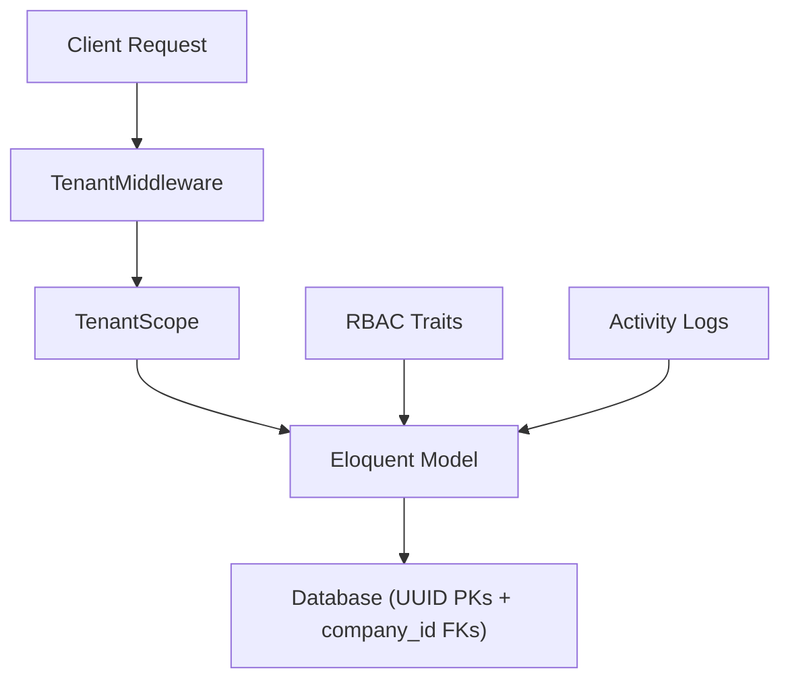
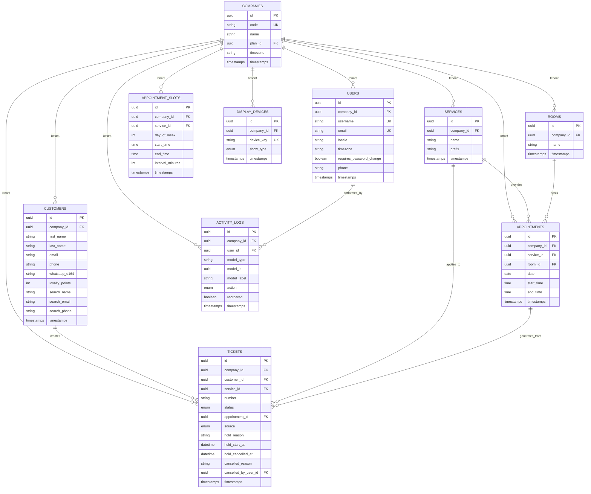
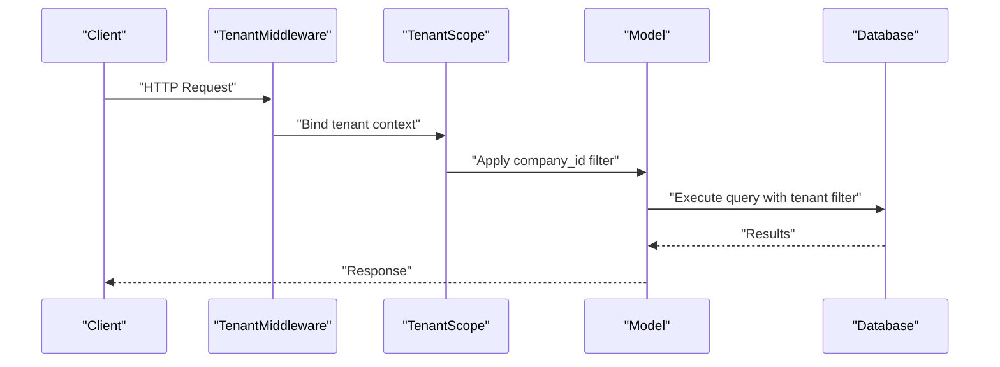
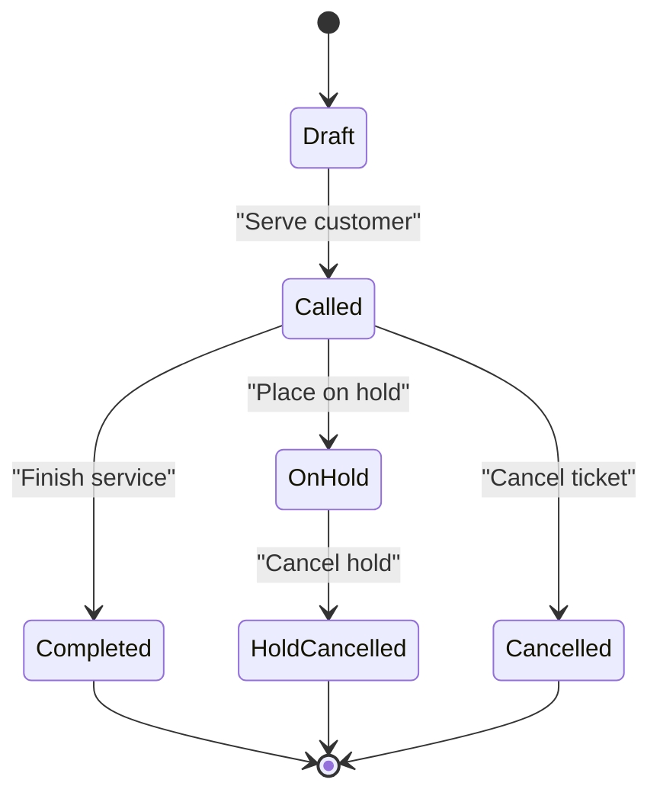
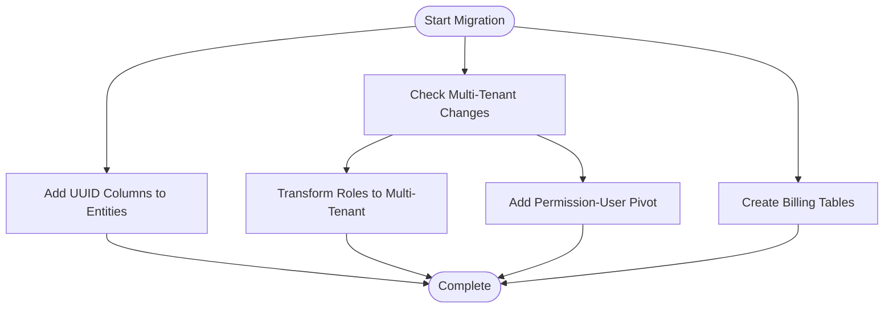
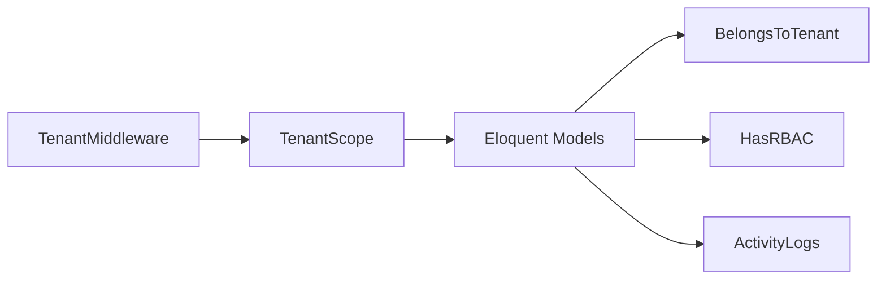

# Data Models & Database Schema

<cite>
**Referenced Files in This Document**
- [0000_01_01_000000_create_companies_table.php](file://database/migrations/0000_01_01_000000_create_companies_table.php)
- [2026_05_21_120000_add_uuid_to_companies_table.php](file://database/migrations/2026_05_21_120000_add_uuid_to_companies_table.php)
- [0001_01_01_000000_create_users_table.php](file://database/migrations/0001_01_01_000000_create_users_table.php)
- [2026_05_21_120001_add_uuid_to_users_table.php](file://database/migrations/2026_05_21_120001_add_uuid_to_users_table.php)
- [2026_04_06_124808_add_locale_to_users_table.php](file://database/migrations/2026_04_06_124808_add_locale_to_users_table.php)
- [2026_04_09_140000_add_timezone_to_users_table.php](file://database/migrations/2026_04_09_140000_add_timezone_to_users_table.php)
- [2026_04_06_163000_create_customers_table.php](file://database/migrations/2026_04_06_163000_create_customers_table.php)
- [2026_05_21_120002_add_uuid_to_customers_table.php](file://database/migrations/2026_05_21_120002_add_uuid_to_customers_table.php)
- [2026_04_06_163100_update_tickets_add_customer_id.php](file://database/migrations/2026_04_06_163100_update_tickets_add_customer_id.php)
- [2026_05_18_104849_make_service_id_nullable_on_tickets_table.php](file://database/migrations/2026_05_18_104849_make_service_id_nullable_on_tickets_table.php)
- [2026_04_06_154325_create_tickets_table.php](file://database/migrations/2026_04_06_154325_create_tickets_table.php)
- [2026_05_21_120007_add_uuid_to_tickets_table.php](file://database/migrations/2026_05_21_120007_add_uuid_to_tickets_table.php)
- [2026_04_06_200001_create_appointment_slots_table.php](file://database/migrations/2026_04_06_200001_create_appointment_slots_table.php)
- [2026_04_06_200002_add_advanced_columns_to_appointments_table.php](file://database/migrations/2026_04_06_200002_add_advanced_columns_to_appointments_table.php)
- [2026_04_08_090547_add_appointment_id_and_source_to_tickets_table.php](file://database/migrations/2026_04_08_090547_add_appointment_id_and_source_to_tickets_table.php)
- [2026_04_03_000001_create_appointments_table.php](file://database/migrations/2026_04_03_000001_create_appointments_table.php)
- [2026_04_08_125059_create_display_devices_table.php](file://database/migrations/2026_04_08_125059_create_display_devices_table.php)
- [2026_04_10_133352_add_show_type_to_display_devices_table.php](file://database/migrations/2026_04_10_133352_add_show_type_to_display_devices_table.php)
- [2026_04_10_173000_transform_roles_to_multi_tenant.php](file://database/migrations/2026_04_10_173000_transform_roles_to_multi_tenant.php)
- [2026_04_16_150000_rename_ticket_statuses.php](file://database/migrations/2026_04_16_150000_rename_ticket_statuses.php)
- [2026_04_16_150001_create_activity_logs_table.php](file://database/migrations/2026_04_16_150001_create_activity_logs_table.php)
- [2026_04_16_175057_add_model_label_to_activity_logs_table.php](file://database/migrations/2026_04_16_175057_add_model_label_to_activity_logs_table.php)
- [2026_04_17_160132_add_reordered_to_activity_logs_action.php](file://database/migrations/2026_04_17_160132_add_reordered_to_activity_logs_action.php)
- [2026_04_06_135154_create_rbac_tables.php](file://database/migrations/2026_04_06_135154_create_rbac_tables.php)
- [2026_04_06_142058_upgrade_users_and_rbac_for_system_admin.php](file://database/migrations/2026_04_06_142058_upgrade_users_and_rbac_for_system_admin.php)
- [2026_04_06_115250_create_permission_tables.php](file://database/migrations/2026_04_06_115250_create_permission_tables.php)
- [2026_04_06_124809_create_languages_table.php](file://database/migrations/2026_04_06_124809_create_languages_table.php)
- [2026_04_06_124810_create_translations_table.php](file://database/migrations/2026_04_06_124810_create_translations_table.php)
- [2026_04_06_135100_modify_users_table_split_name.php](file://database/migrations/2026_04_06_135100_modify_users_table_split_name.php)
- [2026_04_06_154141_add_prefix_to_services_table.php](file://database/migrations/2026_04_06_154141_add_prefix_to_services_table.php)
- [2026_04_02_000001_create_services_table.php](file://database/migrations/2026_04_02_000001_create_services_table.php)
- [2026_04_02_000002_create_rooms_table.php](file://database/migrations/2026_04_02_000002_create_rooms_table.php)
- [2026_04_02_000003_create_queues_table.php](file://database/migrations/2026_04_02_000003_create_queues_table.php)
- [2026_04_08_170708_add_timezone_to_companies_table.php](file://database/migrations/2026_04_08_170708_add_timezone_to_companies_table.php)
- [2026_04_13_000001_add_code_to_companies_table.php](file://database/migrations/2026_04_13_000001_add_code_to_companies_table.php)
- [2026_04_13_000002_add_whatsapp_fields_to_customers_table.php](file://database/migrations/2026_04_13_000002_add_whatsapp_fields_to_customers_table.php)
- [2026_04_13_000003_create_messages_table.php](file://database/migrations/2026_04_13_000003_create_messages_table.php)
- [2026_04_13_175428_create_plans_table.php](file://database/migrations/2026_04_13_175428_create_plans_table.php)
- [2026_04_13_175436_add_plan_id_to_companies_table.php](file://database/migrations/2026_04_13_175436_add_plan_id_to_companies_table.php)
- [2026_04_14_094043_create_plan_permission_table.php](file://database/migrations/2026_04_14_094043_create_plan_permission_table.php)
- [2026_05_22_081618_add_annual_price_to_plans_table.php](file://database/migrations/2026_05_22_081618_add_annual_price_to_plans_table.php)
- [2026_05_22_081649_create_subscriptions_table.php](file://database/migrations/2026_05_22_081649_create_subscriptions_table.php)
- [2026_05_22_081718_create_payments_table.php](file://database/migrations/2026_05_22_081718_create_payments_table.php)
- [2026_05_22_081729_create_payment_transactions_table.php](file://database/migrations/2026_05_22_081729_create_payment_transactions_table.php)
- [2026_05_22_081731_create_invoices_table.php](file://database/migrations/2026_05_22_081731_create_invoices_table.php)
- [2026_05_22_081733_create_invoice_items_table.php](file://database/migrations/2026_05_22_081733_create_invoice_items_table.php)
- [2026_05_26_084144_add_receipt_path_to_payments_table.php](file://database/migrations/2026_05_26_084144_add_receipt_path_to_payments_table.php)
- [2026_05_29_102157_add_username_to_users_table.php](file://database/migrations/2026_05_29_102157_add_username_to_users_table.php)
- [2026_05_29_145548_add_requires_password_change_to_users_table.php](file://database/migrations/2026_05_29_145548_add_requires_password_change_to_users_table.php)
- [2026_05_30_181000_add_phone_to_users_table.php](file://database/migrations/2026_05_30_181000_add_phone_to_users_table.php)
- [2026_06_04_085017_add_hold_fields_to_tickets_table.php](file://database/migrations/2026_06_04_085017_add_hold_fields_to_tickets_table.php)
- [2026_06_04_091653_add_on_hold_status_to_tickets_status_enum.php](file://database/migrations/2026_06_04_091653_add_on_hold_status_to_tickets_status_enum.php)
- [2026_06_04_121954_rename_enterprise_plan_slug_to_premium.php](file://database/migrations/2026_06_04_121954_rename_enterprise_plan_slug_to_premium.php)
- [2026_06_04_122255_rename_pro_plan_slug_to_professional.php](file://database/migrations/2026_06_04_122255_rename_pro_plan_slug_to_professional.php)
- [2026_06_05_070939_add_hold_cancelled_status_to_tickets_status_enum.php](file://database/migrations/2026_06_05_070939_add_hold_cancelled_status_to_tickets_status_enum.php)
- [2026_06_08_080000_add_search_fields_to_customers_table.php](file://database/migrations/2026_06_08_080000_add_search_fields_to_customers_table.php)
- [2026_06_09_071909_add_cancellation_fields_to_tickets_table.php](file://database/migrations/2026_06_09_071909_add_cancellation_fields_to_tickets_table.php)
- [TenantScope.php](file://app/Modules/Core/Scopes/TenantScope.php)
- [BelongsToTenant.php](file://app/Modules/Core/Traits/BelongsToTenant.php)
- [HasRBAC.php](file://app/Modules/Core/Traits/HasRBAC.php)
- [HasTranslations.php](file://app/Modules/Core/Traits/HasTranslations.php)
- [TenantMiddleware.php](file://app/Http/Middleware/TenantMiddleware.php)
- [Ticket.php](file://app/Modules/Queue/Models/Ticket.php)
- [Customer.php](file://app/Modules/Customers/Models/Customer.php)
- [Appointment.php](file://app/Modules/Appointments/Models/Appointment.php)
- [DisplayDevice.php](file://app/Modules/Displays/Models/DisplayDevice.php)
- [ActivityLog.php](file://app/Modules/Queue/Models/ActivityLog.php)
- [Company.php](file://app/Modules/Companies/Models/Company.php)
- [User.php](file://app/Models/User.php)
- [roles_to_multi_tenant.sql](file://database/sql/roles_to_multi_tenant.sql)
</cite>

## Table of Contents
1. [Introduction](#introduction)
2. [Project Structure](#project-structure)
3. [Core Components](#core-components)
4. [Architecture Overview](#architecture-overview)
5. [Detailed Component Analysis](#detailed-component-analysis)
6. [Dependency Analysis](#dependency-analysis)
7. [Performance Considerations](#performance-considerations)
8. [Troubleshooting Guide](#troubleshooting-guide)
9. [Conclusion](#conclusion)
10. [Appendices](#appendices)

## Introduction
This document describes the data models and database schema for Noubtigo, focusing on multi-tenant entities and their relationships. It covers Tickets, Appointments, Customers, DisplayDevices, Users, and supporting RBAC/audit tables. The document explains field definitions, data types, constraints, indexes, referential integrity, business rules, and lifecycle management (including soft-delete-like patterns and audit trails). It also documents the multi-tenant isolation strategy and how tenant scoping is applied across models.

## Project Structure
The schema is primarily defined by Laravel migration files under database/migrations. Multi-tenancy is enforced via traits and a global model scope, while middleware ensures requests are scoped to the current tenant. RBAC and localization tables support role-based permissions and multi-language content.

```mermaid
graph TB
subgraph "Migrations"
M1["create_companies_table.php"]
M2["create_users_table.php"]
M3["create_customers_table.php"]
M4["create_tickets_table.php"]
M5["create_appointments_table.php"]
M6["create_appointment_slots_table.php"]
M7["create_display_devices_table.php"]
M8["create_rbac_tables.php"]
M9["create_activity_logs_table.php"]
M10["create_languages_tables.php"]
M11["create_payments_tables.php"]
end
subgraph "Traits & Scope"
T1["BelongsToTenant.php"]
T2["TenantScope.php"]
T3["HasRBAC.php"]
T4["HasTranslations.php"]
end
subgraph "Middleware"
MW["TenantMiddleware.php"]
end
M1 --> T1
M2 --> T1
M3 --> T1
M4 --> T1
M5 --> T1
M7 --> T1
M8 --> T3
MW --> T2
```

**Diagram sources**
- [0000_01_01_000000_create_companies_table.php](file://database/migrations/0000_01_01_000000_create_companies_table.php)
- [0001_01_01_000000_create_users_table.php](file://database/migrations/0001_01_01_000000_create_users_table.php)
- [2026_04_06_163000_create_customers_table.php](file://database/migrations/2026_04_06_163000_create_customers_table.php)
- [2026_04_06_154325_create_tickets_table.php](file://database/migrations/2026_04_06_154325_create_tickets_table.php)
- [2026_04_03_000001_create_appointments_table.php](file://database/migrations/2026_04_03_000001_create_appointments_table.php)
- [2026_04_06_200001_create_appointment_slots_table.php](file://database/migrations/2026_04_06_200001_create_appointment_slots_table.php)
- [2026_04_08_125059_create_display_devices_table.php](file://database/migrations/2026_04_08_125059_create_display_devices_table.php)
- [2026_04_06_135154_create_rbac_tables.php](file://database/migrations/2026_04_06_135154_create_rbac_tables.php)
- [2026_04_16_150001_create_activity_logs_table.php](file://database/migrations/2026_04_16_150001_create_activity_logs_table.php)
- [2026_04_06_124809_create_languages_table.php](file://database/migrations/2026_04_06_124809_create_languages_table.php)
- [2026_05_22_081718_create_payments_table.php](file://database/migrations/2026_05_22_081718_create_payments_table.php)
- [BelongsToTenant.php](file://app/Modules/Core/Traits/BelongsToTenant.php)
- [TenantScope.php](file://app/Modules/Core/Scopes/TenantScope.php)
- [HasRBAC.php](file://app/Modules/Core/Traits/HasRBAC.php)
- [HasTranslations.php](file://app/Modules/Core/Traits/HasTranslations.php)
- [TenantMiddleware.php](file://app/Http/Middleware/TenantMiddleware.php)

**Section sources**
- [0000_01_01_000000_create_companies_table.php](file://database/migrations/0000_01_01_000000_create_companies_table.php)
- [0001_01_01_000000_create_users_table.php](file://database/migrations/0001_01_01_000000_create_users_table.php)
- [2026_04_06_163000_create_customers_table.php](file://database/migrations/2026_04_06_163000_create_customers_table.php)
- [2026_04_06_154325_create_tickets_table.php](file://database/migrations/2026_04_06_154325_create_tickets_table.php)
- [2026_04_03_000001_create_appointments_table.php](file://database/migrations/2026_04_03_000001_create_appointments_table.php)
- [2026_04_06_200001_create_appointment_slots_table.php](file://database/migrations/2026_04_06_200001_create_appointment_slots_table.php)
- [2026_04_08_125059_create_display_devices_table.php](file://database/migrations/2026_04_08_125059_create_display_devices_table.php)
- [2026_04_06_135154_create_rbac_tables.php](file://database/migrations/2026_04_06_135154_create_rbac_tables.php)
- [2026_04_16_150001_create_activity_logs_table.php](file://database/migrations/2026_04_16_150001_create_activity_logs_table.php)
- [2026_04_06_124809_create_languages_table.php](file://database/migrations/2026_04_06_124809_create_languages_table.php)
- [2026_05_22_081718_create_payments_table.php](file://database/migrations/2026_05_22_081718_create_payments_table.php)
- [BelongsToTenant.php](file://app/Modules/Core/Traits/BelongsToTenant.php)
- [TenantScope.php](file://app/Modules/Core/Scopes/TenantScope.php)
- [HasRBAC.php](file://app/Modules/Core/Traits/HasRBAC.php)
- [HasTranslations.php](file://app/Modules/Core/Traits/HasTranslations.php)
- [TenantMiddleware.php](file://app/Http/Middleware/TenantMiddleware.php)

## Core Components
This section outlines the primary entities and their core attributes, constraints, and indexes. All tables are multi-tenant-aware via UUID primary keys and tenant scoping.

- Companies
  - Purpose: Tenant container; stores tenant metadata and subscription plan association.
  - Key fields: id (UUID), name, code, timezone, plan_id, created_at, updated_at.
  - Constraints: Unique code; optional plan linkage; timezone stored per company.
  - Indexes: Primary key on id; unique on code; foreign key to plans.

- Users
  - Purpose: Application users within a tenant; supports RBAC and localization.
  - Key fields: id (UUID), company_id (FK), username, email, locale, timezone, requires_password_change, phone, created_at, updated_at.
  - Constraints: Unique username/email per tenant; locale/timezone per user; optional phone.
  - Indexes: Primary key on id; unique on username/email; foreign key to companies.

- Customers
  - Purpose: End-customers associated with a tenant; supports WhatsApp and search fields.
  - Key fields: id (UUID), company_id (FK), first_name, last_name, email, phone, whatsapp_e164, loyalty_points, search_name, search_email, search_phone, created_at, updated_at.
  - Constraints: Optional WhatsApp E164; searchable fields optimized for search; optional loyalty points.
  - Indexes: Primary key on id; foreign key to companies.

- Tickets
  - Purpose: Queue/service tickets linked to customers and optionally services/appointments.
  - Key fields: id (UUID), company_id (FK), customer_id (FK), service_id (nullable), number, status, appointment_id (nullable), source, hold_reason (nullable), hold_start_at (nullable), hold_cancelled_at (nullable), cancelled_reason (nullable), cancelled_by_user_id (nullable), created_at, updated_at.
  - Status enum evolution: includes draft, called, completed, cancelled variants and on-hold states.
  - Constraints: service_id nullable; appointment_id/source optional; hold/cancel fields optional; referential integrity to customers/services/appointments/companies/users.
  - Indexes: Primary key on id; foreign keys to company/customer/service/appointment/user.

- Appointments
  - Purpose: Scheduled appointment records; linked to slots and optionally tickets.
  - Key fields: id (UUID), company_id (FK), service_id (FK), room_id (FK), date, start_time, end_time, created_at, updated_at.
  - Constraints: Date/time range; links to service and room; optional ticket linkage via ticket.source.
  - Indexes: Primary key on id; foreign keys to companies/services/rooms.

- Appointment Slots
  - Purpose: Defines available time slots for scheduling.
  - Key fields: id (UUID), company_id (FK), service_id (FK), day_of_week, start_time, end_time, interval_minutes, created_at, updated_at.
  - Constraints: Repeating slot pattern by day; interval minutes define slot granularity.
  - Indexes: Primary key on id; foreign keys to companies/services.

- Display Devices
  - Purpose: Digital displays showing queue status; linked to company and optional show type.
  - Key fields: id (UUID), company_id (FK), device_key, show_type, created_at, updated_at.
  - Constraints: device_key unique per tenant; optional show_type.
  - Indexes: Primary key on id; unique on device_key; foreign key to companies.

- RBAC and Permissions
  - Roles, permissions, and pivot tables manage multi-tenant role assignments and permission grants.
  - Transform to multi-tenant: roles transformed to be tenant-scoped; permission_user pivots introduced.
  - Indexes: Primary keys; foreign keys to companies/users/roles/permissions.

- Activity Logs
  - Purpose: Audit trail for model changes; includes model label and action ordering.
  - Key fields: id (UUID), company_id (FK), user_id (FK), model_type, model_id, model_label, action, reordered (boolean), created_at.
  - Constraints: Links to company/user; model identity; action enumeration; reorder flag.
  - Indexes: Primary key on id; foreign keys to company/user; indexes on model_type/model_id.

- Languages and Translations
  - Purpose: Multi-language content support.
  - Key fields: languages (code, name); translations (language_code, key, value).
  - Indexes: Primary keys; foreign keys to languages.

- Payments, Subscriptions, Invoices, Transactions
  - Purpose: Billing lifecycle management.
  - Key fields: subscriptions (company_id, plan_id, status, cycle_start, cycle_end); payments (company_id, amount, receipt_path, created_at); invoices/invoice_items; payment_transactions (payment_id, amount, status).
  - Constraints: Amounts and statuses; receipt path; foreign keys to companies/subscriptions/payments.
  - Indexes: Primary keys; foreign keys to related entities.

**Section sources**
- [0000_01_01_000000_create_companies_table.php](file://database/migrations/0000_01_01_000000_create_companies_table.php)
- [2026_05_21_120000_add_uuid_to_companies_table.php](file://database/migrations/2026_05_21_120000_add_uuid_to_companies_table.php)
- [0001_01_01_000000_create_users_table.php](file://database/migrations/0001_01_01_000000_create_users_table.php)
- [2026_05_21_120001_add_uuid_to_users_table.php](file://database/migrations/2026_05_21_120001_add_uuid_to_users_table.php)
- [2026_04_06_163000_create_customers_table.php](file://database/migrations/2026_04_06_163000_create_customers_table.php)
- [2026_05_21_120002_add_uuid_to_customers_table.php](file://database/migrations/2026_05_21_120002_add_uuid_to_customers_table.php)
- [2026_04_06_154325_create_tickets_table.php](file://database/migrations/2026_04_06_154325_create_tickets_table.php)
- [2026_05_21_120007_add_uuid_to_tickets_table.php](file://database/migrations/2026_05_21_120007_add_uuid_to_tickets_table.php)
- [2026_04_03_000001_create_appointments_table.php](file://database/migrations/2026_04_03_000001_create_appointments_table.php)
- [2026_04_06_200001_create_appointment_slots_table.php](file://database/migrations/2026_04_06_200001_create_appointment_slots_table.php)
- [2026_04_08_125059_create_display_devices_table.php](file://database/migrations/2026_04_08_125059_create_display_devices_table.php)
- [2026_04_10_133352_add_show_type_to_display_devices_table.php](file://database/migrations/2026_04_10_133352_add_show_type_to_display_devices_table.php)
- [2026_04_10_173000_transform_roles_to_multi_tenant.php](file://database/migrations/2026_04_10_173000_transform_roles_to_multi_tenant.php)
- [2026_04_16_150001_create_activity_logs_table.php](file://database/migrations/2026_04_16_150001_create_activity_logs_table.php)
- [2026_04_16_175057_add_model_label_to_activity_logs_table.php](file://database/migrations/2026_04_16_175057_add_model_label_to_activity_logs_table.php)
- [2026_04_17_160132_add_reordered_to_activity_logs_action.php](file://database/migrations/2026_04_17_160132_add_reordered_to_activity_logs_action.php)
- [2026_04_06_135154_create_rbac_tables.php](file://database/migrations/2026_04_06_135154_create_rbac_tables.php)
- [2026_04_06_115250_create_permission_tables.php](file://database/migrations/2026_04_06_115250_create_permission_tables.php)
- [2026_04_06_124809_create_languages_table.php](file://database/migrations/2026_04_06_124809_create_languages_table.php)
- [2026_04_06_124810_create_translations_table.php](file://database/migrations/2026_04_06_124810_create_translations_table.php)
- [2026_05_22_081649_create_subscriptions_table.php](file://database/migrations/2026_05_22_081649_create_subscriptions_table.php)
- [2026_05_22_081718_create_payments_table.php](file://database/migrations/2026_05_22_081718_create_payments_table.php)
- [2026_05_22_081729_create_payment_transactions_table.php](file://database/migrations/2026_05_22_081729_create_payment_transactions_table.php)
- [2026_05_22_081731_create_invoices_table.php](file://database/migrations/2026_05_22_081731_create_invoices_table.php)
- [2026_05_22_081733_create_invoice_items_table.php](file://database/migrations/2026_05_22_081733_create_invoice_items_table.php)
- [2026_05_26_084144_add_receipt_path_to_payments_table.php](file://database/migrations/2026_05_26_084144_add_receipt_path_to_payments_table.php)

## Architecture Overview
Multi-tenancy is enforced at the database and application layers:
- Database: All entities use UUID primary keys and include company_id as a tenant discriminator.
- Application: A TenantMiddleware binds the current tenant to the request; a TenantScope applies company_id filters to queries; BelongsToTenant trait scopes model operations; HasRBAC trait integrates role-based access control.

**Diagram sources**
- [TenantMiddleware.php](file://app/Http/Middleware/TenantMiddleware.php)
- [TenantScope.php](file://app/Modules/Core/Scopes/TenantScope.php)
- [BelongsToTenant.php](file://app/Modules/Core/Traits/BelongsToTenant.php)
- [HasRBAC.php](file://app/Modules/Core/Traits/HasRBAC.php)
- [2026_04_16_150001_create_activity_logs_table.php](file://database/migrations/2026_04_16_150001_create_activity_logs_table.php)

**Section sources**
- [TenantMiddleware.php](file://app/Http/Middleware/TenantMiddleware.php)
- [TenantScope.php](file://app/Modules/Core/Scopes/TenantScope.php)
- [BelongsToTenant.php](file://app/Modules/Core/Traits/BelongsToTenant.php)
- [HasRBAC.php](file://app/Modules/Core/Traits/HasRBAC.php)
- [2026_04_16_150001_create_activity_logs_table.php](file://database/migrations/2026_04_16_150001_create_activity_logs_table.php)

## Detailed Component Analysis

### Entity Relationship Diagram
This ER diagram maps core entities and their relationships, highlighting primary and foreign keys and cardinalities.

**Diagram sources**
- [0000_01_01_000000_create_companies_table.php](file://database/migrations/0000_01_01_000000_create_companies_table.php)
- [0001_01_01_000000_create_users_table.php](file://database/migrations/0001_01_01_000000_create_users_table.php)
- [2026_04_06_163000_create_customers_table.php](file://database/migrations/2026_04_06_163000_create_customers_table.php)
- [2026_04_02_000001_create_services_table.php](file://database/migrations/2026_04_02_000001_create_services_table.php)
- [2026_04_02_000002_create_rooms_table.php](file://database/migrations/2026_04_02_000002_create_rooms_table.php)
- [2026_04_03_000001_create_appointments_table.php](file://database/migrations/2026_04_03_000001_create_appointments_table.php)
- [2026_04_06_200001_create_appointment_slots_table.php](file://database/migrations/2026_04_06_200001_create_appointment_slots_table.php)
- [2026_04_06_154325_create_tickets_table.php](file://database/migrations/2026_04_06_154325_create_tickets_table.php)
- [2026_04_08_125059_create_display_devices_table.php](file://database/migrations/2026_04_08_125059_create_display_devices_table.php)
- [2026_04_16_150001_create_activity_logs_table.php](file://database/migrations/2026_04_16_150001_create_activity_logs_table.php)

**Section sources**
- [0000_01_01_000000_create_companies_table.php](file://database/migrations/0000_01_01_000000_create_companies_table.php)
- [0001_01_01_000000_create_users_table.php](file://database/migrations/0001_01_01_000000_create_users_table.php)
- [2026_04_06_163000_create_customers_table.php](file://database/migrations/2026_04_06_163000_create_customers_table.php)
- [2026_04_02_000001_create_services_table.php](file://database/migrations/2026_04_02_000001_create_services_table.php)
- [2026_04_02_000002_create_rooms_table.php](file://database/migrations/2026_04_02_000002_create_rooms_table.php)
- [2026_04_03_000001_create_appointments_table.php](file://database/migrations/2026_04_03_000001_create_appointments_table.php)
- [2026_04_06_200001_create_appointment_slots_table.php](file://database/migrations/2026_04_06_200001_create_appointment_slots_table.php)
- [2026_04_06_154325_create_tickets_table.php](file://database/migrations/2026_04_06_154325_create_tickets_table.php)
- [2026_04_08_125059_create_display_devices_table.php](file://database/migrations/2026_04_08_125059_create_display_devices_table.php)
- [2026_04_16_150001_create_activity_logs_table.php](file://database/migrations/2026_04_16_150001_create_activity_logs_table.php)

### Multi-Tenant Data Isolation
- Tenant binding: TenantMiddleware sets the current tenant context for each request.
- Query scoping: TenantScope automatically adds company_id filters to Eloquent queries.
- Model trait: BelongsToTenant ensures models are saved and queried within the tenant boundary.
- RBAC multi-tenancy: Roles transformed to tenant-scoped; permission_user pivots enforce per-tenant assignments.

**Diagram sources**
- [TenantMiddleware.php](file://app/Http/Middleware/TenantMiddleware.php)
- [TenantScope.php](file://app/Modules/Core/Scopes/TenantScope.php)
- [BelongsToTenant.php](file://app/Modules/Core/Traits/BelongsToTenant.php)

**Section sources**
- [TenantMiddleware.php](file://app/Http/Middleware/TenantMiddleware.php)
- [TenantScope.php](file://app/Modules/Core/Scopes/TenantScope.php)
- [BelongsToTenant.php](file://app/Modules/Core/Traits/BelongsToTenant.php)
- [2026_04_10_173000_transform_roles_to_multi_tenant.php](file://database/migrations/2026_04_10_173000_transform_roles_to_multi_tenant.php)

### Business Rules and Validation
- Tickets
  - Status transitions: Enum includes draft, called, completed, cancelled, on-hold, and hold-cancelled variants; validation prevents invalid transitions.
  - Hold workflow: hold_reason and timestamps capture hold lifecycle; hold_cancelled_at marks resolution.
  - Cancellation: cancelled_reason and cancelled_by_user_id record cancellation details.
  - Appointment linkage: optional appointment_id and source indicate origin from appointment system.
- Appointments
  - Date/time integrity: start_time < end_time; date aligns with slot definitions.
  - Slot alignment: appointments scheduled against slots; interval_minutes govern granularity.
- Customers
  - Searchable fields: search_name/search_email/search_phone indexed for efficient search.
  - WhatsApp: optional E164 for messaging integrations.
- Display Devices
  - Uniqueness: device_key unique per tenant; optional show_type controls display behavior.
- RBAC
  - Multi-tenant roles and permissions; permission_user pivots ensure tenant-scoped grants.

**Section sources**
- [2026_04_16_150000_rename_ticket_statuses.php](file://database/migrations/2026_04_16_150000_rename_ticket_statuses.php)
- [2026_06_04_085017_add_hold_fields_to_tickets_table.php](file://database/migrations/2026_06_04_085017_add_hold_fields_to_tickets_table.php)
- [2026_06_04_091653_add_on_hold_status_to_tickets_status_enum.php](file://database/migrations/2026_06_04_091653_add_on_hold_status_to_tickets_status_enum.php)
- [2026_06_05_070939_add_hold_cancelled_status_to_tickets_status_enum.php](file://database/migrations/2026_06_05_070939_add_hold_cancelled_status_to_tickets_status_enum.php)
- [2026_06_09_071909_add_cancellation_fields_to_tickets_table.php](file://database/migrations/2026_06_09_071909_add_cancellation_fields_to_tickets_table.php)
- [2026_04_06_200002_add_advanced_columns_to_appointments_table.php](file://database/migrations/2026_04_06_200002_add_advanced_columns_to_appointments_table.php)
- [2026_04_07_173852_add_interval_minutes_to_appointment_slots_table.php](file://database/migrations/2026_04_07_173852_add_interval_minutes_to_appointment_slots_table.php)
- [2026_06_08_080000_add_search_fields_to_customers_table.php](file://database/migrations/2026_06_08_080000_add_search_fields_to_customers_table.php)
- [2026_04_10_173000_transform_roles_to_multi_tenant.php](file://database/migrations/2026_04_10_173000_transform_roles_to_multi_tenant.php)

### Sample Data Examples
- Company
  - Fields: id (UUID), code ("ABC123"), name ("Acme Corp"), plan_id (UUID), timezone ("UTC"), timestamps.
- User
  - Fields: id (UUID), company_id (UUID), username ("john.doe"), email ("john@example.com"), locale ("en"), timezone ("America/New_York"), requires_password_change (false), phone ("+1234567890"), timestamps.
- Customer
  - Fields: id (UUID), company_id (UUID), first_name ("Jane"), last_name ("Doe"), email ("jane@example.com"), phone ("+1987654321"), whatsapp_e164 ("+15551234567"), loyalty_points (120), search_name ("Doe Jane"), search_email ("jane@example.com"), search_phone ("+1987654321"), timestamps.
- Ticket
  - Fields: id (UUID), company_id (UUID), customer_id (UUID), service_id (UUID), number ("T-001"), status ("called"), appointment_id (UUID), source ("appointment"), hold_reason (null), hold_start_at (null), hold_cancelled_at (null), cancelled_reason (null), cancelled_by_user_id (null), timestamps.
- Appointment
  - Fields: id (UUID), company_id (UUID), service_id (UUID), room_id (UUID), date (2026-06-15), start_time (09:00:00), end_time (10:30:00), timestamps.
- Display Device
  - Fields: id (UUID), company_id (UUID), device_key ("DD-001"), show_type ("queue"), timestamps.

**Section sources**
- [0000_01_01_000000_create_companies_table.php](file://database/migrations/0000_01_01_000000_create_companies_table.php)
- [0001_01_01_000000_create_users_table.php](file://database/migrations/0001_01_01_000000_create_users_table.php)
- [2026_04_06_163000_create_customers_table.php](file://database/migrations/2026_04_06_163000_create_customers_table.php)
- [2026_04_06_154325_create_tickets_table.php](file://database/migrations/2026_04_06_154325_create_tickets_table.php)
- [2026_04_03_000001_create_appointments_table.php](file://database/migrations/2026_04_03_000001_create_appointments_table.php)
- [2026_04_08_125059_create_display_devices_table.php](file://database/migrations/2026_04_08_125059_create_display_devices_table.php)

### Common Query Patterns
- Tenant-scoped reads
  - Pattern: Apply TenantScope to fetch models within the current tenant’s company_id.
  - Example: Retrieve all tickets for the current tenant.
- Cross-entity joins
  - Example: Join tickets with customers and services to produce a queue report.
- Audit tracking
  - Pattern: Filter activity logs by model_type/model_id and company_id to reconstruct change history.
- Appointment scheduling
  - Pattern: Find available slots by service and day_of_week; allocate appointment within interval_minutes boundaries.

**Section sources**
- [TenantScope.php](file://app/Modules/Core/Scopes/TenantScope.php)
- [2026_04_16_150001_create_activity_logs_table.php](file://database/migrations/2026_04_16_150001_create_activity_logs_table.php)
- [2026_04_06_200001_create_appointment_slots_table.php](file://database/migrations/2026_04_06_200001_create_appointment_slots_table.php)

### Data Lifecycle Management
- Soft delete pattern: No dedicated deleted_at column; cancellation is modeled via ticket status and cancelled_reason/cancelled_by_user_id.
- Audit trail: ActivityLogs captures create/update/delete actions with model_label and reordered flag.
- Lifecycle states
  - Tickets: draft → called → completed or cancelled or on-hold → hold-cancelled.
  - Subscriptions: linked to cycle_start/cycle_end; payments tracked via payments/payment_transactions.

**Diagram sources**
- [2026_04_16_150000_rename_ticket_statuses.php](file://database/migrations/2026_04_16_150000_rename_ticket_statuses.php)
- [2026_06_04_091653_add_on_hold_status_to_tickets_status_enum.php](file://database/migrations/2026_06_04_091653_add_on_hold_status_to_tickets_status_enum.php)
- [2026_06_05_070939_add_hold_cancelled_status_to_tickets_status_enum.php](file://database/migrations/2026_06_05_070939_add_hold_cancelled_status_to_tickets_status_enum.php)
- [2026_06_09_071909_add_cancellation_fields_to_tickets_table.php](file://database/migrations/2026_06_09_071909_add_cancellation_fields_to_tickets_table.php)

**Section sources**
- [2026_04_16_150001_create_activity_logs_table.php](file://database/migrations/2026_04_16_150001_create_activity_logs_table.php)
- [2026_06_09_071909_add_cancellation_fields_to_tickets_table.php](file://database/migrations/2026_06_09_071909_add_cancellation_fields_to_tickets_table.php)

### Migration System and Schema Evolution
- Migrations are organized by timestamp to ensure deterministic order.
- Multi-tenant transformations:
  - Roles transformed to multi-tenant via dedicated migration.
  - Permission-user pivots introduced for tenant-scoped grants.
- UUID adoption:
  - Added UUID columns to core entities for improved tenant isolation and external integrations.
- Billing and subscription migrations:
  - Separate tables for subscriptions, payments, invoices, and transactions; foreign key relationships maintain referential integrity.

**Diagram sources**
- [2026_04_10_173000_transform_roles_to_multi_tenant.php](file://database/migrations/2026_04_10_173000_transform_roles_to_multi_tenant.php)
- [2026_05_21_120000_add_uuid_to_companies_table.php](file://database/migrations/2026_05_21_120000_add_uuid_to_companies_table.php)
- [2026_05_21_120001_add_uuid_to_users_table.php](file://database/migrations/2026_05_21_120001_add_uuid_to_users_table.php)
- [2026_05_22_081649_create_subscriptions_table.php](file://database/migrations/2026_05_22_081649_create_subscriptions_table.php)
- [2026_05_22_081718_create_payments_table.php](file://database/migrations/2026_05_22_081718_create_payments_table.php)
- [2026_05_22_081729_create_payment_transactions_table.php](file://database/migrations/2026_05_22_081729_create_payment_transactions_table.php)
- [2026_05_22_081731_create_invoices_table.php](file://database/migrations/2026_05_22_081731_create_invoices_table.php)
- [2026_05_22_081733_create_invoice_items_table.php](file://database/migrations/2026_05_22_081733_create_invoice_items_table.php)

**Section sources**
- [2026_04_10_173000_transform_roles_to_multi_tenant.php](file://database/migrations/2026_04_10_173000_transform_roles_to_multi_tenant.php)
- [2026_05_21_120000_add_uuid_to_companies_table.php](file://database/migrations/2026_05_21_120000_add_uuid_to_companies_table.php)
- [2026_05_21_120001_add_uuid_to_users_table.php](file://database/migrations/2026_05_21_120001_add_uuid_to_users_table.php)
- [2026_05_22_081649_create_subscriptions_table.php](file://database/migrations/2026_05_22_081649_create_subscriptions_table.php)
- [2026_05_22_081718_create_payments_table.php](file://database/migrations/2026_05_22_081718_create_payments_table.php)
- [2026_05_22_081729_create_payment_transactions_table.php](file://database/migrations/2026_05_22_081729_create_payment_transactions_table.php)
- [2026_05_22_081731_create_invoices_table.php](file://database/migrations/2026_05_22_081731_create_invoices_table.php)
- [2026_05_22_081733_create_invoice_items_table.php](file://database/migrations/2026_05_22_081733_create_invoice_items_table.php)

## Dependency Analysis
- Internal dependencies
  - Models depend on BelongsToTenant trait for tenant scoping.
  - TenantScope is applied globally to ensure queries remain tenant-isolated.
  - RBAC traits integrate with models for permission checks.
- External dependencies
  - Laravel Eloquent ORM and database drivers.
  - Middleware pipeline for tenant binding.

**Diagram sources**
- [TenantMiddleware.php](file://app/Http/Middleware/TenantMiddleware.php)
- [TenantScope.php](file://app/Modules/Core/Scopes/TenantScope.php)
- [BelongsToTenant.php](file://app/Modules/Core/Traits/BelongsToTenant.php)
- [HasRBAC.php](file://app/Modules/Core/Traits/HasRBAC.php)
- [2026_04_16_150001_create_activity_logs_table.php](file://database/migrations/2026_04_16_150001_create_activity_logs_table.php)

**Section sources**
- [TenantMiddleware.php](file://app/Http/Middleware/TenantMiddleware.php)
- [TenantScope.php](file://app/Modules/Core/Scopes/TenantScope.php)
- [BelongsToTenant.php](file://app/Modules/Core/Traits/BelongsToTenant.php)
- [HasRBAC.php](file://app/Modules/Core/Traits/HasRBAC.php)
- [2026_04_16_150001_create_activity_logs_table.php](file://database/migrations/2026_04_16_150001_create_activity_logs_table.php)

## Performance Considerations
- Indexing strategy
  - UUID primary keys are clustered by default in most RDBMS; consider selective indexes on frequently filtered columns (e.g., company_id, customer_id, appointment_id).
  - Composite indexes for common join patterns (e.g., company_id + created_at) to optimize tenant-wide reports.
- Query patterns
  - Prefer tenant-scoped queries using TenantScope to avoid scanning unrelated tenants.
  - Use eager loading for joins to reduce N+1 query risks.
- Audit overhead
  - Activity logs add write overhead; batch writes for high-frequency updates where feasible.

## Troubleshooting Guide
- Tenant scoping issues
  - Symptom: Queries return empty results or cross-tenant data.
  - Resolution: Verify TenantMiddleware is registered and active; confirm TenantScope is applied; ensure company_id is set on new records.
- Foreign key constraint violations
  - Symptom: Insert/update fails due to missing parent record.
  - Resolution: Validate company_id exists; ensure referenced entities (customers, services, rooms, appointments) are created first.
- Status transition errors
  - Symptom: Ticket status update rejected.
  - Resolution: Confirm status enum includes the target state; review hold/cancellation constraints.
- Audit discrepancies
  - Symptom: Missing activity log entries.
  - Resolution: Check model_label and action fields; ensure activity logs are enabled and not filtered out.

**Section sources**
- [TenantMiddleware.php](file://app/Http/Middleware/TenantMiddleware.php)
- [TenantScope.php](file://app/Modules/Core/Scopes/TenantScope.php)
- [2026_04_16_150001_create_activity_logs_table.php](file://database/migrations/2026_04_16_150001_create_activity_logs_table.php)

## Conclusion
Noubtigo’s schema is designed around a robust multi-tenant architecture using UUIDs, tenant scoping, and RBAC. The core entities—Tickets, Appointments, Customers, DisplayDevices, Users, and supporting tables—enforce referential integrity and business rules at the database level. Migration files document schema evolution, including multi-tenant transformations and billing system integration. Together, these mechanisms provide strong isolation, auditability, and scalability across tenants.

## Appendices
- Additional migrations for plans and permissions are present and support subscription and access control features.
- The roles-to-multi-tenant SQL script complements the migration-driven transformation.

**Section sources**
- [2026_04_13_175428_create_plans_table.php](file://database/migrations/2026_04_13_175428_create_plans_table.php)
- [2026_04_13_175436_add_plan_id_to_companies_table.php](file://database/migrations/2026_04_13_175436_add_plan_id_to_companies_table.php)
- [2026_04_14_094043_create_plan_permission_table.php](file://database/migrations/2026_04_14_094043_create_plan_permission_table.php)
- [2026_06_04_121954_rename_enterprise_plan_slug_to_premium.php](file://database/migrations/2026_06_04_121954_rename_enterprise_plan_slug_to_premium.php)
- [2026_06_04_122255_rename_pro_plan_slug_to_professional.php](file://database/migrations/2026_06_04_122255_rename_pro_plan_slug_to_professional.php)
- [roles_to_multi_tenant.sql](file://database/sql/roles_to_multi_tenant.sql)