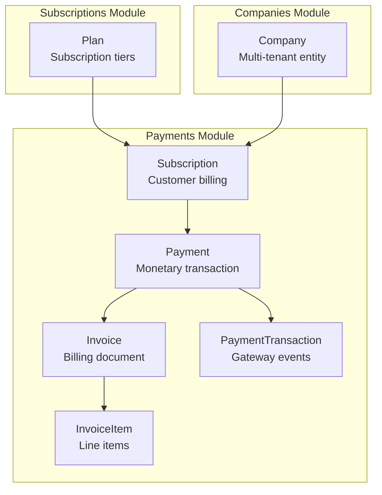
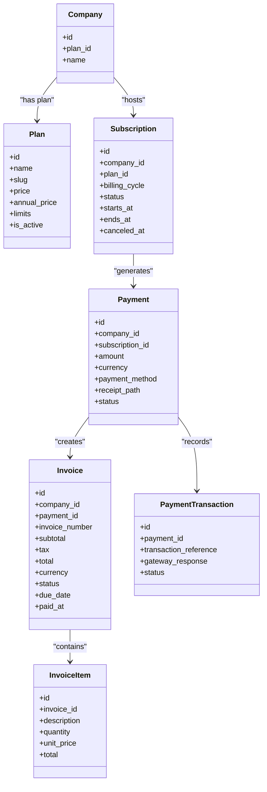
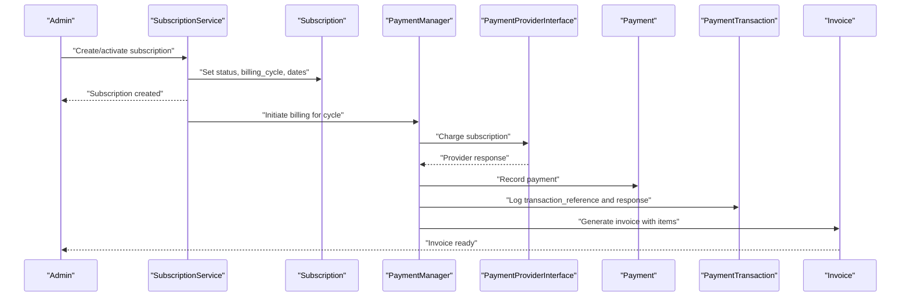
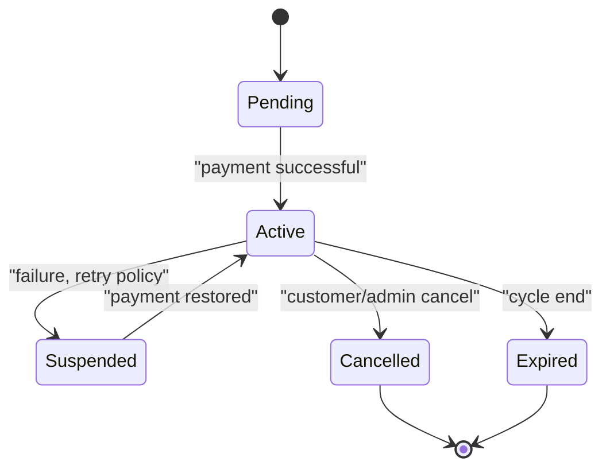
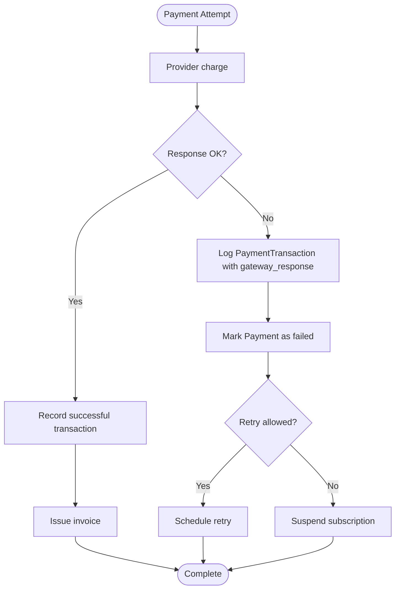
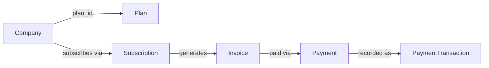
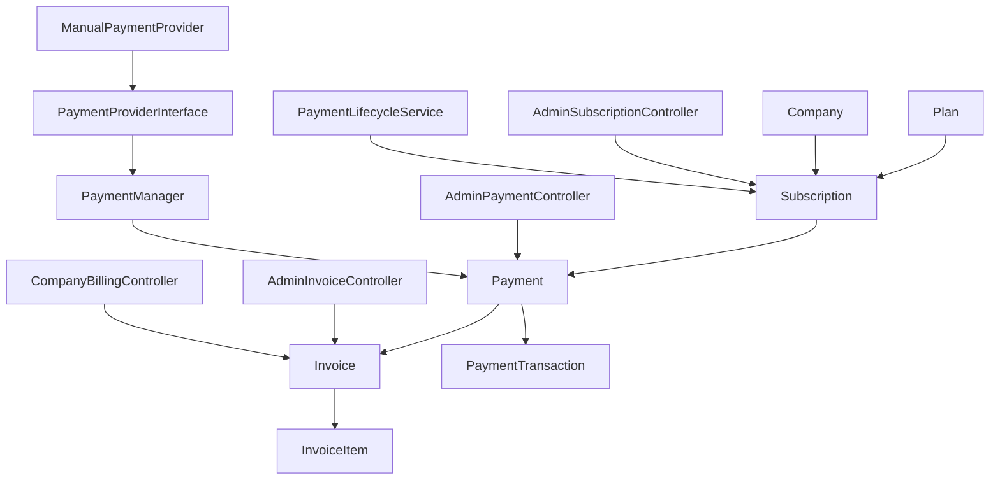

# Payment & Billing Entities

<cite>
**Referenced Files in This Document**
- [Plan.php](file://app/Modules/Subscriptions/Models/Plan.php)
- [Subscription.php](file://app/Modules/Payments/Models/Subscription.php)
- [Invoice.php](file://app/Modules/Payments/Models/Invoice.php)
- [InvoiceItem.php](file://app/Modules/Payments/Models/InvoiceItem.php)
- [Payment.php](file://app/Modules/Payments/Models/Payment.php)
- [PaymentTransaction.php](file://app/Modules/Payments/Models/PaymentTransaction.php)
- [Company.php](file://app/Modules/Companies/Models/Company.php)
- [2026_04_13_175428_create_plans_table.php](file://database/migrations/2026_04_13_175428_create_plans_table.php)
- [2026_04_13_175436_add_plan_id_to_companies_table.php](file://database/migrations/2026_04_13_175436_add_plan_id_to_companies_table.php)
- [2026_04_14_094043_create_plan_permission_table.php](file://database/migrations/2026_04_14_094043_create_plan_permission_table.php)
- [2026_05_22_081649_create_subscriptions_table.php](file://database/migrations/2026_05_22_081649_create_subscriptions_table.php)
- [2026_05_22_081718_create_payments_table.php](file://database/migrations/2026_05_22_081718_create_payments_table.php)
- [2026_05_22_081729_create_payment_transactions_table.php](file://database/migrations/2026_05_22_081729_create_payment_transactions_table.php)
- [2026_05_22_081731_create_invoices_table.php](file://database/migrations/2026_05_22_081731_create_invoices_table.php)
- [2026_05_22_081733_create_invoice_items_table.php](file://database/migrations/2026_05_22_081733_create_invoice_items_table.php)
- [2026_05_26_084144_add_receipt_path_to_payments_table.php](file://database/migrations/2026_05_26_084144_add_receipt_path_to_payments_table.php)
- [CheckSubscriptionValid.php](file://app/Http/Middleware/CheckSubscriptionValid.php)
- [TenantMiddleware.php](file://app/Http/Middleware/TenantMiddleware.php)
- [PaymentLifecycleService.php](file://app/Modules/Payments/Services/PaymentLifecycleService.php)
- [PaymentManager.php](file://app/Modules/Payments/Managers/PaymentManager.php)
- [PaymentProviderInterface.php](file://app/Modules/Payments/Contracts/PaymentProviderInterface.php)
- [ManualPaymentProvider.php](file://app/Modules/Payments/Providers/ManualPaymentProvider.php)
- [AdminInvoiceController.php](file://app/Modules/Payments/Controllers/AdminInvoiceController.php)
- [AdminPaymentController.php](file://app/Modules/Payments/Controllers/AdminPaymentController.php)
- [AdminSubscriptionController.php](file://app/Modules/Payments/Controllers/AdminSubscriptionController.php)
- [CompanyBillingController.php](file://app/Modules/Payments/Controllers/CompanyBillingController.php)
</cite>

## Table of Contents
1. [Introduction](#introduction)
2. [Project Structure](#project-structure)
3. [Core Components](#core-components)
4. [Architecture Overview](#architecture-overview)
5. [Detailed Component Analysis](#detailed-component-analysis)
6. [Dependency Analysis](#dependency-analysis)
7. [Performance Considerations](#performance-considerations)
8. [Troubleshooting Guide](#troubleshooting-guide)
9. [Conclusion](#conclusion)

## Introduction
This document provides comprehensive data model documentation for Noubtigo's payment and subscription management system. It covers subscription tiers (Plan), billing entities (Invoice, InvoiceItem), payment processing (Payment, PaymentTransaction), and subscription lifecycle (Subscription). It also explains the payment lifecycle from subscription creation to recurring billing, subscription status management, billing cycles, payment failure handling, financial data integrity, receipt generation, audit trail requirements, and the relationship between company plans and individual customer billing within the multi-tenant context.

## Project Structure
The payment and subscription domain spans several modules:
- Subscriptions module: Plan model and related permissions
- Payments module: Subscription, Invoice, InvoiceItem, Payment, PaymentTransaction models
- Companies module: Company model linked to Plan
- Middleware: Tenant and subscription validation
- Services: Payment lifecycle orchestration and payment manager
- Controllers: Administrative and company-facing billing interfaces
- Contracts and Providers: Payment provider abstraction and manual provider implementation

**Diagram sources**
- [Plan.php:1-66](file://app/Modules/Subscriptions/Models/Plan.php#L1-L66)
- [Subscription.php:1-42](file://app/Modules/Payments/Models/Subscription.php#L1-L42)
- [Invoice.php:1-43](file://app/Modules/Payments/Models/Invoice.php#L1-L43)
- [InvoiceItem.php:1-22](file://app/Modules/Payments/Models/InvoiceItem.php#L1-L22)
- [Payment.php:1-40](file://app/Modules/Payments/Models/Payment.php#L1-L40)
- [PaymentTransaction.php:1-25](file://app/Modules/Payments/Models/PaymentTransaction.php#L1-L25)
- [Company.php](file://app/Modules/Companies/Models/Company.php)

**Section sources**
- [Plan.php:1-66](file://app/Modules/Subscriptions/Models/Plan.php#L1-L66)
- [Subscription.php:1-42](file://app/Modules/Payments/Models/Subscription.php#L1-L42)
- [Invoice.php:1-43](file://app/Modules/Payments/Models/Invoice.php#L1-L43)
- [InvoiceItem.php:1-22](file://app/Modules/Payments/Models/InvoiceItem.php#L1-L22)
- [Payment.php:1-40](file://app/Modules/Payments/Models/Payment.php#L1-L40)
- [PaymentTransaction.php:1-25](file://app/Modules/Payments/Models/PaymentTransaction.php#L1-L25)
- [Company.php](file://app/Modules/Companies/Models/Company.php)

## Core Components
This section defines each core entity, its fields, relationships, and responsibilities.

### Plan (Subscription Tier)
- Purpose: Defines subscription tiers with pricing, annual pricing, feature limits, and permissions.
- Key fields:
  - name, slug, description
  - price (monthly), annual_price
  - limits (JSON object for feature quotas)
  - is_active flag
- Relationships:
  - One-to-many with Company (company.plan_id)
  - One-to-many with Subscription via foreign key
  - Many-to-many with Permission via pivot table plan_permission
- Permissions:
  - Features are granted via permissions linked to a plan
- Limits:
  - Access via helper to retrieve specific limit keys

**Section sources**
- [Plan.php:1-66](file://app/Modules/Subscriptions/Models/Plan.php#L1-L66)
- [2026_04_13_175428_create_plans_table.php:1-34](file://database/migrations/2026_04_13_175428_create_plans_table.php#L1-L34)
- [2026_04_13_175436_add_plan_id_to_companies_table.php:1-31](file://database/migrations/2026_04_13_175436_add_plan_id_to_companies_table.php#L1-L31)
- [2026_04_14_094043_create_plan_permission_table.php:1-31](file://database/migrations/2026_04_14_094043_create_plan_permission_table.php#L1-L31)

### Subscription (Customer Billing)
- Purpose: Tracks a company's active subscription, billing cycle, and status.
- Key fields:
  - company_id, plan_id
  - billing_cycle ('monthly' or 'annual')
  - status ('pending', 'active', 'suspended', 'cancelled', 'expired')
  - starts_at, ends_at, canceled_at
- Relationships:
  - Belongs to Company and Plan
  - Has many Payments
- Lifecycle:
  - Status transitions managed externally (e.g., via service layer)
  - Billing cycle determines renewal cadence

**Section sources**
- [Subscription.php:1-42](file://app/Modules/Payments/Models/Subscription.php#L1-L42)
- [2026_05_22_081649_create_subscriptions_table.php:1-35](file://database/migrations/2026_05_22_081649_create_subscriptions_table.php#L1-L35)

### Invoice (Billing Document)
- Purpose: Represents a bill issued to a company for payment.
- Key fields:
  - company_id, payment_id (optional)
  - invoice_number (unique)
  - subtotal, tax, total
  - currency (3-letter ISO)
  - status ('draft', 'open', 'paid', 'void', 'uncollectible')
  - due_date, paid_at
- Relationships:
  - Belongs to Company
  - Belongs to Payment (optional)
  - Has many InvoiceItems

**Section sources**
- [Invoice.php:1-43](file://app/Modules/Payments/Models/Invoice.php#L1-L43)
- [2026_05_22_081731_create_invoices_table.php:1-38](file://database/migrations/2026_05_22_081731_create_invoices_table.php#L1-L38)

### InvoiceItem (Line Items)
- Purpose: Breakdown of charges within an invoice.
- Key fields:
  - invoice_id
  - description
  - quantity, unit_price, total
- Relationships:
  - Belongs to Invoice

**Section sources**
- [InvoiceItem.php:1-22](file://app/Modules/Payments/Models/InvoiceItem.php#L1-L22)
- [2026_05_22_081733_create_invoice_items_table.php:1-33](file://database/migrations/2026_05_22_081733_create_invoice_items_table.php#L1-L33)

### Payment (Monetary Transaction)
- Purpose: Records a payment event associated with a subscription and company.
- Key fields:
  - company_id, subscription_id
  - amount, currency
  - payment_method
  - receipt_path (path to receipt file)
  - status
- Relationships:
  - Belongs to Company and Subscription
  - Has many PaymentTransactions
  - Has one Invoice

**Section sources**
- [Payment.php:1-40](file://app/Modules/Payments/Models/Payment.php#L1-L40)
- [2026_05_22_081718_create_payments_table.php](file://database/migrations/2026_05_22_081718_create_payments_table.php)
- [2026_05_26_084144_add_receipt_path_to_payments_table.php](file://database/migrations/2026_05_26_084144_add_receipt_path_to_payments_table.php)

### PaymentTransaction (Gateway Event)
- Purpose: Captures provider-specific transaction metadata and status.
- Key fields:
  - payment_id
  - transaction_reference
  - gateway_response (JSON/array)
  - status
- Relationships:
  - Belongs to Payment

**Section sources**
- [PaymentTransaction.php:1-25](file://app/Modules/Payments/Models/PaymentTransaction.php#L1-L25)
- [2026_05_22_081729_create_payment_transactions_table.php](file://database/migrations/2026_05_22_081729_create_payment_transactions_table.php)

### Company (Multi-Tenant Entity)
- Purpose: Hosts subscriptions and invoices; linked to Plan.
- Key fields:
  - plan_id (nullable) referencing Plan
- Relationships:
  - Belongs to Plan
  - Has many Subscriptions

**Section sources**
- [Company.php](file://app/Modules/Companies/Models/Company.php)
- [2026_04_13_175436_add_plan_id_to_companies_table.php:1-31](file://database/migrations/2026_04_13_175436_add_plan_id_to_companies_table.php#L1-L31)

## Architecture Overview
The payment and subscription architecture integrates multi-tenancy via Company, tier definition via Plan, billing via Subscription and Invoice, and payment processing via Payment and PaymentTransaction. Middleware ensures tenant isolation and subscription validity checks.

**Diagram sources**
- [Company.php](file://app/Modules/Companies/Models/Company.php)
- [Plan.php:1-66](file://app/Modules/Subscriptions/Models/Plan.php#L1-L66)
- [Subscription.php:1-42](file://app/Modules/Payments/Models/Subscription.php#L1-L42)
- [Invoice.php:1-43](file://app/Modules/Payments/Models/Invoice.php#L1-L43)
- [InvoiceItem.php:1-22](file://app/Modules/Payments/Models/InvoiceItem.php#L1-L22)
- [Payment.php:1-40](file://app/Modules/Payments/Models/Payment.php#L1-L40)
- [PaymentTransaction.php:1-25](file://app/Modules/Payments/Models/PaymentTransaction.php#L1-L25)

## Detailed Component Analysis

### Payment Lifecycle: From Subscription Creation to Recurring Billing
This sequence illustrates the typical lifecycle from subscription creation to payment and invoicing.

**Diagram sources**
- [PaymentLifecycleService.php](file://app/Modules/Payments/Services/PaymentLifecycleService.php)
- [PaymentManager.php](file://app/Modules/Payments/Managers/PaymentManager.php)
- [PaymentProviderInterface.php](file://app/Modules/Payments/Contracts/PaymentProviderInterface.php)
- [ManualPaymentProvider.php](file://app/Modules/Payments/Providers/ManualPaymentProvider.php)
- [Subscription.php:1-42](file://app/Modules/Payments/Models/Subscription.php#L1-L42)
- [Payment.php:1-40](file://app/Modules/Payments/Models/Payment.php#L1-L40)
- [PaymentTransaction.php:1-25](file://app/Modules/Payments/Models/PaymentTransaction.php#L1-L25)
- [Invoice.php:1-43](file://app/Modules/Payments/Models/Invoice.php#L1-L43)
- [InvoiceItem.php:1-22](file://app/Modules/Payments/Models/InvoiceItem.php#L1-L22)

### Subscription Status Management and Billing Cycles
Status transitions and cycle handling are central to the billing process.

- Status values are defined in the subscriptions table migration.
- Billing cycle ('monthly' or 'annual') drives renewal scheduling.
- Middleware ensures tenant isolation and subscription validity during requests.

**Diagram sources**
- [2026_05_22_081649_create_subscriptions_table.php:1-35](file://database/migrations/2026_05_22_081649_create_subscriptions_table.php#L1-L35)
- [CheckSubscriptionValid.php](file://app/Http/Middleware/CheckSubscriptionValid.php)
- [TenantMiddleware.php](file://app/Http/Middleware/TenantMiddleware.php)

### Payment Failure Handling and Audit Trail
Failure scenarios require robust handling and auditability.

- PaymentTransaction stores provider responses for auditability.
- Payment status reflects current state.
- Receipts are stored via receipt_path for compliance.

**Diagram sources**
- [PaymentTransaction.php:1-25](file://app/Modules/Payments/Models/PaymentTransaction.php#L1-L25)
- [Payment.php:1-40](file://app/Modules/Payments/Models/Payment.php#L1-L40)
- [2026_05_26_084144_add_receipt_path_to_payments_table.php](file://database/migrations/2026_05_26_084144_add_receipt_path_to_payments_table.php)

### Financial Data Integrity and Monetary Fields
Financial integrity relies on precise decimal casting and controlled updates.

- Monetary fields:
  - Plan.price, Plan.annual_price: decimal with 2 decimals
  - Invoice.subtotal, Invoice.tax, Invoice.total: decimal with 2 decimals
  - InvoiceItem.unit_price, InvoiceItem.total: decimal with 2 decimals
- Currency:
  - Invoice.currency defaults to 'USD'
- Casting:
  - Eloquent casts ensure consistent numeric representation

**Section sources**
- [Plan.php:19-24](file://app/Modules/Subscriptions/Models/Plan.php#L19-L24)
- [Invoice.php:23-26](file://app/Modules/Payments/Models/Invoice.php#L23-L26)
- [InvoiceItem.php:1-22](file://app/Modules/Payments/Models/InvoiceItem.php#L1-L22)
- [2026_04_13_175428_create_plans_table.php:19-20](file://database/migrations/2026_04_13_175428_create_plans_table.php#L19-L20)
- [2026_05_22_081731_create_invoices_table.php:19-21](file://database/migrations/2026_05_22_081731_create_invoices_table.php#L19-L21)
- [2026_05_22_081733_create_invoice_items_table.php:18-20](file://database/migrations/2026_05_22_081733_create_invoice_items_table.php#L18-L20)

### Multi-Tenant Context: Company Plans and Individual Customer Billing
- Company links to Plan via plan_id, enabling per-tenant tier assignment.
- Subscription belongs to Company and Plan, aligning billing with tenant tier.
- Invoice and Payment belong to Company, ensuring segregation of financial records.

**Diagram sources**
- [Company.php](file://app/Modules/Companies/Models/Company.php)
- [Plan.php:29-32](file://app/Modules/Subscriptions/Models/Plan.php#L29-L32)
- [Subscription.php:27-30](file://app/Modules/Payments/Models/Subscription.php#L27-L30)
- [Invoice.php:28-31](file://app/Modules/Payments/Models/Invoice.php#L28-L31)
- [Payment.php:20-23](file://app/Modules/Payments/Models/Payment.php#L20-L23)
- [PaymentTransaction.php:20-23](file://app/Modules/Payments/Models/PaymentTransaction.php#L20-L23)

**Section sources**
- [2026_04_13_175436_add_plan_id_to_companies_table.php:14-17](file://database/migrations/2026_04_13_175436_add_plan_id_to_companies_table.php#L14-L17)
- [Plan.php:29-32](file://app/Modules/Subscriptions/Models/Plan.php#L29-L32)
- [Subscription.php:27-30](file://app/Modules/Payments/Models/Subscription.php#L27-L30)
- [Invoice.php:28-31](file://app/Modules/Payments/Models/Invoice.php#L28-L31)
- [Payment.php:20-23](file://app/Modules/Payments/Models/Payment.php#L20-L23)

## Dependency Analysis
This section maps dependencies among models and controllers/services involved in payment and billing.

**Diagram sources**
- [Plan.php:1-66](file://app/Modules/Subscriptions/Models/Plan.php#L1-L66)
- [Subscription.php:1-42](file://app/Modules/Payments/Models/Subscription.php#L1-L42)
- [Invoice.php:1-43](file://app/Modules/Payments/Models/Invoice.php#L1-L43)
- [InvoiceItem.php:1-22](file://app/Modules/Payments/Models/InvoiceItem.php#L1-L22)
- [Payment.php:1-40](file://app/Modules/Payments/Models/Payment.php#L1-L40)
- [PaymentTransaction.php:1-25](file://app/Modules/Payments/Models/PaymentTransaction.php#L1-L25)
- [AdminInvoiceController.php](file://app/Modules/Payments/Controllers/AdminInvoiceController.php)
- [AdminPaymentController.php](file://app/Modules/Payments/Controllers/AdminPaymentController.php)
- [AdminSubscriptionController.php](file://app/Modules/Payments/Controllers/AdminSubscriptionController.php)
- [CompanyBillingController.php](file://app/Modules/Payments/Controllers/CompanyBillingController.php)
- [PaymentLifecycleService.php](file://app/Modules/Payments/Services/PaymentLifecycleService.php)
- [PaymentManager.php](file://app/Modules/Payments/Managers/PaymentManager.php)
- [PaymentProviderInterface.php](file://app/Modules/Payments/Contracts/PaymentProviderInterface.php)
- [ManualPaymentProvider.php](file://app/Modules/Payments/Providers/ManualPaymentProvider.php)

**Section sources**
- [AdminInvoiceController.php](file://app/Modules/Payments/Controllers/AdminInvoiceController.php)
- [AdminPaymentController.php](file://app/Modules/Payments/Controllers/AdminPaymentController.php)
- [AdminSubscriptionController.php](file://app/Modules/Payments/Controllers/AdminSubscriptionController.php)
- [CompanyBillingController.php](file://app/Modules/Payments/Controllers/CompanyBillingController.php)
- [PaymentLifecycleService.php](file://app/Modules/Payments/Services/PaymentLifecycleService.php)
- [PaymentManager.php](file://app/Modules/Payments/Managers/PaymentManager.php)
- [PaymentProviderInterface.php](file://app/Modules/Payments/Contracts/PaymentProviderInterface.php)
- [ManualPaymentProvider.php](file://app/Modules/Payments/Providers/ManualPaymentProvider.php)

## Performance Considerations
- Indexing:
  - Ensure foreign keys (company_id, plan_id, subscription_id, payment_id) are indexed for join-heavy queries.
  - Unique indexes on invoice_number and plan slug improve lookup performance.
- Decimal precision:
  - Keep monetary fields as decimal with fixed scale to avoid floating-point drift.
- Caching:
  - Cache Plan metadata and limits for frequently accessed tenants.
- Batch operations:
  - Use chunked processing for subscription renewals and invoice generation.
- Storage:
  - Store receipts in cloud storage with appropriate retention policies.

## Troubleshooting Guide
Common issues and resolutions:
- Subscription not activating:
  - Verify Payment status is successful and Invoice.paid_at is populated.
  - Confirm middleware CheckSubscriptionValid allows the request.
- Payment failures:
  - Inspect PaymentTransaction.gateway_response for provider error details.
  - Check Payment.status and retry policy configuration.
- Missing receipts:
  - Confirm receipt_path exists and is accessible.
  - Validate storage permissions and retention settings.
- Incorrect totals:
  - Reconcile Invoice.subtotal, tax, and total against InvoiceItem entries.
  - Ensure currency matches and conversions are handled externally if applicable.

**Section sources**
- [CheckSubscriptionValid.php](file://app/Http/Middleware/CheckSubscriptionValid.php)
- [PaymentTransaction.php:16-18](file://app/Modules/Payments/Models/PaymentTransaction.php#L16-L18)
- [Payment.php:16-17](file://app/Modules/Payments/Models/Payment.php#L16-L17)
- [Invoice.php:14-21](file://app/Modules/Payments/Models/Invoice.php#L14-L21)

## Conclusion
Noubtigo’s payment and subscription models form a cohesive, multi-tenant billing system. Plans define tiers, Subscriptions manage billing cycles and statuses, Invoices document charges, Payments record monies received, and Transactions capture provider events. Robust middleware, service orchestration, and clear financial casting ensure integrity and auditability. The documented relationships and lifecycles support reliable recurring billing, failure handling, and compliance-ready receipts.