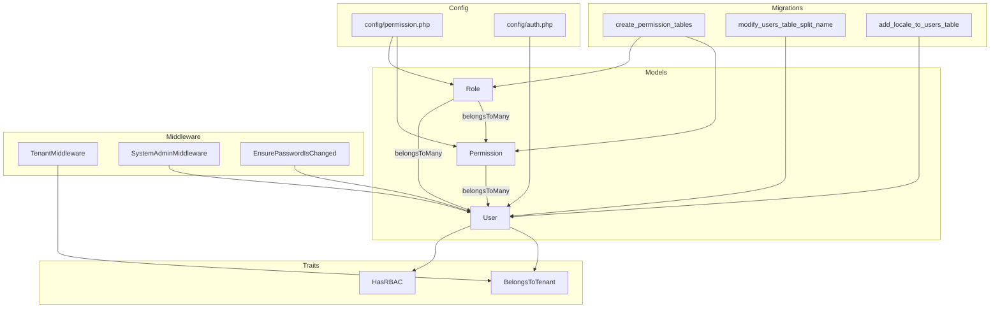
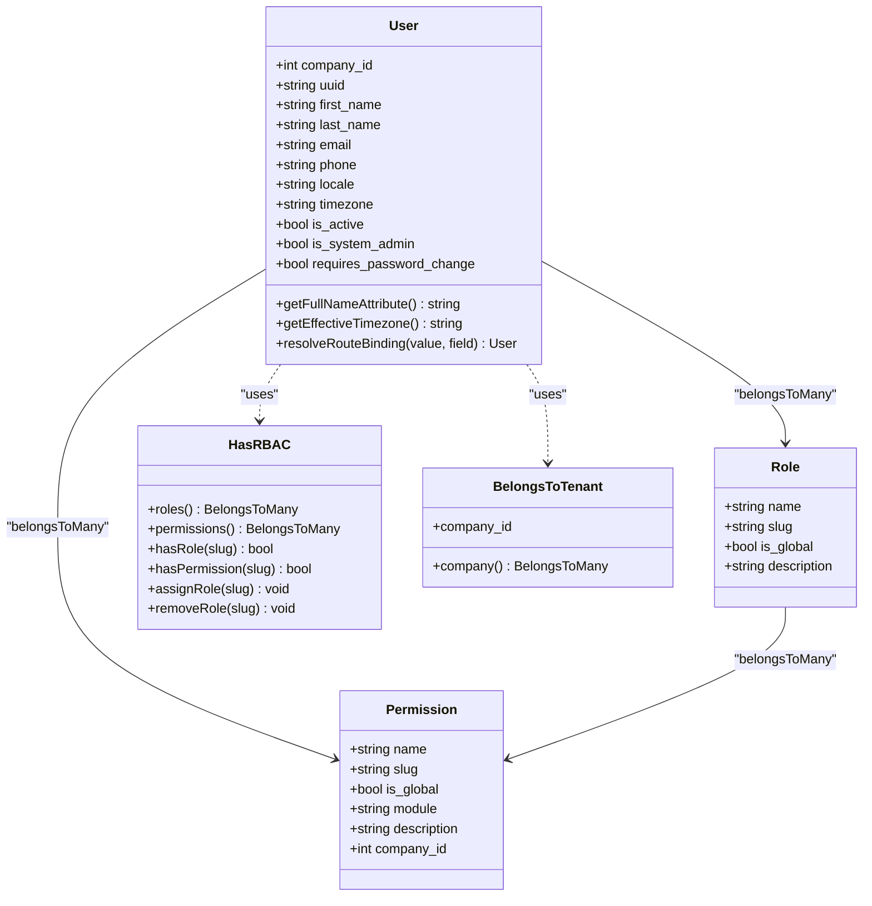
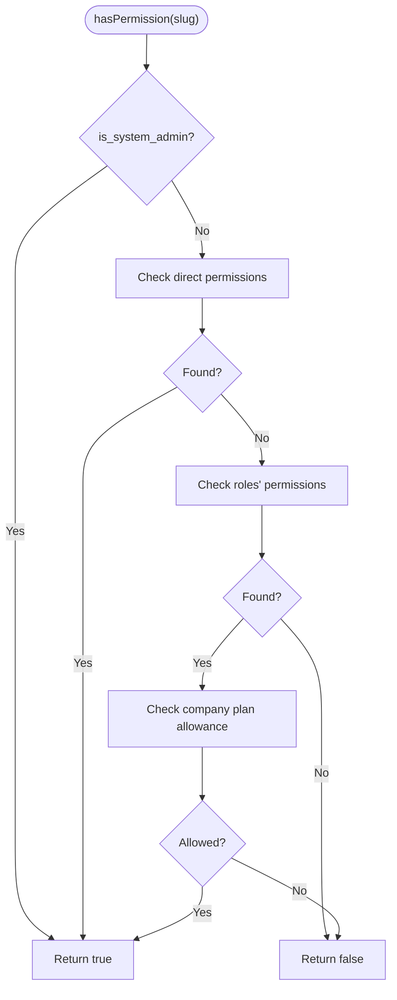
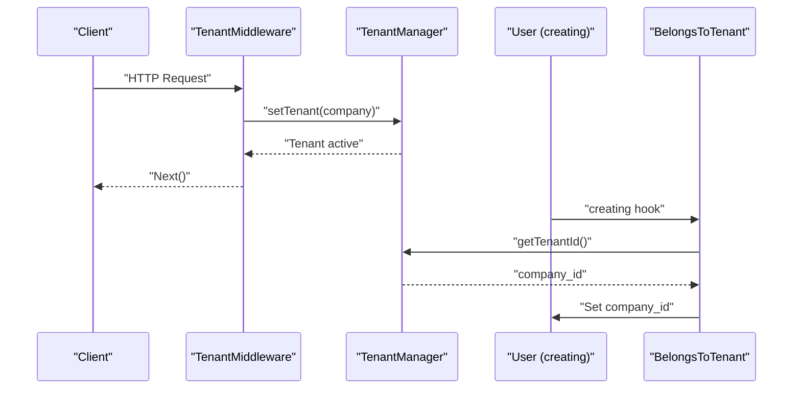
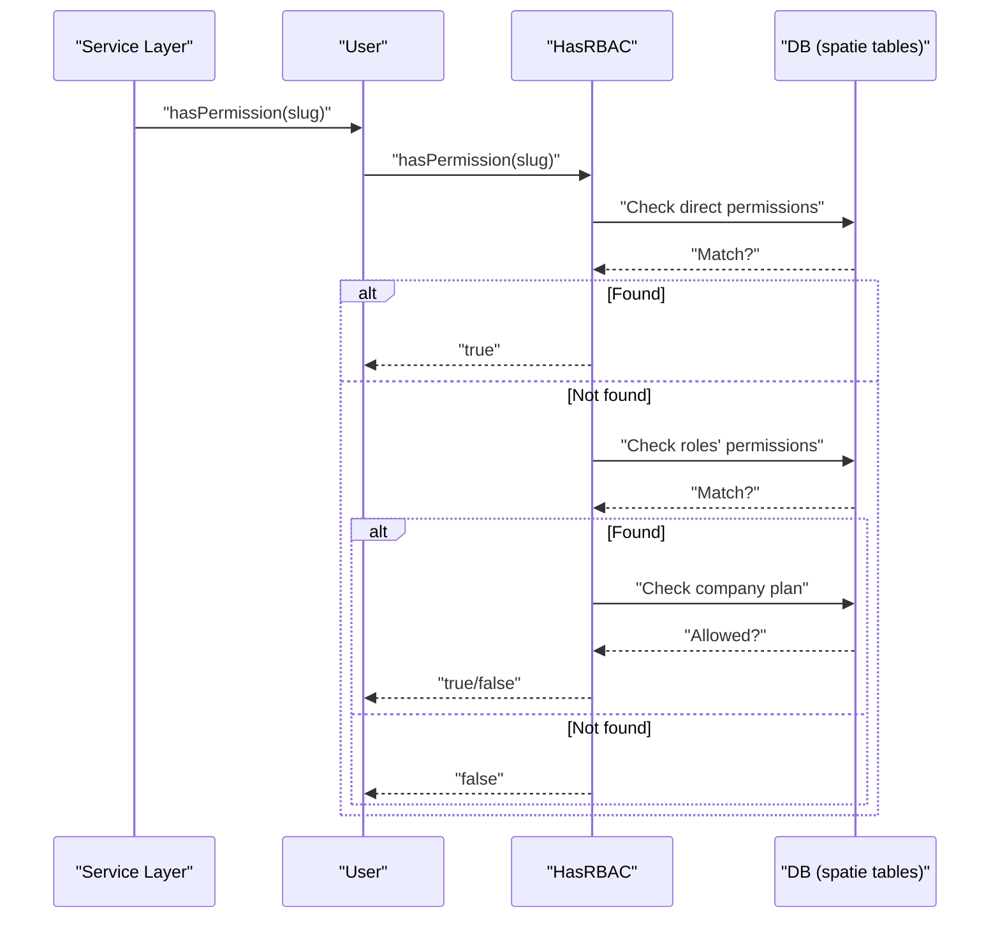

# RBAC & User Management Entities

<cite>
**Referenced Files in This Document**
- [User.php](file://app/Models/User.php)
- [Role.php](file://app/Models/Role.php)
- [Permission.php](file://app/Models/Permission.php)
- [HasRBAC.php](file://app/Modules/Core/Traits/HasRBAC.php)
- [BelongsToTenant.php](file://app/Modules/Core/Traits/BelongsToTenant.php)
- [TenantMiddleware.php](file://app/Http/Middleware/TenantMiddleware.php)
- [SystemAdminMiddleware.php](file://app/Http/Middleware/SystemAdminMiddleware.php)
- [EnsurePasswordIsChanged.php](file://app/Http/Middleware/EnsurePasswordIsChanged.php)
- [permission.php](file://config/permission.php)
- [auth.php](file://config/auth.php)
- [2026_04_06_115250_create_permission_tables.php](file://database/migrations/2026_04_06_115250_create_permission_tables.php)
- [2026_04_06_135100_modify_users_table_split_name.php](file://database/migrations/2026_04_06_135100_modify_users_table_split_name.php)
- [2026_04_06_124808_add_locale_to_users_table.php](file://database/migrations/2026_04_06_124808_add_locale_to_users_table.php)
- [2026_04_06_154141_add_prefix_to_services_table.php](file://database/migrations/2026_04_06_154141_add_prefix_to_services_table.php)
- [2026_04_06_163000_create_customers_table.php](file://database/migrations/2026_04_06_163000_create_customers_table.php)
</cite>

## Table of Contents
1. [Introduction](#introduction)
2. [Project Structure](#project-structure)
3. [Core Components](#core-components)
4. [Architecture Overview](#architecture-overview)
5. [Detailed Component Analysis](#detailed-component-analysis)
6. [Dependency Analysis](#dependency-analysis)
7. [Performance Considerations](#performance-considerations)
8. [Troubleshooting Guide](#troubleshooting-guide)
9. [Conclusion](#conclusion)

## Introduction
This document describes Noubtigo’s Role-Based Access Control (RBAC) system and user management entities. It explains the User, Role, and Permission models, their relationships, and how tenant scoping is enforced. It documents the integration with the spatie/laravel-permission package (including pivot tables and dynamic permission assignment), authentication and password management, and the multi-tenant role system that isolates roles and permissions per company. It also covers field definitions for user profiles, authentication tokens, and permission inheritance, along with practical patterns for permission checking and role assignment.

## Project Structure
The RBAC system spans several layers:
- Models: User, Role, Permission
- Traits: HasRBAC (for permission/role checks and assignments), BelongsToTenant (for tenant scoping)
- Middleware: TenantMiddleware (tenant identification), SystemAdminMiddleware (system admin gating), EnsurePasswordIsChanged (password policy enforcement)
- Configuration: permission.php (spatie/laravel-permission settings), auth.php (authentication guards/providers)
- Migrations: spatie/laravel-permission base tables and user profile enhancements



**Diagram sources**
- [User.php:15-190](file://app/Models/User.php#L15-L190)
- [Role.php:8-27](file://app/Models/Role.php#L8-L27)
- [Permission.php:8-22](file://app/Models/Permission.php#L8-L22)
- [HasRBAC.php:9-104](file://app/Modules/Core/Traits/HasRBAC.php#L9-L104)
- [BelongsToTenant.php:8-35](file://app/Modules/Core/Traits/BelongsToTenant.php#L8-L35)
- [TenantMiddleware.php:11-52](file://app/Http/Middleware/TenantMiddleware.php#L11-L52)
- [SystemAdminMiddleware.php:9-25](file://app/Http/Middleware/SystemAdminMiddleware.php#L9-L25)
- [EnsurePasswordIsChanged.php:9-27](file://app/Http/Middleware/EnsurePasswordIsChanged.php#L9-L27)
- [permission.php:7-207](file://config/permission.php#L7-L207)
- [auth.php:5-122](file://config/auth.php#L5-L122)
- [2026_04_06_115250_create_permission_tables.php:7-135](file://database/migrations/2026_04_06_115250_create_permission_tables.php#L7-L135)
- [2026_04_06_135100_modify_users_table_split_name.php:7-59](file://database/migrations/2026_04_06_135100_modify_users_table_split_name.php#L7-L59)
- [2026_04_06_124808_add_locale_to_users_table.php:7-29](file://database/migrations/2026_04_06_124808_add_locale_to_users_table.php#L7-L29)

**Section sources**
- [User.php:15-190](file://app/Models/User.php#L15-L190)
- [Role.php:8-27](file://app/Models/Role.php#L8-L27)
- [Permission.php:8-22](file://app/Models/Permission.php#L8-L22)
- [HasRBAC.php:9-104](file://app/Modules/Core/Traits/HasRBAC.php#L9-L104)
- [BelongsToTenant.php:8-35](file://app/Modules/Core/Traits/BelongsToTenant.php#L8-L35)
- [TenantMiddleware.php:11-52](file://app/Http/Middleware/TenantMiddleware.php#L11-L52)
- [SystemAdminMiddleware.php:9-25](file://app/Http/Middleware/SystemAdminMiddleware.php#L9-L25)
- [EnsurePasswordIsChanged.php:9-27](file://app/Http/Middleware/EnsurePasswordIsChanged.php#L9-L27)
- [permission.php:7-207](file://config/permission.php#L7-L207)
- [auth.php:5-122](file://config/auth.php#L5-L122)
- [2026_04_06_115250_create_permission_tables.php:7-135](file://database/migrations/2026_04_06_115250_create_permission_tables.php#L7-L135)
- [2026_04_06_135100_modify_users_table_split_name.php:7-59](file://database/migrations/2026_04_06_135100_modify_users_table_split_name.php#L7-L59)
- [2026_04_06_124808_add_locale_to_users_table.php:7-29](file://database/migrations/2026_04_06_124808_add_locale_to_users_table.php#L7-L29)

## Core Components
- User: Authenticatable model with API tokens, notifications, tenant association, and RBAC capabilities. Includes profile fields, UUID routing, and timezone resolution.
- Role: Eloquent model representing roles with optional global flag and company associations.
- Permission: Eloquent model representing permissions with optional module and company scoping.
- HasRBAC: Trait providing role/permission relationships, checks, and dynamic assignments filtered by tenant.
- BelongsToTenant: Trait applying tenant scoping globally and auto-setting company_id during creation.
- Middleware: TenantMiddleware identifies tenant by subdomain or authenticated user; SystemAdminMiddleware restricts access to system admins; EnsurePasswordIsChanged enforces password change policies.

Key RBAC behaviors:
- Roles and permissions are tenant-scoped via HasRBAC relationships and Role/Permission company pivots.
- Users can have direct permissions and inherit permissions via assigned roles.
- System administrators bypass scoping checks.
- Plan-based permission gating is integrated via subscription service.

**Section sources**
- [User.php:15-190](file://app/Models/User.php#L15-L190)
- [Role.php:8-27](file://app/Models/Role.php#L8-L27)
- [Permission.php:8-22](file://app/Models/Permission.php#L8-L22)
- [HasRBAC.php:9-104](file://app/Modules/Core/Traits/HasRBAC.php#L9-L104)
- [BelongsToTenant.php:8-35](file://app/Modules/Core/Traits/BelongsToTenant.php#L8-L35)

## Architecture Overview
The RBAC architecture integrates spatie/laravel-permission with Noubtigo’s tenant-aware models and middleware. The User model composes HasRBAC and BelongsToTenant, ensuring all queries are scoped to the current tenant and that users can check permissions and roles accordingly.



**Diagram sources**
- [User.php:15-190](file://app/Models/User.php#L15-L190)
- [Role.php:8-27](file://app/Models/Role.php#L8-L27)
- [Permission.php:8-22](file://app/Models/Permission.php#L8-L22)
- [HasRBAC.php:9-104](file://app/Modules/Core/Traits/HasRBAC.php#L9-L104)
- [BelongsToTenant.php:8-35](file://app/Modules/Core/Traits/BelongsToTenant.php#L8-L35)

## Detailed Component Analysis

### User Model
Responsibilities:
- Authentication and API token support via HasApiTokens.
- Notification delivery via Notifiable.
- Tenant scoping via BelongsToTenant.
- RBAC via HasRBAC.
- Profile management: split name fields, locale, timezone, avatar, phone normalization, and UUID routing.
- Effective timezone resolution with fallback chain.
- Route model binding accepts UUID or numeric ID.

Fields and behaviors:
- Mass assignable fields include company_id, personal info, credentials, flags, localization, and assignments.
- Hidden attributes exclude sensitive credentials.
- Casts ensure secure password handling and boolean flags.
- ScopeFilter supports search, role, status, room, and service filters.
- UUID auto-generation on creation and route binding flexibility.

**Section sources**
- [User.php:15-190](file://app/Models/User.php#L15-L190)
- [2026_04_06_135100_modify_users_table_split_name.php:12-36](file://database/migrations/2026_04_06_135100_modify_users_table_split_name.php#L12-L36)
- [2026_04_06_124808_add_locale_to_users_table.php:12-16](file://database/migrations/2026_04_06_124808_add_locale_to_users_table.php#L12-L16)

### Role Model
Responsibilities:
- Represents roles with name, slug, global flag, and description.
- Many-to-many relationships with users and permissions.
- Many-to-many relationship with companies via role_company pivot.

Tenant scoping:
- Roles can be global or assigned to a specific company. HasRBAC filters roles by global flag or company membership.

**Section sources**
- [Role.php:8-27](file://app/Models/Role.php#L8-L27)
- [HasRBAC.php:15-24](file://app/Modules/Core/Traits/HasRBAC.php#L15-L24)

### Permission Model
Responsibilities:
- Represents permissions with name, slug, global flag, module, description, and optional company_id.
- Many-to-many relationships with roles and companies via permission_company pivot.

Plan gating:
- Permissions are validated against the company’s plan via SubscriptionService during hasPermission checks.

**Section sources**
- [Permission.php:8-22](file://app/Models/Permission.php#L8-L22)
- [HasRBAC.php:46-73](file://app/Modules/Core/Traits/HasRBAC.php#L46-L73)

### HasRBAC Trait
Core logic:
- roles(): Returns tenant-aware roles filtered by global flag or company membership.
- permissions(): Direct permission assignment to the user.
- hasRole(slug): Fast lookup returning true for system admins.
- hasPermission(slug): Multi-layer check:
  1) Direct user permission
  2) Permission inherited from roles
  3) Plan-based allowance via company subscription
- assignRole(slug): Assigns a role scoped to the user’s company or global roles.
- removeRole(slug): Removes a role assignment.



**Diagram sources**
- [HasRBAC.php:37-73](file://app/Modules/Core/Traits/HasRBAC.php#L37-L73)

**Section sources**
- [HasRBAC.php:9-104](file://app/Modules/Core/Traits/HasRBAC.php#L9-L104)

### BelongsToTenant Trait
Behavior:
- Applies a global TenantScope to all queries.
- Automatically sets company_id during creation using TenantManager.
- Provides company relationship for ownership.



**Diagram sources**
- [TenantMiddleware.php:22-49](file://app/Http/Middleware/TenantMiddleware.php#L22-L49)
- [BelongsToTenant.php:15-25](file://app/Modules/Core/Traits/BelongsToTenant.php#L15-L25)

**Section sources**
- [BelongsToTenant.php:8-35](file://app/Modules/Core/Traits/BelongsToTenant.php#L8-L35)
- [TenantMiddleware.php:11-52](file://app/Http/Middleware/TenantMiddleware.php#L11-L52)

### Middleware Stack
- TenantMiddleware: Identifies tenant by subdomain or authenticated user and sets TenantManager context.
- SystemAdminMiddleware: Enforces system administrator access.
- EnsurePasswordIsChanged: Redirects authenticated users who require password change to the change flow.

**Section sources**
- [TenantMiddleware.php:11-52](file://app/Http/Middleware/TenantMiddleware.php#L11-L52)
- [SystemAdminMiddleware.php:9-25](file://app/Http/Middleware/SystemAdminMiddleware.php#L9-L25)
- [EnsurePasswordIsChanged.php:9-27](file://app/Http/Middleware/EnsurePasswordIsChanged.php#L9-L27)

### Authentication and Password Management
- Authentication guards and providers configured for web and customer portals.
- Password reset configuration with broker, token table, expiry, and throttle.
- User model uses hashed password casting and hides sensitive fields.
- EnsurePasswordIsChanged middleware enforces password change requirement.

**Section sources**
- [auth.php:5-122](file://config/auth.php#L5-L122)
- [User.php:99-120](file://app/Models/User.php#L99-L120)
- [EnsurePasswordIsChanged.php:9-27](file://app/Http/Middleware/EnsurePasswordIsChanged.php#L9-L27)

### Multi-Tenant Role System
- Tenant scoping is enforced at the model level via BelongsToTenant and at the RBAC level via HasRBAC.
- Roles and permissions can be global or company-scoped. Company pivots connect roles/permissions to companies.
- Dynamic assignment respects tenant boundaries: assignRole filters available roles by company or global flag.

**Section sources**
- [BelongsToTenant.php:8-35](file://app/Modules/Core/Traits/BelongsToTenant.php#L8-L35)
- [HasRBAC.php:15-24](file://app/Modules/Core/Traits/HasRBAC.php#L15-L24)
- [Role.php:22-25](file://app/Models/Role.php#L22-L25)
- [Permission.php:17-20](file://app/Models/Permission.php#L17-L20)

### Data Model and Pivot Tables
The spatie/laravel-permission package creates the following tables:
- permissions: permission records
- roles: role records
- model_has_permissions: user-to-permission assignments
- model_has_roles: user-to-role assignments
- role_has_permissions: role-to-permission relationships

```mermaid
erDiagram
PERMISSIONS {
bigint id PK
string name
string guard_name
timestamps
}
ROLES {
bigint id PK
string name
string guard_name
timestamps
}
MODEL_HAS_PERMISSIONS {
bigint model_id
string model_type
bigint permission_id FK
}
MODEL_HAS_ROLES {
bigint model_id
string model_type
bigint role_id FK
}
ROLE_HAS_PERMISSIONS {
bigint permission_id FK
bigint role_id FK
}
PERMISSIONS ||--o{ MODEL_HAS_PERMISSIONS : "assigned_to"
ROLES ||--o{ MODEL_HAS_ROLES : "assigned_to"
PERMISSIONS ||--o{ ROLE_HAS_PERMISSIONS : "included_in"
ROLES ||--o{ ROLE_HAS_PERMISSIONS : "grants"
```

**Diagram sources**
- [2026_04_06_115250_create_permission_tables.php:23-112](file://database/migrations/2026_04_06_115250_create_permission_tables.php#L23-L112)
- [permission.php:35-76](file://config/permission.php#L35-L76)

**Section sources**
- [2026_04_06_115250_create_permission_tables.php:7-135](file://database/migrations/2026_04_06_115250_create_permission_tables.php#L7-L135)
- [permission.php:7-207](file://config/permission.php#L7-L207)

### Field Definitions and Profiles
- User fields include company_id, first_name, last_name, username, email, phone, password, requires_password_change, is_system_admin, locale, timezone, is_active, avatar, assigned_room_id, assigned_service_id, and uuid.
- Permission fields include name, slug, is_global, module, description, and company_id.
- Role fields include name, slug, is_global, and description.
- Additional profile-related migrations:
  - Split name fields and drop legacy name column.
  - Add locale to users.
  - Prefix on services table.
  - Customers table with company_id and searchable indexes.

**Section sources**
- [User.php:25-41](file://app/Models/User.php#L25-L41)
- [Permission.php:10](file://app/Models/Permission.php#L10)
- [Role.php:10](file://app/Models/Role.php#L10)
- [2026_04_06_135100_modify_users_table_split_name.php:12-36](file://database/migrations/2026_04_06_135100_modify_users_table_split_name.php#L12-L36)
- [2026_04_06_124808_add_locale_to_users_table.php:12-16](file://database/migrations/2026_04_06_124808_add_locale_to_users_table.php#L12-L16)
- [2026_04_06_154141_add_prefix_to_services_table.php:12-16](file://database/migrations/2026_04_06_154141_add_prefix_to_services_table.php#L12-L16)
- [2026_04_06_163000_create_customers_table.php:14-25](file://database/migrations/2026_04_06_163000_create_customers_table.php#L14-L25)

### Permission Checking and Role Assignment Patterns
Common patterns:
- Check role: hasRole(slug) returns true for system admins or if the user has the named role scoped to the tenant.
- Check permission: hasPermission(slug) evaluates direct assignment, role inheritance, and plan allowance.
- Assign role: assignRole(slug) attaches a role scoped to the user’s company or a global role.
- Remove role: removeRole(slug) detaches a role from the user.



**Diagram sources**
- [HasRBAC.php:37-73](file://app/Modules/Core/Traits/HasRBAC.php#L37-L73)

**Section sources**
- [HasRBAC.php:37-102](file://app/Modules/Core/Traits/HasRBAC.php#L37-L102)

## Dependency Analysis
- User depends on HasRBAC and BelongsToTenant for RBAC and tenant scoping.
- HasRBAC depends on Role, Permission, and SubscriptionService for plan gating.
- BelongsToTenant depends on TenantManager and Company for tenant identification.
- Middleware stack depends on User and TenantManager for tenant context and access control.
- Config files (permission.php, auth.php) define package behavior and authentication providers.

```mermaid
graph LR
User["User"] --> HasRBAC["HasRBAC"]
User --> BelongsToTenant["BelongsToTenant"]
HasRBAC --> Role["Role"]
HasRBAC --> Permission["Permission"]
HasRBAC --> SubscriptionService["SubscriptionService"]
BelongsToTenant --> TenantManager["TenantManager"]
BelongsToTenant --> Company["Company"]
TenantMiddleware --> TenantManager
SystemAdminMiddleware --> User
EnsurePasswordIsChanged --> User
permission_config["config/permission.php"] --> Role
permission_config --> Permission
auth_config["config/auth.php"] --> User
```



**Diagram sources**
- [HasRBAC.php:5-7](file://app/Modules/Core/Traits/HasRBAC.php#L5-L7)
- [BelongsToTenant.php:20-22](file://app/Modules/Core/Traits/BelongsToTenant.php#L20-L22)
- [TenantMiddleware.php:24-42](file://app/Http/Middleware/TenantMiddleware.php#L24-L42)
- [SystemAdminMiddleware.php:18-20](file://app/Http/Middleware/SystemAdminMiddleware.php#L18-L20)
- [EnsurePasswordIsChanged.php:18-22](file://app/Http/Middleware/EnsurePasswordIsChanged.php#L18-L22)
- [permission.php:7-33](file://config/permission.php#L7-L33)
- [auth.php:68-78](file://config/auth.php#L68-L78)

**Section sources**
- [HasRBAC.php:5-7](file://app/Modules/Core/Traits/HasRBAC.php#L5-L7)
- [BelongsToTenant.php:20-22](file://app/Modules/Core/Traits/BelongsToTenant.php#L20-L22)
- [TenantMiddleware.php:24-42](file://app/Http/Middleware/TenantMiddleware.php#L24-L42)
- [SystemAdminMiddleware.php:18-20](file://app/Http/Middleware/SystemAdminMiddleware.php#L18-L20)
- [EnsurePasswordIsChanged.php:18-22](file://app/Http/Middleware/EnsurePasswordIsChanged.php#L18-L22)
- [permission.php:7-33](file://config/permission.php#L7-L33)
- [auth.php:68-78](file://config/auth.php#L68-L78)

## Performance Considerations
- Cache configuration for permissions is enabled with a 24-hour expiration and default store. This reduces repeated lookups for roles and permissions.
- Wildcard permissions are disabled by default; enable only if required and carefully consider performance and security implications.
- Plan-based permission checks rely on SubscriptionService; ensure efficient caching and avoid excessive calls in hot paths.
- Global scopes applied by BelongsToTenant reduce accidental cross-tenant queries but may increase query complexity—ensure proper indexing on company_id.

**Section sources**
- [permission.php:183-205](file://config/permission.php#L183-L205)
- [permission.php:173](file://config/permission.php#L173)

## Troubleshooting Guide
- Permission not taking effect:
  - Verify the permission exists and is assigned to the user or role.
  - Confirm the role is either global or assigned to the user’s company.
  - Check plan allowance via company subscription.
- Role assignment fails silently:
  - Ensure the role slug exists and matches scoping rules (global vs company).
  - Confirm the user’s company_id is set by TenantMiddleware.
- Cross-tenant data leakage:
  - Ensure BelongsToTenant global scope is active and TenantMiddleware is applied to relevant routes.
- Authentication issues:
  - Confirm auth guards/providers and password reset configuration align with User model expectations.
- Password change loop:
  - Ensure EnsurePasswordIsChanged middleware is applied to protected routes and that the password change route is excluded from redirection.

**Section sources**
- [HasRBAC.php:78-102](file://app/Modules/Core/Traits/HasRBAC.php#L78-L102)
- [BelongsToTenant.php:15-25](file://app/Modules/Core/Traits/BelongsToTenant.php#L15-L25)
- [TenantMiddleware.php:22-49](file://app/Http/Middleware/TenantMiddleware.php#L22-L49)
- [EnsurePasswordIsChanged.php:16-25](file://app/Http/Middleware/EnsurePasswordIsChanged.php#L16-L25)
- [auth.php:68-106](file://config/auth.php#L68-L106)

## Conclusion
Noubtigo’s RBAC system combines spatie/laravel-permission with tenant-aware models and middleware to enforce strict isolation per company. The User model centralizes authentication, API tokens, tenant scoping, and RBAC evaluation. Roles and permissions are multi-layered: direct assignment, role inheritance, and plan-based allowances. The system provides robust middleware protections, secure password handling, and scalable caching for performance. Following the documented patterns ensures correct permission checking and role assignment while maintaining tenant isolation.