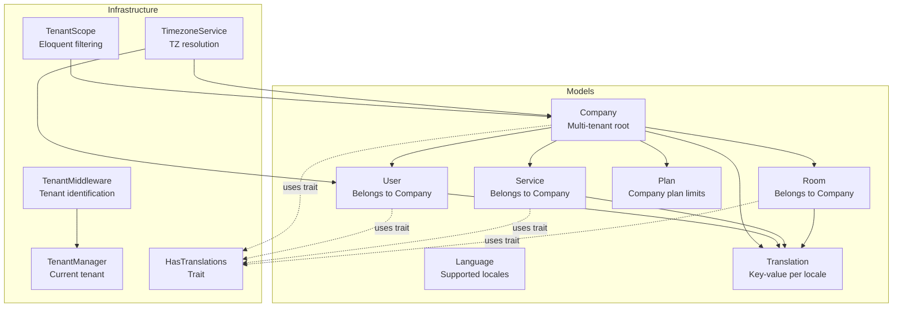
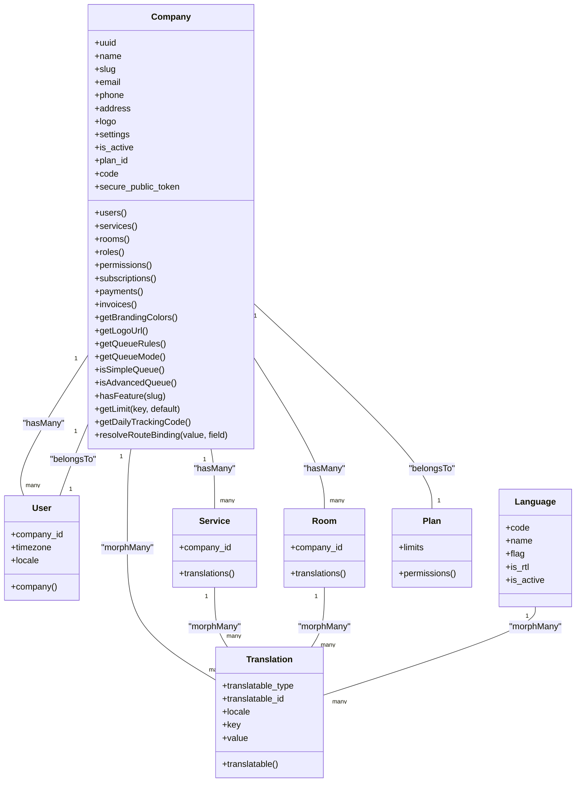
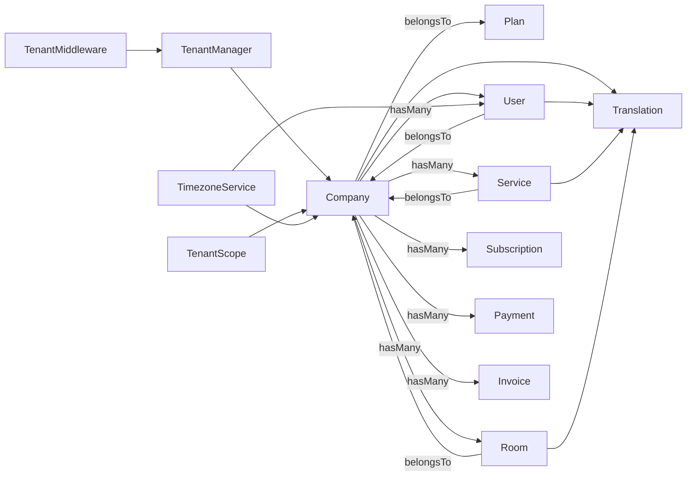

# System Configuration Entities

<cite>
**Referenced Files in This Document**
- [Company.php](file://app/Modules/Companies/Models/Company.php)
- [Language.php](file://app/Models/Language.php)
- [Translation.php](file://app/Models/Translation.php)
- [HasTranslations.php](file://app/Modules/Core/Traits/HasTranslations.php)
- [create_companies_table.php](file://database/migrations/0000_01_01_000000_create_companies_table.php)
- [create_languages_table.php](file://database/migrations/2026_04_06_124809_create_languages_table.php)
- [create_translations_table.php](file://database/migrations/2026_04_06_124810_create_translations_table.php)
- [TenantMiddleware.php](file://app/Http/Middleware/TenantMiddleware.php)
- [TenantScope.php](file://app/Modules/Core/Scopes/TenantScope.php)
- [TenantManager.php](file://app/Services/TenantManager.php)
- [TimezoneService.php](file://app/Services/TimezoneService.php)
- [add_timezone_to_users_table.php](file://database/migrations/2026_04_09_140000_add_timezone_to_users_table.php)
- [SetLocale.php](file://app/Http/Middleware/SetLocale.php)
- [Plan.php](file://app/Modules/Subscriptions/Models/Plan.php)
</cite>

## Table of Contents
1. [Introduction](#introduction)
2. [Project Structure](#project-structure)
3. [Core Components](#core-components)
4. [Architecture Overview](#architecture-overview)
5. [Detailed Component Analysis](#detailed-component-analysis)
6. [Dependency Analysis](#dependency-analysis)
7. [Performance Considerations](#performance-considerations)
8. [Troubleshooting Guide](#troubleshooting-guide)
9. [Conclusion](#conclusion)

## Introduction
This document provides comprehensive data model documentation for Noubtigo's system configuration entities. It focuses on:
- Company as the multi-tenant root entity with tenant isolation and configuration management
- Language and Translation models for multi-language support and content internationalization
- Company-specific settings, branding configurations, and tenant customization options
- Relationships between companies and associated users, services, rooms, and queue configurations
- Field definitions for company metadata, timezone settings, and localization preferences
- How system-wide configurations are inherited and overridden at the tenant level
- Configuration validation and default value management

## Project Structure
The configuration system spans models, migrations, middleware, traits, and services:
- Models define domain entities and relationships
- Migrations establish database schemas and constraints
- Middleware and services manage tenant identification and timezone resolution
- Traits enable translation capabilities on models

**Diagram sources**
- [Company.php:1-280](file://app/Modules/Companies/Models/Company.php#L1-L280)
- [Language.php:1-22](file://app/Models/Language.php#L1-L22)
- [Translation.php:1-26](file://app/Models/Translation.php#L1-L26)
- [HasTranslations.php:1-45](file://app/Modules/Core/Traits/HasTranslations.php#L1-L45)
- [TenantMiddleware.php:1-52](file://app/Http/Middleware/TenantMiddleware.php#L1-L52)
- [TenantScope.php:1-34](file://app/Modules/Core/Scopes/TenantScope.php#L1-L34)
- [TenantManager.php:1-46](file://app/Services/TenantManager.php#L1-L46)
- [TimezoneService.php:1-157](file://app/Services/TimezoneService.php#L1-L157)
- [Plan.php:1-66](file://app/Modules/Subscriptions/Models/Plan.php#L1-L66)

**Section sources**
- [Company.php:1-280](file://app/Modules/Companies/Models/Company.php#L1-L280)
- [Language.php:1-22](file://app/Models/Language.php#L1-L22)
- [Translation.php:1-26](file://app/Models/Translation.php#L1-L26)
- [HasTranslations.php:1-45](file://app/Modules/Core/Traits/HasTranslations.php#L1-L45)
- [create_companies_table.php:1-37](file://database/migrations/0000_01_01_000000_create_companies_table.php#L1-L37)
- [create_languages_table.php:1-33](file://database/migrations/2026_04_06_124809_create_languages_table.php#L1-L33)
- [create_translations_table.php:1-34](file://database/migrations/2026_04_06_124810_create_translations_table.php#L1-L34)
- [TenantMiddleware.php:1-52](file://app/Http/Middleware/TenantMiddleware.php#L1-L52)
- [TenantScope.php:1-34](file://app/Modules/Core/Scopes/TenantScope.php#L1-L34)
- [TenantManager.php:1-46](file://app/Services/TenantManager.php#L1-L46)
- [TimezoneService.php:1-157](file://app/Services/TimezoneService.php#L1-L157)
- [Plan.php:1-66](file://app/Modules/Subscriptions/Models/Plan.php#L1-L66)

## Core Components
This section documents the primary entities and their configuration capabilities.

### Company Model
Company is the multi-tenant root entity. It encapsulates:
- Identity and contact metadata
- Settings JSON for tenant customization
- Branding helpers and queue configuration helpers
- Relationships to users, services, rooms, roles, permissions, and subscriptions/payments
- Route binding via UUID with fallback to ID

Key characteristics:
- Uses soft deletes
- Auto-generates UUID, unique code, and secure token on creation
- Stores settings as JSON with defaults for branding colors, queue rules, and queue mode
- Enforces queue mode based on plan permissions
- Provides helpers for plan limits and daily tracking code

Validation and defaults:
- Defaults for settings keys are applied when missing
- Phone numbers are normalized via a dedicated setter
- Unique constraints enforced at database level for slug and code

**Section sources**
- [Company.php:1-280](file://app/Modules/Companies/Models/Company.php#L1-L280)
- [create_companies_table.php:14-26](file://database/migrations/0000_01_01_000000_create_companies_table.php#L14-L26)
- [TenantScope.php:18-32](file://app/Modules/Core/Scopes/TenantScope.php#L18-L32)

### Language Model
Defines supported locales with:
- Unique code and human-readable name
- Optional flag emoji
- Right-to-left indicator and active status
- Boolean casts for flags

Validation and defaults:
- Unique constraint on code
- Defaults for RTL and active flags

**Section sources**
- [Language.php:1-22](file://app/Models/Language.php#L1-L22)
- [create_languages_table.php:14-22](file://database/migrations/2026_04_06_124809_create_languages_table.php#L14-L22)

### Translation Model
Provides polymorphic translations keyed by locale and translation key:
- Polymorphic relation to translatable entities
- Unique composite key across translatable type/id, locale, and key
- Supports nullable values for optional overrides

Validation and uniqueness:
- Composite unique index prevents duplicates per locale/key per entity

**Section sources**
- [Translation.php:1-26](file://app/Models/Translation.php#L1-L26)
- [create_translations_table.php:14-23](file://database/migrations/2026_04_06_124810_create_translations_table.php#L14-L23)

### HasTranslations Trait
Enables translation retrieval and persistence on models:
- Provides translations morph-many relation
- getTranslation(key, locale?) resolves per-locale value or falls back to model attribute
- setTranslation(key, value, locale) creates or updates translation

Usage pattern:
- Applied to models that require localized content
- Integrates with application locale resolution

**Section sources**
- [HasTranslations.php:1-45](file://app/Modules/Core/Traits/HasTranslations.php#L1-L45)

### Tenant Management and Isolation
Tenant identification and scoping:
- TenantMiddleware identifies tenant by subdomain or authenticated user
- TenantManager stores the current tenant for scoping
- TenantScope automatically filters Eloquent queries by company_id unless bypassed for system admins

Timezone handling:
- TimezoneService resolves effective timezone via user, tenant, or UTC fallback
- Provides conversion utilities for storing and displaying local times

**Section sources**
- [TenantMiddleware.php:22-50](file://app/Http/Middleware/TenantMiddleware.php#L22-L50)
- [TenantManager.php:1-46](file://app/Services/TenantManager.php#L1-L46)
- [TenantScope.php:18-32](file://app/Modules/Core/Scopes/TenantScope.php#L18-L32)
- [TimezoneService.php:17-42](file://app/Services/TimezoneService.php#L17-L42)

### Localization Pipeline
Localization flow:
- SetLocale middleware determines locale from user preference, session, or Accept-Language header
- Supported locales validated against configured list
- Language records define active locales and RTL preferences
- Translations provide per-entity, per-locale content

**Section sources**
- [SetLocale.php:18-41](file://app/Http/Middleware/SetLocale.php#L18-L41)
- [Language.php:17-20](file://app/Models/Language.php#L17-L20)
- [HasTranslations.php:22-32](file://app/Modules/Core/Traits/HasTranslations.php#L22-L32)

## Architecture Overview
The configuration architecture combines multi-tenancy, localization, and flexible settings:

**Diagram sources**
- [Company.php:1-280](file://app/Modules/Companies/Models/Company.php#L1-L280)
- [User.php](file://app/Models/User.php)
- [Service.php](file://app/Modules/Services/Models/Service.php)
- [Room.php](file://app/Modules/Rooms/Models/Room.php)
- [Language.php:1-22](file://app/Models/Language.php#L1-L22)
- [Translation.php:1-26](file://app/Models/Translation.php#L1-L26)
- [Plan.php:1-66](file://app/Modules/Subscriptions/Models/Plan.php#L1-L66)

## Detailed Component Analysis

### Company Data Model
Company serves as the tenant root with:
- Identity fields: name, slug, email, phone, address
- Branding: logo path, settings JSON
- Operational: is_active, plan_id, code, secure_public_token
- Relationships: users, services, rooms, roles, permissions, subscriptions, payments, invoices
- Helpers: branding colors, logo URL, queue rules, queue mode enforcement, feature checks, plan limits, daily tracking code
- Route binding: accepts UUID or ID

Settings inheritance and overrides:
- Queue mode defaults to advanced but is forced to simple if plan lacks advanced permissions
- Queue rules and branding colors have sensible defaults when settings are missing
- Feature checks delegate to Plan permissions

Validation and defaults:
- UUID, code, and secure token generated on create if absent
- Phone number normalization via dedicated mutator
- Unique constraints on slug and code enforced at DB level

**Section sources**
- [Company.php:13-49](file://app/Modules/Companies/Models/Company.php#L13-L49)
- [Company.php:78-151](file://app/Modules/Companies/Models/Company.php#L78-L151)
- [Company.php:119-203](file://app/Modules/Companies/Models/Company.php#L119-L203)
- [Company.php:232-246](file://app/Modules/Companies/Models/Company.php#L232-L246)
- [create_companies_table.php:14-26](file://database/migrations/0000_01_01_000000_create_companies_table.php#L14-L26)
- [Plan.php:59-64](file://app/Modules/Subscriptions/Models/Plan.php#L59-L64)

### Language and Translation Models
Language defines supported locales with:
- Unique code, name, optional flag, RTL flag, active status
- Boolean casts for flags

Translation enables:
- Polymorphic localization across entities
- Per-locale, per-key values with unique constraint
- Fallback to model attributes when translation is missing

Localization pipeline:
- SetLocale middleware selects locale from user/session/header
- Supported locales validated against Language records
- Translations stored per entity type and ID

**Section sources**
- [Language.php:9-20](file://app/Models/Language.php#L9-L20)
- [Translation.php:10-24](file://app/Models/Translation.php#L10-L24)
- [HasTranslations.php:22-43](file://app/Modules/Core/Traits/HasTranslations.php#L22-L43)
- [SetLocale.php:20-38](file://app/Http/Middleware/SetLocale.php#L20-L38)
- [create_languages_table.php:14-22](file://database/migrations/2026_04_06_124809_create_languages_table.php#L14-L22)
- [create_translations_table.php:14-23](file://database/migrations/2026_04_06_124810_create_translations_table.php#L14-L23)

### Tenant Identification and Scope
TenantMiddleware:
- Identifies tenant by subdomain (slug) or authenticated user's company
- Sets TenantManager for subsequent scoping

TenantScope:
- Applies automatic company_id filtering to queries
- Bypasses for system administrators

TenantManager:
- Holds current tenant instance and ID
- Provides accessors for downstream services

**Section sources**
- [TenantMiddleware.php:22-50](file://app/Http/Middleware/TenantMiddleware.php#L22-L50)
- [TenantScope.php:18-32](file://app/Modules/Core/Scopes/TenantScope.php#L18-L32)
- [TenantManager.php:17-44](file://app/Services/TenantManager.php#L17-L44)

### Timezone Resolution
TimezoneService:
- Resolves effective timezone via user, tenant, or UTC fallback
- Converts between local time and UTC for storage/display
- Provides helpers for local "now", today's range, and arbitrary date ranges

User timezone column:
- Added to users with prepopulation from company timezone
- Allows per-user override of tenant default

**Section sources**
- [TimezoneService.php:17-42](file://app/Services/TimezoneService.php#L17-L42)
- [TimezoneService.php:55-84](file://app/Services/TimezoneService.php#L55-L84)
- [TimezoneService.php:108-136](file://app/Services/TimezoneService.php#L108-L136)
- [add_timezone_to_users_table.php:15-39](file://database/migrations/2026_04_09_140000_add_timezone_to_users_table.php#L15-L39)

### Queue Configuration Helpers
Company provides queue configuration helpers:
- getQueueRules returns priority scoring defaults
- getQueueMode enforces plan-compliant queue mode
- isSimpleQueue/isAdvancedQueue convenience checks

These helpers ensure queue behavior respects plan permissions while allowing tenant-level customization within those bounds.

**Section sources**
- [Company.php:127-167](file://app/Modules/Companies/Models/Company.php#L127-L167)

### Branding and Settings
Company branding helpers:
- getBrandingColors returns primary/secondary/gradient defaults when settings are missing
- getLogoUrl resolves storage URL or fallback placeholder

Settings JSON:
- Centralized tenant customization point
- Used by branding, queue, and other features

**Section sources**
- [Company.php:78-97](file://app/Modules/Companies/Models/Company.php#L78-L97)
- [Company.php:13-31](file://app/Modules/Companies/Models/Company.php#L13-L31)

### Relationships and Inheritance
Company relationships:
- Users, Services, Rooms belong to Company
- Roles and Permissions are company-scoped via pivot tables
- Subscriptions, Payments, Invoices belong to Company

Plan inheritance:
- Company.getLimit delegates to Plan.limits
- Company.hasFeature checks Plan.permissions
- Queue mode enforcement depends on Plan permissions

**Section sources**
- [Company.php:119-203](file://app/Modules/Companies/Models/Company.php#L119-L203)
- [Plan.php:53-64](file://app/Modules/Subscriptions/Models/Plan.php#L53-L64)

## Dependency Analysis
The configuration system exhibits clear separation of concerns:
- Models define entities and relationships
- Middleware and services manage cross-cutting concerns (tenant, timezone)
- Traits encapsulate reusable functionality (translations)
- Migrations define schemas and constraints

**Diagram sources**
- [Company.php:102-203](file://app/Modules/Companies/Models/Company.php#L102-L203)
- [Plan.php:29-40](file://app/Modules/Subscriptions/Models/Plan.php#L29-L40)
- [User.php](file://app/Models/User.php)
- [Service.php](file://app/Modules/Services/Models/Service.php)
- [Room.php](file://app/Modules/Rooms/Models/Room.php)
- [Translation.php:21-24](file://app/Models/Translation.php#L21-L24)
- [TenantMiddleware.php:24-43](file://app/Http/Middleware/TenantMiddleware.php#L24-L43)
- [TenantScope.php:30-31](file://app/Modules/Core/Scopes/TenantScope.php#L30-L31)
- [TimezoneService.php:17-42](file://app/Services/TimezoneService.php#L17-L42)

**Section sources**
- [Company.php:102-203](file://app/Modules/Companies/Models/Company.php#L102-L203)
- [Plan.php:29-40](file://app/Modules/Subscriptions/Models/Plan.php#L29-L40)
- [Translation.php:21-24](file://app/Models/Translation.php#L21-L24)
- [TenantMiddleware.php:24-43](file://app/Http/Middleware/TenantMiddleware.php#L24-L43)
- [TenantScope.php:30-31](file://app/Modules/Core/Scopes/TenantScope.php#L30-L31)
- [TimezoneService.php:17-42](file://app/Services/TimezoneService.php#L17-L42)

## Performance Considerations
- Use TenantScope to avoid N+1 queries by ensuring company_id filtering is applied automatically
- Cache frequently accessed plan limits and queue configurations at the tenant level
- Normalize phone numbers once during input to prevent repeated processing
- Index translations by locale and key for fast lookups
- Avoid excessive translation writes; batch updates when possible

## Troubleshooting Guide
Common issues and resolutions:
- Missing translations: Ensure unique composite key exists and locale is supported; check HasTranslations fallback behavior
- Incorrect tenant isolation: Verify TenantMiddleware sets TenantManager and TenantScope applies company_id filtering
- Unexpected queue mode: Confirm plan permissions and Company.getQueueMode logic
- Timezone mismatches: Validate TimezoneService resolution chain and user/company timezone precedence
- Duplicate company identifiers: Confirm unique constraints on slug and code; review Company creation hooks

**Section sources**
- [create_translations_table.php:22-23](file://database/migrations/2026_04_06_124810_create_translations_table.php#L22-L23)
- [TenantMiddleware.php:22-50](file://app/Http/Middleware/TenantMiddleware.php#L22-L50)
- [TenantScope.php:18-32](file://app/Modules/Core/Scopes/TenantScope.php#L18-L32)
- [Company.php:141-151](file://app/Modules/Companies/Models/Company.php#L141-L151)
- [TimezoneService.php:17-42](file://app/Services/TimezoneService.php#L17-L42)
- [create_companies_table.php:17-26](file://database/migrations/0000_01_01_000000_create_companies_table.php#L17-L26)

## Conclusion
Noubtigo's configuration system centers on the Company model as the multi-tenant root, augmented by robust localization and flexible settings management. TenantMiddleware and TenantScope enforce isolation, while TimezoneService ensures consistent temporal behavior across users and tenants. Language and Translation models provide scalable internationalization, and Company helpers encapsulate plan-aware behaviors for queue and branding. Together, these components deliver a maintainable, extensible foundation for tenant customization and system-wide configuration management.