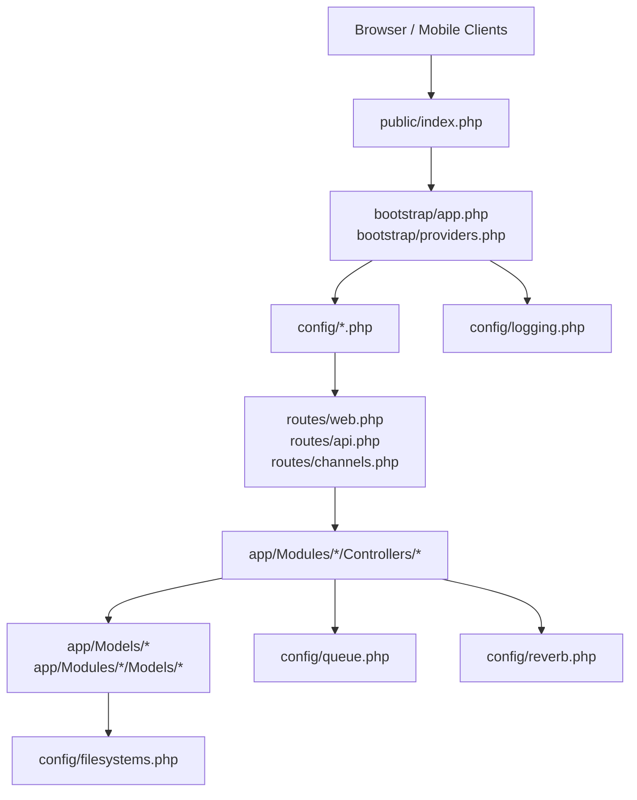
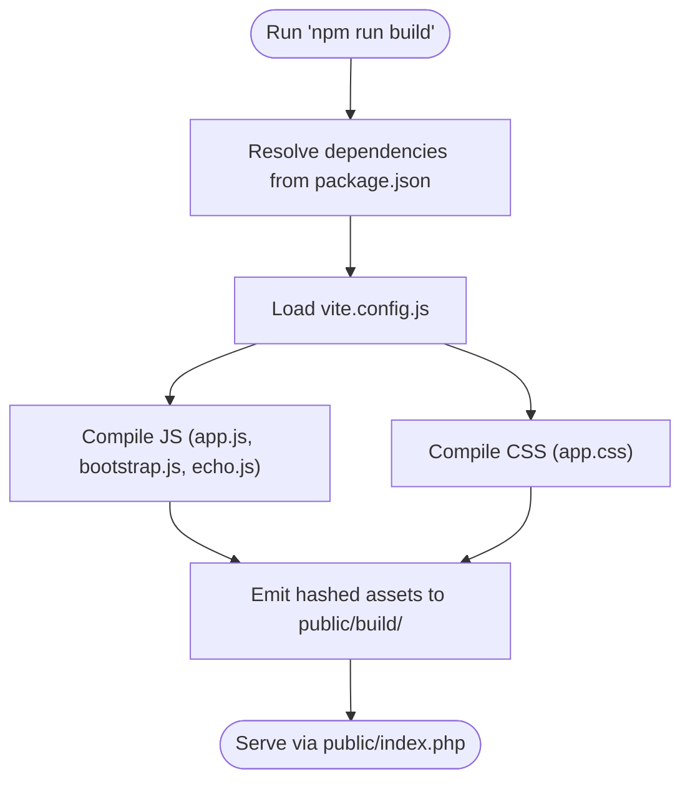
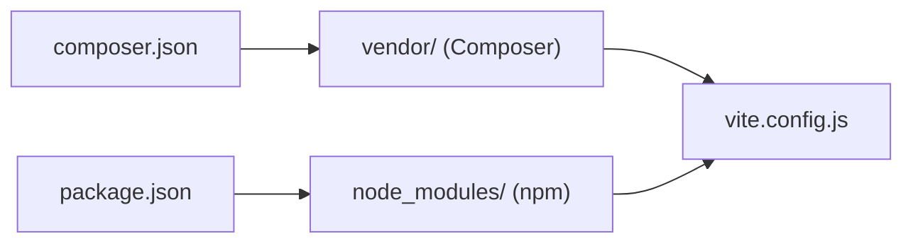
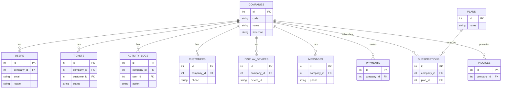
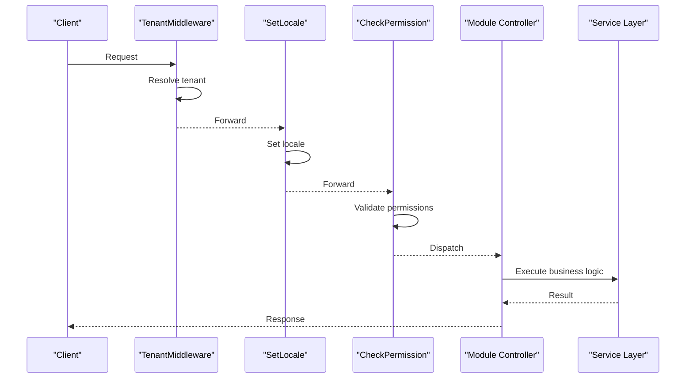

# Deployment & Configuration

<cite>
**Referenced Files in This Document**
- [README.md](file://README.md)
- [composer.json](file://composer.json)
- [package.json](file://package.json)
- [vite.config.js](file://vite.config.js)
- [app.php](file://bootstrap/app.php)
- [providers.php](file://bootstrap/providers.php)
- [app.php](file://config/app.php)
- [auth.php](file://config/auth.php)
- [cache.php](file://config/cache.php)
- [database.php](file://config/database.php)
- [filesystems.php](file://config/filesystems.php)
- [logging.php](file://config/logging.php)
- [mail.php](file://config/mail.php)
- [queue.php](file://config/queue.php)
- [sanctum.php](file://config/sanctum.php)
- [services.php](file://config/services.php)
- [session.php](file://config/session.php)
- [reverb.php](file://config/reverb.php)
- [web.php](file://routes/web.php)
- [api.php](file://routes/api.php)
- [channels.php](file://routes/channels.php)
- [index.php](file://public/index.php)
- [.htaccess](file://public/.htaccess)
- [robots.txt](file://public/robots.txt)
- [manifest.json](file://public/manifest.json)
- [service-worker.js](file://public/service-worker.js)
- [Company.php](file://app/Modules/Companies/Models/Company.php)
- [CompanySettingsController.php](file://app/Modules/Companies/Controllers/CompanySettingsController.php)
- [Ticket.php](file://app/Modules/Queue/Models/Ticket.php)
- [ActivityLog.php](file://app/Modules/Queue/Models/ActivityLog.php)
- [Customer.php](file://app/Modules/Customers/Models/Customer.php)
- [DisplayDevice.php](file://app/Modules/Displays/Models/DisplayDevice.php)
- [Message.php](file://app/Modules/WhatsApp/Models/Message.php)
- [Invoice.php](file://app/Modules/Payments/Models/Invoice.php)
- [Subscription.php](file://app/Modules/Subscriptions/Models/Plan.php)
- [User.php](file://app/Models/User.php)
- [TenantManager.php](file://app/Services/TenantManager.php)
- [TenantScope.php](file://app/Modules/Core/Scopes/TenantScope.php)
- [BelongsToTenant.php](file://app/Modules/Core/Traits/BelongsToTenant.php)
- [HasRBAC.php](file://app/Modules/Core/Traits/HasRBAC.php)
- [HasTranslations.php](file://app/Modules/Core/Traits/HasTranslations.php)
- [QueueService.php](file://app/Modules/Queue/Services/QueueService.php)
- [PaymentLifecycleService.php](file://app/Modules/Payments/Services/PaymentLifecycleService.php)
- [WhatsAppService.php](file://app/Modules/WhatsApp/Services/WhatsAppService.php)
- [LoginController.php](file://app/Modules/Auth/Controllers/LoginController.php)
- [RegisterController.php](file://app/Modules/Auth/Controllers/RegisterController.php)
- [MakeSuperAdmin.php](file://app/Console/Commands/MakeSuperAdmin.php)
- [AutoCheckInAppointments.php](file://app/Console/Commands/AutoCheckInAppointments.php)
- [SetLocale.php](file://app/Http/Middleware/SetLocale.php)
- [TenantMiddleware.php](file://app/Http/Middleware/TenantMiddleware.php)
- [CheckPermission.php](file://app/Http/Middleware/CheckPermission.php)
- [CheckSubscriptionValid.php](file://app/Http/Middleware/CheckSubscriptionValid.php)
- [EnsurePasswordIsChanged.php](file://app/Http/Middleware/EnsurePasswordIsChanged.php)
- [EnsureQueueMode.php](file://app/Http/Middleware/EnsureQueueMode.php)
- [SystemAdminMiddleware.php](file://app/Http/Middleware/SystemAdminMiddleware.php)
- [0000_01_01_000000_create_companies_table.php](file://database/migrations/0000_01_01_000000_create_companies_table.php)
- [0001_01_01_000001_create_users_table.php](file://database/migrations/0001_01_01_000001_create_users_table.php)
- [0001_01_01_000002_create_cache_table.php](file://database/migrations/0001_01_01_000002_create_cache_table.php)
- [0001_01_01_000003_create_jobs_table.php](file://database/migrations/0001_01_01_000003_create_jobs_table.php)
- [2026_04_13_000001_add_code_to_companies_table.php](file://database/migrations/2026_04_13_000001_add_code_to_companies_table.php)
- [2026_04_13_000002_add_whatsapp_fields_to_customers_table.php](file://database/migrations/2026_04_13_000002_add_whatsapp_fields_to_customers_table.php)
- [2026_04_13_000003_create_messages_table.php](file://database/migrations/2026_04_13_000003_create_messages_table.php)
- [2026_04_13_175428_create_plans_table.php](file://database/migrations/2026_04_13_175428_create_plans_table.php)
- [2026_04_13_175436_add_plan_id_to_companies_table.php](file://database/migrations/2026_04_13_175436_add_plan_id_to_companies_table.php)
- [2026_05_22_081718_create_payments_table.php](file://database/migrations/2026_05_22_081718_create_payments_table.php)
- [2026_05_22_081729_create_payment_transactions_table.php](file://database/migrations/2026_05_22_081729_create_payment_transactions_table.php)
- [2026_05_22_081731_create_invoices_table.php](file://database/migrations/2026_05_22_081731_create_invoices_table.php)
- [2026_05_22_081733_create_invoice_items_table.php](file://database/migrations/2026_05_22_081733_create_invoice_items_table.php)
- [2026_05_22_081731_create_subscriptions_table.php](file://database/migrations/2026_05_22_081731_create_subscriptions_table.php)
- [2026_05_29_145548_add_requires_password_change_to_users_table.php](file://database/migrations/2026_05_29_145548_add_requires_password_change_to_users_table.php)
- [2026_06_04_091653_add_on_hold_status_to_tickets_status_enum.php](file://database/migrations/2026_06_04_091653_add_on_hold_status_to_tickets_status_enum.php)
- [2026_06_05_070939_add_hold_cancelled_status_to_tickets_status_enum.php](file://database/migrations/2026_06_05_070939_add_hold_cancelled_status_to_tickets_status_enum.php)
- [2026_06_08_080000_add_search_fields_to_customers_table.php](file://database/migrations/2026_06_08_080000_add_search_fields_to_customers_table.php)
- [2026_06_09_071909_add_cancellation_fields_to_tickets_table.php](file://database/migrations/2026_06_09_071909_add_cancellation_fields_to_tickets_table.php)
- [DatabaseSeeder.php](file://database/seeders/DatabaseSeeder.php)
- [LanguageSeeder.php](file://database/seeders/LanguageSeeder.php)
- [PlanSeeder.php](file://database/seeders/PlanSeeder.php)
- [RBACSeeder.php](file://database/seeders/RBACSeeder.php)
- [RolesAndPermissionsSeeder.php](file://database/seeders/RolesAndPermissionsSeeder.php)
- [test_db.php](file://test_db.php)
</cite>

## Table of Contents
1. [Introduction](#introduction)
2. [Project Structure](#project-structure)
3. [Core Components](#core-components)
4. [Architecture Overview](#architecture-overview)
5. [Detailed Component Analysis](#detailed-component-analysis)
6. [Dependency Analysis](#dependency-analysis)
7. [Performance Considerations](#performance-considerations)
8. [Troubleshooting Guide](#troubleshooting-guide)
9. [Conclusion](#conclusion)
10. [Appendices](#appendices)

## Introduction
This document provides comprehensive deployment and configuration guidance for Noubtigo, a Laravel-based multi-tenant SaaS platform. It covers production environment requirements, server prerequisites, PHP extensions, database configuration, deployment steps (environment setup, dependency installation, asset compilation, cache optimization), configuration management (environment variables, database, services), frontend build and optimization via Vite, security and SSL recommendations, performance tuning, backup and monitoring/logging strategies, scaling and load balancing, troubleshooting, and containerization/cloud deployment options.

## Project Structure
Noubtigo follows a modular Laravel architecture with tenant scoping, RBAC, queues, payments, subscriptions, and real-time features. The repository includes:
- Application core under app/, modules under app/Modules/, and shared traits/scopes under app/Modules/Core/
- Configuration under config/ for app, auth, cache, database, filesystems, logging, mail, queue, sanctum, services, session, reverb
- Frontend assets under resources/ and compiled static assets under public/
- Database migrations and seeders under database/
- Routes under routes/ and HTTP entry point under public/index.php
- Composer and npm dependencies declared in composer.json and package.json respectively

```mermaid
graph TB
subgraph "Public Web Root"
PUB["public/index.php"]
HTACCESS[".htaccess"]
ROBOTS["robots.txt"]
MANIFEST["manifest.json"]
SW["service-worker.js"]
end
subgraph "Bootstrap"
BOOTAPP["bootstrap/app.php"]
BOOTPROV["bootstrap/providers.php"]
end
subgraph "Config"
CFG_APP["config/app.php"]
CFG_AUTH["config/auth.php"]
CFG_CACHE["config/cache.php"]
CFG_DB["config/database.php"]
CFG_FS["config/filesystems.php"]
CFG_LOG["config/logging.php"]
CFG_MAIL["config/mail.php"]
CFG_QUEUE["config/queue.php"]
CFG_SANC["config/sanctum.php"]
CFG_SERVICES["config/services.php"]
CFG_SESSION["config/session.php"]
CFG_REV["config/reverb.php"]
end
subgraph "Routes"
ROUTE_WEB["routes/web.php"]
ROUTE_API["routes/api.php"]
ROUTE_CHAN["routes/channels.php"]
end
subgraph "App"
MODELS["app/Models/*"]
MODULES["app/Modules/*"]
SERVICES["app/Services/*"]
MIDDLEWARE["app/Http/Middleware/*"]
end
subgraph "Resources"
RES_CSS["resources/css/app.css"]
RES_JS["resources/js/app.js"]
RES_BOOT["resources/js/bootstrap.js"]
RES_ECHO["resources/js/echo.js"]
end
subgraph "Build"
VITE["vite.config.js"]
PKG["package.json"]
COMPOSER["composer.json"]
end
PUB --> BOOTAPP
BOOTAPP --> BOOTPROV
BOOTAPP --> CFG_APP
CFG_APP --> CFG_AUTH
CFG_APP --> CFG_CACHE
CFG_APP --> CFG_DB
CFG_APP --> CFG_FS
CFG_APP --> CFG_LOG
CFG_APP --> CFG_MAIL
CFG_APP --> CFG_QUEUE
CFG_APP --> CFG_SANC
CFG_APP --> CFG_SERVICES
CFG_APP --> CFG_SESSION
CFG_APP --> CFG_REV
ROUTE_WEB --> MODULES
ROUTE_API --> MODULES
ROUTE_CHAN --> CFG_REV
RES_CSS --> VITE
RES_JS --> VITE
RES_BOOT --> VITE
RES_ECHO --> VITE
VITE --> PKG
VITE --> COMPOSER
```

**Diagram sources**
- [index.php:1-50](file://public/index.php#L1-L50)
- [app.php:1-60](file://bootstrap/app.php#L1-L60)
- [providers.php:1-60](file://bootstrap/providers.php#L1-L60)
- [app.php:1-120](file://config/app.php#L1-L120)
- [auth.php:1-120](file://config/auth.php#L1-L120)
- [cache.php:1-120](file://config/cache.php#L1-L120)
- [database.php:1-120](file://config/database.php#L1-L120)
- [filesystems.php:1-120](file://config/filesystems.php#L1-L120)
- [logging.php:1-120](file://config/logging.php#L1-L120)
- [mail.php:1-120](file://config/mail.php#L1-L120)
- [queue.php:1-120](file://config/queue.php#L1-L120)
- [sanctum.php:1-120](file://config/sanctum.php#L1-L120)
- [services.php:1-120](file://config/services.php#L1-L120)
- [session.php:1-120](file://config/session.php#L1-L120)
- [reverb.php:1-120](file://config/reverb.php#L1-L120)
- [web.php:1-120](file://routes/web.php#L1-L120)
- [api.php:1-120](file://routes/api.php#L1-L120)
- [channels.php:1-120](file://routes/channels.php#L1-L120)
- [vite.config.js:1-120](file://vite.config.js#L1-L120)
- [package.json:1-120](file://package.json#L1-L120)
- [composer.json:1-120](file://composer.json#L1-L120)

**Section sources**
- [README.md:1-200](file://README.md#L1-L200)
- [composer.json:1-200](file://composer.json#L1-L200)
- [package.json:1-200](file://package.json#L1-L200)
- [vite.config.js:1-200](file://vite.config.js#L1-L200)
- [app.php:1-120](file://bootstrap/app.php#L1-L120)
- [providers.php:1-120](file://bootstrap/providers.php#L1-L120)
- [app.php:1-200](file://config/app.php#L1-L200)
- [auth.php:1-200](file://config/auth.php#L1-L200)
- [cache.php:1-200](file://config/cache.php#L1-L200)
- [database.php:1-200](file://config/database.php#L1-L200)
- [filesystems.php:1-200](file://config/filesystems.php#L1-L200)
- [logging.php:1-200](file://config/logging.php#L1-L200)
- [mail.php:1-200](file://config/mail.php#L1-L200)
- [queue.php:1-200](file://config/queue.php#L1-L200)
- [sanctum.php:1-200](file://config/sanctum.php#L1-L200)
- [services.php:1-200](file://config/services.php#L1-L200)
- [session.php:1-200](file://config/session.php#L1-L200)
- [reverb.php:1-200](file://config/reverb.php#L1-L200)
- [web.php:1-200](file://routes/web.php#L1-L200)
- [api.php:1-200](file://routes/api.php#L1-L200)
- [channels.php:1-200](file://routes/channels.php#L1-L200)

## Core Components
- Multi-tenant architecture with tenant scoping and per-tenant isolation
- RBAC (Role-Based Access Control) with tenant-aware permissions
- Queuing and ticketing system with activity logs
- Payments, invoicing, and subscription lifecycle
- Real-time notifications via Laravel Reverb
- WhatsApp integration for customer communication
- Localization support with language and translation models
- Authentication and session management with Sanctum
- Asset pipeline powered by Vite with frontend JavaScript/CSS

Key configuration touchpoints:
- Environment variables for database, cache, queue, mail, and Reverb
- Session and cookie security settings
- Logging levels and handlers
- Filesystems for local/public storage and optional cloud storage
- Queue drivers (database/Redis recommended for production)
- Reverb driver selection (BROADCAST_DRIVER, QUEUE_CONNECTION)

**Section sources**
- [TenantManager.php:1-200](file://app/Services/TenantManager.php#L1-L200)
- [TenantScope.php:1-200](file://app/Modules/Core/Scopes/TenantScope.php#L1-L200)
- [BelongsToTenant.php:1-200](file://app/Modules/Core/Traits/BelongsToTenant.php#L1-L200)
- [HasRBAC.php:1-200](file://app/Modules/Core/Traits/HasRBAC.php#L1-L200)
- [HasTranslations.php:1-200](file://app/Modules/Core/Traits/HasTranslations.php#L1-L200)
- [QueueService.php:1-200](file://app/Modules/Queue/Services/QueueService.php#L1-L200)
- [PaymentLifecycleService.php:1-200](file://app/Modules/Payments/Services/PaymentLifecycleService.php#L1-L200)
- [WhatsAppService.php:1-200](file://app/Modules/WhatsApp/Services/WhatsAppService.php#L1-L200)
- [database.php:1-200](file://config/database.php#L1-L200)
- [cache.php:1-200](file://config/cache.php#L1-L200)
- [queue.php:1-200](file://config/queue.php#L1-L200)
- [logging.php:1-200](file://config/logging.php#L1-L200)
- [filesystems.php:1-200](file://config/filesystems.php#L1-L200)
- [reverb.php:1-200](file://config/reverb.php#L1-L200)
- [sanctum.php:1-200](file://config/sanctum.php#L1-L200)
- [session.php:1-200](file://config/session.php#L1-L200)

## Architecture Overview
Noubtigo’s runtime architecture integrates a Laravel backend with a modern frontend built via Vite. Requests enter through public/index.php, pass through the bootstrap and configuration layers, and route to module-specific controllers. Data persistence relies on Eloquent models with tenant scoping and RBAC. Queues handle asynchronous tasks, while Reverb powers real-time events. Assets are compiled and served statically.

**Diagram sources**
- [index.php:1-120](file://public/index.php#L1-L120)
- [app.php:1-120](file://bootstrap/app.php#L1-L120)
- [providers.php:1-120](file://bootstrap/providers.php#L1-L120)
- [app.php:1-120](file://config/app.php#L1-L120)
- [web.php:1-120](file://routes/web.php#L1-L120)
- [api.php:1-120](file://routes/api.php#L1-L120)
- [channels.php:1-120](file://routes/channels.php#L1-L120)
- [queue.php:1-120](file://config/queue.php#L1-L120)
- [reverb.php:1-120](file://config/reverb.php#L1-L120)
- [filesystems.php:1-120](file://config/filesystems.php#L1-L120)
- [logging.php:1-120](file://config/logging.php#L1-L120)

## Detailed Component Analysis

### Production Environment Requirements
- Operating System: Linux (Ubuntu/Debian/CentOS) recommended for production stability
- Web Server: Nginx or Apache with PHP-FPM
- PHP: 8.1+ (ensure required extensions below)
- Database: MySQL 8.0+, PostgreSQL 13+, or MariaDB 10.5+
- Queue Backend: Redis recommended for production scalability
- Optional: Elasticsearch for advanced search (if enabled), Cloud storage SDKs for file uploads

Required PHP extensions (common baseline):
- bcmath
- ctype
- curl
- dom
- fileinfo
- gd or imagick
- json
- mbstring
- openssl
- pcntl
- pdo, pdo_mysql or pdo_pgsql
- tokenizer
- xml
- zip
- redis (when using Redis)
- pcntl (for queue workers)

**Section sources**
- [composer.json:1-200](file://composer.json#L1-L200)
- [database.php:1-200](file://config/database.php#L1-L200)

### Server Specifications (Baseline)
- CPU: Minimum 2 vCPUs; scale to 4+ vCPUs for concurrent queues and real-time features
- Memory: Minimum 4 GB RAM; scale to 8–16 GB for larger tenants and queues
- Disk: SSD NVMe preferred; 50 GB minimum, expandable for logs and media
- Network: 100 Mbps symmetric bandwidth minimum; higher for real-time traffic
- TLS: ACME automation (Certbot) or managed certificates

### Database Configuration
- Engine: InnoDB (MySQL) or equivalent (PostgreSQL)
- Collation: utf8mb4_unicode_ci or appropriate Unicode collation
- Connection pooling: Enable persistent connections if supported
- Replication: Configure read replicas for reporting and analytics
- Backups: Automated logical backups (mysqldump/pg_dump) with point-in-time recovery

Key configuration files:
- config/database.php: connection defaults and environment overrides
- config/cache.php: cache stores (database/redis)
- config/queue.php: queue driver and retry/backoff policies

**Section sources**
- [database.php:1-200](file://config/database.php#L1-L200)
- [cache.php:1-200](file://config/cache.php#L1-L200)
- [queue.php:1-200](file://config/queue.php#L1-L200)

### Environment Setup and Dependencies
- Clone repository and install PHP dependencies via Composer
- Install Node.js dependencies via npm/yarn
- Generate application key and set APP_KEY
- Configure .env with database credentials, cache, queue, mail, and Reverb settings
- Run database migrations and seed initial data

Recommended commands (high level):
- composer install --no-dev --optimize-autoloader
- npm ci && npm run build
- php artisan key:generate
- php artisan migrate --seed
- php artisan storage:link (if using local storage)

**Section sources**
- [composer.json:1-200](file://composer.json#L1-L200)
- [package.json:1-200](file://package.json#L1-L200)
- [app.php:1-200](file://config/app.php#L1-L200)
- [database.php:1-200](file://config/database.php#L1-L200)

### Asset Build Process Using Vite
- Source files: resources/js/app.js, resources/css/app.css, resources/js/bootstrap.js, resources/js/echo.js
- Build command: npm run build
- Output: public/build/ (via Vite default), served via Blade or public web root
- Manifest handling: Use Laravel Mix/Vite helpers to resolve hashed asset filenames

**Diagram sources**
- [vite.config.js:1-200](file://vite.config.js#L1-L200)
- [package.json:1-200](file://package.json#L1-L200)
- [index.php:1-120](file://public/index.php#L1-L120)

**Section sources**
- [vite.config.js:1-200](file://vite.config.js#L1-L200)
- [package.json:1-200](file://package.json#L1-L200)
- [index.php:1-120](file://public/index.php#L1-L120)

### Cache Optimization
- Drivers: Redis recommended for production; fallback to database cache for minimal setups
- Cache keys: Use tenant-aware prefixes to avoid cross-tenant collisions
- TTL: Tune expiration for frequently changing data (RBAC, translations)
- Warm-up: Preload essential caches after deployments

**Section sources**
- [cache.php:1-200](file://config/cache.php#L1-L200)
- [BelongsToTenant.php:1-200](file://app/Modules/Core/Traits/BelongsToTenant.php#L1-L200)

### Security Configuration Recommendations
- HTTPS: Enforce HTTPS with HSTS and modern TLS ciphers
- Cookies: Secure, SameSite, HttpOnly flags; configure SESSION_SECURE_COOKIE and SESSION_SAME_SITE
- CSRF: Laravel CSRF middleware active on web routes
- XSS: Content-Security-Policy headers; sanitize user-generated content
- Rate Limiting: Apply rate limits on authentication and sensitive endpoints
- Secrets: Store secrets in environment variables; never commit to SCM
- Reverb: Restrict broadcasting channels; use private channels with authorization

**Section sources**
- [session.php:1-200](file://config/session.php#L1-L200)
- [sanctum.php:1-200](file://config/sanctum.php#L1-L200)
- [reverb.php:1-200](file://config/reverb.php#L1-L200)
- [web.php:1-200](file://routes/web.php#L1-L200)

### SSL Setup
- Obtain certificate via Let’s Encrypt or managed provider
- Redirect HTTP to HTTPS at web server level
- Configure OCSP stapling and strong cipher suites
- Use cert-manager or similar for automated renewal

[No sources needed since this section provides general guidance]

### Performance Tuning
- PHP-FPM: Adjust pm.* settings for worker processes and dynamic spawning
- OPcache: Enable and tune opcode caching
- Database: Indexes on tenant_id, foreign keys, and frequently filtered columns
- Queue: Separate queues per priority; scale workers horizontally
- CDN: Serve static assets via CDN; enable browser caching headers
- Gzip/Brotli: Enable compression at web server level

[No sources needed since this section provides general guidance]

### Backup Strategies
- Database: Logical backups (mysqldump/pg_dump) with retention policy
- Files: Versioned backups of storage/app/public and logs
- Incremental/differential: Combine with full weekly backups
- Offsite: Store encrypted backups off-site or in cloud storage
- Restore drills: Periodic restore verification

[No sources needed since this section provides general guidance]

### Monitoring and Logging
- Centralized logging: Export logs to ELK/Graylog/Splunk or cloud logging
- Metrics: Track response times, throughput, error rates, queue backlog
- Alerts: Threshold-based alerts for disk, memory, queue delays, and downtime
- Health checks: Expose readiness/liveness endpoints

**Section sources**
- [logging.php:1-200](file://config/logging.php#L1-L200)

### Scaling and Load Balancing
- Stateless application servers; persist sessions/cache externally
- Horizontal scaling: Add application nodes behind a load balancer
- Sticky sessions: Not required if using externalized session/cache
- Queue scaling: Scale queue workers independently
- CDN and autoscaling: Use auto-scaling groups for burst capacity

[No sources needed since this section provides general guidance]

### Troubleshooting Guide
Common deployment issues and resolutions:
- Composer autoload errors after deploy: Run optimized install and clear caches
- Missing environment variables: Verify .env presence and permissions
- Database migration failures: Check connectivity, user privileges, and timezone settings
- Queue workers not processing: Confirm driver configuration and supervisor setup
- Asset 404 errors: Rebuild assets and confirm public/index.php routing
- Reverb/broadcasting issues: Validate BROADCAST_DRIVER and Reverb credentials
- Cache invalidation: Clear cache and warm up on deploy
- File upload failures: Verify storage permissions and filesystem configuration

**Section sources**
- [composer.json:1-200](file://composer.json#L1-L200)
- [database.php:1-200](file://config/database.php#L1-L200)
- [queue.php:1-200](file://config/queue.php#L1-L200)
- [logging.php:1-200](file://config/logging.php#L1-L200)
- [filesystems.php:1-200](file://config/filesystems.php#L1-L200)
- [reverb.php:1-200](file://config/reverb.php#L1-L200)

### Docker Containerization Options
- Multi-stage build: Build assets in Node stage, copy to PHP runtime image
- Base images: php:8.1-fpm-alpine or php:8.1-apache-bookworm
- Dependencies: Install PHP extensions and system packages during build
- Entrypoint: Start PHP-FPM and web server; run queue workers as separate processes
- Volumes: Mount storage/app/public and logs as volumes
- Environment: Pass .env via build args or mounted file

[No sources needed since this section provides general guidance]

### Cloud Deployment Strategies
- Platform: AWS, GCP, Azure with managed databases and load balancing
- Containers: ECS/EKS/GKE with horizontal pod autoscaling
- Serverless: API Gateway + Lambda for specific microservices (not recommended for long-running queues)
- CI/CD: Automated builds with artifact promotion and blue/green deployments
- Observability: Managed APM, logging, and alerting services

[No sources needed since this section provides general guidance]

## Dependency Analysis
Noubtigo leverages Laravel ecosystem packages and optional integrations. Core dependencies include framework, queue, broadcasting, Sanctum, and optional payment and notification libraries. Frontend dependencies include Vite, Tailwind, Axios, and Socket.IO client.

**Diagram sources**
- [composer.json:1-200](file://composer.json#L1-L200)
- [package.json:1-200](file://package.json#L1-L200)
- [vite.config.js:1-200](file://vite.config.js#L1-L200)

**Section sources**
- [composer.json:1-200](file://composer.json#L1-L200)
- [package.json:1-200](file://package.json#L1-L200)
- [vite.config.js:1-200](file://vite.config.js#L1-L200)

## Performance Considerations
- Use Redis for cache and queues; enable AOF persistence
- Optimize database queries with tenant scopes and proper indexing
- Minimize heavy synchronous operations; leverage queues
- Enable static asset caching and CDN delivery
- Monitor queue backlog and worker concurrency

[No sources needed since this section provides general guidance]

## Troubleshooting Guide
- Composer install fails: Clear vendor/ and reinstall; check PHP version and extensions
- Migration errors: Validate DB credentials and user grants; ensure timezone is set
- Queue workers idle: Confirm QUEUE_CONNECTION and schedule periodic health checks
- Broadcasting not working: Check BROADCAST_DRIVER and Reverb credentials
- Asset not updating: Clear old assets and rebuild; verify manifest resolution

**Section sources**
- [composer.json:1-200](file://composer.json#L1-L200)
- [database.php:1-200](file://config/database.php#L1-L200)
- [queue.php:1-200](file://config/queue.php#L1-L200)
- [reverb.php:1-200](file://config/reverb.php#L1-L200)

## Conclusion
Deploying Noubtigo in production requires careful attention to PHP stack, database, queue, and real-time components. Use Redis for cache and queues, enforce HTTPS, and implement robust monitoring and backups. Leverage Vite for frontend builds, and adopt scalable patterns with load balancing and horizontal scaling. Follow the troubleshooting steps to resolve common issues quickly.

[No sources needed since this section summarizes without analyzing specific files]

## Appendices

### Environment Variables Reference
- APP_ENV, APP_DEBUG, APP_KEY, APP_URL
- DB_CONNECTION, DB_HOST, DB_PORT, DB_DATABASE, DB_USERNAME, DB_PASSWORD
- CACHE_STORE, REDIS_HOST, REDIS_PASSWORD, REDIS_PORT
- QUEUE_CONNECTION, BROADCAST_DRIVER, REVERB_* (host, key, secret)
- MAIL_MAILER, MAIL_HOST, MAIL_PORT, MAIL_USERNAME, MAIL_PASSWORD, MAIL_ENCRYPTION
- SESSION_DRIVER, SESSION_LIFETIME, SESSION_SECURE_COOKIE, SESSION_SAME_SITE
- FILESYSTEM_DISK_PUBLIC

**Section sources**
- [app.php:1-200](file://config/app.php#L1-L200)
- [database.php:1-200](file://config/database.php#L1-L200)
- [cache.php:1-200](file://config/cache.php#L1-L200)
- [queue.php:1-200](file://config/queue.php#L1-L200)
- [reverb.php:1-200](file://config/reverb.php#L1-L200)
- [mail.php:1-200](file://config/mail.php#L1-L200)
- [session.php:1-200](file://config/session.php#L1-L200)
- [filesystems.php:1-200](file://config/filesystems.php#L1-L200)

### Database Schema Highlights
- Companies: tenant definition and settings
- Users: tenant-scoped users with RBAC and localization
- Tickets: queue tickets with statuses and history
- ActivityLogs: audit trail per tenant
- Customers: portal users and search fields
- DisplayDevices: queue display management
- Messages: WhatsApp integration
- Plans, Subscriptions, Payments, Invoices: monetization stack

**Diagram sources**
- [Company.php:1-200](file://app/Modules/Companies/Models/Company.php#L1-L200)
- [User.php:1-200](file://app/Models/User.php#L1-L200)
- [Ticket.php:1-200](file://app/Modules/Queue/Models/Ticket.php#L1-L200)
- [ActivityLog.php:1-200](file://app/Modules/Queue/Models/ActivityLog.php#L1-L200)
- [Customer.php:1-200](file://app/Modules/Customers/Models/Customer.php#L1-L200)
- [DisplayDevice.php:1-200](file://app/Modules/Displays/Models/DisplayDevice.php#L1-L200)
- [Message.php:1-200](file://app/Modules/WhatsApp/Models/Message.php#L1-L200)
- [Subscription.php:1-200](file://app/Modules/Subscriptions/Models/Plan.php#L1-L200)
- [Invoice.php:1-200](file://app/Modules/Payments/Models/Invoice.php#L1-L200)

### Middleware and Routing Flow
- TenantMiddleware ensures requests route to correct tenant context
- SetLocale applies localization
- CheckPermission validates RBAC
- EnsurePasswordIsChanged enforces password change policy
- EnsureQueueMode controls queue mode gating
- SystemAdminMiddleware restricts system-level actions

**Diagram sources**
- [TenantMiddleware.php:1-200](file://app/Http/Middleware/TenantMiddleware.php#L1-L200)
- [SetLocale.php:1-200](file://app/Http/Middleware/SetLocale.php#L1-L200)
- [CheckPermission.php:1-200](file://app/Http/Middleware/CheckPermission.php#L1-L200)
- [web.php:1-200](file://routes/web.php#L1-L200)

### Commands and Maintenance
- MakeSuperAdmin: Provision initial super admin
- AutoCheckInAppointments: Scheduled maintenance for appointments

**Section sources**
- [MakeSuperAdmin.php:1-200](file://app/Console/Commands/MakeSuperAdmin.php#L1-L200)
- [AutoCheckInAppointments.php:1-200](file://app/Console/Commands/AutoCheckInAppointments.php#L1-L200)