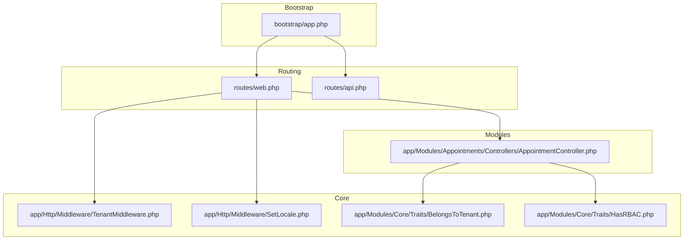
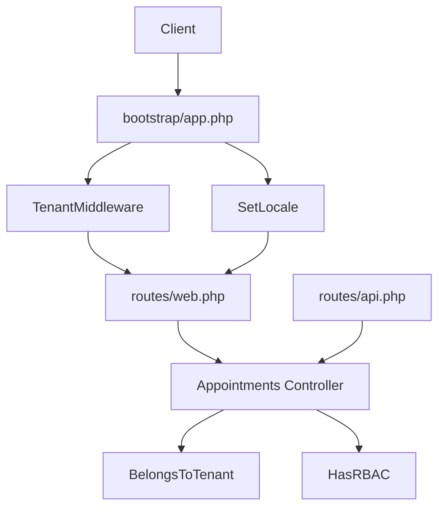
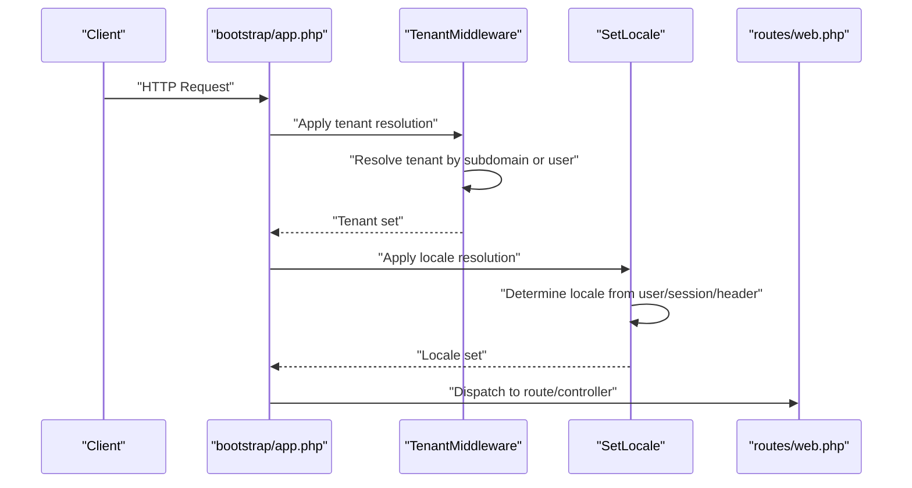
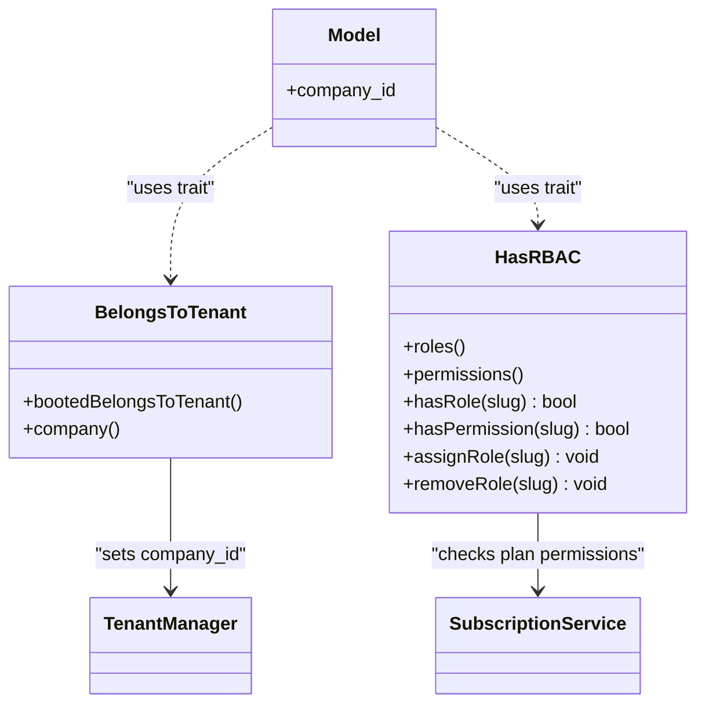
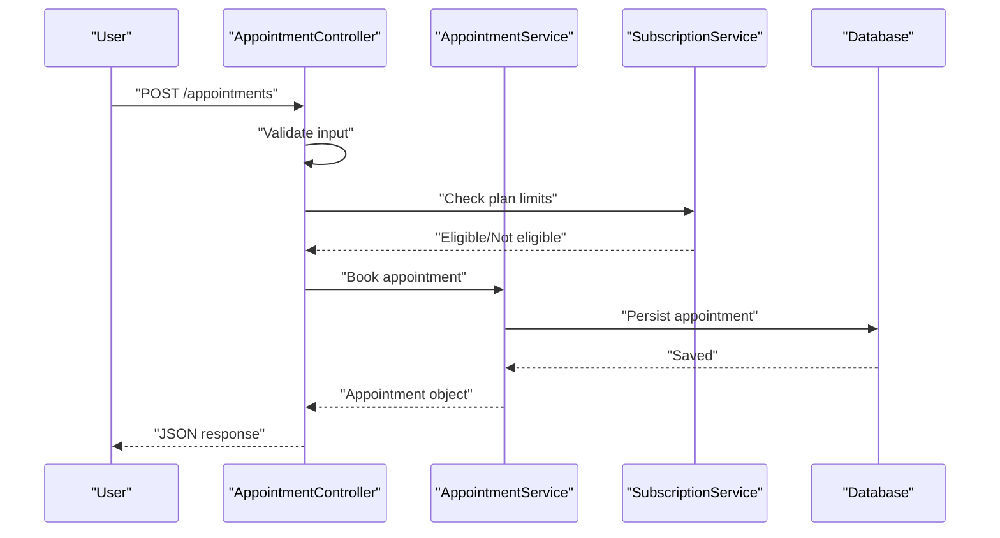
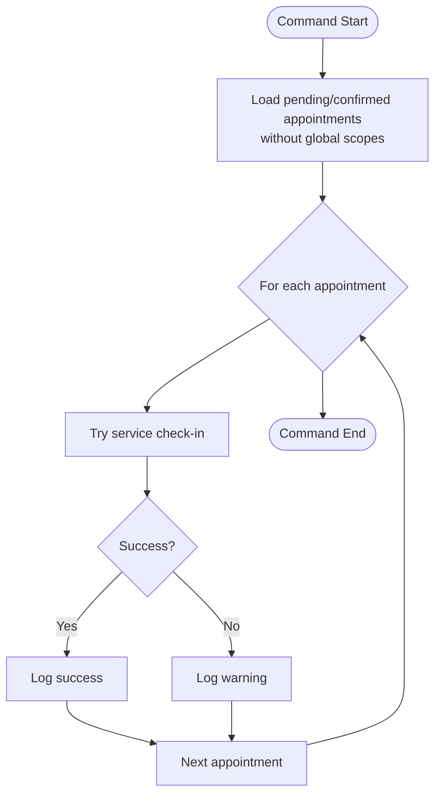
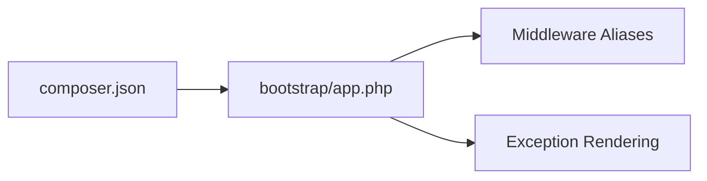

# Development Guidelines

<cite>
**Referenced Files in This Document**
- [composer.json](file://composer.json)
- [phpunit.xml](file://phpunit.xml)
- [bootstrap/app.php](file://bootstrap/app.php)
- [config/app.php](file://config/app.php)
- [config/database.php](file://config/database.php)
- [routes/web.php](file://routes/web.php)
- [routes/api.php](file://routes/api.php)
- [app/Http/Middleware/TenantMiddleware.php](file://app/Http/Middleware/TenantMiddleware.php)
- [app/Http/Middleware/SetLocale.php](file://app/Http/Middleware/SetLocale.php)
- [app/Modules/Core/Traits/BelongsToTenant.php](file://app/Modules/Core/Traits/BelongsToTenant.php)
- [app/Modules/Core/Traits/HasRBAC.php](file://app/Modules/Core/Traits/HasRBAC.php)
- [app/Modules/Appointments/Controllers/AppointmentController.php](file://app/Modules/Appointments/Controllers/AppointmentController.php)
- [app/Console/Commands/AutoCheckInAppointments.php](file://app/Console/Commands/AutoCheckInAppointments.php)
- [tests/TestCase.php](file://tests/TestCase.php)
- [README.md](file://README.md)
</cite>

## Table of Contents
1. [Introduction](#introduction)
2. [Project Structure](#project-structure)
3. [Core Components](#core-components)
4. [Architecture Overview](#architecture-overview)
5. [Detailed Component Analysis](#detailed-component-analysis)
6. [Dependency Analysis](#dependency-analysis)
7. [Performance Considerations](#performance-considerations)
8. [Troubleshooting Guide](#troubleshooting-guide)
9. [Conclusion](#conclusion)
10. [Appendices](#appendices)

## Introduction
This document provides comprehensive development guidelines for contributing to Noubtigo. It consolidates coding standards, conventions, workflow practices, project structure conventions, testing requirements, module extension guidelines, debugging/logging/error handling patterns, security considerations, performance optimization, and database migration best practices. The guidance is grounded in the repository’s configuration, middleware, routing, traits, controllers, and testing setup.

## Project Structure
Noubtigo follows a Laravel-based modular architecture with a strong separation of concerns:
- Application entrypoint and middleware registration are configured in the bootstrap file.
- Routing is split between web and API routes, with granular permission-based middleware applied per module.
- Modules are organized under app/Modules/<Module>/ with Controllers, Models, Services, and supporting classes.
- Core cross-cutting concerns live under app/Modules/Core (traits, scopes, and shared utilities).
- Testing is organized under tests/ with separate suites for Unit and Feature.

**Diagram sources**
- [bootstrap/app.php:1-63](file://bootstrap/app.php#L1-L63)
- [routes/web.php:1-293](file://routes/web.php#L1-L293)
- [routes/api.php:1-24](file://routes/api.php#L1-L24)
- [app/Http/Middleware/TenantMiddleware.php:1-52](file://app/Http/Middleware/TenantMiddleware.php#L1-L52)
- [app/Http/Middleware/SetLocale.php:1-43](file://app/Http/Middleware/SetLocale.php#L1-L43)
- [app/Modules/Core/Traits/BelongsToTenant.php:1-35](file://app/Modules/Core/Traits/BelongsToTenant.php#L1-L35)
- [app/Modules/Core/Traits/HasRBAC.php:1-104](file://app/Modules/Core/Traits/HasRBAC.php#L1-L104)
- [app/Modules/Appointments/Controllers/AppointmentController.php:1-211](file://app/Modules/Appointments/Controllers/AppointmentController.php#L1-L211)

**Section sources**
- [bootstrap/app.php:1-63](file://bootstrap/app.php#L1-L63)
- [routes/web.php:1-293](file://routes/web.php#L1-L293)
- [routes/api.php:1-24](file://routes/api.php#L1-L24)
- [app/Http/Middleware/TenantMiddleware.php:1-52](file://app/Http/Middleware/TenantMiddleware.php#L1-L52)
- [app/Http/Middleware/SetLocale.php:1-43](file://app/Http/Middleware/SetLocale.php#L1-L43)
- [app/Modules/Core/Traits/BelongsToTenant.php:1-35](file://app/Modules/Core/Traits/BelongsToTenant.php#L1-L35)
- [app/Modules/Core/Traits/HasRBAC.php:1-104](file://app/Modules/Core/Traits/HasRBAC.php#L1-L104)
- [app/Modules/Appointments/Controllers/AppointmentController.php:1-211](file://app/Modules/Appointments/Controllers/AppointmentController.php#L1-L211)

## Core Components
- PSR and Coding Standards
  - Composer configuration defines autoload rules for app/, app/Modules/, factories, seeders, and tests. This enforces PSR-4 autoloading and encourages namespace alignment with directory structure.
  - Laravel Pint is included as a dev dependency, indicating a preference for automated code formatting and style enforcement.
  - EditorConfig and related attributes suggest consistent editor behavior across contributors.

- Naming Conventions
  - Controllers: PascalCase suffixed with “Controller”.
  - Services: PascalCase suffixed with “Service”.
  - Traits: PascalCase suffixed with “Trait”.
  - Models: PascalCase.
  - Middleware: PascalCase suffixed with “Middleware”.
  - Modules: PascalCase directory names under app/Modules/.
  - Routes: Lowercase with dot-separated names; prefixed groups per module.

- Code Organization Principles
  - MVC per module: Controllers, Models, Services, and supporting classes grouped under app/Modules/<Module>.
  - Shared cross-cutting concerns in app/Modules/Core (traits, scopes, and shared utilities).
  - Middleware applied centrally in bootstrap/app.php and selectively in routes/web.php.
  - API versioning via routes/api.php with a v1 prefix.

- Configuration and Environment
  - Application configuration centralizes locale, timezone, encryption, and maintenance mode.
  - Database configuration supports SQLite for testing and MySQL/MariaDB/Postgres/SQLSRV for production-like environments.
  - Environment variables are used extensively for database connections, caching, queues, and external integrations.

**Section sources**
- [composer.json:25-37](file://composer.json#L25-L37)
- [composer.json:16-24](file://composer.json#L16-L24)
- [config/app.php:16-126](file://config/app.php#L16-L126)
- [config/database.php:20-185](file://config/database.php#L20-L185)
- [routes/api.php:11-23](file://routes/api.php#L11-L23)

## Architecture Overview
Noubtigo employs a layered, modular architecture:
- Bootstrap registers routing and middleware globally.
- Middleware applies tenant scoping, locale selection, CSRF validation exceptions, and aliasing.
- Routes group endpoints by functional domain with permission-based guards.
- Controllers orchestrate requests and delegate business logic to Services.
- Eloquent models leverage traits for tenant scoping and RBAC checks.
- Commands encapsulate scheduled tasks.

**Diagram sources**
- [bootstrap/app.php:17-39](file://bootstrap/app.php#L17-L39)
- [app/Http/Middleware/TenantMiddleware.php:22-49](file://app/Http/Middleware/TenantMiddleware.php#L22-L49)
- [app/Http/Middleware/SetLocale.php:18-40](file://app/Http/Middleware/SetLocale.php#L18-L40)
- [routes/web.php:58-243](file://routes/web.php#L58-L243)
- [routes/api.php:11-23](file://routes/api.php#L11-L23)
- [app/Modules/Appointments/Controllers/AppointmentController.php:14-210](file://app/Modules/Appointments/Controllers/AppointmentController.php#L14-L210)
- [app/Modules/Core/Traits/BelongsToTenant.php:8-34](file://app/Modules/Core/Traits/BelongsToTenant.php#L8-L34)
- [app/Modules/Core/Traits/HasRBAC.php:9-103](file://app/Modules/Core/Traits/HasRBAC.php#L9-L103)

**Section sources**
- [bootstrap/app.php:17-39](file://bootstrap/app.php#L17-L39)
- [routes/web.php:58-243](file://routes/web.php#L58-L243)
- [app/Modules/Appointments/Controllers/AppointmentController.php:14-210](file://app/Modules/Appointments/Controllers/AppointmentController.php#L14-L210)
- [app/Modules/Core/Traits/BelongsToTenant.php:8-34](file://app/Modules/Core/Traits/BelongsToTenant.php#L8-L34)
- [app/Modules/Core/Traits/HasRBAC.php:9-103](file://app/Modules/Core/Traits/HasRBAC.php#L9-L103)

## Detailed Component Analysis

### Tenant and Locale Middleware
- TenantMiddleware
  - Determines tenant by subdomain or authenticated user and sets it via TenantManager.
  - Enforces UTC application timezone and delegates conversions to TimezoneService.
- SetLocale
  - Sets locale based on user preference, session, Accept-Language header, or falls back to configured default.
  - Validates against supported locales.

**Diagram sources**
- [bootstrap/app.php:17-39](file://bootstrap/app.php#L17-L39)
- [app/Http/Middleware/TenantMiddleware.php:22-49](file://app/Http/Middleware/TenantMiddleware.php#L22-L49)
- [app/Http/Middleware/SetLocale.php:18-40](file://app/Http/Middleware/SetLocale.php#L18-L40)
- [routes/web.php:58-243](file://routes/web.php#L58-L243)

**Section sources**
- [app/Http/Middleware/TenantMiddleware.php:11-51](file://app/Http/Middleware/TenantMiddleware.php#L11-L51)
- [app/Http/Middleware/SetLocale.php:11-42](file://app/Http/Middleware/SetLocale.php#L11-L42)

### RBAC and Tenant Scoping Traits
- BelongsToTenant
  - Adds a global scope and automatically sets company_id on creation based on TenantManager.
- HasRBAC
  - Provides role and permission relationships, checks, and assignment/removal logic.
  - Integrates subscription-based permission gating for company plans.

**Diagram sources**
- [app/Modules/Core/Traits/BelongsToTenant.php:8-34](file://app/Modules/Core/Traits/BelongsToTenant.php#L8-L34)
- [app/Modules/Core/Traits/HasRBAC.php:9-103](file://app/Modules/Core/Traits/HasRBAC.php#L9-L103)

**Section sources**
- [app/Modules/Core/Traits/BelongsToTenant.php:8-34](file://app/Modules/Core/Traits/BelongsToTenant.php#L8-L34)
- [app/Modules/Core/Traits/HasRBAC.php:9-103](file://app/Modules/Core/Traits/HasRBAC.php#L9-L103)

### Appointment Controller Workflow
- Responsibilities
  - Calendar feed generation, booking, rescheduling, check-in, cancellation, slot availability, and tenant authorization.
- Validation and Authorization
  - Uses request validation and controller-level tenant authorization.
- Integration
  - Delegates business logic to AppointmentService and consults SubscriptionService for limits.

**Diagram sources**
- [app/Modules/Appointments/Controllers/AppointmentController.php:65-98](file://app/Modules/Appointments/Controllers/AppointmentController.php#L65-L98)
- [app/Modules/Appointments/Controllers/AppointmentController.php:84-89](file://app/Modules/Appointments/Controllers/AppointmentController.php#L84-L89)

**Section sources**
- [app/Modules/Appointments/Controllers/AppointmentController.php:14-210](file://app/Modules/Appointments/Controllers/AppointmentController.php#L14-L210)

### Scheduled Task: Auto Check-In
- Purpose
  - Automatically checks in confirmed/pending appointments whose time has arrived.
- Implementation
  - Iterates over appointments without global scopes, attempts check-in via service, and logs successes/warnings.

**Diagram sources**
- [app/Console/Commands/AutoCheckInAppointments.php:15-41](file://app/Console/Commands/AutoCheckInAppointments.php#L15-L41)

**Section sources**
- [app/Console/Commands/AutoCheckInAppointments.php:10-43](file://app/Console/Commands/AutoCheckInAppointments.php#L10-L43)

## Dependency Analysis
- Composer Autoload
  - PSR-4 namespaces map app/, app/Modules/, database/factories, database/seeders, and tests/.
- Scripts
  - Setup, dev, and test scripts streamline local development and CI workflows.
- Middleware Aliases
  - Aliases for permission, system admin, queue mode, and subscription validation simplify route protection.
- Exception Handling
  - Centralized rendering for authentication and CSRF token mismatch exceptions.

**Diagram sources**
- [composer.json:25-37](file://composer.json#L25-L37)
- [bootstrap/app.php:33-61](file://bootstrap/app.php#L33-L61)

**Section sources**
- [composer.json:25-37](file://composer.json#L25-L37)
- [bootstrap/app.php:33-61](file://bootstrap/app.php#L33-L61)

## Performance Considerations
- Database
  - Use appropriate indexes on foreign keys and frequently filtered columns (e.g., company_id, statuses).
  - Prefer eager loading relations (as seen in controllers) to avoid N+1 queries.
  - Consider partitioning or materialized views for analytics-heavy endpoints.
- Caching
  - Cache immutable configuration and lookup tables (e.g., permissions, roles) to reduce repeated DB hits.
- Queues
  - Offload long-running tasks (e.g., notifications, reporting) to queued jobs.
- Middleware
  - Keep middleware lightweight; avoid heavy computations inside middleware stacks.
- Pagination
  - Use pagination for large lists (as demonstrated in controllers) to limit payload sizes.

## Troubleshooting Guide
- Authentication and Session Expiration
  - Centralized exception handling returns structured JSON for AJAX requests and redirects for browser requests when sessions expire or CSRF tokens mismatch.
- Logging
  - Use framework logging helpers and ensure logs are rotated and monitored in production.
- Testing
  - PHPUnit configuration targets app/ for coverage and uses SQLite in-memory database for speed.
- Environment Issues
  - Verify APP_DEBUG, APP_MAINTENANCE_DRIVER, CACHE_STORE, QUEUE_CONNECTION, and MAIL_MAILER settings for testing scenarios.

**Section sources**
- [bootstrap/app.php:40-61](file://bootstrap/app.php#L40-L61)
- [phpunit.xml:15-36](file://phpunit.xml#L15-L36)
- [config/app.php:42-126](file://config/app.php#L42-L126)

## Conclusion
These guidelines consolidate how to contribute effectively to Noubtigo while preserving modularity, tenant isolation, RBAC, and maintainable code. By adhering to PSR-4 autoloading, module-based organization, permission-driven routing, and robust testing, developers can extend functionality safely and consistently.

## Appendices

### Development Workflow
- Branching and Pull Requests
  - Use feature branches prefixed with feature/, fix/, or chore/.
  - Open pull requests targeting develop or main with clear descriptions and linked issues.
- Code Review
  - Ensure middleware and route changes respect tenant scoping and permissions.
  - Validate that new endpoints integrate with RBAC and subscription checks where applicable.
- Backward Compatibility
  - Avoid breaking changes to public APIs; introduce deprecations with migration paths.
  - Keep database schema migrations additive and reversible.

### Adding New Modules
- Directory Structure
  - Create app/Modules/<NewModule>/<Controllers|Models|Services|...>.
- Registration
  - Add routes under routes/web.php or routes/api.php with appropriate middleware and permissions.
- Cross-Cutting Concerns
  - Apply BelongsToTenant trait to models requiring tenant scoping.
  - Integrate HasRBAC for permission checks and role management.
- Testing
  - Add unit and feature tests under tests/Unit and tests/Feature.

### Testing Requirements
- Coverage
  - Aim for high unit and feature coverage; use phpunit.xml to include app/ in coverage.
- Fixtures
  - Use factories and seeders for deterministic test data.
- Environment
  - Leverage SQLite in-memory database and minimal environment variables for fast tests.

**Section sources**
- [routes/web.php:58-243](file://routes/web.php#L58-L243)
- [app/Modules/Core/Traits/BelongsToTenant.php:8-34](file://app/Modules/Core/Traits/BelongsToTenant.php#L8-L34)
- [app/Modules/Core/Traits/HasRBAC.php:9-103](file://app/Modules/Core/Traits/HasRBAC.php#L9-L103)
- [phpunit.xml:7-19](file://phpunit.xml#L7-L19)

### Security Considerations
- CSRF Exceptions
  - CSRF validation is bypassed for specific webhook endpoints; ensure these endpoints are idempotent and validated via other means.
- Authentication
  - Sanctum protects API endpoints; enforce strict policies for sensitive routes.
- Permissions
  - Always gate routes with permission middleware and validate ownership via tenant scoping.

**Section sources**
- [bootstrap/app.php:29-31](file://bootstrap/app.php#L29-L31)
- [routes/api.php:15-22](file://routes/api.php#L15-L22)
- [routes/web.php:58-243](file://routes/web.php#L58-L243)

### Performance Optimization
- Queries
  - Use select(), with(), and paginate() to limit data transfer.
- Caching
  - Cache computed metrics and lookup tables; invalidate on data change.
- Background Jobs
  - Offload heavy tasks to queues; monitor queue workers.

### Database Migration Best Practices
- Schema Design
  - Use UUIDs for external references; keep foreign keys explicit.
- Migrations
  - Keep migrations atomic and idempotent; add indexes for filtered columns.
- Seeding
  - Use seeders for initial data; keep them reproducible.

**Section sources**
- [config/database.php:20-185](file://config/database.php#L20-L185)
- [routes/web.php:196-218](file://routes/web.php#L196-L218)

### Common Development Tasks and Examples
- Implementing a New Endpoint
  - Create a controller action, add a route with required middleware and permissions, and implement validation.
  - Reference: [routes/web.php:196-208](file://routes/web.php#L196-L208), [app/Modules/Appointments/Controllers/AppointmentController.php:65-98](file://app/Modules/Appointments/Controllers/AppointmentController.php#L65-L98)
- Adding a Module-Level Permission
  - Define permission slugs and integrate with HasRBAC checks in controllers or services.
  - Reference: [app/Modules/Core/Traits/HasRBAC.php:37-73](file://app/Modules/Core/Traits/HasRBAC.php#L37-L73)
- Running Tests
  - Use the test script to execute unit and feature suites.
  - Reference: [composer.json:51-54](file://composer.json#L51-L54), [phpunit.xml:7-14](file://phpunit.xml#L7-L14)