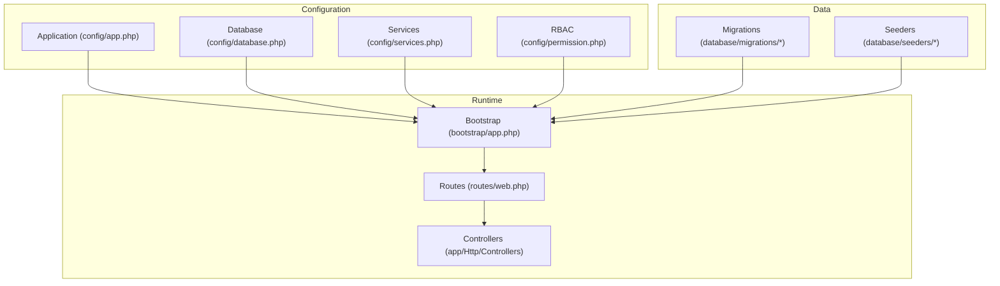
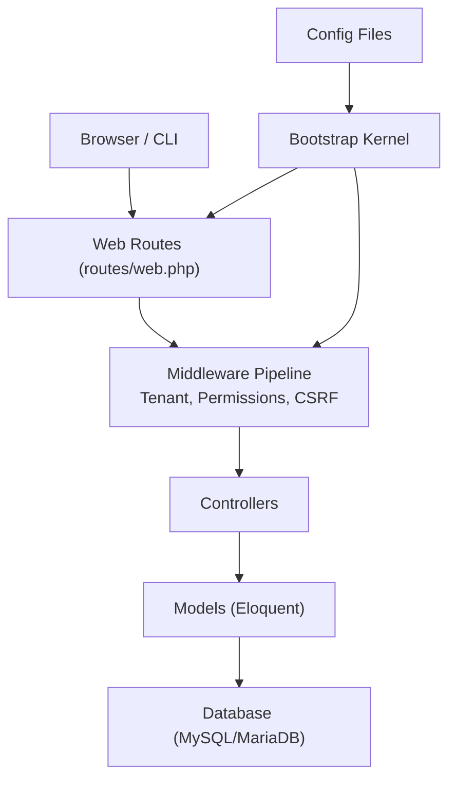
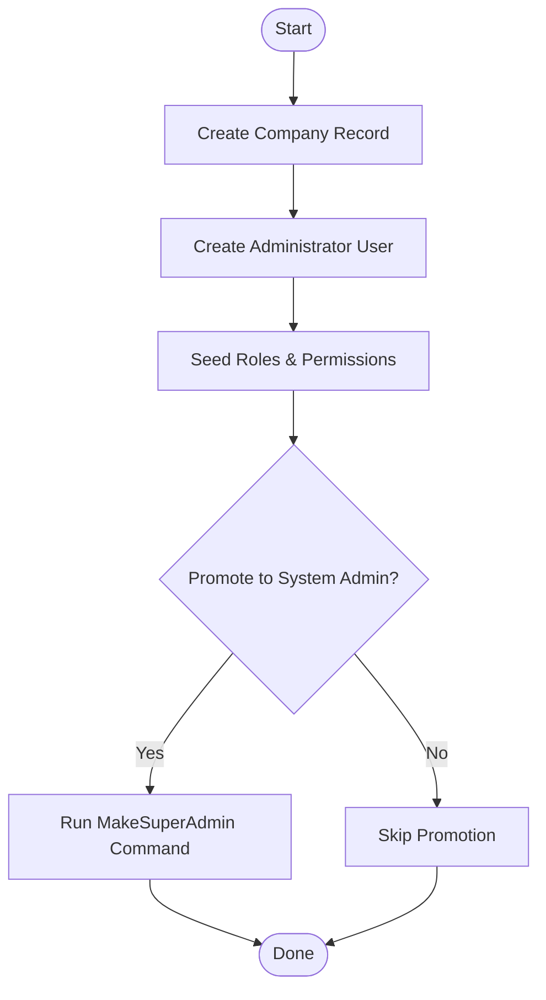
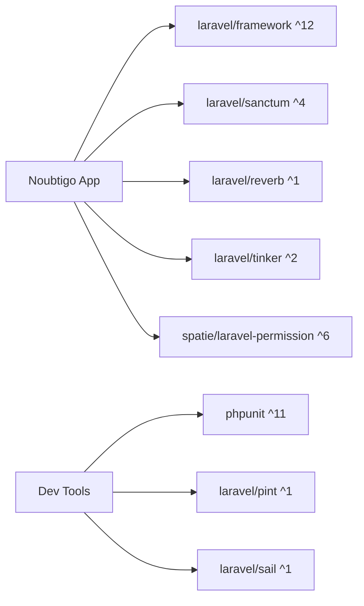

# Getting Started

<cite>
**Referenced Files in This Document**
- [composer.json](file://composer.json)
- [package.json](file://package.json)
- [README.md](file://README.md)
- [config/app.php](file://config/app.php)
- [config/database.php](file://config/database.php)
- [config/services.php](file://config/services.php)
- [config/permission.php](file://config/permission.php)
- [routes/web.php](file://routes/web.php)
- [database/migrations/0000_01_01_000000_create_companies_table.php](file://database/migrations/0000_01_01_000000_create_companies_table.php)
- [database/migrations/0001_01_01_000000_create_users_table.php](file://database/migrations/0001_01_01_000000_create_users_table.php)
- [database/seeders/RolesAndPermissionsSeeder.php](file://database/seeders/RolesAndPermissionsSeeder.php)
- [app/Console/Commands/MakeSuperAdmin.php](file://app/Console/Commands/MakeSuperAdmin.php)
- [app/Http/Controllers/DashboardController.php](file://app/Http/Controllers/DashboardController.php)
- [bootstrap/app.php](file://bootstrap/app.php)
</cite>

## Table of Contents
1. [Introduction](#introduction)
2. [Project Structure](#project-structure)
3. [Core Components](#core-components)
4. [Architecture Overview](#architecture-overview)
5. [Detailed Component Analysis](#detailed-component-analysis)
6. [Dependency Analysis](#dependency-analysis)
7. [Performance Considerations](#performance-considerations)
8. [Troubleshooting Guide](#troubleshooting-guide)
9. [Conclusion](#conclusion)
10. [Appendices](#appendices)

## Introduction
This guide helps you install and run Noubtigo locally for the first time. It covers prerequisites, environment setup, database preparation, migrations, initial configuration, creating your first company and administrator, and verifying the installation. It also includes common issues and basic usage to access the dashboard and perform initial operations.

## Project Structure
Noubtigo is a Laravel 12 application with modular features (Queue, Appointments, Payments, WhatsApp, etc.). The runtime is configured via Laravel’s bootstrapping and routing layers, while configuration is centralized in config/*. Migrations define the database schema, and seeders initialize roles and permissions.

**Diagram sources**
- [bootstrap/app.php:1-63](file://bootstrap/app.php#L1-L63)
- [routes/web.php:1-293](file://routes/web.php#L1-L293)
- [config/app.php:1-127](file://config/app.php#L1-L127)
- [config/database.php:1-186](file://config/database.php#L1-L186)
- [config/services.php:1-46](file://config/services.php#L1-L46)
- [config/permission.php:1-207](file://config/permission.php#L1-L207)
- [database/migrations/0000_01_01_000000_create_companies_table.php:1-37](file://database/migrations/0000_01_01_000000_create_companies_table.php#L1-L37)
- [database/migrations/0001_01_01_000000_create_users_table.php:1-51](file://database/migrations/0001_01_01_000000_create_users_table.php#L1-L51)
- [database/seeders/RolesAndPermissionsSeeder.php:1-88](file://database/seeders/RolesAndPermissionsSeeder.php#L1-L88)

**Section sources**
- [README.md:1-60](file://README.md#L1-L60)
- [bootstrap/app.php:1-63](file://bootstrap/app.php#L1-L63)
- [routes/web.php:1-293](file://routes/web.php#L1-L293)

## Core Components
- Application kernel and middleware pipeline are defined in the bootstrap file, including tenant scoping and CSRF exemptions for selected endpoints.
- Routing groups protect features behind authentication and permission checks.
- Configuration files define application name, environment, database connections, third-party services, and RBAC behavior.
- Migrations establish core tables for companies and users, plus additional modules’ tables.
- Seeders create roles and permissions used by the RBAC system.

**Section sources**
- [bootstrap/app.php:17-39](file://bootstrap/app.php#L17-L39)
- [routes/web.php:57-243](file://routes/web.php#L57-L243)
- [config/app.php:16-100](file://config/app.php#L16-L100)
- [config/database.php:20-118](file://config/database.php#L20-L118)
- [config/services.php:17-43](file://config/services.php#L17-L43)
- [config/permission.php:35-101](file://config/permission.php#L35-L101)
- [database/migrations/0000_01_01_000000_create_companies_table.php:14-26](file://database/migrations/0000_01_01_000000_create_companies_table.php#L14-L26)
- [database/migrations/0001_01_01_000000_create_users_table.php:14-39](file://database/migrations/0001_01_01_000000_create_users_table.php#L14-L39)
- [database/seeders/RolesAndPermissionsSeeder.php:17-86](file://database/seeders/RolesAndPermissionsSeeder.php#L17-L86)

## Architecture Overview
The system uses Laravel’s MVC with modular controllers grouped under app/Modules. Authentication and authorization are enforced via middleware and the spatie/laravel-permission package. The tenant scoping middleware ensures multi-tenancy per company.

**Diagram sources**
- [routes/web.php:1-293](file://routes/web.php#L1-L293)
- [bootstrap/app.php:17-39](file://bootstrap/app.php#L17-L39)
- [config/database.php:47-86](file://config/database.php#L47-L86)

## Detailed Component Analysis

### Prerequisites
- PHP: ^8.2
- Laravel Framework: ^12.0
- Database: MySQL 8.0+ (MariaDB supported via dedicated connection)
- Node.js: Required for Vite asset builds
- Composer: PHP dependency manager

These requirements are declared in the project metadata.

**Section sources**
- [composer.json:8-14](file://composer.json#L8-L14)
- [composer.json:9](file://composer.json#L9)
- [config/database.php:47-86](file://config/database.php#L47-L86)

### Step-by-Step Installation

1) Clone the repository and enter the project directory.
2) Install PHP dependencies:
   - Run Composer install or use the provided setup script.
3) Prepare the environment file:
   - Copy the example environment file to .env if missing.
4) Generate the application key:
   - Use the key generator command.
5) Configure the database:
   - Set DB_CONNECTION to mysql or mariadb.
   - Provide DB_HOST, DB_PORT, DB_DATABASE, DB_USERNAME, DB_PASSWORD.
6) Run database migrations:
   - Apply all migrations to create tables.
7) Install Node dependencies:
   - Install JavaScript packages.
8) Build assets:
   - Run the Vite build script.
9) Start the application:
   - Use the development script to run server, queue, logs, and Vite concurrently.

Notes:
- The setup script automates steps 2–6.
- The dev script runs the server, queue listener, log tailer, and Vite in one command.

**Section sources**
- [composer.json:39-50](file://composer.json#L39-L50)
- [composer.json:62-69](file://composer.json#L62-L69)
- [package.json:5-8](file://package.json#L5-L8)
- [config/database.php:20](file://config/database.php#L20)
- [config/database.php:47-86](file://config/database.php#L47-L86)

### Basic Configuration

- Application key
  - Generated during setup or via the key generator command.
- Database credentials
  - Configure DB_* variables in .env for mysql or mariadb connections.
- Service configurations
  - Optional third-party credentials (Mailgun, SES, Slack, WhatsApp) can be set in config/services.php via environment variables.
- Locale and timezone
  - APP_LOCALE and timezone are configurable in config/app.php.

Verification:
- Confirm APP_KEY is present after key generation.
- Verify DB_CONNECTION and DB_DATABASE connect successfully.
- Ensure APP_URL matches your local host.

**Section sources**
- [composer.json:42](file://composer.json#L42)
- [config/app.php:16](file://config/app.php#L16)
- [config/app.php:81](file://config/app.php#L81)
- [config/app.php:68](file://config/app.php#L68)
- [config/database.php:20](file://config/database.php#L20)
- [config/database.php:47-86](file://config/database.php#L47-L86)
- [config/services.php:17-43](file://config/services.php#L17-L43)

### First-Time Setup: Create the First Company and Administrator

1) Create the initial company record:
   - Use the Companies module to create a company entry.
2) Create the first administrator user:
   - Use the Users module to create a user linked to the company.
3) Promote to System Admin (optional):
   - Run the console command to grant global super-admin privileges to a user.
4) Seed roles and permissions:
   - Run the RolesAndPermissionsSeeder to create default roles and permissions.

**Diagram sources**
- [database/migrations/0000_01_01_000000_create_companies_table.php:14-26](file://database/migrations/0000_01_01_000000_create_companies_table.php#L14-L26)
- [database/migrations/0001_01_01_000000_create_users_table.php:14-23](file://database/migrations/0001_01_01_000000_create_users_table.php#L14-L23)
- [database/seeders/RolesAndPermissionsSeeder.php:17-86](file://database/seeders/RolesAndPermissionsSeeder.php#L17-L86)
- [app/Console/Commands/MakeSuperAdmin.php:27-44](file://app/Console/Commands/MakeSuperAdmin.php#L27-L44)

**Section sources**
- [database/migrations/0000_01_01_000000_create_companies_table.php:14-26](file://database/migrations/0000_01_01_000000_create_companies_table.php#L14-L26)
- [database/migrations/0001_01_01_000000_create_users_table.php:14-23](file://database/migrations/0001_01_01_000000_create_users_table.php#L14-L23)
- [database/seeders/RolesAndPermissionsSeeder.php:17-86](file://database/seeders/RolesAndPermissionsSeeder.php#L17-L86)
- [app/Console/Commands/MakeSuperAdmin.php:27-44](file://app/Console/Commands/MakeSuperAdmin.php#L27-L44)

### Verification Steps
- Visit the dashboard route after logging in.
- Confirm the dashboard loads and shows expected widgets (counts, rooms, appointments).
- Ensure navigation links for queue, services, rooms, customers, analytics, and settings are accessible according to your permissions.

**Section sources**
- [routes/web.php:58-59](file://routes/web.php#L58-L59)
- [app/Http/Controllers/DashboardController.php:16-80](file://app/Http/Controllers/DashboardController.php#L16-L80)

### Common Installation Issues and Solutions
- PHP version mismatch
  - Ensure PHP ^8.2 is installed; lower versions will fail Composer or runtime.
- Laravel version mismatch
  - Ensure Laravel ^12.0 is used; incompatible versions cause autoload or framework errors.
- Database connection failures
  - Verify DB_CONNECTION, DB_HOST, DB_PORT, DB_DATABASE, DB_USERNAME, DB_PASSWORD.
  - For MySQL 8.0+, ensure charset/collation compatibility and SSL settings if applicable.
- Missing application key
  - Generate the key using the key generator command.
- Asset build errors
  - Install Node dependencies and run the Vite build script.
- CSRF token mismatch
  - The middleware pipeline handles CSRF; ensure requests originate from the same origin and cookies are accepted.

**Section sources**
- [composer.json:8-14](file://composer.json#L8-L14)
- [config/database.php:47-86](file://config/database.php#L47-L86)
- [composer.json:42](file://composer.json#L42)
- [package.json:5-8](file://package.json#L5-L8)
- [bootstrap/app.php:29-31](file://bootstrap/app.php#L29-L31)

### Basic Usage Examples
- Access the dashboard
  - Navigate to the dashboard route after authenticating.
- Perform initial operations
  - Create a service, room, and customer.
  - Issue a ticket and update its status.
  - View analytics and activity logs.

**Section sources**
- [routes/web.php:58-59](file://routes/web.php#L58-L59)
- [routes/web.php:162-179](file://routes/web.php#L162-L179)
- [routes/web.php:171-179](file://routes/web.php#L171-L179)
- [routes/web.php:183-194](file://routes/web.php#L183-L194)
- [routes/web.php:226-232](file://routes/web.php#L226-L232)

## Dependency Analysis
The application depends on Laravel core, Sanctum for API authentication, Reverb for real-time features, Tinker for REPL, and Spatie Permission for RBAC. Development tools include PHPUnit, Pest, Pint, and Sail.

**Diagram sources**
- [composer.json:8-24](file://composer.json#L8-L24)

**Section sources**
- [composer.json:8-24](file://composer.json#L8-L24)

## Performance Considerations
- Use production-ready PHP and database versions.
- Enable opcache and appropriate PHP-FPM tuning.
- Keep Composer autoload optimized.
- Use Redis for queues and caching if scaling.
- Minimize unnecessary middleware overhead in production.

[No sources needed since this section provides general guidance]

## Troubleshooting Guide
- Authentication exceptions
  - The kernel renders standardized JSON for AJAX requests when sessions expire.
- CSRF token mismatch
  - The kernel handles CSRF exceptions and redirects appropriately.
- Database connectivity
  - Confirm DB_CONNECTION and credentials; test with a MySQL client.

**Section sources**
- [bootstrap/app.php:41-61](file://bootstrap/app.php#L41-L61)
- [config/database.php:20](file://config/database.php#L20)

## Conclusion
You now have the prerequisites, installation steps, configuration details, and operational guidance to set up Noubtigo locally, create your first company and administrator, and verify the installation. Use the provided routes and controllers to explore features and manage tenants, users, and queue operations.

[No sources needed since this section summarizes without analyzing specific files]

## Appendices

### Appendix A: Environment Variables Reference
- APP_NAME, APP_ENV, APP_DEBUG, APP_URL, APP_LOCALE, APP_KEY
- DB_CONNECTION, DB_HOST, DB_PORT, DB_DATABASE, DB_USERNAME, DB_PASSWORD
- REDIS_* and other cache/queue settings
- Third-party service tokens (MAIL_, AWS_, SLACK_, WHATSAPP_)

**Section sources**
- [config/app.php:16-100](file://config/app.php#L16-L100)
- [config/database.php:20-118](file://config/database.php#L20-L118)
- [config/services.php:17-43](file://config/services.php#L17-L43)