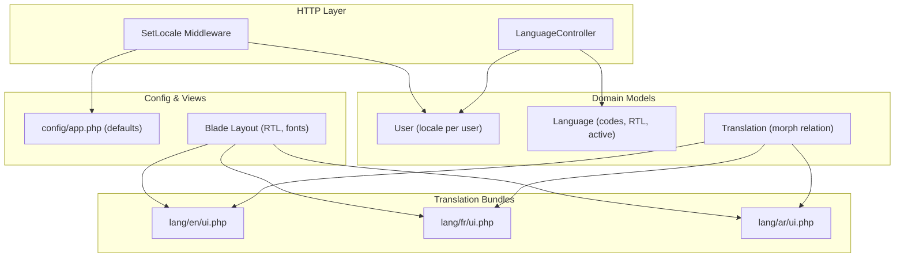
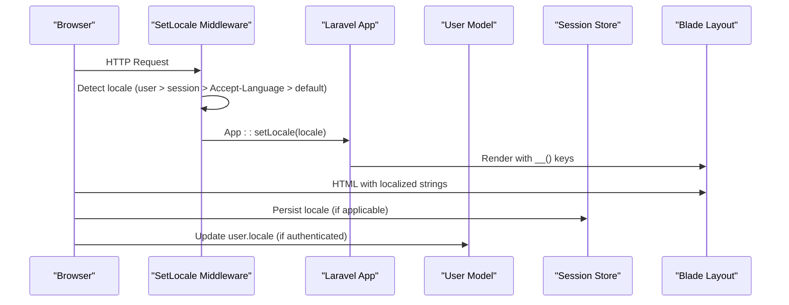
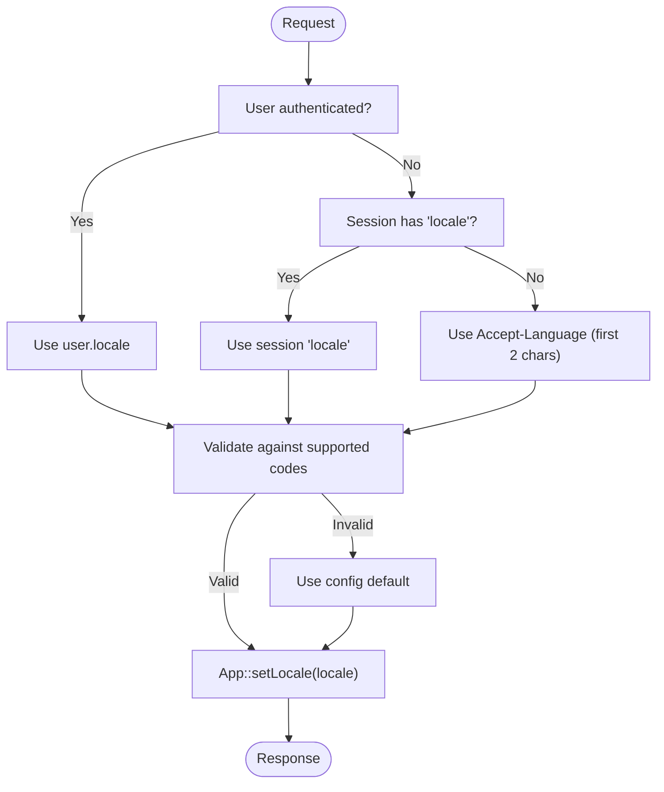
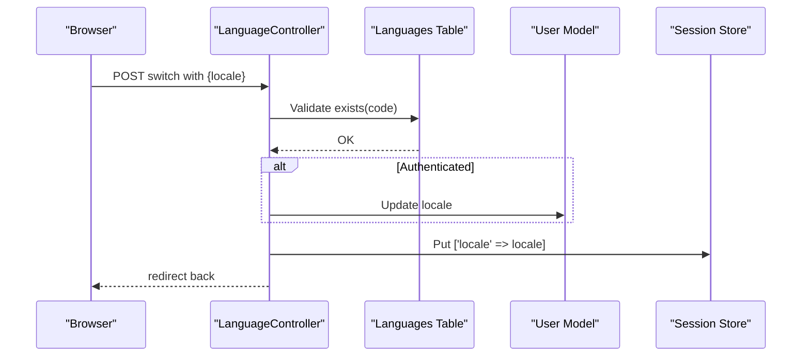
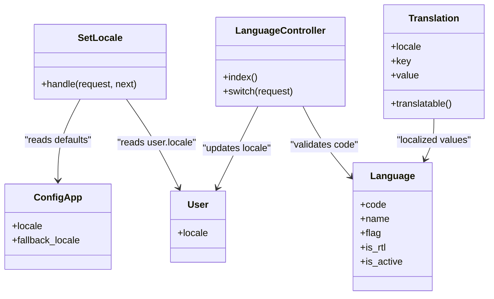

# Multi-Language & Localization

<cite>
**Referenced Files in This Document**
- [SetLocale.php](file://app/Http/Middleware/SetLocale.php)
- [LanguageController.php](file://app/Http/Controllers/LanguageController.php)
- [Language.php](file://app/Models/Language.php)
- [Translation.php](file://app/Models/Translation.php)
- [User.php](file://app/Models/User.php)
- [FeatureFlag.php](file://app/Services/FeatureFlag.php)
- [app.php](file://config/app.php)
- [2026_04_06_124809_create_languages_table.php](file://database/migrations/2026_04_06_124809_create_languages_table.php)
- [2026_04_06_124810_create_translations_table.php](file://database/migrations/2026_04_06_124810_create_translations_table.php)
- [2026_04_06_124808_add_locale_to_users_table.php](file://database/migrations/2026_04_06_124808_add_locale_to_users_table.php)
- [dashboard.blade.php](file://resources/views/layouts/dashboard.blade.php)
- [ui.php (English)](file://lang/en/ui.php)
- [ui.php (French)](file://lang/fr/ui.php)
- [ui.php (Arabic)](file://lang/ar/ui.php)
</cite>

## Table of Contents
1. [Introduction](#introduction)
2. [Project Structure](#project-structure)
3. [Core Components](#core-components)
4. [Architecture Overview](#architecture-overview)
5. [Detailed Component Analysis](#detailed-component-analysis)
6. [Dependency Analysis](#dependency-analysis)
7. [Performance Considerations](#performance-considerations)
8. [Troubleshooting Guide](#troubleshooting-guide)
9. [Conclusion](#conclusion)
10. [Appendices](#appendices)

## Introduction
This document explains Noubtigo’s multi-language support and localization system. It covers supported languages (Arabic, English, French), locale detection and switching, translation keys and pluralization, dynamic content localization, middleware-driven locale management, user-specific language preferences, feature flags across locales, and practical guidelines for adding new languages and internationalizing content. It also addresses right-to-left (RTL) layout handling and cultural adaptations.

## Project Structure
Noubtigo organizes localization around:
- Middleware for runtime locale selection
- Database-backed language metadata and user preferences
- Translation key bundles per locale
- Blade templates that adapt layout and typography to locale
- A controller for language switching with persistence

**Diagram sources**
- [SetLocale.php:18-41](file://app/Http/Middleware/SetLocale.php#L18-L41)
- [LanguageController.php:23-40](file://app/Http/Controllers/LanguageController.php#L23-L40)
- [User.php:35](file://app/Models/User.php#L35)
- [Language.php:9-20](file://app/Models/Language.php#L9-L20)
- [Translation.php:10-16](file://app/Models/Translation.php#L10-L16)
- [app.php:81-85](file://config/app.php#L81-L85)
- [dashboard.blade.php:2-25](file://resources/views/layouts/dashboard.blade.php#L2-L25)
- [ui.php (English):1-20](file://lang/en/ui.php#L1-L20)
- [ui.php (French):1-20](file://lang/fr/ui.php#L1-L20)
- [ui.php (Arabic):1-20](file://lang/ar/ui.php#L1-L20)

**Section sources**
- [SetLocale.php:18-41](file://app/Http/Middleware/SetLocale.php#L18-L41)
- [LanguageController.php:23-40](file://app/Http/Controllers/LanguageController.php#L23-L40)
- [User.php:35](file://app/Models/User.php#L35)
- [Language.php:9-20](file://app/Models/Language.php#L9-L20)
- [Translation.php:10-16](file://app/Models/Translation.php#L10-L16)
- [app.php:81-85](file://config/app.php#L81-L85)
- [dashboard.blade.php:2-25](file://resources/views/layouts/dashboard.blade.php#L2-L25)
- [ui.php (English):1-20](file://lang/en/ui.php#L1-L20)
- [ui.php (French):1-20](file://lang/fr/ui.php#L1-L20)
- [ui.php (Arabic):1-20](file://lang/ar/ui.php#L1-L20)

## Core Components
- Locale detection and middleware: Selects locale from user preference, session, Accept-Language header, or falls back to application default. Validates against supported codes.
- Language model: Stores language metadata including code, name, flag, RTL flag, and activation status.
- Translation model: Provides a polymorphic mechanism to attach translations to any model.
- User model: Persists per-user locale preference.
- Language switching controller: Validates target locale against the languages table and persists the choice to both the authenticated user and the session.
- Blade layout: Applies RTL direction and fonts for Arabic; adapts navigation and flags.
- Translation bundles: Locale-specific arrays keyed by semantic keys (e.g., ui dashboard, queue, settings).

**Section sources**
- [SetLocale.php:18-41](file://app/Http/Middleware/SetLocale.php#L18-L41)
- [Language.php:9-20](file://app/Models/Language.php#L9-L20)
- [Translation.php:10-16](file://app/Models/Translation.php#L10-L16)
- [User.php:35](file://app/Models/User.php#L35)
- [LanguageController.php:23-40](file://app/Http/Controllers/LanguageController.php#L23-L40)
- [dashboard.blade.php:2-25](file://resources/views/layouts/dashboard.blade.php#L2-L25)
- [ui.php (English):1-20](file://lang/en/ui.php#L1-L20)

## Architecture Overview
The localization pipeline:
1. Request enters middleware that sets the application locale.
2. Blade templates render content using translation keys.
3. Language switching updates user locale and session.
4. Optional feature flags gate features by tenant plan and queue mode.

**Diagram sources**
- [SetLocale.php:18-41](file://app/Http/Middleware/SetLocale.php#L18-L41)
- [LanguageController.php:23-40](file://app/Http/Controllers/LanguageController.php#L23-L40)
- [User.php:35](file://app/Models/User.php#L35)
- [dashboard.blade.php:2-25](file://resources/views/layouts/dashboard.blade.php#L2-L25)

## Detailed Component Analysis

### Locale Detection and Middleware
- Priority order: authenticated user’s locale, session-stored locale, Accept-Language header’s language part, otherwise application default.
- Validation: ensures the selected locale is among supported codes.
- Persistence: sets the application locale for the request lifecycle.

**Diagram sources**
- [SetLocale.php:18-41](file://app/Http/Middleware/SetLocale.php#L18-L41)

**Section sources**
- [SetLocale.php:18-41](file://app/Http/Middleware/SetLocale.php#L18-L41)

### Language Switching Mechanism
- Endpoint validates target locale against the languages table.
- If authenticated, updates user.locale; always stores locale in session.
- Redirects back to the previous page.

**Diagram sources**
- [LanguageController.php:23-40](file://app/Http/Controllers/LanguageController.php#L23-L40)
- [Language.php:9-20](file://app/Models/Language.php#L9-L20)

**Section sources**
- [LanguageController.php:23-40](file://app/Http/Controllers/LanguageController.php#L23-L40)
- [Language.php:9-20](file://app/Models/Language.php#L9-L20)

### Translation Keys and Dynamic Content
- Translation keys are organized under locale folders (e.g., lang/en/ui.php).
- Blade templates use translation helpers to fetch localized strings.
- For Arabic, the layout switches to RTL direction and uses a local font family.

Implementation highlights:
- Locale-aware rendering in Blade layout.
- Semantic keys for UI elements (dashboard, queue, settings, etc.).
- Arabic-specific RTL adjustments and typography.

**Section sources**
- [dashboard.blade.php:2-25](file://resources/views/layouts/dashboard.blade.php#L2-L25)
- [ui.php (English):1-20](file://lang/en/ui.php#L1-L20)
- [ui.php (French):1-20](file://lang/fr/ui.php#L1-L20)
- [ui.php (Arabic):1-20](file://lang/ar/ui.php#L1-L20)

### Pluralization and Cultural Adaptations
- The codebase does not define explicit pluralization rules in the middleware or translation files. Laravel’s underlying localization supports basic pluralization via parameter substitution in translation strings.
- Date/time and number formatting are not explicitly customized in the provided files; defaults apply. For production-grade apps, integrate a library or framework that supports ICU-style pluralization and locale-aware formatting.

[No sources needed since this section provides general guidance]

### Right-to-Left (RTL) Language Support
- The Blade layout conditionally applies RTL direction and adjusts sidebar/main margins for Arabic.
- Uses a dedicated RTL Bootstrap stylesheet and a local font for Arabic content.
- Flags in the language switcher reflect language codes consistently.

**Section sources**
- [dashboard.blade.php:2-25](file://resources/views/layouts/dashboard.blade.php#L2-L25)

### Feature Flags Across Locales
- FeatureFlag service gates features by tenant queue mode and plan permissions.
- While not directly tied to locale, it influences which features are visible or usable depending on the tenant’s configuration.

**Section sources**
- [FeatureFlag.php:16-38](file://app/Services/FeatureFlag.php#L16-L38)

## Dependency Analysis
Localization depends on:
- Middleware to set the application locale.
- User locale column for per-user preference.
- Languages table for supported codes and flags.
- Translation model for extensible key-value storage.
- Blade templates to render locale-aware UI.

**Diagram sources**
- [SetLocale.php:18-41](file://app/Http/Middleware/SetLocale.php#L18-L41)
- [LanguageController.php:23-40](file://app/Http/Controllers/LanguageController.php#L23-L40)
- [Language.php:9-20](file://app/Models/Language.php#L9-L20)
- [User.php:35](file://app/Models/User.php#L35)
- [Translation.php:10-16](file://app/Models/Translation.php#L10-L16)
- [app.php:81-85](file://config/app.php#L81-L85)

**Section sources**
- [SetLocale.php:18-41](file://app/Http/Middleware/SetLocale.php#L18-L41)
- [LanguageController.php:23-40](file://app/Http/Controllers/LanguageController.php#L23-L40)
- [Language.php:9-20](file://app/Models/Language.php#L9-L20)
- [User.php:35](file://app/Models/User.php#L35)
- [Translation.php:10-16](file://app/Models/Translation.php#L10-L16)
- [app.php:81-85](file://config/app.php#L81-L85)

## Performance Considerations
- Locale resolution happens per-request; caching the locale in the session reduces repeated checks.
- Keep translation arrays lean and grouped by functional areas to minimize memory footprint.
- Avoid heavy computations in Blade helpers; precompute where possible.

[No sources needed since this section provides general guidance]

## Troubleshooting Guide
Common issues and resolutions:
- Invalid locale in request: Middleware validates against supported codes and falls back to default. Ensure the languages table includes the intended code.
- User locale not persisting: Verify the user.locale column exists and is writable; confirm the language switch endpoint is invoked.
- Arabic layout not applying: Confirm the Blade layout condition evaluates to Arabic and that RTL assets are loaded.

**Section sources**
- [SetLocale.php:30-38](file://app/Http/Middleware/SetLocale.php#L30-L38)
- [LanguageController.php:23-40](file://app/Http/Controllers/LanguageController.php#L23-L40)
- [2026_04_06_124808_add_locale_to_users_table.php:14-16](file://database/migrations/2026_04_06_124808_add_locale_to_users_table.php#L14-L16)
- [dashboard.blade.php:2-25](file://resources/views/layouts/dashboard.blade.php#L2-L25)

## Conclusion
Noubtigo’s localization system centers on a robust middleware-driven locale detection, user-centric language preferences, and locale-specific translation bundles. The Blade layout accommodates RTL languages, while the languages and translation models provide extensibility. Feature flags complement localization by controlling feature availability per tenant configuration.

## Appendices

### Supported Languages
- English (en)
- French (fr)
- Arabic (ar)

Supported codes are validated against the languages table and enforced in middleware and the language switch controller.

**Section sources**
- [SetLocale.php:32-36](file://app/Http/Middleware/SetLocale.php#L32-L36)
- [LanguageController.php:25-27](file://app/Http/Controllers/LanguageController.php#L25-L27)
- [Language.php:16](file://app/Models/Language.php#L16)

### Adding a New Language
Steps:
1. Add a new locale folder under lang/<code>/ with translation arrays.
2. Seed or insert a record in the languages table with the new code and metadata.
3. Ensure middleware-supported codes include the new code.
4. Update Blade language switcher to include the new language.
5. Test locale detection and switching.

**Section sources**
- [2026_04_06_124809_create_languages_table.php:14-22](file://database/migrations/2026_04_06_124809_create_languages_table.php#L14-L22)
- [LanguageController.php:25-27](file://app/Http/Controllers/LanguageController.php#L25-L27)
- [dashboard.blade.php:529-544](file://resources/views/layouts/dashboard.blade.php#L529-L544)

### Translation Key Management Guidelines
- Use semantic keys (e.g., ui.dashboard, ui.queue) for consistency.
- Group related keys by feature area (e.g., ui.php, auth.php).
- Keep keys concise and descriptive; avoid duplication.
- For pluralization, rely on Laravel’s parameter substitution in translation strings.

**Section sources**
- [ui.php (English):1-20](file://lang/en/ui.php#L1-L20)
- [ui.php (French):1-20](file://lang/fr/ui.php#L1-L20)
- [ui.php (Arabic):1-20](file://lang/ar/ui.php#L1-L20)

### Internationalization Best Practices
- Prefer translation keys over hardcoded strings in views.
- Use parameterized strings for dynamic content.
- For dates and numbers, consider integrating a library that respects locale formatting.
- Test RTL layouts thoroughly, especially navigation and form elements.

[No sources needed since this section provides general guidance]