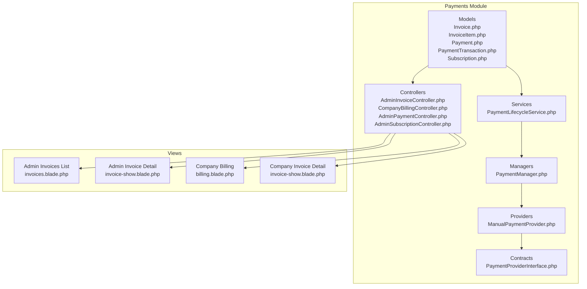
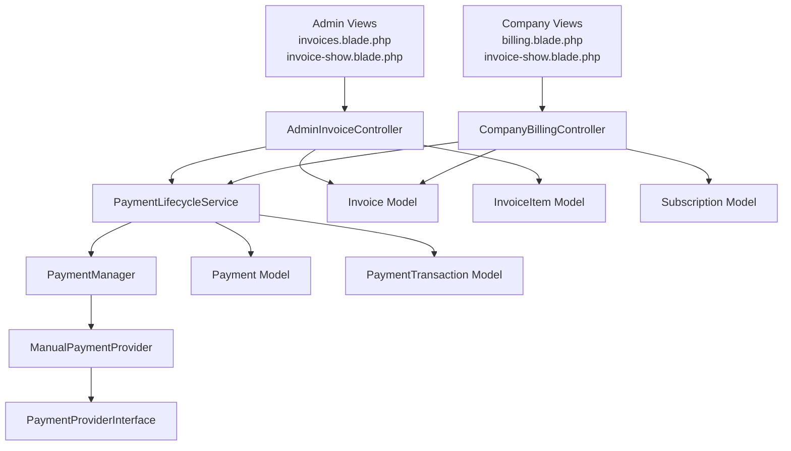
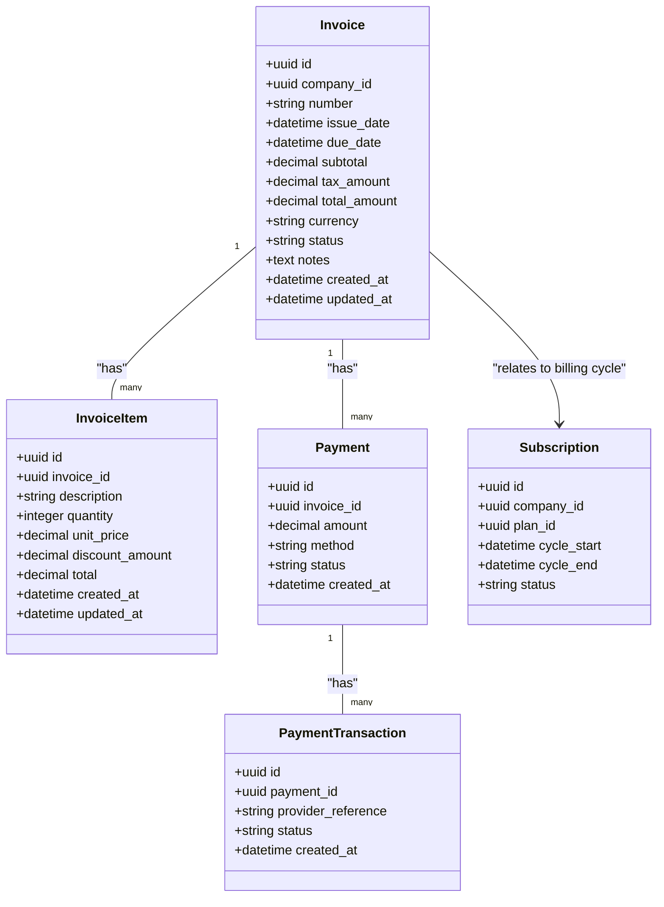
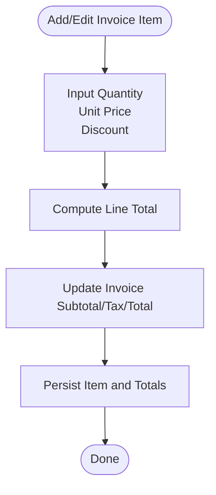
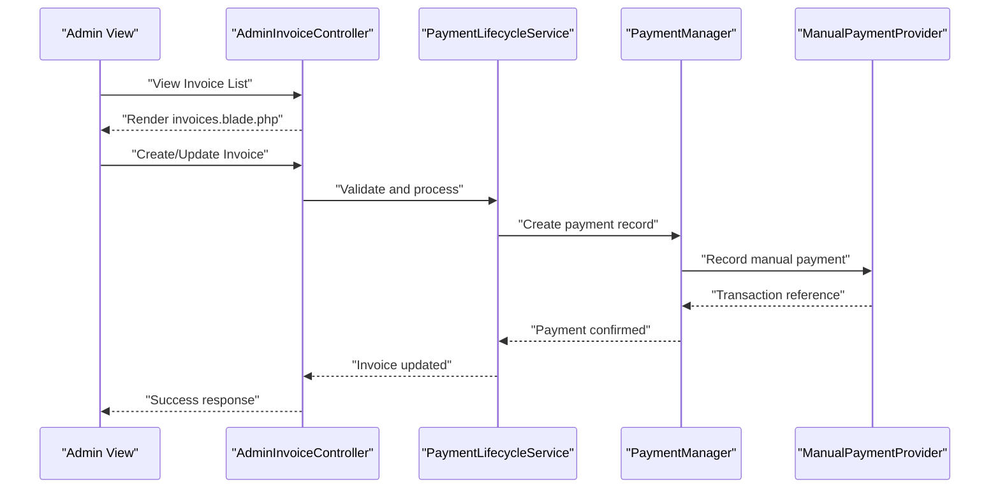
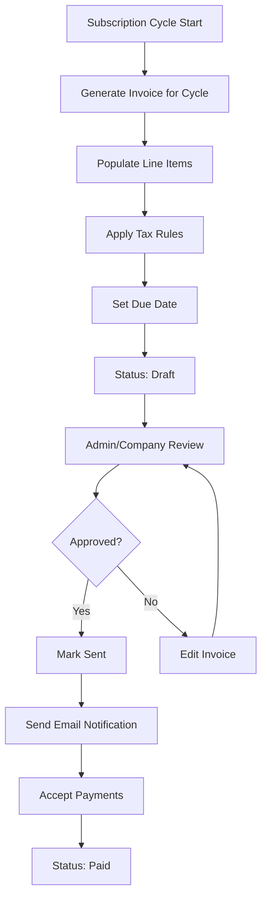
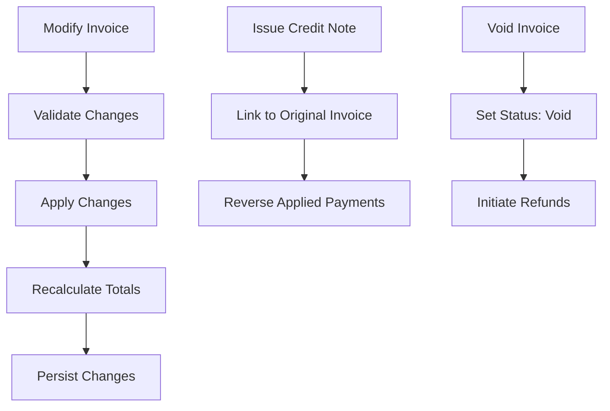
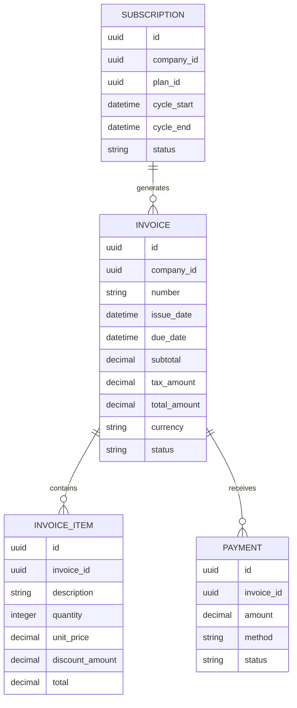
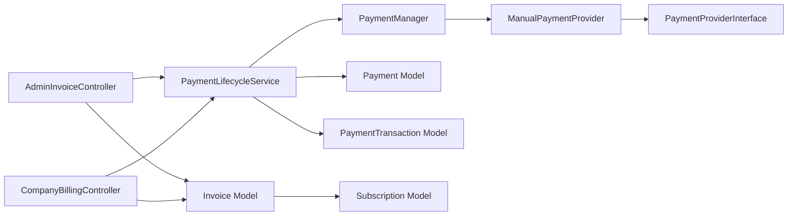

# Invoicing & Billing Management

<cite>
**Referenced Files in This Document**
- [Invoice.php](file://app/Modules/Payments/Models/Invoice.php)
- [InvoiceItem.php](file://app/Modules/Payments/Models/InvoiceItem.php)
- [Payment.php](file://app/Modules/Payments/Models/Payment.php)
- [PaymentTransaction.php](file://app/Modules/Payments/Models/PaymentTransaction.php)
- [Subscription.php](file://app/Modules/Payments/Models/Subscription.php)
- [AdminInvoiceController.php](file://app/Modules/Payments/Controllers/AdminInvoiceController.php)
- [CompanyBillingController.php](file://app/Modules/Payments/Controllers/CompanyBillingController.php)
- [AdminPaymentController.php](file://app/Modules/Payments/Controllers/AdminPaymentController.php)
- [AdminSubscriptionController.php](file://app/Modules/Payments/Controllers/AdminSubscriptionController.php)
- [PaymentLifecycleService.php](file://app/Modules/Payments/Services/PaymentLifecycleService.php)
- [PaymentManager.php](file://app/Modules/Payments/Managers/PaymentManager.php)
- [ManualPaymentProvider.php](file://app/Modules/Payments/Providers/ManualPaymentProvider.php)
- [PaymentProviderInterface.php](file://app/Modules/Payments/Contracts/PaymentProviderInterface.php)
- [2026_05_22_081731_create_invoices_table.php](file://database/migrations/2026_05_22_081731_create_invoices_table.php)
- [2026_05_22_081733_create_invoice_items_table.php](file://database/migrations/2026_05_22_081733_create_invoice_items_table.php)
- [2026_05_22_081718_create_payments_table.php](file://database/migrations/2026_05_22_081718_create_payments_table.php)
- [2026_05_22_081729_create_payment_transactions_table.php](file://database/migrations/2026_05_22_081729_create_payment_transactions_table.php)
- [2026_05_22_081731_create_subscriptions_table.php](file://database/migrations/2026_05_22_081731_create_subscriptions_table.php)
- [invoices.blade.php](file://resources/views/modules/payments/admin/invoices.blade.php)
- [invoice-show.blade.php](file://resources/views/modules/payments/admin/invoice-show.blade.php)
- [billing.blade.php](file://resources/views/modules/payments/company/billing.blade.php)
- [invoice-show.blade.php](file://resources/views/modules/payments/company/invoice-show.blade.php)
</cite>

## Table of Contents
1. [Introduction](#introduction)
2. [Project Structure](#project-structure)
3. [Core Components](#core-components)
4. [Architecture Overview](#architecture-overview)
5. [Detailed Component Analysis](#detailed-component-analysis)
6. [Dependency Analysis](#dependency-analysis)
7. [Performance Considerations](#performance-considerations)
8. [Troubleshooting Guide](#troubleshooting-guide)
9. [Conclusion](#conclusion)
10. [Appendices](#appendices)

## Introduction
This document describes the invoicing and billing management system built with Laravel. It covers invoice model structure, invoice item management, billing controller implementations for admin and company-level operations, invoice generation workflows, automated billing cycles, manual invoice creation, templates and PDF generation, email notifications, payment reminders, modifications and voiding procedures, credit notes, invoice-payment-subscription relationships, API usage examples, bulk operations, and billing report generation.

## Project Structure
The invoicing and billing system resides under the Payments module with dedicated models, controllers, services, managers, providers, and contracts. Views for admin and company interfaces support invoice listing, viewing, and company billing dashboards.

**Diagram sources**
- [Invoice.php](file://app/Modules/Payments/Models/Invoice.php)
- [InvoiceItem.php](file://app/Modules/Payments/Models/InvoiceItem.php)
- [Payment.php](file://app/Modules/Payments/Models/Payment.php)
- [PaymentTransaction.php](file://app/Modules/Payments/Models/PaymentTransaction.php)
- [Subscription.php](file://app/Modules/Payments/Models/Subscription.php)
- [AdminInvoiceController.php](file://app/Modules/Payments/Controllers/AdminInvoiceController.php)
- [CompanyBillingController.php](file://app/Modules/Payments/Controllers/CompanyBillingController.php)
- [AdminPaymentController.php](file://app/Modules/Payments/Controllers/AdminPaymentController.php)
- [AdminSubscriptionController.php](file://app/Modules/Payments/Controllers/AdminSubscriptionController.php)
- [PaymentLifecycleService.php](file://app/Modules/Payments/Services/PaymentLifecycleService.php)
- [PaymentManager.php](file://app/Modules/Payments/Managers/PaymentManager.php)
- [ManualPaymentProvider.php](file://app/Modules/Payments/Providers/ManualPaymentProvider.php)
- [PaymentProviderInterface.php](file://app/Modules/Payments/Contracts/PaymentProviderInterface.php)
- [invoices.blade.php](file://resources/views/modules/payments/admin/invoices.blade.php)
- [invoice-show.blade.php](file://resources/views/modules/payments/admin/invoice-show.blade.php)
- [billing.blade.php](file://resources/views/modules/payments/company/billing.blade.php)
- [invoice-show.blade.php](file://resources/views/modules/payments/company/invoice-show.blade.php)

**Section sources**
- [Invoice.php](file://app/Modules/Payments/Models/Invoice.php)
- [InvoiceItem.php](file://app/Modules/Payments/Models/InvoiceItem.php)
- [Payment.php](file://app/Modules/Payments/Models/Payment.php)
- [PaymentTransaction.php](file://app/Modules/Payments/Models/PaymentTransaction.php)
- [Subscription.php](file://app/Modules/Payments/Models/Subscription.php)
- [AdminInvoiceController.php](file://app/Modules/Payments/Controllers/AdminInvoiceController.php)
- [CompanyBillingController.php](file://app/Modules/Payments/Controllers/CompanyBillingController.php)
- [AdminPaymentController.php](file://app/Modules/Payments/Controllers/AdminPaymentController.php)
- [AdminSubscriptionController.php](file://app/Modules/Payments/Controllers/AdminSubscriptionController.php)
- [PaymentLifecycleService.php](file://app/Modules/Payments/Services/PaymentLifecycleService.php)
- [PaymentManager.php](file://app/Modules/Payments/Managers/PaymentManager.php)
- [ManualPaymentProvider.php](file://app/Modules/Payments/Providers/ManualPaymentProvider.php)
- [PaymentProviderInterface.php](file://app/Modules/Payments/Contracts/PaymentProviderInterface.php)
- [invoices.blade.php](file://resources/views/modules/payments/admin/invoices.blade.php)
- [invoice-show.blade.php](file://resources/views/modules/payments/admin/invoice-show.blade.php)
- [billing.blade.php](file://resources/views/modules/payments/company/billing.blade.php)
- [invoice-show.blade.php](file://resources/views/modules/payments/company/invoice-show.blade.php)

## Core Components
- Invoice model encapsulates invoice metadata, totals, taxes, due date, currency, status, and relationships to items and payments.
- InvoiceItem model stores per-line item details including quantity, unit price, discount, and total.
- Payment and PaymentTransaction models track payment events and transaction records.
- Subscription model ties billing cycles to company plans.
- Controllers implement admin and company-level invoice and billing operations.
- Services and managers coordinate payment lifecycle and provider integrations.

Key implementation references:
- Invoice model definition and attributes: [Invoice.php](file://app/Modules/Payments/Models/Invoice.php)
- Invoice item model definition and attributes: [InvoiceItem.php](file://app/Modules/Payments/Models/InvoiceItem.php)
- Payment and transaction models: [Payment.php](file://app/Modules/Payments/Models/Payment.php), [PaymentTransaction.php](file://app/Modules/Payments/Models/PaymentTransaction.php)
- Subscription model: [Subscription.php](file://app/Modules/Payments/Models/Subscription.php)
- Admin invoice controller: [AdminInvoiceController.php](file://app/Modules/Payments/Controllers/AdminInvoiceController.php)
- Company billing controller: [CompanyBillingController.php](file://app/Modules/Payments/Controllers/CompanyBillingController.php)
- Payment lifecycle service: [PaymentLifecycleService.php](file://app/Modules/Payments/Services/PaymentLifecycleService.php)
- Payment manager: [PaymentManager.php](file://app/Modules/Payments/Managers/PaymentManager.php)
- Manual payment provider: [ManualPaymentProvider.php](file://app/Modules/Payments/Providers/ManualPaymentProvider.php)
- Payment provider interface: [PaymentProviderInterface.php](file://app/Modules/Payments/Contracts/PaymentProviderInterface.php)

**Section sources**
- [Invoice.php](file://app/Modules/Payments/Models/Invoice.php)
- [InvoiceItem.php](file://app/Modules/Payments/Models/InvoiceItem.php)
- [Payment.php](file://app/Modules/Payments/Models/Payment.php)
- [PaymentTransaction.php](file://app/Modules/Payments/Models/PaymentTransaction.php)
- [Subscription.php](file://app/Modules/Payments/Models/Subscription.php)
- [AdminInvoiceController.php](file://app/Modules/Payments/Controllers/AdminInvoiceController.php)
- [CompanyBillingController.php](file://app/Modules/Payments/Controllers/CompanyBillingController.php)
- [PaymentLifecycleService.php](file://app/Modules/Payments/Services/PaymentLifecycleService.php)
- [PaymentManager.php](file://app/Modules/Payments/Managers/PaymentManager.php)
- [ManualPaymentProvider.php](file://app/Modules/Payments/Providers/ManualPaymentProvider.php)
- [PaymentProviderInterface.php](file://app/Modules/Payments/Contracts/PaymentProviderInterface.php)

## Architecture Overview
The system follows a layered architecture:
- Presentation layer: Blade views for admin and company interfaces.
- Application layer: Controllers handle requests and orchestrate services.
- Domain layer: Models define entities and relationships.
- Infrastructure layer: Services and managers coordinate workflows and external integrations.

**Diagram sources**
- [AdminInvoiceController.php](file://app/Modules/Payments/Controllers/AdminInvoiceController.php)
- [CompanyBillingController.php](file://app/Modules/Payments/Controllers/CompanyBillingController.php)
- [PaymentLifecycleService.php](file://app/Modules/Payments/Services/PaymentLifecycleService.php)
- [PaymentManager.php](file://app/Modules/Payments/Managers/PaymentManager.php)
- [ManualPaymentProvider.php](file://app/Modules/Payments/Providers/ManualPaymentProvider.php)
- [PaymentProviderInterface.php](file://app/Modules/Payments/Contracts/PaymentProviderInterface.php)
- [Invoice.php](file://app/Modules/Payments/Models/Invoice.php)
- [InvoiceItem.php](file://app/Modules/Payments/Models/InvoiceItem.php)
- [Payment.php](file://app/Modules/Payments/Models/Payment.php)
- [PaymentTransaction.php](file://app/Modules/Payments/Models/PaymentTransaction.php)
- [Subscription.php](file://app/Modules/Payments/Models/Subscription.php)
- [invoices.blade.php](file://resources/views/modules/payments/admin/invoices.blade.php)
- [invoice-show.blade.php](file://resources/views/modules/payments/admin/invoice-show.blade.php)
- [billing.blade.php](file://resources/views/modules/payments/company/billing.blade.php)
- [invoice-show.blade.php](file://resources/views/modules/payments/company/invoice-show.blade.php)

## Detailed Component Analysis

### Invoice Model
The Invoice model defines invoice metadata, totals, taxes, due date, currency, status, and relationships to items and payments. It centralizes calculation logic for amounts and maintains state transitions.

**Diagram sources**
- [Invoice.php](file://app/Modules/Payments/Models/Invoice.php)
- [InvoiceItem.php](file://app/Modules/Payments/Models/InvoiceItem.php)
- [Payment.php](file://app/Modules/Payments/Models/Payment.php)
- [PaymentTransaction.php](file://app/Modules/Payments/Models/PaymentTransaction.php)
- [Subscription.php](file://app/Modules/Payments/Models/Subscription.php)

**Section sources**
- [Invoice.php](file://app/Modules/Payments/Models/Invoice.php)
- [InvoiceItem.php](file://app/Modules/Payments/Models/InvoiceItem.php)
- [Payment.php](file://app/Modules/Payments/Models/Payment.php)
- [PaymentTransaction.php](file://app/Modules/Payments/Models/PaymentTransaction.php)
- [Subscription.php](file://app/Modules/Payments/Models/Subscription.php)

### Invoice Items Management
Invoice items represent line items with quantity, unit price, discount, and computed totals. They belong to an invoice and contribute to invoice totals.

**Diagram sources**
- [InvoiceItem.php](file://app/Modules/Payments/Models/InvoiceItem.php)
- [Invoice.php](file://app/Modules/Payments/Models/Invoice.php)

**Section sources**
- [InvoiceItem.php](file://app/Modules/Payments/Models/InvoiceItem.php)
- [Invoice.php](file://app/Modules/Payments/Models/Invoice.php)

### Billing Controllers
- AdminInvoiceController: Provides administrative invoice listing, viewing, creation, updates, and deletions.
- CompanyBillingController: Handles company-level billing operations, including viewing invoices and initiating payments.
- AdminPaymentController and AdminSubscriptionController: Manage payments and subscriptions from admin perspective.

**Diagram sources**
- [AdminInvoiceController.php](file://app/Modules/Payments/Controllers/AdminInvoiceController.php)
- [PaymentLifecycleService.php](file://app/Modules/Payments/Services/PaymentLifecycleService.php)
- [PaymentManager.php](file://app/Modules/Payments/Managers/PaymentManager.php)
- [ManualPaymentProvider.php](file://app/Modules/Payments/Providers/ManualPaymentProvider.php)
- [invoices.blade.php](file://resources/views/modules/payments/admin/invoices.blade.php)

**Section sources**
- [AdminInvoiceController.php](file://app/Modules/Payments/Controllers/AdminInvoiceController.php)
- [CompanyBillingController.php](file://app/Modules/Payments/Controllers/CompanyBillingController.php)
- [AdminPaymentController.php](file://app/Modules/Payments/Controllers/AdminPaymentController.php)
- [AdminSubscriptionController.php](file://app/Modules/Payments/Controllers/AdminSubscriptionController.php)

### Invoice Generation Workflows
Automated billing cycles create invoices linked to subscription periods. Manual invoice creation allows ad-hoc billing outside cycles.

**Diagram sources**
- [Subscription.php](file://app/Modules/Payments/Models/Subscription.php)
- [Invoice.php](file://app/Modules/Payments/Models/Invoice.php)
- [InvoiceItem.php](file://app/Modules/Payments/Models/InvoiceItem.php)
- [Payment.php](file://app/Modules/Payments/Models/Payment.php)

**Section sources**
- [Subscription.php](file://app/Modules/Payments/Models/Subscription.php)
- [Invoice.php](file://app/Modules/Payments/Models/Invoice.php)
- [InvoiceItem.php](file://app/Modules/Payments/Models/InvoiceItem.php)
- [Payment.php](file://app/Modules/Payments/Models/Payment.php)

### Templates, PDF Generation, Email Notifications, Payment Reminders
- Views: Admin and company invoice lists and details are rendered via Blade templates.
- PDF generation: Typically handled by third-party libraries integrated at runtime; ensure appropriate middleware and routes are configured.
- Email notifications: Triggered after invoice creation, sending, and payment events; configure mail drivers and templates accordingly.
- Payment reminders: Scheduled tasks can send overdue reminders based on due dates and statuses.

References:
- Admin invoice list: [invoices.blade.php](file://resources/views/modules/payments/admin/invoices.blade.php)
- Admin invoice detail: [invoice-show.blade.php](file://resources/views/modules/payments/admin/invoice-show.blade.php)
- Company billing page: [billing.blade.php](file://resources/views/modules/payments/company/billing.blade.php)
- Company invoice detail: [invoice-show.blade.php](file://resources/views/modules/payments/company/invoice-show.blade.php)

**Section sources**
- [invoices.blade.php](file://resources/views/modules/payments/admin/invoices.blade.php)
- [invoice-show.blade.php](file://resources/views/modules/payments/admin/invoice-show.blade.php)
- [billing.blade.php](file://resources/views/modules/payments/company/billing.blade.php)
- [invoice-show.blade.php](file://resources/views/modules/payments/company/invoice-show.blade.php)

### Modifications, Credit Notes, and Voiding Procedures
- Modifications: Allow edits to invoice items and totals while preserving audit trails.
- Credit notes: Issue against settled invoices to adjust amounts; maintain reverse relationships to original invoice and payments.
- Voiding: Cancel invoices with proper status transitions and reversal of related payments.

**Diagram sources**
- [Invoice.php](file://app/Modules/Payments/Models/Invoice.php)
- [Payment.php](file://app/Modules/Payments/Models/Payment.php)

**Section sources**
- [Invoice.php](file://app/Modules/Payments/Models/Invoice.php)
- [Payment.php](file://app/Modules/Payments/Models/Payment.php)

### Relationship Between Invoices, Payments, and Subscription Cycles
Invoices originate from subscription cycles, link to payments, and reflect payment statuses. Subscriptions define billing periods that drive invoice generation.

**Diagram sources**
- [Subscription.php](file://app/Modules/Payments/Models/Subscription.php)
- [Invoice.php](file://app/Modules/Payments/Models/Invoice.php)
- [InvoiceItem.php](file://app/Modules/Payments/Models/InvoiceItem.php)
- [Payment.php](file://app/Modules/Payments/Models/Payment.php)

**Section sources**
- [Subscription.php](file://app/Modules/Payments/Models/Subscription.php)
- [Invoice.php](file://app/Modules/Payments/Models/Invoice.php)
- [InvoiceItem.php](file://app/Modules/Payments/Models/InvoiceItem.php)
- [Payment.php](file://app/Modules/Payments/Models/Payment.php)

### Examples of Invoice APIs and Bulk Operations
- Listing invoices: GET endpoints for admin and company contexts.
- Creating invoices: POST with invoice and items payload.
- Updating invoices: PUT/PATCH with validation and recalculation.
- Deleting invoices: DELETE with restrictions (e.g., paid invoices require credit notes).
- Bulk operations: Batch creation/update/delete endpoints for efficiency.

Note: Specific endpoint paths and payloads are defined in controller actions and route bindings.

**Section sources**
- [AdminInvoiceController.php](file://app/Modules/Payments/Controllers/AdminInvoiceController.php)
- [CompanyBillingController.php](file://app/Modules/Payments/Controllers/CompanyBillingController.php)

### Billing Report Generation
Reports can summarize revenue, outstanding receivables, payment trends, and subscription churn. Use Eloquent queries and collections to aggregate data from invoices, payments, and subscriptions.

**Section sources**
- [Invoice.php](file://app/Modules/Payments/Models/Invoice.php)
- [Payment.php](file://app/Modules/Payments/Models/Payment.php)
- [Subscription.php](file://app/Modules/Payments/Models/Subscription.php)

## Dependency Analysis
The system exhibits clear separation of concerns:
- Controllers depend on services for business logic.
- Services depend on managers and providers for external integrations.
- Models encapsulate domain logic and relationships.
- Views render data produced by controllers.

**Diagram sources**
- [AdminInvoiceController.php](file://app/Modules/Payments/Controllers/AdminInvoiceController.php)
- [CompanyBillingController.php](file://app/Modules/Payments/Controllers/CompanyBillingController.php)
- [PaymentLifecycleService.php](file://app/Modules/Payments/Services/PaymentLifecycleService.php)
- [PaymentManager.php](file://app/Modules/Payments/Managers/PaymentManager.php)
- [ManualPaymentProvider.php](file://app/Modules/Payments/Providers/ManualPaymentProvider.php)
- [PaymentProviderInterface.php](file://app/Modules/Payments/Contracts/PaymentProviderInterface.php)
- [Invoice.php](file://app/Modules/Payments/Models/Invoice.php)
- [Payment.php](file://app/Modules/Payments/Models/Payment.php)
- [PaymentTransaction.php](file://app/Modules/Payments/Models/PaymentTransaction.php)
- [Subscription.php](file://app/Modules/Payments/Models/Subscription.php)

**Section sources**
- [AdminInvoiceController.php](file://app/Modules/Payments/Controllers/AdminInvoiceController.php)
- [CompanyBillingController.php](file://app/Modules/Payments/Controllers/CompanyBillingController.php)
- [PaymentLifecycleService.php](file://app/Modules/Payments/Services/PaymentLifecycleService.php)
- [PaymentManager.php](file://app/Modules/Payments/Managers/PaymentManager.php)
- [ManualPaymentProvider.php](file://app/Modules/Payments/Providers/ManualPaymentProvider.php)
- [PaymentProviderInterface.php](file://app/Modules/Payments/Contracts/PaymentProviderInterface.php)
- [Invoice.php](file://app/Modules/Payments/Models/Invoice.php)
- [Payment.php](file://app/Modules/Payments/Models/Payment.php)
- [PaymentTransaction.php](file://app/Modules/Payments/Models/PaymentTransaction.php)
- [Subscription.php](file://app/Modules/Payments/Models/Subscription.php)

## Performance Considerations
- Use eager loading for invoice relationships to avoid N+1 queries.
- Index frequently filtered columns (status, due_date, company_id) in migrations.
- Batch process bulk invoice operations to reduce memory footprint.
- Cache invoice totals and summaries where appropriate.
- Optimize PDF generation by streaming output and minimizing template complexity.

[No sources needed since this section provides general guidance]

## Troubleshooting Guide
Common issues and resolutions:
- Invoice totals mismatch: Verify item totals and tax calculations in the invoice model.
- Payment not recorded: Confirm payment lifecycle service invoked and provider integration successful.
- Overdue reminders not sent: Check scheduled job configuration and due date logic.
- Template rendering errors: Validate Blade view paths and data availability.

**Section sources**
- [Invoice.php](file://app/Modules/Payments/Models/Invoice.php)
- [PaymentLifecycleService.php](file://app/Modules/Payments/Services/PaymentLifecycleService.php)
- [PaymentManager.php](file://app/Modules/Payments/Managers/PaymentManager.php)
- [ManualPaymentProvider.php](file://app/Modules/Payments/Providers/ManualPaymentProvider.php)

## Conclusion
The invoicing and billing system integrates models, controllers, services, and providers to support automated and manual invoice workflows, payment processing, and reporting. By leveraging Laravel's ORM and structured controllers, the system offers extensibility for PDF generation, email notifications, and advanced billing features.

[No sources needed since this section summarizes without analyzing specific files]

## Appendices

### Database Schema References
- Invoices table: [2026_05_22_081731_create_invoices_table.php](file://database/migrations/2026_05_22_081731_create_invoices_table.php)
- Invoice items table: [2026_05_22_081733_create_invoice_items_table.php](file://database/migrations/2026_05_22_081733_create_invoice_items_table.php)
- Payments table: [2026_05_22_081718_create_payments_table.php](file://database/migrations/2026_05_22_081718_create_payments_table.php)
- Payment transactions table: [2026_05_22_081729_create_payment_transactions_table.php](file://database/migrations/2026_05_22_081729_create_payment_transactions_table.php)
- Subscriptions table: [2026_05_22_081731_create_subscriptions_table.php](file://database/migrations/2026_05_22_081731_create_subscriptions_table.php)

**Section sources**
- [2026_05_22_081731_create_invoices_table.php](file://database/migrations/2026_05_22_081731_create_invoices_table.php)
- [2026_05_22_081733_create_invoice_items_table.php](file://database/migrations/2026_05_22_081733_create_invoice_items_table.php)
- [2026_05_22_081718_create_payments_table.php](file://database/migrations/2026_05_22_081718_create_payments_table.php)
- [2026_05_22_081729_create_payment_transactions_table.php](file://database/migrations/2026_05_22_081729_create_payment_transactions_table.php)
- [2026_05_22_081731_create_subscriptions_table.php](file://database/migrations/2026_05_22_081731_create_subscriptions_table.php)