# Manual Payment Processing

<cite>
**Referenced Files in This Document**
- [PaymentProviderInterface.php](file://app/Modules/Payments/Contracts/PaymentProviderInterface.php)
- [ManualPaymentProvider.php](file://app/Modules/Payments/Providers/ManualPaymentProvider.php)
- [PaymentManager.php](file://app/Modules/Payments/Managers/PaymentManager.php)
- [PaymentLifecycleService.php](file://app/Modules/Payments/Services/PaymentLifecycleService.php)
- [AdminPaymentController.php](file://app/Modules/Payments/Controllers/AdminPaymentController.php)
- [AdminInvoiceController.php](file://app/Modules/Payments/Controllers/AdminInvoiceController.php)
- [Payment.php](file://app/Modules/Payments/Migrations/2026_05_22_081718_create_payments_table.php)
- [PaymentTransaction.php](file://app/Modules/Payments/Migrations/2026_05_22_081729_create_payment_transactions_table.php)
- [Invoice.php](file://app/Modules/Payments/Migrations/2026_05_22_081731_create_invoices_table.php)
- [Payment.php](file://app/Modules/Payments/Models/Payment.php)
- [PaymentTransaction.php](file://app/Modules/Payments/Models/PaymentTransaction.php)
- [Invoice.php](file://app/Modules/Payments/Models/Invoice.php)
</cite>

## Table of Contents
1. [Introduction](#introduction)
2. [Project Structure](#project-structure)
3. [Core Components](#core-components)
4. [Architecture Overview](#architecture-overview)
5. [Detailed Component Analysis](#detailed-component-analysis)
6. [Dependency Analysis](#dependency-analysis)
7. [Performance Considerations](#performance-considerations)
8. [Troubleshooting Guide](#troubleshooting-guide)
9. [Conclusion](#conclusion)
10. [Appendices](#appendices)

## Introduction
This document explains the manual payment processing capabilities within the payment system. It focuses on the manual payment provider implementation, its integration with the payment provider interface contract, and the end-to-end workflows for cash payments, bank transfers, and other non-automated payment methods. It also documents the approval process, documentation requirements, audit procedures, recording and tracking mechanisms, reconciliation with system records, security considerations, authorization requirements, and integration points with automated payment systems.

## Project Structure
Manual payment processing spans several modules:
- Contracts define the provider interface that all payment providers must implement.
- Providers implement specific payment methods (e.g., manual).
- Managers resolve providers by string identifiers.
- Services orchestrate lifecycle events such as creating subscription/payment/invoice sets and activating subscriptions upon approval.
- Controllers expose administrative actions for approvals, rejections, refunds, and receipt downloads.
- Models and migrations define the persistence layer for payments, invoices, and transactions.

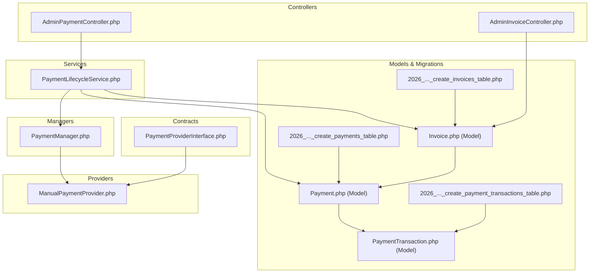

**Diagram sources**
- [PaymentProviderInterface.php:1-30](file://app/Modules/Payments/Contracts/PaymentProviderInterface.php#L1-L30)
- [ManualPaymentProvider.php:1-38](file://app/Modules/Payments/Providers/ManualPaymentProvider.php#L1-L38)
- [PaymentManager.php:1-35](file://app/Modules/Payments/Managers/PaymentManager.php#L1-L35)
- [PaymentLifecycleService.php:1-154](file://app/Modules/Payments/Services/PaymentLifecycleService.php#L1-L154)
- [AdminPaymentController.php:1-108](file://app/Modules/Payments/Controllers/AdminPaymentController.php#L1-L108)
- [AdminInvoiceController.php:1-36](file://app/Modules/Payments/Controllers/AdminInvoiceController.php#L1-L36)
- [Payment.php (Model):1-40](file://app/Modules/Payments/Models/Payment.php#L1-L40)
- [PaymentTransaction.php (Model):1-25](file://app/Modules/Payments/Models/PaymentTransaction.php#L1-L25)
- [Invoice.php (Model):1-43](file://app/Modules/Payments/Models/Invoice.php#L1-L43)
- [2026_..._create_payments_table.php:1-34](file://database/migrations/2026_05_22_081718_create_payments_table.php#L1-L34)
- [2026_..._create_payment_transactions_table.php:1-32](file://database/migrations/2026_05_22_081729_create_payment_transactions_table.php#L1-L32)
- [2026_..._create_invoices_table.php:1-38](file://database/migrations/2026_05_22_081731_create_invoices_table.php#L1-L38)

**Section sources**
- [PaymentProviderInterface.php:1-30](file://app/Modules/Payments/Contracts/PaymentProviderInterface.php#L1-L30)
- [ManualPaymentProvider.php:1-38](file://app/Modules/Payments/Providers/ManualPaymentProvider.php#L1-L38)
- [PaymentManager.php:1-35](file://app/Modules/Payments/Managers/PaymentManager.php#L1-L35)
- [PaymentLifecycleService.php:1-154](file://app/Modules/Payments/Services/PaymentLifecycleService.php#L1-L154)
- [AdminPaymentController.php:1-108](file://app/Modules/Payments/Controllers/AdminPaymentController.php#L1-L108)
- [AdminInvoiceController.php:1-36](file://app/Modules/Payments/Controllers/AdminInvoiceController.php#L1-L36)
- [Payment.php (Model):1-40](file://app/Modules/Payments/Models/Payment.php#L1-L40)
- [PaymentTransaction.php (Model):1-25](file://app/Modules/Payments/Models/PaymentTransaction.php#L1-L25)
- [Invoice.php (Model):1-43](file://app/Modules/Payments/Models/Invoice.php#L1-L43)
- [2026_..._create_payments_table.php:1-34](file://database/migrations/2026_05_22_081718_create_payments_table.php#L1-L34)
- [2026_..._create_payment_transactions_table.php:1-32](file://database/migrations/2026_05_22_081729_create_payment_transactions_table.php#L1-L32)
- [2026_..._create_invoices_table.php:1-38](file://database/migrations/2026_05_22_081731_create_invoices_table.php#L1-L38)

## Core Components
- PaymentProviderInterface defines the contract for all payment providers, including methods to get the provider name, initialize a payment, verify a payment, and process a refund.
- ManualPaymentProvider implements the interface for manual/non-automated payments. It returns a pending status with instructions for the customer and defers verification to administrative action.
- PaymentManager resolves provider instances by string identifiers, supporting manual, virement, and chari_online methods.
- PaymentLifecycleService orchestrates the creation of subscription, payment, and invoice records, initializes provider-specific behavior, and activates subscriptions upon admin approval.
- AdminPaymentController exposes administrative actions: listing payments, approving, rejecting, refunding, and downloading bank receipts.
- AdminInvoiceController lists and shows invoices for administrative oversight.
- Models and migrations define the persistence layer for payments, invoices, and transactions.

**Section sources**
- [PaymentProviderInterface.php:1-30](file://app/Modules/Payments/Contracts/PaymentProviderInterface.php#L1-L30)
- [ManualPaymentProvider.php:1-38](file://app/Modules/Payments/Providers/ManualPaymentProvider.php#L1-L38)
- [PaymentManager.php:1-35](file://app/Modules/Payments/Managers/PaymentManager.php#L1-L35)
- [PaymentLifecycleService.php:1-154](file://app/Modules/Payments/Services/PaymentLifecycleService.php#L1-L154)
- [AdminPaymentController.php:1-108](file://app/Modules/Payments/Controllers/AdminPaymentController.php#L1-L108)
- [AdminInvoiceController.php:1-36](file://app/Modules/Payments/Controllers/AdminInvoiceController.php#L1-L36)
- [Payment.php (Model):1-40](file://app/Modules/Payments/Models/Payment.php#L1-L40)
- [PaymentTransaction.php (Model):1-25](file://app/Modules/Payments/Models/PaymentTransaction.php#L1-L25)
- [Invoice.php (Model):1-43](file://app/Modules/Payments/Models/Invoice.php#L1-L43)
- [2026_..._create_payments_table.php:1-34](file://database/migrations/2026_05_22_081718_create_payments_table.php#L1-L34)
- [2026_..._create_payment_transactions_table.php:1-32](file://database/migrations/2026_05_22_081729_create_payment_transactions_table.php#L1-L32)
- [2026_..._create_invoices_table.php:1-38](file://database/migrations/2026_05_22_081731_create_invoices_table.php#L1-L38)

## Architecture Overview
The manual payment architecture follows a provider abstraction pattern:
- Clients initiate a subscription request via the lifecycle service.
- The service creates a pending subscription, payment, and invoice.
- The payment provider is resolved and initialized; for manual payments, initialization returns a pending state with instructions.
- Administrators review payments and approve them, which triggers activation of the subscription.
- Invoices reflect paid status and paid timestamps.
- Receipts can be downloaded for audit and reconciliation.

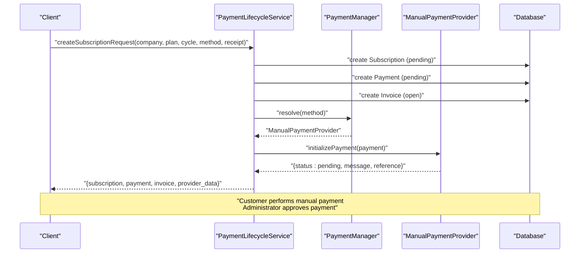

**Diagram sources**
- [PaymentLifecycleService.php:27-84](file://app/Modules/Payments/Services/PaymentLifecycleService.php#L27-L84)
- [PaymentManager.php:14-33](file://app/Modules/Payments/Managers/PaymentManager.php#L14-L33)
- [ManualPaymentProvider.php:15-23](file://app/Modules/Payments/Providers/ManualPaymentProvider.php#L15-L23)
- [2026_..._create_payments_table.php:14-23](file://database/migrations/2026_05_22_081718_create_payments_table.php#L14-L23)
- [2026_..._create_invoices_table.php:14-26](file://database/migrations/2026_05_22_081731_create_invoices_table.php#L14-L26)

## Detailed Component Analysis

### Manual Payment Provider Implementation
ManualPaymentProvider adheres to the PaymentProviderInterface contract:
- getName returns a stable provider identifier for manual payments.
- initializePayment returns a pending state with a human-readable message and a unique reference suitable for manual tracking.
- verifyPayment is a placeholder for administrative verification; it returns true when invoked by admin actions.
- refundPayment indicates manual refund processing is required and returns true to signal readiness.

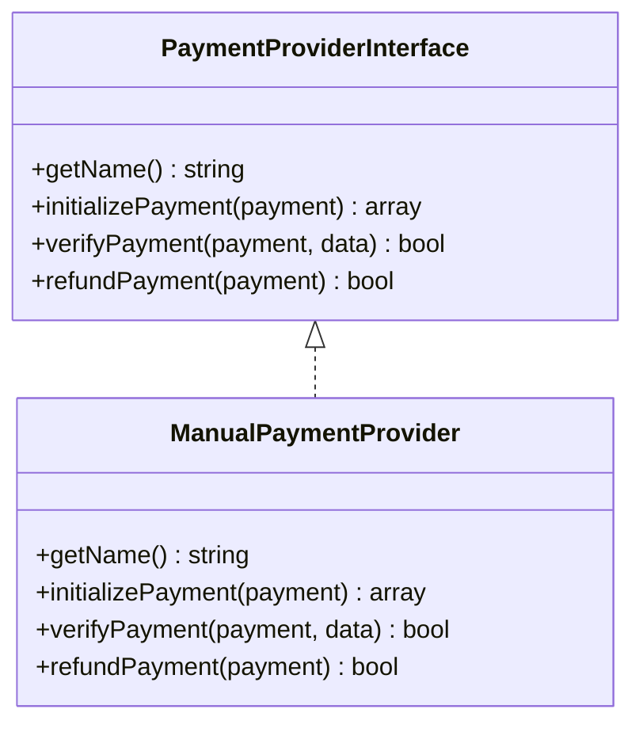

**Diagram sources**
- [PaymentProviderInterface.php:7-29](file://app/Modules/Payments/Contracts/PaymentProviderInterface.php#L7-L29)
- [ManualPaymentProvider.php:8-37](file://app/Modules/Payments/Providers/ManualPaymentProvider.php#L8-L37)

**Section sources**
- [ManualPaymentProvider.php:1-38](file://app/Modules/Payments/Providers/ManualPaymentProvider.php#L1-L38)
- [PaymentProviderInterface.php:1-30](file://app/Modules/Payments/Contracts/PaymentProviderInterface.php#L1-L30)

### Payment Lifecycle Orchestration
PaymentLifecycleService coordinates the creation and activation of payment workflows:
- createSubscriptionRequest builds a transactional chain: pending subscription, payment, open invoice, and provider initialization.
- activateSubscription updates payment and invoice statuses, computes subscription dates, and activates the subscription.
- approveManualPayment validates the payment method and ensures idempotent activation.

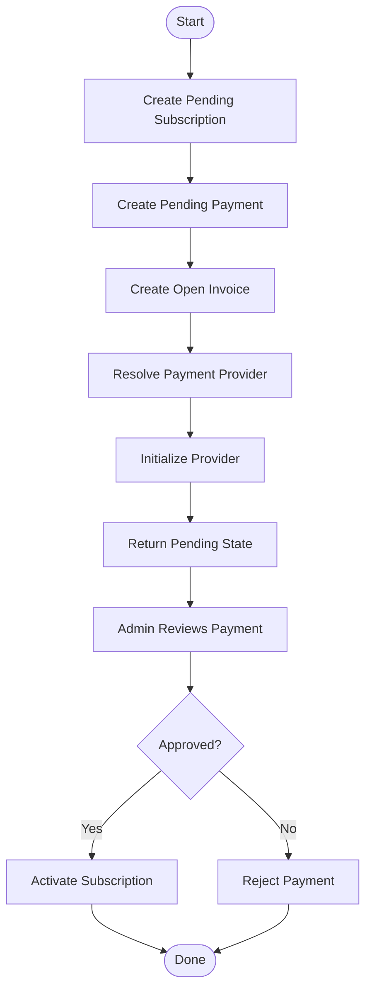

**Diagram sources**
- [PaymentLifecycleService.php:27-84](file://app/Modules/Payments/Services/PaymentLifecycleService.php#L27-L84)
- [PaymentLifecycleService.php:89-136](file://app/Modules/Payments/Services/PaymentLifecycleService.php#L89-L136)
- [PaymentLifecycleService.php:141-152](file://app/Modules/Payments/Services/PaymentLifecycleService.php#L141-L152)

**Section sources**
- [PaymentLifecycleService.php:27-84](file://app/Modules/Payments/Services/PaymentLifecycleService.php#L27-L84)
- [PaymentLifecycleService.php:89-136](file://app/Modules/Payments/Services/PaymentLifecycleService.php#L89-L136)
- [PaymentLifecycleService.php:141-152](file://app/Modules/Payments/Services/PaymentLifecycleService.php#L141-L152)

### Administrative Approval Workflow
AdminPaymentController exposes actions for administrators:
- Listing payments with filtering by status, method, and search.
- Approving a payment triggers approveManualPayment in the lifecycle service.
- Rejecting a payment sets status to failed and cancels the associated subscription.
- Refunding a payment sets status to refunded and cancels the subscription.
- Downloading receipts leverages the stored receipt path.

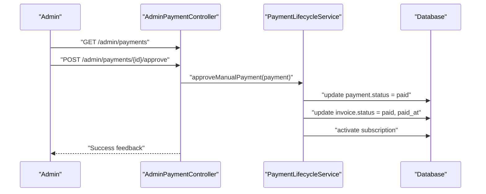

**Diagram sources**
- [AdminPaymentController.php:19-44](file://app/Modules/Payments/Controllers/AdminPaymentController.php#L19-L44)
- [AdminPaymentController.php:49-57](file://app/Modules/Payments/Controllers/AdminPaymentController.php#L49-L57)
- [PaymentLifecycleService.php:141-152](file://app/Modules/Payments/Services/PaymentLifecycleService.php#L141-L152)
- [2026_..._create_payments_table.php](file://database/migrations/2026_05_22_081718_create_payments_table.php#L21)
- [2026_..._create_invoices_table.php](file://database/migrations/2026_05_22_081731_create_invoices_table.php#L23)

**Section sources**
- [AdminPaymentController.php:1-108](file://app/Modules/Payments/Controllers/AdminPaymentController.php#L1-L108)
- [PaymentLifecycleService.php:141-152](file://app/Modules/Payments/Services/PaymentLifecycleService.php#L141-L152)

### Data Models and Persistence
The payment domain is persisted via dedicated models and migrations:
- Payment model fields include company association, optional subscription linkage, amount, currency, payment method, receipt path, and status.
- PaymentTransaction captures provider response metadata and status per transaction.
- Invoice includes company association, optional payment linkage, invoice number, totals, currency, status, due date, and paid timestamp.

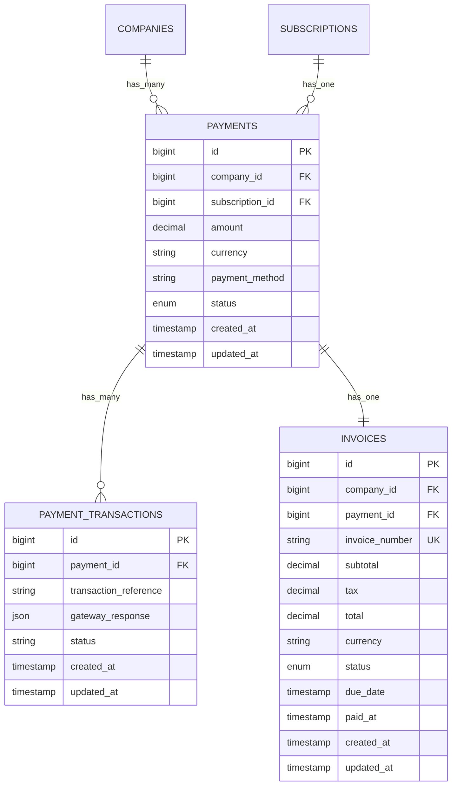

**Diagram sources**
- [2026_..._create_payments_table.php:14-23](file://database/migrations/2026_05_22_081718_create_payments_table.php#L14-L23)
- [2026_..._create_invoices_table.php:14-26](file://database/migrations/2026_05_22_081731_create_invoices_table.php#L14-L26)
- [2026_..._create_payment_transactions_table.php:14-21](file://database/migrations/2026_05_22_081729_create_payment_transactions_table.php#L14-L21)
- [Payment.php (Model):10-18](file://app/Modules/Payments/Models/Payment.php#L10-L18)
- [Invoice.php (Model):10-21](file://app/Modules/Payments/Models/Invoice.php#L10-L21)
- [PaymentTransaction.php (Model):9-14](file://app/Modules/Payments/Models/PaymentTransaction.php#L9-L14)

**Section sources**
- [Payment.php (Model):1-40](file://app/Modules/Payments/Models/Payment.php#L1-L40)
- [Invoice.php (Model):1-43](file://app/Modules/Payments/Models/Invoice.php#L1-L43)
- [PaymentTransaction.php (Model):1-25](file://app/Modules/Payments/Models/PaymentTransaction.php#L1-L25)
- [2026_..._create_payments_table.php:1-34](file://database/migrations/2026_05_22_081718_create_payments_table.php#L1-L34)
- [2026_..._create_invoices_table.php:1-38](file://database/migrations/2026_05_22_081731_create_invoices_table.php#L1-L38)
- [2026_..._create_payment_transactions_table.php:1-32](file://database/migrations/2026_05_22_081729_create_payment_transactions_table.php#L1-L32)

### Manual Payment Workflows
Manual payment workflows include:
- Cash payments and bank transfers: The provider initializes a pending state with instructions and a unique reference.
- Non-automated methods: The system relies on administrative verification via approveManualPayment.
- Receipt handling: The receipt path is stored on the payment record and can be downloaded by administrators.

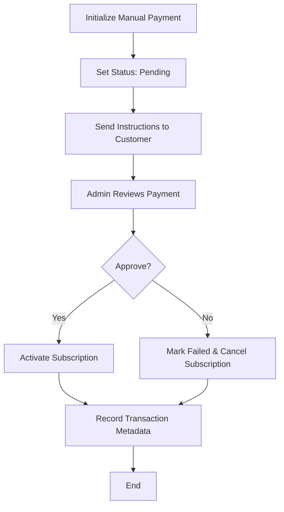

**Diagram sources**
- [ManualPaymentProvider.php:15-23](file://app/Modules/Payments/Providers/ManualPaymentProvider.php#L15-L23)
- [PaymentLifecycleService.php:141-152](file://app/Modules/Payments/Services/PaymentLifecycleService.php#L141-L152)
- [AdminPaymentController.php:49-57](file://app/Modules/Payments/Controllers/AdminPaymentController.php#L49-L57)

**Section sources**
- [ManualPaymentProvider.php:1-38](file://app/Modules/Payments/Providers/ManualPaymentProvider.php#L1-L38)
- [PaymentLifecycleService.php:141-152](file://app/Modules/Payments/Services/PaymentLifecycleService.php#L141-L152)
- [AdminPaymentController.php:99-106](file://app/Modules/Payments/Controllers/AdminPaymentController.php#L99-L106)

### Approval Process, Documentation, and Audit
- Approval process: AdminPaymentController.approve invokes PaymentLifecycleService.approveManualPayment, which validates the payment method and activates the subscription.
- Documentation requirements: The payment record stores receipt_path, enabling administrators to download scanned receipts for audit trails.
- Audit procedures: Invoices capture paid_at timestamps and statuses, while payment transactions can store provider responses for reconciliation.

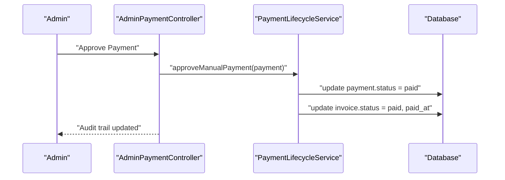

**Diagram sources**
- [AdminPaymentController.php:49-57](file://app/Modules/Payments/Controllers/AdminPaymentController.php#L49-L57)
- [PaymentLifecycleService.php:141-152](file://app/Modules/Payments/Services/PaymentLifecycleService.php#L141-L152)
- [2026_..._create_invoices_table.php](file://database/migrations/2026_05_22_081731_create_invoices_table.php#L25)

**Section sources**
- [AdminPaymentController.php:49-57](file://app/Modules/Payments/Controllers/AdminPaymentController.php#L49-L57)
- [PaymentLifecycleService.php:141-152](file://app/Modules/Payments/Services/PaymentLifecycleService.php#L141-L152)
- [Invoice.php (Model)](file://app/Modules/Payments/Models/Invoice.php#L25)

### Reconciliation Procedures
- Reconciliation relies on:
  - Payment status transitions (pending → paid/failed/refunded).
  - Invoice status and paid_at timestamps.
  - Stored receipt_path for manual evidence.
  - PaymentTransaction entries for provider metadata.

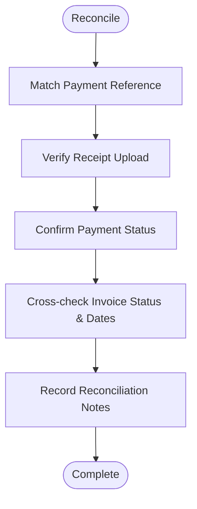

**Diagram sources**
- [Payment.php (Model)](file://app/Modules/Payments/Models/Payment.php#L16)
- [Invoice.php (Model)](file://app/Modules/Payments/Models/Invoice.php#L25)
- [PaymentTransaction.php (Model)](file://app/Modules/Payments/Models/PaymentTransaction.php#L16)

**Section sources**
- [Payment.php (Model):1-40](file://app/Modules/Payments/Models/Payment.php#L1-L40)
- [Invoice.php (Model):1-43](file://app/Modules/Payments/Models/Invoice.php#L1-L43)
- [PaymentTransaction.php (Model):1-25](file://app/Modules/Payments/Models/PaymentTransaction.php#L1-L25)

### Security Considerations and Authorization
- Provider resolution supports manual, virement, and chari_online methods; unsupported providers raise exceptions.
- Administrative actions enforce idempotency checks (e.g., already paid) and status transitions.
- Receipt access validates existence before download.

Recommendations:
- Enforce role-based access control for admin endpoints.
- Log all approval/rejection/refund actions with user identity and timestamps.
- Restrict receipt downloads to authorized administrators.
- Store receipts securely and consider encryption at rest.

**Section sources**
- [PaymentManager.php:14-33](file://app/Modules/Payments/Managers/PaymentManager.php#L14-L33)
- [AdminPaymentController.php:62-76](file://app/Modules/Payments/Controllers/AdminPaymentController.php#L62-L76)
- [AdminPaymentController.php:99-106](file://app/Modules/Payments/Controllers/AdminPaymentController.php#L99-L106)

### Integration with Automated Payment Systems
- PaymentManager resolves providers by string identifiers, allowing future expansion to automated providers (e.g., stripe, paypal, cmi) alongside manual providers.
- ManualPaymentProvider’s verifyPayment and refundPayment align with the interface contract, enabling consistent lifecycle handling across providers.

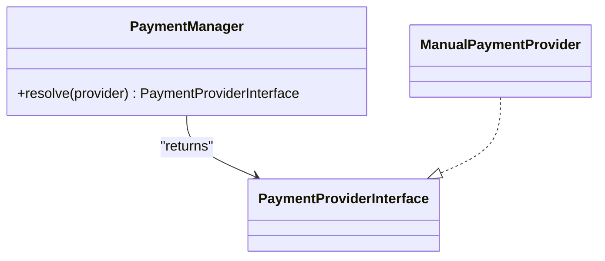

**Diagram sources**
- [PaymentManager.php:14-33](file://app/Modules/Payments/Managers/PaymentManager.php#L14-L33)
- [PaymentProviderInterface.php:7-29](file://app/Modules/Payments/Contracts/PaymentProviderInterface.php#L7-L29)
- [ManualPaymentProvider.php](file://app/Modules/Payments/Providers/ManualPaymentProvider.php#L8)

**Section sources**
- [PaymentManager.php:1-35](file://app/Modules/Payments/Managers/PaymentManager.php#L1-L35)
- [PaymentProviderInterface.php:1-30](file://app/Modules/Payments/Contracts/PaymentProviderInterface.php#L1-L30)
- [ManualPaymentProvider.php:1-38](file://app/Modules/Payments/Providers/ManualPaymentProvider.php#L1-L38)

## Dependency Analysis
The following diagram shows key dependencies among components involved in manual payment processing.

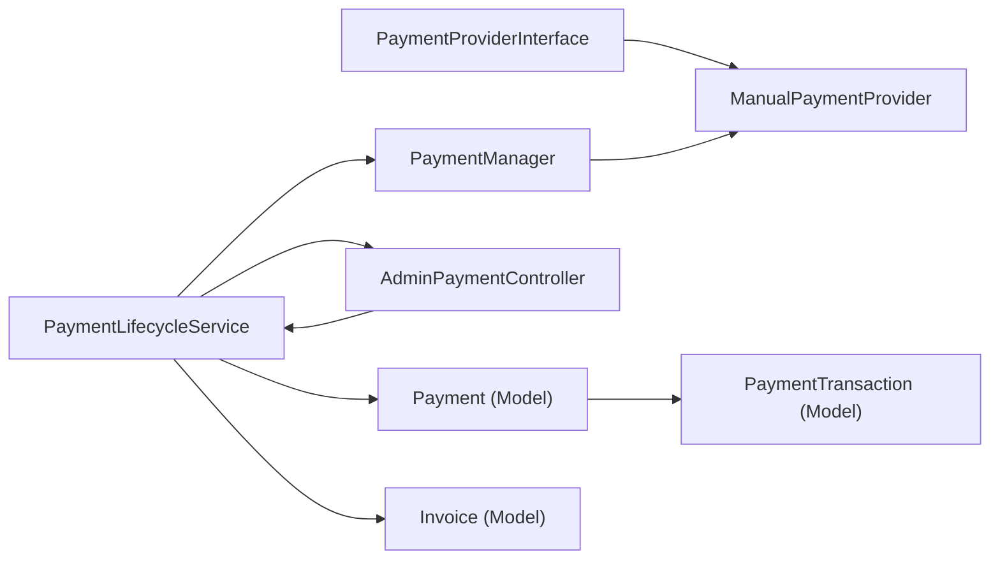

**Diagram sources**
- [PaymentProviderInterface.php:1-30](file://app/Modules/Payments/Contracts/PaymentProviderInterface.php#L1-L30)
- [ManualPaymentProvider.php:1-38](file://app/Modules/Payments/Providers/ManualPaymentProvider.php#L1-L38)
- [PaymentManager.php:1-35](file://app/Modules/Payments/Managers/PaymentManager.php#L1-L35)
- [PaymentLifecycleService.php:1-154](file://app/Modules/Payments/Services/PaymentLifecycleService.php#L1-L154)
- [AdminPaymentController.php:1-108](file://app/Modules/Payments/Controllers/AdminPaymentController.php#L1-L108)
- [Payment.php (Model):1-40](file://app/Modules/Payments/Models/Payment.php#L1-L40)
- [Invoice.php (Model):1-43](file://app/Modules/Payments/Models/Invoice.php#L1-L43)
- [PaymentTransaction.php (Model):1-25](file://app/Modules/Payments/Models/PaymentTransaction.php#L1-L25)

**Section sources**
- [PaymentLifecycleService.php:1-154](file://app/Modules/Payments/Services/PaymentLifecycleService.php#L1-L154)
- [AdminPaymentController.php:1-108](file://app/Modules/Payments/Controllers/AdminPaymentController.php#L1-L108)
- [Payment.php (Model):1-40](file://app/Modules/Payments/Models/Payment.php#L1-L40)
- [Invoice.php (Model):1-43](file://app/Modules/Payments/Models/Invoice.php#L1-L43)
- [PaymentTransaction.php (Model):1-25](file://app/Modules/Payments/Models/PaymentTransaction.php#L1-L25)

## Performance Considerations
- Transaction boundaries: PaymentLifecycleService wraps critical operations in database transactions to maintain consistency.
- Idempotency: approveManualPayment checks current status to avoid redundant activations.
- Indexing: Consider indexing payment_method, status, and company_id on payments for efficient admin queries.
- Asynchronous notifications: Integrate with queues for sending approval/rejection notifications to reduce latency.

## Troubleshooting Guide
Common issues and resolutions:
- Unsupported provider: PaymentManager throws an exception for unknown provider identifiers; ensure method values match supported keys.
- Payment already processed: Approve action is idempotent for paid payments; verify status before attempting approval.
- Receipt not found: Download action validates receipt_path existence; confirm upload and path correctness.
- Invoice not paid: Activation requires payment status to be paid; ensure admin approval is executed.

**Section sources**
- [PaymentManager.php:30-32](file://app/Modules/Payments/Managers/PaymentManager.php#L30-L32)
- [PaymentLifecycleService.php:147-149](file://app/Modules/Payments/Services/PaymentLifecycleService.php#L147-L149)
- [AdminPaymentController.php:101-103](file://app/Modules/Payments/Controllers/AdminPaymentController.php#L101-L103)

## Conclusion
Manual payment processing is implemented through a clean provider abstraction, robust lifecycle orchestration, and administrative controls. The system supports manual bank transfers and similar non-automated methods, defers verification to administrators, and maintains strong audit trails via invoices and stored receipts. Integration points enable future expansion to automated providers while preserving consistent behavior across payment methods.

## Appendices
- Administrative endpoints:
  - List payments with filters and stats.
  - Approve, reject, and refund payments.
  - Download bank receipts.
- Data retention:
  - Payments, invoices, and transactions persist provider metadata and status for reconciliation and reporting.

**Section sources**
- [AdminPaymentController.php:19-44](file://app/Modules/Payments/Controllers/AdminPaymentController.php#L19-L44)
- [AdminPaymentController.php:49-57](file://app/Modules/Payments/Controllers/AdminPaymentController.php#L49-L57)
- [AdminPaymentController.php:62-76](file://app/Modules/Payments/Controllers/AdminPaymentController.php#L62-L76)
- [AdminPaymentController.php:99-106](file://app/Modules/Payments/Controllers/AdminPaymentController.php#L99-L106)
- [Invoice.php (Model)](file://app/Modules/Payments/Models/Invoice.php#L25)
- [PaymentTransaction.php (Model)](file://app/Modules/Payments/Models/PaymentTransaction.php#L16)