# Payment & Subscription System

<cite>
**Referenced Files in This Document**
- [PaymentProviderInterface.php](file://app/Modules/Payments/Contracts/PaymentProviderInterface.php)
- [ManualPaymentProvider.php](file://app/Modules/Payments/Providers/ManualPaymentProvider.php)
- [PaymentManager.php](file://app/Modules/Payments/Managers/PaymentManager.php)
- [PaymentLifecycleService.php](file://app/Modules/Payments/Services/PaymentLifecycleService.php)
- [AdminInvoiceController.php](file://app/Modules/Payments/Controllers/AdminInvoiceController.php)
- [AdminPaymentController.php](file://app/Modules/Payments/Controllers/AdminPaymentController.php)
- [AdminSubscriptionController.php](file://app/Modules/Payments/Controllers/AdminSubscriptionController.php)
- [CompanyBillingController.php](file://app/Modules/Payments/Controllers/CompanyBillingController.php)
- [Invoice.php](file://app/Modules/Payments/Models/Invoice.php)
- [InvoiceItem.php](file://app/Modules/Payments/Models/InvoiceItem.php)
- [Payment.php](file://app/Modules/Payments/Models/Payment.php)
- [PaymentTransaction.php](file://app/Modules/Payments/Models/PaymentTransaction.php)
- [Subscription.php](file://app/Modules/Payments/Models/Subscription.php)
- [Plan.php](file://app/Modules/Subscriptions/Models/Plan.php)
- [SubscriptionService.php](file://app/Modules/Subscriptions/Services/SubscriptionService.php)
- [CheckSubscriptionValid.php](file://app/Http/Middleware/CheckSubscriptionValid.php)
- [2026_04_13_175428_create_plans_table.php](file://database/migrations/2026_04_13_175428_create_plans_table.php)
- [2026_04_13_175436_add_plan_id_to_companies_table.php](file://database/migrations/2026_04_13_175436_add_plan_id_to_companies_table.php)
- [2026_05_22_081618_create_subscriptions_table.php](file://database/migrations/2026_05_22_081618_create_subscriptions_table.php)
- [2026_05_22_081649_create_payments_table.php](file://database/migrations/2026_05_22_081649_create_payments_table.php)
- [2026_05_22_081718_create_payment_transactions_table.php](file://database/migrations/2026_05_22_081718_create_payment_transactions_table.php)
- [2026_05_22_081729_create_invoices_table.php](file://database/migrations/2026_05_22_081729_create_invoices_table.php)
- [2026_05_22_081731_create_invoice_items_table.php](file://database/migrations/2026_05_22_081731_create_invoice_items_table.php)
- [2026_06_04_122255_rename_pro_plan_slug_to_professional.php](file://database/migrations/2026_06_04_122255_rename_pro_plan_slug_to_professional.php)
- [2026_06_08_080000_add_annual_price_to_plans_table.php](file://database/migrations/2026_06_08_080000_add_annual_price_to_plans_table.php)
- [pricing.php](file://lang/en/pricing.php)
- [pricing.php](file://lang/ar/pricing.php)
- [pricing.php](file://lang/fr/pricing.php)
</cite>

## Table of Contents
1. [Introduction](#introduction)
2. [Project Structure](#project-structure)
3. [Core Components](#core-components)
4. [Architecture Overview](#architecture-overview)
5. [Detailed Component Analysis](#detailed-component-analysis)
6. [Dependency Analysis](#dependency-analysis)
7. [Performance Considerations](#performance-considerations)
8. [Troubleshooting Guide](#troubleshooting-guide)
9. [Conclusion](#conclusion)
10. [Appendices](#appendices)

## Introduction
This document explains Noubtigo’s payment and subscription management system. It covers subscription plan architecture across tiers (Professional, Premium, Enterprise), payment processing workflows (invoice generation, payment collection, renewal), provider integration via a pluggable interface, lifecycle management (activation, upgrades/downgrades, cancellations), billing cycles and proration, usage-based billing hooks, failure handling and retries, and notifications. It also outlines the APIs and flows for managing subscriptions and payments.

## Project Structure
The payment and subscription system is implemented as Laravel modules under app/Modules. Key areas:
- Payments module: contracts, providers, managers, services, models, and controllers for admin/company-facing operations.
- Subscriptions module: plan and subscription models with services for lifecycle management.
- Middleware ensures tenant subscription validity.
- Migrations define the schema for plans, subscriptions, invoices, payments, and transactions.
- Localization files expose plan names and pricing copy for the UI.

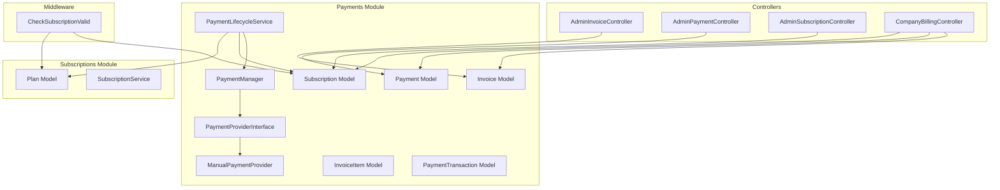

**Diagram sources**
- [PaymentManager.php](file://app/Modules/Payments/Managers/PaymentManager.php)
- [PaymentLifecycleService.php](file://app/Modules/Payments/Services/PaymentLifecycleService.php)
- [PaymentProviderInterface.php](file://app/Modules/Payments/Contracts/PaymentProviderInterface.php)
- [ManualPaymentProvider.php](file://app/Modules/Payments/Providers/ManualPaymentProvider.php)
- [Invoice.php](file://app/Modules/Payments/Models/Invoice.php)
- [InvoiceItem.php](file://app/Modules/Payments/Models/InvoiceItem.php)
- [Payment.php](file://app/Modules/Payments/Models/Payment.php)
- [PaymentTransaction.php](file://app/Modules/Payments/Models/PaymentTransaction.php)
- [Subscription.php](file://app/Modules/Payments/Models/Subscription.php)
- [Plan.php](file://app/Modules/Subscriptions/Models/Plan.php)
- [SubscriptionService.php](file://app/Modules/Subscriptions/Services/SubscriptionService.php)
- [AdminInvoiceController.php](file://app/Modules/Payments/Controllers/AdminInvoiceController.php)
- [AdminPaymentController.php](file://app/Modules/Payments/Controllers/AdminPaymentController.php)
- [AdminSubscriptionController.php](file://app/Modules/Payments/Controllers/AdminSubscriptionController.php)
- [CompanyBillingController.php](file://app/Modules/Payments/Controllers/CompanyBillingController.php)
- [CheckSubscriptionValid.php](file://app/Http/Middleware/CheckSubscriptionValid.php)

**Section sources**
- [PaymentManager.php](file://app/Modules/Payments/Managers/PaymentManager.php)
- [PaymentLifecycleService.php](file://app/Modules/Payments/Services/PaymentLifecycleService.php)
- [PaymentProviderInterface.php](file://app/Modules/Payments/Contracts/PaymentProviderInterface.php)
- [ManualPaymentProvider.php](file://app/Modules/Payments/Providers/ManualPaymentProvider.php)
- [Invoice.php](file://app/Modules/Payments/Models/Invoice.php)
- [InvoiceItem.php](file://app/Modules/Payments/Models/InvoiceItem.php)
- [Payment.php](file://app/Modules/Payments/Models/Payment.php)
- [PaymentTransaction.php](file://app/Modules/Payments/Models/PaymentTransaction.php)
- [Subscription.php](file://app/Modules/Payments/Models/Subscription.php)
- [Plan.php](file://app/Modules/Subscriptions/Models/Plan.php)
- [SubscriptionService.php](file://app/Modules/Subscriptions/Services/SubscriptionService.php)
- [AdminInvoiceController.php](file://app/Modules/Payments/Controllers/AdminInvoiceController.php)
- [AdminPaymentController.php](file://app/Modules/Payments/Controllers/AdminPaymentController.php)
- [AdminSubscriptionController.php](file://app/Modules/Payments/Controllers/AdminSubscriptionController.php)
- [CompanyBillingController.php](file://app/Modules/Payments/Controllers/CompanyBillingController.php)
- [CheckSubscriptionValid.php](file://app/Http/Middleware/CheckSubscriptionValid.php)

## Core Components
- PaymentProviderInterface: Defines the contract for payment providers (manual and extensible to others).
- ManualPaymentProvider: Implements manual payment capture and posting.
- PaymentManager: Orchestrates provider selection and payment execution.
- PaymentLifecycleService: Drives invoice creation, payment attempts, retries, and subscription renewal.
- Models: Invoice, InvoiceItem, Payment, PaymentTransaction, Subscription encapsulate persistence and state.
- Controllers: AdminInvoiceController, AdminPaymentController, AdminSubscriptionController, CompanyBillingController expose management APIs.
- Middleware: CheckSubscriptionValid enforces active subscription per tenant.
- Plans and Subscriptions: Plan model and SubscriptionService manage tiers and lifecycle transitions.

**Section sources**
- [PaymentProviderInterface.php](file://app/Modules/Payments/Contracts/PaymentProviderInterface.php)
- [ManualPaymentProvider.php](file://app/Modules/Payments/Providers/ManualPaymentProvider.php)
- [PaymentManager.php](file://app/Modules/Payments/Managers/PaymentManager.php)
- [PaymentLifecycleService.php](file://app/Modules/Payments/Services/PaymentLifecycleService.php)
- [Invoice.php](file://app/Modules/Payments/Models/Invoice.php)
- [InvoiceItem.php](file://app/Modules/Payments/Models/InvoiceItem.php)
- [Payment.php](file://app/Modules/Payments/Models/Payment.php)
- [PaymentTransaction.php](file://app/Modules/Payments/Models/PaymentTransaction.php)
- [Subscription.php](file://app/Modules/Payments/Models/Subscription.php)
- [Plan.php](file://app/Modules/Subscriptions/Models/Plan.php)
- [SubscriptionService.php](file://app/Modules/Subscriptions/Services/SubscriptionService.php)
- [CheckSubscriptionValid.php](file://app/Http/Middleware/CheckSubscriptionValid.php)

## Architecture Overview
The system follows a modular, pluggable architecture:
- Provider abstraction decouples payment execution from business logic.
- Lifecycle service coordinates billing events and subscription updates.
- Controllers expose admin and company-facing endpoints.
- Middleware enforces subscription validity at runtime.
- Models persist state for invoices, payments, transactions, and subscriptions.

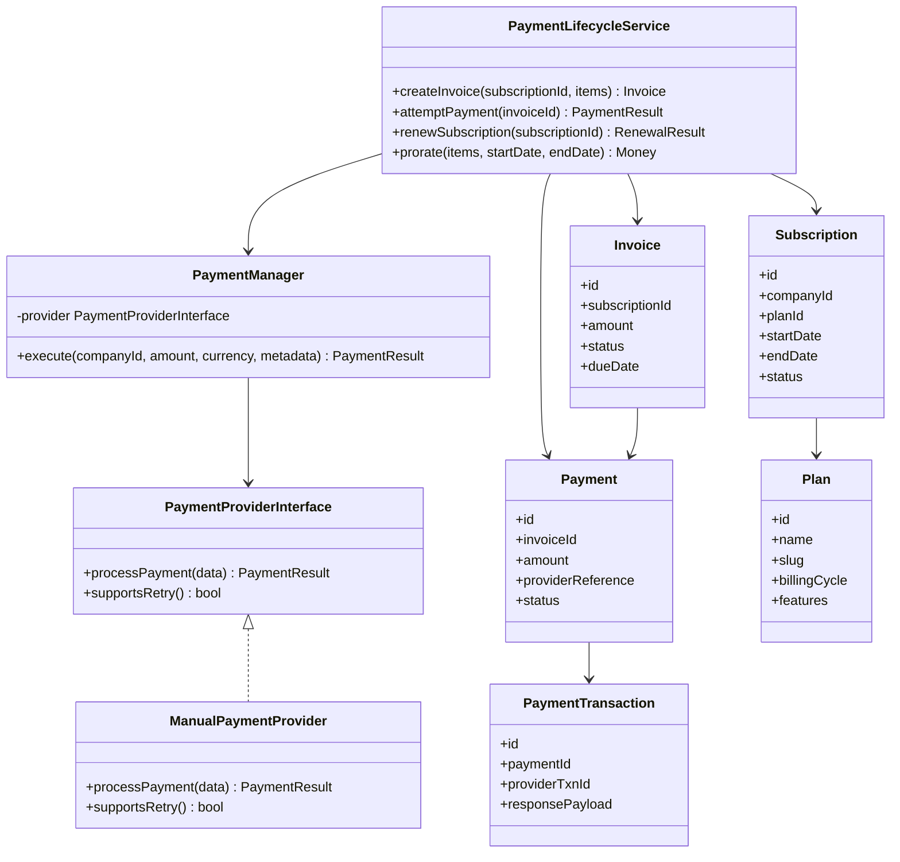

**Diagram sources**
- [PaymentProviderInterface.php](file://app/Modules/Payments/Contracts/PaymentProviderInterface.php)
- [ManualPaymentProvider.php](file://app/Modules/Payments/Providers/ManualPaymentProvider.php)
- [PaymentManager.php](file://app/Modules/Payments/Managers/PaymentManager.php)
- [PaymentLifecycleService.php](file://app/Modules/Payments/Services/PaymentLifecycleService.php)
- [Invoice.php](file://app/Modules/Payments/Models/Invoice.php)
- [Payment.php](file://app/Modules/Payments/Models/Payment.php)
- [PaymentTransaction.php](file://app/Modules/Payments/Models/PaymentTransaction.php)
- [Subscription.php](file://app/Modules/Payments/Models/Subscription.php)
- [Plan.php](file://app/Modules/Subscriptions/Models/Plan.php)

## Detailed Component Analysis

### Subscription Plan Architecture
- Tiers: Professional, Premium, Enterprise (slugs standardized via migrations).
- Pricing: Annual pricing column present; localization files provide tier names and pricing copy for the UI.
- Features: Linked to plans via plan-permission relationships; enforcement occurs at runtime via middleware and services.

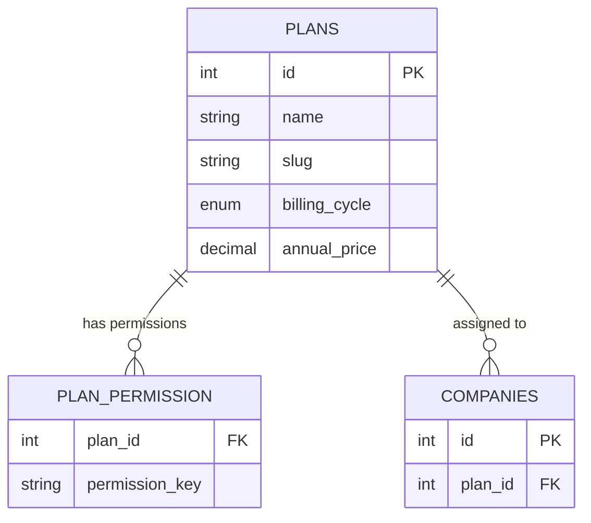

**Diagram sources**
- [2026_04_13_175428_create_plans_table.php](file://database/migrations/2026_04_13_175428_create_plans_table.php)
- [2026_04_13_175436_add_plan_id_to_companies_table.php](file://database/migrations/2026_04_13_175436_add_plan_id_to_companies_table.php)
- [2026_06_04_122255_rename_pro_plan_slug_to_professional.php](file://database/migrations/2026_06_04_122255_rename_pro_plan_slug_to_professional.php)
- [2026_06_08_080000_add_annual_price_to_plans_table.php](file://database/migrations/2026_06_08_080000_add_annual_price_to_plans_table.php)
- [pricing.php](file://lang/en/pricing.php)

**Section sources**
- [2026_04_13_175428_create_plans_table.php](file://database/migrations/2026_04_13_175428_create_plans_table.php)
- [2026_04_13_175436_add_plan_id_to_companies_table.php](file://database/migrations/2026_04_13_175436_add_plan_id_to_companies_table.php)
- [2026_06_04_122255_rename_pro_plan_slug_to_professional.php](file://database/migrations/2026_06_04_122255_rename_pro_plan_slug_to_professional.php)
- [2026_06_08_080000_add_annual_price_to_plans_table.php](file://database/migrations/2026_06_08_080000_add_annual_price_to_plans_table.php)
- [pricing.php](file://lang/en/pricing.php)
- [pricing.php](file://lang/ar/pricing.php)
- [pricing.php](file://lang/fr/pricing.php)

### Payment Provider Interface and Manual Provider
- PaymentProviderInterface defines the provider contract for payment execution and retry support.
- ManualPaymentProvider implements manual capture and posting, suitable for cash/cheque or bank transfers.

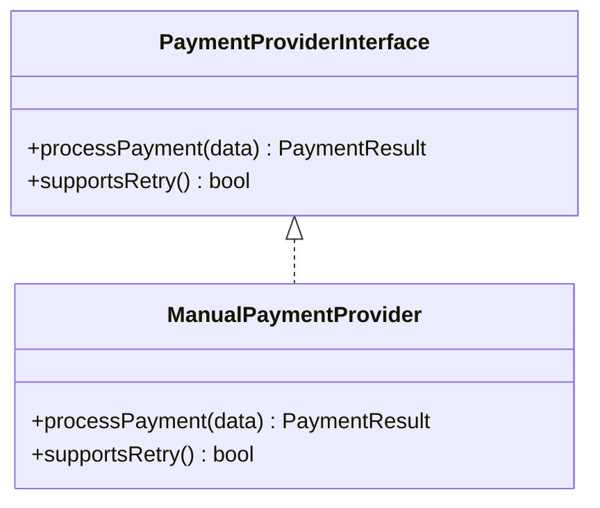

**Diagram sources**
- [PaymentProviderInterface.php](file://app/Modules/Payments/Contracts/PaymentProviderInterface.php)
- [ManualPaymentProvider.php](file://app/Modules/Payments/Providers/ManualPaymentProvider.php)

**Section sources**
- [PaymentProviderInterface.php](file://app/Modules/Payments/Contracts/PaymentProviderInterface.php)
- [ManualPaymentProvider.php](file://app/Modules/Payments/Providers/ManualPaymentProvider.php)

### Payment Lifecycle Service
- Responsibilities:
  - Create invoices linked to a subscription.
  - Attempt payments against invoices via selected provider.
  - Retry on failure according to provider capabilities.
  - Renew subscriptions upon successful payment.
  - Prorate charges across billing periods.
- Extensibility: New providers can implement the provider interface and be wired via PaymentManager.

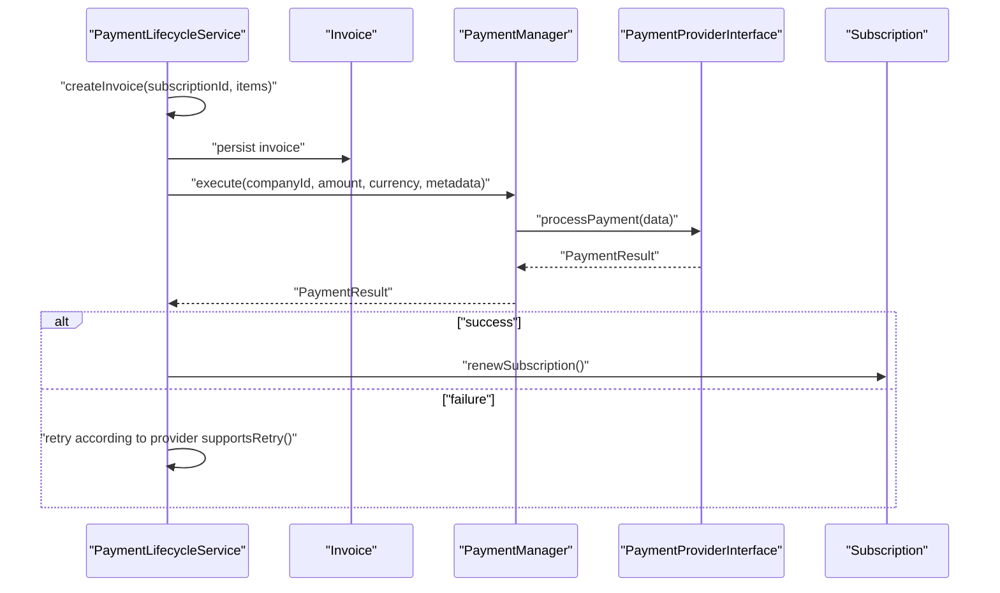

**Diagram sources**
- [PaymentLifecycleService.php](file://app/Modules/Payments/Services/PaymentLifecycleService.php)
- [PaymentManager.php](file://app/Modules/Payments/Managers/PaymentManager.php)
- [PaymentProviderInterface.php](file://app/Modules/Payments/Contracts/PaymentProviderInterface.php)
- [Subscription.php](file://app/Modules/Payments/Models/Subscription.php)

**Section sources**
- [PaymentLifecycleService.php](file://app/Modules/Payments/Services/PaymentLifecycleService.php)
- [PaymentManager.php](file://app/Modules/Payments/Managers/PaymentManager.php)
- [PaymentProviderInterface.php](file://app/Modules/Payments/Contracts/PaymentProviderInterface.php)
- [Subscription.php](file://app/Modules/Payments/Models/Subscription.php)

### Billing Cycle Management and Proration
- Billing cycle is defined at the plan level (monthly/annual).
- Proration calculations are exposed via the lifecycle service method for generating accurate invoice amounts across partial periods.
- Annual pricing is stored per plan to support yearly billing.

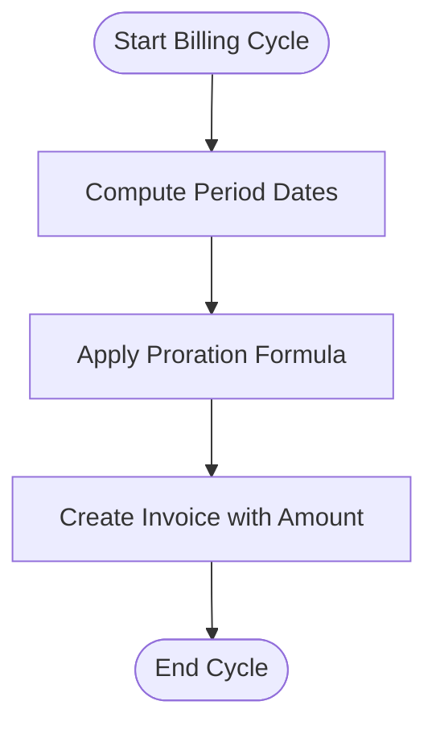

**Diagram sources**
- [PaymentLifecycleService.php](file://app/Modules/Payments/Services/PaymentLifecycleService.php)
- [2026_06_08_080000_add_annual_price_to_plans_table.php](file://database/migrations/2026_06_08_080000_add_annual_price_to_plans_table.php)

**Section sources**
- [PaymentLifecycleService.php](file://app/Modules/Payments/Services/PaymentLifecycleService.php)
- [2026_06_08_080000_add_annual_price_to_plans_table.php](file://database/migrations/2026_06_08_080000_add_annual_price_to_plans_table.php)

### Usage-Based Billing Hooks
- Invoice items are modeled via InvoiceItem, enabling line items that can represent usage-based charges.
- The lifecycle service accepts items during invoice creation, allowing usage metrics to be aggregated and invoiced.

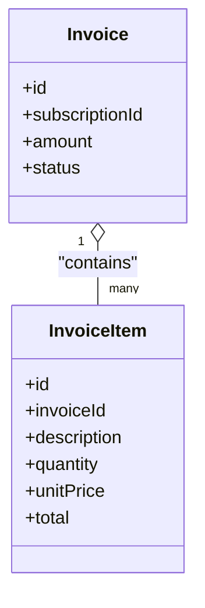

**Diagram sources**
- [InvoiceItem.php](file://app/Modules/Payments/Models/InvoiceItem.php)
- [Invoice.php](file://app/Modules/Payments/Models/Invoice.php)

**Section sources**
- [InvoiceItem.php](file://app/Modules/Payments/Models/InvoiceItem.php)
- [Invoice.php](file://app/Modules/Payments/Models/Invoice.php)

### Subscription Lifecycle Management
- Activation: New subscriptions are created against a plan and company.
- Upgrades/Downgrades: Transition to a new plan while preserving remaining term credits via proration.
- Cancellations: Terminate the subscription at period end; handle refunds or credit per policy.
- Renewal: Automatic renewal upon successful payment; otherwise remain active until grace period ends.

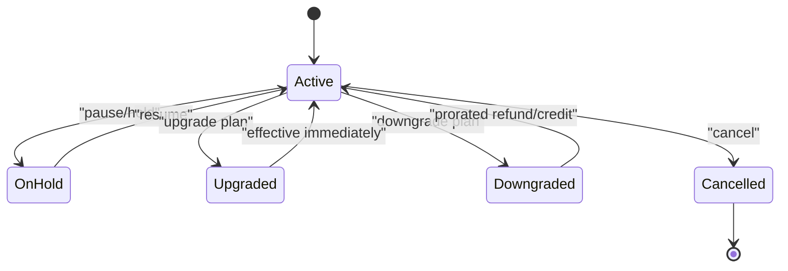

**Diagram sources**
- [Subscription.php](file://app/Modules/Payments/Models/Subscription.php)
- [Plan.php](file://app/Modules/Subscriptions/Models/Plan.php)
- [PaymentLifecycleService.php](file://app/Modules/Payments/Services/PaymentLifecycleService.php)

**Section sources**
- [Subscription.php](file://app/Modules/Payments/Models/Subscription.php)
- [Plan.php](file://app/Modules/Subscriptions/Models/Plan.php)
- [PaymentLifecycleService.php](file://app/Modules/Payments/Services/PaymentLifecycleService.php)

### Payment Failure Handling and Retries
- Providers indicate retry support; the lifecycle service invokes retries accordingly.
- PaymentTransaction captures provider response payloads for auditability.
- Notifications: Trigger customer notifications on payment failures and retries (implementation hooks exist in the provider and lifecycle service).

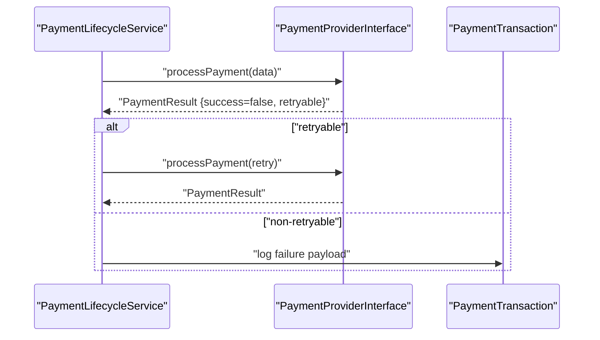

**Diagram sources**
- [PaymentLifecycleService.php](file://app/Modules/Payments/Services/PaymentLifecycleService.php)
- [PaymentProviderInterface.php](file://app/Modules/Payments/Contracts/PaymentProviderInterface.php)
- [PaymentTransaction.php](file://app/Modules/Payments/Models/PaymentTransaction.php)

**Section sources**
- [PaymentLifecycleService.php](file://app/Modules/Payments/Services/PaymentLifecycleService.php)
- [PaymentProviderInterface.php](file://app/Modules/Payments/Contracts/PaymentProviderInterface.php)
- [PaymentTransaction.php](file://app/Modules/Payments/Models/PaymentTransaction.php)

### Integration with External Payment Providers
- Pluggable architecture: Implement PaymentProviderInterface to integrate Stripe, PayPal, etc.
- PaymentManager selects provider and executes payments; no provider-specific logic leaks into business logic.
- ManualPaymentProvider demonstrates the minimal interface required.

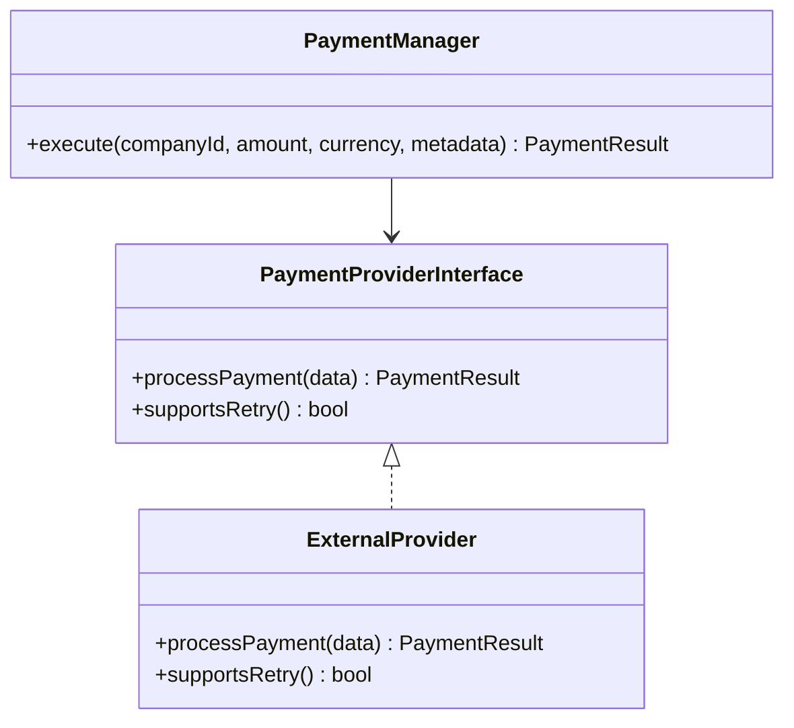

**Diagram sources**
- [PaymentManager.php](file://app/Modules/Payments/Managers/PaymentManager.php)
- [PaymentProviderInterface.php](file://app/Modules/Payments/Contracts/PaymentProviderInterface.php)

**Section sources**
- [PaymentManager.php](file://app/Modules/Payments/Managers/PaymentManager.php)
- [PaymentProviderInterface.php](file://app/Modules/Payments/Contracts/PaymentProviderInterface.php)

### Subscription Management APIs and Workflows
- Admin endpoints:
  - AdminInvoiceController: List, show invoices; trigger actions.
  - AdminPaymentController: List, show payments; reconcile.
  - AdminSubscriptionController: Manage subscriptions, view history.
- Company endpoint:
  - CompanyBillingController: Company-facing billing operations (view invoices, make payments).
- Middleware:
  - CheckSubscriptionValid: Enforce active subscription for protected routes.

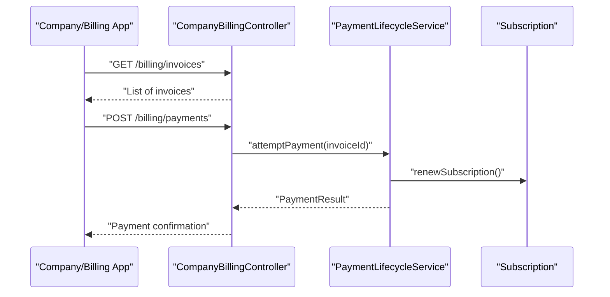

**Diagram sources**
- [CompanyBillingController.php](file://app/Modules/Payments/Controllers/CompanyBillingController.php)
- [AdminInvoiceController.php](file://app/Modules/Payments/Controllers/AdminInvoiceController.php)
- [AdminPaymentController.php](file://app/Modules/Payments/Controllers/AdminPaymentController.php)
- [AdminSubscriptionController.php](file://app/Modules/Payments/Controllers/AdminSubscriptionController.php)
- [PaymentLifecycleService.php](file://app/Modules/Payments/Services/PaymentLifecycleService.php)
- [Subscription.php](file://app/Modules/Payments/Models/Subscription.php)

**Section sources**
- [CompanyBillingController.php](file://app/Modules/Payments/Controllers/CompanyBillingController.php)
- [AdminInvoiceController.php](file://app/Modules/Payments/Controllers/AdminInvoiceController.php)
- [AdminPaymentController.php](file://app/Modules/Payments/Controllers/AdminPaymentController.php)
- [AdminSubscriptionController.php](file://app/Modules/Payments/Controllers/AdminSubscriptionController.php)
- [CheckSubscriptionValid.php](file://app/Http/Middleware/CheckSubscriptionValid.php)

## Dependency Analysis
- Cohesion: Payment and subscription logic is encapsulated within dedicated modules.
- Coupling: PaymentLifecycleService depends on models and provider interface; controllers depend on services.
- External integrations: Provider interface enables third-party payment processors without changing core logic.
- Data integrity: Migrations define strict schemas for invoices, payments, subscriptions, and plan definitions.

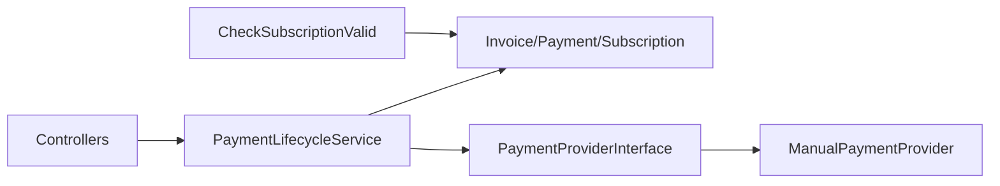

**Diagram sources**
- [PaymentLifecycleService.php](file://app/Modules/Payments/Services/PaymentLifecycleService.php)
- [Invoice.php](file://app/Modules/Payments/Models/Invoice.php)
- [Payment.php](file://app/Modules/Payments/Models/Payment.php)
- [Subscription.php](file://app/Modules/Payments/Models/Subscription.php)
- [PaymentProviderInterface.php](file://app/Modules/Payments/Contracts/PaymentProviderInterface.php)
- [ManualPaymentProvider.php](file://app/Modules/Payments/Providers/ManualPaymentProvider.php)
- [CheckSubscriptionValid.php](file://app/Http/Middleware/CheckSubscriptionValid.php)

**Section sources**
- [PaymentLifecycleService.php](file://app/Modules/Payments/Services/PaymentLifecycleService.php)
- [Invoice.php](file://app/Modules/Payments/Models/Invoice.php)
- [Payment.php](file://app/Modules/Payments/Models/Payment.php)
- [Subscription.php](file://app/Modules/Payments/Models/Subscription.php)
- [PaymentProviderInterface.php](file://app/Modules/Payments/Contracts/PaymentProviderInterface.php)
- [ManualPaymentProvider.php](file://app/Modules/Payments/Providers/ManualPaymentProvider.php)
- [CheckSubscriptionValid.php](file://app/Http/Middleware/CheckSubscriptionValid.php)

## Performance Considerations
- Batch processing: Group invoice creation and payment attempts to reduce database round-trips.
- Idempotency: Ensure payment execution is idempotent to avoid duplicate charges.
- Asynchronous retries: Offload retry logic to background jobs for provider-specific backoff strategies.
- Indexing: Ensure foreign keys (subscriptionId, invoiceId) are indexed for fast joins.

## Troubleshooting Guide
- Payment failures:
  - Inspect PaymentTransaction payloads for provider error details.
  - Verify provider retry support and reattempt accordingly.
- Subscription not renewing:
  - Confirm invoice status and payment success.
  - Check billing cycle and proration logic.
- Middleware blocking requests:
  - Validate CheckSubscriptionValid middleware for active subscription and plan permissions.

**Section sources**
- [PaymentTransaction.php](file://app/Modules/Payments/Models/PaymentTransaction.php)
- [PaymentLifecycleService.php](file://app/Modules/Payments/Services/PaymentLifecycleService.php)
- [CheckSubscriptionValid.php](file://app/Http/Middleware/CheckSubscriptionValid.php)

## Conclusion
Noubtigo’s payment and subscription system is built around a clean, pluggable architecture. The provider interface isolates payment execution, while the lifecycle service centralizes billing logic including proration and renewal. The modular design allows easy integration of new payment providers and robust management of subscription lifecycles, supported by strong data models and middleware enforcement.

## Appendices
- Schema highlights:
  - Plans: id, name, slug, billing_cycle, annual_price.
  - Subscriptions: companyId, planId, startDate, endDate, status.
  - Invoices: subscriptionId, amount, status, dueDate.
  - Payments: invoiceId, amount, providerReference, status.
  - PaymentTransactions: paymentId, providerTxnId, responsePayload.
- Localization: pricing.php files provide localized plan names and pricing copy.

**Section sources**
- [2026_04_13_175428_create_plans_table.php](file://database/migrations/2026_04_13_175428_create_plans_table.php)
- [2026_05_22_081618_create_subscriptions_table.php](file://database/migrations/2026_05_22_081618_create_subscriptions_table.php)
- [2026_05_22_081729_create_invoices_table.php](file://database/migrations/2026_05_22_081729_create_invoices_table.php)
- [2026_05_22_081649_create_payments_table.php](file://database/migrations/2026_05_22_081649_create_payments_table.php)
- [2026_05_22_081718_create_payment_transactions_table.php](file://database/migrations/2026_05_22_081718_create_payment_transactions_table.php)
- [pricing.php](file://lang/en/pricing.php)
- [pricing.php](file://lang/ar/pricing.php)
- [pricing.php](file://lang/fr/pricing.php)