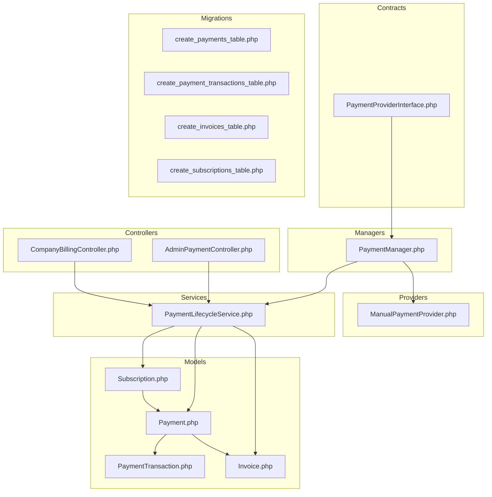
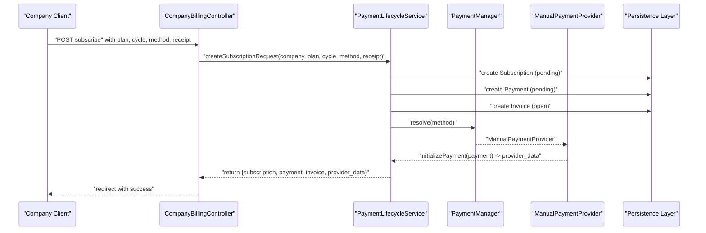
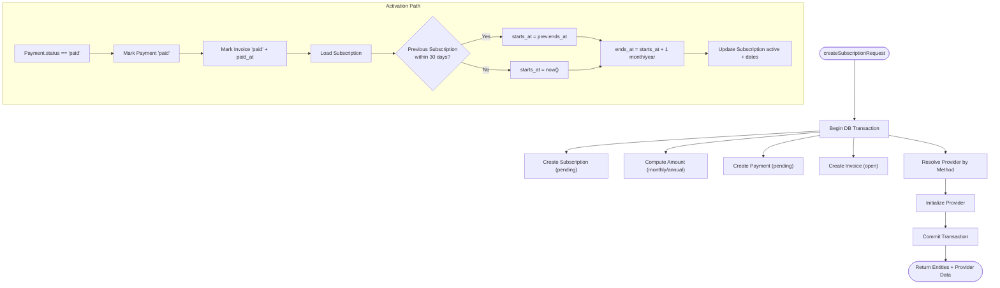
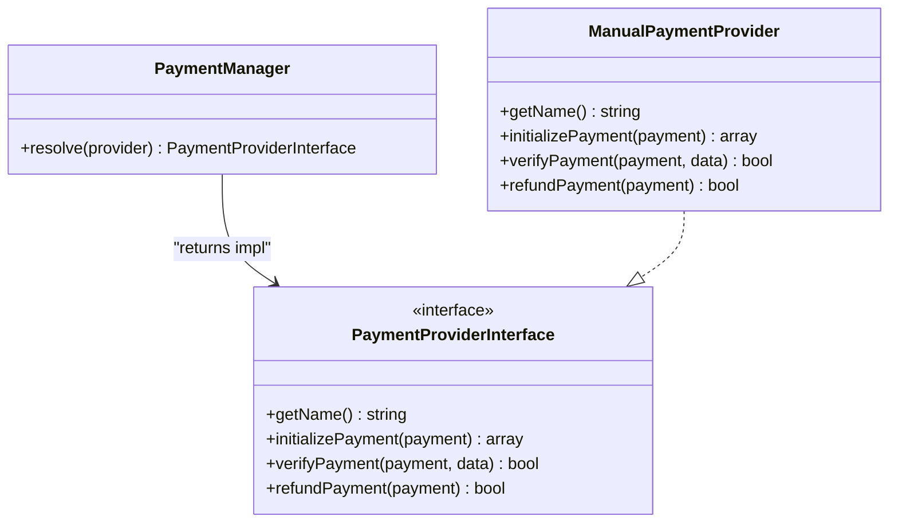
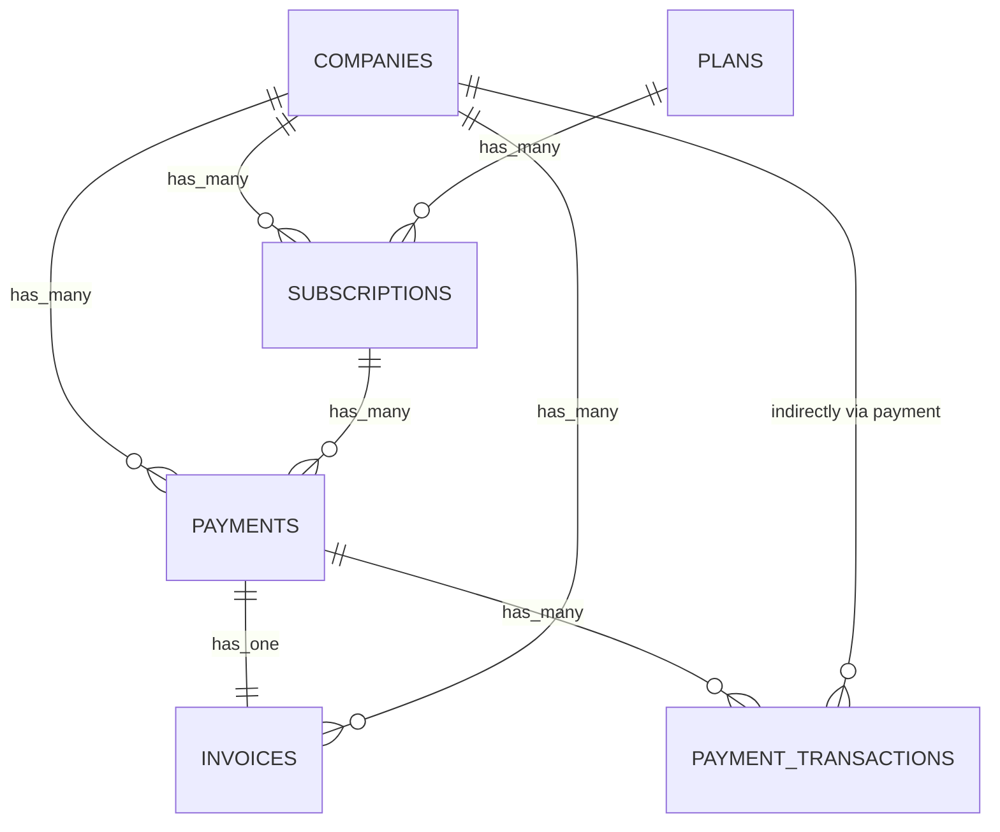
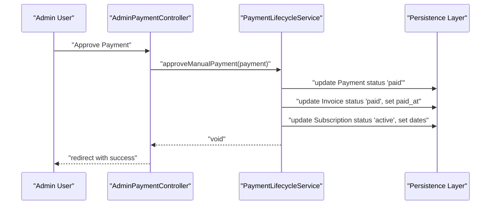
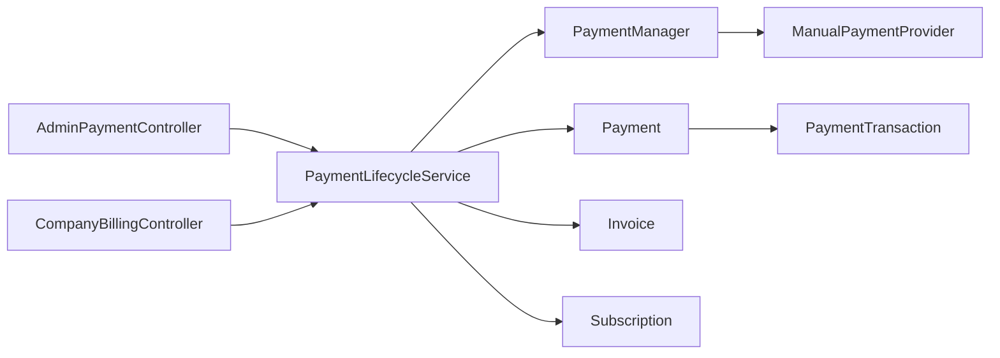
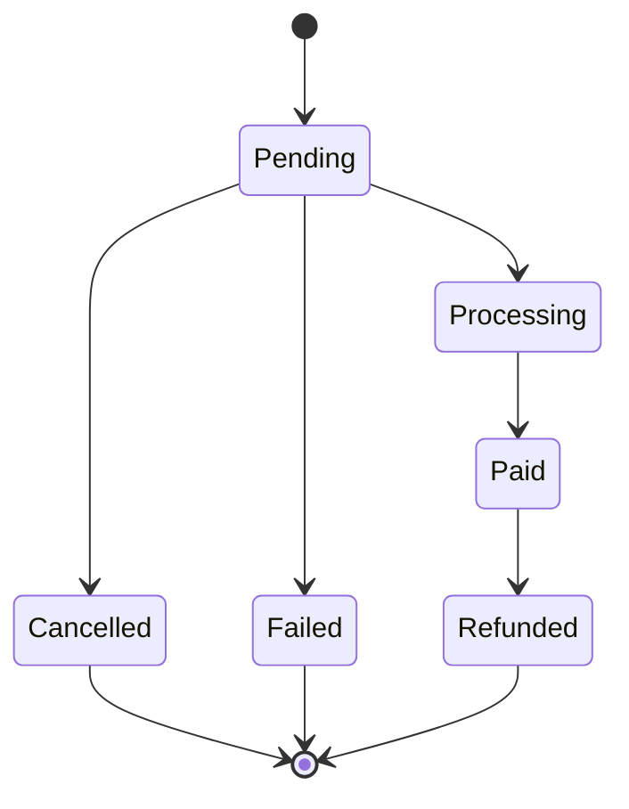

# Payment Processing & Lifecycle

<cite>
**Referenced Files in This Document**
- [Payment.php](file://app/Modules/Payments/Models/Payment.php)
- [PaymentTransaction.php](file://app/Modules/Payments/Models/PaymentTransaction.php)
- [Invoice.php](file://app/Modules/Payments/Models/Invoice.php)
- [Subscription.php](file://app/Modules/Payments/Models/Subscription.php)
- [PaymentProviderInterface.php](file://app/Modules/Payments/Contracts/PaymentProviderInterface.php)
- [PaymentManager.php](file://app/Modules/Payments/Managers/PaymentManager.php)
- [ManualPaymentProvider.php](file://app/Modules/Payments/Providers/ManualPaymentProvider.php)
- [PaymentLifecycleService.php](file://app/Modules/Payments/Services/PaymentLifecycleService.php)
- [AdminPaymentController.php](file://app/Modules/Payments/Controllers/AdminPaymentController.php)
- [CompanyBillingController.php](file://app/Modules/Payments/Controllers/CompanyBillingController.php)
- [2026_05_22_081718_create_payments_table.php](file://database/migrations/2026_05_22_081718_create_payments_table.php)
- [2026_05_22_081729_create_payment_transactions_table.php](file://database/migrations/2026_05_22_081729_create_payment_transactions_table.php)
- [2026_05_22_081731_create_invoices_table.php](file://database/migrations/2026_05_22_081731_create_invoices_table.php)
- [2026_05_22_081649_create_subscriptions_table.php](file://database/migrations/2026_05_22_081649_create_subscriptions_table.php)
</cite>

## Table of Contents
1. [Introduction](#introduction)
2. [Project Structure](#project-structure)
3. [Core Components](#core-components)
4. [Architecture Overview](#architecture-overview)
5. [Detailed Component Analysis](#detailed-component-analysis)
6. [Dependency Analysis](#dependency-analysis)
7. [Performance Considerations](#performance-considerations)
8. [Troubleshooting Guide](#troubleshooting-guide)
9. [Conclusion](#conclusion)
10. [Appendices](#appendices)

## Introduction
This document explains the payment processing workflow and lifecycle management implemented in the Payments module. It covers how payments are initiated, processed, tracked, and completed; how the payment manager coordinates provider integrations; and how models and relationships drive the system. It also documents the provider interface contract, state transitions, error handling, and operational procedures such as approvals, rejections, refunds, and receipt uploads. The goal is to provide both a high-level understanding and code-level insights for developers and operators.

## Project Structure
The Payments module follows a layered structure:
- Models define domain entities and relationships
- Contracts define provider interfaces
- Managers resolve providers
- Services orchestrate lifecycle operations
- Controllers expose admin and company-facing APIs
- Migrations define the persistence schema

**Diagram sources**
- [PaymentProviderInterface.php:1-30](file://app/Modules/Payments/Contracts/PaymentProviderInterface.php#L1-L30)
- [PaymentManager.php:1-35](file://app/Modules/Payments/Managers/PaymentManager.php#L1-L35)
- [ManualPaymentProvider.php:1-38](file://app/Modules/Payments/Providers/ManualPaymentProvider.php#L1-L38)
- [PaymentLifecycleService.php:1-154](file://app/Modules/Payments/Services/PaymentLifecycleService.php#L1-L154)
- [AdminPaymentController.php:1-108](file://app/Modules/Payments/Controllers/AdminPaymentController.php#L1-L108)
- [CompanyBillingController.php:1-163](file://app/Modules/Payments/Controllers/CompanyBillingController.php#L1-L163)
- [Payment.php:1-40](file://app/Modules/Payments/Models/Payment.php#L1-L40)
- [PaymentTransaction.php:1-25](file://app/Modules/Payments/Models/PaymentTransaction.php#L1-L25)
- [Invoice.php:1-43](file://app/Modules/Payments/Models/Invoice.php#L1-L43)
- [Subscription.php:1-42](file://app/Modules/Payments/Models/Subscription.php#L1-L42)
- [2026_05_22_081718_create_payments_table.php:1-34](file://database/migrations/2026_05_22_081718_create_payments_table.php#L1-L34)
- [2026_05_22_081729_create_payment_transactions_table.php:1-32](file://database/migrations/2026_05_22_081729_create_payment_transactions_table.php#L1-L32)
- [2026_05_22_081731_create_invoices_table.php:1-38](file://database/migrations/2026_05_22_081731_create_invoices_table.php#L1-L38)
- [2026_05_22_081649_create_subscriptions_table.php:1-35](file://database/migrations/2026_05_22_081649_create_subscriptions_table.php#L1-L35)

**Section sources**
- [Payment.php:1-40](file://app/Modules/Payments/Models/Payment.php#L1-L40)
- [PaymentTransaction.php:1-25](file://app/Modules/Payments/Models/PaymentTransaction.php#L1-L25)
- [Invoice.php:1-43](file://app/Modules/Payments/Models/Invoice.php#L1-L43)
- [Subscription.php:1-42](file://app/Modules/Payments/Models/Subscription.php#L1-L42)
- [PaymentProviderInterface.php:1-30](file://app/Modules/Payments/Contracts/PaymentProviderInterface.php#L1-L30)
- [PaymentManager.php:1-35](file://app/Modules/Payments/Managers/PaymentManager.php#L1-L35)
- [ManualPaymentProvider.php:1-38](file://app/Modules/Payments/Providers/ManualPaymentProvider.php#L1-L38)
- [PaymentLifecycleService.php:1-154](file://app/Modules/Payments/Services/PaymentLifecycleService.php#L1-L154)
- [AdminPaymentController.php:1-108](file://app/Modules/Payments/Controllers/AdminPaymentController.php#L1-L108)
- [CompanyBillingController.php:1-163](file://app/Modules/Payments/Controllers/CompanyBillingController.php#L1-L163)
- [2026_05_22_081718_create_payments_table.php:1-34](file://database/migrations/2026_05_22_081718_create_payments_table.php#L1-L34)
- [2026_05_22_081729_create_payment_transactions_table.php:1-32](file://database/migrations/2026_05_22_081729_create_payment_transactions_table.php#L1-L32)
- [2026_05_22_081731_create_invoices_table.php:1-38](file://database/migrations/2026_05_22_081731_create_invoices_table.php#L1-L38)
- [2026_05_22_081649_create_subscriptions_table.php:1-35](file://database/migrations/2026_05_22_081649_create_subscriptions_table.php#L1-L35)

## Core Components
- Payment model: central record of a payment attempt, linked to a company, optional subscription, and generated invoice; tracks amount, currency, method, and lifecycle status.
- PaymentTransaction model: records per-transaction metadata (reference, gateway response payload, status) tied to a payment.
- Invoice model: encapsulates billing details, totals, due date, and paid timestamp; linked to a payment.
- Subscription model: tracks billing cycle, status, and date windows; links to a company and plan.
- PaymentProviderInterface: contract for pluggable payment providers with methods for initialization, verification, and refund.
- PaymentManager: resolves provider instances by method string.
- ManualPaymentProvider: concrete provider for manual bank transfers; returns instructions and marks approvals as verified.
- PaymentLifecycleService: orchestrates end-to-end lifecycle: creates subscription/payment/invoice, initializes provider, activates subscription upon payment, and handles admin approvals.
- Controllers:
  - AdminPaymentController: admin operations (approve/reject/refund, listing, receipt download).
  - CompanyBillingController: tenant-facing operations (subscribe, upload receipt, view billing and invoices).

**Section sources**
- [Payment.php:1-40](file://app/Modules/Payments/Models/Payment.php#L1-L40)
- [PaymentTransaction.php:1-25](file://app/Modules/Payments/Models/PaymentTransaction.php#L1-L25)
- [Invoice.php:1-43](file://app/Modules/Payments/Models/Invoice.php#L1-L43)
- [Subscription.php:1-42](file://app/Modules/Payments/Models/Subscription.php#L1-L42)
- [PaymentProviderInterface.php:1-30](file://app/Modules/Payments/Contracts/PaymentProviderInterface.php#L1-L30)
- [PaymentManager.php:1-35](file://app/Modules/Payments/Managers/PaymentManager.php#L1-L35)
- [ManualPaymentProvider.php:1-38](file://app/Modules/Payments/Providers/ManualPaymentProvider.php#L1-L38)
- [PaymentLifecycleService.php:1-154](file://app/Modules/Payments/Services/PaymentLifecycleService.php#L1-L154)
- [AdminPaymentController.php:1-108](file://app/Modules/Payments/Controllers/AdminPaymentController.php#L1-L108)
- [CompanyBillingController.php:1-163](file://app/Modules/Payments/Controllers/CompanyBillingController.php#L1-L163)

## Architecture Overview
The system separates concerns across contracts, managers, services, and controllers while persisting state via Eloquent models and migrations. The lifecycle is transactional and tenant-scoped, ensuring atomicity for creation and activation steps.

**Diagram sources**
- [CompanyBillingController.php:73-107](file://app/Modules/Payments/Controllers/CompanyBillingController.php#L73-L107)
- [PaymentLifecycleService.php:27-84](file://app/Modules/Payments/Services/PaymentLifecycleService.php#L27-L84)
- [PaymentManager.php:14-33](file://app/Modules/Payments/Managers/PaymentManager.php#L14-L33)
- [ManualPaymentProvider.php:15-23](file://app/Modules/Payments/Providers/ManualPaymentProvider.php#L15-L23)
- [2026_05_22_081718_create_payments_table.php:14-23](file://database/migrations/2026_05_22_081718_create_payments_table.php#L14-L23)
- [2026_05_22_081731_create_invoices_table.php:14-27](file://database/migrations/2026_05_22_081731_create_invoices_table.php#L14-L27)
- [2026_05_22_081649_create_subscriptions_table.php:14-24](file://database/migrations/2026_05_22_081649_create_subscriptions_table.php#L14-L24)

## Detailed Component Analysis

### Payment Lifecycle Service
Responsibilities:
- Create a pending subscription, payment, and open invoice within a single transaction
- Compute amounts based on billing cycle
- Initialize provider-specific data for the chosen payment method
- Activate subscription upon successful payment
- Approve manual payments from admin

Key behaviors:
- Transactional creation ensures consistency across related entities
- Activation logic sets subscription dates and status, stacking renewal windows when applicable
- Admin approval triggers activation for manual methods

**Diagram sources**
- [PaymentLifecycleService.php:27-84](file://app/Modules/Payments/Services/PaymentLifecycleService.php#L27-L84)
- [PaymentLifecycleService.php:89-136](file://app/Modules/Payments/Services/PaymentLifecycleService.php#L89-L136)

**Section sources**
- [PaymentLifecycleService.php:27-84](file://app/Modules/Payments/Services/PaymentLifecycleService.php#L27-L84)
- [PaymentLifecycleService.php:89-136](file://app/Modules/Payments/Services/PaymentLifecycleService.php#L89-L136)
- [PaymentLifecycleService.php:141-152](file://app/Modules/Payments/Services/PaymentLifecycleService.php#L141-L152)

### Payment Manager and Provider Resolution
- Resolves provider instances based on payment method string
- Supports manual variants ("manual", "virement", "chari_online")
- Throws on unsupported provider identifiers

**Diagram sources**
- [PaymentManager.php:14-33](file://app/Modules/Payments/Managers/PaymentManager.php#L14-L33)
- [PaymentProviderInterface.php:7-29](file://app/Modules/Payments/Contracts/PaymentProviderInterface.php#L7-L29)
- [ManualPaymentProvider.php:8-37](file://app/Modules/Payments/Providers/ManualPaymentProvider.php#L8-L37)

**Section sources**
- [PaymentManager.php:14-33](file://app/Modules/Payments/Managers/PaymentManager.php#L14-L33)
- [PaymentProviderInterface.php:7-29](file://app/Modules/Payments/Contracts/PaymentProviderInterface.php#L7-L29)
- [ManualPaymentProvider.php:10-36](file://app/Modules/Payments/Providers/ManualPaymentProvider.php#L10-L36)

### Models and Relationships
Core entities and their relationships:
- Payment belongs to Company and Subscription, has one Invoice, and many PaymentTransactions
- Invoice belongs to Company and Payment, has many InvoiceItems
- Subscription belongs to Company and Plan, has many Payments
- PaymentTransaction belongs to Payment

**Diagram sources**
- [Payment.php:20-38](file://app/Modules/Payments/Models/Payment.php#L20-L38)
- [Invoice.php:28-36](file://app/Modules/Payments/Models/Invoice.php#L28-L36)
- [Subscription.php:27-40](file://app/Modules/Payments/Models/Subscription.php#L27-L40)
- [PaymentTransaction.php:20-23](file://app/Modules/Payments/Models/PaymentTransaction.php#L20-L23)

**Section sources**
- [Payment.php:20-38](file://app/Modules/Payments/Models/Payment.php#L20-L38)
- [Invoice.php:28-36](file://app/Modules/Payments/Models/Invoice.php#L28-L36)
- [Subscription.php:27-40](file://app/Modules/Payments/Models/Subscription.php#L27-L40)
- [PaymentTransaction.php:20-23](file://app/Modules/Payments/Models/PaymentTransaction.php#L20-L23)

### Controllers: Admin and Company Operations
- AdminPaymentController
  - Lists payments with filters and statistics
  - Approves manual payments (delegates to lifecycle service)
  - Rejects payments (sets status to failed and cancels subscription)
  - Refunds payments (sets status to refunded and cancels subscription)
  - Downloads uploaded receipts from storage
- CompanyBillingController
  - Renders billing dashboard with active/pending subscriptions, payments, and invoices
  - Handles subscription requests with validation and receipt upload
  - Validates invoice access and visibility
  - Uploads bank receipt for pending payments

**Diagram sources**
- [AdminPaymentController.php:49-57](file://app/Modules/Payments/Controllers/AdminPaymentController.php#L49-L57)
- [PaymentLifecycleService.php:141-152](file://app/Modules/Payments/Services/PaymentLifecycleService.php#L141-L152)

**Section sources**
- [AdminPaymentController.php:19-44](file://app/Modules/Payments/Controllers/AdminPaymentController.php#L19-L44)
- [AdminPaymentController.php:49-94](file://app/Modules/Payments/Controllers/AdminPaymentController.php#L49-L94)
- [CompanyBillingController.php:25-68](file://app/Modules/Payments/Controllers/CompanyBillingController.php#L25-L68)
- [CompanyBillingController.php:73-107](file://app/Modules/Payments/Controllers/CompanyBillingController.php#L73-L107)
- [CompanyBillingController.php:138-161](file://app/Modules/Payments/Controllers/CompanyBillingController.php#L138-L161)

## Dependency Analysis
- Controllers depend on services for business logic
- Services depend on managers/providers for external integrations
- Models encapsulate persistence and relationships
- Migrations define schema and constraints

**Diagram sources**
- [AdminPaymentController.php:14](file://app/Modules/Payments/Controllers/AdminPaymentController.php#L14)
- [CompanyBillingController.php:18](file://app/Modules/Payments/Controllers/CompanyBillingController.php#L18)
- [PaymentLifecycleService.php:19](file://app/Modules/Payments/Services/PaymentLifecycleService.php#L19)
- [PaymentManager.php:14](file://app/Modules/Payments/Managers/PaymentManager.php#L14)
- [ManualPaymentProvider.php:8](file://app/Modules/Payments/Providers/ManualPaymentProvider.php#L8)
- [Payment.php:30](file://app/Modules/Payments/Models/Payment.php#L30)
- [Invoice.php:33](file://app/Modules/Payments/Models/Invoice.php#L33)
- [Subscription.php:37](file://app/Modules/Payments/Models/Subscription.php#L37)
- [PaymentTransaction.php:20](file://app/Modules/Payments/Models/PaymentTransaction.php#L20)

**Section sources**
- [AdminPaymentController.php:14](file://app/Modules/Payments/Controllers/AdminPaymentController.php#L14)
- [CompanyBillingController.php:18](file://app/Modules/Payments/Controllers/CompanyBillingController.php#L18)
- [PaymentLifecycleService.php:19](file://app/Modules/Payments/Services/PaymentLifecycleService.php#L19)
- [PaymentManager.php:14](file://app/Modules/Payments/Managers/PaymentManager.php#L14)
- [ManualPaymentProvider.php:8](file://app/Modules/Payments/Providers/ManualPaymentProvider.php#L8)
- [Payment.php:30](file://app/Modules/Payments/Models/Payment.php#L30)
- [Invoice.php:33](file://app/Modules/Payments/Models/Invoice.php#L33)
- [Subscription.php:37](file://app/Modules/Payments/Models/Subscription.php#L37)
- [PaymentTransaction.php:20](file://app/Modules/Payments/Models/PaymentTransaction.php#L20)

## Performance Considerations
- Use database transactions for lifecycle operations to avoid partial writes
- Batch queries in controllers where pagination is used (already applied)
- Keep provider initialization lightweight; defer heavy operations to background jobs if extended
- Index frequently filtered columns (status, payment_method, company_id) at the database level
- Minimize N+1 queries by eager-loading relations in controllers

## Troubleshooting Guide
Common scenarios and handling:
- Unsupported provider method
  - Symptom: exception thrown during provider resolution
  - Action: verify payment_method value matches supported keys
- Attempting to refund a non-paid payment
  - Symptom: rejection with error message
  - Action: ensure payment status is 'paid' before refund
- Approving a non-manual payment
  - Symptom: exception indicating method mismatch
  - Action: restrict approvals to manual variants
- Receipt not found
  - Symptom: redirect with error when downloading receipt
  - Action: confirm receipt_path exists in storage and belongs to the entity
- Duplicate or missing tenant context
  - Symptom: unauthorized access or missing company context
  - Action: ensure tenant middleware is active and company context is present

Operational checks:
- Validate payment status transitions align with business rules
- Confirm invoice visibility only after payment is marked paid
- Audit provider_data returned by initializePayment for correctness

**Section sources**
- [PaymentManager.php:30-32](file://app/Modules/Payments/Managers/PaymentManager.php#L30-L32)
- [AdminPaymentController.php:64-76](file://app/Modules/Payments/Controllers/AdminPaymentController.php#L64-L76)
- [AdminPaymentController.php:83-94](file://app/Modules/Payments/Controllers/AdminPaymentController.php#L83-L94)
- [PaymentLifecycleService.php:143-145](file://app/Modules/Payments/Services/PaymentLifecycleService.php#L143-L145)
- [AdminPaymentController.php:101-106](file://app/Modules/Payments/Controllers/AdminPaymentController.php#L101-L106)
- [CompanyBillingController.php:120-128](file://app/Modules/Payments/Controllers/CompanyBillingController.php#L120-L128)

## Conclusion
The Payments module implements a clean, extensible lifecycle for subscription and payment processing. It uses a provider interface to integrate different payment methods, maintains strong tenant isolation, and ensures data consistency through transactions. The controllers provide clear admin and company workflows, while the models and migrations define robust relationships and statuses. Extending to additional providers involves implementing the provider interface and updating the manager resolver.

## Appendices

### Payment State Transitions

[No sources needed since this diagram shows conceptual workflow, not actual code structure]

### Persistence Schema Overview
- Payments: company_id, subscription_id, amount, currency, payment_method, status, timestamps
- PaymentTransactions: payment_id, transaction_reference, gateway_response, status, timestamps
- Invoices: company_id, payment_id, invoice_number, subtotal, tax, total, currency, status, due_date, paid_at, timestamps
- Subscriptions: company_id, plan_id, billing_cycle, status, starts_at, ends_at, canceled_at, timestamps

**Section sources**
- [2026_05_22_081718_create_payments_table.php:14-23](file://database/migrations/2026_05_22_081718_create_payments_table.php#L14-L23)
- [2026_05_22_081729_create_payment_transactions_table.php:14-21](file://database/migrations/2026_05_22_081729_create_payment_transactions_table.php#L14-L21)
- [2026_05_22_081731_create_invoices_table.php:14-27](file://database/migrations/2026_05_22_081731_create_invoices_table.php#L14-L27)
- [2026_05_22_081649_create_subscriptions_table.php:14-24](file://database/migrations/2026_05_22_081649_create_subscriptions_table.php#L14-L24)