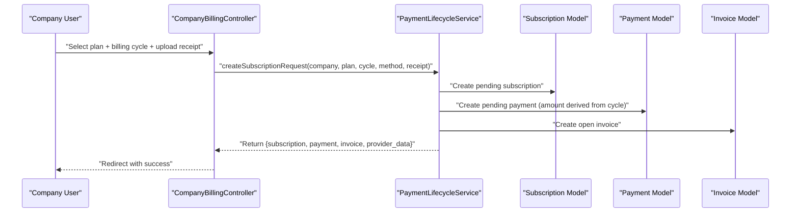
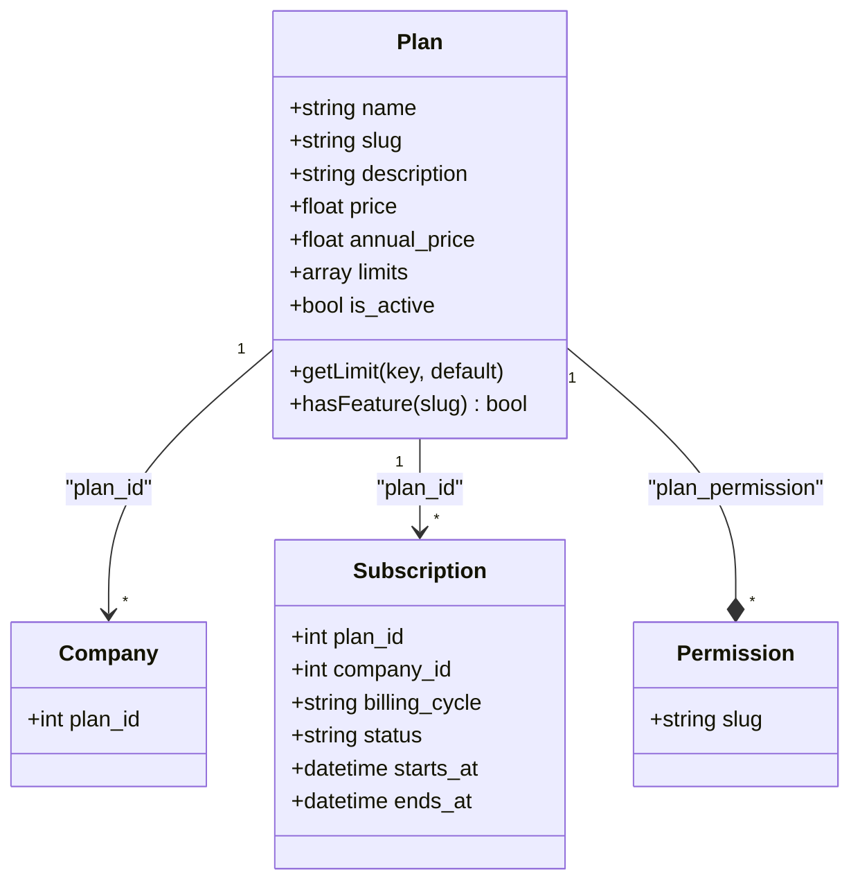
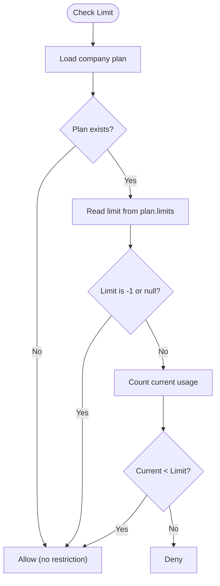
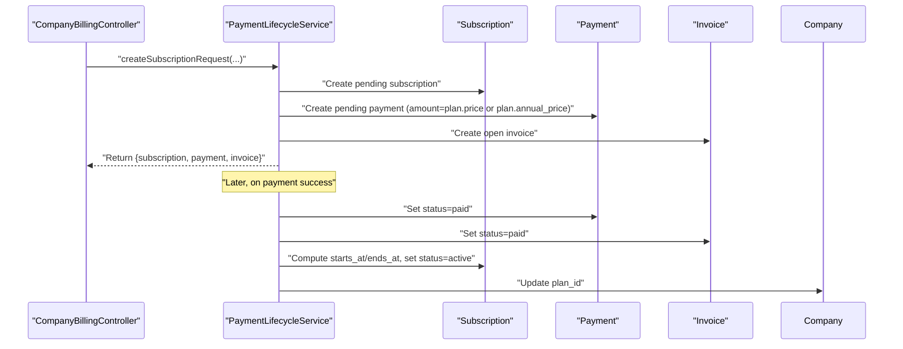
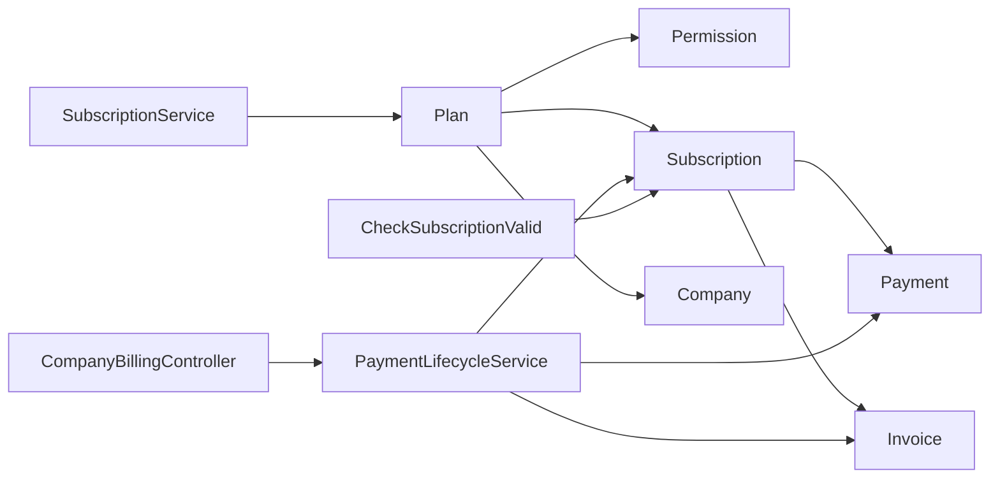

# Subscription Plans & Pricing

<cite>
**Referenced Files in This Document**
- [Plan.php](file://app/Modules/Subscriptions/Models/Plan.php)
- [Subscription.php](file://app/Modules/Payments/Models/Subscription.php)
- [SubscriptionService.php](file://app/Modules/Subscriptions/Services/SubscriptionService.php)
- [CompanyBillingController.php](file://app/Modules/Payments/Controllers/CompanyBillingController.php)
- [AdminSubscriptionController.php](file://app/Modules/Payments/Controllers/AdminSubscriptionController.php)
- [PaymentLifecycleService.php](file://app/Modules/Payments/Services/PaymentLifecycleService.php)
- [CheckSubscriptionValid.php](file://app/Http/Middleware/CheckSubscriptionValid.php)
- [2026_04_13_175428_create_plans_table.php](file://database/migrations/2026_04_13_175428_create_plans_table.php)
- [2026_05_22_081649_create_subscriptions_table.php](file://database/migrations/2026_05_22_081649_create_subscriptions_table.php)
- [PlanSeeder.php](file://database/seeders/PlanSeeder.php)
- [pricing.php](file://lang/en/pricing.php)
</cite>

## Table of Contents
1. [Introduction](#introduction)
2. [Project Structure](#project-structure)
3. [Core Components](#core-components)
4. [Architecture Overview](#architecture-overview)
5. [Detailed Component Analysis](#detailed-component-analysis)
6. [Dependency Analysis](#dependency-analysis)
7. [Performance Considerations](#performance-considerations)
8. [Troubleshooting Guide](#troubleshooting-guide)
9. [Conclusion](#conclusion)
10. [Appendices](#appendices)

## Introduction
This document describes the subscription plan management system used by the application. It covers the plan model structure, plan tiers, pricing strategy, plan seeding, plan activation/upgrades, and enforcement mechanisms. It also documents plan limits, feature gating, and tenant-specific behavior.

## Project Structure
The subscription system spans several modules:
- Subscriptions module: Plan model and subscription service for plan enforcement
- Payments module: Subscription lifecycle, invoices, payments, and admin controls
- Companies module: Tenant context and plan assignment
- Migrations and seeders: Database schema and initial plan data
- Middleware: Runtime enforcement of subscription validity

```mermaid
graph TB
subgraph "Subscriptions Module"
PLAN["Plan Model<br/>limits, permissions"]
SUB_SRV["SubscriptionService<br/>limits checks"]
end
subgraph "Payments Module"
SUB["Subscription Model<br/>billing_cycle, status"]
PAY_LIFECYCLE["PaymentLifecycleService<br/>create/activate"]
ADMIN_CTRL["AdminSubscriptionController<br/>activate/suspend"]
BILLING_CTRL["CompanyBillingController<br/>subscribe/show invoice"]
end
subgraph "Companies Module"
COMPANY["Company Model<br/>plan_id"]
end
PLAN <-- "plan_id" --> COMPANY
PLAN < --> SUB
SUB_SRV --> PLAN
BILLING_CTRL --> PAY_LIFECYCLE
ADMIN_CTRL --> SUB
PAY_LIFECYCLE --> SUB
```

**Diagram sources**
- [Plan.php:1-66](file://app/Modules/Subscriptions/Models/Plan.php#L1-L66)
- [Subscription.php:1-42](file://app/Modules/Payments/Models/Subscription.php#L1-L42)
- [SubscriptionService.php:1-134](file://app/Modules/Subscriptions/Services/SubscriptionService.php#L1-L134)
- [PaymentLifecycleService.php:1-154](file://app/Modules/Payments/Services/PaymentLifecycleService.php#L1-L154)
- [AdminSubscriptionController.php:1-50](file://app/Modules/Payments/Controllers/AdminSubscriptionController.php#L1-L50)
- [CompanyBillingController.php:1-163](file://app/Modules/Payments/Controllers/CompanyBillingController.php#L1-L163)

**Section sources**
- [Plan.php:1-66](file://app/Modules/Subscriptions/Models/Plan.php#L1-L66)
- [Subscription.php:1-42](file://app/Modules/Payments/Models/Subscription.php#L1-L42)
- [SubscriptionService.php:1-134](file://app/Modules/Subscriptions/Services/SubscriptionService.php#L1-L134)
- [PaymentLifecycleService.php:1-154](file://app/Modules/Payments/Services/PaymentLifecycleService.php#L1-L154)
- [CompanyBillingController.php:1-163](file://app/Modules/Payments/Controllers/CompanyBillingController.php#L1-L163)
- [AdminSubscriptionController.php:1-50](file://app/Modules/Payments/Controllers/AdminSubscriptionController.php#L1-L50)

## Core Components
- Plan model: Defines plan metadata (name, slug, description), pricing (monthly and annual), limits (JSON), and active flag. Provides helpers to fetch limits and check feature permissions.
- Subscription model: Tracks company-to-plan association, billing cycle, status, and date windows.
- SubscriptionService: Enforces plan limits for staff, rooms, customers, and monthly ticket volumes; checks feature permissions.
- PaymentLifecycleService: Orchestrates subscription requests, payment creation, invoice generation, and activation.
- CompanyBillingController: Handles plan selection, billing cycle choice, and receipt uploads.
- AdminSubscriptionController: System admin actions to activate or suspend subscriptions.
- Middleware: Enforces subscription validity per tenant context.

**Section sources**
- [Plan.php:1-66](file://app/Modules/Subscriptions/Models/Plan.php#L1-L66)
- [Subscription.php:1-42](file://app/Modules/Payments/Models/Subscription.php#L1-L42)
- [SubscriptionService.php:1-134](file://app/Modules/Subscriptions/Services/SubscriptionService.php#L1-L134)
- [PaymentLifecycleService.php:1-154](file://app/Modules/Payments/Services/PaymentLifecycleService.php#L1-L154)
- [CompanyBillingController.php:1-163](file://app/Modules/Payments/Controllers/CompanyBillingController.php#L1-L163)
- [AdminSubscriptionController.php:1-50](file://app/Modules/Payments/Controllers/AdminSubscriptionController.php#L1-L50)
- [CheckSubscriptionValid.php:1-88](file://app/Http/Middleware/CheckSubscriptionValid.php#L1-L88)

## Architecture Overview
The system separates plan definition from subscription lifecycle:
- Plan defines pricing and limits
- Subscription tracks the active plan and billing cycle
- PaymentLifecycleService creates pending records and activates upon payment
- SubscriptionService enforces limits during runtime
- Middleware ensures access compliance



**Diagram sources**
- [CompanyBillingController.php:73-107](file://app/Modules/Payments/Controllers/CompanyBillingController.php#L73-L107)
- [PaymentLifecycleService.php:27-84](file://app/Modules/Payments/Services/PaymentLifecycleService.php#L27-L84)
- [Subscription.php:1-42](file://app/Modules/Payments/Models/Subscription.php#L1-L42)

## Detailed Component Analysis

### Plan Model
- Fields: name, slug (unique), description, price (monthly), annual_price, limits (JSON), is_active
- Relationships:
  - Companies: one-to-many via plan_id
  - Subscriptions: one-to-many via plan_id
  - Permissions: many-to-many via plan_permission pivot
- Helpers:
  - getLimit(key, default): retrieves a limit value from JSON
  - hasFeature(slug): checks if a feature permission is attached to the plan



**Diagram sources**
- [Plan.php:1-66](file://app/Modules/Subscriptions/Models/Plan.php#L1-L66)
- [Subscription.php:1-42](file://app/Modules/Payments/Models/Subscription.php#L1-L42)

**Section sources**
- [Plan.php:1-66](file://app/Modules/Subscriptions/Models/Plan.php#L1-L66)
- [2026_04_13_175428_create_plans_table.php:14-23](file://database/migrations/2026_04_13_175428_create_plans_table.php#L14-L23)
- [2026_04_13_175428_create_plans_table.php:1-34](file://database/migrations/2026_04_13_175428_create_plans_table.php#L1-L34)

### Subscription Model
- Fields: company_id, plan_id, billing_cycle ('monthly' | 'annual'), status ('pending' | 'active' | 'suspended' | 'cancelled' | 'expired'), timestamps
- Relationships: belongs to Company and Plan; has many Payments
- Used by middleware to enforce access based on latest subscription

**Section sources**
- [Subscription.php:1-42](file://app/Modules/Payments/Models/Subscription.php#L1-L42)
- [2026_05_22_081649_create_subscriptions_table.php:14-24](file://database/migrations/2026_05_22_081649_create_subscriptions_table.php#L14-L24)

### SubscriptionService (Limits & Permissions)
- Enforces limits:
  - Staff count vs staff_limit
  - Rooms count vs room_limit
  - Customers count vs customer_limit
  - Monthly tickets vs ticket_limit_monthly
- Calculates remaining tickets for the current month
- Checks feature permissions via cached plan permissions lookup



**Diagram sources**
- [SubscriptionService.php:16-31](file://app/Modules/Subscriptions/Services/SubscriptionService.php#L16-L31)
- [SubscriptionService.php:80-95](file://app/Modules/Subscriptions/Services/SubscriptionService.php#L80-L95)

**Section sources**
- [SubscriptionService.php:1-134](file://app/Modules/Subscriptions/Services/SubscriptionService.php#L1-L134)

### Payment Lifecycle (Creation & Activation)
- Creation:
  - Create pending Subscription
  - Create pending Payment with amount based on billing_cycle
  - Create open Invoice and InvoiceItem
  - Initialize payment via provider
- Activation:
  - On payment success, mark Payment and Invoice as paid
  - Compute starts_at/ends_at (monthly or annual)
  - Update Subscription status to active
  - Update Company.plan_id for backward compatibility



**Diagram sources**
- [PaymentLifecycleService.php:27-84](file://app/Modules/Payments/Services/PaymentLifecycleService.php#L27-L84)
- [PaymentLifecycleService.php:89-136](file://app/Modules/Payments/Services/PaymentLifecycleService.php#L89-L136)

**Section sources**
- [PaymentLifecycleService.php:1-154](file://app/Modules/Payments/Services/PaymentLifecycleService.php#L1-L154)
- [CompanyBillingController.php:73-107](file://app/Modules/Payments/Controllers/CompanyBillingController.php#L73-L107)

### Admin Controls
- Activate: Sets subscription status to active and updates company plan_id
- Suspend: Sets subscription status to suspended

**Section sources**
- [AdminSubscriptionController.php:32-48](file://app/Modules/Payments/Controllers/AdminSubscriptionController.php#L32-L48)

### Middleware Enforcement
- Bypasses for system admins and specific routes
- Blocks access if:
  - Latest subscription is pending, suspended, cancelled, or expired beyond grace period
  - No subscription and company has no plan_id
- Allows access if an active subscription exists within a grace period

**Section sources**
- [CheckSubscriptionValid.php:13-86](file://app/Http/Middleware/CheckSubscriptionValid.php#L13-L86)

## Dependency Analysis
- Plan depends on permissions via plan_permission pivot
- Subscription belongs to Plan and Company
- SubscriptionService depends on Plan limits and Eloquent counts
- PaymentLifecycleService orchestrates Subscription, Payment, and Invoice creation/activation
- Middleware depends on Subscription status and date windows



**Diagram sources**
- [Plan.php:45-48](file://app/Modules/Subscriptions/Models/Plan.php#L45-L48)
- [Subscription.php:27-40](file://app/Modules/Payments/Models/Subscription.php#L27-L40)
- [SubscriptionService.php:1-134](file://app/Modules/Subscriptions/Services/SubscriptionService.php#L1-L134)
- [PaymentLifecycleService.php:1-154](file://app/Modules/Payments/Services/PaymentLifecycleService.php#L1-L154)
- [CheckSubscriptionValid.php:1-88](file://app/Http/Middleware/CheckSubscriptionValid.php#L1-L88)

**Section sources**
- [Plan.php:1-66](file://app/Modules/Subscriptions/Models/Plan.php#L1-L66)
- [Subscription.php:1-42](file://app/Modules/Payments/Models/Subscription.php#L1-L42)
- [SubscriptionService.php:1-134](file://app/Modules/Subscriptions/Services/SubscriptionService.php#L1-L134)
- [PaymentLifecycleService.php:1-154](file://app/Modules/Payments/Services/PaymentLifecycleService.php#L1-L154)
- [CheckSubscriptionValid.php:1-88](file://app/Http/Middleware/CheckSubscriptionValid.php#L1-L88)

## Performance Considerations
- SubscriptionService caches plan permissions per request to reduce repeated queries
- Limits checks use simple counts; consider indexing company_id and created_at for tickets
- Middleware performs minimal queries but could benefit from caching recent subscription statuses per company

[No sources needed since this section provides general guidance]

## Troubleshooting Guide
Common issues and resolutions:
- Access blocked with pending subscription: Redirect to billing to finalize payment
- Access blocked due to suspension/cancellation/expiry: Contact support or renew
- No active subscription and company has no plan_id: Redirect to billing to select a plan
- Feature not available: Verify the plan has the required permission attached

**Section sources**
- [CheckSubscriptionValid.php:61-77](file://app/Http/Middleware/CheckSubscriptionValid.php#L61-L77)
- [CompanyBillingController.php:29-34](file://app/Modules/Payments/Controllers/CompanyBillingController.php#L29-L34)

## Conclusion
The subscription system cleanly separates plan definition (limits and features) from lifecycle management (subscriptions, payments, invoices). It supports monthly and annual billing, enforces usage limits, and provides admin controls for activation and suspension. Middleware ensures runtime compliance per tenant.

[No sources needed since this section summarizes without analyzing specific files]

## Appendices

### Plan Tiers and Limits
- Starter: Up to 2 staff, 1 room, 500 tickets/month, 50 customers
- Professional: Up to 5 staff, 3 rooms, 3000 tickets/month, 200 customers
- Business: Up to 15 staff, 5 rooms, 10000 tickets/month, 1000 customers
- Premium: Unlimited staff, rooms, tickets, customers

These tiers define pricing and feature availability. Premium removes numeric limits by using -1.

**Section sources**
- [PlanSeeder.php:27-84](file://database/seeders/PlanSeeder.php#L27-L84)
- [pricing.php:38-77](file://lang/en/pricing.php#L38-L77)

### Pricing Strategy and Promotions
- Monthly and annual prices are stored on the Plan model
- PaymentLifecycleService selects amount based on billing_cycle
- Annual pricing appears in UI language files; promotions are not implemented in the referenced code

**Section sources**
- [Plan.php:13-14](file://app/Modules/Subscriptions/Models/Plan.php#L13-L14)
- [PaymentLifecycleService.php:38-39](file://app/Modules/Payments/Services/PaymentLifecycleService.php#L38-L39)
- [pricing.php:38-77](file://lang/en/pricing.php#L38-L77)

### Plan Seeding and Default Assignment
- PlanSeeder creates four plans, clears old data, assigns companies without a plan to Starter, and cleans subscription module permissions
- Legacy companies without plan_id fall back to requiring a subscription

**Section sources**
- [PlanSeeder.php:22-131](file://database/seeders/PlanSeeder.php#L22-L131)
- [CheckSubscriptionValid.php:78-82](file://app/Http/Middleware/CheckSubscriptionValid.php#L78-L82)

### Plan Upgrade/Downgrade Scenarios
- Users submit a new subscription request with desired plan and billing cycle
- PaymentLifecycleService creates a pending subscription/payment/invoice
- Upon payment approval, the system activates the new subscription and sets ends_at/start dates accordingly

**Section sources**
- [CompanyBillingController.php:73-107](file://app/Modules/Payments/Controllers/CompanyBillingController.php#L73-L107)
- [PaymentLifecycleService.php:89-136](file://app/Modules/Payments/Services/PaymentLifecycleService.php#L89-L136)

### Plan Visibility and Feature Gating
- Plans are associated with permissions via plan_permission pivot
- SubscriptionService checks feature permissions by loading slugs once per plan per request
- Middleware does not gate features; enforcement occurs at resource level via SubscriptionService checks

**Section sources**
- [Plan.php:45-48](file://app/Modules/Subscriptions/Models/Plan.php#L45-L48)
- [SubscriptionService.php:117-132](file://app/Modules/Subscriptions/Services/SubscriptionService.php#L117-L132)

### Plan Comparison Matrix
- Use the language file entries to present feature comparisons in the UI
- The matrix includes plan names, descriptions, monthly/yearly prices, feature caps, and included features

**Section sources**
- [pricing.php:38-77](file://lang/en/pricing.php#L38-L77)