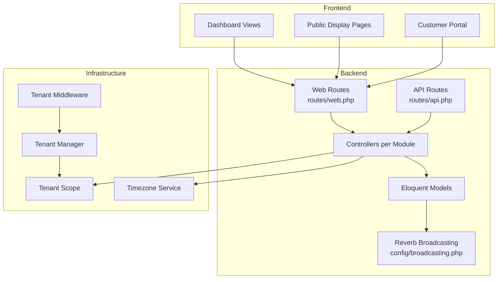
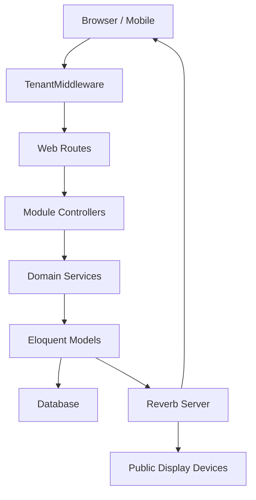
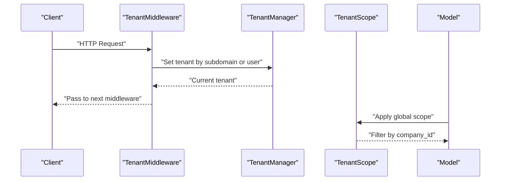
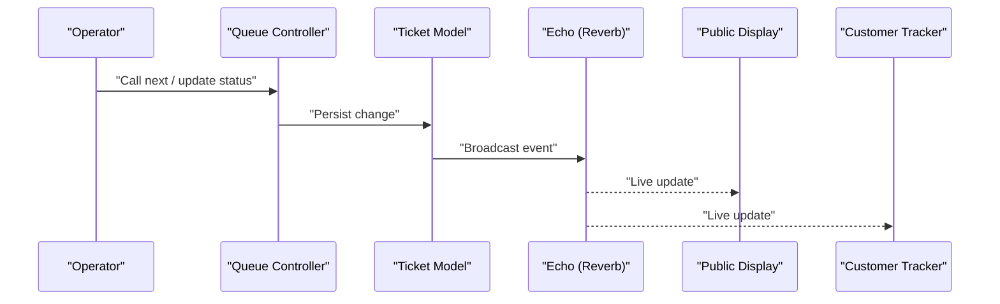
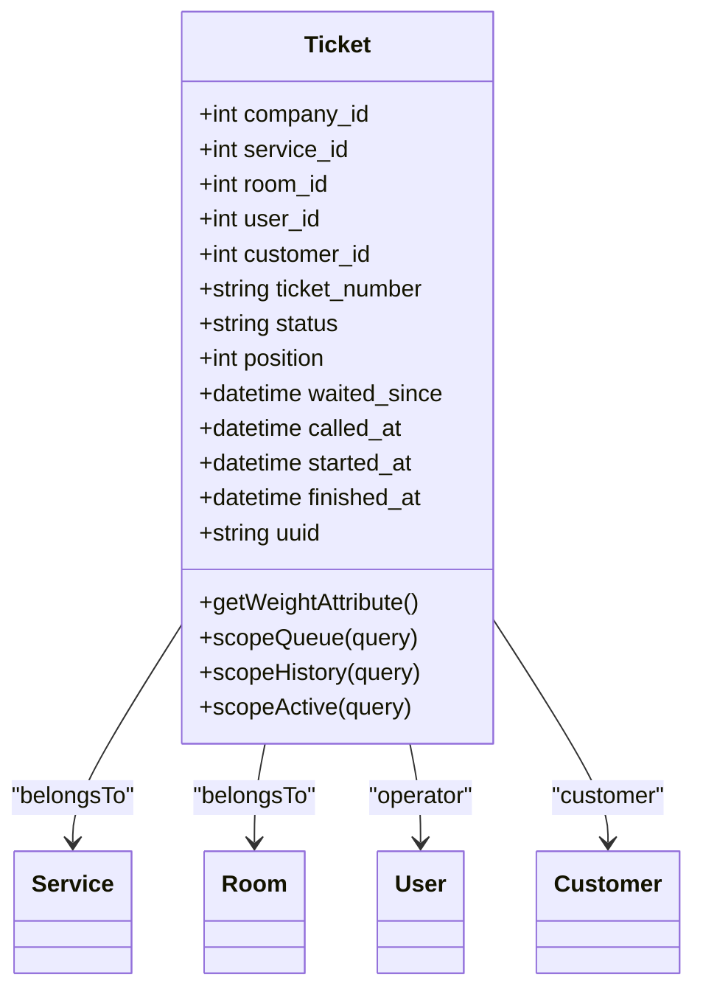
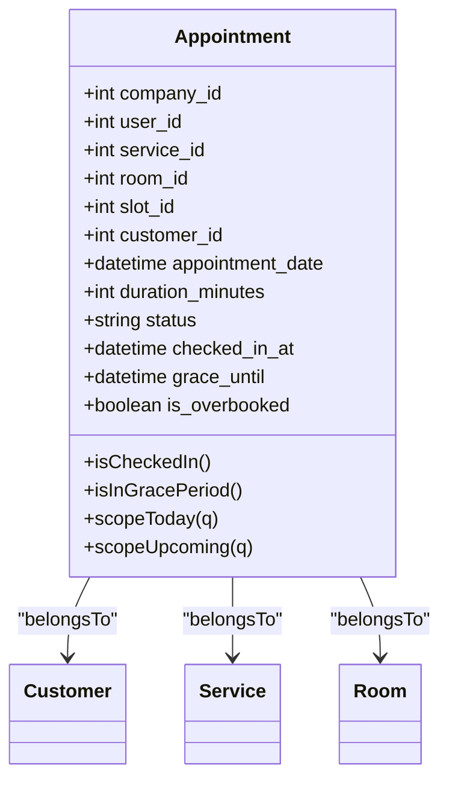
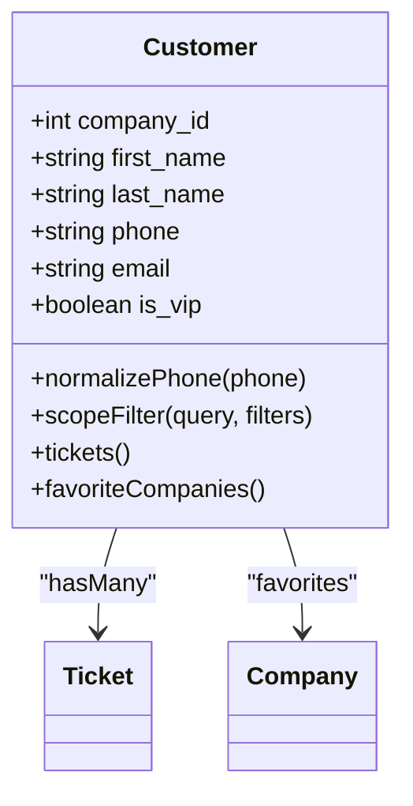
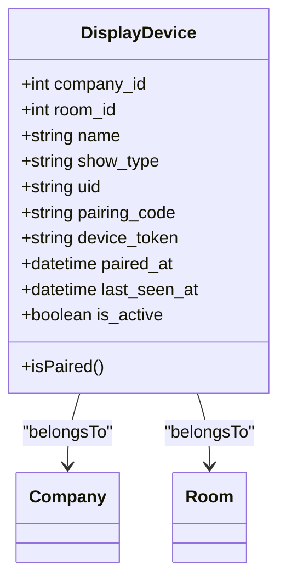
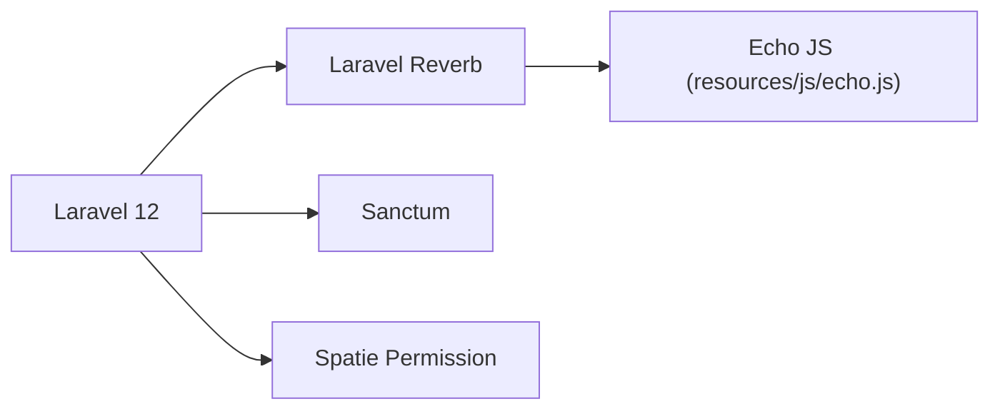

# Project Overview

<cite>
**Referenced Files in This Document**
- [README.md](file://README.md)
- [composer.json](file://composer.json)
- [config/app.php](file://config/app.php)
- [config/broadcasting.php](file://config/broadcasting.php)
- [config/reverb.php](file://config/reverb.php)
- [routes/web.php](file://routes/web.php)
- [routes/api.php](file://routes/api.php)
- [app/Http/Middleware/TenantMiddleware.php](file://app/Http/Middleware/TenantMiddleware.php)
- [app/Modules/Core/Scopes/TenantScope.php](file://app/Modules/Core/Scopes/TenantScope.php)
- [app/Services/TenantManager.php](file://app/Services/TenantManager.php)
- [app/Providers/AppServiceProvider.php](file://app/Providers/AppServiceProvider.php)
- [resources/js/echo.js](file://resources/js/echo.js)
- [app/Modules/Queue/Models/Ticket.php](file://app/Modules/Queue/Models/Ticket.php)
- [app/Modules/Appointments/Models/Appointment.php](file://app/Modules/Appointments/Models/Appointment.php)
- [app/Modules/Customers/Models/Customer.php](file://app/Modules/Customers/Models/Customer.php)
- [app/Modules/Displays/Models/DisplayDevice.php](file://app/Modules/Displays/Models/DisplayDevice.php)
</cite>

## Table of Contents
1. [Introduction](#introduction)
2. [Project Structure](#project-structure)
3. [Core Components](#core-components)
4. [Architecture Overview](#architecture-overview)
5. [Detailed Component Analysis](#detailed-component-analysis)
6. [Dependency Analysis](#dependency-analysis)
7. [Performance Considerations](#performance-considerations)
8. [Troubleshooting Guide](#troubleshooting-guide)
9. [Conclusion](#conclusion)

## Introduction
Noubtigo is a multi-tenant queue management and appointment system built with Laravel. Its purpose is to streamline customer flow for businesses by offering real-time queue management, appointment scheduling, customer relationship capabilities, and live display integration. The platform’s core value proposition lies in centralizing operations—allowing staff to manage walk-in and scheduled visits, automate queue progression, and broadcast updates to digital displays and customer portals in real time. Key differentiators include:
- Multi-tenant architecture enabling independent company silos with subdomain isolation
- Real-time WebSocket-driven updates powered by Laravel Reverb
- Unified dashboard for queue, appointments, and analytics
- Built-in CRM-like customer profiles with favorites and messaging hooks
- Flexible permissions and role-based access control

Target audience spans from small local service providers to enterprise clients requiring scalable queue and appointment orchestration across multiple locations.

## Project Structure
Noubtigo follows a Laravel application layout with a modular structure under app/Modules, separating concerns into cohesive domains such as Queue, Appointments, Customers, Displays, Payments, and Reports. Routing is split between web.php and api.php, supporting both interactive dashboards and public APIs. Broadcasting is configured via Reverb for real-time features.

**Diagram sources**
- [routes/web.php:1-293](file://routes/web.php#L1-L293)
- [routes/api.php:1-24](file://routes/api.php#L1-L24)
- [config/broadcasting.php:1-83](file://config/broadcasting.php#L1-L83)
- [app/Http/Middleware/TenantMiddleware.php:1-52](file://app/Http/Middleware/TenantMiddleware.php#L1-L52)
- [app/Services/TenantManager.php:1-46](file://app/Services/TenantManager.php#L1-L46)
- [app/Modules/Core/Scopes/TenantScope.php:1-34](file://app/Modules/Core/Scopes/TenantScope.php#L1-L34)
- [app/Providers/AppServiceProvider.php:1-59](file://app/Providers/AppServiceProvider.php#L1-L59)

**Section sources**
- [routes/web.php:1-293](file://routes/web.php#L1-L293)
- [routes/api.php:1-24](file://routes/api.php#L1-L24)
- [config/broadcasting.php:1-83](file://config/broadcasting.php#L1-L83)

## Core Components
- Multi-tenant architecture: Identified by subdomain or authenticated user, enforced globally via TenantManager and TenantScope to isolate company data.
- Real-time communication: Powered by Laravel Reverb and configured in broadcasting.php and config/reverb.php, with Echo initialized in resources/js/echo.js.
- Queue management: Centralized through Ticket model and queue controllers, supporting statuses, positions, holds, and histories.
- Appointment scheduling: Appointment model with slots, check-ins, and status badges, integrated with services and rooms.
- Customer relationship: Customer model with normalized phone handling, favorites, and portal integration.
- Display integration: DisplayDevice model with pairing and visibility modes for public displays.
- Permissions and roles: Spatie Laravel Permission integration via AppServiceProvider blade directives and middleware guards.

**Section sources**
- [app/Services/TenantManager.php:1-46](file://app/Services/TenantManager.php#L1-L46)
- [app/Modules/Core/Scopes/TenantScope.php:1-34](file://app/Modules/Core/Scopes/TenantScope.php#L1-L34)
- [app/Http/Middleware/TenantMiddleware.php:1-52](file://app/Http/Middleware/TenantMiddleware.php#L1-L52)
- [config/broadcasting.php:1-83](file://config/broadcasting.php#L1-L83)
- [config/reverb.php:1-103](file://config/reverb.php#L1-L103)
- [resources/js/echo.js:1-15](file://resources/js/echo.js#L1-L15)
- [app/Modules/Queue/Models/Ticket.php:1-257](file://app/Modules/Queue/Models/Ticket.php#L1-L257)
- [app/Modules/Appointments/Models/Appointment.php:1-183](file://app/Modules/Appointments/Models/Appointment.php#L1-L183)
- [app/Modules/Customers/Models/Customer.php:1-171](file://app/Modules/Customers/Models/Customer.php#L1-L171)
- [app/Modules/Displays/Models/DisplayDevice.php:1-79](file://app/Modules/Displays/Models/DisplayDevice.php#L1-L79)
- [app/Providers/AppServiceProvider.php:1-59](file://app/Providers/AppServiceProvider.php#L1-L59)

## Architecture Overview
Noubtigo’s architecture centers on a multi-tenant Laravel application with real-time broadcasting and modular domain services. Requests flow through TenantMiddleware to establish the tenant context, then hit route groups that enforce permissions and delegate to module-specific controllers. Models apply TenantScope automatically, ensuring data isolation. Broadcasting is configured for Reverb, enabling live updates to dashboards, displays, and customer trackers.

**Diagram sources**
- [app/Http/Middleware/TenantMiddleware.php:1-52](file://app/Http/Middleware/TenantMiddleware.php#L1-L52)
- [routes/web.php:1-293](file://routes/web.php#L1-L293)
- [config/broadcasting.php:1-83](file://config/broadcasting.php#L1-L83)
- [config/reverb.php:1-103](file://config/reverb.php#L1-L103)

## Detailed Component Analysis

### Multi-Tenant Isolation
Noubtigo isolates tenants by subdomain or authenticated user. TenantMiddleware sets the current tenant, while TenantScope applies company_id filters to queries. TenantManager stores the active company for the request lifecycle.

**Diagram sources**
- [app/Http/Middleware/TenantMiddleware.php:1-52](file://app/Http/Middleware/TenantMiddleware.php#L1-L52)
- [app/Services/TenantManager.php:1-46](file://app/Services/TenantManager.php#L1-L46)
- [app/Modules/Core/Scopes/TenantScope.php:1-34](file://app/Modules/Core/Scopes/TenantScope.php#L1-L34)

**Section sources**
- [app/Http/Middleware/TenantMiddleware.php:1-52](file://app/Http/Middleware/TenantMiddleware.php#L1-L52)
- [app/Services/TenantManager.php:1-46](file://app/Services/TenantManager.php#L1-L46)
- [app/Modules/Core/Scopes/TenantScope.php:1-34](file://app/Modules/Core/Scopes/TenantScope.php#L1-L34)

### Real-Time Broadcasting with Reverb
Broadcasting is configured via config/broadcasting.php and config/reverb.php, with resources/js/echo.js initializing Laravel Echo against the Reverb server. This enables live updates for queue changes, ticket status transitions, and display synchronization.

**Diagram sources**
- [config/broadcasting.php:1-83](file://config/broadcasting.php#L1-L83)
- [config/reverb.php:1-103](file://config/reverb.php#L1-L103)
- [resources/js/echo.js:1-15](file://resources/js/echo.js#L1-L15)
- [app/Modules/Queue/Models/Ticket.php:1-257](file://app/Modules/Queue/Models/Ticket.php#L1-L257)

**Section sources**
- [config/broadcasting.php:1-83](file://config/broadcasting.php#L1-L83)
- [config/reverb.php:1-103](file://config/reverb.php#L1-L103)
- [resources/js/echo.js:1-15](file://resources/js/echo.js#L1-L15)

### Queue Management
The Ticket model encapsulates queue logic: auto-numbering, position assignment, status tracking, VIP handling, holds, and cancellation. It integrates with services, rooms, operators, and customers, and exposes scopes for queue, history, and active states.

**Diagram sources**
- [app/Modules/Queue/Models/Ticket.php:1-257](file://app/Modules/Queue/Models/Ticket.php#L1-L257)

**Section sources**
- [app/Modules/Queue/Models/Ticket.php:1-257](file://app/Modules/Queue/Models/Ticket.php#L1-L257)

### Appointment Scheduling
Appointments tie customers to services and rooms within scheduled slots. The model supports check-in, grace periods, and status badges, with scopes for today and upcoming appointments.

**Diagram sources**
- [app/Modules/Appointments/Models/Appointment.php:1-183](file://app/Modules/Appointments/Models/Appointment.php#L1-L183)

**Section sources**
- [app/Modules/Appointments/Models/Appointment.php:1-183](file://app/Modules/Appointments/Models/Appointment.php#L1-L183)

### Customer Relationship Management
Customers can register/login via the customer portal, favorite companies, and sync tickets. Phone normalization ensures consistent contact data, and filtering scopes enable targeted reporting.

**Diagram sources**
- [app/Modules/Customers/Models/Customer.php:1-171](file://app/Modules/Customers/Models/Customer.php#L1-L171)

**Section sources**
- [app/Modules/Customers/Models/Customer.php:1-171](file://app/Modules/Customers/Models/Customer.php#L1-L171)

### Display Integration
Display devices are paired and associated with rooms, with configurable visibility modes. Public endpoints expose pairing and authorization flows for displays.

**Diagram sources**
- [app/Modules/Displays/Models/DisplayDevice.php:1-79](file://app/Modules/Displays/Models/DisplayDevice.php#L1-L79)

**Section sources**
- [app/Modules/Displays/Models/DisplayDevice.php:1-79](file://app/Modules/Displays/Models/DisplayDevice.php#L1-L79)

### High-Level Feature Overview
- Queue Management: Create, call, pass, mark done, hold/resume, cancel tickets; view history and activity logs; real-time display updates.
- Appointment Scheduling: Book, check-in, cancel, and view upcoming events; integrate with services and rooms.
- Customer Relationship: Manage customer profiles, favorites, and portal access; normalize phone numbers; sync tickets.
- Real-Time Display Integration: Pair devices, authorize displays, and publish live queue and appointment feeds.
- Analytics: Export wait-time and staff/service metrics.
- Permissions & Roles: Fine-grained access control via Spatie permissions and RBAC.

Practical examples:
- Small salon: Use queue for walk-ins, assign rooms, and show live progress on digital screens.
- Medical clinic: Schedule appointments, enforce grace periods, and broadcast availability to waiting rooms.
- Retail kiosk: Allow customers to check in via QR or code, update status in real time, and display next number.

**Section sources**
- [routes/web.php:1-293](file://routes/web.php#L1-L293)
- [routes/api.php:1-24](file://routes/api.php#L1-L24)

## Dependency Analysis
Noubtigo leverages Laravel 12, Reverb for real-time, Sanctum for API auth, and Spatie Permission for RBAC. Composer scripts streamline setup and development. Broadcasting defaults to Reverb with optional Pusher/Ably backends.

**Diagram sources**
- [composer.json:1-91](file://composer.json#L1-L91)
- [resources/js/echo.js:1-15](file://resources/js/echo.js#L1-L15)

**Section sources**
- [composer.json:1-91](file://composer.json#L1-L91)
- [config/broadcasting.php:1-83](file://config/broadcasting.php#L1-L83)
- [config/reverb.php:1-103](file://config/reverb.php#L1-L103)

## Performance Considerations
- Use tenant-aware queries: TenantScope ensures filtered reads/writes, reducing accidental cross-tenant scans.
- Optimize broadcasting: Limit channel usage to necessary channels and avoid excessive event payloads.
- Pagination: Bootstrap-based paginator is configured for efficient list rendering.
- Timezone handling: Keep application timezone UTC and convert only for display to minimize conversion overhead.

[No sources needed since this section provides general guidance]

## Troubleshooting Guide
Common issues and checks:
- Tenant not set: Verify subdomain matches company slug or user belongs to a company; confirm TenantMiddleware runs before controllers.
- Broadcasting not updating: Confirm REVERB_* environment variables, Reverb server reachable, and Echo initialization in resources/js/echo.js.
- Permissions denied: Ensure user has required permissions and roles; verify Spatie permission assignments.
- Display pairing failures: Check pairing code, device token, and authorization endpoints; confirm device is active and room assigned.

**Section sources**
- [app/Http/Middleware/TenantMiddleware.php:1-52](file://app/Http/Middleware/TenantMiddleware.php#L1-L52)
- [config/broadcasting.php:1-83](file://config/broadcasting.php#L1-L83)
- [config/reverb.php:1-103](file://config/reverb.php#L1-L103)
- [resources/js/echo.js:1-15](file://resources/js/echo.js#L1-L15)

## Conclusion
Noubtigo delivers a robust, multi-tenant solution for queue and appointment management with real-time capabilities and flexible display integration. Its Laravel foundation, combined with Reverb-powered broadcasting and strict tenant isolation, makes it suitable for diverse business sizes—from local shops to enterprise environments. The modular design and strong permissions model support scalable deployments and operational control.

[No sources needed since this section summarizes without analyzing specific files]