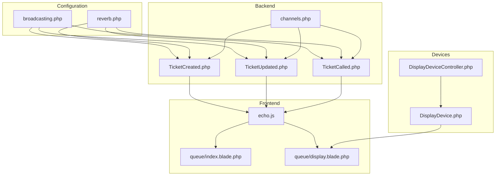
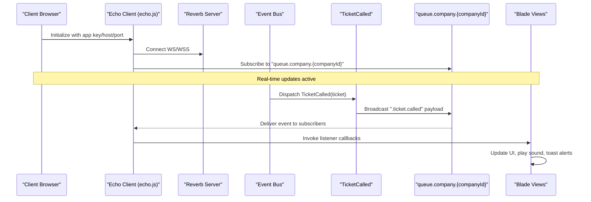
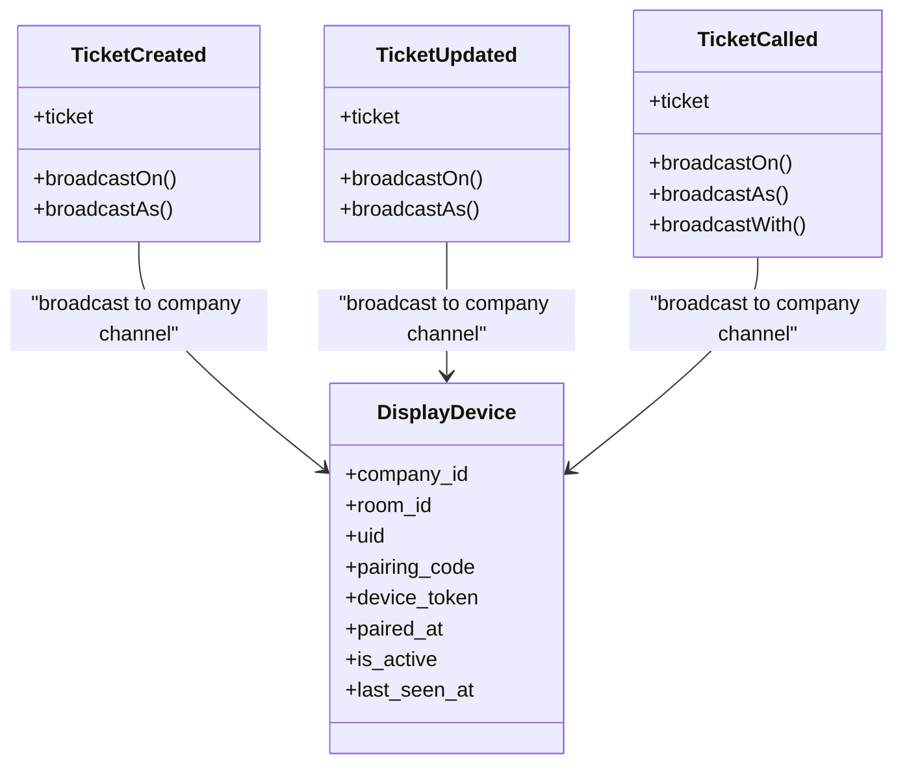
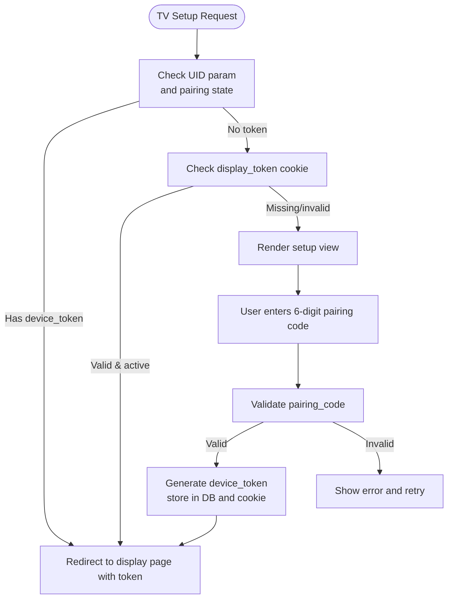
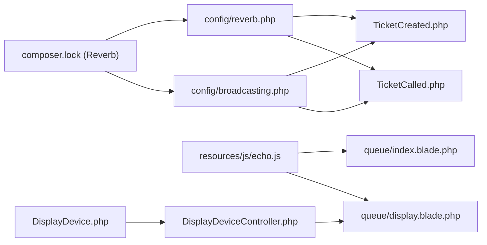

# Real-Time Systems & Events

<cite>
**Referenced Files in This Document**
- [reverb.php](file://config/reverb.php)
- [broadcasting.php](file://config/broadcasting.php)
- [channels.php](file://routes/channels.php)
- [echo.js](file://resources/js/echo.js)
- [TicketCreated.php](file://app/Modules/Queue/Events/TicketCreated.php)
- [TicketUpdated.php](file://app/Modules/Queue/Events/TicketUpdated.php)
- [TicketCalled.php](file://app/Modules/Queue/Events/TicketCalled.php)
- [DevicePaired.php](file://app/Modules/Queue/Events/DevicePaired.php)
- [DisplayDeviceController.php](file://app/Modules/Displays/Controllers/DisplayDeviceController.php)
- [DisplayDevice.php](file://app/Modules/Displays/Models/DisplayDevice.php)
- [Ticket.php](file://app/Modules/Queue/Models/Ticket.php)
- [index.blade.php](file://resources/views/queue/index.blade.php)
- [display.blade.php](file://resources/views/queue/display.blade.php)
- [2026_04_08_125059_create_display_devices_table.php](file://database/migrations/2026_04_08_125059_create_display_devices_table.php)
- [2026_04_10_133352_add_show_type_to_display_devices_table.php](file://database/migrations/2026_04_10_133352_add_show_type_to_display_devices_table.php)
- [composer.lock](file://composer.lock)
</cite>

## Table of Contents
1. [Introduction](#introduction)
2. [Project Structure](#project-structure)
3. [Core Components](#core-components)
4. [Architecture Overview](#architecture-overview)
5. [Detailed Component Analysis](#detailed-component-analysis)
6. [Dependency Analysis](#dependency-analysis)
7. [Performance Considerations](#performance-considerations)
8. [Troubleshooting Guide](#troubleshooting-guide)
9. [Conclusion](#conclusion)
10. [Appendices](#appendices)

## Introduction
This document explains Noubtigo’s real-time communication systems built on Laravel Reverb. It covers WebSocket transport, event-driven architecture, broadcast channels, and client-side integration via Echo. It documents the ticket lifecycle events (TicketCreated, TicketUpdated, TicketCalled) and their impact on display devices and client applications. It also details the device pairing system for display devices and how they receive real-time updates, along with connection management, reconnection strategies, error handling, and practical examples for extending the real-time capabilities.

## Project Structure
The real-time stack spans configuration, backend events, broadcasting, routing, and frontend integration:
- Configuration: Reverb and broadcasting drivers
- Backend: Event classes and broadcasting channels
- Routing: Authorization for private channels
- Frontend: Echo initialization and subscription patterns
- Display Devices: Pairing and token-based access

**Diagram sources**
- [broadcasting.php:1-31](file://config/broadcasting.php#L1-L31)
- [reverb.php:1-29](file://config/reverb.php#L1-L29)
- [TicketCreated.php:1-44](file://app/Modules/Queue/Events/TicketCreated.php#L1-L44)
- [TicketUpdated.php](file://app/Modules/Queue/Events/TicketUpdated.php)
- [TicketCalled.php:1-64](file://app/Modules/Queue/Events/TicketCalled.php#L1-L64)
- [channels.php:1-7](file://routes/channels.php#L1-L7)
- [echo.js:1-14](file://resources/js/echo.js#L1-L14)
- [index.blade.php:562-578](file://resources/views/queue/index.blade.php#L562-L578)
- [display.blade.php:446-480](file://resources/views/queue/display.blade.php#L446-L480)
- [DisplayDeviceController.php:72-110](file://app/Modules/Displays/Controllers/DisplayDeviceController.php#L72-L110)
- [DisplayDevice.php](file://app/Modules/Displays/Models/DisplayDevice.php)

**Section sources**
- [broadcasting.php:1-31](file://config/broadcasting.php#L1-L31)
- [reverb.php:1-29](file://config/reverb.php#L1-L29)
- [channels.php:1-7](file://routes/channels.php#L1-L7)
- [echo.js:1-14](file://resources/js/echo.js#L1-L14)
- [index.blade.php:562-578](file://resources/views/queue/index.blade.php#L562-L578)
- [display.blade.php:446-480](file://resources/views/queue/display.blade.php#L446-L480)
- [DisplayDeviceController.php:72-110](file://app/Modules/Displays/Controllers/DisplayDeviceController.php#L72-L110)
- [DisplayDevice.php](file://app/Modules/Displays/Models/DisplayDevice.php)

## Core Components
- Broadcasting configuration selects the driver and defines connections.
- Reverb configuration sets the server and runtime options.
- Event classes implement broadcasting with channel targeting and payload shaping.
- Private/public channel authorization ensures secure subscriptions.
- Echo initializes the WebSocket client and subscribes to channels.
- Display devices pair via PIN or token and render real-time updates.

Key implementation references:
- Broadcasting defaults and connections: [broadcasting.php:1-31](file://config/broadcasting.php#L1-L31)
- Reverb server configuration: [reverb.php:1-29](file://config/reverb.php#L1-L29)
- Event broadcasting channels and names: [TicketCreated.php:31-44](file://app/Modules/Queue/Events/TicketCreated.php#L31-L44), [TicketCalled.php:31-44](file://app/Modules/Queue/Events/TicketCalled.php#L31-L44)
- Channel authorization: [channels.php:5-7](file://routes/channels.php#L5-L7)
- Echo client setup: [echo.js:6-14](file://resources/js/echo.js#L6-L14)
- Display device pairing and token handling: [DisplayDeviceController.php:81-110](file://app/Modules/Displays/Controllers/DisplayDeviceController.php#L81-L110)

**Section sources**
- [broadcasting.php:1-31](file://config/broadcasting.php#L1-L31)
- [reverb.php:1-29](file://config/reverb.php#L1-L29)
- [TicketCreated.php:31-44](file://app/Modules/Queue/Events/TicketCreated.php#L31-L44)
- [TicketCalled.php:31-44](file://app/Modules/Queue/Events/TicketCalled.php#L31-L44)
- [channels.php:5-7](file://routes/channels.php#L5-L7)
- [echo.js:6-14](file://resources/js/echo.js#L6-L14)
- [DisplayDeviceController.php:81-110](file://app/Modules/Displays/Controllers/DisplayDeviceController.php#L81-L110)

## Architecture Overview
The system uses Laravel Reverb as the WebSocket server and Laravel Echo on the frontend to subscribe to channels. Events are dispatched when tickets change state and broadcast to company-scoped channels. Display devices and dashboards listen for these events to update UI and play notifications.

**Diagram sources**
- [echo.js:6-14](file://resources/js/echo.js#L6-L14)
- [TicketCalled.php:31-44](file://app/Modules/Queue/Events/TicketCalled.php#L31-L44)
- [index.blade.php:562-578](file://resources/views/queue/index.blade.php#L562-L578)

**Section sources**
- [echo.js:6-14](file://resources/js/echo.js#L6-L14)
- [TicketCalled.php:31-44](file://app/Modules/Queue/Events/TicketCalled.php#L31-L44)
- [index.blade.php:562-578](file://resources/views/queue/index.blade.php#L562-L578)

## Detailed Component Analysis

### Event-Driven Architecture
Events implement broadcasting to company-scoped channels. Each event defines:
- Channels to broadcast on
- Broadcast name
- Payload shape

**Diagram sources**
- [TicketCreated.php:12-44](file://app/Modules/Queue/Events/TicketCreated.php#L12-L44)
- [TicketUpdated.php](file://app/Modules/Queue/Events/TicketUpdated.php)
- [TicketCalled.php:12-64](file://app/Modules/Queue/Events/TicketCalled.php#L12-L64)
- [DisplayDevice.php](file://app/Modules/Displays/Models/DisplayDevice.php)

**Section sources**
- [TicketCreated.php:12-44](file://app/Modules/Queue/Events/TicketCreated.php#L12-L44)
- [TicketUpdated.php](file://app/Modules/Queue/Events/TicketUpdated.php)
- [TicketCalled.php:12-64](file://app/Modules/Queue/Events/TicketCalled.php#L12-L64)
- [DisplayDevice.php](file://app/Modules/Displays/Models/DisplayDevice.php)

### Ticket Lifecycle Events
- TicketCreated: Broadcast when a ticket is issued; payload includes ticket metadata and identifiers.
- TicketUpdated: Broadcast on ticket updates; payload includes updated fields.
- TicketCalled: Broadcast when a ticket is called; payload includes caller details and timing.

Payload schemas (selected fields):
- TicketCreated/TicketUpdated: ticket.id, ticket.ticket_number, ticket.status, ticket.room_id, ticket.customer_name, ticket.service_name
- TicketCalled: ticket.id, ticket.ticket_number, ticket.status, ticket.room_id, ticket.room_name, ticket.customer_name, ticket.service_name, ticket.called_at

Broadcast channels:
- queue.company.{companyId}

Subscription pattern:
- Echo.channel("queue.company.{companyId}").listen(".event.name", handler)

**Section sources**
- [TicketCreated.php:31-44](file://app/Modules/Queue/Events/TicketCreated.php#L31-L44)
- [TicketUpdated.php](file://app/Modules/Queue/Events/TicketUpdated.php)
- [TicketCalled.php:31-64](file://app/Modules/Queue/Events/TicketCalled.php#L31-L64)
- [index.blade.php:562-578](file://resources/views/queue/index.blade.php#L562-L578)

### Device Pairing System
Display devices are modeled with pairing attributes and lifecycle:
- uid: random pairing identifier
- pairing_code: 6-digit numeric code
- device_token: permanent auth token
- paired_at, last_seen_at, is_active

Pairing flow:
- Setup endpoint checks UID or persisted token to route to the display page.
- Authorization validates pairing code against stored device record.
- On successful pairing, device receives a persistent token stored in cookies.

**Diagram sources**
- [DisplayDeviceController.php:81-110](file://app/Modules/Displays/Controllers/DisplayDeviceController.php#L81-L110)
- [2026_04_08_125059_create_display_devices_table.php:14-27](file://database/migrations/2026_04_08_125059_create_display_devices_table.php#L14-L27)
- [2026_04_10_133352_add_show_type_to_display_devices_table.php:14-16](file://database/migrations/2026_04_10_133352_add_show_type_to_display_devices_table.php#L14-L16)

**Section sources**
- [DisplayDeviceController.php:81-110](file://app/Modules/Displays/Controllers/DisplayDeviceController.php#L81-L110)
- [2026_04_08_125059_create_display_devices_table.php:14-27](file://database/migrations/2026_04_08_125059_create_display_devices_table.php#L14-L27)
- [2026_04_10_133352_add_show_type_to_display_devices_table.php:14-16](file://database/migrations/2026_04_10_133352_add_show_type_to_display_devices_table.php#L14-L16)

### Client-Side Real-Time Integration (Echo)
Echo is initialized with Reverb as the broadcaster, using environment variables for host, port, TLS, and transports. Subscriptions occur on company-scoped channels, and listeners trigger UI updates and notifications.

Key references:
- Echo initialization: [echo.js:6-14](file://resources/js/echo.js#L6-L14)
- Dashboard subscription and handlers: [index.blade.php:562-578](file://resources/views/queue/index.blade.php#L562-L578)
- Display page refresh and UI updates: [display.blade.php:446-480](file://resources/views/queue/display.blade.php#L446-L480)

**Section sources**
- [echo.js:6-14](file://resources/js/echo.js#L6-L14)
- [index.blade.php:562-578](file://resources/views/queue/index.blade.php#L562-L578)
- [display.blade.php:446-480](file://resources/views/queue/display.blade.php#L446-L480)

### Broadcasting Channels and Authorization
- Public channels: queue.company.{companyId} for company-wide queue updates.
- Private channel authorization: user-channel pattern for personal channels.
- Reverb server selection and defaults configured in environment-aware config.

References:
- Event channels: [TicketCreated.php:33-35](file://app/Modules/Queue/Events/TicketCreated.php#L33-L35), [TicketCalled.php:33-35](file://app/Modules/Queue/Events/TicketCalled.php#L33-L35)
- Channel authorization: [channels.php:5-7](file://routes/channels.php#L5-L7)
- Broadcasting driver: [broadcasting.php:18](file://config/broadcasting.php#L18)
- Reverb server: [reverb.php:16](file://config/reverb.php#L16)

**Section sources**
- [TicketCreated.php:33-35](file://app/Modules/Queue/Events/TicketCreated.php#L33-L35)
- [TicketCalled.php:33-35](file://app/Modules/Queue/Events/TicketCalled.php#L33-L35)
- [channels.php:5-7](file://routes/channels.php#L5-L7)
- [broadcasting.php:18](file://config/broadcasting.php#L18)
- [reverb.php:16](file://config/reverb.php#L16)

### Display Device Synchronization
Display devices access the queue display page via a token. The page periodically refreshes data and updates the UI. Real-time events complement periodic polling by pushing updates immediately.

References:
- Token-based routing and setup: [DisplayDeviceController.php:81-110](file://app/Modules/Displays/Controllers/DisplayDeviceController.php#L81-L110)
- Periodic refresh and UI update logic: [display.blade.php:446-480](file://resources/views/queue/display.blade.php#L446-L480)

**Section sources**
- [DisplayDeviceController.php:81-110](file://app/Modules/Displays/Controllers/DisplayDeviceController.php#L81-L110)
- [display.blade.php:446-480](file://resources/views/queue/display.blade.php#L446-L480)

## Dependency Analysis
- Composer declares Reverb as a package provider enabling Reverb services.
- Broadcasting and Reverb configs select the driver and server.
- Events depend on the broadcasting driver and channel definitions.
- Frontend depends on Echo and environment variables for connection parameters.
- Display devices depend on pairing records and token persistence.

**Diagram sources**
- [composer.lock:1542-1580](file://composer.lock#L1542-L1580)
- [reverb.php:1-29](file://config/reverb.php#L1-L29)
- [broadcasting.php:1-31](file://config/broadcasting.php#L1-L31)
- [TicketCreated.php:12-44](file://app/Modules/Queue/Events/TicketCreated.php#L12-L44)
- [TicketCalled.php:12-64](file://app/Modules/Queue/Events/TicketCalled.php#L12-L64)
- [echo.js:1-14](file://resources/js/echo.js#L1-L14)
- [index.blade.php:562-578](file://resources/views/queue/index.blade.php#L562-L578)
- [display.blade.php:446-480](file://resources/views/queue/display.blade.php#L446-L480)
- [DisplayDeviceController.php:72-110](file://app/Modules/Displays/Controllers/DisplayDeviceController.php#L72-L110)
- [DisplayDevice.php](file://app/Modules/Displays/Models/DisplayDevice.php)

**Section sources**
- [composer.lock:1542-1580](file://composer.lock#L1542-L1580)
- [reverb.php:1-29](file://config/reverb.php#L1-L29)
- [broadcasting.php:1-31](file://config/broadcasting.php#L1-L31)
- [TicketCreated.php:12-44](file://app/Modules/Queue/Events/TicketCreated.php#L12-L44)
- [TicketCalled.php:12-64](file://app/Modules/Queue/Events/TicketCalled.php#L12-L64)
- [echo.js:1-14](file://resources/js/echo.js#L1-L14)
- [index.blade.php:562-578](file://resources/views/queue/index.blade.php#L562-L578)
- [display.blade.php:446-480](file://resources/views/queue/display.blade.php#L446-L480)
- [DisplayDeviceController.php:72-110](file://app/Modules/Displays/Controllers/DisplayDeviceController.php#L72-L110)
- [DisplayDevice.php](file://app/Modules/Displays/Models/DisplayDevice.php)

## Performance Considerations
- Prefer broadcasting only essential fields in event payloads to minimize bandwidth.
- Use company-scoped channels to limit fan-out and reduce unnecessary client processing.
- Combine periodic polling with real-time updates for resilience and completeness.
- Ensure efficient UI updates by batching DOM changes and avoiding layout thrashing.
- Monitor Reverb server resource usage and scale accordingly.

## Troubleshooting Guide
Common issues and remedies:
- Echo fails to connect
  - Verify environment variables for Reverb host, port, scheme, and app key.
  - Confirm Reverb server is running and reachable.
  - References: [echo.js:6-14](file://resources/js/echo.js#L6-L14), [reverb.php:16](file://config/reverb.php#L16)
- No events received on dashboard
  - Ensure the company ID is present and the channel subscription matches the company scope.
  - Confirm event broadcast names and channels align with client subscriptions.
  - References: [index.blade.php:562-578](file://resources/views/queue/index.blade.php#L562-L578), [TicketCreated.php:33-44](file://app/Modules/Queue/Events/TicketCreated.php#L33-L44)
- Display device not updating
  - Check pairing code validation and token issuance.
  - Verify token persistence and redirection to the display route.
  - References: [DisplayDeviceController.php:81-110](file://app/Modules/Displays/Controllers/DisplayDeviceController.php#L81-L110)
- Private channel authorization failures
  - Validate user-channel authorization logic for personal channels.
  - References: [channels.php:5-7](file://routes/channels.php#L5-L7)

**Section sources**
- [echo.js:6-14](file://resources/js/echo.js#L6-L14)
- [reverb.php:16](file://config/reverb.php#L16)
- [index.blade.php:562-578](file://resources/views/queue/index.blade.php#L562-L578)
- [TicketCreated.php:33-44](file://app/Modules/Queue/Events/TicketCreated.php#L33-L44)
- [DisplayDeviceController.php:81-110](file://app/Modules/Displays/Controllers/DisplayDeviceController.php#L81-L110)
- [channels.php:5-7](file://routes/channels.php#L5-L7)

## Conclusion
Noubtigo’s real-time system leverages Laravel Reverb and Echo to deliver immediate updates for ticket lifecycle events to dashboards and display devices. Events target company-scoped channels, ensuring scalability and security. The device pairing system secures display access via tokens, while client-side listeners orchestrate UI updates and notifications. By combining periodic polling with real-time broadcasts, the system balances responsiveness and reliability.

## Appendices

### Implementation Examples for Custom Real-Time Features
- Define a new event class implementing the broadcasting interface and specify channels and broadcast name.
  - Reference: [TicketCreated.php:12-44](file://app/Modules/Queue/Events/TicketCreated.php#L12-L44)
- Broadcast to a company-scoped channel and include a compact payload.
  - Reference: [TicketCalled.php:31-64](file://app/Modules/Queue/Events/TicketCalled.php#L31-L64)
- Subscribe on the client with Echo and update UI.
  - Reference: [index.blade.php:562-578](file://resources/views/queue/index.blade.php#L562-L578)
- Extend the device pairing model with additional fields if needed.
  - Reference: [2026_04_10_133352_add_show_type_to_display_devices_table.php:14-16](file://database/migrations/2026_04_10_133352_add_show_type_to_display_devices_table.php#L14-L16)