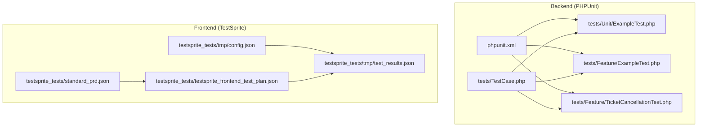
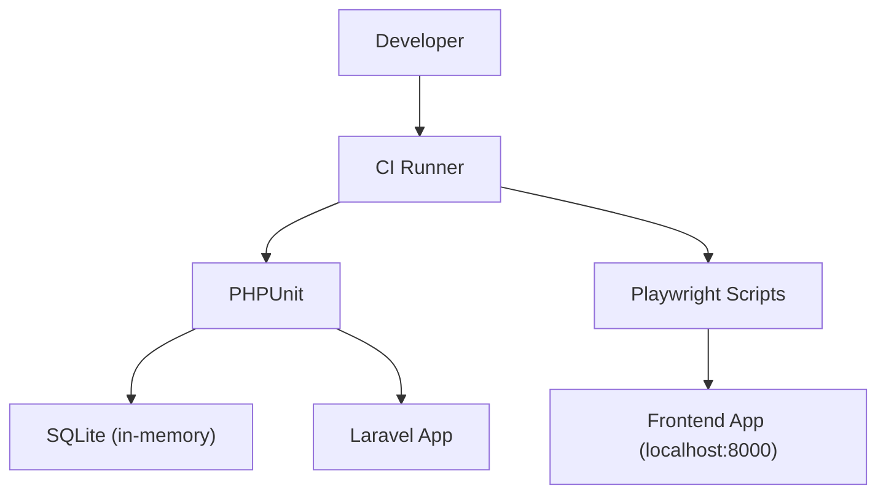
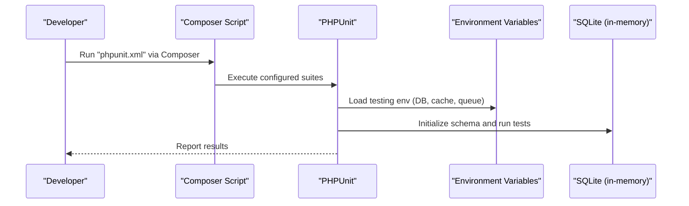
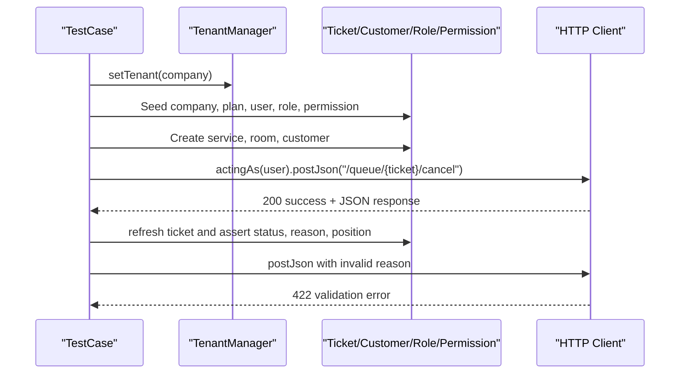
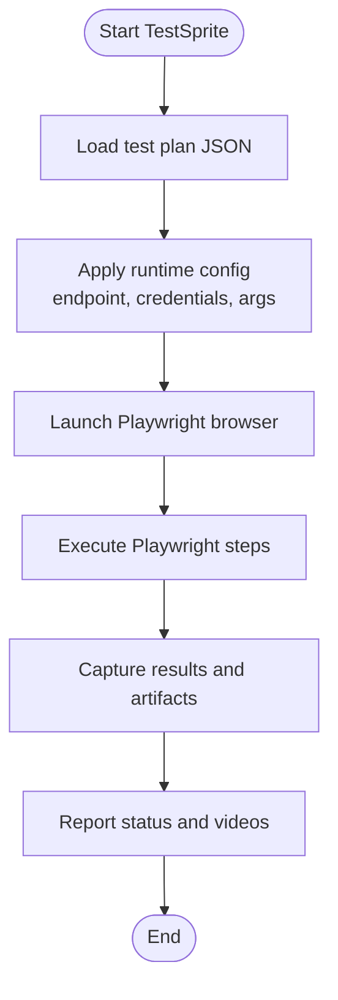
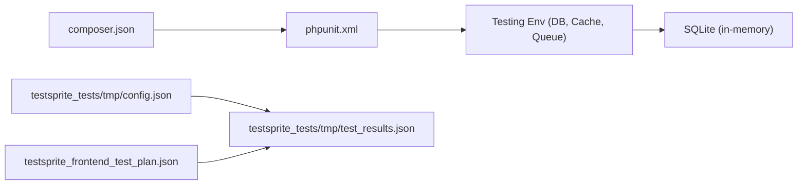

# Testing & Quality Assurance

<cite>
**Referenced Files in This Document**
- [phpunit.xml](file://phpunit.xml)
- [composer.json](file://composer.json)
- [tests/TestCase.php](file://tests/TestCase.php)
- [tests/Feature/ExampleTest.php](file://tests/Feature/ExampleTest.php)
- [tests/Feature/TicketCancellationTest.php](file://tests/Feature/TicketCancellationTest.php)
- [tests/Unit/ExampleTest.php](file://tests/Unit/ExampleTest.php)
- [testsprite_tests/testsprite_frontend_test_plan.json](file://testsprite_tests/testsprite_frontend_test_plan.json)
- [testsprite_tests/standard_prd.json](file://testsprite_tests/standard_prd.json)
- [testsprite_tests/tmp/config.json](file://testsprite_tests/tmp/config.json)
- [testsprite_tests/tmp/test_results.json](file://testsprite_tests/tmp/test_results.json)
- [config/database.php](file://config/database.php)
- [database/migrations/2026_04_06_154325_create_tickets_table.php](file://database/migrations/2026_04_06_154325_create_tickets_table.php)
- [database/migrations/2026_04_06_163000_create_customers_table.php](file://database/migrations/2026_04_06_163000_create_customers_table.php)
- [database/migrations/2026_04_06_135154_create_rbac_tables.php](file://database/migrations/2026_04_06_135154_create_rbac_tables.php)
</cite>

## Table of Contents
1. [Introduction](#introduction)
2. [Project Structure](#project-structure)
3. [Core Components](#core-components)
4. [Architecture Overview](#architecture-overview)
5. [Detailed Component Analysis](#detailed-component-analysis)
6. [Dependency Analysis](#dependency-analysis)
7. [Performance Considerations](#performance-considerations)
8. [Troubleshooting Guide](#troubleshooting-guide)
9. [Conclusion](#conclusion)
10. [Appendices](#appendices)

## Introduction
This document describes Noubtigo’s testing strategy and quality assurance practices. The project employs a dual testing approach:
- Backend testing with PHPUnit for unit, feature, and integration tests.
- Frontend test automation with TestSprite using Python-based Playwright scripts to validate user workflows across ticket queue operations, customer management, and appointment workflows.

It covers test structure, execution, continuous integration readiness, coverage configuration, environment management, debugging, performance testing, and quality metrics collection.

## Project Structure
The repository organizes tests into two primary categories:
- Backend tests under tests/ with separate directories for Unit and Feature suites.
- Frontend tests under testsprite_tests/ with JSON test plans, PRD metadata, temporary runtime configuration, and recorded test results.



**Diagram sources**
- [phpunit.xml:7-14](file://phpunit.xml#L7-L14)
- [tests/TestCase.php:1-11](file://tests/TestCase.php#L1-L11)
- [tests/Feature/ExampleTest.php:1-20](file://tests/Feature/ExampleTest.php#L1-L20)
- [tests/Feature/TicketCancellationTest.php:1-194](file://tests/Feature/TicketCancellationTest.php#L1-L194)
- [tests/Unit/ExampleTest.php:1-17](file://tests/Unit/ExampleTest.php#L1-L17)
- [testsprite_tests/testsprite_frontend_test_plan.json:1-482](file://testsprite_tests/testsprite_frontend_test_plan.json#L1-L482)
- [testsprite_tests/standard_prd.json:1-91](file://testsprite_tests/standard_prd.json#L1-L91)
- [testsprite_tests/tmp/config.json:1-20](file://testsprite_tests/tmp/config.json#L1-L20)
- [testsprite_tests/tmp/test_results.json:1-147](file://testsprite_tests/tmp/test_results.json#L1-L147)

**Section sources**
- [phpunit.xml:1-38](file://phpunit.xml#L1-L38)
- [composer.json:16-24](file://composer.json#L16-L24)
- [tests/TestCase.php:1-11](file://tests/TestCase.php#L1-L11)
- [testsprite_tests/testsprite_frontend_test_plan.json:1-482](file://testsprite_tests/testsprite_frontend_test_plan.json#L1-L482)

## Core Components
- PHPUnit configuration defines test suites, source inclusion, and environment variables optimized for testing (in-memory SQLite, array caches, sync queues, and disabled observability).
- Backend test base class extends Laravel’s base TestCase to leverage framework bootstrapping.
- Feature tests demonstrate tenant isolation, RBAC permissions, and domain-specific workflows (e.g., ticket cancellation).
- TestSprite orchestrates frontend automation with Playwright, driven by structured test plans and runtime configuration.

Key backend test files:
- [phpunit.xml:7-14](file://phpunit.xml#L7-L14): Declares Unit and Feature test suites.
- [tests/TestCase.php:1-11](file://tests/TestCase.php#L1-L11): Base test class.
- [tests/Feature/ExampleTest.php:1-20](file://tests/Feature/ExampleTest.php#L1-L20): Basic HTTP assertion example.
- [tests/Feature/TicketCancellationTest.php:1-194](file://tests/Feature/TicketCancellationTest.php#L1-L194): Tenant-aware, permission-driven ticket lifecycle test.

Key frontend test assets:
- [testsprite_tests/testsprite_frontend_test_plan.json:1-482](file://testsprite_tests/testsprite_frontend_test_plan.json#L1-L482): Test scenarios for ticket queue operations, customer management, and status transitions.
- [testsprite_tests/standard_prd.json:1-91](file://testsprite_tests/standard_prd.json#L1-L91): Product overview and feature coverage aligned with test plan.
- [testsprite_tests/tmp/config.json:1-20](file://testsprite_tests/tmp/config.json#L1-L20): Local endpoint, credentials, and execution arguments for TestSprite.
- [testsprite_tests/tmp/test_results.json:1-147](file://testsprite_tests/tmp/test_results.json#L1-L147): Recorded outcomes and artifacts for executed frontend tests.

**Section sources**
- [phpunit.xml:1-38](file://phpunit.xml#L1-L38)
- [tests/TestCase.php:1-11](file://tests/TestCase.php#L1-L11)
- [tests/Feature/ExampleTest.php:1-20](file://tests/Feature/ExampleTest.php#L1-L20)
- [tests/Feature/TicketCancellationTest.php:1-194](file://tests/Feature/TicketCancellationTest.php#L1-L194)
- [testsprite_tests/testsprite_frontend_test_plan.json:1-482](file://testsprite_tests/testsprite_frontend_test_plan.json#L1-L482)
- [testsprite_tests/standard_prd.json:1-91](file://testsprite_tests/standard_prd.json#L1-L91)
- [testsprite_tests/tmp/config.json:1-20](file://testsprite_tests/tmp/config.json#L1-L20)
- [testsprite_tests/tmp/test_results.json:1-147](file://testsprite_tests/tmp/test_results.json#L1-L147)

## Architecture Overview
The testing architecture separates concerns between backend and frontend:
- Backend: PHPUnit runs against an in-memory SQLite database configured via environment variables. Laravel’s service container and middleware stack are initialized per test.
- Frontend: TestSprite executes Playwright scripts against a local development server endpoint, validating UI flows and API interactions.



**Diagram sources**
- [phpunit.xml:20-36](file://phpunit.xml#L20-L36)
- [composer.json:51-54](file://composer.json#L51-L54)
- [testsprite_tests/tmp/config.json:5-7](file://testsprite_tests/tmp/config.json#L5-L7)

**Section sources**
- [phpunit.xml:20-36](file://phpunit.xml#L20-L36)
- [composer.json:51-54](file://composer.json#L51-L54)
- [testsprite_tests/tmp/config.json:5-7](file://testsprite_tests/tmp/config.json#L5-L7)

## Detailed Component Analysis

### Backend Test Execution and Coverage
- Suites: Unit and Feature test suites are declared in phpunit.xml and executed via Composer script.
- Environment: Testing environment variables set SQLite in-memory database, array cache/store, sync queue, and disabled observability to speed up tests and isolate state.
- Coverage: Source include directive targets app/, enabling coverage reporting for production code.



**Diagram sources**
- [phpunit.xml:7-14](file://phpunit.xml#L7-L14)
- [phpunit.xml:20-36](file://phpunit.xml#L20-L36)
- [composer.json:51-54](file://composer.json#L51-L54)

**Section sources**
- [phpunit.xml:1-38](file://phpunit.xml#L1-L38)
- [composer.json:51-54](file://composer.json#L51-L54)

### Feature Test: Ticket Cancellation Workflow
This test validates tenant scoping, RBAC permissions, and ticket lifecycle transitions:
- Sets up a tenant, plan, user with roles and permissions, service, room, and customer.
- Creates a waiting ticket and cancels it with predefined reasons, asserting persistence and state changes.
- Asserts validation errors for invalid reasons and prevents cancellation of serving tickets.



**Diagram sources**
- [tests/Feature/TicketCancellationTest.php:17-194](file://tests/Feature/TicketCancellationTest.php#L17-L194)

**Section sources**
- [tests/Feature/TicketCancellationTest.php:1-194](file://tests/Feature/TicketCancellationTest.php#L1-L194)

### Frontend Test Automation with TestSprite
TestSprite automates end-to-end user journeys using Playwright:
- Test plan defines scenarios for loading the queue, updating ticket status, creating tickets for existing/new customers, putting tickets on hold/resume, cancelling with reasons, reopening cancelled tickets, blocking submissions with missing data, and preventing invalid status transitions.
- Runtime configuration specifies the local endpoint, login credentials, and execution arguments.
- Results capture pass/fail status, error messages, and video artifacts.



**Diagram sources**
- [testsprite_tests/testsprite_frontend_test_plan.json:1-482](file://testsprite_tests/testsprite_frontend_test_plan.json#L1-L482)
- [testsprite_tests/tmp/config.json:1-20](file://testsprite_tests/tmp/config.json#L1-L20)
- [testsprite_tests/tmp/test_results.json:1-147](file://testsprite_tests/tmp/test_results.json#L1-L147)

**Section sources**
- [testsprite_tests/testsprite_frontend_test_plan.json:1-482](file://testsprite_tests/testsprite_frontend_test_plan.json#L1-L482)
- [testsprite_tests/tmp/config.json:1-20](file://testsprite_tests/tmp/config.json#L1-L20)
- [testsprite_tests/tmp/test_results.json:1-147](file://testsprite_tests/tmp/test_results.json#L1-L147)

### Test Data Modeling and Seeding
Backend tests rely on Laravel’s migration and model structure:
- Tickets table supports multi-tenant isolation, status transitions, timestamps, soft deletes, and compound indexes for dashboard queries.
- Customers table stores contact details and searchable names.
- RBAC tables define roles, permissions, and pivot tables for multi-tenant access control.

```mermaid
erDiagram
COMPANIES ||--o{ TICKETS : "has_many"
COMPANIES ||--o{ CUSTOMERS : "has_many"
COMPANIES ||--o{ USERS : "has_many"
SERVICES ||--o{ TICKETS : "has_many"
ROOMS ||--o{ TICKETS : "has_many"
CUSTOMERS ||--o{ TICKETS : "has_many"
USERS ||--o{ TICKETS : "operated_by"
TICKETS {
bigint id PK
bigint company_id FK
bigint service_id FK
bigint room_id FK
bigint user_id FK
string ticket_number
string customer_name
string customer_phone
int priority_score
boolean is_vip
int position
enum status
timestamp waited_since
timestamp called_at
timestamp started_at
timestamp finished_at
timestamps
soft_deleted
}
CUSTOMERS {
bigint id PK
bigint company_id FK
string first_name
string last_name
string phone
string email
timestamps
soft_deleted
}
ROLES {
bigint id PK
string slug UK
timestamps
}
PERMISSIONS {
bigint id PK
string slug UK
string module
timestamps
}
role_user {
bigint user_id FK
bigint role_id FK
}
permission_role {
bigint role_id FK
bigint permission_id FK
}
```

**Diagram sources**
- [database/migrations/2026_04_06_154325_create_tickets_table.php:17-52](file://database/migrations/2026_04_06_154325_create_tickets_table.php#L17-L52)
- [database/migrations/2026_04_06_163000_create_customers_table.php:14-25](file://database/migrations/2026_04_06_163000_create_customers_table.php#L14-L25)
- [database/migrations/2026_04_06_135154_create_rbac_tables.php:21-52](file://database/migrations/2026_04_06_135154_create_rbac_tables.php#L21-L52)

**Section sources**
- [database/migrations/2026_04_06_154325_create_tickets_table.php:1-63](file://database/migrations/2026_04_06_154325_create_tickets_table.php#L1-L63)
- [database/migrations/2026_04_06_163000_create_customers_table.php:1-36](file://database/migrations/2026_04_06_163000_create_customers_table.php#L1-L36)
- [database/migrations/2026_04_06_135154_create_rbac_tables.php:1-66](file://database/migrations/2026_04_06_135154_create_rbac_tables.php#L1-L66)

## Dependency Analysis
- Backend dependencies:
  - PHPUnit is declared in require-dev and invoked via Composer script.
  - phpunit.xml sets APP_ENV=testing and configures DB to SQLite in-memory.
- Frontend dependencies:
  - TestSprite runtime configuration references a local endpoint and credentials.
  - Playwright scripts are generated from the test plan and executed against the frontend.



**Diagram sources**
- [composer.json:16-24](file://composer.json#L16-L24)
- [composer.json:51-54](file://composer.json#L51-L54)
- [phpunit.xml:20-36](file://phpunit.xml#L20-L36)
- [testsprite_tests/tmp/config.json:1-20](file://testsprite_tests/tmp/config.json#L1-L20)
- [testsprite_tests/tmp/test_results.json:1-147](file://testsprite_tests/tmp/test_results.json#L1-L147)
- [testsprite_tests/testsprite_frontend_test_plan.json:1-482](file://testsprite_tests/testsprite_frontend_test_plan.json#L1-L482)

**Section sources**
- [composer.json:16-24](file://composer.json#L16-L24)
- [composer.json:51-54](file://composer.json#L51-L54)
- [phpunit.xml:20-36](file://phpunit.xml#L20-L36)
- [testsprite_tests/tmp/config.json:1-20](file://testsprite_tests/tmp/config.json#L1-L20)
- [testsprite_tests/tmp/test_results.json:1-147](file://testsprite_tests/tmp/test_results.json#L1-L147)
- [testsprite_tests/testsprite_frontend_test_plan.json:1-482](file://testsprite_tests/testsprite_frontend_test_plan.json#L1-L482)

## Performance Considerations
- Backend:
  - Use array cache/store and sync queue to minimize overhead during tests.
  - SQLite in-memory database reduces disk I/O and enables fast teardown.
  - RefreshDatabase trait resets schema per test; consider lightweight fixtures for heavy suites.
- Frontend:
  - Headless Chromium with fixed viewport improves reproducibility and speed.
  - Prefer explicit waits and stable selectors to reduce flakiness.
  - Limit concurrent browser instances to avoid resource contention.

[No sources needed since this section provides general guidance]

## Troubleshooting Guide
- Backend test failures:
  - Verify environment variables in phpunit.xml are loaded and DB connection is SQLite in-memory.
  - For foreign key constraint errors, check DB_FOREIGN_KEYS setting and migration order.
  - Use database snapshots or lightweight factories to reproduce state consistently.
- Frontend test failures:
  - CSRF token mismatches observed in test results indicate stale tokens; reload pages to refresh tokens before form submission.
  - Inspect test results JSON for specific error messages and video links to diagnose UI interactions.
  - Ensure the local endpoint matches the configured port and that credentials are correct.

**Section sources**
- [phpunit.xml:20-36](file://phpunit.xml#L20-L36)
- [testsprite_tests/tmp/test_results.json:88-96](file://testsprite_tests/tmp/test_results.json#L88-L96)
- [testsprite_tests/tmp/config.json:5-7](file://testsprite_tests/tmp/config.json#L5-L7)

## Conclusion
Noubtigo’s testing strategy combines robust backend PHPUnit tests with comprehensive frontend automation via TestSprite. The backend leverages Laravel’s testing facilities with an in-memory SQLite database and strict environment controls. The frontend automation validates critical user workflows and records outcomes for traceability. Together, these practices enable reliable feature delivery, maintainable test suites, and actionable quality metrics.

[No sources needed since this section summarizes without analyzing specific files]

## Appendices

### Test Execution Commands
- Backend: Composer script invokes Laravel’s test command with cached config cleared.
- Frontend: Execute TestSprite against the configured local endpoint using Playwright.

**Section sources**
- [composer.json:51-54](file://composer.json#L51-L54)
- [testsprite_tests/tmp/config.json:5-7](file://testsprite_tests/tmp/config.json#L5-L7)

### Test Coverage Requirements
- Source include in phpunit.xml targets app/ for coverage reporting.
- Recommended thresholds: Maintain high coverage for core modules (Queue, Customers, RBAC) and critical API endpoints.

**Section sources**
- [phpunit.xml:15-19](file://phpunit.xml#L15-L19)

### Guidelines for Writing Effective Tests
- Backend:
  - Use RefreshDatabase for isolation; seed minimal data required for the scenario.
  - Validate both positive and negative paths (e.g., invalid reason triggers validation).
  - Mock external integrations (e.g., payment providers) to keep tests deterministic.
- Frontend:
  - Prefer stable selectors and explicit waits; avoid brittle XPath reliance.
  - Split long flows into smaller, focused tests for easier maintenance.
  - Record and review video artifacts to identify UI regressions.

[No sources needed since this section provides general guidance]

### Testing Real-Time Features
- For real-time components, stub or simulate event emissions and verify UI updates.
- Use deterministic time controls where applicable to test timing-sensitive flows.

[No sources needed since this section provides general guidance]

### Continuous Integration Setup
- Integrate Composer script “test” to run PHPUnit suites.
- Frontend automation can be scheduled to run against a staging or ephemeral environment.

**Section sources**
- [composer.json:51-54](file://composer.json#L51-L54)